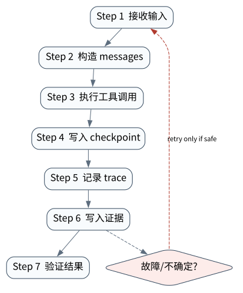

# AI Agent Systems：从生成模型到可治理行动系统

> **本章核心判断**：Agent 的系统本质是把概率性行动建议置于确定性的身份、授权、执行、状态与验证边界之内。

> 版本边界：本章的协议、框架与研究事实截至 **2026-09-11**。核心实验完全离线、无 API key；它证明的是仓库内 Runtime 的机制，不冒充真实模型质量或外部 SDK 互操作证据。


## 问题背景与学习目标

语言模型可以生成一段看似合理的“下一步”，但 Agent 系统必须对外部世界承担后果。二者的根本差别不是有没有 `while` 循环，而是系统是否把不确定的建议变成了**受约束、可中断、可恢复、可验证的行动**。如果模型输出“轮换生产凭据”，真正危险的不是这句话生成得不流畅，而是软件是否会把它直接当成已授权事实。

本章建立全书统一的系统边界。完成后，读者应能：

- 区分模型、Agent、Workflow、Runtime 与 Harness，不再把产品名当作架构；
- 用“提议—授权—执行—观察—验证”描述一次行动，而不是用“调用成功”掩盖中间状态；
- 写出安全性、不变式、活性与证据等级，并知道它们不能彼此替代；
- 读懂一个高风险动作的 action-bound approval 与 effect receipt；
- 亲自注入过期审批，证明系统在真实工具函数被注册的情况下仍然零副作用。

## 核心概念与系统直觉

### Agent 不是“更长的提示词”

从系统论角度，一个可执行 Agent 可抽象为：

$$
S_{t+1},\ I_t = \Pi_\theta(O_t, C_t, S_t, G, \mathcal{T});\qquad
E_t = K(I_t, P_t, A_t)
$$

其中模型策略 $\Pi_\theta$ 根据观察 $O_t$、上下文 $C_t$、状态 $S_t$、目标 $G$ 与工具目录 $\mathcal{T}$ 产生**意图** $I_t$；可信 Runtime $K$ 再结合策略 $P_t$ 和授权 $A_t$ 决定是否形成外部效果 $E_t$。模型能提出动作，不等于模型拥有执行权。

“Agent 性”至少有三个正交维度：

- **策略自主性**：下一步由固定规则、模型策略还是二者共同决定；
- **行动权限**：只能读、能写、能否跨安全域以及谁能批准；
- **时间持续性**：单次响应、短循环，还是跨小时/跨进程的 durable run。

因此 Workflow 与 Agent 不是二元对立。确定性流程也可以包含模型节点；高度自主的模型也应被确定性安全门约束。工程目标不是最大化自主性，而是在收益、风险和可验证性之间选择最小必要自主性。

### 四个平面与三个边界

本书把系统拆成四个平面：

- **决策面**：模型、规划器、检索与上下文组装，负责提出候选动作；
- **执行面**：工具注册表、调度器、超时、幂等键与结果关联，负责实施动作；
- **治理面**：身份、租户、策略、审批、预算与沙箱，决定什么动作被允许；
- **证据面**：事件、trace、checkpoint、journal、receipt 与 verifier，回答实际发生了什么。

三个不可混淆的边界是：模型输出不是工具意图，工具返回不是已确认副作用，最终文本不是任务完成证明。后续 40 章都围绕这三处边界展开。

### Harness 才是能力的承载体

模型是概率策略的一部分；Harness 承载上下文管理、工具协议、文件系统、终端、浏览器、checkpoint 和验证器。相同模型放入不同 Harness，会表现出不同的可完成任务集合与故障分布。这也是为什么只比较模型榜单，无法推断一个生产 Agent 的可靠性。

## 原理与理论基础

### 从理性 Agent 到受约束的部分可观测控制

经典理性 Agent 选择最大化期望效用的动作。现实软件 Agent 更接近带约束的 POMDP：真实环境状态不可完全观察，工具观测有延迟和错误，动作存在成本与风险，模型只看到经过选择的上下文。形式上可以写为：

$$
\pi^* = \arg\max_\pi\; \mathbb{E}\!\left[\sum_t \gamma^t r_t\right]
\quad \text{s.t.}\quad
\Pr_\pi[\neg \mathcal{I}] \le \epsilon,\; B(\tau)\le b,\; A(a_t)=\text{allow}
$$

$\mathcal I$ 是必须持续成立的不变式，$B$ 是预算函数，$A$ 是授权判定。生产系统通常无法证明模型策略本身安全，所以把约束下沉到模型不能绕过的 Runtime。

### 安全性、活性与完成性

- **安全性**回答“坏事永不发生”，例如未获特定动作审批时副作用数始终为 0；
- **活性**回答“好事最终能发生”，例如批准后且依赖可用时 run 不会永久停留在等待态；
- **完成性**回答业务后置条件是否被独立验证，而不是流程是否走到 `FINISHED` 字符串。

只做 fail-closed 可以提高安全性，却可能牺牲活性；只追求自动完成则可能越过授权。成熟系统同时定义超时、升级、补偿与人工接管。

### 核心不变量

> **Invariant**：without an approval bound to the current run, action, and canonical arguments, external effect count must remain zero

本章实验验证：

$$
\neg ValidApproval(run\_id, action\_id, args\_hash)
\Rightarrow EffectCount=0
$$

审批必须绑定 run、具体 action 以及参数摘要。仅保存 `approved=true` 会产生 TOCTOU 漏洞：审批后模型或调用方可替换参数。完成还需要可核验的 effect receipt，而不是把模型的自然语言总结当回执。

## 关键机制与执行流程



一次高风险行动的正确顺序是：

1. 接收目标并建立稳定 `run_id`；
2. 模型产生工具提议，Runtime 规范化参数并生成 `action_id`；
3. 在外部调用前持久化 intent 和审批等待态；
4. 审批主体对特定 action 作出决定；
5. Runtime 重新加载状态并校验绑定关系；
6. 只有校验通过才调用工具，并把 receipt 写入 journal；
7. verifier 根据外部观察判定后置条件；
8. 生成给用户的解释，但解释不改变证据事实。

### 关键崩溃窗口

最危险的窗口发生在“请求已发出、结果未持久化”。这时不能凭超时猜测动作未发生。读操作通常可重试；带幂等键的写操作可安全重放；不可幂等写操作必须进入 `UNKNOWN`，通过对账或补偿解决。第 18 与第 33 章会把这一点扩展为 durable execution 和 effect recovery。

## 从原理到实现

### action-bound approval 的实验入口

章节入口不内嵌另一套玩具逻辑，而是调用统一场景：

```python
from agentlab.course_scenarios import run_scenario

normal = run_scenario("foundation", fault=False)
stale = run_scenario("foundation", fault=True)

assert normal.observation["effect_count"] == 1
assert normal.observation["receipt_verified"] is True
assert stale.observation["resume_status"] == "WAITING_APPROVAL"
assert stale.observation["effect_count"] == 0
assert stale.evidence_level == "L3_CONTAINED"
```

真实实现位于 `course_scenarios.foundation`：它注册一个确实会向 `effects` 写入回执的高风险工具，通过 `AgentRuntime` 运行，再以正确或过期 `action_id` 恢复。故障路径不是伪造一条错误日志，而是让真实执行入口面对错误授权。

### 证据由事实推导，而非按实验名授予

```python
@property
def evidence_level(self) -> EvidenceLevel:
    if not self.fault_injected:
        return EvidenceLevel.L1_MECHANISM
    if self.recovered:
        return EvidenceLevel.L4_RECOVERED
    if self.contained:
        return EvidenceLevel.L3_CONTAINED
    if self.system_detected:
        return EvidenceLevel.L2_DETECTED
    return EvidenceLevel.L2_ORACLE_ONLY
```

这是研究可信度的关键：`passed=true` 只表示 oracle 得到预期观察。只有 `system_detected=true` 且 `contained=true`，才能声称被测组件约束了故障；只有业务状态完成对账或补偿，才可升到 L4。Core Lab 不会因测试绿色就冒充 L5 外部证据。

### 关键断点

调试时依次停在 `AgentRuntime.run()` 的意图持久化、审批绑定校验、`ToolRegistry.execute()` 和 journal commit 处。若副作用先于 intent 持久化，崩溃恢复会失去依据；若比较的是布尔审批而非 action identity，则过期批准可能复用。

## 主流系统实现对照与源码阅读入口

[ReAct](https://arxiv.org/abs/2210.03629) 展示了推理与行动交错的策略形态，[Toolformer](https://arxiv.org/abs/2302.04761) 研究模型学习何时调用工具；它们解释决策能力，却不自动提供授权、审计或恢复。工程框架则在模型之外补足 Runtime：

| 项目 | 值得读取的机制 | 不应过度推断 |
|---|---|---|
| [OpenAI Agents SDK](https://github.com/openai/openai-agents-python) | RunState、tool、guardrail、handoff、trace | SDK 存在不等于你的工具副作用可恢复 |
| [LangGraph](https://github.com/langchain-ai/langgraph) | graph state、interrupt、checkpoint | checkpoint 不等于外部数据库事务 |
| [Google ADK](https://github.com/google/adk-python) | runner、session、event、workflow agent | session 持久化不等于跨系统 exactly-once |
| [Microsoft Agent Framework](https://github.com/microsoft/agent-framework) | workflow、checkpoint、request/response | preview/版本 API 不能当永久协议 |

源码阅读顺序应从状态结构和持久化点开始，再看工具调用与异常路径，最后才看模型适配器。只读“快速开始”最容易把便利 API 误认为可靠性语义。

## 设计方案与方法对比

| 方案 | 决策弹性 | 可验证性 | 典型适用范围 |
|---|---:|---:|---|
| 固定 Workflow | 低 | 高 | 稳定流程、监管操作、批处理 |
| 模型选择受限节点 | 中 | 较高 | 分类路由、检索、有限工具集 |
| Planner + 确定执行器 | 高 | 中高 | 开放任务但动作可枚举 |
| 自由 Agent Loop | 很高 | 低 | 探索、低风险研究、强沙箱 |

高风险系统通常采用 Hybrid Control：模型负责歧义消解和候选方案，代码负责身份、权限、预算、状态转移和副作用。这里的“确定性”是相对模型采样而言，不代表底层分布式系统不会失败。

## 可复现实验

### 实验环境

- Python `>=3.11,<3.14`，macOS/Linux，`arm64` 与 `x86_64` 均可；
- 从仓库根目录执行，`PYTHONPATH=src`；
- 不需要网络、Docker 或 API key；临时 checkpoint/journal 在隔离目录创建；
- 真实模型与上游 SDK 实验属于 `integrations/`，不得用本实验结果替代。

### Lab 01A — 有效审批后唯一提交

```bash
PYTHONPATH=src python3 examples/chapters/ch01_foundation.py
```

实际输出中的决定性字段应为：`first_status=WAITING_APPROVAL`、`resume_status=FINISHED`、`approval_bound=true`、`effect_count=1`、`receipt_verified=true`。验收不看文案是否“像成功”，只看唯一效果与回执。

完整手册：[Lab 01A](../../../labs/core/lab-01A-foundation.md)。

### Lab 01B — 过期 action_id

```bash
PYTHONPATH=src python3 examples/chapters/ch01_foundation.py --fault
```

实际输出应保持 `resume_status=WAITING_APPROVAL`、`effect_count=0`，并给出 `L3_CONTAINED`。验收条件是错误审批确实到达同一恢复入口、系统检测并阻断，而非脚本提前退出。完整手册：[Lab 01B](../../../labs/core/lab-01B-foundation-fault.md)。

## 工程场景与系统设计

以生产事故 `INC-2048` 为例，模型可以读取告警、提出轮换 `payments-api` 凭据并解释原因；但租户身份、允许的服务范围、变更窗口、审批人、action digest、secret backend 权限和事后健康检查必须由外围系统约束。建议把端到端 SLO 拆为：建议延迟、审批等待、工具执行、可见性延迟与验证延迟，否则一个总耗时无法定位瓶颈。

上线前至少补齐：稳定身份与租户边界、最小权限凭据、参数规范化、幂等或对账策略、取消传播、预算、敏感信息脱敏、不可篡改审计、外部 verifier、人工接管以及恢复演练。

## 故障模型、失败模式与排错

| 失败模式 | 可观察信号 | 正确处置 |
|---|---|---|
| 模型虚构完成 | 无 effect receipt，只有最终文本 | 标记未验证，不更新业务完成态 |
| 过期审批复用 | action/run/args digest 不匹配 | fail-closed，重新发起审批 |
| 工具超时且副作用未知 | 请求发出但无确定响应 | 进入 `UNKNOWN`，查询外部事实 |
| 重复投递 | 相同幂等键或 call identity 重现 | 返回既有 receipt，不重复写 |
| verifier 与工具返回矛盾 | 工具称成功、外部状态未变化 | 以外部后置条件为准并告警 |

排错要先重建事件时间线，再检查身份、状态版本和 effect journal，最后才复现模型输出。直接“重跑一次 Agent”可能把一次故障变成两次副作用。

## 性能、可靠性与工程化

首要指标不是 token 数，而是决策与副作用质量：`unauthorized_effect_total`、`ambiguous_effect_total`、`duplicate_effect_total`、审批绑定失败率、verified completion rate、人工接管率、每个 verified task 的成本与 p95/p99 延迟。

优化顺序应是：先消除错误副作用和不可恢复窗口，再减少工具往返与上下文，最后优化模型成本。并发扩展前必须验证同一 run 的 CAS/fencing；缓存只能缓存纯读结果或带明确失效语义的产物。

## 技术边界与设计取舍

本章 Runtime 是可检查的参考语义，不是分布式事务协调器。文件 checkpoint 在单机上提供原子替换和版本比较，但不提供跨主机共识；内存 `effects` 仅用作独立 oracle，不声称等价于云 IAM 或 secret manager。离线 `ScriptedModel` 让控制流可重复，却没有测量真实模型的任务成功率、漂移或注入鲁棒性。

这类边界必须写在结论旁边：机制验证回答“代码是否按契约工作”，外部有效性回答“真实环境、真实模型和真实负载下是否仍成立”。两者都重要，但证据不可串级。

## 前沿研究与演进方向

截至 2026-09-11，前沿焦点已经从“模型能否调用工具”转向长时程可靠性、动态环境、权限传播、协议互操作与可审计优化。[Agent Planning Benchmark](https://arxiv.org/abs/2606.04874) 把损坏/多余工具和不可解任务纳入评测，说明“拒绝无解或缺能力的任务”本身就是能力；[Agent Memory as a System](https://arxiv.org/abs/2606.06448) 则推动把记忆视为带治理和生命周期的系统，而非简单向量库。

仍未解决的核心问题包括：如何对随机策略给出可组合的安全保证；如何评价跨小时、跨工具、外部状态持续变化的任务；如何证明代理链中的授权未被放大；如何在不保存私有思维链的前提下保留足够的决策证据；以及如何让 learned policy 的持续改进不破坏既有安全不变量。

### 深度审计与研究证据链：系统边界

本章论证由三类证据构成：经典控制/Agent 理论给出问题形式，ReAct/Toolformer/APB 等论文界定模型行动与评测前沿，仓库 Runtime 的实际状态和 effect oracle 验证局部机制。官方框架链接是源码阅读入口，不是本项目已复现实验的替代品；L5 结论只引用 `integrations/` 中带版本、运行记录与 verifier 的证据包。

## 本章总结与进阶实践

本章最重要的结论只有一句：**模型负责提出可能有用的动作，系统负责决定它是否有权成为现实，并证明现实中发生了什么。** Agent 的本质不是循环次数，而是带状态、行动能力和反馈的受约束闭环。

进阶实践应尝试把审批绑定从 `action_id` 扩展到规范化参数摘要与过期时间，再加入一次“工具已提交但响应丢失”的不确定副作用；要求系统不得盲重试，并设计 verifier 完成对账。

### 思考题与实践

1. 为什么“模型返回 JSON”不能证明动作安全？给出至少三个模型之外的必要条件。
2. Workflow 与 Agent 应如何按策略自主性、行动权限、时间持续性定位，而不是二分？
3. `FINISHED` 状态、工具 `COMMITTED` 和业务目标 verified completion 有何区别？
4. 为凭据轮换设计 action-bound approval 的最小数据结构，并指出 TOCTOU 风险。
5. 设计一个可区分 L2、L3 与 L4 的故障实验。

参考答案不与题目紧邻，统一收录在[附录 G：第一篇问题参考答案](../appendix-g-part1-solutions.html#part1-solutions-ch01)。
