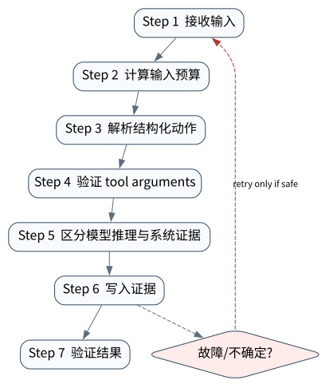

# 模型基座：Token、结构化生成、工具调用与推理接口

> **本章核心判断**：Agent Runtime 的上层行为最终受模型输入输出接口约束。本章只讨论与 Agent 系统直接相关的模型能力：token/context、structured output、tool calling、reasoning 与多模态接口，不把模型服务当成不可解释的黑盒。

上一章：AI Agent Systems：从模型调用到可运行系统。本章把前一章已经建立的能力进一步推进到 `Token/Context window`；下一章将进入：Context Engineering：信息进入模型之前已经决定了一半结果。


## 问题背景与学习目标

Agent Runtime 的上层行为最终受模型输入输出接口约束。本章只讨论与 Agent 系统直接相关的模型能力：token/context、structured output、tool calling、reasoning 与多模态接口，不把模型服务当成不可解释的黑盒。

在本章的 `Token/Context window` 场景中，真实 Agent 系统与普通“问答程序”的差异，在于一次任务会跨越模型、工具、状态、外部环境和人工治理边界。本章所有原理、代码与实验都围绕这些可验证问题展开。


**本章完成标准：**

- **机制理解**：能够解释“Agent Runtime 的上层行为最终受模型输入输出接口约束。本章只讨论与 Agent 系统直接相关的模型能力：token/context、structured output、tool calling、reasoning 与多模态接口，不把模型服务当成不可解释的黑盒。”，并指出它对应的确定性软件边界；
- **正确性判断**：能够针对 `model output crossing a software boundary must be parsed and validated` 构造一个反例，说明证据不足时系统为什么不能继续乐观执行；
- **实验与迁移**：运行 `Lab 02A` / `Lab 02B`，分别说明 normal/fault 的 evidence level，并把同一机制映射到至少一个上游实现或协议。

## 核心概念与系统直觉

本节不把概念当作术语清单，而是回答三个工程问题：它**是什么**、在系统里**负责什么**、以及它失效时**会留下什么可观测证据**。

### Token/Context window

**定义。** Token 是模型处理文本与多模态序列的计量单元；context window 是一次推理可直接注意到的输入/输出序列预算，而不是长期记忆数据库。

**系统责任。** Context window 决定短期可见性和成本。Runtime 应把不可丢的业务状态放在外部 store，把可重建摘要、证据片段和当前任务状态按需装入窗口。

**失败边界。** 把“窗口变大”等同于“无需 memory/context engineering”会导致成本、延迟和干扰一起上升。指标应看有效信息密度、cache 命中和被截断的重要状态。

### Structured generation

**定义。** Structured generation 用 schema、grammar 或 constrained decoding 把模型输出限制为机器可解析对象，例如 action、arguments、plan node 或 verdict。

**系统责任。** 它的价值不是 JSON 看起来整齐，而是让 Runtime 在执行前完成类型、枚举、范围和必填字段验证，并把自然语言建议与可执行指令分开。

**失败边界。** 结构化输出不能保证语义正确；合法 JSON 仍可能请求错误账户或危险参数。因此 schema validation 后仍需要 policy 与 domain verifier。

### Tool‑call contract

**定义。** Tool‑call contract 定义工具名称、参数类型、权限语义、错误模型、幂等性、超时和返回值含义，是模型与执行层之间的 API 合约。

**系统责任。** 模型看到的是 affordance；Runtime 看到的是可执行 contract。高风险工具应额外声明 side‑effect level、approval requirement、idempotency/reconciliation 能力。

**失败边界。** 只有 name/description/JSON schema 而没有错误与副作用语义，会让 Agent 无法区分 retryable failure、NOT_APPLIED 和 UNKNOWN。

### Reasoning boundary

**定义。** Reasoning boundary 是“模型可以自由推理什么”与“系统必须用可验证软件决定什么”的分界。模型擅长开放解释、候选生成和模糊匹配，软件擅长权限、计数、事务、约束和判定。

**系统责任。** 工程设计应把关键不变量移出语言空间，例如余额不能为负、审批人不能是申请人、 发布必须通过测试。模型可以建议，但 verifier 决定是否推进。

**失败边界。** 把安全规则仅写进 system prompt 等于让被约束主体同时解释约束；模型能力越强， 这个边界越需要显式化。

## 原理与理论基础

### 系统不变量

> **Invariant**：model output crossing a software boundary must be parsed and validated

不变量与普通“最佳实践”不同：最佳实践可以因为场景变化而替换，不变量一旦被破坏，系统就失去本章希望保证的正确性。例如 `把模型字符串直接当作可信指令` 并不是一个 UI 问题，而是说明某个状态已经无法从证据中唯一判断。


### 故障模型

本章优先把 “把模型字符串直接当作可信指令”、“忽略 schema 校验”、“把隐藏推理当作审计证据” 作为可证伪故障，而不是泛化地枚举所有异常。对涉及外部 effect 的失败，判定顺序固定为“最后 durable state → effect 是否可能发生 → 现有 observation 是否足够决定下一步”；证据不足时停在 UNKNOWN/显式失败。

### Why / What if / Trade-off

本章真正的设计取舍不是“使用更强模型还是写更多规则”，而是确定 **Token/Context window** 与 **Structured generation** 分别应该由概率性决策还是确定性软件拥有。模型可以帮助识别候选路径，但它不会自动消除“把模型字符串直接当作可信指令”这类系统失败；该失败必须由 runtime 的 schema、状态机、权限或 verifier 显式约束。

如果把 Token/Context window 完全交给模型，系统会把不可验证的语言判断混入执行事实；如果把 Structured generation 全部硬编码为固定 workflow，又会失去开放任务所需的适应性。更稳健的边界是：让模型负责提出候选决策，让软件负责 `计算输入预算`、`区分模型推理与系统证据` 以及对不变量 **model output crossing a software boundary must be parsed and validated** 的检查。

**What if。** 一旦“忽略 schema 校验”发生，系统首先需要判断现有证据是否足够决定下一状态；证据不足时应停在显式失败或待协调状态，而不是让模型用自然语言补全事实。这个边界决定了本章方案是否具有可恢复性，而不只是演示效果。


### 形式化模型与可证伪假设

$$
P(\mathrm{success})=P(V_{syntax})\,P(V_{semantic}\mid V_{syntax})\,P(V_{effect}\mid V_{semantic})
$$

结构化输出只保证“可以解析”，不保证语义正确，更不保证外部效果已经发生。应把 syntax、semantic 和 effect verification 三层分开测量。

**可证伪假设。** 若只用 schema-valid 作为成功条件，工具型任务的真实错误率会被系统性低估。

**建议测量。** schema-valid rate、semantic-valid rate、effect-verified rate、repair turns。

## 关键机制与执行流程



**Step 1 — 计算输入预算。** `计算输入预算` 负责形成后续决策的输入。需要同时保存来源、版本/时间与必要的关联标识，避免把“当前看到的数据”误当成永远有效的事实。进入下一阶段前，对结构、权限和来源做最小验证，使 `Token/Context window` 的状态能够在 trace 中被复现。

**Step 2 — 解析结构化动作。** 这一阶段可能改变系统或外部环境，因此 `解析结构化动作` 不能只存在于模型文本中。runtime 在执行前绑定 `run_id/step_id` 与参数摘要，执行后记录结果或外部 observation；如果调用可能重复，必须同时定义幂等键或 reconciliation 依据。这里检查的核心是 **model output crossing a software boundary must be parsed and validated**。

**Step 3 — 验证 tool arguments。** `验证 tool arguments` 不读取模型的自我评价，而读取 `Tool-call contract` 对应的 artifact、状态或环境事实。验证器应返回可机读结果，并在证据不足时保留失败/UNKNOWN，而不是为了让流程继续而猜测。这样才能把本章不变量 **model output crossing a software boundary must be parsed and validated** 变成真正的验收条件。

**Step 4 — 区分模型推理与系统证据。** `区分模型推理与系统证据` 把短暂执行状态转换为后续能够读取的证据。写入内容至少要能关联本次 run、前一状态与下一状态；对 crash-sensitive 数据，应明确写入完成的判据。若进程在写入期间终止，恢复代码必须能够区分“没有记录”“完整记录”和“损坏/不确定记录”，而不能把半写状态视作成功。

在本章的 `Token/Context window` 场景中，**最后一步 — 验证。** verifier 针对 `Reasoning boundary` 检查本章不变量 **model output crossing a software boundary must be parsed and validated**。如果“把模型字符串直接当作可信指令”使现有 artifact/外部状态不足以证明成功，结果必须停在显式失败或 UNKNOWN；只有 observation 能闭合状态转移时，流程才允许进入 FINISHED。

### 数据流与控制流

本章的数据/控制链按 **计算输入预算 → 解析结构化动作 → 验证 tool arguments → 区分模型推理与系统证据** 推进。调试时不要只看最终 answer，应确认每一阶段的输入来源、状态版本和 observation；对“把模型字符串直接当作可信指令”尤其要检查动作前后的证据是否足以闭合不变量 **model output crossing a software boundary must be parsed and validated**。


### 持久化点与崩溃窗口

本章需要持久化的内容取决于动作可逆性。与 `Token/Context window` 有关的纯计算状态通常可以重算；一旦 `解析结构化动作` 可能产生昂贵、外部或不可逆效果，就必须在动作前后建立可区分的证据边界。对于本章不变量 **model output crossing a software boundary must be parsed and validated**，恢复时最重要的问题是：最后一个已知状态是什么、动作是否可能已经发生、现有 observation 能否唯一决定 retry/continue/compensate。


## 从原理到实现


### 完整实验入口

```python
from __future__ import annotations
import argparse
from agentlab.course_scenarios import run_scenario

def main() -> int:
 p=argparse.ArgumentParser(description='模型基座：Token、结构化生成、工具调用与推理接口')
 p.add_argument("--fault", action="store_true", help="inject the chapter-specific failure path")
 args=p.parse_args()
 result=run_scenario('model-substrate', fault=args.fault)
 print(result.as_json())
 return 0 if result.passed else 2

if __name__ == "__main__":
 raise SystemExit(main())
```

### 核心机制实现

```python
def model_substrate(fault=False):
 raw='{"tool":"search","args":{"q":"agent runtime"}}' if not fault else '{tool: search}'
 try:
 obj=json.loads(raw); valid=isinstance(obj.get('args'),dict) and isinstance(obj.get('tool'),str)
 except json.JSONDecodeError:
 obj={}; valid=False
 est=max(1,len(_tokens(raw)))
 condition=valid if not fault else not valid
 return _ok('model-substrate',fault,{'parsed':valid,'token_proxy':est,'object':obj},'model output crossing a software boundary must be parsed and validated',condition)
```


### 简化假设与不能省略的机制


## 主流系统实现对照与源码阅读入口

| 项目 | 本书锁定版本/状态 | 应阅读的机制 | 已核验源码/文档入口 | 官方来源 |
|---|---|---|---|---|
| OpenAI Agents SDK | `v0.22.0 @ 4df9ecf` | 从 Agent/Runner 入口追踪 tool loop、RunState、session、guardrail 与 tracing；特别对照 v0.22.0 对 replay state 与 failed/incomplete response 的 hardening。 | 以官方 docs/release/source tree 为准 | [官方来源](https://github.com/openai/openai-agents-python) |
| Anthropic: Building Effective Agents | `official engineering article` | 从简单、可组合的 workflow/agent 模式开始。 | 以官方 docs/release/source tree 为准 | [官方来源](https://www.anthropic.com/engineering/building-effective-agents) |
| bojieli/ai-agent-book | `main; 10 chapters / 109 experiments observed 2026-09-09` | 对标开源教材：正文、实验 ledger、PDF/EPUB、多语言。 | 以官方 docs/release/source tree 为准 | [官方来源](https://github.com/bojieli/ai-agent-book) |

### 源码阅读方法

源码阅读以 **OpenAI Agents SDK** 为第一参照，并只追与“模型基座：Token、结构化生成、工具调用与推理接口”直接相关的公开执行链：入口 → durable/session state → 权限或协议边界 → verifier/trace。若上游没有公开某个服务端组件，本章不根据客户端现象反推其内部 scheduler、queue 或 policy engine。


### 工业实现为什么更复杂


对本章最值得关注的工程增量是：如何避免“把模型字符串直接当作可信指令”、如何在“忽略 schema 校验”后恢复，以及如何让 `区分模型推理与系统证据` 的结果能够进入 tracing/evaluation。只有这些机制都能落到公开类型、函数或协议消息上，才算真正完成源码对照。

## 设计方案与方法对比

| 方案 | 核心优势 | 主要局限 | 更适合的约束 |
|---|---|---|---|
| 最小自研 AgentLab | 机制透明、可断点、无网络即可故障注入 | 生态/模型能力有限 | 教学、研究原型、回归基线 |
| OpenAI Agents SDK | 官方/主流实现提供成熟抽象与生态 | 抽象会隐藏部分底层机制，需要源码/trace 反推 | 生产集成与方案对照 |
| Anthropic: Building Effective Agents | 官方/主流实现提供成熟抽象与生态 | 抽象会隐藏部分底层机制，需要源码/trace 反推 | 生产集成与方案对照 |
| bojieli/ai-agent-book | 官方/主流实现提供成熟抽象与生态 | 抽象会隐藏部分底层机制，需要源码/trace 反推 | 生产集成与方案对照 |


## 可复现实验

本章两个 Core Lab 都直接执行仓库内的确定性代码；它们证明的是“模型基座：Token、结构化生成、工具调用与推理接口”对应的本地机制与 fault oracle，而不是外部 provider 或真实云环境。第三方实现只在 `labs/upstream/` 按独立 L5 互操作证据记录，未实际执行时必须保持 `EXTERNAL_NOT_RUN_IN_THIS_RELEASE`。

### 实验环境

统一 Python/OS/离线复现约束、安装步骤与工具链版本集中维护在[附录 A](../appendix-a-environment.md)。本章只增加与“模型基座：Token、结构化生成、工具调用与推理接口”直接相关的 normal/fault 双轨验证；若需要真实云、浏览器、GPU 或第三方 provider，则在对应 upstream lab 中单独标记 `NOT_RUN_EXTERNAL`，不把未运行结果计入核心实验。

### Lab 02A — 正常路径

```bash
PYTHONPATH=src python examples/chapters/ch02_model_substrate.py
```

**关键断点：**
- `src/agentlab/course_scenarios.py::model_substrate`
- `examples/chapters/ch02_model_substrate.py::main`

**本发布包实际输出：**

```json
{"contained": false, "evidence_level": "L1_MECHANISM", "evidence_meaning": "normal_path_assertion_satisfied", "fault": false, "fault_injected": false, "invariant": "model output crossing a software boundary must be parsed and validated", "invariant_holds": true, "observation": {"object": {"args": {"q": "agent runtime"}, "tool": "search"}, "parsed": true, "token_proxy": 6}, "oracle_detected": false, "passed": true, "recovered": false, "scenario": "model-substrate", "system_detected": false}
```

PASS：退出码 0，`passed=true`、`fault=false`、`invariant_holds=true`；这只证明确定性 fixture 的正常机制断言。完整手册：[Lab 02A](../../../labs/core/lab-02A-model-substrate.md)。

### Lab 02B — 故障注入

```bash
PYTHONPATH=src python examples/chapters/ch02_model_substrate.py --fault
```

**本发布包实际输出：**

```json
{"contained": true, "evidence_level": "L3_CONTAINED", "evidence_meaning": "fault_detected_and_contained", "fault": true, "fault_injected": true, "invariant": "model output crossing a software boundary must be parsed and validated", "invariant_holds": true, "observation": {"object": {}, "parsed": false, "token_proxy": 2}, "oracle_detected": true, "passed": true, "recovered": false, "scenario": "model-substrate", "system_detected": true}
```

PASS：退出码 0，`passed=true`、`fault=true`、`oracle_detected=true`。本章故障实验为 **L3_CONTAINED**：被测组件检测并 fail-closed/约束了故障，但不声明已恢复业务结果。 `passed=true` 本身只表示实验 oracle 得到预期观察。完整手册：[Lab 02B](../../../labs/core/lab-02B-model-substrate-fault.md)。

### 观察与证据


## 工程场景与系统设计

本章沿用第 1 章“研发助手”教学负载，重点把 50 并发与 12 回合约束投射到模型调用预算、结构化输出失败率和 provider 限流。


### 上线前必须补齐

- 围绕 **模型基座与结构化动作** 建立可审计状态字段与最小权限；
- 为本章相关动作记录 run_id、step_id、输入摘要与 observation；
- 对 `结构化输出跨越软件边界后必须解析、校验和拒绝坏格式，不能把自然语言当类型安全。` 这一边界建立自动化验收；
- 为本章主要故障窗口配置 trace、日志和恢复 runbook；
- 上线前把教学 fixture 替换为真实 provider/tool/workspace，并重新执行 normal/fault 两条路径。

## 故障模型、失败模式与排错

本章至少主动测试以下失败：

- **把模型字符串直接当作可信指令**：先确认最后 durable state，再检查是否已经产生外部效果；不要先重试。
- **忽略 schema 校验**：先确认最后 durable state，再检查是否已经产生外部效果；不要先重试。
- **把隐藏推理当作审计证据**：先确认最后 durable state，再检查是否已经产生外部效果；不要先重试。


## 性能、可靠性与工程化

### 应采集指标

- `task success rate`
- `structured-decision parse failure`
- `context tokens / turn`
- `model turns / task`
- `trajectory completeness`


### 优化顺序


任何优化都必须重新运行 Lab A/B。尤其当优化改变 `Structured generation` 的生命周期时，要重新验证 **model output crossing a software boundary must be parsed and validated**；否则平均延迟下降可能以更大的 stale state、重复副作用或取消失效为代价。

### 可靠性工程

本章可靠性 gate 直接针对 “把模型字符串直接当作可信指令”、“忽略 schema 校验”、“把隐藏推理当作审计证据”：只有正常路径与对应 fault path 都保持 **model output crossing a software boundary must be parsed and validated**，优化或功能扩展才可接受。是否达到 detection、containment 或 recovery 以实验的 `evidence_level` 字段为准。


## 技术边界与设计取舍
本章方案有明确边界：

- 模型输出仍然是概率性决策，不能提供传统事务语义
- 没有外部 verifier 时，最终答案不能等同于客观成功
- 上下文窗口不是无限数据库，历史必须被选择与压缩
- 模型能力升级会改变最佳 harness 假设，因此边界要可替换

选择方案时要回到本章边界：如果业务不能接受“把模型字符串直接当作可信指令”，就必须为 `Token/Context window` 增加更强的确定性约束；如果主要任务是开放式探索，则可以把更多 `Structured generation` 决策交给模型，但要用 `区分模型推理与系统证据` 保持结果可验证。**OpenAI Agents SDK** 与 **Anthropic: Building Effective Agents** 的差异也应放在这些约束下理解，而不是抽象成通用框架排名。

模型接口能约束输出格式，却不能把概率生成转换成数据库式提交语义。结构化输出、function calling 和 reasoning 接口解决的是“模型如何表达意图”，外部动作是否发生仍必须由 Runtime、工具适配器与可观测证据判断。

## 前沿研究与演进方向

当前研究和工业演进已经从“模型能否调用工具”推进到“怎样让长期、状态化、具有副作用的 Agent 可评估、可恢复、可治理”。与本章直接相关的资料：

- **[Toolformer: Language Models Can Teach Themselves to Use Tools](https://arxiv.org/abs/2302.04761)**：探索模型学习何时调用外部工具以及如何把工具结果纳入后续预测。
- **[Tree of Thoughts: Deliberate Problem Solving with Large Language Models](https://proceedings.neurips.cc/paper_files/paper/2023/hash/271db9922b8d1f4dd7aaef84ed5ac703-Abstract-Conference.html)**：把单路径推理扩展为可搜索的 thought tree，支持 lookahead/backtracking。
- **[OpenAI Agents SDK](https://github.com/openai/openai-agents-python)**（v0.22.0 @ 4df9ecf）：Agent/Runner/Tools/Handoffs/Guardrails/Sessions/HITL/Tracing；0.22.0 包含 runtime hardening。
- **[Anthropic: Building Effective Agents](https://www.anthropic.com/engineering/building-effective-agents)**（official engineering article）：从简单、可组合的 workflow/agent 模式开始。


### 截至 2026-09-11 的研究更新

本节只记录会改变本章系统结论的研究或官方规范更新；实验仍使用仓库锁定版本，避免把“最新观察版本”与“可复现实验版本”混为一谈。
- OpenAI Agents SDK v0.22.2（v0.22.2 @ 83c737f; 2026‑09‑09）：latest observed Python Agents SDK release。
- OpenAI GPT‑5.6 release/evaluation page（2026‑07; observed 2026-09-11）：2026 coding/professional benchmark landscape; model‑specific numbers treated as vendor‑reported。

**本章吸收的变化。** 结构化生成只提高语法可解析性；工具参数是否语义正确、外部 effect 是否真的发生仍是后续层。三者必须分别测量，避免把 JSON valid 误当成任务成功。这些研究/规范的价值不在于替换本章原理，而在于把上述假设放进更真实、更长时或更高风险的环境中检验。

### Research Gap

围绕 `Token/Context window`，当前缺口不是“再增加一个 Agent API”，而是怎样把 **model output crossing a software boundary must be parsed and validated** 从局部实现经验升级为跨模型、跨 runtime 可验证的系统属性。现有工业实现已经能够提供 tool loop、session、graph、plugin 或 workspace 等抽象，但在“把模型字符串直接当作可信指令”和“忽略 schema 校验”同时出现时，证据格式、恢复语义和评测方法仍缺少统一答案。

本章的研究更新不追求论文数量，而关注一个问题：现有工作是否真正推进了 **模型基座与结构化动作** 的可验证性。Toolformer 说明模型可学习调用工具的时机，但工程上仍需要 schema、parser 与拒绝路径。 因此，本章会把论文结论放回不变量、失败窗口和实验断言中，而不是把研究当作参考文献列表。

### Open Problems

1. 如何把 `Token/Context window` 的正确性拆成可组合的局部不变量，并在不同 Agent runtime 中复用 verifier？
2. 当“把模型字符串直接当作可信指令”与“忽略 schema 校验”同时发生时，**OpenAI Agents SDK** 与 **Anthropic: Building Effective Agents** 的公开抽象分别能保存哪些证据，哪些状态仍需要外部 reconciliation？
3. 如果模型能力显著提高，围绕 `Structured generation` 的哪些 harness 机制仍属于系统必要条件，哪些只是当前模型能力下的临时补丁？
4. 如何构造一个既保护真实业务数据、又能复现“把隐藏推理当作审计证据”的公开 benchmark，使研究结果可以被第三方验证？


### 深度审计与研究证据链：模型基座与结构化动作

本章重新审计后的核心结论是：**结构化输出跨越软件边界后必须解析、校验和拒绝坏格式，不能把自然语言当类型安全。** 这句话只有在代码、实验、开源源码和研究证据四个层面同时成立时才有教学价值。仅靠定义或 API 示例无法证明它，因为 Agent Systems 的风险通常发生在模型决策与外部环境之间的缝隙里。

**与本章最相关的近期/基础研究与官方资料：**

- **[ReAct](https://arxiv.org/abs/2210.03629)**：reasoning/action 交错轨迹让模型决策可被放进 trajectory，而不是隐藏在最终回答里。
- **[Toolformer](https://arxiv.org/abs/2302.04761)**：说明模型可学习工具调用，但工程系统仍要在模型外做 schema 与权限验证。
- **[Anthropic Building Effective Agents](https://www.anthropic.com/engineering/building-effective-agents)**：强调先从简单可组合的 workflow/agent 模式出发。

这些资料与本章的关系不是“引用背书”，而是帮助读者识别设计边界。OpenAI Responses/Agents、smolagents 的 ToolCallingAgent 与 CodeAgent 可用于比较 JSON tool call、代码动作和 SDK 托管 loop 的边界。 读者阅读源码时应主动寻找四个对象：输入如何进入系统、状态在哪里持久化、动作由谁执行、失败后谁负责恢复。

**实验语义边界。** 本章实验验证模型基座与结构化动作的输入、消息和状态是否能被显式记录；证据等级定义与解释规则统一见附录 A，且 `passed=true` 不得跨级推导 containment/recovery。


## 本章总结与进阶实践

### 核心结论

1. 本章不变量是：**model output crossing a software boundary must be parsed and validated**；
2. `Token/Context window` 必须是可观察软件边界，而不是 prompt 约定；
3. `计算输入预算` 与 `区分模型推理与系统证据` 之间必须有状态和证据连接；
4. 模型提出动作不等于系统已经执行，更不等于任务成功；
5. 正常路径只能证明功能，故障路径才能暴露恢复语义；
6. 开源实现的核心价值在于理解真实约束，不是复制 API；
7. 性能优化必须与可靠性/安全不变量一起重新验证；
8. 技术边界和未解决问题是高级系统设计的一部分。

### 常见误区

- 把模型字符串直接当作可信指令
- 忽略 schema 校验
- 把隐藏推理当作审计证据

### 思考题与实践

- **Why：** 为什么 `Token/Context window` 不能只靠模型“记住”？
- **What if：** 如果在 `计算输入预算` 与 `区分模型推理与系统证据` 之间 crash，当前证据足够恢复吗？
- **Programming：** 修改 `examples/chapters/ch02_model_substrate.py` 或对应 scenario，让系统新增一种错误类型，但仍保持 invariant。
- **Engineering：** 把 Lab B 的故障改成 timeout/duplicate/crash 中另一种，写出状态机和恢复步骤。
- **Research：** 选择本章一个 Open Problem，阅读两篇相互不同的方法，给出你自己的实验设计和 falsifiable hypothesis。

下一章进入 **Context Engineering：信息进入模型之前已经决定了一半结果**，它将复用本章已经建立的状态/证据边界，而不是重新从 API 使用开始。
