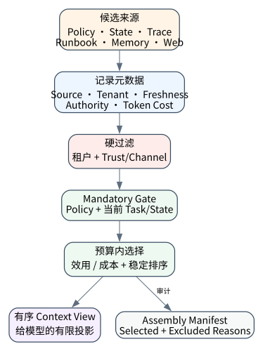
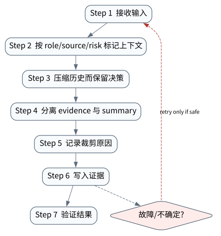

# Context Engineering：信息进入模型之前已经决定了一半结果

> **本章核心判断**：Context 是 Agent 的工作内存、任务边界和决策依据；工程上要管理来源、优先级、时效、压缩、污染和预算。

上一章：模型基座：Token、结构化生成、工具调用与推理接口。本章把前一章已经建立的能力进一步推进到 `Context window`；下一章将进入：Messages、Structured Output 与 ReAct 轨迹。



## 问题背景与学习目标

Context 是 Agent 的工作内存、任务边界和决策依据；工程上要管理来源、优先级、时效、压缩、污染和预算。

在本章的 `Context window` 场景中，真实 Agent 系统与普通“问答程序”的差异，在于一次任务会跨越模型、工具、状态、外部环境和人工治理边界。本章所有原理、代码与实验都围绕这些可验证问题展开。


**本章完成标准：**

- **机制理解**：能够解释“Context 是 Agent 的工作内存、任务边界和决策依据；工程上要管理来源、优先级、时效、压缩、污染和预算。”，并指出它对应的确定性软件边界；
- **正确性判断**：能够针对 `context compaction must preserve higher-priority instructions and task state` 构造一个反例，说明证据不足时系统为什么不能继续乐观执行；
- **实验与迁移**：运行 `Lab 03A` / `Lab 03B`，分别说明 normal/fault 的 evidence level，并把同一机制映射到至少一个上游实现或协议。

## 核心概念与系统直觉

本节不把概念当作术语清单，而是回答三个工程问题：它**是什么**、在系统里**负责什么**、以及它失效时**会留下什么可观测证据**。

### Context window

**定义。** Context window 是当前推理的工作集，不是“所有历史”。它包含 system/developer policy、用户目标、当前状态、工具说明、检索证据以及必要的历史压缩。

**系统责任。** Context engineering 的核心是选择和排序：哪些信息必须逐字保留，哪些可以摘要，哪些应由工具按需检索，哪些根本不该暴露给模型。

**失败边界。** 窗口过满的失败通常不是简单截断，而是重要约束被噪声稀释。应观测 context token composition、重要片段覆盖率和 stale context 比例。

### Instruction hierarchy

**定义。** Instruction hierarchy 定义不同来源指令的优先级与信任等级，例如系统策略高于外部网页内容，用户授权高于工具返回中的嵌入式命令。

**系统责任。** Runtime 应尽量在消息进入模型前标记 provenance/trust domain，并在工具执行前再次做权限检查，避免把“模型遵守优先级”当作唯一防线。

**失败边界。** Indirect prompt injection 的本质就是不可信内容伪装成更高优先级指令。只靠提示词声明“不要听网页”无法形成强安全边界。

### Budgeting

**定义。** Context budgeting 是在固定 token、延迟和成本约束下，为 policy、state、history、 retrieval 和 tool schema 分配可见空间。

**系统责任。** 成熟系统会为不可压缩约束保留 hard budget，为历史/检索采用动态 budget，并根据任务阶段调整，例如规划阶段多给约束，执行阶段多给 observation。

**失败边界。** 没有预算策略时，长时任务会出现“越工作越笨”：旧轨迹和工具结果不断累积，导致模型注意力和 prompt cache 都恶化。

### Compaction

**定义。** Compaction 是把长轨迹压缩成仍能继续执行的最小充分状态，而不是普通摘要。它必须保留未完成目标、约束、关键决策、外部 effect、open question 和 provenance。

**系统责任。** 好的 compaction 产物可以被下一次模型调用或新进程读取， 并通过 checkpoint/replay 继续任务。原始事件应保留在外部 evidence store，摘要只是工作集。

**失败边界。** 如果摘要遗漏“已发送邮件”或“某方案已被否决”等不可逆事实，后续 Agent 会重复动作或重新走错误路径。

## 原理与理论基础

### 系统不变量

> **Invariant**：context compaction must preserve higher-priority instructions and task state

不变量与普通“最佳实践”不同：最佳实践可以因为场景变化而替换，不变量一旦被破坏，系统就失去本章希望保证的正确性。例如 `把所有历史无脑塞进 prompt` 并不是一个 UI 问题，而是说明某个状态已经无法从证据中唯一判断。


### 故障模型

本章优先把 “把所有历史无脑塞进 prompt”、“压缩时丢失开放任务”、“把不可信检索结果提升为系统指令” 作为可证伪故障，而不是泛化地枚举所有异常。对涉及外部 effect 的失败，判定顺序固定为“最后 durable state → effect 是否可能发生 → 现有 observation 是否足够决定下一步”；证据不足时停在 UNKNOWN/显式失败。

### Why / What if / Trade-off

本章真正的设计取舍不是“使用更强模型还是写更多规则”，而是确定 **Context window** 与 **Instruction hierarchy** 分别应该由概率性决策还是确定性软件拥有。模型可以帮助识别候选路径，但它不会自动消除“把所有历史无脑塞进 prompt”这类系统失败；该失败必须由 runtime 的 schema、状态机、权限或 verifier 显式约束。

如果把 Context window 完全交给模型，系统会把不可验证的语言判断混入执行事实；如果把 Instruction hierarchy 全部硬编码为固定 workflow，又会失去开放任务所需的适应性。更稳健的边界是：让模型负责提出候选决策，让软件负责 `按 role/source/risk 标记上下文`、`记录裁剪原因` 以及对不变量 **context compaction must preserve higher-priority instructions and task state** 的检查。

**What if。** 一旦“压缩时丢失开放任务”发生，系统首先需要判断现有证据是否足够决定下一状态；证据不足时应停在显式失败或待协调状态，而不是让模型用自然语言补全事实。这个边界决定了本章方案是否具有可恢复性，而不只是演示效果。


### 形式化模型与可证伪假设

$$
C^*=\arg\max_C[Rel(C)+Fresh(C)+Auth(C)-Noise(C)],\quad tokens(C)\le B
$$

Context Engineering 本质是受 token budget 约束的信息选择问题；相关性、时效性、权威性和噪声必须共同进入选择函数。

**可证伪假设。** 在事实频繁变化的任务中，加入 provenance/freshness 约束比单纯扩大 context window 更能降低 stale-fact error。

**建议测量。** context precision、stale-fact error、tokens per verified task、compaction recovery rate。

## 关键机制与执行流程



**Step 1 — 按 role/source/risk 标记上下文。** `按 role/source/risk 标记上下文` 负责形成后续决策的输入。需要同时保存来源、版本/时间与必要的关联标识，避免把“当前看到的数据”误当成永远有效的事实。进入下一阶段前，对结构、权限和来源做最小验证，使 `Context window` 的状态能够在 trace 中被复现。

**Step 2 — 压缩历史而保留决策。** `压缩历史而保留决策` 会改变信息或控制流的形态，因此必须说明哪些信息允许丢弃、哪些顺序必须保持、哪些状态不能合并。调试时记录变换前后的摘要与原因，确保 `Instruction hierarchy` 的关键状态在优化后仍满足 **context compaction must preserve higher-priority instructions and task state**。

**Step 3 — 分离 evidence 与 summary。** `分离 evidence 与 summary` 是“Context Engineering：信息进入模型之前已经决定了一半结果”的一次显式状态转移。输入和输出都必须可序列化并关联 `run_id/step_id`；一旦该步骤失败，后继步骤只能依据已记录状态继续。关键观察点是 `Budgeting` 是否仍满足 **context compaction must preserve higher-priority instructions and task state**。

**Step 4 — 记录裁剪原因。** `记录裁剪原因` 把短暂执行状态转换为后续能够读取的证据。写入内容至少要能关联本次 run、前一状态与下一状态；对 crash-sensitive 数据，应明确写入完成的判据。若进程在写入期间终止，恢复代码必须能够区分“没有记录”“完整记录”和“损坏/不确定记录”，而不能把半写状态视作成功。

在本章的 `Context window` 场景中，**最后一步 — 验证。** verifier 针对 `Compaction` 检查本章不变量 **context compaction must preserve higher-priority instructions and task state**。如果“把所有历史无脑塞进 prompt”使现有 artifact/外部状态不足以证明成功，结果必须停在显式失败或 UNKNOWN；只有 observation 能闭合状态转移时，流程才允许进入 FINISHED。

### 数据流与控制流

本章的数据/控制链按 **按 role/source/risk 标记上下文 → 压缩历史而保留决策 → 分离 evidence 与 summary → 记录裁剪原因** 推进。调试时不要只看最终 answer，应确认每一阶段的输入来源、状态版本和 observation；对“把所有历史无脑塞进 prompt”尤其要检查动作前后的证据是否足以闭合不变量 **context compaction must preserve higher-priority instructions and task state**。


### 持久化点与崩溃窗口

本章需要持久化的内容取决于动作可逆性。与 `Context window` 有关的纯计算状态通常可以重算；一旦 `压缩历史而保留决策` 可能产生昂贵、外部或不可逆效果，就必须在动作前后建立可区分的证据边界。对于本章不变量 **context compaction must preserve higher-priority instructions and task state**，恢复时最重要的问题是：最后一个已知状态是什么、动作是否可能已经发生、现有 observation 能否唯一决定 retry/continue/compensate。


## 从原理到实现


### 完整实验入口

```python
from __future__ import annotations
import argparse
from agentlab.course_scenarios import run_scenario

def main() -> int:
 p=argparse.ArgumentParser(description='Context Engineering：信息进入模型之前已经决定了一半结果')
 p.add_argument("--fault", action="store_true", help="inject the chapter-specific failure path")
 args=p.parse_args()
 result=run_scenario('context', fault=args.fault)
 print(result.as_json())
 return 0 if result.passed else 2

if __name__ == "__main__":
 raise SystemExit(main())
```

### 核心机制实现

```python
def context(fault=False):
 items=[('system','never execute writes without approval',100),('task','investigate payment timeout',90),('evidence','trace=abc status=503',80),('history','old unrelated chat',10)]
 budget=3 if not fault else 2
 kept=sorted(items,key=lambda x:-x[2])[:budget]
 names=[x[0] for x in kept]
 condition=('system' in names and 'task' in names and ('evidence' in names if not fault else True))
 return _ok('context',fault,{'budget':budget,'kept':names,'dropped':[x[0] for x in items if x not in kept]},'context compaction must preserve higher-priority instructions and task state',condition)
```


### 简化假设与不能省略的机制


## 主流系统实现对照与源码阅读入口

| 项目 | 本书锁定版本/状态 | 应阅读的机制 | 已核验源码/文档入口 | 官方来源 |
|---|---|---|---|---|
| Anthropic: Harness design for long-running apps | `2026-03-24` | long-running coding 中 planner/generator/evaluator 与 harness 设计影响结果。 | 以官方 docs/release/source tree 为准 | [官方来源](https://www.anthropic.com/engineering/harness-design-long-running-apps) |
| OpenAI Agents SDK | `v0.22.0 @ 4df9ecf` | 从 Agent/Runner 入口追踪 tool loop、RunState、session、guardrail 与 tracing；特别对照 v0.22.0 对 replay state 与 failed/incomplete response 的 hardening。 | 以官方 docs/release/source tree 为准 | [官方来源](https://github.com/openai/openai-agents-python) |
| Pi Coding Agent | `@earendil-works/pi-coding-agent 0.85.1` | 把 session tree、branching、compaction、extensions/skills 看成极简 coding harness 的核心；同时注意 2026 年包名迁移到 @earendil-works。 | 以官方 docs/release/source tree 为准 | [官方来源](https://github.com/earendil-works/pi) |

### 源码阅读方法

源码阅读以 **Anthropic: Harness design for long-running apps** 为第一参照，并只追与“Context Engineering：信息进入模型之前已经决定了一半结果”直接相关的公开执行链：入口 → durable/session state → 权限或协议边界 → verifier/trace。若上游没有公开某个服务端组件，本章不根据客户端现象反推其内部 scheduler、queue 或 policy engine。


### 工业实现为什么更复杂


对本章最值得关注的工程增量是：如何避免“把所有历史无脑塞进 prompt”、如何在“压缩时丢失开放任务”后恢复，以及如何让 `记录裁剪原因` 的结果能够进入 tracing/evaluation。只有这些机制都能落到公开类型、函数或协议消息上，才算真正完成源码对照。

## 设计方案与方法对比

| 方案 | 核心优势 | 主要局限 | 更适合的约束 |
|---|---|---|---|
| 最小自研 AgentLab | 机制透明、可断点、无网络即可故障注入 | 生态/模型能力有限 | 教学、研究原型、回归基线 |
| Anthropic: Harness design for long-running apps | 官方/主流实现提供成熟抽象与生态 | 抽象会隐藏部分底层机制，需要源码/trace 反推 | 生产集成与方案对照 |
| OpenAI Agents SDK | 官方/主流实现提供成熟抽象与生态 | 抽象会隐藏部分底层机制，需要源码/trace 反推 | 生产集成与方案对照 |
| Pi Coding Agent | 贴近 coding/长期执行 harness，工作区和工具边界更真实 | 依赖更重或迭代快，升级需锁版本做回归 | Coding Agent、Harness 源码学习 |


## 可复现实验

本章两个 Core Lab 都直接执行仓库内的确定性代码；它们证明的是“Context Engineering：信息进入模型之前已经决定了一半结果”对应的本地机制与 fault oracle，而不是外部 provider 或真实云环境。第三方实现只在 `labs/upstream/` 按独立 L5 互操作证据记录，未实际执行时必须保持 `EXTERNAL_NOT_RUN_IN_THIS_RELEASE`。

### 实验环境

统一 Python/OS/离线复现约束、安装步骤与工具链版本集中维护在[附录 A](../appendix-a-environment.md)。本章只增加与“Context Engineering：信息进入模型之前已经决定了一半结果”直接相关的 normal/fault 双轨验证；若需要真实云、浏览器、GPU 或第三方 provider，则在对应 upstream lab 中单独标记 `NOT_RUN_EXTERNAL`，不把未运行结果计入核心实验。

### Lab 03A — 正常路径

```bash
PYTHONPATH=src python examples/chapters/ch03_context.py
```

**关键断点：**
- `src/agentlab/course_scenarios.py::context`
- `examples/chapters/ch03_context.py::main`

**本发布包实际输出：**

```json
{"contained": false, "evidence_level": "L1_MECHANISM", "evidence_meaning": "normal_path_assertion_satisfied", "fault": false, "fault_injected": false, "invariant": "context compaction must preserve higher-priority instructions and task state", "invariant_holds": true, "observation": {"budget": 3, "dropped": ["history"], "kept": ["system", "task", "evidence"]}, "oracle_detected": false, "passed": true, "recovered": false, "scenario": "context", "system_detected": false}
```

PASS：退出码 0，`passed=true`、`fault=false`、`invariant_holds=true`；这只证明确定性 fixture 的正常机制断言。完整手册：[Lab 03A](../../../labs/core/lab-03A-context.md)。

### Lab 03B — 故障注入

```bash
PYTHONPATH=src python examples/chapters/ch03_context.py --fault
```

**本发布包实际输出：**

```json
{"contained": false, "evidence_level": "L2_ORACLE_ONLY", "evidence_meaning": "external_oracle_observed_bad_outcome_only", "fault": true, "fault_injected": true, "invariant": "context compaction must preserve higher-priority instructions and task state", "invariant_holds": false, "observation": {"budget": 2, "dropped": ["evidence", "history"], "kept": ["system", "task"]}, "oracle_detected": true, "passed": true, "recovered": false, "scenario": "context", "system_detected": false}
```

PASS：退出码 0，`passed=true`、`fault=true`、`oracle_detected=true`。本章故障实验为 **L2_ORACLE_ONLY**：独立 oracle 观察到故障，但被测系统没有证明检测/约束/恢复。 `passed=true` 本身只表示实验 oracle 得到预期观察。完整手册：[Lab 03B](../../../labs/core/lab-03B-context-fault.md)。

### 观察与证据


## 工程场景与系统设计

本章沿用第 1 章“研发助手”教学负载，重点评估 12 回合内 context 膨胀、证据裁剪和 token 预算，而不重复把同一数字包装成新的性能实测。


### 上线前必须补齐

- 围绕 **Context Engineering** 建立可审计状态字段与最小权限；
- 为本章相关动作记录 run_id、step_id、输入摘要与 observation；
- 对 `上下文是有限资源，压缩必须保存任务状态、权限边界和证据来源。` 这一边界建立自动化验收；
- 为本章主要故障窗口配置 trace、日志和恢复 runbook；
- 上线前把教学 fixture 替换为真实 provider/tool/workspace，并重新执行 normal/fault 两条路径。

## 故障模型、失败模式与排错

本章至少主动测试以下失败：

- **把所有历史无脑塞进 prompt**：先确认最后 durable state，再检查是否已经产生外部效果；不要先重试。
- **压缩时丢失开放任务**：先确认最后 durable state，再检查是否已经产生外部效果；不要先重试。
- **把不可信检索结果提升为系统指令**：先确认最后 durable state，再检查是否已经产生外部效果；不要先重试。


## 性能、可靠性与工程化

### 应采集指标

- `task success rate`
- `structured-decision parse failure`
- `context tokens / turn`
- `model turns / task`
- `trajectory completeness`


### 优化顺序


任何优化都必须重新运行 Lab A/B。尤其当优化改变 `Instruction hierarchy` 的生命周期时，要重新验证 **context compaction must preserve higher-priority instructions and task state**；否则平均延迟下降可能以更大的 stale state、重复副作用或取消失效为代价。

### 可靠性工程

本章可靠性 gate 直接针对 “把所有历史无脑塞进 prompt”、“压缩时丢失开放任务”、“把不可信检索结果提升为系统指令”：只有正常路径与对应 fault path 都保持 **context compaction must preserve higher-priority instructions and task state**，优化或功能扩展才可接受。是否达到 detection、containment 或 recovery 以实验的 `evidence_level` 字段为准。


## 技术边界与设计取舍
本章方案有明确边界：

- 模型输出仍然是概率性决策，不能提供传统事务语义
- 没有外部 verifier 时，最终答案不能等同于客观成功
- 上下文窗口不是无限数据库，历史必须被选择与压缩
- 模型能力升级会改变最佳 harness 假设，因此边界要可替换

选择方案时要回到本章边界：如果业务不能接受“把所有历史无脑塞进 prompt”，就必须为 `Context window` 增加更强的确定性约束；如果主要任务是开放式探索，则可以把更多 `Instruction hierarchy` 决策交给模型，但要用 `记录裁剪原因` 保持结果可验证。**Anthropic: Harness design for long-running apps** 与 **OpenAI Agents SDK** 的差异也应放在这些约束下理解，而不是抽象成通用框架排名。

Context Engineering 只能决定模型能看到什么，不能保证输入事实新鲜、完整或被授权。来源不明、时间边界模糊或相互冲突的上下文必须携带 provenance 与失效策略，否则更长的上下文只会放大错误。

## 前沿研究与演进方向

当前研究和工业演进已经从“模型能否调用工具”推进到“怎样让长期、状态化、具有副作用的 Agent 可评估、可恢复、可治理”。与本章直接相关的资料：

- **[ReAct: Synergizing Reasoning and Acting in Language Models](https://arxiv.org/abs/2210.03629)**：提出 reasoning/action 交错轨迹，连接语言推理与外部环境动作。
- **[Anthropic: Harness design for long-running apps](https://www.anthropic.com/engineering/harness-design-long-running-apps)**（2026-03-24）：long-running coding 中 planner/generator/evaluator 与 harness 设计影响结果。
- **[OpenAI Agents SDK](https://github.com/openai/openai-agents-python)**（v0.22.0 @ 4df9ecf）：Agent/Runner/Tools/Handoffs/Guardrails/Sessions/HITL/Tracing；0.22.0 包含 runtime hardening。


### 截至 2026-09-11 的研究更新

本节只记录会改变本章系统结论的研究或官方规范更新；实验仍使用仓库锁定版本，避免把“最新观察版本”与“可复现实验版本”混为一谈。
- Agent Memory: Characterization and System Implications of Stateful Long‑Horizon Workloads（arXiv 2606.06448; 2026‑06‑04）：memory system cost, write/read path, freshness‑latency tradeoffs。
- MemGym: a Long‑Horizon Memory Environment for LLM Agents（arXiv 2605.20833; 2026‑05‑20）：agentic memory evaluation across tool use, deep research, coding, web。

**本章吸收的变化。** Context Engineering 是预算约束下的证据选择问题，不是“把历史塞满窗口”。相关性、时效、权威与噪声需要共同进入选择函数。这些研究/规范的价值不在于替换本章原理， 而在于把上述假设放进更真实、更长时或更高风险的环境中检验。

### Research Gap

围绕 `Context window`，当前缺口不是“再增加一个 Agent API”，而是怎样把 **context compaction must preserve higher-priority instructions and task state** 从局部实现经验升级为跨模型、跨 runtime 可验证的系统属性。现有工业实现已经能够提供 tool loop、session、graph、plugin 或 workspace 等抽象，但在“把所有历史无脑塞进 prompt”和“压缩时丢失开放任务”同时出现时，证据格式、恢复语义和评测方法仍缺少统一答案。

本章的研究更新不追求论文数量，而关注一个问题：现有工作是否真正推进了 **Context Engineering** 的可验证性。Anthropic Context Engineering 将 context 视为工程资源；LongHorizon-Harness 进一步把显式任务状态移出 prompt，减少长任务遗忘。 因此，本章会把论文结论放回不变量、失败窗口和实验断言中，而不是把研究当作参考文献列表。

### Open Problems

1. 如何把 `Context window` 的正确性拆成可组合的局部不变量，并在不同 Agent runtime 中复用 verifier？
2. 当“把所有历史无脑塞进 prompt”与“压缩时丢失开放任务”同时发生时，**Anthropic: Harness design for long-running apps** 与 **OpenAI Agents SDK** 的公开抽象分别能保存哪些证据，哪些状态仍需要外部 reconciliation？
3. 如果模型能力显著提高，围绕 `Instruction hierarchy` 的哪些 harness 机制仍属于系统必要条件，哪些只是当前模型能力下的临时补丁？
4. 如何构造一个既保护真实业务数据、又能复现“把不可信检索结果提升为系统指令”的公开 benchmark，使研究结果可以被第三方验证？


### 深度审计与研究证据链：Context Engineering

本章重新审计后的核心结论是：**上下文是有限资源，压缩必须保存任务状态、权限边界和证据来源。** 这句话只有在代码、实验、开源源码和研究证据四个层面同时成立时才有教学价值。仅靠定义或 API 示例无法证明它，因为 Agent Systems 的风险通常发生在模型决策与外部环境之间的缝隙里。

**与本章最相关的近期/基础研究与官方资料：**

- **[ReAct](https://arxiv.org/abs/2210.03629)**：reasoning/action 交错轨迹让模型决策可被放进 trajectory，而不是隐藏在最终回答里。
- **[Toolformer](https://arxiv.org/abs/2302.04761)**：说明模型可学习工具调用，但工程系统仍要在模型外做 schema 与权限验证。
- **[Anthropic Building Effective Agents](https://www.anthropic.com/engineering/building-effective-agents)**：强调先从简单可组合的 workflow/agent 模式出发。

这些资料与本章的关系不是“引用背书”，而是帮助读者识别设计边界。LangGraph state、OpenAI Sessions、Pi compaction 都是 context/state 边界的不同实现。 读者阅读源码时应主动寻找四个对象：输入如何进入系统、状态在哪里持久化、动作由谁执行、失败后谁负责恢复。

**实验语义边界。** 本章实验验证 Context Engineering 的输入、消息和状态是否能被显式记录；证据等级定义与解释规则统一见附录 A，且 `passed=true` 不得跨级推导 containment/recovery。


## 本章总结与进阶实践

### 核心结论

1. 本章不变量是：**context compaction must preserve higher-priority instructions and task state**；
2. `Context window` 必须是可观察软件边界，而不是 prompt 约定；
3. `按 role/source/risk 标记上下文` 与 `记录裁剪原因` 之间必须有状态和证据连接；
4. 模型提出动作不等于系统已经执行，更不等于任务成功；
5. 正常路径只能证明功能，故障路径才能暴露恢复语义；
6. 开源实现的核心价值在于理解真实约束，不是复制 API；
7. 性能优化必须与可靠性/安全不变量一起重新验证；
8. 技术边界和未解决问题是高级系统设计的一部分。

### 常见误区

- 把所有历史无脑塞进 prompt
- 压缩时丢失开放任务
- 把不可信检索结果提升为系统指令

### 思考题与实践

- **Why：** 为什么 `Context window` 不能只靠模型“记住”？
- **What if：** 如果在 `按 role/source/risk 标记上下文` 与 `记录裁剪原因` 之间 crash，当前证据足够恢复吗？
- **Programming：** 修改 `examples/chapters/ch03_context.py` 或对应 scenario，让系统新增一种错误类型，但仍保持 invariant。
- **Engineering：** 把 Lab B 的故障改成 timeout/duplicate/crash 中另一种，写出状态机和恢复步骤。
- **Research：** 选择本章一个 Open Problem，阅读两篇相互不同的方法，给出你自己的实验设计和 falsifiable hypothesis。

下一章进入 **Messages、Structured Output 与 ReAct 轨迹**，它将复用本章已经建立的状态/证据边界，而不是重新从 API 使用开始。
