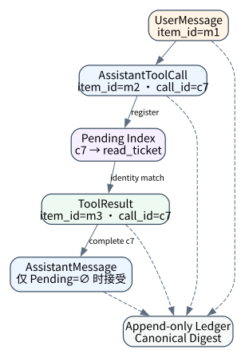
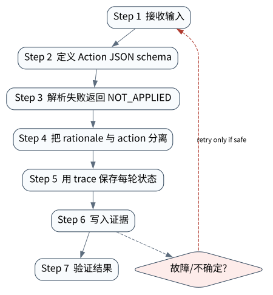

# Messages、Structured Output 与 ReAct 轨迹

> **本章核心判断**：Agent 的每一步都应从非结构化自然语言转成可验证的消息、动作和状态变更；结构化输出让 Runtime 可以接管边界。

上一章：Context Engineering：信息进入模型之前已经决定了一半结果。本章把前一章已经建立的能力进一步推进到 `Messages`；下一章将进入：Planning、Workflow 与 Hybrid Control。



## 问题背景与学习目标

Agent 的每一步都应从非结构化自然语言转成可验证的消息、动作和状态变更；结构化输出让 Runtime 可以接管边界。

在本章的 `Messages` 场景中，真实 Agent 系统与普通“问答程序”的差异，在于一次任务会跨越模型、工具、状态、外部环境和人工治理边界。本章所有原理、代码与实验都围绕这些可验证问题展开。


**本章完成标准：**

- **机制理解**：能够解释“Agent 的每一步都应从非结构化自然语言转成可验证的消息、动作和状态变更；结构化输出让 Runtime 可以接管边界。”，并指出它对应的确定性软件边界；
- **正确性判断**：能够针对 `tool-call arguments are typed data, not trusted natural language` 构造一个反例，说明证据不足时系统为什么不能继续乐观执行；
- **实验与迁移**：运行 `Lab 04A` / `Lab 04B`，分别说明 normal/fault 的 evidence level，并把同一机制映射到至少一个上游实现或协议。

## 核心概念与系统直觉

本节不把概念当作术语清单，而是回答三个工程问题：它**是什么**、在系统里**负责什么**、以及它失效时**会留下什么可观测证据**。

### Messages

**定义。** Message 是模型接口中的有序输入单元，但在 Agent 系统里还应承载 role、provenance、 tool correlation、timestamp/version 和 trust level。

**系统责任。** 用户话语、系统 policy、工具 observation、subagent output 不应该被视为同一信任域。Runtime 可把它们转换成模型格式，但内部状态应保留更丰富元数据。

**失败边界。** 把所有内容拼成一个字符串会丢掉责任边界，使 prompt injection、tool result spoofing 和 replay 调试都更困难。

### Structured output

**定义。** Structured output 是模型给 Runtime 的机器可验证决策面。适合表达 action、 arguments、routing、classification、plan 或 rubric score。

**系统责任。** 系统应该先解析，再做 schema/domain/policy validation，最后才允许执行。解析失败应是显式状态，而不是自动用字符串猜测字段。

**失败边界。** 结构化输出只能约束形状，不能保证事实性和授权。它是 execution safety 的第一道门，不是最后一道门。

### ReAct trace

**定义。** ReAct trace 将 reasoning‑oriented decision 与 action/observation 交错，使 Agent 能根据环境反馈调整后续行为。生产系统应保存结构化 action/observation，而不是依赖隐藏推理文本。

**系统责任。** 对于调试和评测，重要的是“为什么选择这个工具”的可公开 rationale、输入参数、 结果和下一状态。私有 chain‑of‑thought 不应成为系统恢复依赖。

**失败边界。** 如果 trace 只记录模型自然语言，会很难判断实际 tool call、参数归一化和外部结果是否一致。

### Tool call parsing

**定义。** Tool call parsing 是把模型输出转换为具体工具请求的边界，包括名称解析、参数反序列化、类型检查和版本兼容。

**系统责任。** Parser 应拒绝未知工具、额外敏感字段和不满足约束的参数；工具版本变化时应显式做 negotiation 或 adapter。

**失败边界。** “尽量帮模型修正 JSON”如果过度宽松，可能把原本应拒绝的请求变成另一个有效但危险的动作。

## 原理与理论基础

### 系统不变量

> **Invariant**：tool-call arguments are typed data, not trusted natural language

不变量与普通“最佳实践”不同：最佳实践可以因为场景变化而替换，不变量一旦被破坏，系统就失去本章希望保证的正确性。例如 `正则解析模型文本导致错参` 并不是一个 UI 问题，而是说明某个状态已经无法从证据中唯一判断。


### 故障模型

本章优先把 “正则解析模型文本导致错参”、“把 reasoning 当可执行事实”、“模型输出半个 JSON 仍然继续执行” 作为可证伪故障，而不是泛化地枚举所有异常。对涉及外部 effect 的失败，判定顺序固定为“最后 durable state → effect 是否可能发生 → 现有 observation 是否足够决定下一步”；证据不足时停在 UNKNOWN/显式失败。

### Why / What if / Trade-off

本章真正的设计取舍不是“使用更强模型还是写更多规则”，而是确定 **Messages** 与 **Structured output** 分别应该由概率性决策还是确定性软件拥有。模型可以帮助识别候选路径，但它不会自动消除“正则解析模型文本导致错参”这类系统失败；该失败必须由 runtime 的 schema、状态机、权限或 verifier 显式约束。

如果把 Messages 完全交给模型，系统会把不可验证的语言判断混入执行事实；如果把 Structured output 全部硬编码为固定 workflow，又会失去开放任务所需的适应性。更稳健的边界是：让模型负责提出候选决策，让软件负责 `定义 Action JSON schema`、`用 trace 保存每轮状态` 以及对不变量 **tool-call arguments are typed data, not trusted natural language** 的检查。

**What if。** 一旦“把 reasoning 当可执行事实”发生，系统首先需要判断现有证据是否足够决定下一状态；证据不足时应停在显式失败或待协调状态，而不是让模型用自然语言补全事实。这个边界决定了本章方案是否具有可恢复性，而不只是演示效果。


### 形式化模型与可证伪假设

$$
T=(m_0,a_0,o_0,\ldots,m_n)
$$

Trajectory 应被视为带类型、带因果关系的消息/动作/观察序列，而不是聊天文本拼接。

**可证伪假设。** 将 action/observation 显式类型化并保存关联 ID，会显著缩短故障 RCA 时间并提升轨迹级评测稳定性。

**建议测量。** parse error rate、tool-selection accuracy、trajectory completeness、RCA time。

## 关键机制与执行流程



**Step 1 — 定义 Action JSON schema。** `定义 Action JSON schema` 是“Messages、Structured Output 与 ReAct 轨迹”的一次显式状态转移。输入和输出都必须可序列化并关联 `run_id/step_id`；一旦该步骤失败，后继步骤只能依据已记录状态继续。关键观察点是 `Messages` 是否仍满足 **tool-call arguments are typed data, not trusted natural language**。

**Step 2 — 解析失败返回 NOT_APPLIED。** `解析失败返回 NOT_APPLIED` 负责形成后续决策的输入。需要同时保存来源、版本/时间与必要的关联标识，避免把“当前看到的数据”误当成永远有效的事实。进入下一阶段前，对结构、权限和来源做最小验证，使 `Structured output` 的状态能够在 trace 中被复现。

**Step 3 — 把 rationale 与 action 分离。** `把 rationale 与 action 分离` 是“Messages、Structured Output 与 ReAct 轨迹”的一次显式状态转移。输入和输出都必须可序列化并关联 `run_id/step_id`；一旦该步骤失败，后继步骤只能依据已记录状态继续。关键观察点是 `ReAct trace` 是否仍满足 **tool-call arguments are typed data, not trusted natural language**。

**Step 4 — 用 trace 保存每轮状态。** `用 trace 保存每轮状态` 把短暂执行状态转换为后续能够读取的证据。写入内容至少要能关联本次 run、前一状态与下一状态；对 crash-sensitive 数据，应明确写入完成的判据。若进程在写入期间终止，恢复代码必须能够区分“没有记录”“完整记录”和“损坏/不确定记录”，而不能把半写状态视作成功。

在本章的 `Messages` 场景中，**最后一步 — 验证。** verifier 针对 `Tool call parsing` 检查本章不变量 **tool-call arguments are typed data, not trusted natural language**。如果“正则解析模型文本导致错参”使现有 artifact/外部状态不足以证明成功，结果必须停在显式失败或 UNKNOWN；只有 observation 能闭合状态转移时，流程才允许进入 FINISHED。

### 数据流与控制流

本章的数据/控制链按 **定义 Action JSON schema → 解析失败返回 NOT_APPLIED → 把 rationale 与 action 分离 → 用 trace 保存每轮状态** 推进。调试时不要只看最终 answer，应确认每一阶段的输入来源、状态版本和 observation；对“正则解析模型文本导致错参”尤其要检查动作前后的证据是否足以闭合不变量 **tool-call arguments are typed data, not trusted natural language**。


### 持久化点与崩溃窗口

本章需要持久化的内容取决于动作可逆性。与 `Messages` 有关的纯计算状态通常可以重算；一旦 `解析失败返回 NOT_APPLIED` 可能产生昂贵、外部或不可逆效果，就必须在动作前后建立可区分的证据边界。对于本章不变量 **tool-call arguments are typed data, not trusted natural language**，恢复时最重要的问题是：最后一个已知状态是什么、动作是否可能已经发生、现有 observation 能否唯一决定 retry/continue/compensate。


## 从原理到实现


### 完整实验入口

```python
from __future__ import annotations
import argparse
from agentlab.course_scenarios import run_scenario

def main() -> int:
 p=argparse.ArgumentParser(description='Messages、Structured Output 与 ReAct 轨迹')
 p.add_argument("--fault", action="store_true", help="inject the chapter-specific failure path")
 args=p.parse_args()
 result=run_scenario('messages', fault=args.fault)
 print(result.as_json())
 return 0 if result.passed else 2

if __name__ == "__main__":
 raise SystemExit(main())
```

### 核心机制实现

```python
def messages(fault=False):
 call={'name':'lookup','arguments':{'id':7}} if not fault else {'name':'lookup','arguments':{}}
 required={'id'}; missing=required-set(call['arguments'])
 condition=(not missing) if not fault else bool(missing)
 return _ok('messages',fault,{'call':call,'missing':sorted(missing)},'tool-call arguments are typed data, not trusted natural language',condition)
```


### 简化假设与不能省略的机制


## 主流系统实现对照与源码阅读入口

| 项目 | 本书锁定版本/状态 | 应阅读的机制 | 已核验源码/文档入口 | 官方来源 |
|---|---|---|---|---|
| OpenAI Agents SDK | `v0.22.0 @ 4df9ecf` | 从 Agent/Runner 入口追踪 tool loop、RunState、session、guardrail 与 tracing；特别对照 v0.22.0 对 replay state 与 failed/incomplete response 的 hardening。 | 以官方 docs/release/source tree 为准 | [官方来源](https://github.com/openai/openai-agents-python) |
| Hugging Face smolagents | `source observed 2026-09-09` | CodeAgent 与 ToolCallingAgent 的轻量实现对照。 | 以官方 docs/release/source tree 为准 | [官方来源](https://github.com/huggingface/smolagents) |
| bojieli/ai-agent-book | `main; 10 chapters / 109 experiments observed 2026-09-09` | 对标开源教材：正文、实验 ledger、PDF/EPUB、多语言。 | 以官方 docs/release/source tree 为准 | [官方来源](https://github.com/bojieli/ai-agent-book) |

### 源码阅读方法

源码阅读以 **OpenAI Agents SDK** 为第一参照，并只追与“Messages、Structured Output 与 ReAct 轨迹”直接相关的公开执行链：入口 → durable/session state → 权限或协议边界 → verifier/trace。若上游没有公开某个服务端组件，本章不根据客户端现象反推其内部 scheduler、queue 或 policy engine。


### 工业实现为什么更复杂


对本章最值得关注的工程增量是：如何避免“正则解析模型文本导致错参”、如何在“把 reasoning 当可执行事实”后恢复，以及如何让 `用 trace 保存每轮状态` 的结果能够进入 tracing/evaluation。只有这些机制都能落到公开类型、函数或协议消息上，才算真正完成源码对照。

## 设计方案与方法对比

| 方案 | 核心优势 | 主要局限 | 更适合的约束 |
|---|---|---|---|
| 最小自研 AgentLab | 机制透明、可断点、无网络即可故障注入 | 生态/模型能力有限 | 教学、研究原型、回归基线 |
| OpenAI Agents SDK | 官方/主流实现提供成熟抽象与生态 | 抽象会隐藏部分底层机制，需要源码/trace 反推 | 生产集成与方案对照 |
| Hugging Face smolagents | 官方/主流实现提供成熟抽象与生态 | 抽象会隐藏部分底层机制，需要源码/trace 反推 | 生产集成与方案对照 |
| bojieli/ai-agent-book | 官方/主流实现提供成熟抽象与生态 | 抽象会隐藏部分底层机制，需要源码/trace 反推 | 生产集成与方案对照 |


## 可复现实验

本章两个 Core Lab 都直接执行仓库内的确定性代码；它们证明的是“Messages、Structured Output 与 ReAct 轨迹”对应的本地机制与 fault oracle，而不是外部 provider 或真实云环境。第三方实现只在 `labs/upstream/` 按独立 L5 互操作证据记录，未实际执行时必须保持 `EXTERNAL_NOT_RUN_IN_THIS_RELEASE`。

### 实验环境

统一 Python/OS/离线复现约束、安装步骤与工具链版本集中维护在[附录 A](../appendix-a-environment.md)。本章只增加与“Messages、Structured Output 与 ReAct 轨迹”直接相关的 normal/fault 双轨验证；若需要真实云、浏览器、GPU 或第三方 provider，则在对应 upstream lab 中单独标记 `NOT_RUN_EXTERNAL`，不把未运行结果计入核心实验。

### Lab 04A — 正常路径

```bash
PYTHONPATH=src python examples/chapters/ch04_messages.py
```

**关键断点：**
- `src/agentlab/course_scenarios.py::messages`
- `examples/chapters/ch04_messages.py::main`

**本发布包实际输出：**

```json
{"contained": false, "evidence_level": "L1_MECHANISM", "evidence_meaning": "normal_path_assertion_satisfied", "fault": false, "fault_injected": false, "invariant": "tool-call arguments are typed data, not trusted natural language", "invariant_holds": true, "observation": {"call": {"arguments": {"id": 7}, "name": "lookup"}, "missing": []}, "oracle_detected": false, "passed": true, "recovered": false, "scenario": "messages", "system_detected": false}
```

PASS：退出码 0，`passed=true`、`fault=false`、`invariant_holds=true`；这只证明确定性 fixture 的正常机制断言。完整手册：[Lab 04A](../../../labs/core/lab-04A-messages.md)。

### Lab 04B — 故障注入

```bash
PYTHONPATH=src python examples/chapters/ch04_messages.py --fault
```

**本发布包实际输出：**

```json
{"contained": true, "evidence_level": "L3_CONTAINED", "evidence_meaning": "fault_detected_and_contained", "fault": true, "fault_injected": true, "invariant": "tool-call arguments are typed data, not trusted natural language", "invariant_holds": true, "observation": {"call": {"arguments": {}, "name": "lookup"}, "missing": ["id"]}, "oracle_detected": true, "passed": true, "recovered": false, "scenario": "messages", "system_detected": true}
```

PASS：退出码 0，`passed=true`、`fault=true`、`oracle_detected=true`。本章故障实验为 **L3_CONTAINED**：被测组件检测并 fail-closed/约束了故障，但不声明已恢复业务结果。 `passed=true` 本身只表示实验 oracle 得到预期观察。完整手册：[Lab 04B](../../../labs/core/lab-04B-messages-fault.md)。

### 观察与证据


## 工程场景与系统设计

本章沿用第 1 章“研发助手”教学负载，重点检查消息轨迹在 50 并发下的可追踪性以及结构化响应失败后的降级边界。


### 上线前必须补齐

- 围绕 **消息、结构化输出和轨迹** 建立可审计状态字段与最小权限；
- 为本章相关动作记录 run_id、step_id、输入摘要与 observation；
- 对 `message、tool call、tool result 与 final answer 是不同证据类型，不能混成一段聊天文本。` 这一边界建立自动化验收；
- 为本章主要故障窗口配置 trace、日志和恢复 runbook；
- 上线前把教学 fixture 替换为真实 provider/tool/workspace，并重新执行 normal/fault 两条路径。

## 故障模型、失败模式与排错

本章至少主动测试以下失败：

- **正则解析模型文本导致错参**：先确认最后 durable state，再检查是否已经产生外部效果；不要先重试。
- **把 reasoning 当可执行事实**：先确认最后 durable state，再检查是否已经产生外部效果；不要先重试。
- **模型输出半个 JSON 仍然继续执行**：先确认最后 durable state，再检查是否已经产生外部效果；不要先重试。


## 性能、可靠性与工程化

### 应采集指标

- `task success rate`
- `structured-decision parse failure`
- `context tokens / turn`
- `model turns / task`
- `trajectory completeness`


### 优化顺序


任何优化都必须重新运行 Lab A/B。尤其当优化改变 `Structured output` 的生命周期时，要重新验证 **tool-call arguments are typed data, not trusted natural language**；否则平均延迟下降可能以更大的 stale state、重复副作用或取消失效为代价。

### 可靠性工程

本章可靠性 gate 直接针对 “正则解析模型文本导致错参”、“把 reasoning 当可执行事实”、“模型输出半个 JSON 仍然继续执行”：只有正常路径与对应 fault path 都保持 **tool-call arguments are typed data, not trusted natural language**，优化或功能扩展才可接受。是否达到 detection、containment 或 recovery 以实验的 `evidence_level` 字段为准。


## 技术边界与设计取舍
本章方案有明确边界：

- 模型输出仍然是概率性决策，不能提供传统事务语义
- 没有外部 verifier 时，最终答案不能等同于客观成功
- 上下文窗口不是无限数据库，历史必须被选择与压缩
- 模型能力升级会改变最佳 harness 假设，因此边界要可替换

选择方案时要回到本章边界：如果业务不能接受“正则解析模型文本导致错参”，就必须为 `Messages` 增加更强的确定性约束；如果主要任务是开放式探索，则可以把更多 `Structured output` 决策交给模型，但要用 `用 trace 保存每轮状态` 保持结果可验证。**OpenAI Agents SDK** 与 **Hugging Face smolagents** 的差异也应放在这些约束下理解，而不是抽象成通用框架排名。

消息轨迹能够提高可解释性，但消息本身不是事实账本：assistant 声称“已执行”不能证明工具真的提交，tool message 也不能替代外部状态观察。关键动作需要把意图、结果与独立验证分开记录。

## 前沿研究与演进方向

当前研究和工业演进已经从“模型能否调用工具”推进到“怎样让长期、状态化、具有副作用的 Agent 可评估、可恢复、可治理”。与本章直接相关的资料：

- **[ReAct: Synergizing Reasoning and Acting in Language Models](https://arxiv.org/abs/2210.03629)**：提出 reasoning/action 交错轨迹，连接语言推理与外部环境动作。
- **[Toolformer: Language Models Can Teach Themselves to Use Tools](https://arxiv.org/abs/2302.04761)**：探索模型学习何时调用外部工具以及如何把工具结果纳入后续预测。
- **[OpenAI Agents SDK](https://github.com/openai/openai-agents-python)**（v0.22.0 @ 4df9ecf）：Agent/Runner/Tools/Handoffs/Guardrails/Sessions/HITL/Tracing；0.22.0 包含 runtime hardening。
- **[Hugging Face smolagents](https://github.com/huggingface/smolagents)**（source observed 2026-09-09）：CodeAgent 与 ToolCallingAgent 的轻量实现对照。


### 截至 2026-09-11 的研究更新

本节只记录会改变本章系统结论的研究或官方规范更新；实验仍使用仓库锁定版本，避免把“最新观察版本”与“可复现实验版本”混为一谈。
- OpenAI Agents SDK v0.22.2（v0.22.2 @ 83c737f; 2026‑09‑09）：latest observed Python Agents SDK release。
- OpenAI: The next evolution of the Agents SDK（2026‑04‑15）：model‑native harness, sandbox, long‑horizon tasks and subagents。

**本章吸收的变化。** 消息、动作与 observation 构成可审计 trajectory。Structured Output 约束单步形状，ReAct 类轨迹暴露 reasoning/action 顺序，但系统事实仍来自环境 observation。这些研究/规范的价值不在于替换本章原理，而在于把上述假设放进更真实、更长时或更高风险的环境中检验。

### Research Gap

围绕 `Messages`，当前缺口不是“再增加一个 Agent API”，而是怎样把 **tool-call arguments are typed data, not trusted natural language** 从局部实现经验升级为跨模型、跨 runtime 可验证的系统属性。现有工业实现已经能够提供 tool loop、session、graph、plugin 或 workspace 等抽象，但在“正则解析模型文本导致错参”和“把 reasoning 当可执行事实”同时出现时，证据格式、恢复语义和评测方法仍缺少统一答案。

本章的研究更新不追求论文数量，而关注一个问题：现有工作是否真正推进了 **消息、结构化输出和轨迹** 的可验证性。ReAct 的价值在于把 reasoning/action 交错轨迹显式化；AgentBench 则把交互轨迹纳入评价对象。 因此，本章会把论文结论放回不变量、失败窗口和实验断言中，而不是把研究当作参考文献列表。

### Open Problems

1. 如何把 `Messages` 的正确性拆成可组合的局部不变量，并在不同 Agent runtime 中复用 verifier？
2. 当“正则解析模型文本导致错参”与“把 reasoning 当可执行事实”同时发生时，**OpenAI Agents SDK** 与 **Hugging Face smolagents** 的公开抽象分别能保存哪些证据，哪些状态仍需要外部 reconciliation？
3. 如果模型能力显著提高，围绕 `Structured output` 的哪些 harness 机制仍属于系统必要条件，哪些只是当前模型能力下的临时补丁？
4. 如何构造一个既保护真实业务数据、又能复现“模型输出半个 JSON 仍然继续执行”的公开 benchmark，使研究结果可以被第三方验证？


### 深度审计与研究证据链：消息、结构化输出和轨迹

本章重新审计后的核心结论是：**message、tool call、tool result 与 final answer 是不同证据类型，不能混成一段聊天文本。** 这句话只有在代码、实验、开源源码和研究证据四个层面同时成立时才有教学价值。仅靠定义或 API 示例无法证明它，因为 Agent Systems 的风险通常发生在模型决策与外部环境之间的缝隙里。

**与本章最相关的近期/基础研究与官方资料：**

- **[ReAct](https://arxiv.org/abs/2210.03629)**：reasoning/action 交错轨迹让模型决策可被放进 trajectory，而不是隐藏在最终回答里。
- **[Toolformer](https://arxiv.org/abs/2302.04761)**：说明模型可学习工具调用，但工程系统仍要在模型外做 schema 与权限验证。
- **[Anthropic Building Effective Agents](https://www.anthropic.com/engineering/building-effective-agents)**：强调先从简单可组合的 workflow/agent 模式出发。

这些资料与本章的关系不是“引用背书”，而是帮助读者识别设计边界。OpenAI Agents SDK、smolagents 与 ai-agent-book 的消息轨迹可以对照：谁保存中间步骤，谁暴露 tool result。 读者阅读源码时应主动寻找四个对象：输入如何进入系统、状态在哪里持久化、动作由谁执行、失败后谁负责恢复。

**实验语义边界。** 本章实验验证消息、结构化输出和轨迹的输入、消息和状态是否能被显式记录；证据等级定义与解释规则统一见附录 A，且 `passed=true` 不得跨级推导 containment/recovery。


## 本章总结与进阶实践

### 核心结论

1. 本章不变量是：**tool-call arguments are typed data, not trusted natural language**；
2. `Messages` 必须是可观察软件边界，而不是 prompt 约定；
3. `定义 Action JSON schema` 与 `用 trace 保存每轮状态` 之间必须有状态和证据连接；
4. 模型提出动作不等于系统已经执行，更不等于任务成功；
5. 正常路径只能证明功能，故障路径才能暴露恢复语义；
6. 开源实现的核心价值在于理解真实约束，不是复制 API；
7. 性能优化必须与可靠性/安全不变量一起重新验证；
8. 技术边界和未解决问题是高级系统设计的一部分。

### 常见误区

- 正则解析模型文本导致错参
- 把 reasoning 当可执行事实
- 模型输出半个 JSON 仍然继续执行

### 思考题与实践

- **Why：** 为什么 `Messages` 不能只靠模型“记住”？
- **What if：** 如果在 `定义 Action JSON schema` 与 `用 trace 保存每轮状态` 之间 crash，当前证据足够恢复吗？
- **Programming：** 修改 `examples/chapters/ch04_messages.py` 或对应 scenario，让系统新增一种错误类型，但仍保持 invariant。
- **Engineering：** 把 Lab B 的故障改成 timeout/duplicate/crash 中另一种，写出状态机和恢复步骤。
- **Research：** 选择本章一个 Open Problem，阅读两篇相互不同的方法，给出你自己的实验设计和 falsifiable hypothesis。

下一章进入 **Planning、Workflow 与 Hybrid Control**，它将复用本章已经建立的状态/证据边界，而不是重新从 API 使用开始。
