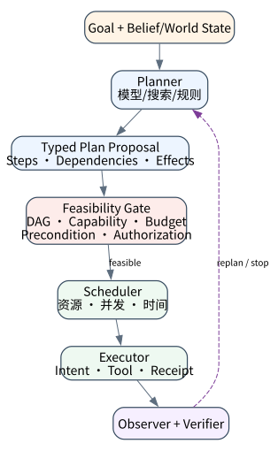
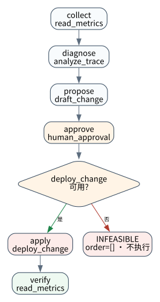

# Planning 与 Hybrid Control：从候选步骤到可执行计划

> **本章核心判断**：语言模型生成的是计划候选；只有依赖、能力、资源、授权与动态前置条件共同成立时，它才具备执行资格。

> 规划不是让模型列出若干 bullet。可执行计划必须连接世界状态、前置条件、能力、资源、权限、效果和验证。本章研究与框架事实截至 **2026-09-11**。



## 问题背景与学习目标

模型很容易生成一条语言上连贯的计划，却可能依赖不存在的工具、遗漏关键前置条件、形成循环、超出预算，或把不可解任务伪装成成功。执行前不做可行性检查，等于把规划错误转化为环境副作用。

本章连接经典规划、MDP/POMDP 与 LLM planning，区分 plan、policy、workflow 和 schedule；定义依赖 DAG、capability/resource feasibility 与 effect boundary；解释何时使用固定工作流、何时局部模型化；并通过删除部署能力证明计划在执行之前被拒绝。

## 核心概念与系统直觉

### Plan、Policy、Workflow、Schedule

- **Plan** 是针对当前问题实例的候选动作结构；
- **Policy** 是给定状态/观察时选择动作的规则；
- **Workflow** 是预先定义的控制图，节点可确定或由模型驱动；
- **Schedule** 把可行计划映射到时间、资源与并发槽位。

一串自然语言步骤通常只是一份 proposal，既没有可执行语义，也没有证明依赖满足。

### 开环与闭环

开环规划在开始时生成完整序列，然后照单执行；闭环控制在每个关键观测后更新 belief/state，再继续、修复或停止。真实 Agent 环境部分可观察、工具会失败且外部状态变化，所以长任务必须包含监测与 replanning，而不是一次性写完所有步骤。

### Hybrid Control

Hybrid Control 把擅长语义判断的模型节点嵌入确定性控制骨架：模型负责诊断、候选分解或证据解释；代码负责 DAG、能力、预算、审批、调度、状态转移与后置条件。它不是妥协方案，而是把不同不确定性放在合适的层。

## 原理与理论基础

### 从经典状态空间到部分可观察规划

经典确定性规划可表为 $\langle S,A,T,s_0,G\rangle$：动作有前置条件和效果，目标是找到从初态到目标集合的路径。随机环境加入转移分布形成 MDP；观测不完整则形成 POMDP，策略作用于 belief state 而非真实状态。

LLM 提供强大的先验和语义分解，但通常没有显式、完备、正确的转移模型。因此模型生成的计划应视为启发式候选，交由 symbolic/typed checker 验证可表达的约束，并在执行中用真实观测修正。

### 图、能力与资源可行性

令计划 $P=(V,E)$，每个步骤 $v$ 有 capability $cap(v)$、成本 $c(v)$ 与 effect class。最小可行性条件为：

$$
DAG(P)\land \forall v,cap(v)\in C_{available}
\land \sum_v c(v)\le B
\land Preconditions(v)
$$

拓扑可排序只是结构可行；它不证明动作会成功。工具可用也不等于当前身份获权。教材把这些检查拆开，以便 reason code 精确定位失败。

### 无解与弃权是第一等结果

> **Invariant**：an execution order may be published only when the complete plan is acyclic, capability-feasible, and within budget

如果必要能力缺失、目标矛盾或预算不足，正确结果是 `INFEASIBLE/NEEDS_CAPABILITY/NEEDS_HUMAN`，而不是编造替代动作。[Agent Planning Benchmark](https://arxiv.org/abs/2606.04874) 明确加入损坏工具、多余工具和不可解任务，反映了真实部署中的工具目录噪声。

## 关键机制与执行流程



事故变更计划包括 `collect → diagnose → propose → approve → apply → verify`。规划器输出 typed steps；validator 检查 ID 唯一、dependency 存在、无环、capability 可用、成本非负且总预算内；只有报告 `feasible=true` 才向 scheduler 发布 execution order。

执行时每一步还需要：重新检查动态前置条件、持久化 intent、调用工具、记录 receipt、验证 postcondition。失败后 replanner 只能修改尚未提交的未来步骤；已经发生的副作用通过补偿或新计划处理，不能假装回滚时间。

## 从原理到实现

### 先验证图，再暴露执行顺序

```python
report = PlanValidator().validate(
    steps,
    capabilities={
        "read_metrics", "analyze_trace", "draft_change",
        "human_approval", "deploy_change",
    },
    budget=20,
)
if not report.feasible:
    return {"status": "INFEASIBLE", "reasons": report.errors}
schedule(report.execution_order)
```

validator 仅在所有约束通过时返回 execution order。这避免调用方错误地使用“部分拓扑序”执行一个整体已失败的计划。

### Kahn 拓扑排序与能力检查

```python
for step in materialized:
    for dependency in step.depends_on:
        if dependency not in by_id:
            errors.append(f"missing_dependency:{step.step_id}:{dependency}")
    if step.capability not in capabilities:
        errors.append(
            f"unavailable_capability:{step.step_id}:{step.capability}"
        )

while ready:
    current = ready.pop(0)
    order.append(current)
    for follower in sorted(followers[current]):
        indegree[follower] -= 1
```

稳定排序使相同输入在 macOS/Linux、arm64/x86_64 得到同一顺序。关键断点是 capability lookup、indegree 构建、cycle 判定、budget gate 和执行器调用入口。

## 主流系统实现对照与源码阅读入口

[Tree of Thoughts](https://proceedings.neurips.cc/paper_files/paper/2023/hash/271db9922b8d1f4dd7aaef84ed5ac703-Abstract-Conference.html) 探索多候选搜索，[LATS](https://proceedings.mlr.press/v235/zhou24r.html) 结合语言 Agent、树搜索与外部反馈。这些方法增强搜索，但生产实现还需 capability、权限与副作用语义。

[LangGraph](https://github.com/langchain-ai/langgraph)、[Google ADK](https://github.com/google/adk-python) 和 [Microsoft Agent Framework](https://github.com/microsoft/agent-framework) 支持 workflow/graph 编排；[OpenAI Agents SDK](https://openai.github.io/openai-agents-python/) 侧重 agent loop、handoff 与工具。读源码时检查：图是静态还是可动态修改、interrupt/checkpoint 边界在哪里、并行节点如何 join、重试是否会重做副作用、计划修订如何版本化。

| 项目 | 本章源码入口 | 核查重点 |
|---|---|---|
| LangGraph | StateGraph/CompiledGraph、interrupt | graph revision、join 与恢复边界 |
| Google ADK | Sequential/Parallel/Loop agents | 确定控制与模型节点如何组合 |
| Microsoft Agent Framework | workflow executor、checkpoint | request/response 与恢复时的节点语义 |
| AgentLab PlanValidator | dependency/capability/budget gate | 整体失败时不得发布部分执行顺序 |

## 设计方案与方法对比

| 方法 | 环境假设 | 优势 | 风险 |
|---|---|---|---|
| 固定 DAG | 流程稳定 | 易审计、易恢复 | 对新情况僵硬 |
| ReAct 在线一步规划 | 反馈及时 | 适应变化 | 短视、循环、成本不可控 |
| 先规划后执行 | 子任务可分解 | 全局结构清晰 | 计划很快过期 |
| 搜索/树规划 | 可评价中间节点 | 可比较候选 | 分支成本高、评价器偏差 |
| Hybrid graph + local agent | 部分结构已知 | 风险与弹性平衡 | 边界设计复杂 |

工程上通常从固定骨架开始，只把不确定、可逆、可验证的节点交给模型。当观测改变关键前提时触发局部 replanning，而不是每步重写整个图。

## 可复现实验

### 实验环境

Python `>=3.11,<3.14`，无网络与 API key；macOS/Linux、`arm64/x86_64` 均可。计划含 6 个非 Hello-World 事故步骤、5 类能力和成本 17；实验不执行部署，以便将“规划可行性”与“执行效果”严格分开。

### Lab 05A — 可行计划

```bash
PYTHONPATH=src python3 examples/chapters/ch05_planning.py
```

实际输出应给出 `feasible=true`、总成本 17 和完整顺序 `collect, diagnose, propose, approve, apply, verify`。验收要求 errors 为空且执行门才被打开。[Lab 05A](../../../labs/core/lab-05A-planning.md)

### Lab 05B — 必要能力缺失

```bash
PYTHONPATH=src python3 examples/chapters/ch05_planning.py --fault
```

实际输出必须出现 `unavailable_capability:apply:deploy_change`、`execution_order=[]` 与 `execution_started=false`，证据为 `L3_CONTAINED`。关键断点在 `PlanValidator.validate` 的 capability 检查和最终发布顺序处。[Lab 05B](../../../labs/core/lab-05B-planning-fault.md)

## 工程场景与系统设计

生产 incident Agent 应把世界状态版本、证据时间和能力 manifest 摘要写入 plan header。`apply` 前重新读取当前部署版本并验证审批仍绑定相同 change set；`verify` 使用独立健康指标，而不是让执行工具自证成功。若版本已变化，旧计划进入 `STALE` 并重新诊断。

计划 API 可返回 `{plan_id, revision, assumptions, steps, constraints, feasibility}`。每次修订保留父 revision 和变更理由；执行器只接受已验证且当前 revision 的计划，以防 planner 与 scheduler 的竞态。

## 故障模型、失败模式与排错

| 失败 | 现象 | 正确机制 |
|---|---|---|
| 依赖缺失/环 | 无合法拓扑序 | 静态拒绝，不执行局部序列 |
| capability 幻觉 | 计划引用未注册工具 | manifest 校验并可选择弃权 |
| 预算低估 | 执行中途耗尽 | 上界估计、阶段预算、升级策略 |
| 前提过期 | 合法旧计划作用于新世界 | 执行前版本检查与 replanning |
| 循环修复 | planner 重复同类失败 | 失败分类、尝试上限、人工接管 |
| verifier 同源 | 工具错误被自身“证明” | 独立观测通道 |

排错应区分 planning error、scheduling error、execution error 与 verification error。只看最终失败会让团队错误地靠扩大模型解决数据库权限或工具损坏。

## 性能、可靠性与工程化

指标包括 plan feasibility rate、unsolvable detection precision/recall、平均分支因子、修订次数、stale-plan rate、capability mismatch、预算预测误差、verified success 与每个成功任务的工具调用数。规划 token 更少不一定更优；多一步验证可能显著降低错误副作用。

可靠性测试需要生成循环、缺依赖、重复 ID、负成本、能力缺失、预算边界和计划过期。对搜索式规划，还需固定 evaluator 版本并报告候选数与选择偏差。

## 技术边界与设计取舍

教材 `PlanValidator` 只检查结构、静态 capability 和简单加总成本，不理解领域前置条件、并发资源、持续时间或随机转移；它证明 fail-before-execute 机制，不证明计划最优或真实部署成功。

过度形式化会增加建模成本，过度自由则难以验证。可行边界通常是：对高风险 effect 建精确类型和前后置条件，对开放语义任务保留模型弹性，再用观测闭环连接两者。

## 前沿研究与演进方向

截至 2026-09-11，研究重点包括基于外部反馈的搜索、动态工具集中的计划、长时程 credit assignment、不可解识别、世界模型与验证器。[APB](https://arxiv.org/abs/2606.04874) 的 4,209 个多模态案例覆盖 22 个领域，并显式加入工具故障和不可解任务，推动评测从“理想工具箱”走向现实不确定性。

开放问题是：如何用有限环境调用校准搜索；如何防止 learned verifier 与 planner 共谋同一错误；如何对已执行计划做安全局部修复；如何建立跨 Agent 委托的全局资源约束；以及如何在动态环境下区分计划差、工具坏和目标本身不可达。

### 深度审计与研究证据链：可执行规划

经典规划给出状态、动作和可达性的形式语义，Tree of Thoughts/LATS/APB 表明搜索与不完美工具环境的研究进展，六步事故 DAG 则验证本地静态 gate。由于实验不执行部署，它不能证明真实世界转移或计划最优性。

## 本章总结与进阶实践

计划是一份需要验证的候选程序。DAG、capability、预算、权限和前置条件共同决定它能否执行；真实观测决定它是否继续。Hybrid Control 通过固定安全骨架和局部模型决策同时保留弹性与治理。

进阶实践：为每个步骤加入 `precondition_version` 和 `postcondition`；在 `apply` 前修改世界版本，证明执行器将计划标记为 `STALE`，随后只重规划 `apply/verify` 子图而不重复 `collect` 的已验证读结果。

### 思考题与实践

1. plan、policy、workflow 和 schedule 的语义有何不同？
2. 为什么存在拓扑序仍不足以证明计划可执行？
3. 不可解任务识别应如何计入 Agent 能力，而不是失败率？
4. 何时应局部 replanning，何时必须重新规划全部步骤？
5. 如何避免 planner 与 verifier 共享同一系统性偏差？

参考答案见[附录 G：第五章参考答案](../appendix-g-part1-solutions.html#part1-solutions-ch05)。
