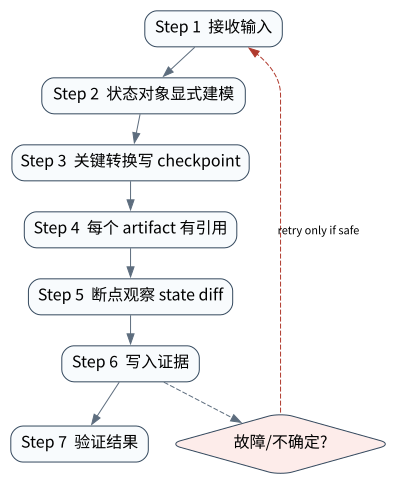

# Agent State 与 Trajectory：可恢复、可重放、可并发的执行语义

> **本章核心判断**：Durable execution 依赖合法事件、版本化状态和效果对账；恢复控制流不等于回滚或重复执行外部世界。

> 长时程 Agent 的核心不是“记住聊天”，而是在中断、重试和并发写入后仍能回答：现在处于什么状态、为什么、下一步是否安全。本章事实窗口截至 **2026-09-11**。


## 问题背景与学习目标

一个 run 可能等待人工数小时、在工具调用中崩溃、由另一进程恢复，或被两个 worker 同时领取。如果只保存最后一段对话，就无法区分“尚未执行”“已经提交但响应丢失”和“已验证完成”；如果只覆盖一个 JSON state，又无法解释状态为何变化。

本章建立 state/event/checkpoint/trajectory 的分层模型；用 reducer 定义合法状态机；用 compare-and-swap（CAS）阻止 stale writer；区分 replay determinism 与模型字节级复现；并运行真实文件 checkpoint 实验，而非在内存里伪造版本冲突。

## 核心概念与系统直觉

### 权威状态与派生状态

权威事件记录“发生了什么”，reducer 计算当前 state。checkpoint 是为了快速恢复而保存的派生快照，必须关联事件位置或 trajectory digest。UI 状态、缓存和索引都是可重建视图，不应反向覆盖权威记录。

### State、Checkpoint、Memory、Trajectory

- **Run state**：phase、pending action、budget、版本、取消状态等控制事实；
- **Checkpoint**：在特定边界持久化的可恢复快照；
- **Trajectory**：按序排列的输入、决定、工具动作、观测和验证；
- **Memory**：供未来任务检索的信息，不一定参与当前 run 恢复。

Checkpoint 不是 memory，保存 messages 也不自动形成 checkpoint。恢复需要代码版本、schema、工具语义和外部副作用状态共同兼容。

### Durable execution 的真正边界

Durable execution 不能让外部世界回滚。它能保证 Runtime 在已知持久化点继续，并通过 journal/idempotency/reconciliation 处理效果。若工具调用在发送后进程崩溃，checkpoint 只能告诉你 intent；是否实际生效仍需外部查询。

## 原理与理论基础

### 状态机与不变量

设 phase 集合为 `RECEIVED/RUNNING/WAITING_TOOL/FINISHED/FAILED`，转移关系 $R$ 明确允许的边。有效轨迹要求：

$$
seq(e_i)=i,\quad from(e_i)=state_{i-1},\quad
(from(e_i),to(e_i))\in R
$$

终态单调：到达 `FINISHED` 或 `FAILED` 后，不能追加普通 `RUNNING` 转移；若业务允许重开，应建立新 run/revision，而不是改写旧终态。

### Reducer 与重放确定性

给定同一有序事件和同一 reducer 版本，派生状态应确定：$Reduce(E)=S$。这不要求再次调用模型得到相同 token。恢复时通常重放已持久化的决定/观测；只有遇到尚未决策的新边界才重新调用模型。

### 并发与 lost update

> **Invariant**：state transitions must replay legally, and a stale writer must never overwrite a newer run version

两个 worker 都读取版本 $v$，A 保存得到 $v+1$，B 随后覆盖会丢失 A 的状态。CAS 规定：

$$
Save(S', expected=v) =
\begin{cases}
v+1,& current=v\\
Conflict,& current\ne v
\end{cases}
$$

CAS 防止静默覆盖，但不等于分布式锁或 fencing。跨主机长租约还要 token/epoch，避免租约过期的旧 worker 继续对外写入。

## 关键机制与执行流程



正常轨迹：`RECEIVED → RUNNING → WAITING_TOOL → RUNNING → FINISHED`。每个 event 有严格 sequence、from/to phase 与 reason；reducer 验证后生成 digest；checkpoint store 在文件锁内读取当前版本、比较 expected version、写临时文件、`fsync`、原子替换并同步目录。

故障路径中 reader A/B 都读取 version 1。A 保存运行中轨迹成为 version 2；B 仍以 expected version 1 写 `FINISHED`，store 抛出 `CheckpointConflictError`。最终权威快照仍是 version 2/RUNNING，证明旧写者没有制造虚假完成。

## 从原理到实现

### reducer 先验证再演化

```python
phase = RunPhase.RECEIVED
for expected_sequence, event in enumerate(events, 1):
    if event.sequence != expected_sequence:
        errors.append(f"sequence_gap:{expected_sequence}:{event.sequence}")
    if event.from_phase != phase:
        errors.append(f"from_state_mismatch:{event.sequence}")
    if event.to_phase not in ALLOWED[phase]:
        errors.append(f"illegal_transition:{phase.value}->{event.to_phase.value}")
    if errors:
        break
    phase = event.to_phase
```

无效轨迹不能被 `persist_replay` 写入 checkpoint。reason 是公共、结构化的转移依据，不保存私有思维链。

### versioned checkpoint

```python
reader_a = store.load("run-2048")
reader_b = store.load("run-2048")

version2 = persist_replay(
    store, run_id="run-2048", replay=running_replay,
    expected_version=reader_a["version"],
)
with pytest.raises(CheckpointConflictError):
    store.save(
        "run-2048", {"phase": "FINISHED", "writer": "stale-b"},
        expected_version=reader_b["version"],
    )
```

关键断点包括 reducer sequence/from/to 检查、文件锁获取、CAS 比较、`os.replace` 和加载最终快照。实验测试的是真实 store 路径；生产数据库应把 CAS 映射到条件更新或事务。

## 主流系统实现对照与源码阅读入口

[LangGraph](https://github.com/langchain-ai/langgraph) 的 persistence/interrupt 机制、[Google ADK](https://github.com/google/adk-python) 的 session/event/runner、[Microsoft Agent Framework checkpoint 文档](https://learn.microsoft.com/en-us/agent-framework/workflows/checkpoints) 以及 [OpenAI Agents SDK](https://openai.github.io/openai-agents-python/) 的 RunState/session 都展示了不同层次的状态管理。

对照时不要只问“能否 resume”，而要问：checkpoint 发生在模型前还是工具前后；pending tool call 如何序列化；schema/code 版本怎样迁移；恢复是否重放副作用；同一 run 多写者如何仲裁；外部 effect 的 unknown 状态如何对账。框架 checkpoint 是控制流能力，不是数据库与第三方 API 的原子事务。

| 项目 | 本章源码入口 | 核查重点 |
|---|---|---|
| LangGraph | checkpointer、thread state、interrupt | checkpoint 边界与 pending task |
| Google ADK | session service、events、runner | 会话持久化和恢复所有权 |
| Microsoft Agent Framework | workflow checkpoints | serializer、request/response 与恢复 |
| OpenAI Agents SDK | RunState、session | run continuation 与应用 effect journal 的边界 |
| AgentLab CheckpointStore | file lock、atomic write、CAS | stale writer 与损坏快照如何 fail-closed |

## 设计方案与方法对比

| 状态方案 | 恢复能力 | 并发语义 | 适用范围 |
|---|---:|---:|---|
| 仅内存对象 | 无 | 进程内 | 短暂低风险调用 |
| 覆盖式 JSON 快照 | 基础 | 易 lost update | 单写者教学/本地工具 |
| 版本化快照 + CAS | 较强 | 检测冲突 | 单库多 worker |
| 事件日志 + snapshot | 强、可审计 | 需一致性设计 | 长时程生产 run |
| Workflow engine | 强、定时/重试成熟 | 由引擎提供 | 跨小时/跨服务业务流程 |

事件溯源不是默认答案：事件 schema 与迁移成本很高。风险较低、生命周期短的 run 可使用版本快照；一旦需要解释、重放或副作用对账，就应引入 append-only journal。

## 可复现实验

### 实验环境

Python `>=3.11,<3.14`，macOS/Linux，`arm64/x86_64`；文件锁路径针对 POSIX 环境。无网络、无 API key。每次运行使用新临时目录，实际执行原子 JSON checkpoint、版本递增和 CAS 冲突，不共享开发者已有数据。

### Lab 06A — 合法轨迹与终态快照

```bash
PYTHONPATH=src python3 examples/chapters/ch06_state.py
```

实际输出应为 `phase=FINISHED`、`version=3`、`trajectory_valid=true`，并有 trajectory SHA-256 显示摘要。验收要求 reducer 和 checkpoint 版本共同到达终态。[Lab 06A](../../../labs/core/lab-06A-state.md)

### Lab 06B — stale writer

```bash
PYTHONPATH=src python3 examples/chapters/ch06_state.py --fault
```

实际输出必须为 `stale_write_rejected=true`、`version=2`、`phase=RUNNING` 与 `L3_CONTAINED`。若 phase 变成 FINISHED，即使捕获了异常也验收失败。关键断点在 `JsonCheckpointStore.save` 的 current/expected 比较。[Lab 06B](../../../labs/core/lab-06B-state-fault.md)

## 工程场景与系统设计

长时审批场景应在创建 action intent 后 checkpoint，然后释放 worker；审批事件到达时由任意新 worker 加载 run、验证版本和 action identity，再推进。调度层用 lease + fencing token 防止旧 worker 继续写；effect journal 记录外部请求幂等键和 receipt；verifier 完成后才产生终态事件。

部署与迁移需要 run schema version、code/workflow version 和 tool contract version。新版本不能读取旧快照时，应显式迁移、继续使用旧 worker，或将 run 升级人工；绝不能把解析失败当作“从头执行”。

## 故障模型、失败模式与排错

| 故障 | 危险结果 | 防线 |
|---|---|---|
| stale writer | 新状态被旧快照覆盖 | CAS + fencing |
| sequence gap | 事件丢失或乱序 | 连续序号与完整性检查 |
| terminal re-entry | 已完成 run 再次执行 | 终态单调与新 revision |
| checkpoint corrupt | 恢复到部分写入 | temp + fsync + atomic replace |
| code/schema drift | 老 run 无法反序列化 | versioned migration/canary |
| effect/checkpoint gap | 不确定是否已写外部系统 | journal + idempotency + reconcile |

排错先冻结 run，读取事件和 checkpoint digest，再检查 worker lease/版本，最后对账外部效果。不要删除损坏快照后重跑，这会毁掉最关键的事故证据。

## 性能、可靠性与工程化

核心指标包括 checkpoint latency/bytes、conflict rate、replay duration、pending-state age、stuck-run count、reconciliation backlog、corruption/migration failure 和 recovery time objective。checkpoint 太频繁增加 I/O，太稀疏扩大重放与重复调用窗口；边界应围绕不可重算决定和副作用 intent 选择。

压缩事件日志前要保留 snapshot 对应的 event offset/digest，并通过从旧基线重放验证等价。并发压测不仅看吞吐，还要注入进程 kill、磁盘满、延迟写和租约过期。

## 技术边界与设计取舍

教材 store 通过 POSIX 文件锁与原子替换提供单机 crash-conscious 语义，不提供 Windows 支持、跨主机共识、复制、fencing 或灾备。CAS 只保护 checkpoint；若旧 worker 已持有外部数据库凭据，它仍可能绕过 checkpoint 写外部系统。

轨迹重放也不是时间旅行：已发送邮件、删除文件或创建工单不会因加载旧 checkpoint 而撤销。调试 fork 必须默认使用沙箱、只读工具或新命名空间。

## 前沿研究与演进方向

长时程 Agent 把传统 workflow、事件溯源、分布式一致性与 learned policy 结合起来。[Long-Horizon Agent Benchmark](https://arxiv.org/abs/2608.01964) 强调 Harness 在长期任务中的决定性影响；记忆系统研究进一步要求区分短期运行状态、长期知识和可治理更新。

开放问题包括：随机模型升级下的语义 replay；跨框架 checkpoint 的可移植格式；工具副作用与状态日志之间可组合的 effect semantics；多 Agent 对共享世界状态的冲突解决；以及如何验证一次恢复没有改变任务风险与授权边界。

### 深度审计与研究证据链：状态与恢复

分布式系统的状态机/CAS 原理规定正确性边界，官方框架用于对照 checkpoint 抽象，本仓库真实文件写入与 stale-reader 竞争提供局部机制证据。没有外部资源端 fencing 和崩溃矩阵，就不能宣称跨主机 exactly-once。

## 本章总结与进阶实践

可恢复 Agent 需要合法状态机、权威事件、版本化 checkpoint 和外部效果对账。replay 的目标是恢复控制语义，不是重现相同自然语言；CAS 的目标是拒绝旧写者，不是替代分布式协调。

进阶实践：为 checkpoint 增加 `workflow_version/event_offset/fencing_token`，模拟租约过期 worker 在 CAS 之外直接调用工具；证明执行器也检查 fencing token，并把被拒动作记录为安全事件。

### 思考题与实践

1. checkpoint、trajectory 和 memory 各自的权威边界是什么？
2. 为什么 CAS 能防 lost update，却不能独自阻止旧 worker 的外部副作用？
3. 恢复为何不应重新采样所有历史模型决定？
4. 什么事件必须在工具调用之前持久化？
5. 如何验证事件日志 compaction 前后派生状态等价？

参考答案见[附录 G：第六章参考答案](../appendix-g-part1-solutions.html#part1-solutions-ch06)。
