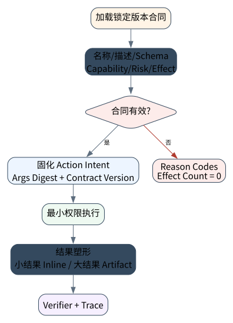

# Tool Design：让模型拥有可用而可控的双手

> **本章命题**：Tool 不是“给模型看的函数列表”，而是概率决策系统与确定性执行系统之间的 ABI。一个可上线的工具契约必须同时界定：何时使用、何时不用、输入与输出形状、最小能力、风险、效果语义和证据出口。

第一篇已经把模型输出限制为候选 Intent。本章回答下一步：怎样把 Intent 映射为狭窄、可验证、不会因一句提示注入就无限扩权的动作接口。


## 问题背景与学习目标

传统 API 假设调用方是确定性程序；Agent Tool 的调用方会误选工具、漏填约束、混淆相似概念，还可能把不可信内容当成指令。因此，一个在 OpenAPI 中“合法”的接口，不一定是好的 Agent Tool。把 `run_shell(command: string)` 暴露给模型，schema 很短，却把文件、网络、进程和凭据的组合权限一起交了出去。

完成本章后，读者应能：

- 把工具描述写成可评测的 affordance，而不是内部 API 注释；
- 区分 schema correctness、semantic validity、authorization 与 effect safety；
- 用 risk × effect semantics 推导审批、幂等键、对账与 verifier；
- 把大结果转成有摘要、有哈希、有介质类型的 artifact，而非塞回上下文；
- 设计 tool-selection eval，测量错选、漏选、参数错误和输出误用，而不是只测最终答案。

## 核心概念与系统直觉

### Affordance 是决策界面

函数名告诉编译器“怎么调用”，affordance 要告诉模型“在什么任务状态下值得调用”。描述至少包含 use-when、do-not-use、对象身份、结果含义、典型失败和成本。相邻工具应具有可区分边界；若 `search_customer`、`find_user`、`lookup_account` 的语义重叠，模型性能问题首先是工具集设计问题。

### Schema 约束表示，不证明授权

`invoice_id` 是字符串，只能说明它的表示；它是否属于当前租户、当前操作者能否读取、账单是否已删除，需要目录、策略和业务状态验证。Schema 是第一道门，不是安全证明。

### Capability 与 Tool 分离

Tool 是调用界面，capability 是执行主体得到的权力。`billing.invoice_read` 可要求 `billing.invoice.read`，但模型看见工具并不自动获得该 capability。注册、选择、授权、执行是四个不同事件。

### Result 是 Observation，不是事实本身

工具返回值可能陈旧、截断、含注入文本或与真实效果脱节。结果必须带 provenance、观察时间、状态码和必要 receipt；大对象进入 artifact store，模型只得到受限 preview 与内容哈希。

## 原理与理论基础

把工具契约写为：

$$
T=(N,D,I,O,C,R,E,L,V)
$$

其中 $N/D$ 是名称与使用边界，$I/O$ 是输入输出 schema，$C$ 是 capability 集，$R$ 是风险等级，$E$ 是效果语义，$L$ 是结果预算，$V$ 是 verifier。一个调用只有在以下合取成立时才可提交：

$$
Valid(I)\land Semantic(I,S)\land C\subseteq Grant(subject)\land Policy(R,E,I)=allow
$$

本章使用三个效果类别：`pure` 不改变外部状态；`idempotent` 在同一 key 下重复不会增加效果；`reconcilable` 允许通过外部 ledger 查询最终结果。这里的 idempotent 是业务合同，不是 HTTP 方法名称。

**不变量**：a tool contract must expose bounded semantics, least privilege, risk, effects, and result shape。

该不变量可被反例推翻：若不可逆工具声明成 idempotent、capability 为 `*`、或描述没有“不应用于什么”，注册阶段必须失败。

## 关键机制与执行流程



1. **注册审计**：检查 namespace、use/do-not-use 边界、schema 完整性、最小 capability、risk/effect 一致性与结果上限。
2. **候选选择**：模型只能从当前主体可见的工具视图中提出调用；不可见能力不进入 prompt。
3. **参数三门**：syntax/schema gate 后仍要过 semantic 与 authorization gate。
4. **Intent 固化**：保存 canonical args digest、tool contract version、subject 和 action identity。
5. **受控执行**：Runtime 施加 timeout、credential scope、network/filesystem policy。
6. **结果塑形**：小结果内联；大结果写入 content-addressed artifact，只返回 preview、hash 与 handle。
7. **独立验证**：对于写动作，工具成功响应不等于业务完成，后置条件由 verifier 重新观察。

## 从原理到实现

本书的参考实现位于 `src/agentlab/knowledge_system.py`。注册器不是简单存字典，而是拒绝含混或自相矛盾的合同：

```python
def validate_tool_contract(contract: ToolContract) -> tuple[str, ...]:
    errors = []
    if not re.fullmatch(r"[a-z][a-z0-9_]*\.[a-z][a-z0-9_]*", contract.name):
        errors.append("name_must_be_namespaced")
    lowered = contract.description.lower()
    if "use when" not in lowered or "do not use" not in lowered:
        errors.append("description_missing_use_and_non_use_boundary")
    if not contract.capabilities or "*" in contract.capabilities:
        errors.append("capability_scope_not_least_privilege")
    if contract.risk is Risk.IRREVERSIBLE and contract.effect is EffectSemantics.IDEMPOTENT:
        errors.append("irreversible_effect_requires_reconciliation_contract")
    return tuple(errors)
```

正常路径使用 `billing.invoice_read`。1504-byte 原始 JSON 不进入模型上下文，而是得到稳定 artifact identity：

```python
raw = json.dumps(invoice, sort_keys=True).encode()
artifact = store.put(raw, media_type="application/json")
observation = {
    "artifact_id": artifact.artifact_id,
    "sha256": artifact.sha256,
    "bytes": artifact.bytes,
    "preview": artifact.preview,
}
```

这段代码没有调用大模型；它验证的是 tool ABI 和 result-shaping 机制。模型是否能选对工具必须在另一个 provider eval 中测量。

## 主流系统实现对照与源码阅读入口

| 对照对象 | 提供的机制 | 阅读时要追问 |
|---|---|---|
| [OpenAI Responses API](https://developers.openai.com/api/reference/cli/resources/responses/methods/create) | custom function、hosted tool、MCP tool 与 tool choice | provider item 如何映射为本地 canonical intent；参数何时算完整 |
| [OpenAI Agents SDK](https://github.com/openai/openai-agents-python) | function tools、guardrails、sessions、tracing | tool schema 生成、调用错误、approval 与 trace 的责任边界 |
| [Anthropic 工具工程指南](https://www.anthropic.com/engineering/writing-tools-for-agents) | namespacing、精确描述、token-efficient response、tool eval | 工具描述变化如何进入回归数据，而非凭直觉上线 |
| [Toolformer](https://arxiv.org/abs/2302.04761) | 模型学习何时调用外部工具的研究基线 | “会调用”与“被授权安全执行”之间还缺哪些系统层 |

官方 SDK 提供 provider-facing schema 与循环便利层，但业务 capability、effect classification、artifact retention 和 verifier 仍属于应用责任。不要从客户端 SDK 推测云端 scheduler 或策略引擎。

## 设计方案与方法对比

| 设计 | 优点 | 结构性风险 | 适用条件 |
|---|---|---|---|
| 万能 shell/browser | 开放任务覆盖高 | 组合权限巨大，语义难审计 | 强 sandbox、短生命周期 workspace、人工审批 |
| 细粒度 CRUD | 权限与审计清晰 | 工具数量膨胀、选择混淆 | 稳定业务域、严格合规 |
| 任务级聚合工具 | 降低调用次数和上下文 | 服务器逻辑更重 | 高频、边界清晰的业务动作 |
| 动态 tool search | 上下文小、可扩展 | 工具发现本身需治理 | 大型多域工具目录 |

粒度没有全局最优。正确方法是在代表性任务集上同时测 task success、wrong-tool rate、argument validity、unsafe-effect rate、token/latency，并把工具描述视为可版本化模型输入。

## 可复现实验

### 实验环境

- Python 3.11–3.13，macOS/Linux，arm64/x86_64；
- `uv sync --locked --all-groups --no-install-project`；
- 无网络、无 API key；核心 SUT 为 `ToolContract` validator 与 `ArtifactStore`；
- 入口 `examples/chapters/ch07_tool_design.py`，单测 `tests/test_knowledge_system.py`。

### Lab 07A：合法合同与内容寻址结果

```bash
PYTHONPATH=src uv run python examples/chapters/ch07_tool_design.py
```

实际输出的关键字段为：`contract=billing.invoice_read`、`errors=[]`、`dispatched=true`、`artifact.bytes=1504`，证据等级 `L1_MECHANISM`。重复运行得到同一 SHA-256；它证明机制确定，不证明任一模型的工具选择率。

### Lab 07B：万能 shell 与伪幂等声明

```bash
PYTHONPATH=src uv run python examples/chapters/ch07_tool_design.py --fault
```

实际输出包含四个独立理由：`name_must_be_namespaced`、`description_missing_use_and_non_use_boundary`、`capability_scope_not_least_privilege`、`irreversible_effect_requires_reconciliation_contract`；`dispatched=false`，因此为 `L3_CONTAINED`。完整步骤分别见 [Lab 07A](../../../labs/core/lab-07A-tool-design.md) 与 [Lab 07B](../../../labs/core/lab-07B-tool-design-fault.md)。

### 关键断点与验收标准

**关键断点**：在合同验证、capability 收敛、effect 语义判定和 artifact 落盘处分别观察；任一 gate 失败都不得进入 dispatch。**验收标准**：正常路径实际输出必须包含稳定的内容摘要和 `dispatched=true`；故障路径必须返回可定位 reason code、`dispatched=false`且无副作用。

## 工程场景与系统设计

以财务助理为例，不应给它一个“访问 ERP”的总权限。读账单、创建付款草稿、提交付款是三个 contract：读取是 `READ_ONLY/PURE`；草稿是 `REVERSIBLE_WRITE/IDEMPOTENT`；提交是 `IRREVERSIBLE/RECONCILABLE`。只有最后一项要求 action-bound approval、短期凭据、幂等键和外部 receipt。

工具目录还应维护 owner、SLO、data classification、contract version、deprecation window 和 eval set。部署时先 shadow 新版本：记录模型会选什么，但不执行副作用；当错选与参数回归通过阈值后再放量。

## 故障模型、失败模式与排错

- **错工具**：检查描述重叠和 namespace；不要先加 prompt 补丁。
- **对参数**：schema 通过却对象不属于租户，定位 semantic/authorization gate。
- **返回太大**：检查 artifact 化是否发生、preview 是否含来源而不含秘密。
- **伪幂等**：相同 key 产生多个业务效果，必须修复服务端 ledger，不能靠 Agent 避免重试。
- **工具结果注入**：把返回内容标为 untrusted observation，禁止提升为 system/developer instruction。

排错所需最小 trace 是：visible tool-set digest → selected tool/version → canonical args digest → policy decision → effect phase → result/artifact digest → verifier。

## 性能、可靠性与工程化

工具性能不能只报平均延迟。至少采集选择阶段 token、schema bytes、tool-search latency、执行 p50/p95/p99、timeout 后 UNKNOWN 比例、artifact bytes、wrong-tool rate 和 verifier failure rate。目录很大时，优先减少重叠工具和动态检索 schema，而不是把数百个定义一次性注入上下文。

可靠性预算必须按风险分层：读工具可有限重试；幂等写需稳定 key；不可逆写先持久化 Intent，再调用，再以 ledger 对账。输出裁剪要保留 error class、receipt 和 source handle，不能为了省 token 删掉恢复证据。

## 技术边界与设计取舍

本章离线实验能证明合同拒绝和 artifact identity，不能证明自然语言描述对不同模型同样有效，也没有执行真实 ERP。工具可用性是一项经验性质：应在锁定模型、任务分布和工具集版本上运行多 seed eval。

使用 OpenAI 的读者可令 `OPENAI_API_KEY` 只存在于进程环境，以 Responses API 发起 tool-selection eval；证据包保存脱敏 request/response item、request ID、model snapshot、tool-set hash、usage 和 oracle，严禁把 key、Authorization header 或完整客户数据写入仓库。无云 key 时，可用本地小 instruct 模型（例如通过 Ollama/vLLM 暴露 OpenAI-compatible endpoint），但必须记录模型文件哈希、量化、推理参数与硬件，并把结果标为 local-provider evidence。

## 前沿研究与演进方向

研究焦点正在从“能否调用工具”转到 tool ecosystem 的可发现性、接口自动优化、不可解任务识别、权限与结果可信度。自动优化工具描述必须受 held-out eval 约束，否则容易对单个模型/任务集过拟合。另一个关键方向是让工具合同携带机器可验证的 risk/effect/provenance 元数据，而不把安全语义藏在自然语言里。

### 深度审计与研究证据链：工具能力不等于行动授权

Toolformer 与现代 API 说明模型如何产生调用；Anthropic 的工程资料说明接口设计会显著改变 Agent 表现；本章实现补足注册审计、capability 与 artifact 边界。三类证据不能互相替代：论文不是生产权限证明，SDK 文档不是业务 effect 证明，离线 validator 也不是模型质量证明。

## 本章总结与进阶实践

工具是一个受治理的动作合同，而不是 prompt 附件。高质量系统将“候选调用”“授权”“副作用”“观测”拆开，并让每一步留下可验证身份。

进阶问题：

1. 为什么 `additionalProperties=false` 仍不能阻止跨租户访问？
2. 一个工具何时应拆成读/草稿/提交三个接口？
3. 怎样建立 tool-selection eval，避免只测 happy path？
4. artifact preview 应保留哪些字段，删除哪些字段？
5. provider tool-call ID 与本地 action ID 为什么不能合并？

参考答案见[附录 H：第二篇问题参考答案](../appendix-h-part2-solutions.html#part2-solutions-ch07)。
