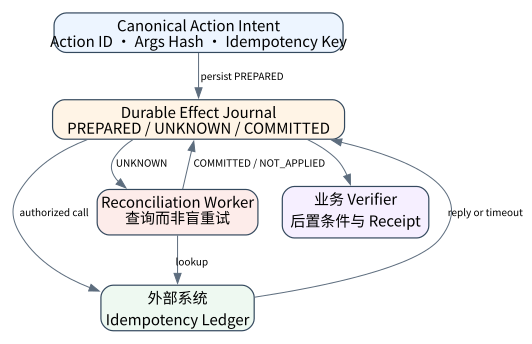
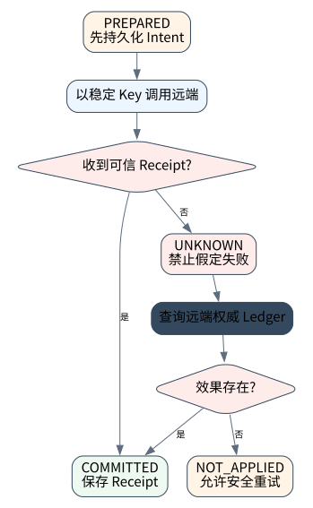

# Tool Runtime：调度、权限、超时、重试与副作用语义

> **本章核心判断**：Runtime 负责把模型的 tool intent 安全地变成现实世界动作，核心是策略、沙箱、幂等、超时、重试和 UNKNOWN 处理。

上一章：Tool Design：让模型拥有可用而可控的双手。本章把前一章已经建立的能力进一步推进到 `Dispatch`；下一章将进入：RAG 基础：检索、证据与生成边界。



## 问题背景与学习目标

Runtime 负责把模型的 tool intent 安全地变成现实世界动作，核心是策略、沙箱、幂等、超时、重试和 UNKNOWN 处理。

在本章的 `Dispatch` 场景中，真实 Agent 系统与普通“问答程序”的差异，在于一次任务会跨越模型、工具、状态、外部环境和人工治理边界。本章所有原理、代码与实验都围绕这些可验证问题展开。


**本章完成标准：**

- **机制理解**：能够解释“Runtime 负责把模型的 tool intent 安全地变成现实世界动作，核心是策略、沙箱、幂等、超时、重试和 UNKNOWN 处理。”，并指出它对应的确定性软件边界；
- **正确性判断**：能够针对 `ambiguous side effects must be represented as UNKNOWN rather than guessed` 构造一个反例，说明证据不足时系统为什么不能继续乐观执行；
- **实验与迁移**：运行 `Lab 08A` / `Lab 08B`，分别说明 normal/fault 的 evidence level，并把同一机制映射到至少一个上游实现或协议。

## 核心概念与系统直觉

本节不把概念当作术语清单，而是回答三个工程问题：它**是什么**、在系统里**负责什么**、以及它失效时**会留下什么可观测证据**。

### Dispatch

**定义。** Dispatch 是 Runtime 把已验证的 tool intent 路由到具体实现的过程，包括版本选择、 租户上下文、超时和 tracing。

**系统责任。** 它应在模型输出与真实 executor 之间形成稳定边界，使本地函数、远程 API、MCP server 或 sandbox command 能共享统一事件模型。

**失败边界。** 直接由模型选择 URL/命令并绕过 dispatcher，会失去统一权限、审计和错误语义。

### Policy

**定义。** Policy 是执行前的确定性允许/拒绝逻辑，依据主体身份、tool、参数、资源、时间、预算和审批状态判断。

**系统责任。** Policy engine 应独立于模型，必要时返回可解释 deny reason 或需要人工确认的 challenge。

**失败边界。** 把 policy 写成“请勿删除生产数据”的 prompt 不具备强制力，也无法审计谁授予了权限。

### Timeout

**定义。** Timeout 是调用在规定时间内没有得到足够完成证据时的 Runtime 状态，而不是等同于失败。

**系统责任。** 读操作超时通常可重试；写操作超时必须区分 NOT_APPLIED、COMMITTED 和 UNKNOWN，并结合 idempotency/reconciliation。

**失败边界。** 最危险的错误是 timeout 后立即重试非幂等写入，从而制造重复 effect。

### Idempotency

**定义。** Idempotency 表示相同 logical action 被重复提交时不会产生额外业务效果，通常通过 idempotency key、dedupe table 或业务唯一约束实现。

**系统责任。** Agent Runtime 应为可能重放/重试的 effect 分配稳定 action_id，并让外部系统或 adapter 识别它。

**失败边界。** 如果下游不支持幂等，Runtime 至少需要 query/reconciliation 或人工确认，否则 crash recovery 无法安全自动化。

## 原理与理论基础

### 系统不变量

> **Invariant**：ambiguous side effects must be represented as UNKNOWN rather than guessed

不变量与普通“最佳实践”不同：最佳实践可以因为场景变化而替换，不变量一旦被破坏，系统就失去本章希望保证的正确性。例如 `UNKNOWN 写操作自动重试` 并不是一个 UI 问题，而是说明某个状态已经无法从证据中唯一判断。


### 故障模型

本章优先把 “UNKNOWN 写操作自动重试”、“HTTP 200 当作业务成功”、“凭据进入模型上下文” 作为可证伪故障，而不是泛化地枚举所有异常。对涉及外部 effect 的失败，判定顺序固定为“最后 durable state → effect 是否可能发生 → 现有 observation 是否足够决定下一步”；证据不足时停在 UNKNOWN/显式失败。

### Why / What if / Trade-off

本章真正的设计取舍不是“使用更强模型还是写更多规则”，而是确定 **Dispatch** 与 **Policy** 分别应该由概率性决策还是确定性软件拥有。模型可以帮助识别候选路径，但它不会自动消除“UNKNOWN 写操作自动重试”这类系统失败；该失败必须由 runtime 的 schema、状态机、权限或 verifier 显式约束。

如果把 Dispatch 完全交给模型，系统会把不可验证的语言判断混入执行事实；如果把 Policy 全部硬编码为固定 workflow，又会失去开放任务所需的适应性。更稳健的边界是：让模型负责提出候选决策，让软件负责 `执行前检查策略`、`工具 span 记录 latency/status` 以及对不变量 **ambiguous side effects must be represented as UNKNOWN rather than guessed** 的检查。

**What if。** 一旦“HTTP 200 当作业务成功”发生，系统首先需要判断现有证据是否足够决定下一状态；证据不足时应停在显式失败或待协调状态，而不是让模型用自然语言补全事实。这个边界决定了本章方案是否具有可恢复性，而不只是演示效果。


### 形式化模型与可证伪假设

$$
INTENT\rightarrow EXECUTING\rightarrow\{COMMITTED,NOT\_APPLIED,UNKNOWN\}
$$

工具 Runtime 的核心不是“是否抛异常”，而是对外部副作用结果建立可恢复的 outcome state machine。

**可证伪假设。** 显式 UNKNOWN + idempotency/reconciliation 比 timeout 后直接 retry 更能降低重复副作用。

**建议测量。** unknown-outcome rate、duplicate-effect rate、reconciliation success、idempotency hit rate。

## 关键机制与执行流程



**Step 1 — 执行前检查策略。** 这一阶段可能改变系统或外部环境，因此 `执行前检查策略` 不能只存在于模型文本中。runtime 在执行前绑定 `run_id/step_id` 与参数摘要，执行后记录结果或外部 observation；如果调用可能重复，必须同时定义幂等键或 reconciliation 依据。这里检查的核心是 **ambiguous side effects must be represented as UNKNOWN rather than guessed**。

**Step 2 — 高风险动作先 journal。** 这一阶段可能改变系统或外部环境，因此 `高风险动作先 journal` 不能只存在于模型文本中。runtime 在执行前绑定 `run_id/step_id` 与参数摘要，执行后记录结果或外部 observation；如果调用可能重复，必须同时定义幂等键或 reconciliation 依据。这里检查的核心是 **ambiguous side effects must be represented as UNKNOWN rather than guessed**。

**Step 3 — UNKNOWN 进入 reconcile。** `UNKNOWN 进入 reconcile` 是“Tool Runtime：调度、权限、超时、重试与副作用语义”的一次显式状态转移。输入和输出都必须可序列化并关联 `run_id/step_id`；一旦该步骤失败，后继步骤只能依据已记录状态继续。关键观察点是 `Timeout` 是否仍满足 **ambiguous side effects must be represented as UNKNOWN rather than guessed**。

**Step 4 — 工具 span 记录 latency/status。** `工具 span 记录 latency/status` 把短暂执行状态转换为后续能够读取的证据。写入内容至少要能关联本次 run、前一状态与下一状态；对 crash-sensitive 数据，应明确写入完成的判据。若进程在写入期间终止，恢复代码必须能够区分“没有记录”“完整记录”和“损坏/不确定记录”，而不能把半写状态视作成功。

在本章的 `Dispatch` 场景中，**最后一步 — 验证。** verifier 针对 `Idempotency` 检查本章不变量 **ambiguous side effects must be represented as UNKNOWN rather than guessed**。如果“UNKNOWN 写操作自动重试”使现有 artifact/外部状态不足以证明成功，结果必须停在显式失败或 UNKNOWN；只有 observation 能闭合状态转移时，流程才允许进入 FINISHED。

### 数据流与控制流

本章的数据/控制链按 **执行前检查策略 → 高风险动作先 journal → UNKNOWN 进入 reconcile → 工具 span 记录 latency/status** 推进。调试时不要只看最终 answer，应确认每一阶段的输入来源、状态版本和 observation；对“UNKNOWN 写操作自动重试”尤其要检查动作前后的证据是否足以闭合不变量 **ambiguous side effects must be represented as UNKNOWN rather than guessed**。


### 持久化点与崩溃窗口

本章需要持久化的内容取决于动作可逆性。与 `Dispatch` 有关的纯计算状态通常可以重算；一旦 `高风险动作先 journal` 可能产生昂贵、外部或不可逆效果，就必须在动作前后建立可区分的证据边界。对于本章不变量 **ambiguous side effects must be represented as UNKNOWN rather than guessed**，恢复时最重要的问题是：最后一个已知状态是什么、动作是否可能已经发生、现有 observation 能否唯一决定 retry/continue/compensate。


## 从原理到实现


### 完整实验入口

```python
from __future__ import annotations
import argparse
from agentlab.course_scenarios import run_scenario

def main() -> int:
 p=argparse.ArgumentParser(description='Tool Runtime：调度、权限、超时、重试与副作用语义')
 p.add_argument("--fault", action="store_true", help="inject the chapter-specific failure path")
 args=p.parse_args()
 result=run_scenario('tool-runtime', fault=args.fault)
 print(result.as_json())
 return 0 if result.passed else 2

if __name__ == "__main__":
 raise SystemExit(main())
```

### 核心机制实现

```python
def tool_runtime(fault=False):
    @tool("Remote write", risk="high", idempotent=False)
    def write(x: str):
        if fault:
            raise TimeoutError("response lost after send")
        return {"written": x}

    reg = ToolRegistry(); reg.register(write)
    r = reg.execute("write", {"x": "v"})
    condition = (r.status == "COMMITTED") if not fault else \
        (r.status == "UNKNOWN" and r.retryable is False)
    return _ok("tool-runtime", fault,
               {"status": r.status, "retryable": r.retryable, "error": r.error},
               "ambiguous side effects must be represented as UNKNOWN rather than guessed",
               condition)
```


这里最关键的不是捕获 `TimeoutError`，而是**拒绝从 transport timeout 推导业务失败**。对 `idempotent=False` 的写操作，响应丢失意味着 outcome 可能是 COMMITTED，也可能是 NOT_APPLIED；在获得外部 observation 或幂等键去重证据之前，`retryable` 必须保持 `False`。即便工具声明幂等，Runtime 也仍应把 UNKNOWN 显式暴露给恢复策略，而不是把“可安全重试的提示”误写成“已经证明失败”。


### 简化假设与不能省略的机制


## 主流系统实现对照与源码阅读入口

| 项目 | 本书锁定版本/状态 | 应阅读的机制 | 已核验源码/文档入口 | 官方来源 |
|---|---|---|---|---|
| OpenAI Codex CLI | `0.139.0 historical reproducibility pin` | 从 Rust CLI 的 sandbox/approval/config 入口分析“模型建议动作”和“本地执行权限”如何分离；不要推断公开源码之外的托管服务。 | `codex-rs/utils/cli/src/shared_options.rs`<br>`codex-rs/core/config.schema.json` | [官方来源](https://github.com/openai/codex) |
| OpenHands Software Agent SDK | `v1.24.0 @ fdc2bdf` | 围绕 Conversation、Agent、Tool、Workspace、Event 与 Agent Server 阅读，理解远程 workspace、interrupt、metrics/resume 的服务边界。 | 以官方 docs/release/source tree 为准 | [官方来源](https://github.com/OpenHands/software-agent-sdk) |
| OpenAI Agents SDK | `v0.22.0 @ 4df9ecf` | 从 Agent/Runner 入口追踪 tool loop、RunState、session、guardrail 与 tracing；特别对照 v0.22.0 对 replay state 与 failed/incomplete response 的 hardening。 | 以官方 docs/release/source tree 为准 | [官方来源](https://github.com/openai/openai-agents-python) |

### 源码阅读方法

源码阅读以 **OpenAI Codex CLI** 为第一参照，并只追与“Tool Runtime：调度、权限、超时、重试与副作用语义”直接相关的公开执行链：入口 → durable/session state → 权限或协议边界 → verifier/trace。若上游没有公开某个服务端组件，本章不根据客户端现象反推其内部 scheduler、queue 或 policy engine。


### 工业实现为什么更复杂


对本章最值得关注的工程增量是：如何避免“UNKNOWN 写操作自动重试”、如何在“HTTP 200 当作业务成功”后恢复，以及如何让 `工具 span 记录 latency/status` 的结果能够进入 tracing/evaluation。只有这些机制都能落到公开类型、函数或协议消息上，才算真正完成源码对照。

## 设计方案与方法对比

| 方案 | 核心优势 | 主要局限 | 更适合的约束 |
|---|---|---|---|
| 最小自研 AgentLab | 机制透明、可断点、无网络即可故障注入 | 生态/模型能力有限 | 教学、研究原型、回归基线 |
| OpenAI Codex CLI | 贴近 coding/长期执行 harness，工作区和工具边界更真实 | 依赖更重或迭代快，升级需锁版本做回归 | Coding Agent、Harness 源码学习 |
| OpenHands Software Agent SDK | 贴近 coding/长期执行 harness，工作区和工具边界更真实 | 依赖更重或迭代快，升级需锁版本做回归 | Coding Agent、Harness 源码学习 |
| OpenAI Agents SDK | 官方/主流实现提供成熟抽象与生态 | 抽象会隐藏部分底层机制，需要源码/trace 反推 | 生产集成与方案对照 |


## 可复现实验

本章两个 Core Lab 都直接执行仓库内的确定性代码；它们证明的是“Tool Runtime：调度、权限、超时、重试与副作用语义”对应的本地机制与 fault oracle，而不是外部 provider 或真实云环境。第三方实现只在 `labs/upstream/` 按独立 L5 互操作证据记录，未实际执行时必须保持 `EXTERNAL_NOT_RUN_IN_THIS_RELEASE`。

### 实验环境

统一 Python/OS/离线复现约束、安装步骤与工具链版本集中维护在[附录 A](../appendix-a-environment.md)。本章只增加与“Tool Runtime：调度、权限、超时、重试与副作用语义”直接相关的 normal/fault 双轨验证；若需要真实云、浏览器、GPU 或第三方 provider，则在对应 upstream lab 中单独标记 `NOT_RUN_EXTERNAL`，不把未运行结果计入核心实验。

### Lab 08A — 正常路径

```bash
PYTHONPATH=src python examples/chapters/ch08_tool_runtime.py
```

**关键断点：**
- `src/agentlab/course_scenarios.py::tool_runtime`
- `examples/chapters/ch08_tool_runtime.py::main`
- `src/agentlab/runtime.py::AgentRuntime.run`
- `src/agentlab/tools.py::ToolRegistry.execute`

**本发布包实际输出：**

```json
{"contained": false, "evidence_level": "L1_MECHANISM", "evidence_meaning": "normal_path_assertion_satisfied", "fault": false, "fault_injected": false, "invariant": "ambiguous side effects must be represented as UNKNOWN rather than guessed", "invariant_holds": true, "observation": {"error": null, "retryable": false, "status": "COMMITTED"}, "oracle_detected": false, "passed": true, "recovered": false, "scenario": "tool-runtime", "system_detected": false}
```

PASS：退出码 0，`passed=true`、`fault=false`、`invariant_holds=true`；这只证明确定性 fixture 的正常机制断言。完整手册：[Lab 08A](../../../labs/core/lab-08A-tool-runtime.md)。

### Lab 08B — 故障注入

```bash
PYTHONPATH=src python examples/chapters/ch08_tool_runtime.py --fault
```

**本发布包实际输出：**

```json
{"contained": true, "evidence_level": "L3_CONTAINED", "evidence_meaning": "fault_detected_and_contained", "fault": true, "fault_injected": true, "invariant": "ambiguous side effects must be represented as UNKNOWN rather than guessed", "invariant_holds": true, "observation": {"error": "timeout:response lost after send", "retryable": false, "status": "UNKNOWN"}, "oracle_detected": true, "passed": true, "recovered": false, "scenario": "tool-runtime", "system_detected": true}
```

PASS：退出码 0，`passed=true`、`fault=true`、`oracle_detected=true`。本章故障实验为 **L3_CONTAINED**：被测组件检测并 fail-closed/约束了故障，但不声明已恢复业务结果。 `passed=true` 本身只表示实验 oracle 得到预期观察。完整手册：[Lab 08B](../../../labs/core/lab-08B-tool-runtime-fault.md)。

### 观察与证据


## 工程场景与系统设计

本章复用第 7 章“客户支持 Agent”教学负载，关注 100 QPS 下 tool scheduling、timeout 和幂等键，而不把模拟 fixture 的延迟写成真实服务 SLO。


### 上线前必须补齐

- 围绕 **工具运行时与副作用** 建立可审计状态字段与最小权限；
- 为本章相关动作记录 run_id、step_id、输入摘要与 observation；
- 对 `超时不代表没执行；可能产生外部效果的工具必须有 UNKNOWN 状态。` 这一边界建立自动化验收；
- 为本章主要故障窗口配置 trace、日志和恢复 runbook；
- 上线前把教学 fixture 替换为真实 provider/tool/workspace，并重新执行 normal/fault 两条路径。

## 故障模型、失败模式与排错

本章至少主动测试以下失败：

- **UNKNOWN 写操作自动重试**：先确认最后 durable state，再检查是否已经产生外部效果；不要先重试。
- **HTTP 200 当作业务成功**：先确认最后 durable state，再检查是否已经产生外部效果；不要先重试。
- **凭据进入模型上下文**：先确认最后 durable state，再检查是否已经产生外部效果；不要先重试。


## 性能、可靠性与工程化

### 应采集指标

- `tool/retrieval p50,p95 latency`
- `tool error/UNKNOWN rate`
- `recall@k / evidence coverage`
- `memory hit/conflict rate`
- `payload bytes / turn`


### 优化顺序


任何优化都必须重新运行 Lab A/B。尤其当优化改变 `Policy` 的生命周期时，要重新验证 **ambiguous side effects must be represented as UNKNOWN rather than guessed**；否则平均延迟下降可能以更大的 stale state、重复副作用或取消失效为代价。

### 可靠性工程

本章可靠性 gate 直接针对 “UNKNOWN 写操作自动重试”、“HTTP 200 当作业务成功”、“凭据进入模型上下文”：只有正常路径与对应 fault path 都保持 **ambiguous side effects must be represented as UNKNOWN rather than guessed**，优化或功能扩展才可接受。是否达到 detection、containment 或 recovery 以实验的 `evidence_level` 字段为准。


## 技术边界与设计取舍
本章方案有明确边界：

- 检索只能返回可索引/可访问的数据，不自动保证事实完整性
- 工具 schema 无法消除外部系统自身的不一致
- 长期记忆会过期、冲突或包含敏感信息，必须治理
- 协议标准化互操作，不替代业务授权与审计

选择方案时要回到本章边界：如果业务不能接受“UNKNOWN 写操作自动重试”，就必须为 `Dispatch` 增加更强的确定性约束；如果主要任务是开放式探索，则可以把更多 `Policy` 决策交给模型，但要用 `工具 span 记录 latency/status` 保持结果可验证。**OpenAI Codex CLI** 与 **OpenHands Software Agent SDK** 的差异也应放在这些约束下理解，而不是抽象成通用框架排名。

Runtime 可以统一调度和错误语义，但在没有跨系统事务的情况下不能无条件提供 exactly-once effect。尤其是非幂等写操作超时后，若无法证明 NOT_APPLIED，就必须进入 UNKNOWN/reconciliation，而不是盲目 retry。

## 前沿研究与演进方向

当前研究和工业演进已经从“模型能否调用工具”推进到“怎样让长期、状态化、具有副作用的 Agent 可评估、可恢复、可治理”。与本章直接相关的资料：

- **[Toolformer: Language Models Can Teach Themselves to Use Tools](https://arxiv.org/abs/2302.04761)**：探索模型学习何时调用外部工具以及如何把工具结果纳入后续预测。
- **[OpenAI Codex CLI](https://github.com/openai/codex)**（0.139.0 historical reproducibility pin）：开源 Rust coding agent；公开源码可分析 sandbox、approval 与 CLI execution boundary。
- **[OpenHands Software Agent SDK](https://github.com/OpenHands/software-agent-sdk)**（v1.24.0 @ fdc2bdf）：agents、tools、conversations、workspaces、events，支持 Agent Server。


### 截至 2026-09-11 的研究更新

本节只记录会改变本章系统结论的研究或官方规范更新；实验仍使用仓库锁定版本，避免把“最新观察版本”与“可复现实验版本”混为一谈。
- Semantic Transactions for Tool‑Using LLM Agents（arXiv 2606.17573; observed 2026‑09‑10）：tool‑runtime, checkpoint/journal, effect‑recovery。
- MCP 2026‑07‑28 Specification（2026‑07‑28 GA）：stateless protocol core, MRTR, header routing, cache hints and auth hardening。

**本章吸收的变化。** Tool Runtime 必须显式表示 effect outcome。timeout 不是 FAILED 的同义词；UNKNOWN 要进入查询、等待、补偿或人工协调。这些研究/规范的价值不在于替换本章原理， 而在于把上述假设放进更真实、更长时或更高风险的环境中检验。

### Research Gap

围绕 `Dispatch`，当前缺口不是“再增加一个 Agent API”，而是怎样把 **ambiguous side effects must be represented as UNKNOWN rather than guessed** 从局部实现经验升级为跨模型、跨 runtime 可验证的系统属性。现有工业实现已经能够提供 tool loop、session、graph、plugin 或 workspace 等抽象，但在“UNKNOWN 写操作自动重试”和“HTTP 200 当作业务成功”同时出现时，证据格式、恢复语义和评测方法仍缺少统一答案。

本章的研究更新不追求论文数量，而关注一个问题：现有工作是否真正推进了 **工具运行时与副作用** 的可验证性。Semantic Transactions for Tool-Using LLM Agents 把 irreversible effect 的 staging/validation 作为核心问题，正好支撑本章 UNKNOWN/补偿语义。 因此，本章会把论文结论放回不变量、失败窗口和实验断言中，而不是把研究当作参考文献列表。

### Open Problems

1. 如何把 `Dispatch` 的正确性拆成可组合的局部不变量，并在不同 Agent runtime 中复用 verifier？
2. 当“UNKNOWN 写操作自动重试”与“HTTP 200 当作业务成功”同时发生时，**OpenAI Codex CLI** 与 **OpenHands Software Agent SDK** 的公开抽象分别能保存哪些证据，哪些状态仍需要外部 reconciliation？
3. 如果模型能力显著提高，围绕 `Policy` 的哪些 harness 机制仍属于系统必要条件，哪些只是当前模型能力下的临时补丁？
4. 如何构造一个既保护真实业务数据、又能复现“凭据进入模型上下文”的公开 benchmark，使研究结果可以被第三方验证？


### 深度审计与研究证据链：工具运行时与副作用

本章重新审计后的核心结论是：**超时不代表没执行；可能产生外部效果的工具必须有 UNKNOWN 状态。** 这句话只有在代码、实验、开源源码和研究证据四个层面同时成立时才有教学价值。仅靠定义或 API 示例无法证明它，因为 Agent Systems 的风险通常发生在模型决策与外部环境之间的缝隙里。

**与本章最相关的近期/基础研究与官方资料：**

- **[Semantic Transactions for Tool-Using LLM Agents](https://arxiv.org/abs/2606.17573)**：把不可逆工具副作用抽象成语义事务，支撑 UNKNOWN、staging 与 validation 讨论。
- **[OpenAI Agents SDK](https://github.com/openai/openai-agents-python)**：提供 Agent/Runner/Tools/HITL/Tracing/Sessions 的公开实现边界。
- **[Microsoft Agent Framework Checkpoints](https://learn.microsoft.com/en-us/agent-framework/workflows/checkpoints)**：把 checkpoint 定义为 workflow resume 所需的 executor state、pending messages/requests 与 shared state。

这些资料与本章的关系不是“引用背书”，而是帮助读者识别设计边界。OpenAI Agents HITL、LangGraph interrupt、MAF workflow checkpoint 与自研 EffectJournal 是四种可比治理方式。 读者阅读源码时应主动寻找四个对象：输入如何进入系统、状态在哪里持久化、动作由谁执行、失败后谁负责恢复。

**实验语义边界。** 本章实验验证工具运行时与副作用的 schema、证据或记忆边界；证据等级定义与解释规则统一见附录 A，且 `passed=true` 不得跨级推导 containment/recovery。


## 本章总结与进阶实践

### 核心结论

1. 本章不变量是：**ambiguous side effects must be represented as UNKNOWN rather than guessed**；
2. `Dispatch` 必须是可观察软件边界，而不是 prompt 约定；
3. `执行前检查策略` 与 `工具 span 记录 latency/status` 之间必须有状态和证据连接；
4. 模型提出动作不等于系统已经执行，更不等于任务成功；
5. 正常路径只能证明功能，故障路径才能暴露恢复语义；
6. 开源实现的核心价值在于理解真实约束，不是复制 API；
7. 性能优化必须与可靠性/安全不变量一起重新验证；
8. 技术边界和未解决问题是高级系统设计的一部分。

### 常见误区

- UNKNOWN 写操作自动重试
- HTTP 200 当作业务成功
- 凭据进入模型上下文

### 思考题与实践

- **Why：** 为什么 `Dispatch` 不能只靠模型“记住”？
- **What if：** 如果在 `执行前检查策略` 与 `工具 span 记录 latency/status` 之间 crash，当前证据足够恢复吗？
- **Programming：** 修改 `examples/chapters/ch08_tool_runtime.py` 或对应 scenario，让系统新增一种错误类型，但仍保持 invariant。
- **Engineering：** 把 Lab B 的故障改成 timeout/duplicate/crash 中另一种，写出状态机和恢复步骤。
- **Research：** 选择本章一个 Open Problem，阅读两篇相互不同的方法，给出你自己的实验设计和 falsifiable hypothesis。

下一章进入 **RAG 基础：检索、证据与生成边界**，它将复用本章已经建立的状态/证据边界，而不是重新从 API 使用开始。
