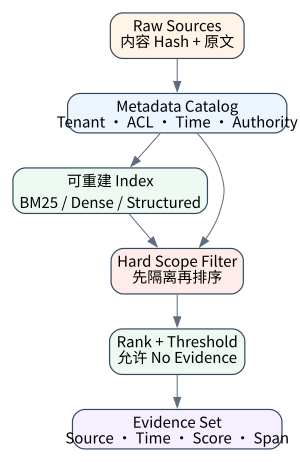
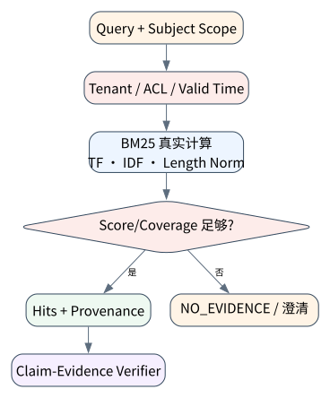

# RAG 基础：检索、证据与生成边界

> **本章核心判断**：RAG 不是向量库加 prompt，而是 evidence production；Agent 需要知道证据来自哪里、覆盖什么、何时过期。

上一章：Tool Runtime：调度、权限、超时、重试与副作用语义。本章把前一章已经建立的能力进一步推进到 `Chunk`；下一章将进入：Hybrid / Agentic RAG：让检索成为决策过程。



## 问题背景与学习目标

RAG 不是向量库加 prompt，而是 evidence production；Agent 需要知道证据来自哪里、覆盖什么、何时过期。

在本章的 `Chunk` 场景中，真实 Agent 系统与普通“问答程序”的差异，在于一次任务会跨越模型、工具、状态、外部环境和人工治理边界。本章所有原理、代码与实验都围绕这些可验证问题展开。


**本章完成标准：**

- **机制理解**：能够解释“RAG 不是向量库加 prompt，而是 evidence production；Agent 需要知道证据来自哪里、覆盖什么、何时过期。”，并指出它对应的确定性软件边界；
- **正确性判断**：能够针对 `retrieval must expose evidence scores and permit a no-evidence outcome` 构造一个反例，说明证据不足时系统为什么不能继续乐观执行；
- **实验与迁移**：运行 `Lab 09A` / `Lab 09B`，分别说明 normal/fault 的 evidence level，并把同一机制映射到至少一个上游实现或协议。

## 核心概念与系统直觉

本节不把概念当作术语清单，而是回答三个工程问题：它**是什么**、在系统里**负责什么**、以及它失效时**会留下什么可观测证据**。

### Chunk

**定义。** Chunk 是可独立检索与引用的信息单元，边界应尽量保持语义完整和来源可追踪，而不是固定字数切片。

**系统责任。** 技术文档可按标题/函数切，合同按条款切，表格需要保留行列语义。每个 chunk 应携带 document/version/offset 等 provenance。

**失败边界。** 切得过小会丢上下文，过大会降低召回精度并增加 token；错误边界还会让引用无法定位原文。

### Index

**定义。** Index 是从原始语料到可检索表示的派生结构，包括 inverted index、vector index 或结构化 catalog。

**系统责任。** Index 必须有版本、构建时间和源数据关联；更新语料时要定义增量、删除和重建策略。

**失败边界。** 把 index 当成事实源会导致 stale data 和删除失效。事实仍在原始权威数据源，index 只是加速结构。

### Retriever

**定义。** Retriever 根据 query、metadata、权限和 budget 选择候选证据。成熟系统通常组合 keyword、dense、filter 和 domain‑specific lookup。

**系统责任。** Retriever 不应看到用户无权访问的 chunk；权限过滤最好在检索层前置，而不是召回后让模型“不要泄露”。

**失败边界。** 只优化 recall@k 可能把大量近似但错误证据塞给模型。生产指标还需要 precision、 freshness、ACL leakage 和 citation hit rate。

### Evidence

**定义。** Evidence 是能支持特定 claim 的可追溯原始片段或结构化记录，包含来源、版本和定位信息。

**系统责任。** RAG 的最终目标不是“给模型更多文本”，而是建立 claim→evidence 映射，让用户/verifier 能回到权威源。

**失败边界。** 没有 provenance 的检索结果即使内容正确，也难以审计、更新或处理冲突。

## 原理与理论基础

### 系统不变量

> **Invariant**：retrieval must expose evidence scores and permit a no-evidence outcome

不变量与普通“最佳实践”不同：最佳实践可以因为场景变化而替换，不变量一旦被破坏，系统就失去本章希望保证的正确性。例如 `只返回 text 不返回来源` 并不是一个 UI 问题，而是说明某个状态已经无法从证据中唯一判断。


### 故障模型

本章优先把 “只返回 text 不返回来源”、“检索命中但回答越权推断”、“索引更新后无法复现历史答案” 作为可证伪故障，而不是泛化地枚举所有异常。对涉及外部 effect 的失败，判定顺序固定为“最后 durable state → effect 是否可能发生 → 现有 observation 是否足够决定下一步”；证据不足时停在 UNKNOWN/显式失败。

### Why / What if / Trade-off

本章真正的设计取舍不是“使用更强模型还是写更多规则”，而是确定 **Chunk** 与 **Index** 分别应该由概率性决策还是确定性软件拥有。模型可以帮助识别候选路径，但它不会自动消除“只返回 text 不返回来源”这类系统失败；该失败必须由 runtime 的 schema、状态机、权限或 verifier 显式约束。

如果把 Chunk 完全交给模型，系统会把不可验证的语言判断混入执行事实；如果把 Index 全部硬编码为固定 workflow，又会失去开放任务所需的适应性。更稳健的边界是：让模型负责提出候选决策，让软件负责 `source_id/span/score 显式化`、`索引版本可复现` 以及对不变量 **retrieval must expose evidence scores and permit a no-evidence outcome** 的检查。

**What if。** 一旦“检索命中但回答越权推断”发生，系统首先需要判断现有证据是否足够决定下一状态；证据不足时应停在显式失败或待协调状态，而不是让模型用自然语言补全事实。这个边界决定了本章方案是否具有可恢复性，而不只是演示效果。


### 形式化模型与可证伪假设

$$
S(d,q)=w_rRel(d,q)+w_aAuth(d)+w_fFresh(d)-w_cConflict(d)
$$

RAG 的目标不是返回“相似文本”，而是返回足以支持当前结论、具有来源和时效性的证据。

**可证伪假设。** 在动态知识任务中加入 authority/freshness/conflict rerank 会降低 stale/contradictory citation。

**建议测量。** evidence precision、citation entailment、stale citation rate、conflict detection rate。

## 关键机制与执行流程



**Step 1 — source_id/span/score 显式化。** `source_id/span/score 显式化` 是“RAG 基础：检索、证据与生成边界”的一次显式状态转移。输入和输出都必须可序列化并关联 `run_id/step_id`；一旦该步骤失败，后继步骤只能依据已记录状态继续。关键观察点是 `Chunk` 是否仍满足 **retrieval must expose evidence scores and permit a no-evidence outcome**。

**Step 2 — BM25+dense 可替换。** `BM25+dense 可替换` 是“RAG 基础：检索、证据与生成边界”的一次显式状态转移。输入和输出都必须可序列化并关联 `run_id/step_id`；一旦该步骤失败，后继步骤只能依据已记录状态继续。关键观察点是 `Index` 是否仍满足 **retrieval must expose evidence scores and permit a no-evidence outcome**。

**Step 3 — 引用校验进 eval。** `引用校验进 eval` 是“RAG 基础：检索、证据与生成边界”的一次显式状态转移。输入和输出都必须可序列化并关联 `run_id/step_id`；一旦该步骤失败，后继步骤只能依据已记录状态继续。关键观察点是 `Retriever` 是否仍满足 **retrieval must expose evidence scores and permit a no-evidence outcome**。

**Step 4 — 索引版本可复现。** `索引版本可复现` 是“RAG 基础：检索、证据与生成边界”的一次显式状态转移。输入和输出都必须可序列化并关联 `run_id/step_id`；一旦该步骤失败，后继步骤只能依据已记录状态继续。关键观察点是 `Evidence` 是否仍满足 **retrieval must expose evidence scores and permit a no-evidence outcome**。

在本章的 `Chunk` 场景中，**最后一步 — 验证。** verifier 针对 `Evidence` 检查本章不变量 **retrieval must expose evidence scores and permit a no-evidence outcome**。如果“只返回 text 不返回来源”使现有 artifact/外部状态不足以证明成功，结果必须停在显式失败或 UNKNOWN；只有 observation 能闭合状态转移时，流程才允许进入 FINISHED。

### 数据流与控制流

本章的数据/控制链按 **source_id/span/score 显式化 → BM25+dense 可替换 → 引用校验进 eval → 索引版本可复现** 推进。调试时不要只看最终 answer，应确认每一阶段的输入来源、状态版本和 observation；对“只返回 text 不返回来源”尤其要检查动作前后的证据是否足以闭合不变量 **retrieval must expose evidence scores and permit a no-evidence outcome**。


### 持久化点与崩溃窗口

本章需要持久化的内容取决于动作可逆性。与 `Chunk` 有关的纯计算状态通常可以重算；一旦 `BM25+dense 可替换` 可能产生昂贵、外部或不可逆效果，就必须在动作前后建立可区分的证据边界。对于本章不变量 **retrieval must expose evidence scores and permit a no-evidence outcome**，恢复时最重要的问题是：最后一个已知状态是什么、动作是否可能已经发生、现有 observation 能否唯一决定 retry/continue/compensate。


## 从原理到实现


### 完整实验入口

```python
from __future__ import annotations
import argparse
from agentlab.course_scenarios import run_scenario

def main() -> int:
 p=argparse.ArgumentParser(description='RAG 基础：检索、证据与生成边界')
 p.add_argument("--fault", action="store_true", help="inject the chapter-specific failure path")
 args=p.parse_args()
 result=run_scenario('retrieval', fault=args.fault)
 print(result.as_json())
 return 0 if result.passed else 2

if __name__ == "__main__":
 raise SystemExit(main())
```

### 核心机制实现

```python
def retrieval(fault=False):
 docs={'d1':'checkpoint makes long running agent resumable','d2':'vector retrieval finds semantic evidence','d3':'approval protects high risk tools'}
 q='agent checkpoint resume' if not fault else 'unrelated astronomy'
 qt=set(_tokens(q)); scored=sorted(((d,len(qt & set(_tokens(t)))) for d,t in docs.items()),key=lambda x:(-x[1],x[0]))
 top=scored[0]
 return _ok('retrieval',fault,{'query':q,'ranking':scored},'retrieval must expose evidence scores and permit a no-evidence outcome', (top[0]=='d1' and top[1]>0) if not fault else top[1]==0)
```


### 简化假设与不能省略的机制


## 主流系统实现对照与源码阅读入口

| 项目 | 本书锁定版本/状态 | 应阅读的机制 | 已核验源码/文档入口 | 官方来源 |
|---|---|---|---|---|
| bojieli/ai-agent-book | `main; 10 chapters / 109 experiments observed 2026-09-09` | 对标开源教材：正文、实验 ledger、PDF/EPUB、多语言。 | 以官方 docs/release/source tree 为准 | [官方来源](https://github.com/bojieli/ai-agent-book) |
| Anthropic: Building Effective Agents | `official engineering article` | 从简单、可组合的 workflow/agent 模式开始。 | 以官方 docs/release/source tree 为准 | [官方来源](https://www.anthropic.com/engineering/building-effective-agents) |
| SWE-bench | `benchmark source observed 2026-09-09` | 真实 GitHub issue + repository snapshot + Docker/test verifier。 | 以官方 docs/release/source tree 为准 | [官方来源](https://github.com/swe-bench/SWE-bench) |

### 源码阅读方法

源码阅读以 **bojieli/ai-agent-book** 为第一参照，并只追与“RAG 基础：检索、证据与生成边界”直接相关的公开执行链：入口 → durable/session state → 权限或协议边界 → verifier/trace。若上游没有公开某个服务端组件，本章不根据客户端现象反推其内部 scheduler、queue 或 policy engine。


### 工业实现为什么更复杂


对本章最值得关注的工程增量是：如何避免“只返回 text 不返回来源”、如何在“检索命中但回答越权推断”后恢复，以及如何让 `索引版本可复现` 的结果能够进入 tracing/evaluation。只有这些机制都能落到公开类型、函数或协议消息上，才算真正完成源码对照。

## 设计方案与方法对比

| 方案 | 核心优势 | 主要局限 | 更适合的约束 |
|---|---|---|---|
| 最小自研 AgentLab | 机制透明、可断点、无网络即可故障注入 | 生态/模型能力有限 | 教学、研究原型、回归基线 |
| bojieli/ai-agent-book | 官方/主流实现提供成熟抽象与生态 | 抽象会隐藏部分底层机制，需要源码/trace 反推 | 生产集成与方案对照 |
| Anthropic: Building Effective Agents | 官方/主流实现提供成熟抽象与生态 | 抽象会隐藏部分底层机制，需要源码/trace 反推 | 生产集成与方案对照 |
| SWE-bench | 官方/主流实现提供成熟抽象与生态 | 抽象会隐藏部分底层机制，需要源码/trace 反推 | 生产集成与方案对照 |


## 可复现实验

本章两个 Core Lab 都直接执行仓库内的确定性代码；它们证明的是“RAG 基础：检索、证据与生成边界”对应的本地机制与 fault oracle，而不是外部 provider 或真实云环境。第三方实现只在 `labs/upstream/` 按独立 L5 互操作证据记录，未实际执行时必须保持 `EXTERNAL_NOT_RUN_IN_THIS_RELEASE`。

### 实验环境

统一 Python/OS/离线复现约束、安装步骤与工具链版本集中维护在[附录 A](../appendix-a-environment.md)。本章只增加与“RAG 基础：检索、证据与生成边界”直接相关的 normal/fault 双轨验证；若需要真实云、浏览器、GPU 或第三方 provider，则在对应 upstream lab 中单独标记 `NOT_RUN_EXTERNAL`，不把未运行结果计入核心实验。

### Lab 09A — 正常路径

```bash
PYTHONPATH=src python examples/chapters/ch09_retrieval.py
```

**关键断点：**
- `src/agentlab/course_scenarios.py::retrieval`
- `examples/chapters/ch09_retrieval.py::main`

**本发布包实际输出：**

```json
{"contained": false, "evidence_level": "L1_MECHANISM", "evidence_meaning": "normal_path_assertion_satisfied", "fault": false, "fault_injected": false, "invariant": "retrieval must expose evidence scores and permit a no-evidence outcome", "invariant_holds": true, "observation": {"query": "agent checkpoint resume", "ranking": [["d1", 2], ["d2", 0], ["d3", 0]]}, "oracle_detected": false, "passed": true, "recovered": false, "scenario": "retrieval", "system_detected": false}
```

PASS：退出码 0，`passed=true`、`fault=false`、`invariant_holds=true`；这只证明确定性 fixture 的正常机制断言。完整手册：[Lab 09A](../../../labs/core/lab-09A-retrieval.md)。

### Lab 09B — 故障注入

```bash
PYTHONPATH=src python examples/chapters/ch09_retrieval.py --fault
```

**本发布包实际输出：**

```json
{"contained": true, "evidence_level": "L3_CONTAINED", "evidence_meaning": "fault_detected_and_contained", "fault": true, "fault_injected": true, "invariant": "retrieval must expose evidence scores and permit a no-evidence outcome", "invariant_holds": true, "observation": {"query": "unrelated astronomy", "ranking": [["d1", 0], ["d2", 0], ["d3", 0]]}, "oracle_detected": true, "passed": true, "recovered": false, "scenario": "retrieval", "system_detected": true}
```

PASS：退出码 0，`passed=true`、`fault=true`、`oracle_detected=true`。本章故障实验为 **L3_CONTAINED**：被测组件检测并 fail-closed/约束了故障，但不声明已恢复业务结果。 `passed=true` 本身只表示实验 oracle 得到预期观察。完整手册：[Lab 09B](../../../labs/core/lab-09B-retrieval-fault.md)。

### 观察与证据


## 工程场景与系统设计

本章复用第 7 章“客户支持 Agent”教学负载，关注 200 万文档规模下的检索接口与最多 8 个证据块约束；p95 150 ms 是容量设计目标，不是本仓库测量值。


### 上线前必须补齐

- 围绕 **RAG 基础** 建立可审计状态字段与最小权限；
- 为本章相关动作记录 run_id、step_id、输入摘要与 observation；
- 对 `检索必须暴露 evidence、score 与 no-evidence，而不是总要生成答案。` 这一边界建立自动化验收；
- 为本章主要故障窗口配置 trace、日志和恢复 runbook；
- 上线前把教学 fixture 替换为真实 provider/tool/workspace，并重新执行 normal/fault 两条路径。

## 故障模型、失败模式与排错

本章至少主动测试以下失败：

- **只返回 text 不返回来源**：先确认最后 durable state，再检查是否已经产生外部效果；不要先重试。
- **检索命中但回答越权推断**：先确认最后 durable state，再检查是否已经产生外部效果；不要先重试。
- **索引更新后无法复现历史答案**：先确认最后 durable state，再检查是否已经产生外部效果；不要先重试。


## 性能、可靠性与工程化

### 应采集指标

- `tool/retrieval p50,p95 latency`
- `tool error/UNKNOWN rate`
- `recall@k / evidence coverage`
- `memory hit/conflict rate`
- `payload bytes / turn`


### 优化顺序


任何优化都必须重新运行 Lab A/B。尤其当优化改变 `Index` 的生命周期时，要重新验证 **retrieval must expose evidence scores and permit a no-evidence outcome**；否则平均延迟下降可能以更大的 stale state、重复副作用或取消失效为代价。

### 可靠性工程

本章可靠性 gate 直接针对 “只返回 text 不返回来源”、“检索命中但回答越权推断”、“索引更新后无法复现历史答案”：只有正常路径与对应 fault path 都保持 **retrieval must expose evidence scores and permit a no-evidence outcome**，优化或功能扩展才可接受。是否达到 detection、containment 或 recovery 以实验的 `evidence_level` 字段为准。


## 技术边界与设计取舍
本章方案有明确边界：

- 检索只能返回可索引/可访问的数据，不自动保证事实完整性
- 工具 schema 无法消除外部系统自身的不一致
- 长期记忆会过期、冲突或包含敏感信息，必须治理
- 协议标准化互操作，不替代业务授权与审计

选择方案时要回到本章边界：如果业务不能接受“只返回 text 不返回来源”，就必须为 `Chunk` 增加更强的确定性约束；如果主要任务是开放式探索，则可以把更多 `Index` 决策交给模型，但要用 `索引版本可复现` 保持结果可验证。**bojieli/ai-agent-book** 与 **Anthropic: Building Effective Agents** 的差异也应放在这些约束下理解，而不是抽象成通用框架排名。

RAG 提供的是候选证据而不是事实保证。召回结果可能过时、越权或彼此冲突，因此答案中的关键 claim 需要保留来源、版本和时间信息；高风险决定不能仅由 top-k 相似度驱动。

## 前沿研究与演进方向

当前研究和工业演进已经从“模型能否调用工具”推进到“怎样让长期、状态化、具有副作用的 Agent 可评估、可恢复、可治理”。与本章直接相关的资料：

- **[ReAct: Synergizing Reasoning and Acting in Language Models](https://arxiv.org/abs/2210.03629)**：提出 reasoning/action 交错轨迹，连接语言推理与外部环境动作。
- **[bojieli/ai-agent-book](https://github.com/bojieli/ai-agent-book)**（main; 10 chapters / 109 experiments observed 2026-09-09）：对标开源教材：正文、实验 ledger、PDF/EPUB、多语言。
- **[Anthropic: Building Effective Agents](https://www.anthropic.com/engineering/building-effective-agents)**（official engineering article）：从简单、可组合的 workflow/agent 模式开始。


### 截至 2026-09-11 的研究更新

本节只记录会改变本章系统结论的研究或官方规范更新；实验仍使用仓库锁定版本，避免把“最新观察版本”与“可复现实验版本”混为一谈。
- OpenAI BrowseComp（2025‑04‑10; observed 2026-09-11）：browsing agents and hard‑to‑find information retrieval。
- OpenAI: How AI is expanding what people do at work（2026‑07‑27）：task crossover across occupations and changing job boundaries。

**本章吸收的变化。** RAG 的检索目标应覆盖相关性、权威性、时效和冲突，而不是只做向量相似度。Evidence 需要绑定具体 claim。这些研究/规范的价值不在于替换本章原理，而在于把上述假设放进更真实、更长时或更高风险的环境中检验。

### Research Gap

围绕 `Chunk`，当前缺口不是“再增加一个 Agent API”，而是怎样把 **retrieval must expose evidence scores and permit a no-evidence outcome** 从局部实现经验升级为跨模型、跨 runtime 可验证的系统属性。现有工业实现已经能够提供 tool loop、session、graph、plugin 或 workspace 等抽象，但在“只返回 text 不返回来源”和“检索命中但回答越权推断”同时出现时，证据格式、恢复语义和评测方法仍缺少统一答案。

本章的研究更新不追求论文数量，而关注一个问题：现有工作是否真正推进了 **RAG 基础** 的可验证性。Deep Research Bench 和 BrowseComp-Plus 都表明检索/引用链本身是可评估对象。 因此，本章会把论文结论放回不变量、失败窗口和实验断言中，而不是把研究当作参考文献列表。

### Open Problems

1. 如何把 `Chunk` 的正确性拆成可组合的局部不变量，并在不同 Agent runtime 中复用 verifier？
2. 当“只返回 text 不返回来源”与“检索命中但回答越权推断”同时发生时，**bojieli/ai-agent-book** 与 **Anthropic: Building Effective Agents** 的公开抽象分别能保存哪些证据，哪些状态仍需要外部 reconciliation？
3. 如果模型能力显著提高，围绕 `Index` 的哪些 harness 机制仍属于系统必要条件，哪些只是当前模型能力下的临时补丁？
4. 如何构造一个既保护真实业务数据、又能复现“索引更新后无法复现历史答案”的公开 benchmark，使研究结果可以被第三方验证？


### 深度审计与研究证据链：RAG 基础

本章重新审计后的核心结论是：**检索必须暴露 evidence、score 与 no-evidence，而不是总要生成答案。** 这句话只有在代码、实验、开源源码和研究证据四个层面同时成立时才有教学价值。仅靠定义或 API 示例无法证明它，因为 Agent Systems 的风险通常发生在模型决策与外部环境之间的缝隙里。

**与本章最相关的近期/基础研究与官方资料：**

- **[Memora](https://arxiv.org/abs/2604.20006)**：强调长期记忆不仅要 recall，也要遗忘过期事实。
- **[Mem2ActBench](https://arxiv.org/abs/2601.19935)**：把记忆是否能主动用于工具参数 grounding 作为评测目标。
- **[LongMemEval-V2](https://arxiv.org/abs/2605.12493)**：把 web-agent 经验轨迹转成长期记忆评测，暴露 latency/quality 取舍。

这些资料与本章的关系不是“引用背书”，而是帮助读者识别设计边界。LlamaIndex/LangChain retriever、Mem0、ai-agent-book RAG 章节适合对照 evidence provenance。 读者阅读源码时应主动寻找四个对象：输入如何进入系统、状态在哪里持久化、动作由谁执行、失败后谁负责恢复。

**实验语义边界。** 本章实验验证 RAG 基础的 schema、证据或记忆边界；证据等级定义与解释规则统一见附录 A，且 `passed=true` 不得跨级推导 containment/recovery。


## 本章总结与进阶实践

### 核心结论

1. 本章不变量是：**retrieval must expose evidence scores and permit a no-evidence outcome**；
2. `Chunk` 必须是可观察软件边界，而不是 prompt 约定；
3. `source_id/span/score 显式化` 与 `索引版本可复现` 之间必须有状态和证据连接；
4. 模型提出动作不等于系统已经执行，更不等于任务成功；
5. 正常路径只能证明功能，故障路径才能暴露恢复语义；
6. 开源实现的核心价值在于理解真实约束，不是复制 API；
7. 性能优化必须与可靠性/安全不变量一起重新验证；
8. 技术边界和未解决问题是高级系统设计的一部分。

### 常见误区

- 只返回 text 不返回来源
- 检索命中但回答越权推断
- 索引更新后无法复现历史答案

### 思考题与实践

- **Why：** 为什么 `Chunk` 不能只靠模型“记住”？
- **What if：** 如果在 `source_id/span/score 显式化` 与 `索引版本可复现` 之间 crash，当前证据足够恢复吗？
- **Programming：** 修改 `examples/chapters/ch09_retrieval.py` 或对应 scenario，让系统新增一种错误类型，但仍保持 invariant。
- **Engineering：** 把 Lab B 的故障改成 timeout/duplicate/crash 中另一种，写出状态机和恢复步骤。
- **Research：** 选择本章一个 Open Problem，阅读两篇相互不同的方法，给出你自己的实验设计和 falsifiable hypothesis。

下一章进入 **Hybrid / Agentic RAG：让检索成为决策过程**，它将复用本章已经建立的状态/证据边界，而不是重新从 API 使用开始。
