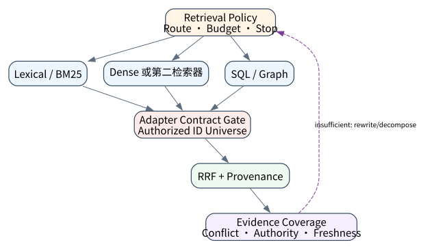
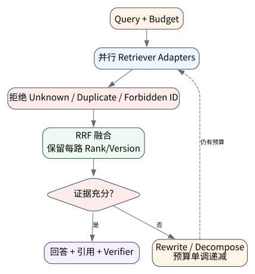

# Hybrid / Agentic RAG：让检索成为决策过程

> **本章核心判断**：Agentic RAG 让模型决定是否检索、如何改写 query、何时停止；同时也放大了成本、漂移和引用风险。

上一章：RAG 基础：检索、证据与生成边界。本章把前一章已经建立的能力进一步推进到 `Sparse vs dense`；下一章将进入：长期记忆：从聊天历史到可治理的用户状态。



## 问题背景与学习目标

Agentic RAG 让模型决定是否检索、如何改写 query、何时停止；同时也放大了成本、漂移和引用风险。

在本章的 `Sparse vs dense` 场景中，真实 Agent 系统与普通“问答程序”的差异，在于一次任务会跨越模型、工具、状态、外部环境和人工治理边界。本章所有原理、代码与实验都围绕这些可验证问题展开。


**本章完成标准：**

- **机制理解**：能够解释“Agentic RAG 让模型决定是否检索、如何改写 query、何时停止；同时也放大了成本、漂移和引用风险。”，并指出它对应的确定性软件边界；
- **正确性判断**：能够针对 `hybrid retrieval must retain per-retriever provenance before fusion` 构造一个反例，说明证据不足时系统为什么不能继续乐观执行；
- **实验与迁移**：运行 `Lab 10A` / `Lab 10B`，分别说明 normal/fault 的 evidence level，并把同一机制映射到至少一个上游实现或协议。

## 核心概念与系统直觉

本节不把概念当作术语清单，而是回答三个工程问题：它**是什么**、在系统里**负责什么**、以及它失效时**会留下什么可观测证据**。

### Sparse vs dense

**定义。** Sparse retrieval 利用词项匹配，擅长专有名词、ID 和精确术语；dense retrieval 利用语义表示，擅长同义表达和概念相似。

**系统责任。** Hybrid RAG 通常先用 metadata/ACL 限定候选，再组合 sparse+dense score，并通过 reranker 重排。

**失败边界。** 只用 dense 容易错过精确代码/编号；只用 sparse 对自然语言改写不敏感。选择应由数据类型和错误成本决定。

### Rerank

**定义。** Rerank 用更昂贵的模型或规则对初召回候选重新评分，目标是提高前几个 context slot 的证据密度。

**系统责任。** 它可以考虑 query–passage 相关性、source quality、freshness、diversity 和权限，而不只是向量相似度。

**失败边界。** Reranker 不能补救根本没召回的证据；同时它自身也可能偏好流畅文本而不是权威来源。

### Query rewrite

**定义。** Query rewrite 根据任务状态把用户问题拆成更适合检索的子查询、实体约束或时间范围。

**系统责任。** Agentic RAG 中 rewrite 可以多轮发生：检索结果暴露新实体后，再生成下一轮 targeted query。

**失败边界。** 无限 rewrite 会变成搜索发散。应设 evidence coverage/novelty 阈值和最大轮数。

### Stop criteria

**定义。** Stop criteria 决定何时已经有足够证据回答、何时需要继续查找、何时应该承认信息不足。

**系统责任。** 可使用 claim coverage、source diversity、contradiction unresolved、budget 和 verifier confidence 组合判定。

**失败边界。** 如果停止条件只是“模型觉得够了”，容易在第一个看似合理来源处过早收敛。

## 原理与理论基础

### 系统不变量

> **Invariant**：hybrid retrieval must retain per-retriever provenance before fusion

不变量与普通“最佳实践”不同：最佳实践可以因为场景变化而替换，不变量一旦被破坏，系统就失去本章希望保证的正确性。例如 `循环检索烧掉预算` 并不是一个 UI 问题，而是说明某个状态已经无法从证据中唯一判断。


### 故障模型

本章优先把 “循环检索烧掉预算”、“query rewrite 丢失约束”、“reranker 黑盒不可复盘” 作为可证伪故障，而不是泛化地枚举所有异常。对涉及外部 effect 的失败，判定顺序固定为“最后 durable state → effect 是否可能发生 → 现有 observation 是否足够决定下一步”；证据不足时停在 UNKNOWN/显式失败。

### Why / What if / Trade-off

本章真正的设计取舍不是“使用更强模型还是写更多规则”，而是确定 **Sparse vs dense** 与 **Rerank** 分别应该由概率性决策还是确定性软件拥有。模型可以帮助识别候选路径，但它不会自动消除“循环检索烧掉预算”这类系统失败；该失败必须由 runtime 的 schema、状态机、权限或 verifier 显式约束。

如果把 Sparse vs dense 完全交给模型，系统会把不可验证的语言判断混入执行事实；如果把 Rerank 全部硬编码为固定 workflow，又会失去开放任务所需的适应性。更稳健的边界是：让模型负责提出候选决策，让软件负责 `将检索计划写入 trace`、`无证据时拒答` 以及对不变量 **hybrid retrieval must retain per-retriever provenance before fusion** 的检查。

**What if。** 一旦“query rewrite 丢失约束”发生，系统首先需要判断现有证据是否足够决定下一状态；证据不足时应停在显式失败或待协调状态，而不是让模型用自然语言补全事实。这个边界决定了本章方案是否具有可恢复性，而不只是演示效果。


### 形式化模型与可证伪假设

$$
S_{hybrid}=\alpha S_{dense}+\beta S_{sparse}+\gamma S_{rerank},\qquad stop\ if\ \Delta Evidence<\lambda Cost
$$

Agentic RAG 把检索从一次查询变成有成本的序列决策；系统需要明确“何时继续搜、何时停”。

**可证伪假设。** 加入 evidence-gain stop criterion 可减少无效检索回合，同时保持 verified answer quality。

**建议测量。** retrieval turns、marginal evidence gain、cost per verified answer、citation coverage。

## 关键机制与执行流程



**Step 1 — 将检索计划写入 trace。** 这一阶段可能改变系统或外部环境，因此 `将检索计划写入 trace` 不能只存在于模型文本中。runtime 在执行前绑定 `run_id/step_id` 与参数摘要，执行后记录结果或外部 observation；如果调用可能重复，必须同时定义幂等键或 reconciliation 依据。这里检查的核心是 **hybrid retrieval must retain per-retriever provenance before fusion**。

**Step 2 — 每次改写保存 rationale。** 这一阶段可能改变系统或外部环境，因此 `每次改写保存 rationale` 不能只存在于模型文本中。runtime 在执行前绑定 `run_id/step_id` 与参数摘要，执行后记录结果或外部 observation；如果调用可能重复，必须同时定义幂等键或 reconciliation 依据。这里检查的核心是 **hybrid retrieval must retain per-retriever provenance before fusion**。

**Step 3 — rerank 保留候选列表。** `rerank 保留候选列表` 是“Hybrid / Agentic RAG：让检索成为决策过程”的一次显式状态转移。输入和输出都必须可序列化并关联 `run_id/step_id`；一旦该步骤失败，后继步骤只能依据已记录状态继续。关键观察点是 `Query rewrite` 是否仍满足 **hybrid retrieval must retain per-retriever provenance before fusion**。

**Step 4 — 无证据时拒答。** `无证据时拒答` 把短暂执行状态转换为后续能够读取的证据。写入内容至少要能关联本次 run、前一状态与下一状态；对 crash-sensitive 数据，应明确写入完成的判据。若进程在写入期间终止，恢复代码必须能够区分“没有记录”“完整记录”和“损坏/不确定记录”，而不能把半写状态视作成功。

在本章的 `Sparse vs dense` 场景中，**最后一步 — 验证。** verifier 针对 `Stop criteria` 检查本章不变量 **hybrid retrieval must retain per-retriever provenance before fusion**。如果“循环检索烧掉预算”使现有 artifact/外部状态不足以证明成功，结果必须停在显式失败或 UNKNOWN；只有 observation 能闭合状态转移时，流程才允许进入 FINISHED。

### 数据流与控制流

本章的数据/控制链按 **将检索计划写入 trace → 每次改写保存 rationale → rerank 保留候选列表 → 无证据时拒答** 推进。调试时不要只看最终 answer，应确认每一阶段的输入来源、状态版本和 observation；对“循环检索烧掉预算”尤其要检查动作前后的证据是否足以闭合不变量 **hybrid retrieval must retain per-retriever provenance before fusion**。


### 持久化点与崩溃窗口

本章需要持久化的内容取决于动作可逆性。与 `Sparse vs dense` 有关的纯计算状态通常可以重算；一旦 `每次改写保存 rationale` 可能产生昂贵、外部或不可逆效果，就必须在动作前后建立可区分的证据边界。对于本章不变量 **hybrid retrieval must retain per-retriever provenance before fusion**，恢复时最重要的问题是：最后一个已知状态是什么、动作是否可能已经发生、现有 observation 能否唯一决定 retry/continue/compensate。


## 从原理到实现


### 完整实验入口

```python
from __future__ import annotations
import argparse
from agentlab.course_scenarios import run_scenario

def main() -> int:
 p=argparse.ArgumentParser(description='Hybrid / Agentic RAG：让检索成为决策过程')
 p.add_argument("--fault", action="store_true", help="inject the chapter-specific failure path")
 args=p.parse_args()
 result=run_scenario('hybrid-rag', fault=args.fault)
 print(result.as_json())
 return 0 if result.passed else 2

if __name__ == "__main__":
 raise SystemExit(main())
```

### 核心机制实现

```python
def hybrid_rag(fault=False):
 sparse=['d1','d3','d2']; dense=['d2','d1','d3'] if not fault else ['x1','x2','x3']
 fused=_rrf([sparse,dense]); ids=[x[0] for x in fused[:3]]
 condition=('d1' in ids and 'd2' in ids) if not fault else any(x.startswith('x') for x in ids)
 return _ok('hybrid-rag',fault,{'sparse':sparse,'dense':dense,'rrf':fused[:4]},'hybrid retrieval must retain per-retriever provenance before fusion',condition)
```


### 简化假设与不能省略的机制


## 主流系统实现对照与源码阅读入口

| 项目 | 本书锁定版本/状态 | 应阅读的机制 | 已核验源码/文档入口 | 官方来源 |
|---|---|---|---|---|
| bojieli/ai-agent-book | `main; 10 chapters / 109 experiments observed 2026-09-09` | 对标开源教材：正文、实验 ledger、PDF/EPUB、多语言。 | 以官方 docs/release/source tree 为准 | [官方来源](https://github.com/bojieli/ai-agent-book) |
| Letta | `source observed 2026-09-09` | stateful agents / long-term memory 参考。 | 以官方 docs/release/source tree 为准 | [官方来源](https://github.com/letta-ai/letta) |
| Mem0 | `source observed 2026-09-09` | 记忆抽取、检索与评估参考。 | 以官方 docs/release/source tree 为准 | [官方来源](https://github.com/mem0ai/mem0) |

### 源码阅读方法

源码阅读以 **bojieli/ai-agent-book** 为第一参照，并只追与“Hybrid / Agentic RAG：让检索成为决策过程”直接相关的公开执行链：入口 → durable/session state → 权限或协议边界 → verifier/trace。若上游没有公开某个服务端组件，本章不根据客户端现象反推其内部 scheduler、queue 或 policy engine。


### 工业实现为什么更复杂


对本章最值得关注的工程增量是：如何避免“循环检索烧掉预算”、如何在“query rewrite 丢失约束”后恢复，以及如何让 `无证据时拒答` 的结果能够进入 tracing/evaluation。只有这些机制都能落到公开类型、函数或协议消息上，才算真正完成源码对照。

## 设计方案与方法对比

| 方案 | 核心优势 | 主要局限 | 更适合的约束 |
|---|---|---|---|
| 最小自研 AgentLab | 机制透明、可断点、无网络即可故障注入 | 生态/模型能力有限 | 教学、研究原型、回归基线 |
| bojieli/ai-agent-book | 官方/主流实现提供成熟抽象与生态 | 抽象会隐藏部分底层机制，需要源码/trace 反推 | 生产集成与方案对照 |
| Letta | 官方/主流实现提供成熟抽象与生态 | 抽象会隐藏部分底层机制，需要源码/trace 反推 | 生产集成与方案对照 |
| Mem0 | 官方/主流实现提供成熟抽象与生态 | 抽象会隐藏部分底层机制，需要源码/trace 反推 | 生产集成与方案对照 |


## 可复现实验

本章两个 Core Lab 都直接执行仓库内的确定性代码；它们证明的是“Hybrid / Agentic RAG：让检索成为决策过程”对应的本地机制与 fault oracle，而不是外部 provider 或真实云环境。第三方实现只在 `labs/upstream/` 按独立 L5 互操作证据记录，未实际执行时必须保持 `EXTERNAL_NOT_RUN_IN_THIS_RELEASE`。

### 实验环境

统一 Python/OS/离线复现约束、安装步骤与工具链版本集中维护在[附录 A](../appendix-a-environment.md)。本章只增加与“Hybrid / Agentic RAG：让检索成为决策过程”直接相关的 normal/fault 双轨验证；若需要真实云、浏览器、GPU 或第三方 provider，则在对应 upstream lab 中单独标记 `NOT_RUN_EXTERNAL`，不把未运行结果计入核心实验。

### Lab 10A — 正常路径

```bash
PYTHONPATH=src python examples/chapters/ch10_hybrid_rag.py
```

**关键断点：**
- `src/agentlab/course_scenarios.py::hybrid_rag`
- `examples/chapters/ch10_hybrid_rag.py::main`

**本发布包实际输出：**

```json
{"contained": false, "evidence_level": "L1_MECHANISM", "evidence_meaning": "normal_path_assertion_satisfied", "fault": false, "fault_injected": false, "invariant": "hybrid retrieval must retain per-retriever provenance before fusion", "invariant_holds": true, "observation": {"dense": ["d2", "d1", "d3"], "rrf": [["d1", 0.03252247488101534], ["d2", 0.032266458495966696], ["d3", 0.03200204813108039]], "sparse": ["d1", "d3", "d2"]}, "oracle_detected": false, "passed": true, "recovered": false, "scenario": "hybrid-rag", "system_detected": false}
```

PASS：退出码 0，`passed=true`、`fault=false`、`invariant_holds=true`；这只证明确定性 fixture 的正常机制断言。完整手册：[Lab 10A](../../../labs/core/lab-10A-hybrid-rag.md)。

### Lab 10B — 故障注入

```bash
PYTHONPATH=src python examples/chapters/ch10_hybrid_rag.py --fault
```

**本发布包实际输出：**

```json
{"contained": false, "evidence_level": "L2_ORACLE_ONLY", "evidence_meaning": "external_oracle_observed_bad_outcome_only", "fault": true, "fault_injected": true, "invariant": "hybrid retrieval must retain per-retriever provenance before fusion", "invariant_holds": false, "observation": {"dense": ["x1", "x2", "x3"], "rrf": [["d1", 0.01639344262295082], ["x1", 0.01639344262295082], ["d3", 0.016129032258064516], ["x2", 0.016129032258064516]], "sparse": ["d1", "d3", "d2"]}, "oracle_detected": true, "passed": true, "recovered": false, "scenario": "hybrid-rag", "system_detected": false}
```

PASS：退出码 0，`passed=true`、`fault=true`、`oracle_detected=true`。本章故障实验为 **L2_ORACLE_ONLY**：独立 oracle 观察到故障，但被测系统没有证明检测/约束/恢复。 `passed=true` 本身只表示实验 oracle 得到预期观察。完整手册：[Lab 10B](../../../labs/core/lab-10B-hybrid-rag-fault.md)。

### 观察与证据


## 工程场景与系统设计

本章复用第 7 章“客户支持 Agent”教学负载，重点研究 sparse/dense/agentic 路由在 8 个证据块上如何形成可评测融合，而不是重复宣称同一吞吐指标。


### 上线前必须补齐

- 围绕 **Hybrid 与 Agentic RAG** 建立可审计状态字段与最小权限；
- 为本章相关动作记录 run_id、step_id、输入摘要与 observation；
- 对 `融合前必须保留各检索器来源，Agentic RAG 必须把检索决策纳入轨迹。` 这一边界建立自动化验收；
- 为本章主要故障窗口配置 trace、日志和恢复 runbook；
- 上线前把教学 fixture 替换为真实 provider/tool/workspace，并重新执行 normal/fault 两条路径。

## 故障模型、失败模式与排错

本章至少主动测试以下失败：

- **循环检索烧掉预算**：先确认最后 durable state，再检查是否已经产生外部效果；不要先重试。
- **query rewrite 丢失约束**：先确认最后 durable state，再检查是否已经产生外部效果；不要先重试。
- **reranker 黑盒不可复盘**：先确认最后 durable state，再检查是否已经产生外部效果；不要先重试。


## 性能、可靠性与工程化

### 应采集指标

- `tool/retrieval p50,p95 latency`
- `tool error/UNKNOWN rate`
- `recall@k / evidence coverage`
- `memory hit/conflict rate`
- `payload bytes / turn`


### 优化顺序


任何优化都必须重新运行 Lab A/B。尤其当优化改变 `Rerank` 的生命周期时，要重新验证 **hybrid retrieval must retain per-retriever provenance before fusion**；否则平均延迟下降可能以更大的 stale state、重复副作用或取消失效为代价。

### 可靠性工程

本章可靠性 gate 直接针对 “循环检索烧掉预算”、“query rewrite 丢失约束”、“reranker 黑盒不可复盘”：只有正常路径与对应 fault path 都保持 **hybrid retrieval must retain per-retriever provenance before fusion**，优化或功能扩展才可接受。是否达到 detection、containment 或 recovery 以实验的 `evidence_level` 字段为准。


## 技术边界与设计取舍
本章方案有明确边界：

- 检索只能返回可索引/可访问的数据，不自动保证事实完整性
- 工具 schema 无法消除外部系统自身的不一致
- 长期记忆会过期、冲突或包含敏感信息，必须治理
- 协议标准化互操作，不替代业务授权与审计

选择方案时要回到本章边界：如果业务不能接受“循环检索烧掉预算”，就必须为 `Sparse vs dense` 增加更强的确定性约束；如果主要任务是开放式探索，则可以把更多 `Rerank` 决策交给模型，但要用 `无证据时拒答` 保持结果可验证。**bojieli/ai-agent-book** 与 **Letta** 的差异也应放在这些约束下理解，而不是抽象成通用框架排名。

Agentic RAG 让模型决定何时检索和如何融合，也同时引入 query drift、恶意文档与级联污染。除检索质量外，还需要来源策略、冲突检测和独立评测；“检索到了”不等于“应当相信”。

## 前沿研究与演进方向

当前研究和工业演进已经从“模型能否调用工具”推进到“怎样让长期、状态化、具有副作用的 Agent 可评估、可恢复、可治理”。与本章直接相关的资料：

- **[ReAct: Synergizing Reasoning and Acting in Language Models](https://arxiv.org/abs/2210.03629)**：提出 reasoning/action 交错轨迹，连接语言推理与外部环境动作。
- **[Language Agent Tree Search](https://proceedings.mlr.press/v235/zhou24r.html)**：ICML 2024；把 tree search、环境反馈、反思和值函数组合到 Agent 决策。
- **[bojieli/ai-agent-book](https://github.com/bojieli/ai-agent-book)**（main; 10 chapters / 109 experiments observed 2026-09-09）：对标开源教材：正文、实验 ledger、PDF/EPUB、多语言。
- **[Letta](https://github.com/letta-ai/letta)**（source observed 2026-09-09）：stateful agents / long-term memory 参考。


### 截至 2026-09-11 的研究更新

本节只记录会改变本章系统结论的研究或官方规范更新；实验仍使用仓库锁定版本，避免把“最新观察版本”与“可复现实验版本”混为一谈。
- OpenAI BrowseComp（2025‑04‑10; observed 2026-09-11）：browsing agents and hard‑to‑find information retrieval。
- OpenAI: How AI is expanding what people do at work（2026‑07‑27）：task crossover across occupations and changing job boundaries。

**本章吸收的变化。** Agentic RAG 的关键是决定何时改写查询、换索引、继续搜索或停止；检索成为受预算约束的决策过程。这些研究/规范的价值不在于替换本章原理，而在于把上述假设放进更真实、更长时或更高风险的环境中检验。

### Research Gap

围绕 `Sparse vs dense`，当前缺口不是“再增加一个 Agent API”，而是怎样把 **hybrid retrieval must retain per-retriever provenance before fusion** 从局部实现经验升级为跨模型、跨 runtime 可验证的系统属性。现有工业实现已经能够提供 tool loop、session、graph、plugin 或 workspace 等抽象，但在“循环检索烧掉预算”和“query rewrite 丢失约束”同时出现时，证据格式、恢复语义和评测方法仍缺少统一答案。

本章的研究更新不追求论文数量，而关注一个问题：现有工作是否真正推进了 **Hybrid 与 Agentic RAG** 的可验证性。RRF、GraphRAG 与 agentic retrieval 研究共同说明：检索不是单一步骤，而是带反馈的决策过程。 因此，本章会把论文结论放回不变量、失败窗口和实验断言中，而不是把研究当作参考文献列表。

### Open Problems

1. 如何把 `Sparse vs dense` 的正确性拆成可组合的局部不变量，并在不同 Agent runtime 中复用 verifier？
2. 当“循环检索烧掉预算”与“query rewrite 丢失约束”同时发生时，**bojieli/ai-agent-book** 与 **Letta** 的公开抽象分别能保存哪些证据，哪些状态仍需要外部 reconciliation？
3. 如果模型能力显著提高，围绕 `Rerank` 的哪些 harness 机制仍属于系统必要条件，哪些只是当前模型能力下的临时补丁？
4. 如何构造一个既保护真实业务数据、又能复现“reranker 黑盒不可复盘”的公开 benchmark，使研究结果可以被第三方验证？


### 深度审计与研究证据链：Hybrid 与 Agentic RAG

本章重新审计后的核心结论是：**融合前必须保留各检索器来源，Agentic RAG 必须把检索决策纳入轨迹。** 这句话只有在代码、实验、开源源码和研究证据四个层面同时成立时才有教学价值。仅靠定义或 API 示例无法证明它，因为 Agent Systems 的风险通常发生在模型决策与外部环境之间的缝隙里。

**与本章最相关的近期/基础研究与官方资料：**

- **[Memora](https://arxiv.org/abs/2604.20006)**：强调长期记忆不仅要 recall，也要遗忘过期事实。
- **[Mem2ActBench](https://arxiv.org/abs/2601.19935)**：把记忆是否能主动用于工具参数 grounding 作为评测目标。
- **[LongMemEval-V2](https://arxiv.org/abs/2605.12493)**：把 web-agent 经验轨迹转成长期记忆评测，暴露 latency/quality 取舍。

这些资料与本章的关系不是“引用背书”，而是帮助读者识别设计边界。LangGraph RAG flow、LlamaIndex query engine 与 ai-agent-book agentic RAG 可对照固定 pipeline 与动态检索。 读者阅读源码时应主动寻找四个对象：输入如何进入系统、状态在哪里持久化、动作由谁执行、失败后谁负责恢复。

**实验语义边界。** 本章实验验证 Hybrid 与 Agentic RAG 的 schema、证据或记忆边界；证据等级定义与解释规则统一见附录 A，且 `passed=true` 不得跨级推导 containment/recovery。


## 本章总结与进阶实践

### 核心结论

1. 本章不变量是：**hybrid retrieval must retain per-retriever provenance before fusion**；
2. `Sparse vs dense` 必须是可观察软件边界，而不是 prompt 约定；
3. `将检索计划写入 trace` 与 `无证据时拒答` 之间必须有状态和证据连接；
4. 模型提出动作不等于系统已经执行，更不等于任务成功；
5. 正常路径只能证明功能，故障路径才能暴露恢复语义；
6. 开源实现的核心价值在于理解真实约束，不是复制 API；
7. 性能优化必须与可靠性/安全不变量一起重新验证；
8. 技术边界和未解决问题是高级系统设计的一部分。

### 常见误区

- 循环检索烧掉预算
- query rewrite 丢失约束
- reranker 黑盒不可复盘

### 思考题与实践

- **Why：** 为什么 `Sparse vs dense` 不能只靠模型“记住”？
- **What if：** 如果在 `将检索计划写入 trace` 与 `无证据时拒答` 之间 crash，当前证据足够恢复吗？
- **Programming：** 修改 `examples/chapters/ch10_hybrid_rag.py` 或对应 scenario，让系统新增一种错误类型，但仍保持 invariant。
- **Engineering：** 把 Lab B 的故障改成 timeout/duplicate/crash 中另一种，写出状态机和恢复步骤。
- **Research：** 选择本章一个 Open Problem，阅读两篇相互不同的方法，给出你自己的实验设计和 falsifiable hypothesis。

下一章进入 **长期记忆：从聊天历史到可治理的用户状态**，它将复用本章已经建立的状态/证据边界，而不是重新从 API 使用开始。
