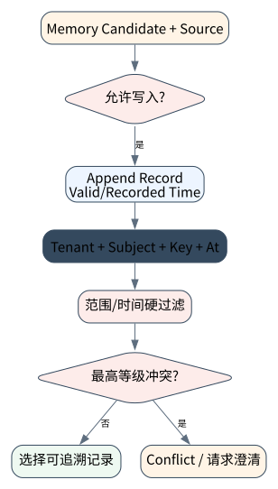

# 长期记忆：从聊天历史到可治理的用户状态

> **本章核心判断**：Memory 要区分短期上下文、会话状态、事实记忆、技能记忆和外部知识；混在一起会导致隐私、幻觉和污染。

上一章：Hybrid / Agentic RAG：让检索成为决策过程。本章把前一章已经建立的能力进一步推进到 `Working memory`；下一章将进入：Skills、Procedural Memory 与可复用能力。


## 问题背景与学习目标

Memory 要区分短期上下文、会话状态、事实记忆、技能记忆和外部知识；混在一起会导致隐私、幻觉和污染。

在本章的 `Working memory` 场景中，真实 Agent 系统与普通“问答程序”的差异，在于一次任务会跨越模型、工具、状态、外部环境和人工治理边界。本章所有原理、代码与实验都围绕这些可验证问题展开。


**本章完成标准：**

- **机制理解**：能够解释“Memory 要区分短期上下文、会话状态、事实记忆、技能记忆和外部知识；混在一起会导致隐私、幻觉和污染。”，并指出它对应的确定性软件边界；
- **正确性判断**：能够针对 `long-term memory needs provenance/confidence and conflict resolution, not append-only chat history` 构造一个反例，说明证据不足时系统为什么不能继续乐观执行；
- **实验与迁移**：运行 `Lab 11A` / `Lab 11B`，分别说明 normal/fault 的 evidence level，并把同一机制映射到至少一个上游实现或协议。

## 核心概念与系统直觉

本节不把概念当作术语清单，而是回答三个工程问题：它**是什么**、在系统里**负责什么**、以及它失效时**会留下什么可观测证据**。

### Working memory

**定义。** Working memory 是当前任务短期需要的活动状态，如未完成子目标、最近 observation、 当前 plan 和局部变量，生命周期通常跟 run/session 接近。

**系统责任。** 它应快速读写、可 checkpoint，并在 compaction 后保留最小充分状态；不需要永久保存所有 token。

**失败边界。** 把完整聊天记录等同 working memory 会导致窗口膨胀，而遗漏 pending effect 则会破坏恢复。

### Episodic memory

**定义。** Episodic memory 保存“发生过什么”：某次交互、任务、错误、用户反馈或环境事件， 强调时间和情境。

**系统责任。** 适合用于后续相似任务检索、个性化和故障复盘，但写入前需要过滤噪声并绑定 provenance。

**失败边界。** 错误 episode 被反复召回会形成自强化偏差； 敏感 episode 还需要 retention/deletion policy。

### Semantic memory

**定义。** Semantic memory 保存相对稳定的事实和概念，例如用户偏好、组织术语、资产关系或领域知识，并需要处理更新与冲突。

**系统责任。** 系统应记录来源、有效期、置信度和 supersession，而不是只有 key/value。多个来源冲突时应保留 lineage。

**失败边界。** “模型总结后写入”如果没有验证，会把一次误解永久化。长期记忆必须有 write gate。

### Procedural memory

**定义。** Procedural memory 保存“怎样做”：技能、步骤、工具组合、runbook 和经过验证的策略，可看作 Agent 的可复用操作知识。

**系统责任。** 它适合以 skill card、代码、workflow 或测试保护的 recipe 表达，并通过成功/失败数据迭代。

**失败边界。** 未经 verifier 的自动 skill growth 会积累错误程序；程序性记忆的升级需要版本、回归和 rollback。

## 原理与理论基础

### 系统不变量

> **Invariant**：long-term memory needs provenance/confidence and conflict resolution, not append-only chat history

不变量与普通“最佳实践”不同：最佳实践可以因为场景变化而替换，不变量一旦被破坏，系统就失去本章希望保证的正确性。例如 `把总结当事实记忆` 并不是一个 UI 问题，而是说明某个状态已经无法从证据中唯一判断。


### 故障模型

本章优先把 “把总结当事实记忆”、“跨用户记忆污染”、“无法解释为什么检索到某条记忆” 作为可证伪故障，而不是泛化地枚举所有异常。对涉及外部 effect 的失败，判定顺序固定为“最后 durable state → effect 是否可能发生 → 现有 observation 是否足够决定下一步”；证据不足时停在 UNKNOWN/显式失败。

### Why / What if / Trade-off

本章真正的设计取舍不是“使用更强模型还是写更多规则”，而是确定 **Working memory** 与 **Episodic memory** 分别应该由概率性决策还是确定性软件拥有。模型可以帮助识别候选路径，但它不会自动消除“把总结当事实记忆”这类系统失败；该失败必须由 runtime 的 schema、状态机、权限或 verifier 显式约束。

如果把 Working memory 完全交给模型，系统会把不可验证的语言判断混入执行事实；如果把 Episodic memory 全部硬编码为固定 workflow，又会失去开放任务所需的适应性。更稳健的边界是：让模型负责提出候选决策，让软件负责 `记忆写入需要来源和置信度`、`过期和删除可验证` 以及对不变量 **long-term memory needs provenance/confidence and conflict resolution, not append-only chat history** 的检查。

**What if。** 一旦“跨用户记忆污染”发生，系统首先需要判断现有证据是否足够决定下一状态；证据不足时应停在显式失败或待协调状态，而不是让模型用自然语言补全事实。这个边界决定了本章方案是否具有可恢复性，而不只是演示效果。


### 形式化模型与可证伪假设

$$
M_{t+1}=U(M_t,x_t,p_w,p_c,p_f),\qquad R_t=Read(M_t,q_t,S_t,policy,budget)
$$

长期记忆是 write/manage/read/forget 的控制回路，不是无限追加聊天历史；来源、版本和删除传播同样属于语义。

**可证伪假设。** 加入冲突合并、过期与删除传播后，旧事实误召回会下降，即使总 recall 略有下降。

**建议测量。** write precision、contradiction rate、stale recall、forgetting fidelity、utility per token。

## 关键机制与执行流程



**Step 1 — 记忆写入需要来源和置信度。** 这一阶段可能改变系统或外部环境，因此 `记忆写入需要来源和置信度` 不能只存在于模型文本中。runtime 在执行前绑定 `run_id/step_id` 与参数摘要，执行后记录结果或外部 observation；如果调用可能重复，必须同时定义幂等键或 reconciliation 依据。这里检查的核心是 **long-term memory needs provenance/confidence and conflict resolution, not append-only chat history**。

**Step 2 — 敏感信息单独策略。** `敏感信息单独策略` 是“长期记忆：从聊天历史到可治理的用户状态”的一次显式状态转移。输入和输出都必须可序列化并关联 `run_id/step_id`；一旦该步骤失败，后继步骤只能依据已记录状态继续。关键观察点是 `Episodic memory` 是否仍满足 **long-term memory needs provenance/confidence and conflict resolution, not append-only chat history**。

**Step 3 — 检索前做 user/session scope。** `检索前做 user/session scope` 负责形成后续决策的输入。需要同时保存来源、版本/时间与必要的关联标识，避免把“当前看到的数据”误当成永远有效的事实。进入下一阶段前，对结构、权限和来源做最小验证，使 `Semantic memory` 的状态能够在 trace 中被复现。

**Step 4 — 过期和删除可验证。** 这一阶段可能改变系统或外部环境，因此 `过期和删除可验证` 不能只存在于模型文本中。runtime 在执行前绑定 `run_id/step_id` 与参数摘要，执行后记录结果或外部 observation；如果调用可能重复，必须同时定义幂等键或 reconciliation 依据。这里检查的核心是 **long-term memory needs provenance/confidence and conflict resolution, not append-only chat history**。

在本章的 `Working memory` 场景中，**最后一步 — 验证。** verifier 针对 `Procedural memory` 检查本章不变量 **long-term memory needs provenance/confidence and conflict resolution, not append-only chat history**。如果“把总结当事实记忆”使现有 artifact/外部状态不足以证明成功，结果必须停在显式失败或 UNKNOWN；只有 observation 能闭合状态转移时，流程才允许进入 FINISHED。

### 数据流与控制流

本章的数据/控制链按 **记忆写入需要来源和置信度 → 敏感信息单独策略 → 检索前做 user/session scope → 过期和删除可验证** 推进。调试时不要只看最终 answer，应确认每一阶段的输入来源、状态版本和 observation；对“把总结当事实记忆”尤其要检查动作前后的证据是否足以闭合不变量 **long-term memory needs provenance/confidence and conflict resolution, not append-only chat history**。


### 持久化点与崩溃窗口

本章需要持久化的内容取决于动作可逆性。与 `Working memory` 有关的纯计算状态通常可以重算；一旦 `敏感信息单独策略` 可能产生昂贵、外部或不可逆效果，就必须在动作前后建立可区分的证据边界。对于本章不变量 **long-term memory needs provenance/confidence and conflict resolution, not append-only chat history**，恢复时最重要的问题是：最后一个已知状态是什么、动作是否可能已经发生、现有 observation 能否唯一决定 retry/continue/compensate。


## 从原理到实现


### 完整实验入口

```python
from __future__ import annotations
import argparse
from agentlab.course_scenarios import run_scenario

def main() -> int:
 p=argparse.ArgumentParser(description='长期记忆：从聊天历史到可治理的用户状态')
 p.add_argument("--fault", action="store_true", help="inject the chapter-specific failure path")
 args=p.parse_args()
 result=run_scenario('memory', fault=args.fault)
 print(result.as_json())
 return 0 if result.passed else 2

if __name__ == "__main__":
 raise SystemExit(main())
```

### 核心机制实现

```python
def memory(fault=False):
 memory=[{'kind':'semantic','key':'preferred_language','value':'zh-CN','confidence':0.98},{'kind':'episodic','key':'task42','value':'approved deployment','confidence':0.8}]
 if fault: memory.append({'kind':'semantic','key':'preferred_language','value':'en-US','confidence':0.2})
 candidates=[m for m in memory if m['key']=='preferred_language']; chosen=max(candidates,key=lambda x:x['confidence'])
 return _ok('memory',fault,{'candidates':candidates,'chosen':chosen},'long-term memory needs provenance/confidence and conflict resolution, not append-only chat history', chosen['value']=='zh-CN')
```


### 简化假设与不能省略的机制


## 主流系统实现对照与源码阅读入口

| 项目 | 本书锁定版本/状态 | 应阅读的机制 | 已核验源码/文档入口 | 官方来源 |
|---|---|---|---|---|
| Letta | `source observed 2026-09-09` | stateful agents / long-term memory 参考。 | 以官方 docs/release/source tree 为准 | [官方来源](https://github.com/letta-ai/letta) |
| Mem0 | `source observed 2026-09-09` | 记忆抽取、检索与评估参考。 | 以官方 docs/release/source tree 为准 | [官方来源](https://github.com/mem0ai/mem0) |
| OpenAI Agents SDK | `v0.22.0 @ 4df9ecf` | 从 Agent/Runner 入口追踪 tool loop、RunState、session、guardrail 与 tracing；特别对照 v0.22.0 对 replay state 与 failed/incomplete response 的 hardening。 | 以官方 docs/release/source tree 为准 | [官方来源](https://github.com/openai/openai-agents-python) |

### 源码阅读方法

源码阅读以 **Letta** 为第一参照，并只追与“长期记忆：从聊天历史到可治理的用户状态”直接相关的公开执行链：入口 → durable/session state → 权限或协议边界 → verifier/trace。若上游没有公开某个服务端组件，本章不根据客户端现象反推其内部 scheduler、queue 或 policy engine。


### 工业实现为什么更复杂


对本章最值得关注的工程增量是：如何避免“把总结当事实记忆”、如何在“跨用户记忆污染”后恢复，以及如何让 `过期和删除可验证` 的结果能够进入 tracing/evaluation。只有这些机制都能落到公开类型、函数或协议消息上，才算真正完成源码对照。

## 设计方案与方法对比

| 方案 | 核心优势 | 主要局限 | 更适合的约束 |
|---|---|---|---|
| 最小自研 AgentLab | 机制透明、可断点、无网络即可故障注入 | 生态/模型能力有限 | 教学、研究原型、回归基线 |
| Letta | 官方/主流实现提供成熟抽象与生态 | 抽象会隐藏部分底层机制，需要源码/trace 反推 | 生产集成与方案对照 |
| Mem0 | 官方/主流实现提供成熟抽象与生态 | 抽象会隐藏部分底层机制，需要源码/trace 反推 | 生产集成与方案对照 |
| OpenAI Agents SDK | 官方/主流实现提供成熟抽象与生态 | 抽象会隐藏部分底层机制，需要源码/trace 反推 | 生产集成与方案对照 |


## 可复现实验

本章两个 Core Lab 都直接执行仓库内的确定性代码；它们证明的是“长期记忆：从聊天历史到可治理的用户状态”对应的本地机制与 fault oracle，而不是外部 provider 或真实云环境。第三方实现只在 `labs/upstream/` 按独立 L5 互操作证据记录，未实际执行时必须保持 `EXTERNAL_NOT_RUN_IN_THIS_RELEASE`。

### 实验环境

统一 Python/OS/离线复现约束、安装步骤与工具链版本集中维护在[附录 A](../appendix-a-environment.md)。本章只增加与“长期记忆：从聊天历史到可治理的用户状态”直接相关的 normal/fault 双轨验证；若需要真实云、浏览器、GPU 或第三方 provider，则在对应 upstream lab 中单独标记 `NOT_RUN_EXTERNAL`，不把未运行结果计入核心实验。

### Lab 11A — 正常路径

```bash
PYTHONPATH=src python examples/chapters/ch11_memory.py
```

**关键断点：**
- `src/agentlab/course_scenarios.py::memory`
- `examples/chapters/ch11_memory.py::main`

**本发布包实际输出：**

```json
{"contained": false, "evidence_level": "L1_MECHANISM", "evidence_meaning": "normal_path_assertion_satisfied", "fault": false, "fault_injected": false, "invariant": "long-term memory needs provenance/confidence and conflict resolution, not append-only chat history", "invariant_holds": true, "observation": {"candidates": [{"confidence": 0.98, "key": "preferred_language", "kind": "semantic", "value": "zh-CN"}], "chosen": {"confidence": 0.98, "key": "preferred_language", "kind": "semantic", "value": "zh-CN"}}, "oracle_detected": false, "passed": true, "recovered": false, "scenario": "memory", "system_detected": false}
```

PASS：退出码 0，`passed=true`、`fault=false`、`invariant_holds=true`；这只证明确定性 fixture 的正常机制断言。完整手册：[Lab 11A](../../../labs/core/lab-11A-memory.md)。

### Lab 11B — 故障注入

```bash
PYTHONPATH=src python examples/chapters/ch11_memory.py --fault
```

**本发布包实际输出：**

```json
{"contained": true, "evidence_level": "L3_CONTAINED", "evidence_meaning": "fault_detected_and_contained", "fault": true, "fault_injected": true, "invariant": "long-term memory needs provenance/confidence and conflict resolution, not append-only chat history", "invariant_holds": true, "observation": {"candidates": [{"confidence": 0.98, "key": "preferred_language", "kind": "semantic", "value": "zh-CN"}, {"confidence": 0.2, "key": "preferred_language", "kind": "semantic", "value": "en-US"}], "chosen": {"confidence": 0.98, "key": "preferred_language", "kind": "semantic", "value": "zh-CN"}}, "oracle_detected": true, "passed": true, "recovered": false, "scenario": "memory", "system_detected": true}
```

PASS：退出码 0，`passed=true`、`fault=true`、`oracle_detected=true`。本章故障实验为 **L3_CONTAINED**：被测组件检测并 fail-closed/约束了故障，但不声明已恢复业务结果。 `passed=true` 本身只表示实验 oracle 得到预期观察。完整手册：[Lab 11B](../../../labs/core/lab-11B-memory-fault.md)。

### 观察与证据


## 工程场景与系统设计

本章复用第 7 章“客户支持 Agent”教学负载，重点把用户历史视为可治理 memory，并讨论在 100 QPS 场景中写入、冲突与遗忘策略。


### 上线前必须补齐

- 围绕 **长期记忆** 建立可审计状态字段与最小权限；
- 为本章相关动作记录 run_id、step_id、输入摘要与 observation；
- 对 `长期记忆需要 provenance、confidence、冲突处理和遗忘策略，不能等同聊天历史。` 这一边界建立自动化验收；
- 为本章主要故障窗口配置 trace、日志和恢复 runbook；
- 上线前把教学 fixture 替换为真实 provider/tool/workspace，并重新执行 normal/fault 两条路径。

## 故障模型、失败模式与排错

本章至少主动测试以下失败：

- **把总结当事实记忆**：先确认最后 durable state，再检查是否已经产生外部效果；不要先重试。
- **跨用户记忆污染**：先确认最后 durable state，再检查是否已经产生外部效果；不要先重试。
- **无法解释为什么检索到某条记忆**：先确认最后 durable state，再检查是否已经产生外部效果；不要先重试。


## 性能、可靠性与工程化

### 应采集指标

- `tool/retrieval p50,p95 latency`
- `tool error/UNKNOWN rate`
- `recall@k / evidence coverage`
- `memory hit/conflict rate`
- `payload bytes / turn`


### 优化顺序


任何优化都必须重新运行 Lab A/B。尤其当优化改变 `Episodic memory` 的生命周期时，要重新验证 **long-term memory needs provenance/confidence and conflict resolution, not append-only chat history**；否则平均延迟下降可能以更大的 stale state、重复副作用或取消失效为代价。

### 可靠性工程

本章可靠性 gate 直接针对 “把总结当事实记忆”、“跨用户记忆污染”、“无法解释为什么检索到某条记忆”：只有正常路径与对应 fault path 都保持 **long-term memory needs provenance/confidence and conflict resolution, not append-only chat history**，优化或功能扩展才可接受。是否达到 detection、containment 或 recovery 以实验的 `evidence_level` 字段为准。


## 技术边界与设计取舍
本章方案有明确边界：

- 检索只能返回可索引/可访问的数据，不自动保证事实完整性
- 工具 schema 无法消除外部系统自身的不一致
- 长期记忆会过期、冲突或包含敏感信息，必须治理
- 协议标准化互操作，不替代业务授权与审计

选择方案时要回到本章边界：如果业务不能接受“把总结当事实记忆”，就必须为 `Working memory` 增加更强的确定性约束；如果主要任务是开放式探索，则可以把更多 `Episodic memory` 决策交给模型，但要用 `过期和删除可验证` 保持结果可验证。**Letta** 与 **Mem0** 的差异也应放在这些约束下理解，而不是抽象成通用框架排名。

长期记忆不是无限增长的聊天历史。没有 provenance、写入策略、冲突处理、遗忘和访问控制的 memory 会把旧事实与错误经验固化成系统状态，因此必须把记忆当成可治理数据产品。

## 前沿研究与演进方向

当前研究和工业演进已经从“模型能否调用工具”推进到“怎样让长期、状态化、具有副作用的 Agent 可评估、可恢复、可治理”。与本章直接相关的资料：

- **[Reflexion: Language Agents with Verbal Reinforcement Learning](https://arxiv.org/abs/2303.11366)**：通过外部反馈与语言化反思把失败经验写入后续尝试。
- **[Letta](https://github.com/letta-ai/letta)**（source observed 2026-09-09）：stateful agents / long-term memory 参考。
- **[Mem0](https://github.com/mem0ai/mem0)**（source observed 2026-09-09）：记忆抽取、检索与评估参考。


### 截至 2026-09-11 的研究更新

本节只记录会改变本章系统结论的研究或官方规范更新；实验仍使用仓库锁定版本，避免把“最新观察版本”与“可复现实验版本”混为一谈。
- Memory for Autonomous LLM Agents: Mechanisms, Evaluation, and Emerging Frontiers（arXiv 2603.07670; 2026‑03‑08）：write‑manage‑read memory model and memory taxonomy。
- Agent Memory: Characterization and System Implications of Stateful Long‑Horizon Workloads（arXiv 2606.06448; 2026‑06‑04）：memory system cost, write/read path, freshness‑latency tradeoffs。
- MemGym: a Long‑Horizon Memory Environment for LLM Agents（arXiv 2605.20833; 2026‑05‑20）：agentic memory evaluation across tool use, deep research, coding, web。

- Memora: From Recall to Forgetting（arXiv 2604.20006）：用 FAMA 惩罚对已失效记忆的依赖，把“遗忘正确性”纳入长期记忆评测。
- LongMemEval‑V2（arXiv 2605.12493）：把环境经验拉长到大量轨迹，测试 Agent 是否形成可迁移的环境知识。
- Deployment‑Time Memorization（arXiv 2606.10062）：把 personalization utility、extraction risk 与 deletion fidelity 放进同一设计空间，并显示 raw-only deletion 不能可靠清除派生 summary。
**本章吸收的变化。** 长期记忆是 Write‑Manage‑Read 控制回路：写什么、怎样合并/冲突、何时遗忘，与读取算法同样重要。这些研究/规范的价值不在于替换本章原理，而在于把上述假设放进更真实、更长时或更高风险的环境中检验。

### Research Gap

围绕 `Working memory`，当前缺口不是“再增加一个 Agent API”，而是怎样把 **long-term memory needs provenance/confidence and conflict resolution, not append-only chat history** 从局部实现经验升级为跨模型、跨 runtime 可验证的系统属性。现有工业实现已经能够提供 tool loop、session、graph、plugin 或 workspace 等抽象，但在“把总结当事实记忆”和“跨用户记忆污染”同时出现时，证据格式、恢复语义和评测方法仍缺少统一答案。

本章的研究更新不追求论文数量，而关注一个问题：现有工作是否真正推进了 **长期记忆** 的可验证性。Memora、Mem2ActBench、LongMemEval-V2 显示记忆系统的难点在主动使用、过期事实和跨任务迁移。 因此，本章会把论文结论放回不变量、失败窗口和实验断言中，而不是把研究当作参考文献列表。

### Open Problems

1. 如何把 `Working memory` 的正确性拆成可组合的局部不变量，并在不同 Agent runtime 中复用 verifier？
2. 当“把总结当事实记忆”与“跨用户记忆污染”同时发生时，**Letta** 与 **Mem0** 的公开抽象分别能保存哪些证据，哪些状态仍需要外部 reconciliation？
3. 如果模型能力显著提高，围绕 `Episodic memory` 的哪些 harness 机制仍属于系统必要条件，哪些只是当前模型能力下的临时补丁？
4. 如何构造一个既保护真实业务数据、又能复现“无法解释为什么检索到某条记忆”的公开 benchmark，使研究结果可以被第三方验证？


### 深度审计与研究证据链：长期记忆

本章重新审计后的核心结论是：**长期记忆需要 provenance、confidence、冲突处理和遗忘策略，不能等同聊天历史。** 这句话只有在代码、实验、开源源码和研究证据四个层面同时成立时才有教学价值。仅靠定义或 API 示例无法证明它，因为 Agent Systems 的风险通常发生在模型决策与外部环境之间的缝隙里。

**与本章最相关的近期/基础研究与官方资料：**

- **[Memora](https://arxiv.org/abs/2604.20006)**：强调长期记忆不仅要 recall，也要遗忘过期事实。
- **[Mem2ActBench](https://arxiv.org/abs/2601.19935)**：把记忆是否能主动用于工具参数 grounding 作为评测目标。
- **[LongMemEval-V2](https://arxiv.org/abs/2605.12493)**：把 web-agent 经验轨迹转成长期记忆评测，暴露 latency/quality 取舍。

这些资料与本章的关系不是“引用背书”，而是帮助读者识别设计边界。Letta、Mem0 与 OpenAI/ADK session memory 可对照 memory extraction、storage、recall 和治理。 读者阅读源码时应主动寻找四个对象：输入如何进入系统、状态在哪里持久化、动作由谁执行、失败后谁负责恢复。

**实验语义边界。** 本章实验验证长期记忆的 schema、证据或记忆边界；证据等级定义与解释规则统一见附录 A，且 `passed=true` 不得跨级推导 containment/recovery。


## 本章总结与进阶实践

### 核心结论

1. 本章不变量是：**long-term memory needs provenance/confidence and conflict resolution, not append-only chat history**；
2. `Working memory` 必须是可观察软件边界，而不是 prompt 约定；
3. `记忆写入需要来源和置信度` 与 `过期和删除可验证` 之间必须有状态和证据连接；
4. 模型提出动作不等于系统已经执行，更不等于任务成功；
5. 正常路径只能证明功能，故障路径才能暴露恢复语义；
6. 开源实现的核心价值在于理解真实约束，不是复制 API；
7. 性能优化必须与可靠性/安全不变量一起重新验证；
8. 技术边界和未解决问题是高级系统设计的一部分。

### 常见误区

- 把总结当事实记忆
- 跨用户记忆污染
- 无法解释为什么检索到某条记忆

### 思考题与实践

- **Why：** 为什么 `Working memory` 不能只靠模型“记住”？
- **What if：** 如果在 `记忆写入需要来源和置信度` 与 `过期和删除可验证` 之间 crash，当前证据足够恢复吗？
- **Programming：** 修改 `examples/chapters/ch11_memory.py` 或对应 scenario，让系统新增一种错误类型，但仍保持 invariant。
- **Engineering：** 把 Lab B 的故障改成 timeout/duplicate/crash 中另一种，写出状态机和恢复步骤。
- **Research：** 选择本章一个 Open Problem，阅读两篇相互不同的方法，给出你自己的实验设计和 falsifiable hypothesis。

下一章进入 **Skills、Procedural Memory 与可复用能力**，它将复用本章已经建立的状态/证据边界，而不是重新从 API 使用开始。
