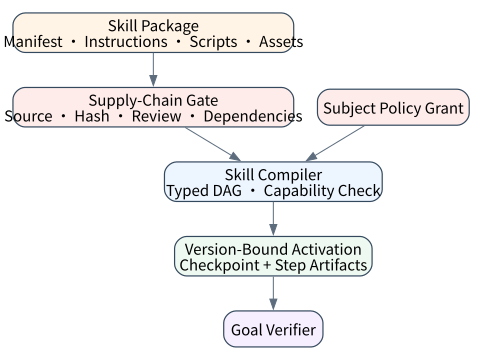
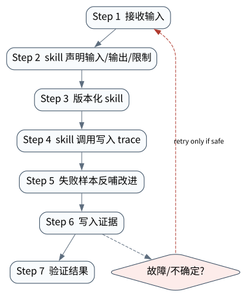

# Skills、Procedural Memory 与可复用能力

> **本章命题**：Skill 不是一段更长的 prompt，而是可版本化、可编译、受 capability 约束的程序性知识包。它可以指导模型怎样完成任务，但不能凭声明扩大 Runtime 权限。

上一章治理“记住什么”；本章治理“怎样做”。二者都跨会话复用，但 semantic memory 保存事实，procedural memory/skill 保存步骤、工具依赖、前置条件与验收方式。



## 问题背景与学习目标

团队常把成功对话复制成 prompt 文件，逐渐形成无法追踪来源、版本、权限和适用条件的“技巧库”。当 Skill 能加载脚本、调用工具或修改代码时，它已经接近供应链制品：恶意或过期 Skill 可诱导 Agent 请求额外权限、跳过验证或执行隐蔽步骤。

完成本章后，读者应能：

- 区分 prompt、tool、workflow、skill 与 policy；
- 为 Skill 定义 manifest、source digest、输入输出、步骤 DAG、capabilities 与 verifier；
- 在激活前编译和做静态检查，而不是执行中才发现缺权限；
- 建立签名、来源、版本、兼容与撤销策略；
- 用任务集评价 Skill 的收益、迁移性、成本和安全退化。

## 核心概念与系统直觉

### Skill 是程序性知识

Skill 描述完成某类任务的可复用过程：何时适用、需要什么输入、可调用哪些能力、步骤依赖、失败如何处理、怎样验收。它可以含 Markdown 指导、模板、脚本和资源，但这些组件要分别治理。

### 激活不等于授权

模型或路由器选择 Skill，只说明该程序可能相关。Runtime 计算的 grant 来自 subject policy；Skill 声明的 capability 只能是申请集合，最终 grant 是二者交集，且超出 policy 时 fail closed。

### 编译先于执行

将自然语言步骤编译成 typed DAG，可在执行前发现重复 step ID、缺失 dependency、cycle、未声明 capability 和版本错误。模型仍可在节点内做开放决策，但控制边界变得可检查。

### Skill 是供应链对象

必须记录 source URI、commit/release、content hash、publisher、审查结论和依赖。自动下载并执行最新 Skill 与自动执行未知代码具有同等风险。

## 原理与理论基础

Skill manifest 可写为：

$$
S=(name,version,digest,Inputs,Outputs,Steps,C_{declared},Verifier)
$$

对主体 $u$：

$$
C_{effective}=C_{declared}\cap C_{policy}(u)
$$

但若 $C_{declared}\nsubseteq C_{policy}(u)$，本书选择注册/激活失败，而不是静默删掉能力继续执行；否则某些步骤会以残缺权限运行并产生难解释结果。

步骤图 $G=(V,E)$ 需满足 DAG、dependency closure 和：

$$
\forall v\in V: capability(v)\in C_{declared}
$$

**不变量**：a skill version must compile to an explicit DAG and may not enlarge the runtime capability grant。

## 关键机制与执行流程



1. Resolver 按 name + exact version/digest 获取 Skill，禁止隐式 latest；
2. Supply-chain gate 校验来源、hash、签名/审核和依赖；
3. Manifest validator 检查 schema、semver、输入输出和 capability；
4. Compiler 建 DAG，检查依赖缺失、环和未声明能力；
5. Policy 将 subject grant 与 Skill 申请比较，任何扩权都阻断；
6. Runtime 创建本次 activation identity，并逐步执行；
7. 每个 step 记录 input/output artifact、tool/action identity 和状态；
8. Verifier 判断 Skill 目标，不把“步骤跑完”当成业务完成。

Skill 内文本与第三方资源都属于不可信内容；只有 manifest 的受信字段可参与权限决策。

## 从原理到实现

参考编译器先做 capability gate：

```python
declared = set(manifest.declared_capabilities)
if not declared <= policy_capabilities:
    raise PermissionError(
        f"capability_escalation:{sorted(declared - policy_capabilities)}"
    )
```

随后验证步骤并用 Kahn 算法产生稳定拓扑序：

```python
for step in manifest.steps:
    if step.capability not in declared:
        raise ValueError(f"undeclared_step_capability:{step.step_id}")
    if set(step.depends_on) - set(by_id):
        raise ValueError(f"missing_step_dependency:{step.step_id}")

while ready:
    current = ready.pop(0)
    order.append(current)
    for follower in sorted(followers[current]):
        indegree[follower] -= 1
        if indegree[follower] == 0:
            ready.append(follower)
            ready.sort()
```

最终 `CompiledSkill` 保存 execution order、effective grant 和 canonical manifest digest。Digest 让 activation/checkpoint 明确绑定到已审查版本，避免恢复时加载了同名新内容。

## 主流系统实现对照与源码阅读入口

| 生态抽象 | 关注对象 | 不能省略的系统问题 |
|---|---|---|
| Agent Skills/本地 Skill 目录 | 指令、脚本、模板、资源 | 来源、hash、可执行内容、权限、更新 |
| OpenAI Agents SDK tool/agent/handoff | 可组合能力与委派 | Skill manifest 如何映射为工具和 guardrail |
| Workflow framework subgraph | 可复用控制图 | graph version、checkpoint migration、capability |
| Package/plugin 系统 | 分发与依赖 | 签名、锁文件、sandbox、撤销 |

源码阅读不要停在“发现 Skill 文件”。要追激活条件、加载边界、脚本进程、环境变量、工作目录、网络权限、失败回传和 trace。

## 设计方案与方法对比

| 形式 | 自由度 | 可验证性 | 适用范围 |
|---|---:|---:|---|
| Prompt 模板 | 高 | 低 | 表达风格、低风险指导 |
| Checklist Skill | 中 | 中 | 运维/研究流程 |
| Typed DAG Skill | 中 | 高 | 可恢复、需审计的任务 |
| 沙箱脚本包 | 高 | 取决于 sandbox | 编码、数据处理 |
| 固定 workflow | 低 | 最高 | 稳定高风险业务 |

风险越高，越应把自然语言建议下沉为 typed precondition、tool contract 和 verifier。

## 可复现实验

### 实验环境

Python 标准库、无网络/API key。固定 Skill `incident-triage@1.2.0`，source digest 来自实际 bytes；策略只允许 `logs.read` 与 `metrics.read`。SUT 为 `compile_skill`。

### Lab 12A：编译 incident triage

```bash
PYTHONPATH=src uv run python examples/chapters/ch12_skills.py
```

实际顺序为 `collect_logs → collect_metrics → correlate`，grant 只有两项读能力，并输出稳定 manifest SHA-256 摘要；证据等级 `L1_MECHANISM`。

### Lab 12B：Skill 申请删除数据库

```bash
PYTHONPATH=src uv run python examples/chapters/ch12_skills.py --fault
```

故障 manifest 额外声明 `database.delete`。实际结果为 `capability_escalation:['database.delete']`、`steps_executed=0`，因此是 `L3_CONTAINED`，不是“发现风险但仍执行”。详见 [Lab 12A](../../../labs/core/lab-12A-skills.md) 与 [Lab 12B](../../../labs/core/lab-12B-skills-fault.md)。

### 关键断点与验收标准

**关键断点**：在 semver/source digest、declared/step/policy capability 闭包、dependency existence、indegree 与稳定 ready queue 处观察编译过程。**验收标准**：正常实际输出必须包含确定 DAG 顺序、最小 grant 和 manifest digest；越权 Skill 必须在任一 step 开始前失败，`steps_executed=0`。

## 工程场景与系统设计

事故诊断 Skill 可以读取日志、指标并生成报告，但不能自动重启生产或删数据。若需要修复，应产生另一个高风险 action proposal，进入审批和 effect protocol。这样“诊断程序性知识”不会隐式继承“修复权限”。

Skill registry 维护：owner、version/digest、supported runtime、required tools、capability申请、输入输出 schema、evaluation set、review/expiry。发布采用 immutable artifact 和显式 promotion；同名内容变化必须新版本。

## 故障模型、失败模式与排错

- **同名漂移**：checkpoint 恢复时加载新 Skill；检查 digest binding；
- **隐藏脚本扩权**：manifest capability 与 sandbox syscall/network policy不一致；
- **依赖循环**：编译期拒绝，不交给模型“想办法”；
- **提示注入修改流程**：外部内容不能改变 trusted manifest；
- **步骤完成但目标失败**：缺少 end verifier；
- **自动更新供应链污染**：锁定来源、hash、签名并支持撤销。

## 性能、可靠性与工程化

测量 activation precision/recall、task success delta、step retry、tool/cost、latency、unsafe capability requests 和 verifier failure。Skill 可能提高平均成功率，却在罕见输入上稳定地产生危险动作，因此必须保留 adversarial/edge-case 集。

编译产物可按 digest 缓存；资源懒加载能减少上下文，但加载行为本身应可审计。长 Skill 需要 checkpoint 记录 compiled version、current step、artifacts 和 pending effect，不能只保存自然语言进度。

## 技术边界与设计取舍

本章 manifest 是教学子集，不包含数字签名、依赖解算、容器 sandbox 或 schema migration。它证明 capability escalation 在执行前被阻断，不证明任意第三方 Skill 安全。

模型可用于 Skill selection 或步骤内决策。若用本地小模型，冻结权重/revision/量化并运行 activation eval；若用 OpenAI，key 只经环境注入，证据包保存脱敏 item、model 和 usage。无论模型来源如何，capability compiler 必须保持确定性。

## 前沿研究与演进方向

Procedural memory 正与自动 Skill discovery、trajectory distillation、self-improvement 相交。真正困难的是：从成功轨迹提取可迁移程序，同时避免把偶然步骤、秘密、过拟合提示或危险权限固化。未来 Skill 更像“带 proof obligations 的程序包”，而不是共享 prompt。

### 深度审计与研究证据链：复用能力必须复用边界

生态实践证明 Skill 能显著提升复杂任务一致性，但能力复用会同步复用错误。本文的 DAG/capability 编译器提供可证伪安全边界；它不能替代真实模型 activation eval 或供应链审计，三者需分别出证据。

## 本章总结与进阶实践

Skill 把经验变成程序性资产。只有当版本、依赖、权限、执行状态和 verifier 都显式化时，它才比一段 prompt 更可靠。

进阶问题：

1. Skill、Tool 与 Workflow 的责任边界如何划分？
2. 为什么 capability 超集应失败而不是静默取交集？
3. checkpoint 为什么要绑定 manifest digest？
4. 怎样评估自动抽取的 Skill 是否过拟合？
5. 第三方 Skill registry 至少需要哪些供应链字段？

参考答案见[附录 H：第二篇问题参考答案](../appendix-h-part2-solutions.html#part2-solutions-ch12)。
