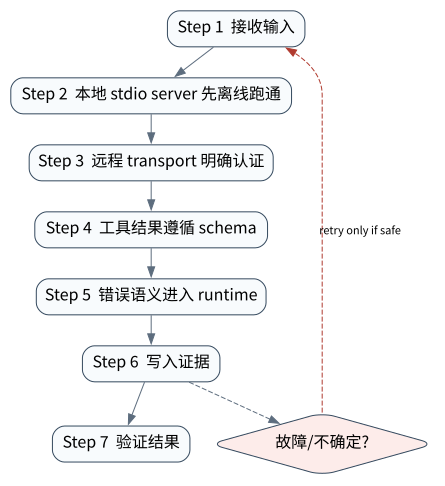

# MCP：把外部工具与资源接成协议边界

> **本章核心判断**：MCP 将 tools、resources、prompts、transport 和 capability negotiation 协议化，使 Agent 可以连接外部系统而不把每个集成都写死在框架内部。

上一章：Skills、Procedural Memory 与可复用能力。本章把前一章已经建立的能力进一步推进到 `Host/Client/Server`；下一章将进入：Agent Loop：从 while 循环到可治理 Runtime。


## 问题背景与学习目标

MCP 将 tools、resources、prompts、transport 和 capability negotiation 协议化，使 Agent 可以连接外部系统而不把每个集成都写死在框架内部。

在本章的 `Host/Client/Server` 场景中，真实 Agent 系统与普通“问答程序”的差异，在于一次任务会跨越模型、工具、状态、外部环境和人工治理边界。本章所有原理、代码与实验都围绕这些可验证问题展开。


**本章完成标准：**

- **机制理解**：能够解释“MCP 将 tools、resources、prompts、transport 和 capability negotiation 协议化，使 Agent 可以连接外部系统而不把每个集成都写死在框架内部。”，并指出它对应的确定性软件边界；
- **正确性判断**：能够针对 `protocol metadata and tool contracts are transport boundaries and must be validated` 构造一个反例，说明证据不足时系统为什么不能继续乐观执行；
- **实验与迁移**：运行 `Lab 13A` / `Lab 13B`，分别说明 normal/fault 的 evidence level，并把同一机制映射到至少一个上游实现或协议。

## 核心概念与系统直觉

本节不把概念当作术语清单，而是回答三个工程问题：它**是什么**、在系统里**负责什么**、以及它失效时**会留下什么可观测证据**。

### Host/Client/Server

**定义。** MCP Host 是拥有用户交互与 Agent Runtime 的应用；Client 是 Host 内连接某个 MCP Server 的协议端；Server 暴露 tools/resources 等能力。三者分离是权限与生命周期设计的基础。

**系统责任。** Host 决定哪些 Server 可被连接、哪些结果进入模型以及用户身份怎样传递；Server 不应默认拥有 Host 的全部权限。

**失败边界。** 把 MCP Server 当“可信插件”会忽略 supply‑chain 与 delegated authority 风险。 每个 server 都应按外部服务治理。

### Tools/Resources/Prompts

**定义。** Tools 表示可执行操作，Resources 表示可读取内容或对象，Prompts/相关能力表示可复用交互模板。它们在风险和缓存语义上不同。

**系统责任。** Host 应分别处理：tool 需要 policy/effect control， resource 需要 ACL/provenance， 模板需要信任与版本。

**失败边界。** 如果把不可信 resource 内容当成高优先级 prompt，就会形成协议级 prompt injection。

### Transport

**定义。** Transport 负责消息承载而不是业务状态。2026‑07‑28 MCP 把核心转向 stateless request/response，使请求能被任意 replica 处理。

**系统责任。** 应用需要跨调用状态时应显式使用 handle/resource 或上层 store，而不是依赖隐藏 session affinity。

**失败边界。** 把业务状态绑定连接会限制扩容和恢复，并使 load balancer/retry 语义复杂。

### Capability

**定义。** Capability 描述参与方当前支持的协议功能及可选扩展，是兼容性协商而不是权限授权。

**系统责任。** Client/Server 可基于 capability 选择行为，但“支持某功能”不代表“当前用户被允许使用”。授权仍应由 identity/policy 控制。

**失败边界。** 混淆 capability 与 authorization 会造成“协议上能调用 = 业务上允许调用”的越权。

## 原理与理论基础

### 系统不变量

> **Invariant**：protocol metadata and tool contracts are transport boundaries and must be validated

不变量与普通“最佳实践”不同：最佳实践可以因为场景变化而替换，不变量一旦被破坏，系统就失去本章希望保证的正确性。例如 `把 MCP Server 当可信本地库` 并不是一个 UI 问题，而是说明某个状态已经无法从证据中唯一判断。


### 故障模型

本章优先把 “把 MCP Server 当可信本地库”、“远程工具无认证”、“版本/能力协商不记录” 作为可证伪故障，而不是泛化地枚举所有异常。对涉及外部 effect 的失败，判定顺序固定为“最后 durable state → effect 是否可能发生 → 现有 observation 是否足够决定下一步”；证据不足时停在 UNKNOWN/显式失败。

### Why / What if / Trade-off

本章真正的设计取舍不是“使用更强模型还是写更多规则”，而是确定 **Host/Client/Server** 与 **Tools/Resources/Prompts** 分别应该由概率性决策还是确定性软件拥有。模型可以帮助识别候选路径，但它不会自动消除“把 MCP Server 当可信本地库”这类系统失败；该失败必须由 runtime 的 schema、状态机、权限或 verifier 显式约束。

如果把 Host/Client/Server 完全交给模型，系统会把不可验证的语言判断混入执行事实；如果把 Tools/Resources/Prompts 全部硬编码为固定 workflow，又会失去开放任务所需的适应性。更稳健的边界是：让模型负责提出候选决策，让软件负责 `本地 stdio server 先离线跑通`、`错误语义进入 runtime` 以及对不变量 **protocol metadata and tool contracts are transport boundaries and must be validated** 的检查。

**What if。** 一旦“远程工具无认证”发生，系统首先需要判断现有证据是否足够决定下一状态；证据不足时应停在显式失败或待协调状态，而不是让模型用自然语言补全事实。这个边界决定了本章方案是否具有可恢复性，而不只是演示效果。


### 形式化模型与可证伪假设

$$
Request=(method,params,capability,auth,context\_handle)
$$

MCP 的价值是能力发现与调用协议，而不是替代业务授权。2026-07-28 的 stateless core 更强调“会话状态不是协议正确性的隐含前提”。

**可证伪假设。** 将 capability discovery 与 runtime authorization 分离后，协议升级不会自动扩大 Agent 权限。

**建议测量。** unauthorized-call block rate、capability-cache hit、MRTR completion、auth failure visibility。

## 关键机制与执行流程



**Step 1 — 本地 stdio server 先离线跑通。** `本地 stdio server 先离线跑通` 是“MCP：把外部工具与资源接成协议边界”的一次显式状态转移。输入和输出都必须可序列化并关联 `run_id/step_id`；一旦该步骤失败，后继步骤只能依据已记录状态继续。关键观察点是 `Host/Client/Server` 是否仍满足 **protocol metadata and tool contracts are transport boundaries and must be validated**。

**Step 2 — 远程 transport 明确认证。** `远程 transport 明确认证` 不读取模型的自我评价，而读取 `Tools/Resources/Prompts` 对应的 artifact、状态或环境事实。验证器应返回可机读结果，并在证据不足时保留失败/UNKNOWN，而不是为了让流程继续而猜测。这样才能把本章不变量 **protocol metadata and tool contracts are transport boundaries and must be validated** 变成真正的验收条件。

**Step 3 — 工具结果遵循 schema。** `工具结果遵循 schema` 是“MCP：把外部工具与资源接成协议边界”的一次显式状态转移。输入和输出都必须可序列化并关联 `run_id/step_id`；一旦该步骤失败，后继步骤只能依据已记录状态继续。关键观察点是 `Transport` 是否仍满足 **protocol metadata and tool contracts are transport boundaries and must be validated**。

**Step 4 — 错误语义进入 runtime。** `错误语义进入 runtime` 是“MCP：把外部工具与资源接成协议边界”的一次显式状态转移。输入和输出都必须可序列化并关联 `run_id/step_id`；一旦该步骤失败，后继步骤只能依据已记录状态继续。关键观察点是 `Capability` 是否仍满足 **protocol metadata and tool contracts are transport boundaries and must be validated**。

在本章的 `Host/Client/Server` 场景中，**最后一步 — 验证。** verifier 针对 `Capability` 检查本章不变量 **protocol metadata and tool contracts are transport boundaries and must be validated**。如果“把 MCP Server 当可信本地库”使现有 artifact/外部状态不足以证明成功，结果必须停在显式失败或 UNKNOWN；只有 observation 能闭合状态转移时，流程才允许进入 FINISHED。

### 数据流与控制流

本章的数据/控制链按 **本地 stdio server 先离线跑通 → 远程 transport 明确认证 → 工具结果遵循 schema → 错误语义进入 runtime** 推进。调试时不要只看最终 answer，应确认每一阶段的输入来源、状态版本和 observation；对“把 MCP Server 当可信本地库”尤其要检查动作前后的证据是否足以闭合不变量 **protocol metadata and tool contracts are transport boundaries and must be validated**。


### 持久化点与崩溃窗口

本章需要持久化的内容取决于动作可逆性。与 `Host/Client/Server` 有关的纯计算状态通常可以重算；一旦 `远程 transport 明确认证` 可能产生昂贵、外部或不可逆效果，就必须在动作前后建立可区分的证据边界。对于本章不变量 **protocol metadata and tool contracts are transport boundaries and must be validated**，恢复时最重要的问题是：最后一个已知状态是什么、动作是否可能已经发生、现有 observation 能否唯一决定 retry/continue/compensate。


## 从原理到实现


### 完整实验入口

```python
from __future__ import annotations
import argparse
from agentlab.course_scenarios import run_scenario

def main() -> int:
 p=argparse.ArgumentParser(description='MCP：把外部工具与资源接成协议边界')
 p.add_argument("--fault", action="store_true", help="inject the chapter-specific failure path")
 args=p.parse_args()
 result=run_scenario('mcp', fault=args.fault)
 print(result.as_json())
 return 0 if result.passed else 2

if __name__ == "__main__":
 raise SystemExit(main())
```

### 核心机制实现

```python
def mcp(fault=False):
    request = {
        "jsonrpc": "2.0",
        "id": "req-13",
        "method": "tools/call",
        "params": {
            "name": "lookup",
            "arguments": {"id": 7},
            "_meta": {
                MCP_PROTOCOL_VERSION_META_KEY: MCP_PROTOCOL_VERSION,
                MCP_CLIENT_CAPABILITIES_META_KEY: {},
                MCP_CLIENT_INFO_META_KEY: {"name": "agentlab-core", "version": "13.1"},
            },
        },
    }
    headers = {
        MCP_PROTOCOL_VERSION_HEADER: MCP_PROTOCOL_VERSION,
        MCP_METHOD_HEADER: "tools/call",
        MCP_NAME_HEADER: "lookup",
    }
    if fault:
        headers[MCP_PROTOCOL_VERSION_HEADER] = "2025-11-25"

    valid, errors = validate_mcp_2026_request(request, headers=headers)
    condition = valid if not fault else \
        (not valid and "header_body_version_mismatch" in errors)
    return _ok("mcp", fault,
               {"request": request, "headers": headers, "valid": valid, "errors": errors},
               "MCP 2026-07-28 per-request metadata and HTTP protocol version must agree",
               condition)
```


这里的 Core Lab 被明确定位为**本仓库的 deterministic protocol-conformance fixture**，不是官方 MCP SDK 的替代实现。它对齐 2026-07-28 v2 协议线：per-request metadata 位于 `params._meta`，使用 `io.modelcontextprotocol/protocolVersion`、`io.modelcontextprotocol/clientCapabilities`、`io.modelcontextprotocol/clientInfo` 等保留 key；Streamable HTTP 路径同时携带 `MCP-Protocol-Version`、`Mcp-Method`，对 `tools/call` 还携带 `Mcp-Name`。body/header 不一致必须拒绝。

仓库另有真实官方实现证据：`mcp==2.2.0` 的 `Client` 与 `MCPServer` 位于不同 OS 进程，通过 loopback Streamable HTTP 执行 `price_purchase_order`；verifier 同时检查协商版本、服务端 PID/业务 effect、`params._meta`、routing headers，以及 header/body 版本冲突被官方 classifier 以 `HEADER_MISMATCH` 拒绝。证据包见 [`mcp-sdk-conformance`](../../../evidence/l5/mcp-sdk-conformance/2026-09-12-macos-arm64-py313-v1.0.0/evidence.json)。它证明 Python↔Python 单机互操作，**不证明**跨语言、远程网络、OAuth/授权或生产安全。


### 简化假设与不能省略的机制

`structured_output=False`、整数金额和确定性税率计算是为了把协议传输与模型随机性分离；关键不是业务算法复杂，而是请求确实穿过 socket/进程边界并由另一个 PID 产生 effect。实验不能省略服务端 observation：仅看到客户端 `CallToolResult` 无法排除 mock、短路或本地 handler。反过来，协议成功也不能证明工具可信；Host 仍需对 server identity、tool schema、参数、权限、结果与副作用分别治理。


## 主流系统实现对照与源码阅读入口

| 项目 | 本书锁定版本/状态 | 应阅读的机制 | 已核验源码/文档入口 | 官方来源 |
|---|---|---|---|---|
| Model Context Protocol Python SDK | `v2 stable line; protocol revision 2026-07-28` | 以 2026-07-28 protocol revision 为界阅读 v2 docs；重点比较新请求元数据/stateless path 与旧 initialize/session path。 | `docs/whats-new.md`<br>`docs/protocol-versions.md`<br>`ROADMAP.md` | [官方来源](https://github.com/modelcontextprotocol/python-sdk) |
| OpenAI Agents SDK | `v0.22.0 @ 4df9ecf` | 从 Agent/Runner 入口追踪 tool loop、RunState、session、guardrail 与 tracing；特别对照 v0.22.0 对 replay state 与 failed/incomplete response 的 hardening。 | 以官方 docs/release/source tree 为准 | [官方来源](https://github.com/openai/openai-agents-python) |
| DeepSeek Harness | `@deepseek-ai/dsh 0.1.2-rc.1 reproducibility pin` | 先读 docs/architecture.md，再看 service/dependency/lifecycle；关注 Cordis context、service 注入与 plugin 可逆 effect，而不是只看 UI。 | `docs/architecture.md`<br>`docs/user/develop/framework/service.md` | [官方来源](https://github.com/deepseek-ai/deepseek-harness) |

### 源码阅读方法

源码阅读以 **Model Context Protocol Python SDK** 为第一参照，并只追与“MCP：把外部工具与资源接成协议边界”直接相关的公开执行链：入口 → durable/session state → 权限或协议边界 → verifier/trace。若上游没有公开某个服务端组件，本章不根据客户端现象反推其内部 scheduler、queue 或 policy engine。


### 工业实现为什么更复杂


对本章最值得关注的工程增量是：如何避免“把 MCP Server 当可信本地库”、如何在“远程工具无认证”后恢复，以及如何让 `错误语义进入 runtime` 的结果能够进入 tracing/evaluation。只有这些机制都能落到公开类型、函数或协议消息上，才算真正完成源码对照。

## 设计方案与方法对比

| 方案 | 核心优势 | 主要局限 | 更适合的约束 |
|---|---|---|---|
| 最小自研 AgentLab | 机制透明、可断点、无网络即可故障注入 | 生态/模型能力有限 | 教学、研究原型、回归基线 |
| Model Context Protocol Python SDK | 互操作协议明确、跨实现边界清楚 | 协议不是授权/事务/审计系统 | 跨工具或跨 Agent 集成 |
| OpenAI Agents SDK | 官方/主流实现提供成熟抽象与生态 | 抽象会隐藏部分底层机制，需要源码/trace 反推 | 生产集成与方案对照 |
| DeepSeek Harness | 贴近 coding/长期执行 harness，工作区和工具边界更真实 | 依赖更重或迭代快，升级需锁版本做回归 | Coding Agent、Harness 源码学习 |


## 可复现实验

本章两个 Core Lab 证明本地 validator 的机制与 fault oracle；独立的 L5 实验则执行 pinned 官方 MCP SDK 的跨进程 Streamable HTTP。两者不能相互替代：Core Lab 适合逐行调试规则，官方实验负责证明真实实现边界。完整的跨语言、远程鉴权与多 transport 合同仍保持 `EXTERNAL_NOT_RUN_IN_THIS_RELEASE`。

### 实验环境

统一 Python/OS/离线复现约束、安装步骤与工具链版本集中维护在[附录 A](../appendix-a-environment.md)。本章只增加与“MCP：把外部工具与资源接成协议边界”直接相关的 normal/fault 双轨验证；若需要真实云、浏览器、GPU 或第三方 provider，则在对应 upstream lab 中单独标记 `NOT_RUN_EXTERNAL`，不把未运行结果计入核心实验。

### Lab 13A — 正常路径

```bash
PYTHONPATH=src python examples/chapters/ch13_mcp.py
```

**关键断点：**
- `src/agentlab/course_scenarios.py::mcp`
- `examples/chapters/ch13_mcp.py::main`

**本发布包实际输出：**

```json
{"contained": false, "evidence_level": "L1_MECHANISM", "evidence_meaning": "normal_path_assertion_satisfied", "fault": false, "fault_injected": false, "invariant": "MCP 2026-07-28 per-request metadata and HTTP protocol version must agree", "invariant_holds": true, "observation": {"errors": [], "headers": {"mcp-method": "tools/call", "mcp-name": "lookup", "mcp-protocol-version": "2026-07-28"}, "request": {"id": "req-13", "jsonrpc": "2.0", "method": "tools/call", "params": {"_meta": {"io.modelcontextprotocol/clientCapabilities": {}, "io.modelcontextprotocol/clientInfo": {"name": "agentlab-core", "version": "13.1"}, "io.modelcontextprotocol/protocolVersion": "2026-07-28"}, "arguments": {"id": 7}, "name": "lookup"}}, "valid": true}, "oracle_detected": false, "passed": true, "recovered": false, "scenario": "mcp", "system_detected": false}
```

PASS：退出码 0，`passed=true`、`fault=false`、`invariant_holds=true`；这只证明确定性 fixture 的正常机制断言。完整手册：[Lab 13A](../../../labs/core/lab-13A-mcp.md)。

### Lab 13B — 故障注入

```bash
PYTHONPATH=src python examples/chapters/ch13_mcp.py --fault
```

**本发布包实际输出：**

```json
{"contained": true, "evidence_level": "L3_CONTAINED", "evidence_meaning": "fault_detected_and_contained", "fault": true, "fault_injected": true, "invariant": "MCP 2026-07-28 per-request metadata and HTTP protocol version must agree", "invariant_holds": true, "observation": {"errors": ["header_body_version_mismatch"], "headers": {"mcp-method": "tools/call", "mcp-name": "lookup", "mcp-protocol-version": "2025-11-25"}, "request": {"id": "req-13", "jsonrpc": "2.0", "method": "tools/call", "params": {"_meta": {"io.modelcontextprotocol/clientCapabilities": {}, "io.modelcontextprotocol/clientInfo": {"name": "agentlab-core", "version": "13.1"}, "io.modelcontextprotocol/protocolVersion": "2026-07-28"}, "arguments": {"id": 7}, "name": "lookup"}}, "valid": false}, "oracle_detected": true, "passed": true, "recovered": false, "scenario": "mcp", "system_detected": true}
```

PASS：退出码 0，`passed=true`、`fault=true`、`oracle_detected=true`。本章故障实验为 **L3_CONTAINED**：被测组件检测并 fail-closed/约束了故障，但不声明已恢复业务结果。 `passed=true` 本身只表示实验 oracle 得到预期观察。完整手册：[Lab 13B](../../../labs/core/lab-13B-mcp-fault.md)。

### 观察与证据


## 工程场景与系统设计

本章复用第 7 章“客户支持 Agent”教学负载，重点把 tool/resource 访问转换为 MCP wire contract 与 policy 边界；性能数字仍仅作为设计输入。


### 上线前必须补齐

- 围绕 **MCP 协议边界** 建立可审计状态字段与最小权限；
- 为本章相关动作记录 run_id、step_id、输入摘要与 observation；
- 对 `MCP 是工具/资源/提示词协议边界，metadata、能力和工具描述都必须验证。` 这一边界建立自动化验收；
- 为本章主要故障窗口配置 trace、日志和恢复 runbook；
- 上线前把教学 fixture 替换为真实 provider/tool/workspace，并重新执行 normal/fault 两条路径。

## 故障模型、失败模式与排错

本章至少主动测试以下失败：

- **把 MCP Server 当可信本地库**：先确认最后 durable state，再检查是否已经产生外部效果；不要先重试。
- **远程工具无认证**：先确认最后 durable state，再检查是否已经产生外部效果；不要先重试。
- **版本/能力协商不记录**：先确认最后 durable state，再检查是否已经产生外部效果；不要先重试。


## 性能、可靠性与工程化

### 应采集指标

- `tool/retrieval p50,p95 latency`
- `tool error/UNKNOWN rate`
- `recall@k / evidence coverage`
- `memory hit/conflict rate`
- `payload bytes / turn`


### 优化顺序


任何优化都必须重新运行 Lab A/B。尤其当优化改变 `Tools/Resources/Prompts` 的生命周期时，要重新验证 **protocol metadata and tool contracts are transport boundaries and must be validated**；否则平均延迟下降可能以更大的 stale state、重复副作用或取消失效为代价。

### 可靠性工程

本章可靠性 gate 直接针对 “把 MCP Server 当可信本地库”、“远程工具无认证”、“版本/能力协商不记录”：只有正常路径与对应 fault path 都保持 **protocol metadata and tool contracts are transport boundaries and must be validated**，优化或功能扩展才可接受。是否达到 detection、containment 或 recovery 以实验的 `evidence_level` 字段为准。


## 技术边界与设计取舍
本章方案有明确边界：

- 检索只能返回可索引/可访问的数据，不自动保证事实完整性
- 工具 schema 无法消除外部系统自身的不一致
- 长期记忆会过期、冲突或包含敏感信息，必须治理
- 协议标准化互操作，不替代业务授权与审计

选择方案时要回到本章边界：如果业务不能接受“把 MCP Server 当可信本地库”，就必须为 `Host/Client/Server` 增加更强的确定性约束；如果主要任务是开放式探索，则可以把更多 `Tools/Resources/Prompts` 决策交给模型，但要用 `错误语义进入 runtime` 保持结果可验证。**Model Context Protocol Python SDK** 与 **OpenAI Agents SDK** 的差异也应放在这些约束下理解，而不是抽象成通用框架排名。

MCP 标准化互操作边界，但协议兼容不等于工具可信、调用获权或副作用可恢复。协议层应严格校验版本与 wire model；安全层仍需 identity、policy、tool provenance 与 effect verification。

## 前沿研究与演进方向

当前研究和工业演进已经从“模型能否调用工具”推进到“怎样让长期、状态化、具有副作用的 Agent 可评估、可恢复、可治理”。与本章直接相关的资料：

- **[ReAct: Synergizing Reasoning and Acting in Language Models](https://arxiv.org/abs/2210.03629)**：提出 reasoning/action 交错轨迹，连接语言推理与外部环境动作。
- **[Toolformer: Language Models Can Teach Themselves to Use Tools](https://arxiv.org/abs/2302.04761)**：探索模型学习何时调用外部工具以及如何把工具结果纳入后续预测。
- **[Model Context Protocol Python SDK](https://github.com/modelcontextprotocol/python-sdk)**（v2 stable line; protocol revision 2026-07-28）：v2 当前稳定线；新 revision 取消新路径的 handshake/session，Client 可向旧 revision 回退。
- **[OpenAI Agents SDK](https://github.com/openai/openai-agents-python)**（v0.22.0 @ 4df9ecf）：Agent/Runner/Tools/Handoffs/Guardrails/Sessions/HITL/Tracing；0.22.0 包含 runtime hardening。


### 截至 2026-09-11 的研究更新

本节只记录会改变本章系统结论的研究或官方规范更新；实验仍使用仓库锁定版本，避免把“最新观察版本”与“可复现实验版本”混为一谈。
- MCP 2026‑07‑28 Specification（2026‑07‑28 GA）：stateless protocol core, MRTR, header routing, cache hints and auth hardening。
- NIST Agent Identity and Authorization Concept Paper（published 2026‑02‑05）：agent identity, delegated authority, authentication and authorization。

**本章吸收的变化。** 2026‑07‑28 MCP 将核心进一步推向 stateless request/response：transport 不应暗中承担 application state。Capability discovery 与 authorization 仍是不同层。这些研究/规范的价值不在于替换本章原理，而在于把上述假设放进更真实、更长时或更高风险的环境中检验。

### Research Gap

围绕 `Host/Client/Server`，当前缺口不是“再增加一个 Agent API”，而是怎样把 **protocol metadata and tool contracts are transport boundaries and must be validated** 从局部实现经验升级为跨模型、跨 runtime 可验证的系统属性。现有工业实现已经能够提供 tool loop、session、graph、plugin 或 workspace 等抽象，但在“把 MCP Server 当可信本地库”和“远程工具无认证”同时出现时，证据格式、恢复语义和评测方法仍缺少统一答案。

本章的研究更新不追求论文数量，而关注一个问题：现有工作是否真正推进了 **MCP 协议边界** 的可验证性。2026-07-28 MCP 规范强化 stateless request、工具非可信描述和授权边界；AIP 进一步指出 MCP/A2A 缺少跨协议身份链。 因此，本章会把论文结论放回不变量、失败窗口和实验断言中，而不是把研究当作参考文献列表。

### Open Problems

1. 如何把 `Host/Client/Server` 的正确性拆成可组合的局部不变量，并在不同 Agent runtime 中复用 verifier？
2. 当“把 MCP Server 当可信本地库”与“远程工具无认证”同时发生时，**Model Context Protocol Python SDK** 与 **OpenAI Agents SDK** 的公开抽象分别能保存哪些证据，哪些状态仍需要外部 reconciliation？
3. 如果模型能力显著提高，围绕 `Tools/Resources/Prompts` 的哪些 harness 机制仍属于系统必要条件，哪些只是当前模型能力下的临时补丁？
4. 如何构造一个既保护真实业务数据、又能复现“版本/能力协商不记录”的公开 benchmark，使研究结果可以被第三方验证？


### 深度审计与研究证据链：MCP 协议边界

本章重新审计后的核心结论是：**MCP 是工具/资源/提示词协议边界，metadata、能力和工具描述都必须验证。** 这句话只有在代码、实验、开源源码和研究证据四个层面同时成立时才有教学价值。仅靠定义或 API 示例无法证明它，因为 Agent Systems 的风险通常发生在模型决策与外部环境之间的缝隙里。

**与本章最相关的近期/基础研究与官方资料：**

- **[MCP 2026-07-28 specification](https://modelcontextprotocol.io/specification/2026-07-28)**：引入 stateless/self-contained request 与更明确的 tools/resources/prompts 边界。
- **[A2A Protocol](https://github.com/a2aproject/A2A)**：把 Agent Card、task、artifact、streaming/push 作为互操作对象。
- **[AIP](https://arxiv.org/abs/2603.24775)**：指出 MCP/A2A 互操作之外仍缺少可验证委托身份链。

这些资料与本章的关系不是“引用背书”，而是帮助读者识别设计边界。MCP Python SDK v2、FastMCP 与 mcp-proto-okn 是从 SDK 到领域 server 的三个层次。 读者阅读源码时应主动寻找四个对象：输入如何进入系统、状态在哪里持久化、动作由谁执行、失败后谁负责恢复。

**实验语义边界。** 本章实验验证 MCP 协议边界的 schema、证据或记忆边界；证据等级定义与解释规则统一见附录 A，且 `passed=true` 不得跨级推导 containment/recovery。


## 本章总结与进阶实践

### 核心结论

1. 本章不变量是：**protocol metadata and tool contracts are transport boundaries and must be validated**；
2. `Host/Client/Server` 必须是可观察软件边界，而不是 prompt 约定；
3. `本地 stdio server 先离线跑通` 与 `错误语义进入 runtime` 之间必须有状态和证据连接；
4. 模型提出动作不等于系统已经执行，更不等于任务成功；
5. 正常路径只能证明功能，故障路径才能暴露恢复语义；
6. 开源实现的核心价值在于理解真实约束，不是复制 API；
7. 性能优化必须与可靠性/安全不变量一起重新验证；
8. 技术边界和未解决问题是高级系统设计的一部分。

### 常见误区

- 把 MCP Server 当可信本地库
- 远程工具无认证
- 版本/能力协商不记录

### 思考题与实践

- **Why：** 为什么 `Host/Client/Server` 不能只靠模型“记住”？
- **What if：** 如果在 `本地 stdio server 先离线跑通` 与 `错误语义进入 runtime` 之间 crash，当前证据足够恢复吗？
- **Programming：** 修改 `examples/chapters/ch13_mcp.py` 或对应 scenario，让系统新增一种错误类型，但仍保持 invariant。
- **Engineering：** 把 Lab B 的故障改成 timeout/duplicate/crash 中另一种，写出状态机和恢复步骤。
- **Research：** 选择本章一个 Open Problem，阅读两篇相互不同的方法，给出你自己的实验设计和 falsifiable hypothesis。

下一章进入 **Agent Loop：从 while 循环到可治理 Runtime**，它将复用本章已经建立的状态/证据边界，而不是重新从 API 使用开始。
