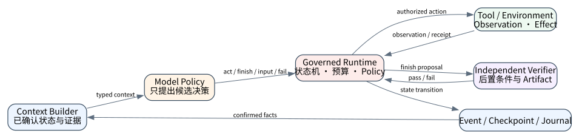
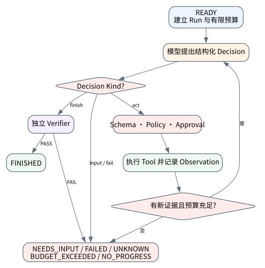

# Agent Loop：从概率决策到可治理状态机

> **本章命题**：Agent loop 不是“让模型一直调用工具”，而是一个由 Runtime 拥有、预算有限、状态可观测、成功须经外部判据确认的闭环控制系统。模型提出下一步，软件决定这一步能否发生以及何时必须停止。

上一章把能力放到 MCP 协议边界；本章开始第三篇，把一次调用提升为能治理长任务的 Runtime。知识与实现截止 2026-09-11。



## 问题背景与学习目标

朴素 `while not done` 把“完成”交给模型自报。模型可能重复同一调用、把工具错误当新证据、提前宣布成功，或在预算耗尽后继续消耗资源。真正的 Runtime 必须回答：当前状态是什么、哪些终止条件由谁判定、一步是否产生新信息、外部效果能否重放，以及失败后留下了什么证据。

学完本章，读者应能：把 ReAct 式交替过程写成有限状态机；区分模型的 `finish` 建议与 verifier 的完成证明；设计 step/token/time/cost/effect 多维预算；检测无进展循环；为 `NEEDS_INPUT`、`FAILED`、`UNKNOWN` 和 `FINISHED` 建立互斥语义。

## 核心概念与系统直觉

一次运行可表示为状态转移：

$$
s_{t+1}=T(s_t,d_t,o_t,p_t,b_t),\quad d_t\sim\pi_\theta(\cdot\mid C(s_t))
$$

模型策略 $\pi_\theta$ 只生成候选决策 $d_t$；工具 observation $o_t$、policy $p_t$ 与剩余预算 $b_t$ 共同决定 Runtime 转移。这个分离意味着模型无法仅用一句“任务完成”把系统推进到 `FINISHED`。

建议采用显式状态：`READY → DECIDING → ACTING → OBSERVING → VERIFYING`，终态为 `FINISHED / NEEDS_INPUT / FAILED / BUDGET_EXCEEDED / NO_PROGRESS / UNKNOWN`。`UNKNOWN` 专门表示外部效果可能发生但证据不足；它绝不能被折叠为普通失败后自动重试。

## 原理与理论基础

Runtime 需要同时维护安全性与活性：

- **安全性**：未经授权或未经验证的动作/结论永不提交；
- **活性**：只要环境持续提供有效进展，系统最终到达某个明确终态；
- **有界性**：任一轨迹都受硬预算限制，不存在无限执行；
- **可审计性**：每个状态转移都有输入、输出、版本与原因。

令 $g_t=H(d_t,o_t)$ 为规范化进展摘要，连续重复次数为 $r_t$。可定义：

$$
r_t=\begin{cases}r_{t-1}+1,&g_t=g_{t-1}\\1,&\text{otherwise}\end{cases},\qquad
r_t>R\Rightarrow NO\_PROGRESS
$$

它不是用文本相似度猜测“模型无聊”，而是比较动作与 observation 的 canonical digest。核心不变量是：**有限 Runtime 只能因已验证成功、预算耗尽、需要输入、显式失败、未知效果或无进展而停止。**

> **Invariant**: finite runs terminate only through an explicit Runtime state, and FINISHED requires an independent verifier.

## 关键机制与执行流程



1. Runtime 建立不可变 `run_id`、输入摘要、预算和 policy snapshot；
2. Context builder 从已确认状态构造模型输入，不能把未验证推断伪装成 observation；
3. 模型返回结构化 `act / finish / needs_input / fail`；
4. `act` 先经 schema、policy、approval 和 effect gate，再执行工具；
5. observation 写入事件流，计算 progress digest；
6. `finish` 触发独立 verifier；失败时不能进入 `FINISHED`；
7. 每轮先检查取消、deadline、各维预算与无进展阈值；
8. 外部效果处于不确定窗口时转入 `UNKNOWN` 和 reconciliation，不盲目重放。

## 从原理到实现

本书的 `GovernedLoop` 不依赖任何模型提供方。`decide` 可以来自规则、OpenAI、开源小模型或人工输入，但终态由 Runtime 控制：

```python
while steps < self.max_steps:
    decision = decide(tuple(events))
    if decision.kind == "finish":
        verified = bool(verify(tuple(events)))
        return LoopReport(
            "FINISHED" if verified else "VERIFICATION_FAILED",
            steps, verified,
            "goal_verified" if verified else "goal_not_verified",
            tuple(events),
        )
    observation = act(decision)
    events.append({"type": "observation", "value": observation})
```

无进展门禁使用决策参数与 observation 的规范化摘要，避免只比较自然语言：

```python
progress = canonical_digest({
    "decision": decision.payload,
    "observation": observation,
})
same_observation = same_observation + 1 if progress == previous else 1
if same_observation > self.max_same_observation:
    return LoopReport("NO_PROGRESS", steps, False, "no_progress", tuple(events))
```

这段实现是教学内核，不包含分布式租约、持久队列或外部 effect recovery；这些边界在第十八章和第五篇补齐。

## 主流系统实现对照与源码阅读入口

| 系统 | 公开抽象 | 应重点核验 | 本书证据边界 |
|---|---|---|---|
| [OpenAI Agents SDK](https://github.com/openai/openai-agents-python) | `Runner`、tool loop、handoff、guardrail、session、HITL、trace | final output 判定、`max_turns`、暂停/恢复与异常 | 锁定 `v0.22.0` 做源码/合同对照；仓库已有独立官方 SDK L5 向量，不把教学 loop 称为 SDK 运行 |
| [LangGraph](https://github.com/langchain-ai/langgraph) | graph executor、thread/checkpointer、interrupt、pending writes | superstep 边界、resume 是否重算、节点副作用 | 已保存锁定版本的 durable restart L5 证据；不外推到任意图与外部效果 |
| [Google ADK](https://github.com/google/adk-python) | LLM/Sequential/Parallel/Loop agents、Runner/session | workflow 确定性与 LLM 决策边界 | 以锁定源码和已有上游合同为限 |

源码阅读不要停在构造 `Agent(...)` 的 API；应追踪输入如何成为 run state、工具调用在哪里被执行、终止由谁判定、状态何时持久化、异常如何进入 trace。

## 设计方案与方法对比

| 方案 | 优点 | 主要风险 | 合适场景 |
|---|---|---|---|
| 固定 DAG | 行为可预测、易验证 | 开放任务适应性弱 | 合规流程、稳定业务 |
| 单 Agent 有界 loop | 实现紧凑、可探索 | 上下文膨胀与自我重复 | 中短工具任务 |
| 搜索树/多候选 | 可比较替代轨迹 | 成本与状态合并复杂 | 高价值规划、证明搜索 |
| Durable workflow + 模型节点 | 可恢复、可人工介入 | 需处理版本与外部 effect | 长任务、生产审批 |

模型规模不会替代 Runtime 正确性。小模型可以做路由或参数抽取，大模型可处理开放规划；两者都必须受相同状态机与 verifier 约束。

## 可复现实验

### Lab 14A：验证后完成

实验无需 API key，实际执行 `examples/chapters/ch14_agent_loop.py`。正常路径先观察 artifact，第二轮提出完成，外部 verifier 才允许终止：

```bash
PYTHONPATH=src uv run python examples/chapters/ch14_agent_loop.py
```

实际输出的关键字段为 `status=FINISHED`、`steps=2`、`verified=true`、事件序列 `decision→observation→decision`，证据等级为 `L1_MECHANISM`。

### Lab 14B：重复轨迹被包含

故障路径让决策器持续对同一路径产生同一 observation：

```bash
PYTHONPATH=src uv run python examples/chapters/ch14_agent_loop.py --fault
```

实际输出为 `status=NO_PROGRESS`、`steps=3`、`stop_reason=no_progress`、`contained=true`，属于 `L3_CONTAINED`。完整步骤见 [Lab 14A](../../../labs/core/lab-14A-agent-loop.md) 与 [Lab 14B](../../../labs/core/lab-14B-agent-loop-fault.md)。

**关键断点**：`GovernedLoop.run` 的结构化 decision、progress digest、verifier 与 stop event。**验收标准**：正常路径必须经 verifier；重复轨迹必须在预算前停止；`passed=true` 只证明本地 fixture 的断言，不代表真实模型任务成功率。

## 工程场景与系统设计

以“诊断生产告警并提出修复”为例：检索日志是只读动作，重启服务是高风险 effect。loop 可在只读阶段开放探索，但修复动作必须生成 action identity、走审批并写 journal。若重启请求超时，状态进入 `UNKNOWN`，由服务健康、部署事件或控制面 receipt 对账；模型不得因为“没看到成功消息”再次重启。

部署时应把 scheduler、state store、tool workers 与 verifier 分开。worker 可以水平扩展，但同一 run 的 lease/version 必须防止双写；verifier 应读取 artifact 和外部事实，而不是复述模型答案。

## 故障模型、失败模式与排错

- **无限循环**：检查是否存在硬预算和每轮预算扣减；
- **伪进展**：对 canonical action/observation 做摘要，不以措辞变化计进展；
- **假完成**：确认 `finish` 是否必经独立 verifier；
- **错误吞没**：工具异常应转为 typed outcome，不能当普通文本继续；
- **取消泄漏**：取消后确认子任务和工具请求的真实状态；
- **重复效果**：检查 action ID、幂等键、journal 与 reconciliation；
- **恢复漂移**：checkpoint 必须绑定代码、policy、tool schema 和上下文版本。

排错顺序是最后 durable state → 最后已授权 action → 外部效果是否可能发生 → observation 是否足以决定下一步。证据不足就停，不让模型补写事实。

## 性能、可靠性与工程化

核心指标不只是完成延迟，还包括 turns、model/tool latency、无进展率、budget exhaustion、verification failure、UNKNOWN age、每次成功的 token/cost、tool retry 与 effect reconciliation。预算应分层：run 总预算、单工具 deadline、并发上限和租户配额，避免一个运行耗尽全局资源。

性能优化不能删除证据。例如缓存工具结果时，key 必须包含参数、权限范围、数据版本和时效；压缩上下文时必须保留 decision/effect/receipt 的结构化事实。

## 技术边界与设计取舍

本章实验真实执行 Runtime 控制逻辑，但决策器是确定性 fixture，未调用 OpenAI 或本地模型，因此最高只报告 L1/L3。若要接入模型，可把 `decide(events)` 替换为结构化输出 adapter：OpenAI 路径从环境变量读取 `OPENAI_API_KEY`；开源路径可用本地小模型生成同一 schema。无论使用哪种模型，API key 不进入源码、日志或证据包，模型输出也不成为 correctness oracle。

本章没有证明 exactly-once、副作用恢复、跨进程 durable execution 或生产隔离；这些分别依赖 journal/checkpoint、上游框架 L5 实验和 OS sandbox。

## 前沿研究与演进方向

前沿重点已从“更多轮推理”转向长时域 harness：如何根据 evidence gain 自适应分配计算，如何在上下文压缩后保持状态等价，如何把搜索分支合并为可审计轨迹，以及如何让 verifier 在分布漂移和对抗环境中仍可靠。过程奖励、test-time search 与 self-improvement 都只有在 Runtime 能区分 proposal、effect 和 evidence 时才可安全落地。

一个值得研究的统一视角是把 Agent 运行看作部分可观测、带成本和硬约束的控制问题：模型估计动作价值，Runtime 执行安全过滤，环境返回 observation，verifier决定吸收态。这比“prompt + while”更接近可证明系统。

### 深度审计与研究证据链

本章证据分三层：形式化不变量说明应保证什么；Core A/B 真实执行本地状态机与故障包含；OpenAI Agents、LangGraph、ADK 等锁定来源说明主流实现如何暴露相邻 primitive。三层不能互相冒充，尤其不能从确定性 loop 推出 provider 任务成功率。

## 本章总结与进阶实践

可靠 Agent loop 的本质是把概率策略装入确定性控制壳：有限预算、显式状态、可观测转移、外部验证与不确定性停机。它不会使模型永不出错，但能让错误被发现、限制并留下证据。

进阶问题：

1. 为什么 `finish` 必须是提案而不是终态？
2. 如何定义比文本变化更可靠的 evidence gain？
3. 哪些预算应按 run、tenant 和 tool 分层？
4. 外部写操作超时后为什么不能直接进入下一轮？
5. 怎样验证恢复后的轨迹与未崩溃轨迹在可观察意义上等价？

参考答案见[附录 I：第三篇问题参考答案](../appendix-i-part3-solutions.html#part3-solutions-ch14)。
