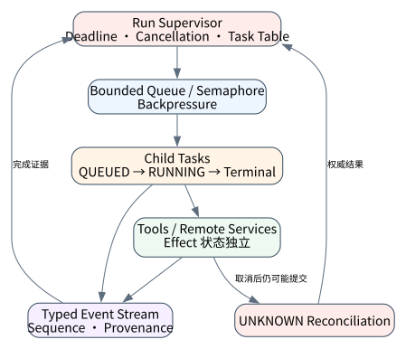
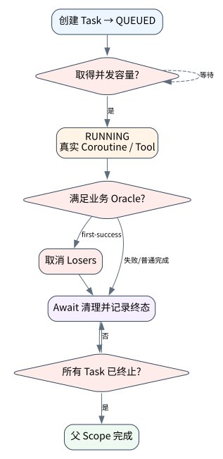

# 异步 Runtime：结构化并发、流式事件与取消语义

> **本章命题**：异步不是“同时发更多请求”，而是由父作用域拥有任务生命周期、容量与终止证据。取消是协作协议，不是撤销已经发生的外部效果；最后一个 token 也不等于 run 已完成。



## 问题背景与学习目标

Agent 同时调用检索、策略和指标服务可以降低墙钟时间，但也引入 orphan task、无界 fan-out、乱序事件、背压、超时传播和“UI 已停、后端仍写”的风险。生产 Runtime 需要知道每个被创建的任务最终属于谁、在哪个状态结束，以及取消之后仍需对账哪些 effect。

读者完成本章后，应能设计有界 fan-out；区分 token、semantic item、tool lifecycle 与 terminal event；正确传播 `CancelledError`；使用 deadline 而非层层独立 timeout；在 first-success 模式中取消并等待 losers；解释为什么 partial result 不能冒充完整结果。

## 核心概念与系统直觉

结构化并发要求父作用域退出前，所有子任务都已经成功、失败或完成取消清理。形式上，若父 scope 为 $P$，子任务集合为 $C(P)$：

$$
terminal(P)\Rightarrow \forall c\in C(P),\ terminal(c)
$$

并发上限 $K$ 约束运行中任务数量，队列长度 $Q$ 则形成背压。若生产速率 $\lambda$ 长期大于服务速率 $\mu$，只增加内存队列会把延迟问题变成崩溃问题；必须拒绝、降级或调度。

## 原理与理论基础

异步正确性至少包含四个维度：lifetime ownership、bounded capacity、event ordering 与 effect semantics。取消信号只能保证 coroutine 在下一个 cancellation point 收到异常；不能证明远端请求没有提交。故任务状态和业务 effect 状态必须分开：任务可为 `CANCELLED`，对应 effect 仍可能是 `UNKNOWN`。

Python 官方 `asyncio` 把 `TaskGroup`、timeout 等结构化组件建立在 cancellation 上，并要求捕获 `CancelledError` 后通常重新抛出。吞掉取消会破坏父作用域的完成判断。核心不变量是：**所有已创建任务都必须进入已记录终态，并且运行中数量不超过声明上限。**

> **Invariant**: every spawned task reaches a recorded terminal state, while active work never exceeds the declared concurrency bound.

## 关键机制与执行流程



1. 为 run 派生统一 deadline、并发 semaphore 和 cancellation scope；
2. 子任务先进入 `QUEUED`，取得容量后才进入 `RUNNING`；
3. 事件携带 `run_id/task_id/sequence/type`，消费者按语义处理而非混合文本；
4. all-success 模式收集全部结果和错误；first-success 模式选出满足 oracle 的 winner；
5. 对 losers 发出取消，并 `await` 它们完成 `finally` 清理；
6. 远端效果可能已发出时写入 UNKNOWN/对账队列；
7. 只有 task table 无未决项、事件流终止且后处理完成，父 run 才结束。

## 从原理到实现

`AsyncSupervisor.run_all` 用 semaphore 控制真正进入 job 的数量，并把异常保存为显式结果：

```python
async with semaphore:
    async with lock:
        active += 1
        max_active = max(max_active, active)
        states[name] = "RUNNING"
    try:
        results[name] = await job()
        states[name] = "SUCCEEDED"
    except asyncio.CancelledError:
        states[name] = "CANCELLED"
        raise
    finally:
        async with lock:
            active -= 1
```

first-success 不能只 `task.cancel()` 后立即返回；必须等待 losers 观察取消：

```python
done, pending = await asyncio.wait(tasks, return_when=asyncio.FIRST_COMPLETED)
winner = next(task.result()[0] for task in done if not task.exception())
for task in pending:
    task.cancel()
await asyncio.gather(*pending, return_exceptions=True)
```

本书测试还覆盖 `concurrency=1` 时排队任务被取消并记录为 `CANCELLED`，防止“从未运行所以无需记账”的漏洞。

## 主流系统实现对照与源码阅读入口

| 系统 | 可观察语义 | 阅读重点 |
|---|---|---|
| [Python asyncio](https://docs.python.org/3/library/asyncio-task.html) | Task、TaskGroup、timeout、cancellation | 取消传播、异常组与 `finally` 清理 |
| [OpenAI Agents SDK](https://github.com/openai/openai-agents-python) | async Runner、stream events、stream cancel | stream drain、`is_complete`、approval interruption 与 run state |
| [LangGraph](https://github.com/langchain-ai/langgraph) | streaming、superstep、checkpoint/pending writes | 并行节点失败时哪些写入持久化、resume 是否重算 |
| [Google ADK](https://github.com/google/adk-python) | ParallelAgent、Runner events/session | parallel sub-agent 的隔离、共享状态和合并语义 |

OpenAI Agents SDK 的公开文档特别区分最后可见 token 与 run 完成：session persistence、approval bookkeeping 等后处理可能稍后结束。教材据此强调事件流终止，而非根据 UI 文本猜终态。

## 设计方案与方法对比

| 模式 | 终止条件 | 适用场景 | 主要陷阱 |
|---|---|---|---|
| gather-all | 全部终态 | 独立证据汇总 | 慢任务拖尾 |
| first-success | 首个通过 oracle | 冗余读取、竞速 | winner 必须“通过验证”，loser 必须清理 |
| quorum | 达到票数/权重 | 多源一致性 | 相关错误不等于独立证据 |
| bounded pipeline | 各阶段容量受限 | 大批任务 | 队列与重试风暴 |
| speculative execution | 多分支后选择 | 高价值低延迟 | 成本、重复 effect、难回收 |

## 可复现实验

### Lab 15A：有界 Fan-out

正常实验创建三个真实 coroutine，并把并发限制为 2：

```bash
PYTHONPATH=src uv run python examples/chapters/ch15_async.py
```

实际输出显示 `max_active=2`，三个 task 均为 `SUCCEEDED`，结果完整，证据等级 `L1_MECHANISM`。

### Lab 15B：取消并等待 Loser

故障实验运行 fast/slow 两个真实 task，fast 得到证据后取消 slow，并等待取消完成：

```bash
PYTHONPATH=src uv run python examples/chapters/ch15_async.py --fault
```

实际输出为 `winner=fast`、`fast=SUCCEEDED`、`slow=CANCELLED`、`contained=true`，等级 `L3_CONTAINED`。见 [Lab 15A](../../../labs/core/lab-15A-async.md) 与 [Lab 15B](../../../labs/core/lab-15B-async-fault.md)。

**关键断点**：取得 semaphore 前后的状态、`CancelledError`、loser gather 与 `max_active`。**验收标准**：所有 task 必须有终态、并发峰值不得越界、fault 路径不得留下 pending task。实验不包含远程 API，因此不证明远端请求被撤销。

## 工程场景与系统设计

研究 Agent 可并行检索文献、代码和网页，但每类 source 应有 bulkhead，避免一个不稳定服务占满连接。合并器只接受带 provenance 的结果；deadline 到期时输出应标记 `PARTIAL` 及缺失 source，而非把已有片段包装为完整研究。

对于写工具，取消后由独立 reconciliation worker 查询 effect receipt。交互请求可以结束，但对账任务必须有 durable ownership；否则“用户看不到运行”不等于系统停止工作。

## 故障模型、失败模式与排错

- 无界 `create_task`：观察 queued/running 数量与内存；
- 吞掉 `CancelledError`：检查 coroutine 是否在 cleanup 后重新抛出；
- first-completed 误当 first-success：确认 winner 经过业务 oracle；
- 流式 token 结束即成功：检查 terminal event、后处理和 interruption；
- 慢任务拖尾：使用统一 deadline、bulkhead 与 partial contract；
- 取消写请求后自动重试：将 effect 标为 UNKNOWN 并对账；
- 多任务共享可变 state：使用版本/CAS 或明确 reducer，避免最后写入获胜。

## 性能、可靠性与工程化

应记录 queue wait、service time、end-to-end deadline、in-flight、max concurrency、cancel-to-terminal latency、orphan count、partial ratio、event lag 与下游饱和度。Little 定律 $L=\lambda W$ 可帮助估算稳定系统的并发量，但 Agent 工具时延重尾明显，应同时看 p95/p99 和超时分布。

可靠性门禁包括：进程退出前 task table 清空；取消路径测试 `finally`；并发参数做压力测试；下游错误不触发同步重试风暴；结果合并具有确定顺序或显式非确定语义。

## 技术边界与设计取舍

本章真实验证本机 `asyncio` 生命周期，不调用云服务，不证明跨进程消息取消、HTTP request abort 或远端 side-effect rollback。`PathSandbox` 和 checkpoint 也不在本章实验范围。接 OpenAI 或本地模型只会改变 job 内部计算，不改变 supervisor 的不变量；secret 通过环境变量注入，事件日志只保存 redacted provider metadata。

## 前沿研究与演进方向

长时域 Agent 正在推动自适应并发：根据任务价值、证据相关性和资源价格动态分配并行度；通过 hedged requests 降低尾延迟；用 causal trace 判断被取消分支是否留下外部影响。另一个前沿是跨框架 structured concurrency：模型子代理、workflow node 与远程 task 能否共享统一 cancellation、deadline 和 effect receipt 语义。

### 深度审计与研究证据链

本章以 Python `asyncio` 的实际 task 状态和峰值计数为机制证据，以官方 cancellation 文档约束解释；远程中断、provider streaming 和 durable workflow 分别需要自己的 wire、进程重启与 effect 证据，不能由本机 coroutine 测试替代。

## 本章总结与进阶实践

异步 Runtime 的核心不是速度，而是 ownership。凡被创建的任务都必须受容量限制、可被追踪、可被取消并最终进入已记录状态；涉及外部效果时，task cancellation 和 business outcome 必须拆开。

进阶问题：

1. 为什么 first-completed 不等于 first-success？
2. coroutine 被取消后，什么条件下 effect 仍应为 UNKNOWN？
3. 如何为流式事件定义可恢复的序列与去重语义？
4. `TaskGroup` 能解决什么，又不能解决哪些分布式问题？
5. 如何证明并发优化没有改变最终结果和权限边界？

参考答案见[附录 I：第三篇问题参考答案](../appendix-i-part3-solutions.html#part3-solutions-ch15)。
