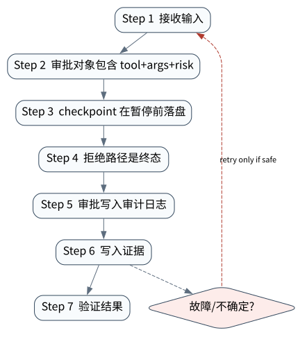

# Human-in-the-Loop：把人类决定变成可验证授权

> **本章命题**：HITL 不是弹出一个“确定吗”按钮，而是把某个主体在某个时刻对某个不可变 action 的决定持久化，并在恢复执行前重新验证身份、意图、版本、时效与策略。


## 问题背景与学习目标

如果审批只绑定自然语言描述，模型可在等待期间改变参数；如果按钮状态只在内存中，服务重启后无法证明谁批准了什么；如果一次“同意删除”能被重放到另一对象，HITL 反而成为权限升级通道。生产审批需要像安全协议一样精确，而不是像聊天 UI 一样模糊。

本章目标是设计 action-bound approval；区分 approve/reject/edit/expire；处理多人、职责分离和策略变化；让暂停状态可序列化、可恢复；证明 stale approval 不产生任何 effect。

## 核心概念与系统直觉

审批对象应是不可变 action envelope：

$$
\begin{aligned}
A=(&action\_id,run\_id,tool,args\_digest,resource,\\
   &effect,risk,policy\_version,state\_version,expires\_at)
\end{aligned}
$$

审批记录：

$$
P=(approval\_id,action\_id,principal,decision,decided\_at,comment,signature)
$$

恢复前要求 `P.action_id=A.action_id`，并重新检查 subject、resource、policy、state version 和 expiry。编辑参数不是批准旧动作后偷偷替换，而是生成新 action 与新审批。

## 原理与理论基础

HITL 建立的是授权证据而非正确性证明。人可能误判，审批不能替代 verifier；同样，verifier 证明结果正确也不能替代权限。授权、执行和结果验证是三个正交控制面。

为防 TOCTOU，执行时必须比较当前 action/state 与审批时承诺的摘要：

$$
authorize(P,A,s)=validPrincipal(P)\land P.action\_id=A.action\_id\land
H(A.args)=A.args\_digest\land s.version=A.state\_version\land now<A.expires\_at
$$

核心不变量是：**没有一份同时绑定主体、intent digest、action identity 和当前状态的有效审批，任何受控 effect 都不得发生。**

> **Invariant**: a controlled effect requires a durable approval bound to the principal, immutable action identity, intent digest, and current state.

## 关键机制与执行流程



1. 模型提出 tool call，Runtime 规范化参数并计算 digest；
2. Policy 判定需要批准，创建 action envelope 与 `WAITING_APPROVAL` checkpoint；
3. UI 展示对象、参数 diff、影响范围、不可逆性、证据和备选项；
4. 审批服务认证 principal，记录决定、时效和审计元数据；
5. Runtime 恢复时读取 durable checkpoint，不信任前端回传的动作正文；
6. 比较 action ID、digest、state/policy version 和 expiry；
7. 通过才执行；拒绝/过期/陈旧则保持无 effect，并生成明确终态或新 action；
8. 执行结果写 effect journal，必要时进入 UNKNOWN/reconciliation。

## 从原理到实现

本书 `AgentRuntime` 在工具执行前创建 pending approval，并把 action identity 持久化：

```python
first = runtime.run("delete demo")
assert first["status"] == "WAITING_APPROVAL"
action_id = first["pending_approval"]["action_id"]

second = runtime.run(
    "transport resume",
    resume=True,
    run_id=first["run_id"],
    approval="approve",
    approval_action_id=action_id,
)
```

故障实验提交陈旧 ID；Runtime 不执行工具，状态仍停在等待审批：

```python
stale = runtime.run(
    "resume",
    resume=True,
    run_id=first["run_id"],
    approval="approve",
    approval_action_id="stale-action",
)
assert stale["status"] == "WAITING_APPROVAL"
assert effects == []
```

这里的确定性 clock 让过期与版本测试可复现；真实系统还需使用可信服务端时间、不可伪造 principal 和审计保留策略。

## 主流系统实现对照与源码阅读入口

| 系统 | 暂停/恢复表面 | 必须进一步核验 |
|---|---|---|
| [OpenAI Agents SDK](https://github.com/openai/openai-agents-python) | tool `needs_approval`、interruptions、`RunState`、approve/reject 后 resume | nested agent 审批如何上浮、state 如何序列化、stream 如何 drain |
| [LangGraph](https://github.com/langchain-ai/langgraph) | `interrupt()` + checkpointer + thread ID + `Command(resume=...)` | interrupt 前副作用必须幂等、节点重放边界、持久 checkpointer |
| [LangChain HITL](https://docs.langchain.com/oss/python/langchain/human-in-the-loop) | approve/edit/reject middleware | action schema、决策映射与 state ownership |
| [Google ADK](https://github.com/google/adk-python) | session/event/callback/workflow | 人类决定如何进入事件与恢复路径 |

框架提供 pause/resume primitive，并不自动满足组织授权。租户映射、双人审批、审批时效和 action digest 仍属于应用控制面。

## 设计方案与方法对比

| 方案 | 安全性 | 用户成本 | 典型用途 |
|---|---|---|---|
| 每次确认 | 绑定精确、审计简单 | 审批疲劳 | 高风险不可逆动作 |
| 风险阈值 | 降低低风险摩擦 | 风险模型需校准 | 企业工具集合 |
| 时间/范围授权 | 批量操作高效 | scope 过宽与重放 | 受限维护窗口 |
| 双人/职责分离 | 抵抗单点误判 | 延迟高 | 财务、生产、敏感数据 |
| 先模拟后确认 | 提供 diff/影响预览 | simulation 可能与真实执行漂移 | 基础设施与代码变更 |

## 可复现实验

### Lab 16A：匹配 Action 的恢复

正常路径真实写 checkpoint/journal、暂停、使用准确 action ID 恢复并执行一次工具：

```bash
PYTHONPATH=src uv run python examples/chapters/ch16_hitl.py
```

实际输出：`before=WAITING_APPROVAL`、`after=FINISHED`、`effect_count=1`、`state_version=6`，等级 `L1_MECHANISM`。

### Lab 16B：陈旧审批零 Effect

```bash
PYTHONPATH=src uv run python examples/chapters/ch16_hitl.py --fault
```

陈旧审批的实际输出：前后均为 `WAITING_APPROVAL`、`provided_action_matches=false`、`effect_count=0`、`contained=true`，等级 `L3_CONTAINED`。见 [Lab 16A](../../../labs/core/lab-16A-hitl.md) 与 [Lab 16B](../../../labs/core/lab-16B-hitl-fault.md)。

**关键断点**：pending approval 写入、resume 参数、action ID 比较、工具入口和 effect journal。**验收标准**：匹配审批只执行一次；陈旧审批必须零 effect 且不得伪装为恢复成功。

## 工程场景与系统设计

生产变更 Agent 应先生成 plan/diff、目标资源和 blast radius，由独立审批服务返回签名 decision。Runtime 使用短期最小凭据执行，审批者不直接持有工具 token。若等待期间部署基线变化，state version 失配会使旧批准失效，系统重新计划而非强行执行。

审批 UI 必须显示“将发生什么”，而不是仅显示模型解释；显示字段来自 canonical action envelope。对于批量动作，应展示集合摘要和可展开明细，批准的 digest 覆盖完整集合。

## 故障模型、失败模式与排错

- 参数在审批后变化：比较 canonical digest；
- action ID 被重放：一次性消费、状态版本和 expiry；
- 错租户 principal：服务端 tenant/resource authorization；
- UI 与执行内容不一致：UI 从同一 envelope 渲染；
- 服务重启丢审批：checkpoint 与 approval store 必须 durable；
- policy 更新后旧批准继续：绑定 policy version 并在恢复时重评；
- 批准成功但 effect 超时：进入 UNKNOWN，不重新请求审批并盲目执行。

## 性能、可靠性与工程化

指标包括 approval rate、reject/edit/expire、等待 p50/p95、stale decision、重复点击、policy recheck failure、effect after approval、UNKNOWN age 和审批者负载。优化重点不是把所有动作都降为低风险，而是用更好的 preview、批次 scope 和可信 simulation 减少无意义批准。

可靠性测试应覆盖进程在暂停前、approval 持久化后、effect 提交前后分别崩溃；同一 approval 并发恢复；时钟漂移；policy/version 变化；UI 重放。每个窗口都应有唯一可解释状态。

## 技术边界与设计取舍

本章真实执行本地 durable pause/resume 和陈旧 ID 拒绝，但使用单进程文件 store 与确定性 principal，没有验证 OAuth、签名、防抵赖、多人审批或跨节点并发。OpenAI/LangGraph 等上游功能只能按独立锁定实验报告，不从本地 fixture 外推。

若模型使用 OpenAI，key 只赋给模型 adapter，不应暴露给审批 UI 或工具 worker；本地开源模型同样不能绕开审批。HITL 控制的是 effect authorization，不是 provider 选择。

## 前沿研究与演进方向

研究正在从二元 approve/reject 转向可解释 delegation：授权可被衰减、转授、撤销并跨 MCP/A2A 传播；risk-adaptive interaction 在减少审批疲劳的同时保持可校准风险；机器生成 simulation 与人类判断之间需要测量 fidelity。另一个难题是群体审批和责任归因：共识不能自动等同于正确，也不能抹掉每个主体的决定证据。

### 深度审计与研究证据链

本章把授权正确性分解为 action binding、durable pause 和 zero-effect negative oracle。Core Lab 验证陈旧 ID 被拒绝；官方 SDK 的 interruption/resume 只能由锁定上游实验说明；组织身份、防抵赖和多人审批仍需要独立安全测试。

## 本章总结与进阶实践

HITL 的系统本质是 durable authorization transaction。人类决定必须绑定不可变动作，恢复时重新校验，执行后仍需 verifier 与 effect evidence。一个漂亮按钮不是安全边界。

进阶问题：

1. 为什么批准参数编辑必须生成新 action？
2. 审批证明授权后，为什么仍需要 verifier？
3. 怎样处理批准后 policy 或资源版本变化？
4. 批量审批的 digest 与展示如何避免“隐藏成员”？
5. 如何用故障注入证明一次审批不会被并发消费两次？

参考答案见[附录 I：第三篇问题参考答案](../appendix-i-part3-solutions.html#part3-solutions-ch16)。
