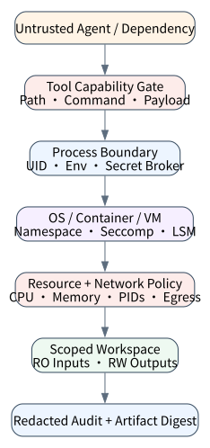
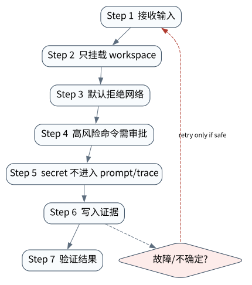

# Sandbox 与权限：控制 Agent 的爆炸半径

> **本章核心判断**：Sandbox 限制代码、文件、网络和系统调用；权限策略限制谁能请求什么动作。两者互补，不能互相替代。

上一章：Human-in-the-Loop：把不可逆动作放进可恢复审批。本章把前一章已经建立的能力进一步推进到 `Filesystem scope`；下一章将进入：Checkpoint、Journal 与可恢复执行。



## 问题背景与学习目标

Sandbox 限制代码、文件、网络和系统调用；权限策略限制谁能请求什么动作。两者互补，不能互相替代。

在本章的 `Filesystem scope` 场景中，真实 Agent 系统与普通“问答程序”的差异，在于一次任务会跨越模型、工具、状态、外部环境和人工治理边界。本章所有原理、代码与实验都围绕这些可验证问题展开。


**本章完成标准：**

- **机制理解**：能够解释“Sandbox 限制代码、文件、网络和系统调用；权限策略限制谁能请求什么动作。两者互补，不能互相替代。”，并指出它对应的确定性软件边界；
- **正确性判断**：能够针对 `workspace paths must be resolved and constrained before file I/O` 构造一个反例，说明证据不足时系统为什么不能继续乐观执行；
- **实验与迁移**：运行 `Lab 17A` / `Lab 17B`，分别说明 normal/fault 的 evidence level，并把同一机制映射到至少一个上游实现或协议。

## 核心概念与系统直觉

本节不把概念当作术语清单，而是回答三个工程问题：它**是什么**、在系统里**负责什么**、以及它失效时**会留下什么可观测证据**。

### Filesystem scope

**定义。** Filesystem scope 定义 Agent 能看到和修改哪些路径、挂载和文件类型。理想 sandbox 默认只给任务所需 workspace，而不是整个主机 home。

**系统责任。** 读写权限可分离，敏感目录只读或完全不挂载；生成 artifact 应通过显式出口复制。

**失败边界。** 路径遍历、symlink 和挂载逃逸都可能让看似局部的 file tool 访问宿主敏感数据。

### Network policy

**定义。** Network policy 控制 sandbox 可访问的域名、端口、协议和出站流量，并与任务需要的 external tools 对齐。

**系统责任。** 研究/安装任务可用 allowlist proxy；完全离线任务应禁网。所有出站连接最好可记录和归因。

**失败边界。** 无限网络访问会把 prompt injection 升级成数据外传、恶意下载或对第三方的未授权动作。

### Exec approval

**定义。** Exec approval 针对 shell、package install、privileged command 等高风险执行建立策略。低风险命令可自动，高风险命令需要规则或人工 gate。

**系统责任。** 审批应基于解析后的命令、工作目录、环境和权限，而不是仅看自然语言解释。

**失败边界。** 让 Agent 自己解释“这条命令安全”不是隔离。真正边界在 OS/container/VM capability。

### Secret boundary

**定义。** Secret boundary 决定 credential 是否、何时、以什么 scope 暴露给工具。推荐短期 token、brokered access 和按 action 注入，而不是把长期 secret 放进环境全局。

**系统责任。** 模型通常不需要看到 secret 值，只需要 Runtime 用 secret 代执行。secret access 应纳入 audit。

**失败边界。** 一旦 secret 进入模型 context、日志或 artifact，就很难保证撤销和不泄漏。

## 原理与理论基础

### 系统不变量

> **Invariant**：workspace paths must be resolved and constrained before file I/O

不变量与普通“最佳实践”不同：最佳实践可以因为场景变化而替换，不变量一旦被破坏，系统就失去本章希望保证的正确性。例如 `容器内 root 误认为安全` 并不是一个 UI 问题，而是说明某个状态已经无法从证据中唯一判断。


### 故障模型

本章优先把 “容器内 root 误认为安全”、“日志泄漏 token”、“allowlist 过宽导致任意命令” 作为可证伪故障，而不是泛化地枚举所有异常。对涉及外部 effect 的失败，判定顺序固定为“最后 durable state → effect 是否可能发生 → 现有 observation 是否足够决定下一步”；证据不足时停在 UNKNOWN/显式失败。

### Why / What if / Trade-off

本章真正的设计取舍不是“使用更强模型还是写更多规则”，而是确定 **Filesystem scope** 与 **Network policy** 分别应该由概率性决策还是确定性软件拥有。模型可以帮助识别候选路径，但它不会自动消除“容器内 root 误认为安全”这类系统失败；该失败必须由 runtime 的 schema、状态机、权限或 verifier 显式约束。

如果把 Filesystem scope 完全交给模型，系统会把不可验证的语言判断混入执行事实；如果把 Network policy 全部硬编码为固定 workflow，又会失去开放任务所需的适应性。更稳健的边界是：让模型负责提出候选决策，让软件负责 `只挂载 workspace`、`secret 不进入 prompt/trace` 以及对不变量 **workspace paths must be resolved and constrained before file I/O** 的检查。

**What if。** 一旦“日志泄漏 token”发生，系统首先需要判断现有证据是否足够决定下一状态；证据不足时应停在显式失败或待协调状态，而不是让模型用自然语言补全事实。这个边界决定了本章方案是否具有可恢复性，而不只是演示效果。


### 形式化模型与可证伪假设

$$
EffectiveCapability=Identity\cap Policy\cap Sandbox\cap TaskScope
$$

Sandbox 只是一层；真正的能力边界是身份、策略、隔离环境和任务范围的交集。

**可证伪假设。** 相同模型下，scoped credential + sandbox 比 prompt-only 限权显著降低越权 effect。

**建议测量。** capability-deny rate、credential scope、escape attempts、blast radius。

## 关键机制与执行流程



**Step 1 — 只挂载 workspace。** `只挂载 workspace` 是“Sandbox 与权限：控制 Agent 的爆炸半径”的一次显式状态转移。输入和输出都必须可序列化并关联 `run_id/step_id`；一旦该步骤失败，后继步骤只能依据已记录状态继续。关键观察点是 `Filesystem scope` 是否仍满足 **workspace paths must be resolved and constrained before file I/O**。

**Step 2 — 默认拒绝网络。** `默认拒绝网络` 是“Sandbox 与权限：控制 Agent 的爆炸半径”的一次显式状态转移。输入和输出都必须可序列化并关联 `run_id/step_id`；一旦该步骤失败，后继步骤只能依据已记录状态继续。关键观察点是 `Network policy` 是否仍满足 **workspace paths must be resolved and constrained before file I/O**。

**Step 3 — 高风险命令需审批。** 这一阶段可能改变系统或外部环境，因此 `高风险命令需审批` 不能只存在于模型文本中。runtime 在执行前绑定 `run_id/step_id` 与参数摘要，执行后记录结果或外部 observation；如果调用可能重复，必须同时定义幂等键或 reconciliation 依据。这里检查的核心是 **workspace paths must be resolved and constrained before file I/O**。

**Step 4 — secret 不进入 prompt/trace。** `secret 不进入 prompt/trace` 把短暂执行状态转换为后续能够读取的证据。写入内容至少要能关联本次 run、前一状态与下一状态；对 crash-sensitive 数据，应明确写入完成的判据。若进程在写入期间终止，恢复代码必须能够区分“没有记录”“完整记录”和“损坏/不确定记录”，而不能把半写状态视作成功。

在本章的 `Filesystem scope` 场景中，**最后一步 — 验证。** verifier 针对 `Secret boundary` 检查本章不变量 **workspace paths must be resolved and constrained before file I/O**。如果“容器内 root 误认为安全”使现有 artifact/外部状态不足以证明成功，结果必须停在显式失败或 UNKNOWN；只有 observation 能闭合状态转移时，流程才允许进入 FINISHED。

### 数据流与控制流

本章的数据/控制链按 **只挂载 workspace → 默认拒绝网络 → 高风险命令需审批 → secret 不进入 prompt/trace** 推进。调试时不要只看最终 answer，应确认每一阶段的输入来源、状态版本和 observation；对“容器内 root 误认为安全”尤其要检查动作前后的证据是否足以闭合不变量 **workspace paths must be resolved and constrained before file I/O**。


### 持久化点与崩溃窗口

本章需要持久化的内容取决于动作可逆性。与 `Filesystem scope` 有关的纯计算状态通常可以重算；一旦 `默认拒绝网络` 可能产生昂贵、外部或不可逆效果，就必须在动作前后建立可区分的证据边界。对于本章不变量 **workspace paths must be resolved and constrained before file I/O**，恢复时最重要的问题是：最后一个已知状态是什么、动作是否可能已经发生、现有 observation 能否唯一决定 retry/continue/compensate。


## 从原理到实现


### 完整实验入口

```python
from __future__ import annotations
import argparse
from agentlab.course_scenarios import run_scenario

def main() -> int:
 p=argparse.ArgumentParser(description='Sandbox 与权限：控制 Agent 的爆炸半径')
 p.add_argument("--fault", action="store_true", help="inject the chapter-specific failure path")
 args=p.parse_args()
 result=run_scenario('sandbox', fault=args.fault)
 print(result.as_json())
 return 0 if result.passed else 2

if __name__ == "__main__":
 raise SystemExit(main())
```

### 核心机制实现

```python
def sandbox(fault=False):
 root=Path(tempfile.mkdtemp(prefix='agentlab-sandbox-')).resolve(); target=(root/('ok.txt' if not fault else '../escape.txt')).resolve()
 allowed=(target==root or root in target.parents)
 if allowed: target.write_text('safe',encoding='utf-8')
 return _ok('sandbox',fault,{'root':str(root),'target':str(target),'allowed':allowed},'workspace paths must be resolved and constrained before file I/O',allowed if not fault else not allowed)
```


### 简化假设与不能省略的机制


## 主流系统实现对照与源码阅读入口

| 项目 | 本书锁定版本/状态 | 应阅读的机制 | 已核验源码/文档入口 | 官方来源 |
|---|---|---|---|---|
| OpenAI Codex CLI | `0.139.0 historical reproducibility pin` | 从 Rust CLI 的 sandbox/approval/config 入口分析“模型建议动作”和“本地执行权限”如何分离；不要推断公开源码之外的托管服务。 | `codex-rs/utils/cli/src/shared_options.rs`<br>`codex-rs/core/config.schema.json` | [官方来源](https://github.com/openai/codex) |
| OpenHands SDK architecture | `docs observed 2026-09-09` | Software Agent SDK / Agent Server / applications 分层。 | 以官方 docs/release/source tree 为准 | [官方来源](https://docs.openhands.dev/sdk/arch/overview) |
| Anthropic: Building Effective Agents | `official engineering article` | 从简单、可组合的 workflow/agent 模式开始。 | 以官方 docs/release/source tree 为准 | [官方来源](https://www.anthropic.com/engineering/building-effective-agents) |

### 源码阅读方法

源码阅读以 **OpenAI Codex CLI** 为第一参照，并只追与“Sandbox 与权限：控制 Agent 的爆炸半径”直接相关的公开执行链：入口 → durable/session state → 权限或协议边界 → verifier/trace。若上游没有公开某个服务端组件，本章不根据客户端现象反推其内部 scheduler、queue 或 policy engine。


### 工业实现为什么更复杂


对本章最值得关注的工程增量是：如何避免“容器内 root 误认为安全”、如何在“日志泄漏 token”后恢复，以及如何让 `secret 不进入 prompt/trace` 的结果能够进入 tracing/evaluation。只有这些机制都能落到公开类型、函数或协议消息上，才算真正完成源码对照。

## 设计方案与方法对比

| 方案 | 核心优势 | 主要局限 | 更适合的约束 |
|---|---|---|---|
| 最小自研 AgentLab | 机制透明、可断点、无网络即可故障注入 | 生态/模型能力有限 | 教学、研究原型、回归基线 |
| OpenAI Codex CLI | 贴近 coding/长期执行 harness，工作区和工具边界更真实 | 依赖更重或迭代快，升级需锁版本做回归 | Coding Agent、Harness 源码学习 |
| OpenHands SDK architecture | 贴近 coding/长期执行 harness，工作区和工具边界更真实 | 依赖更重或迭代快，升级需锁版本做回归 | Coding Agent、Harness 源码学习 |
| Anthropic: Building Effective Agents | 官方/主流实现提供成熟抽象与生态 | 抽象会隐藏部分底层机制，需要源码/trace 反推 | 生产集成与方案对照 |


## 可复现实验

本章两个 Core Lab 都直接执行仓库内的确定性代码；它们证明的是“Sandbox 与权限：控制 Agent 的爆炸半径”对应的本地机制与 fault oracle，而不是外部 provider 或真实云环境。第三方实现只在 `labs/upstream/` 按独立 L5 互操作证据记录，未实际执行时必须保持 `EXTERNAL_NOT_RUN_IN_THIS_RELEASE`。

### 实验环境

统一 Python/OS/离线复现约束、安装步骤与工具链版本集中维护在[附录 A](../appendix-a-environment.md)。本章只增加与“Sandbox 与权限：控制 Agent 的爆炸半径”直接相关的 normal/fault 双轨验证；若需要真实云、浏览器、GPU 或第三方 provider，则在对应 upstream lab 中单独标记 `NOT_RUN_EXTERNAL`，不把未运行结果计入核心实验。

### Lab 17A — 正常路径

```bash
PYTHONPATH=src python examples/chapters/ch17_sandbox.py
```

**关键断点：**
- `src/agentlab/course_scenarios.py::sandbox`
- `examples/chapters/ch17_sandbox.py::main`

**本发布包实际输出：**

```json
{"contained": false, "evidence_level": "L1_MECHANISM", "evidence_meaning": "normal_path_assertion_satisfied", "fault": false, "fault_injected": false, "invariant": "workspace paths must be resolved and constrained before file I/O", "invariant_holds": true, "observation": {"allowed": true, "root": "/tmp/agentlab-sandbox-1tfb3483", "target": "/tmp/agentlab-sandbox-1tfb3483/ok.txt"}, "oracle_detected": false, "passed": true, "recovered": false, "scenario": "sandbox", "system_detected": false}
```

PASS：退出码 0，`passed=true`、`fault=false`、`invariant_holds=true`；这只证明确定性 fixture 的正常机制断言。完整手册：[Lab 17A](../../../labs/core/lab-17A-sandbox.md)。

### Lab 17B — 故障注入

```bash
PYTHONPATH=src python examples/chapters/ch17_sandbox.py --fault
```

**本发布包实际输出：**

```json
{"contained": true, "evidence_level": "L3_CONTAINED", "evidence_meaning": "fault_detected_and_contained", "fault": true, "fault_injected": true, "invariant": "workspace paths must be resolved and constrained before file I/O", "invariant_holds": true, "observation": {"allowed": false, "root": "/tmp/agentlab-sandbox-523cmfww", "target": "/tmp/escape.txt"}, "oracle_detected": true, "passed": true, "recovered": false, "scenario": "sandbox", "system_detected": true}
```

PASS：退出码 0，`passed=true`、`fault=true`、`oracle_detected=true`。本章故障实验为 **L3_CONTAINED**：被测组件检测并 fail-closed/约束了故障，但不声明已恢复业务结果。 `passed=true` 本身只表示实验 oracle 得到预期观察。完整手册：[Lab 17B](../../../labs/core/lab-17B-sandbox-fault.md)。

### 观察与证据


## 工程场景与系统设计

本章沿用第 14 章长任务场景，重点限制 30 分钟任务在文件、网络和进程上的可达范围，防止审批前后的权限漂移。


### 上线前必须补齐

- 围绕 **Sandbox 与权限** 建立可审计状态字段与最小权限；
- 为本章相关动作记录 run_id、step_id、输入摘要与 observation；
- 对 `sandbox 要限制路径、进程、网络、secret 和能力，不只是运行在临时目录。` 这一边界建立自动化验收；
- 为本章主要故障窗口配置 trace、日志和恢复 runbook；
- 上线前把教学 fixture 替换为真实 provider/tool/workspace，并重新执行 normal/fault 两条路径。

## 故障模型、失败模式与排错

本章至少主动测试以下失败：

- **容器内 root 误认为安全**：先确认最后 durable state，再检查是否已经产生外部效果；不要先重试。
- **日志泄漏 token**：先确认最后 durable state，再检查是否已经产生外部效果；不要先重试。
- **allowlist 过宽导致任意命令**：先确认最后 durable state，再检查是否已经产生外部效果；不要先重试。


## 性能、可靠性与工程化

### 应采集指标

- `run p95 latency`
- `checkpoint fsync latency`
- `resume success rate`
- `cancellation tail latency`
- `approval wait time`
- `UNKNOWN reconciliation time`


### 优化顺序


任何优化都必须重新运行 Lab A/B。尤其当优化改变 `Network policy` 的生命周期时，要重新验证 **workspace paths must be resolved and constrained before file I/O**；否则平均延迟下降可能以更大的 stale state、重复副作用或取消失效为代价。

### 可靠性工程

本章可靠性 gate 直接针对 “容器内 root 误认为安全”、“日志泄漏 token”、“allowlist 过宽导致任意命令”：只有正常路径与对应 fault path 都保持 **workspace paths must be resolved and constrained before file I/O**，优化或功能扩展才可接受。是否达到 detection、containment 或 recovery 以实验的 `evidence_level` 字段为准。


## 技术边界与设计取舍
本章方案有明确边界：

- checkpoint 只能恢复已持久化状态，不能凭空知道外部副作用是否成功
- sandbox 限制本地执行边界，不自动限制所有网络/云权限
- HITL 提高安全性但增加延迟和运营成本
- 并发提升吞吐但放大竞态、预算和取消复杂度

选择方案时要回到本章边界：如果业务不能接受“容器内 root 误认为安全”，就必须为 `Filesystem scope` 增加更强的确定性约束；如果主要任务是开放式探索，则可以把更多 `Network policy` 决策交给模型，但要用 `secret 不进入 prompt/trace` 保持结果可验证。**OpenAI Codex CLI** 与 **OpenHands SDK architecture** 的差异也应放在这些约束下理解，而不是抽象成通用框架排名。

Sandbox 缩小爆炸半径，但并不等于完整授权系统。文件、网络、凭据、进程和宿主能力都可能形成逃逸路径；最小权限还需要与身份、审计、secret 生命周期和外部资源 policy 联动。

## 前沿研究与演进方向

当前研究和工业演进已经从“模型能否调用工具”推进到“怎样让长期、状态化、具有副作用的 Agent 可评估、可恢复、可治理”。与本章直接相关的资料：

- **[AgentDojo: A Dynamic Environment to Evaluate Prompt Injection Attacks and Defenses](https://arxiv.org/abs/2406.13352)**：以工具返回内容中的 prompt injection 测试 Agent 安全边界。
- **[Agent Security Bench](https://arxiv.org/abs/2410.02644)**：多场景、多工具、多攻击/防御类型的 Agent 安全评测。
- **[OpenAI Codex CLI](https://github.com/openai/codex)**（0.139.0 historical reproducibility pin）：开源 Rust coding agent；公开源码可分析 sandbox、approval 与 CLI execution boundary。
- **[OpenHands SDK architecture](https://docs.openhands.dev/sdk/arch/overview)**（docs observed 2026-09-09）：Software Agent SDK / Agent Server / applications 分层。


### 截至 2026-09-11 的研究更新

本节只记录会改变本章系统结论的研究或官方规范更新；实验仍使用仓库锁定版本，避免把“最新观察版本”与“可复现实验版本”混为一谈。
- NIST AI 800‑5: Security Considerations for AI Agents（published 2026‑05‑18）：agent security threats, mitigations, assessment and adoption barriers。
- Anthropic: An alignment assessment of recent cybersecurity incidents（2026‑09‑09）：real third‑party unauthorized‑access incidents and agent monitoring。

**本章吸收的变化。** Sandbox 把模型错误的影响限制在 execution boundary 内；文件、网络、进程和 secret 都应最小化，而不是只限制 shell 命令。这些研究/规范的价值不在于替换本章原理，而在于把上述假设放进更真实、更长时或更高风险的环境中检验。

### Research Gap

围绕 `Filesystem scope`，当前缺口不是“再增加一个 Agent API”，而是怎样把 **workspace paths must be resolved and constrained before file I/O** 从局部实现经验升级为跨模型、跨 runtime 可验证的系统属性。现有工业实现已经能够提供 tool loop、session、graph、plugin 或 workspace 等抽象，但在“容器内 root 误认为安全”和“日志泄漏 token”同时出现时，证据格式、恢复语义和评测方法仍缺少统一答案。

本章的研究更新不追求论文数量，而关注一个问题：现有工作是否真正推进了 **Sandbox 与权限** 的可验证性。Agent 安全研究和 Codex/OpenHands 类 coding harness 都把 workspace isolation 作为基础边界。 因此，本章会把论文结论放回不变量、失败窗口和实验断言中，而不是把研究当作参考文献列表。

### Open Problems

1. 如何把 `Filesystem scope` 的正确性拆成可组合的局部不变量，并在不同 Agent runtime 中复用 verifier？
2. 当“容器内 root 误认为安全”与“日志泄漏 token”同时发生时，**OpenAI Codex CLI** 与 **OpenHands SDK architecture** 的公开抽象分别能保存哪些证据，哪些状态仍需要外部 reconciliation？
3. 如果模型能力显著提高，围绕 `Network policy` 的哪些 harness 机制仍属于系统必要条件，哪些只是当前模型能力下的临时补丁？
4. 如何构造一个既保护真实业务数据、又能复现“allowlist 过宽导致任意命令”的公开 benchmark，使研究结果可以被第三方验证？


### 深度审计与研究证据链：Sandbox 与权限

本章重新审计后的核心结论是：**sandbox 要限制路径、进程、网络、secret 和能力，不只是运行在临时目录。** 这句话只有在代码、实验、开源源码和研究证据四个层面同时成立时才有教学价值。仅靠定义或 API 示例无法证明它，因为 Agent Systems 的风险通常发生在模型决策与外部环境之间的缝隙里。

**与本章最相关的近期/基础研究与官方资料：**

- **[Semantic Transactions for Tool-Using LLM Agents](https://arxiv.org/abs/2606.17573)**：把不可逆工具副作用抽象成语义事务，支撑 UNKNOWN、staging 与 validation 讨论。
- **[OpenAI Agents SDK](https://github.com/openai/openai-agents-python)**：提供 Agent/Runner/Tools/HITL/Tracing/Sessions 的公开实现边界。
- **[Microsoft Agent Framework Checkpoints](https://learn.microsoft.com/en-us/agent-framework/workflows/checkpoints)**：把 checkpoint 定义为 workflow resume 所需的 executor state、pending messages/requests 与 shared state。

这些资料与本章的关系不是“引用背书”，而是帮助读者识别设计边界。Codex CLI、OpenHands workspace、Docker/Firecracker/OS sandbox 可以比较隔离强度。 读者阅读源码时应主动寻找四个对象：输入如何进入系统、状态在哪里持久化、动作由谁执行、失败后谁负责恢复。

**实验语义边界。** 本章实验验证 Sandbox 与权限在 normal/fault 两条路径下是否进入可解释状态；证据等级定义与解释规则统一见附录 A，且 `passed=true` 不得跨级推导 containment/recovery。


## 本章总结与进阶实践

### 核心结论

1. 本章不变量是：**workspace paths must be resolved and constrained before file I/O**；
2. `Filesystem scope` 必须是可观察软件边界，而不是 prompt 约定；
3. `只挂载 workspace` 与 `secret 不进入 prompt/trace` 之间必须有状态和证据连接；
4. 模型提出动作不等于系统已经执行，更不等于任务成功；
5. 正常路径只能证明功能，故障路径才能暴露恢复语义；
6. 开源实现的核心价值在于理解真实约束，不是复制 API；
7. 性能优化必须与可靠性/安全不变量一起重新验证；
8. 技术边界和未解决问题是高级系统设计的一部分。

### 常见误区

- 容器内 root 误认为安全
- 日志泄漏 token
- allowlist 过宽导致任意命令

### 思考题与实践

- **Why：** 为什么 `Filesystem scope` 不能只靠模型“记住”？
- **What if：** 如果在 `只挂载 workspace` 与 `secret 不进入 prompt/trace` 之间 crash，当前证据足够恢复吗？
- **Programming：** 修改 `examples/chapters/ch17_sandbox.py` 或对应 scenario，让系统新增一种错误类型，但仍保持 invariant。
- **Engineering：** 把 Lab B 的故障改成 timeout/duplicate/crash 中另一种，写出状态机和恢复步骤。
- **Research：** 选择本章一个 Open Problem，阅读两篇相互不同的方法，给出你自己的实验设计和 falsifiable hypothesis。

下一章进入 **Checkpoint、Journal 与可恢复执行**，它将复用本章已经建立的状态/证据边界，而不是重新从 API 使用开始。
