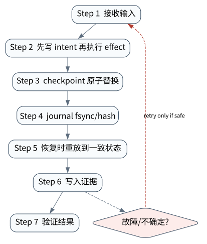

# Checkpoint、Journal 与 Durable Execution

> **本章命题**：Checkpoint 保存“现在可从哪里继续”，Journal 保存“已经观察到哪些转移与效果”。前者不是后者的替代品；二者都不能凭空证明远端副作用 exactly-once。


## 问题背景与学习目标

长任务会遇到进程崩溃、部署升级、人工等待和下游超时。只把对话存数据库，无法回答最后一步是否已经提交；只记工具日志，恢复又要重算全部模型状态。更危险的是两个 worker 同时从旧 checkpoint 恢复，较晚写入者覆盖较新状态，形成“时间倒流”。

本章使读者能区分 snapshot、event log、effect journal 与 outbox；理解 atomic replace、`fsync`、hash chain 与 optimistic concurrency；枚举 effect 前后崩溃窗口；设计 replay-safe step；判定 durable execution 的证据等级。

## 核心概念与系统直觉

- **Checkpoint**：某一逻辑时刻的可恢复状态快照，适合快速 resume；
- **Event log**：按序记录状态转移，可重放、审计和派生新视图；
- **Effect journal**：围绕外部动作记录 intent、dispatch、receipt、UNKNOWN 与 reconciliation；
- **Outbox/inbox**：用本地事务与异步投递连接数据库状态和消息系统；
- **CAS**：只有读到的 expected version 仍为当前版本时才能写下一版。

最小恢复问题不是“读取最后一个 JSON”，而是：最后 durable state 是什么；下一步是否 deterministic/replay-safe；外部 effect 是否可能发生；代码/policy/schema 版本是否仍兼容。

## 原理与理论基础

若当前版本为 $v$，writer 携带期望版本 $e$，保存操作满足：

$$
save(e,s')=\begin{cases}(v+1,s'),&e=v\\Conflict,&e\neq v\end{cases}
$$

这阻止 stale writer 覆盖新状态，但不解决远端 effect。对一次外部写，崩溃可能发生在 `intent durable`、`request dispatched`、`remote committed`、`receipt durable` 之间。客户端通常无法区分“未发送”和“已提交但响应丢失”，因此必须用 idempotency key、状态查询或 reconciliation。

Journal hash chain 可检测篡改/截断边界：$h_i=H(h_{i-1}\Vert canonical(e_i))$。它提供 tamper evidence，不提供真实性；攻击者若可重写全链和信任锚仍能伪造。核心不变量是：**checkpoint version 单调原子推进，陈旧 writer 不得覆盖新状态，损坏证据必须显式失败。**

> **Invariant**: checkpoint versions advance atomically and monotonically; stale writers and corrupted evidence fail visibly.

## 关键机制与执行流程



1. 读取 checkpoint 及 version，验证 schema/code/policy compatibility；
2. 对纯计算 step 记录输入摘要，输出可重算或持久化；
3. 外部动作先写 intent/action ID/idempotency key；
4. dispatch 后记录可观察状态，成功 receipt 写 journal；
5. checkpoint 通过 temp file → file fsync → atomic replace → parent fsync 提交；
6. 多 writer 使用 CAS/lease/fencing token；
7. 恢复时验证 checkpoint 与 journal chain，重放确定性步骤；
8. effect 证据不足时进入 UNKNOWN，并由权威查询对账后继续。

## 从原理到实现

本书 `JsonCheckpointStore` 的调用方通过 expected version 阻止 lost update：

```python
v1 = store.save("run-18", {"step": 1}, expected_version=0)
v2 = store.save("run-18", {"step": 2}, expected_version=v1)

try:
    store.save("run-18", {"step": 99}, expected_version=v1)
except CheckpointConflictError:
    pass  # stale writer fail-closed
```

effect journal 每次 append 前验证已有 chain；记录把业务字段与前一 hash 绑定：

```python
intent = journal.append({"action_id": "a-18", "phase": "INTENT"})
receipt = journal.append({
    "action_id": "a-18",
    "phase": "OBSERVED",
    "receipt": "local-fixture",
})
assert journal.verify()
assert intent["hash"] != receipt["hash"]
```

文件原子替换只承诺本机文件系统合同；网络文件系统、磁盘控制器和数据库需要各自的 durability 文档与故障测试。

## 主流系统实现对照与源码阅读入口

| 系统 | Durable primitive | 需审计的边界 |
|---|---|---|
| [LangGraph](https://github.com/langchain-ai/langgraph) | thread/checkpoint、state snapshot、pending writes、interrupt/resume | superstep、成功节点是否重算、serializer/store 与节点副作用 |
| [OpenAI Agents SDK](https://github.com/openai/openai-agents-python) | `RunState`、sessions、HITL；公开 durable orchestrator integrations | SDK state 与外部 workflow 的责任边界、tool effect |
| [Google ADK](https://github.com/google/adk-python) | session/event service、workflow agents | session persistence 不等于 effect recovery |
| [Microsoft Agent Framework](https://github.com/microsoft/agent-framework) | workflow checkpoint/resume | executor/shared state 与 pending requests，版本兼容 |

本仓库已有锁定 LangGraph SQLite checkpointer 的崩溃/重启 L5 证据；它证明指定版本、指定图和指定 fixture 的 resume 行为，不证明任意 node 的外部副作用 exactly-once。

## 设计方案与方法对比

| 设计 | 优点 | 缺点 | 选择依据 |
|---|---|---|---|
| Snapshot only | 恢复快 | 历史/效果证据弱 | 短纯计算任务 |
| Event sourcing | 审计/重建强 | schema 演进、重放成本 | 强审计控制面 |
| Snapshot + log | 平衡恢复与审计 | 一致性协议更复杂 | 通用 durable runtime |
| Workflow engine | timer/retry/HITL 成熟 | 框架语义与运维成本 | 长任务、跨服务 |
| DB transaction + outbox | 本地状态/消息原子 | 外部 API 仍需对账 | 业务事件发布 |

## 可复现实验

### Lab 18A：单调 Checkpoint 与 Hash Chain

正常路径真实写两版 checkpoint 和两条 hash-chain journal：

```bash
PYTHONPATH=src uv run python examples/chapters/ch18_checkpoint_journal.py
```

实际输出为 `versions=[1,2]`、`loaded_version=2`、`loaded_step=2`、`journal_records=2`、`journal_valid=true`，等级 `L1_MECHANISM`。

### Lab 18B：Stale Writer 冲突

```bash
PYTHONPATH=src uv run python examples/chapters/ch18_checkpoint_journal.py --fault
```

故障路径让 stale writer 带 version 1 覆盖 version 2；实际输出 `stale_write_error=CheckpointConflictError`，持久状态仍为 step 2/version 2，等级 `L3_CONTAINED`。见 [Lab 18A](../../../labs/core/lab-18A-checkpoint-journal.md) 与 [Lab 18B](../../../labs/core/lab-18B-checkpoint-journal-fault.md)。

**关键断点**：load version、CAS 比较、temp/fsync/replace、journal previous hash 和最终 reload。**验收标准**：版本单调、链有效、陈旧写失败且新状态不变。实验没有远端 effect，不能据此声称 exactly-once。

## 工程场景与系统设计

对“创建云资源”任务，checkpoint 保存 plan、已完成步骤和下一节点；effect journal 保存 `CreateInstance` 的 canonical args、idempotency key、发送状态和 provider resource ID。崩溃恢复先按 provider ID/key 查询，而不是再次创建。若查询也不可用，运行保持 UNKNOWN 并告警，而不是选择一个方便的事实。

部署升级需要 state migration：checkpoint 绑定 workflow/code/schema/tool/policy digest。新版本要么提供显式迁移，要么由旧 worker 完成；不能让新代码默默解释旧状态。

## 故障模型、失败模式与排错

- 半写 checkpoint：checksum/schema 检查并 fail visibly；
- stale writer：CAS、lease 与 fencing token；
- checkpoint 成功但 journal 丢失：定义同一事务/顺序与恢复策略；
- journal 尾部截断：sequence/hash/length 检查；
- effect 成功但 receipt 未持久化：UNKNOWN + authoritative reconciliation；
- replay 重复副作用：幂等键、query-before-retry；
- 代码升级不兼容：版本 pin、migration 与 canary resume；
- 非确定性重放：记录时间、随机、模型响应和外部 observation，或把其变成持久 task result。

## 性能、可靠性与工程化

指标包括 checkpoint write/fsync p95、大小、频率、replay length、resume latency、CAS conflict、journal verify failure、UNKNOWN age、reconciliation success 和 RPO/RTO。checkpoint 太频繁放大 I/O，太稀疏放大重算和重复效果窗口；应在 step 风险和恢复成本之间选 durable point。

压缩/compaction 必须先生成新 snapshot、验证覆盖范围并保留审计锚点，再删除旧 log。备份恢复测试要真正从备份启动，而不是只确认对象存在。

## 技术边界与设计取舍

本章 Core 使用本机临时文件和进程锁，没有模拟掉电、网络文件系统、多主数据库或跨容器 kill。L5 LangGraph 证据覆盖锁定 SQLite checkpointer 的指定 restart vector；OpenAI/ADK/MAF 仅按各自独立上游合同声明。所有 claim 都不跨越已运行环境。

模型 provider 与持久化解耦：OpenAI response ID 或本地模型输出可作为 event 字段，但不是 checkpoint identity。API key 永不进入 snapshot/journal；凭据以 secret reference/lease 表示。

## 前沿研究与演进方向

前沿问题包括跨 agent 的 causal checkpoint、一致快照、可验证 replay、事件溯源与隐私删除的冲突、模型/工具升级后的 semantic migration，以及把 workflow history 转化为训练数据时如何保留 consent 与 provenance。Durable execution 正逐渐从框架功能上升为跨 provider 的公共系统层。

### 深度审计与研究证据链

Core 证据实际覆盖文件原子更新、CAS 冲突和 journal chain；锁定 LangGraph L5 证据覆盖指定 SQLite checkpointer 的进程重启。二者均不证明外部 effect exactly-once，相关结论必须继续依赖 idempotency、receipt 与 reconciliation 证据。

## 本章总结与进阶实践

Checkpoint 回答“从哪里继续”，Journal 回答“发生过什么”。CAS 保护状态单调推进，hash chain 暴露证据损坏，effect journal 处理最危险的外部不确定窗口。三者职责不能混淆。

进阶问题：

1. atomic rename 为什么仍可能需要 parent-directory fsync？
2. CAS 能防止哪些错误，不能防止哪些外部 effect？
3. 如何定义一次恢复与无崩溃执行的观察等价？
4. event log compaction 怎样保留审计与删除要求？
5. 模型调用在 replay 中应重算、缓存还是作为持久结果？

参考答案见[附录 I：第三篇问题参考答案](../appendix-i-part3-solutions.html#part3-solutions-ch18)。
