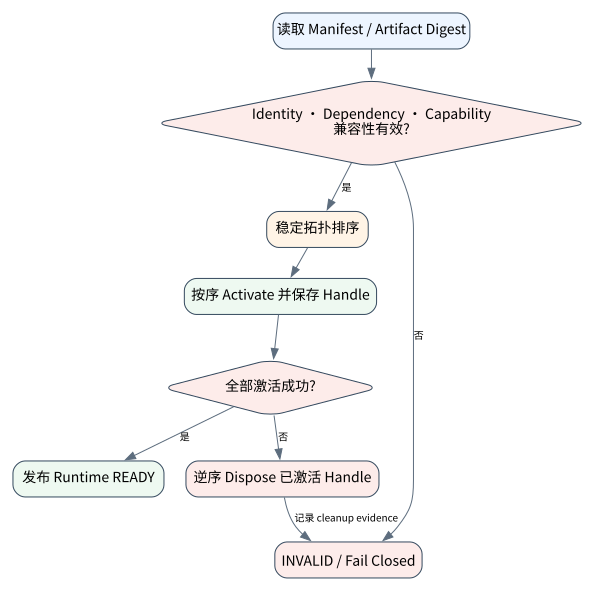

# Harness 与插件运行时：模型之外的系统能力如何组合

> **本章核心判断**：Harness 决定模型如何获得工具、会话、工作区、沙箱、UI、存储与调度能力。通过插件、服务依赖和生命周期管理，可以把长期 Agent 从单体 while 循环演进成可组合运行系统。

上一章：Checkpoint、Journal 与可恢复执行。本章把前一章已经建立的能力进一步推进到 `Plugin context`；下一章将进入：Coding Agent 最小实现：读、改、测、验证。


## 问题背景与学习目标

Harness 决定模型如何获得工具、会话、工作区、沙箱、UI、存储与调度能力。通过插件、服务依赖和生命周期管理，可以把长期 Agent 从单体 while 循环演进成可组合运行系统。

在本章的 `Plugin context` 场景中，真实 Agent 系统与普通“问答程序”的差异，在于一次任务会跨越模型、工具、状态、外部环境和人工治理边界。本章所有原理、代码与实验都围绕这些可验证问题展开。


**本章完成标准：**

- **机制理解**：能够解释“Harness 决定模型如何获得工具、会话、工作区、沙箱、UI、存储与调度能力。通过插件、服务依赖和生命周期管理，可以把长期 Agent 从单体 while 循环演进成可组合运行系统。”，并指出它对应的确定性软件边界；
- **正确性判断**：能够针对 `plugin activation must follow dependency/lifecycle boundaries instead of hidden global state` 构造一个反例，说明证据不足时系统为什么不能继续乐观执行；
- **实验与迁移**：运行 `Lab 19A` / `Lab 19B`，分别说明 normal/fault 的 evidence level，并把同一机制映射到至少一个上游实现或协议。

## 核心概念与系统直觉

本节不把概念当作术语清单，而是回答三个工程问题：它**是什么**、在系统里**负责什么**、以及它失效时**会留下什么可观测证据**。

### Plugin context

**定义。** Plugin context 是插件可读取的运行时能力集合，如 logger、state store、tool registry、 workspace 和 policy handle，应显式注入而非依赖全局变量。

**系统责任。** 最小 context 能限制插件耦合和权限，同时让测试使用 fake service。插件获得的能力应按需授予。

**失败边界。** 把整个 application object 传给插件会形成隐式超级权限，难以隔离和版本升级。

### Service dependency

**定义。** Service dependency 是 harness 中具有生命周期与契约的基础能力，例如 model provider、sandbox、memory、tracing、queue。

**系统责任。** 依赖应通过 interface/DI 管理，并明确启动顺序、health、timeout 和 failure isolation。

**失败边界。** 插件自己创建 provider client/DB connection 会绕过统一配置、重试、观测和 secret 管理。

### Lifecycle/Fiber

**定义。** Lifecycle/Fiber 表示长时 Agent 内部可并发运行的任务单元及其启动、取消、等待和清理规则。

**系统责任。** 结构化并发要求子任务属于父 run，父任务退出时不能留下无人管理的 fiber；长期 worker 则由独立 service 管理。

**失败边界。** unstructured background task 是常见资源泄漏来源，也让 cancellation 和错误传播不可预测。

### Harness vs model

**定义。** Harness vs model 的核心是责任分配：模型提供通用推理能力，harness 提供任务环境、 工具、状态、策略和验证。

**系统责任。** 模型升级可减少部分 prompt/scaffold，但不会消除权限、审计、durability 和 effect recovery。

**失败边界。** 把某次模型能力提升误解成“可以删除 Runtime”会让系统重新依赖不可验证的隐式行为。

## 原理与理论基础

### 系统不变量

> **Invariant**：plugin activation must follow dependency/lifecycle boundaries instead of hidden global state

不变量与普通“最佳实践”不同：最佳实践可以因为场景变化而替换，不变量一旦被破坏，系统就失去本章希望保证的正确性。例如 `插件隐式依赖全局单例` 并不是一个 UI 问题，而是说明某个状态已经无法从证据中唯一判断。


### 故障模型

本章优先把 “插件隐式依赖全局单例”、“热重载后资源泄漏”、“把 UI 状态当运行时事实” 作为可证伪故障，而不是泛化地枚举所有异常。对涉及外部 effect 的失败，判定顺序固定为“最后 durable state → effect 是否可能发生 → 现有 observation 是否足够决定下一步”；证据不足时停在 UNKNOWN/显式失败。

### Why / What if / Trade-off

本章真正的设计取舍不是“使用更强模型还是写更多规则”，而是确定 **Plugin context** 与 **Service dependency** 分别应该由概率性决策还是确定性软件拥有。模型可以帮助识别候选路径，但它不会自动消除“插件隐式依赖全局单例”这类系统失败；该失败必须由 runtime 的 schema、状态机、权限或 verifier 显式约束。

如果把 Plugin context 完全交给模型，系统会把不可验证的语言判断混入执行事实；如果把 Service dependency 全部硬编码为固定 workflow，又会失去开放任务所需的适应性。更稳健的边界是：让模型负责提出候选决策，让软件负责 `注册服务`、`观察会话与工具边界` 以及对不变量 **plugin activation must follow dependency/lifecycle boundaries instead of hidden global state** 的检查。

**What if。** 一旦“热重载后资源泄漏”发生，系统首先需要判断现有证据是否足够决定下一状态；证据不足时应停在显式失败或待协调状态，而不是让模型用自然语言补全事实。这个边界决定了本章方案是否具有可恢复性，而不只是演示效果。


### 形式化模型与可证伪假设

$$
Harness=Compose(Model,Context,Tools,State,Policy,Workspace,Verifier,Telemetry)
$$

Harness 是模型外的系统组合层；它决定 workspace、权限、状态、验证和遥测如何与模型协作。

**可证伪假设。** 稳定 harness contract 能在替换模型时保持恢复/安全/观测语义不变。

**建议测量。** model-swap regression、contract violations、resume rate、tool-policy consistency。

## 关键机制与执行流程



**Step 1 — 注册服务。** `注册服务` 是“Harness 与插件运行时：模型之外的系统能力如何组合”的一次显式状态转移。输入和输出都必须可序列化并关联 `run_id/step_id`；一旦该步骤失败，后继步骤只能依据已记录状态继续。关键观察点是 `Plugin context` 是否仍满足 **plugin activation must follow dependency/lifecycle boundaries instead of hidden global state**。

**Step 2 — 解析插件依赖。** `解析插件依赖` 负责形成后续决策的输入。需要同时保存来源、版本/时间与必要的关联标识，避免把“当前看到的数据”误当成永远有效的事实。进入下一阶段前，对结构、权限和来源做最小验证，使 `Service dependency` 的状态能够在 trace 中被复现。

**Step 3 — 激活/销毁生命周期。** `激活/销毁生命周期` 是“Harness 与插件运行时：模型之外的系统能力如何组合”的一次显式状态转移。输入和输出都必须可序列化并关联 `run_id/step_id`；一旦该步骤失败，后继步骤只能依据已记录状态继续。关键观察点是 `Lifecycle/Fiber` 是否仍满足 **plugin activation must follow dependency/lifecycle boundaries instead of hidden global state**。

**Step 4 — 观察会话与工具边界。** `观察会话与工具边界` 负责形成后续决策的输入。需要同时保存来源、版本/时间与必要的关联标识，避免把“当前看到的数据”误当成永远有效的事实。进入下一阶段前，对结构、权限和来源做最小验证，使 `Harness vs model` 的状态能够在 trace 中被复现。

在本章的 `Plugin context` 场景中，**最后一步 — 验证。** verifier 针对 `Harness vs model` 检查本章不变量 **plugin activation must follow dependency/lifecycle boundaries instead of hidden global state**。如果“插件隐式依赖全局单例”使现有 artifact/外部状态不足以证明成功，结果必须停在显式失败或 UNKNOWN；只有 observation 能闭合状态转移时，流程才允许进入 FINISHED。

### 数据流与控制流

本章的数据/控制链按 **注册服务 → 解析插件依赖 → 激活/销毁生命周期 → 观察会话与工具边界** 推进。调试时不要只看最终 answer，应确认每一阶段的输入来源、状态版本和 observation；对“插件隐式依赖全局单例”尤其要检查动作前后的证据是否足以闭合不变量 **plugin activation must follow dependency/lifecycle boundaries instead of hidden global state**。


### 持久化点与崩溃窗口

本章需要持久化的内容取决于动作可逆性。与 `Plugin context` 有关的纯计算状态通常可以重算；一旦 `解析插件依赖` 可能产生昂贵、外部或不可逆效果，就必须在动作前后建立可区分的证据边界。对于本章不变量 **plugin activation must follow dependency/lifecycle boundaries instead of hidden global state**，恢复时最重要的问题是：最后一个已知状态是什么、动作是否可能已经发生、现有 observation 能否唯一决定 retry/continue/compensate。


## 从原理到实现


### 完整实验入口

```python
from __future__ import annotations
import argparse
from agentlab.course_scenarios import run_scenario

def main() -> int:
 p=argparse.ArgumentParser(description='Harness 与插件运行时：模型之外的系统能力如何组合')
 p.add_argument("--fault", action="store_true", help="inject the chapter-specific failure path")
 args=p.parse_args()
 result=run_scenario('harness', fault=args.fault)
 print(result.as_json())
 return 0 if result.passed else 2

if __name__ == "__main__":
 raise SystemExit(main())
```

### 核心机制实现

```python
def harness(fault=False):
 services={}; disposed=[]
 def install(name,deps,fn):
 missing=[d for d in deps if d not in services]
 if missing:return {'installed':False,'missing':missing}
 services[name]=fn; return {'installed':True,'missing':[]}
 services['tools']=object(); a=install('loop',['tools'],object()); b=install('ui',['missing'] if fault else ['loop'],object())
 if fault: disposed.append('ui')
 return _ok('harness',fault,{'services':sorted(services),'loop':a,'ui':b,'disposed':disposed},'plugin activation must follow dependency/lifecycle boundaries instead of hidden global state',b['installed'] if not fault else not b['installed'])
```


### 简化假设与不能省略的机制


## 主流系统实现对照与源码阅读入口

| 项目 | 本书锁定版本/状态 | 应阅读的机制 | 已核验源码/文档入口 | 官方来源 |
|---|---|---|---|---|
| DeepSeek Harness | `@deepseek-ai/dsh 0.1.2-rc.1 reproducibility pin` | 先读 docs/architecture.md，再看 service/dependency/lifecycle；关注 Cordis context、service 注入与 plugin 可逆 effect，而不是只看 UI。 | `docs/architecture.md`<br>`docs/user/develop/framework/service.md` | [官方来源](https://github.com/deepseek-ai/deepseek-harness) |
| Pi Coding Agent | `@earendil-works/pi-coding-agent 0.85.1` | 把 session tree、branching、compaction、extensions/skills 看成极简 coding harness 的核心；同时注意 2026 年包名迁移到 @earendil-works。 | 以官方 docs/release/source tree 为准 | [官方来源](https://github.com/earendil-works/pi) |
| OpenAI Codex CLI | `0.139.0 historical reproducibility pin` | 从 Rust CLI 的 sandbox/approval/config 入口分析“模型建议动作”和“本地执行权限”如何分离；不要推断公开源码之外的托管服务。 | `codex-rs/utils/cli/src/shared_options.rs`<br>`codex-rs/core/config.schema.json` | [官方来源](https://github.com/openai/codex) |
| OpenHands Software Agent SDK | `v1.24.0 @ fdc2bdf` | 围绕 Conversation、Agent、Tool、Workspace、Event 与 Agent Server 阅读，理解远程 workspace、interrupt、metrics/resume 的服务边界。 | 以官方 docs/release/source tree 为准 | [官方来源](https://github.com/OpenHands/software-agent-sdk) |

### 源码阅读方法

源码阅读以 **DeepSeek Harness** 为第一参照，并只追与“Harness 与插件运行时：模型之外的系统能力如何组合”直接相关的公开执行链：入口 → durable/session state → 权限或协议边界 → verifier/trace。若上游没有公开某个服务端组件，本章不根据客户端现象反推其内部 scheduler、queue 或 policy engine。


### 工业实现为什么更复杂


对本章最值得关注的工程增量是：如何避免“插件隐式依赖全局单例”、如何在“热重载后资源泄漏”后恢复，以及如何让 `观察会话与工具边界` 的结果能够进入 tracing/evaluation。只有这些机制都能落到公开类型、函数或协议消息上，才算真正完成源码对照。

## 设计方案与方法对比

| 方案 | 核心优势 | 主要局限 | 更适合的约束 |
|---|---|---|---|
| 最小自研 AgentLab | 机制透明、可断点、无网络即可故障注入 | 生态/模型能力有限 | 教学、研究原型、回归基线 |
| DeepSeek Harness | 贴近 coding/长期执行 harness，工作区和工具边界更真实 | 依赖更重或迭代快，升级需锁版本做回归 | Coding Agent、Harness 源码学习 |
| Pi Coding Agent | 贴近 coding/长期执行 harness，工作区和工具边界更真实 | 依赖更重或迭代快，升级需锁版本做回归 | Coding Agent、Harness 源码学习 |
| OpenAI Codex CLI | 贴近 coding/长期执行 harness，工作区和工具边界更真实 | 依赖更重或迭代快，升级需锁版本做回归 | Coding Agent、Harness 源码学习 |


## 可复现实验

本章两个 Core Lab 都直接执行仓库内的确定性代码；它们证明的是“Harness 与插件运行时：模型之外的系统能力如何组合”对应的本地机制与 fault oracle，而不是外部 provider 或真实云环境。第三方实现只在 `labs/upstream/` 按独立 L5 互操作证据记录，未实际执行时必须保持 `EXTERNAL_NOT_RUN_IN_THIS_RELEASE`。

### 实验环境

统一 Python/OS/离线复现约束、安装步骤与工具链版本集中维护在[附录 A](../appendix-a-environment.md)。本章只增加与“Harness 与插件运行时：模型之外的系统能力如何组合”直接相关的 normal/fault 双轨验证；若需要真实云、浏览器、GPU 或第三方 provider，则在对应 upstream lab 中单独标记 `NOT_RUN_EXTERNAL`，不把未运行结果计入核心实验。

### Lab 19A — 正常路径

```bash
PYTHONPATH=src python examples/chapters/ch19_harness.py
```

**关键断点：**
- `src/agentlab/course_scenarios.py::harness`
- `examples/chapters/ch19_harness.py::main`

**本发布包实际输出：**

```json
{"contained": false, "evidence_level": "L1_MECHANISM", "evidence_meaning": "normal_path_assertion_satisfied", "fault": false, "fault_injected": false, "invariant": "plugin activation must follow dependency/lifecycle boundaries instead of hidden global state", "invariant_holds": true, "observation": {"disposed": [], "loop": {"installed": true, "missing": []}, "services": ["loop", "tools", "ui"], "ui": {"installed": true, "missing": []}}, "oracle_detected": false, "passed": true, "recovered": false, "scenario": "harness", "system_detected": false}
```

PASS：退出码 0，`passed=true`、`fault=false`、`invariant_holds=true`；这只证明确定性 fixture 的正常机制断言。完整手册：[Lab 19A](../../../labs/core/lab-19A-harness.md)。

### Lab 19B — 故障注入

```bash
PYTHONPATH=src python examples/chapters/ch19_harness.py --fault
```

**本发布包实际输出：**

```json
{"contained": true, "evidence_level": "L3_CONTAINED", "evidence_meaning": "fault_detected_and_contained", "fault": true, "fault_injected": true, "invariant": "plugin activation must follow dependency/lifecycle boundaries instead of hidden global state", "invariant_holds": true, "observation": {"disposed": ["ui"], "loop": {"installed": true, "missing": []}, "services": ["loop", "tools"], "ui": {"installed": false, "missing": ["missing"]}}, "oracle_detected": true, "passed": true, "recovered": false, "scenario": "harness", "system_detected": true}
```

PASS：退出码 0，`passed=true`、`fault=true`、`oracle_detected=true`。本章故障实验为 **L3_CONTAINED**：被测组件检测并 fail-closed/约束了故障，但不声明已恢复业务结果。 `passed=true` 本身只表示实验 oracle 得到预期观察。完整手册：[Lab 19B](../../../labs/core/lab-19B-harness-fault.md)。

### 观察与证据


## 工程场景与系统设计

本章沿用第 14 章长任务场景，重点比较 Harness 如何组合 checkpoint、审批、sandbox 与插件生命周期；resume 目标仍需真实部署压测后才能转为 SLO。


### 上线前必须补齐

- 围绕 **Harness 与插件运行时** 建立可审计状态字段与最小权限；
- 为本章相关动作记录 run_id、step_id、输入摘要与 observation；
- 对 `Harness 负责把模型之外的工具、状态、UI、沙箱、插件生命周期组合起来。` 这一边界建立自动化验收；
- 为本章主要故障窗口配置 trace、日志和恢复 runbook；
- 上线前把教学 fixture 替换为真实 provider/tool/workspace，并重新执行 normal/fault 两条路径。

## 故障模型、失败模式与排错

本章至少主动测试以下失败：

- **插件隐式依赖全局单例**：先确认最后 durable state，再检查是否已经产生外部效果；不要先重试。
- **热重载后资源泄漏**：先确认最后 durable state，再检查是否已经产生外部效果；不要先重试。
- **把 UI 状态当运行时事实**：先确认最后 durable state，再检查是否已经产生外部效果；不要先重试。


## 性能、可靠性与工程化

### 应采集指标

- `run p95 latency`
- `checkpoint fsync latency`
- `resume success rate`
- `cancellation tail latency`
- `approval wait time`
- `UNKNOWN reconciliation time`


### 优化顺序


任何优化都必须重新运行 Lab A/B。尤其当优化改变 `Service dependency` 的生命周期时，要重新验证 **plugin activation must follow dependency/lifecycle boundaries instead of hidden global state**；否则平均延迟下降可能以更大的 stale state、重复副作用或取消失效为代价。

### 可靠性工程

本章可靠性 gate 直接针对 “插件隐式依赖全局单例”、“热重载后资源泄漏”、“把 UI 状态当运行时事实”：只有正常路径与对应 fault path 都保持 **plugin activation must follow dependency/lifecycle boundaries instead of hidden global state**，优化或功能扩展才可接受。是否达到 detection、containment 或 recovery 以实验的 `evidence_level` 字段为准。


## 技术边界与设计取舍
本章方案有明确边界：

- checkpoint 只能恢复已持久化状态，不能凭空知道外部副作用是否成功
- sandbox 限制本地执行边界，不自动限制所有网络/云权限
- HITL 提高安全性但增加延迟和运营成本
- 并发提升吞吐但放大竞态、预算和取消复杂度

选择方案时要回到本章边界：如果业务不能接受“插件隐式依赖全局单例”，就必须为 `Plugin context` 增加更强的确定性约束；如果主要任务是开放式探索，则可以把更多 `Service dependency` 决策交给模型，但要用 `观察会话与工具边界` 保持结果可验证。**DeepSeek Harness** 与 **Pi Coding Agent** 的差异也应放在这些约束下理解，而不是抽象成通用框架排名。

Harness 组合模型、工具、技能和环境，但插件化本身不会自动带来可信性。热插拔能力越强，越需要版本锁、签名/来源、能力边界、资源预算和回滚机制。

## 前沿研究与演进方向

当前研究和工业演进已经从“模型能否调用工具”推进到“怎样让长期、状态化、具有副作用的 Agent 可评估、可恢复、可治理”。与本章直接相关的资料：

- **[Language Agent Tree Search](https://proceedings.mlr.press/v235/zhou24r.html)**：ICML 2024；把 tree search、环境反馈、反思和值函数组合到 Agent 决策。
- **[DeepSeek Harness](https://github.com/deepseek-ai/deepseek-harness)**（@deepseek-ai/dsh 0.1.2-rc.1 reproducibility pin）：Developer preview；Everything is a Plugin，基于 Cordis context/service/lifecycle。
- **[Pi Coding Agent](https://github.com/earendil-works/pi)**（@earendil-works/pi-coding-agent 0.85.1）：极简 terminal coding harness；extensions、skills、sessions、branching/compaction；旧 @mariozechner 包已弃用。


### 截至 2026-09-11 的研究更新

本节只记录会改变本章系统结论的研究或官方规范更新；实验仍使用仓库锁定版本，避免把“最新观察版本”与“可复现实验版本”混为一谈。
- Anthropic: Harness design for long‑running apps（2026‑03‑24）：强调长时任务需要持久 workspace、上下文管理、恢复点与可观察执行状态，而非单一聊天循环。
- OpenAI: The next evolution of the Agents SDK（2026‑04‑15）：model‑native harness, sandbox, long‑horizon tasks and subagents。

**本章吸收的变化。** Harness 是模型之外的执行系统：决定上下文、工具、workspace、生命周期、验证和观测如何组合。模型升级不应迫使这些系统不变量消失。这些研究/规范的价值不在于替换本章原理，而在于把上述假设放进更真实、更长时或更高风险的环境中检验。

### Research Gap

围绕 `Plugin context`，当前缺口不是“再增加一个 Agent API”，而是怎样把 **plugin activation must follow dependency/lifecycle boundaries instead of hidden global state** 从局部实现经验升级为跨模型、跨 runtime 可验证的系统属性。现有工业实现已经能够提供 tool loop、session、graph、plugin 或 workspace 等抽象，但在“插件隐式依赖全局单例”和“热重载后资源泄漏”同时出现时，证据格式、恢复语义和评测方法仍缺少统一答案。

本章的研究更新不追求论文数量，而关注一个问题：现有工作是否真正推进了 **Harness 与插件运行时** 的可验证性。DeepSeek Harness 的 Everything is a Plugin 与 Anthropic long-running harness 共同说明：性能和可靠性常由 harness 设计决定。 因此，本章会把论文结论放回不变量、失败窗口和实验断言中，而不是把研究当作参考文献列表。

### Open Problems

1. 如何把 `Plugin context` 的正确性拆成可组合的局部不变量，并在不同 Agent runtime 中复用 verifier？
2. 当“插件隐式依赖全局单例”与“热重载后资源泄漏”同时发生时，**DeepSeek Harness** 与 **Pi Coding Agent** 的公开抽象分别能保存哪些证据，哪些状态仍需要外部 reconciliation？
3. 如果模型能力显著提高，围绕 `Service dependency` 的哪些 harness 机制仍属于系统必要条件，哪些只是当前模型能力下的临时补丁？
4. 如何构造一个既保护真实业务数据、又能复现“把 UI 状态当运行时事实”的公开 benchmark，使研究结果可以被第三方验证？


### 深度审计与研究证据链：Harness 与插件运行时

本章重新审计后的核心结论是：**Harness 负责把模型之外的工具、状态、UI、沙箱、插件生命周期组合起来。** 这句话只有在代码、实验、开源源码和研究证据四个层面同时成立时才有教学价值。仅靠定义或 API 示例无法证明它，因为 Agent Systems 的风险通常发生在模型决策与外部环境之间的缝隙里。

**与本章最相关的近期/基础研究与官方资料：**

- **[Semantic Transactions for Tool-Using LLM Agents](https://arxiv.org/abs/2606.17573)**：把不可逆工具副作用抽象成语义事务，支撑 UNKNOWN、staging 与 validation 讨论。
- **[OpenAI Agents SDK](https://github.com/openai/openai-agents-python)**：提供 Agent/Runner/Tools/HITL/Tracing/Sessions 的公开实现边界。
- **[Microsoft Agent Framework Checkpoints](https://learn.microsoft.com/en-us/agent-framework/workflows/checkpoints)**：把 checkpoint 定义为 workflow resume 所需的 executor state、pending messages/requests 与 shared state。

这些资料与本章的关系不是“引用背书”，而是帮助读者识别设计边界。DeepSeek Harness/Cordis、OpenAI Agents SDK、Pi extensions 是三种插件/运行时对照。 读者阅读源码时应主动寻找四个对象：输入如何进入系统、状态在哪里持久化、动作由谁执行、失败后谁负责恢复。

**实验语义边界。** 本章实验验证 Harness 与插件运行时在 normal/fault 两条路径下是否进入可解释状态；证据等级定义与解释规则统一见附录 A，且 `passed=true` 不得跨级推导 containment/recovery。


## 本章总结与进阶实践

### 核心结论

1. 本章不变量是：**plugin activation must follow dependency/lifecycle boundaries instead of hidden global state**；
2. `Plugin context` 必须是可观察软件边界，而不是 prompt 约定；
3. `注册服务` 与 `观察会话与工具边界` 之间必须有状态和证据连接；
4. 模型提出动作不等于系统已经执行，更不等于任务成功；
5. 正常路径只能证明功能，故障路径才能暴露恢复语义；
6. 开源实现的核心价值在于理解真实约束，不是复制 API；
7. 性能优化必须与可靠性/安全不变量一起重新验证；
8. 技术边界和未解决问题是高级系统设计的一部分。

### 常见误区

- 插件隐式依赖全局单例
- 热重载后资源泄漏
- 把 UI 状态当运行时事实

### 思考题与实践

- **Why：** 为什么 `Plugin context` 不能只靠模型“记住”？
- **What if：** 如果在 `注册服务` 与 `观察会话与工具边界` 之间 crash，当前证据足够恢复吗？
- **Programming：** 修改 `examples/chapters/ch19_harness.py` 或对应 scenario，让系统新增一种错误类型，但仍保持 invariant。
- **Engineering：** 把 Lab B 的故障改成 timeout/duplicate/crash 中另一种，写出状态机和恢复步骤。
- **Research：** 选择本章一个 Open Problem，阅读两篇相互不同的方法，给出你自己的实验设计和 falsifiable hypothesis。

下一章进入 **Coding Agent 最小实现：读、改、测、验证**，它将复用本章已经建立的状态/证据边界，而不是重新从 API 使用开始。
