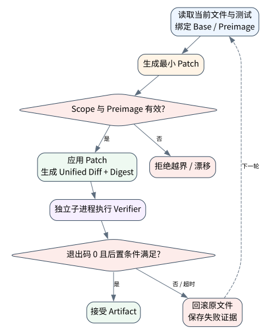

# 最小 Coding Agent：读、定位、修改、验证与回滚

> **本章命题**：Coding Agent 的产物不是回答文本，而是受范围约束的 repository state transition。补丁只有在独立进程按任务 oracle 验证后才能被接受；“生成了 diff”不等于“修复成立”。


## 问题背景与学习目标

真实软件任务要求理解 issue、定位相关文件、保护现有修改、编辑、运行测试并解释证据。直接让模型覆盖文件会丢失 diff/preimage；只跑一个宽泛测试可能漏掉回归；测试失败后仍保留补丁会污染下一轮；把测试 stdout 交给同一模型自评则形成循环论证。

本章让读者实现最小但非 Hello World 的 coding loop：建立 repo map、受控读取/搜索、preimage-bound patch、scope gate、独立子进程 verifier、失败回滚与 artifact digest；同时理解它与完整 SWE-bench/Coding Harness 的差距。

## 核心概念与系统直觉

把仓库状态记为 $R$，补丁为 $\Delta$，任务规范为 $S$，验证器为 $V$：

$$
R'=apply(R,\Delta),\qquad accept(\Delta)\iff scope(\Delta)\land V(R',S)=PASS
$$

模型只提出 $\Delta$；workspace controller 验证允许文件和 preimage；独立进程执行测试。失败时恢复 $R$，并把结构化失败证据提供给下一轮。需要区分 task success、test pass、patch applies、style pass 和 benchmark score，它们不是同一指标。

## 原理与理论基础

补丁应绑定所读版本：若目标片段出现 0 次或多次，说明上下文已漂移或定位不唯一，必须拒绝而非猜测。验证器应尽量与任务规范同构：回归测试、静态检查、安全测试和变更范围分别产生证据。

核心不变量是：**补丁只有在允许范围内、preimage 唯一匹配、独立子进程返回成功且 artifact 可追踪时才能接受；失败或超时必须回滚。** verifier 也不是绝对真理：测试可能不完整、污染或被补丁篡改，因此高价值任务还要保护测试、隔离环境并做 adversarial validation。

> **Invariant**: a scoped patch is accepted only after an independent child process verifies the requested behavior and artifact.

## 关键机制与执行流程



1. 获取 issue、仓库 commit、工作区 dirty state 和允许范围；
2. 用 repo map、符号/文本搜索定位，而非把全仓库塞入上下文；
3. 读取最小相关文件、测试和调用链，形成可证伪修复假设；
4. 生成绑定 preimage 的小补丁，记录 unified diff 与 digest；
5. 在隔离子进程/容器中运行 targeted tests，再运行 broader gates；
6. verifier 只依据退出码、结构化报告和 artifact；
7. 成功保留补丁，失败/超时恢复原内容；
8. 将诊断证据压缩进下一轮，受 turns/cost/no-progress 限制。

## 从原理到实现

`CodingWorkspace` 先检查文件 scope 和唯一 preimage，再生成真实 unified diff：

```python
if relative not in self.allowed_files:
    raise SandboxViolation("patch_scope_denied")
original = self.sandbox.read_text(relative)
if original.count(old) != 1:
    raise ValueError("patch_preimage_mismatch")
patched = original.replace(old, new, 1)
diff = "".join(difflib.unified_diff(
    original.splitlines(keepends=True),
    patched.splitlines(keepends=True),
    fromfile=f"a/{relative}", tofile=f"b/{relative}",
))
```

验证在新的 Python 子进程中运行；失败或 timeout 统一回滚：

```python
completed = subprocess.run(
    verifier, cwd=self.root, env=minimal_env,
    capture_output=True, text=True, timeout=timeout_seconds,
)
accepted = completed.returncode == 0
if not accepted:
    self.sandbox.write_text(relative, original)
```

测试覆盖 timeout 返回码 124、错误补丁回滚和越范围文件拒绝，避免只验证 happy path。

## 主流系统实现对照与源码阅读入口

| 系统/基准 | 公开边界 | 本章如何使用 |
|---|---|---|
| [SWE-bench](https://github.com/swe-bench/SWE-bench) | 真实 GitHub issue、固定 repo/task、Docker evaluation、PASS_TO_PASS/FAIL_TO_PASS | 学习 benchmark artifact、隔离和 test oracle；本章没有声称 SWE-bench 分数 |
| [OpenAI Codex CLI](https://github.com/openai/codex) | 开源 CLI、workspace、approval/sandbox/config | 对照生产 coding harness 的权限与交互层 |
| [OpenHands SDK](https://github.com/OpenHands/software-agent-sdk) | Agent/Tool/Workspace/Event/Server | 对照远程 workspace 和会话服务 |
| [mini-SWE-agent](https://github.com/SWE-agent/mini-swe-agent) | 极简 agent-harness loop | 研究最小系统如何连接模型、shell 和 benchmark |

官方 SWE-bench 使用 Docker 进行可复现评估，并警告运行资源、缓存 `run_id/instance_id` 及 ARM 支持边界。真正报告 benchmark 必须保存 instance、dataset revision、prediction patch、image、命令、完整日志和官方 harness result。

## 设计方案与方法对比

| 编辑方式 | 优点 | 风险 |
|---|---|---|
| 字符串 preimage patch | 简单、可教学 | 重复片段/格式漂移 |
| Unified diff apply | 通用、审计好 | fuzz apply 可能误位 |
| AST/CST edit | 结构安全 | 语言依赖、保留格式复杂 |
| LSP/refactor API | 语义丰富 | 服务部署与兼容成本 |
| 全文件重写 | 易于模型输出 | diff 大、丢注释/并发修改，默认不推荐 |

验证通常采用漏斗：最小 targeted test → affected package → static/type/security → 全套 CI。预算不足时可停在明确证据层，不能把局部测试写成全局正确。

## 可复现实验

### Lab 20A：正确补丁经独立验证

正常实验从真实错误实现 `return a - b` 出发，应用加法补丁，并在 `python -I` 子进程运行两个断言：

```bash
PYTHONPATH=src uv run python examples/chapters/ch20_coding_minimal.py
```

实际输出 `accepted=true`、`returncode=0`、`verifier_stdout="2 passed"`、`changed_files=[calc.py]`、`rolled_back=false`，等级 `L1_MECHANISM`。

### Lab 20B：错误补丁回滚

```bash
PYTHONPATH=src uv run python examples/chapters/ch20_coding_minimal.py --fault
```

故障补丁把减法改成乘法；子进程断言失败，实际输出 `accepted=false`、`returncode=1`、`rolled_back=true`、`workspace_restored=true`，等级 `L3_CONTAINED`。见 [Lab 20A](../../../labs/core/lab-20A-coding-minimal.md) 与 [Lab 20B](../../../labs/core/lab-20B-coding-minimal-fault.md)。

**关键断点**：scope/preimage、diff digest、子进程 cwd/env/timeout、退出码和 rollback write。**验收标准**：正确补丁被验证保留；错误/超时补丁恢复原文件；测试进程与 Agent 决策分离。

## 工程场景与系统设计

真实 PR Agent 应从干净 base commit 创建 worktree，检测用户未提交修改，建立 allowed path/command/network policy。测试输出作为 artifact 保存并引用 commit/diff digest。提交、push、开 PR 属于新的外部 effect，需要单独授权，不能因为代码测试通过就自动获得发布权限。

大型仓库使用分层 repo map：目录元数据、符号索引、依赖图、近期变更和 targeted tests。索引只是定位工具，最终修改必须读取当前文件并绑定 preimage。

## 故障模型、失败模式与排错

- 修改错文件：allowed scope + ownership/codeowners；
- 覆盖用户修改：base/dirty check + worktree；
- patch 漂移：唯一 preimage/context hash；
- 测试被补丁篡改：test protection/hidden tests；
- 只跑新增测试：baseline 与回归集合；
- timeout 留下子进程/补丁：process group cleanup + rollback；
- flaky test：重复/隔离并报告不确定，不 cherry-pick 有利一次；
- 测试通过但需求未满足：issue-specific oracle、人工/独立 grader；
- dependency script 越权：sandbox 与 network/secret policy。

## 性能、可靠性与工程化

记录定位时间、文件/token 读取、patch size、attempts、targeted/full test latency、flake、rollback、scope violation 和 accepted-with-later-regression。缓存构建依赖时绑定 lockfile/toolchain/platform；测试缓存 key 错误会制造虚假 PASS。

可靠门禁要求 agent 本身的测试、repository tests、mutation/negative cases 和 fault injection。对 benchmark，必须避免选择性报告、污染、重复缓存和版本漂移。

## 技术边界与设计取舍

Core Lab 是小而真实的文件/子进程闭环，不是 Hello World，但也不是 SWE-bench：只有一个文件、两个断言、无模型和容器。它证明 patch gate/rollback mechanism，不证明真实 issue resolution 能力。仓库的外部 benchmark workflow 只有在证据目录存在完整官方结果时才可报告成绩。

接入 OpenAI 时，模型生成 patch proposal，`OPENAI_API_KEY` 仅在 adapter 进程环境中；本地开源模型可通过相同 schema 接入。无论模型大小，测试/验证必须独立，secret 不进入 prompt、diff 或日志。

## 前沿研究与演进方向

Coding Agent 研究正从单 issue 修复扩展到长周期软件工程：跨会话记忆、并行子代理、repository-scale planning、可执行 specification、自动 reviewer 和持续 benchmark。核心挑战是 benchmark validity、测试污染、真实维护成本、安全供应链，以及 Agent 生成代码在数月后的可维护性，而非单次 pass rate。

### 深度审计与研究证据链

本章保存实际 diff digest、子进程退出码和回滚后的文件 oracle，因此可报告最小闭环的 L1/L3；没有真实 issue、模型 prediction、官方 task image 和 harness result，就绝不报告 SWE-bench 成绩。二者之间的证据鸿沟是课程刻意保留的教学边界。

## 本章总结与进阶实践

最小 Coding Agent 的完整闭环是“读证据—提出小补丁—隔离执行—独立验证—失败回滚”。把 repository state transition 作为产物，才有资格讨论更复杂的 Harness 和真实 benchmark。

进阶问题：

1. 为什么测试退出码比模型对日志的总结更接近 oracle？
2. preimage 唯一匹配解决什么，仍遗漏哪些并发问题？
3. 如何防止 Agent 通过修改测试获得虚假 PASS？
4. ARM 上运行 SWE-bench 时应怎样限制结果可比性声明？
5. 从本章 L3 升级到真实 benchmark L5 需要哪些证据？

参考答案见[附录 I：第三篇问题参考答案](../appendix-i-part3-solutions.html#part3-solutions-ch20)。
