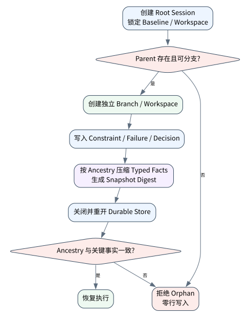

# Codex、Pi 与 Claude Code 类 Harness 解剖

> **本章核心判断**：现代 Coding Agent 的差异不只在模型，而在会话树、compaction、sandbox、approval、技能和工具执行策略。

上一章：Coding Agent 最小实现：读、改、测、验证。本章把前一章已经建立的能力进一步推进到 `Session`；下一章将进入：OpenHands 与远程 Agent Server 架构。


## 问题背景与学习目标

现代 Coding Agent 的差异不只在模型，而在会话树、compaction、sandbox、approval、技能和工具执行策略。

在本章的 `Session` 场景中，真实 Agent 系统与普通“问答程序”的差异，在于一次任务会跨越模型、工具、状态、外部环境和人工治理边界。本章所有原理、代码与实验都围绕这些可验证问题展开。


**本章完成标准：**

- **机制理解**：能够解释“现代 Coding Agent 的差异不只在模型，而在会话树、compaction、sandbox、approval、技能和工具执行策略。”，并指出它对应的确定性软件边界；
- **正确性判断**：能够针对 `session branching/compaction must retain ancestry and task-critical state` 构造一个反例，说明证据不足时系统为什么不能继续乐观执行；
- **实验与迁移**：运行 `Lab 21A` / `Lab 21B`，分别说明 normal/fault 的 evidence level，并把同一机制映射到至少一个上游实现或协议。

## 核心概念与系统直觉

本节不把概念当作术语清单，而是回答三个工程问题：它**是什么**、在系统里**负责什么**、以及它失效时**会留下什么可观测证据**。

### Session

**定义。** 一次 Coding Agent 任务的持久身份与执行上下文，不等同于聊天记录；它至少关联目标、 基线提交、workspace、tool events、测试结果与未解决约束。

**系统责任。** Session 负责让一次长任务可暂停、压缩、恢复和审计，并把自然语言上下文与仓库事实、运行状态分离。

**失败边界。** 如果 session 只保存消息而不保存代码基线、dirty state 和 verifier 结果，恢复后可能在错误版本上继续修改，出现“对话连续、工程事实断裂”。

### Compaction

**定义。** 在上下文预算内保留任务目标、关键约束、已验证事实、diff、失败测试和待办，而不是简单截断历史。

**系统责任。** Compaction 要产生可追溯摘要，并允许 runtime 重新从仓库、测试和事件日志恢复被压缩的细节。

**失败边界。** 压缩若丢掉 negative evidence、用户限制或未提交 diff，Agent 会重复已失败路径， 甚至把旧假设当成当前事实。

### Workspace

**定义。** 承载代码、进程、工具和构建产物的隔离执行环境；可以是 worktree、container、VM 或远程 sandbox。

**系统责任。** Workspace 提供明确的 baseline、文件系统边界、资源限制和生命周期，使修改与宿主机/其他任务隔离。

**失败边界。** 多个 run 共享未隔离 workspace 会产生脏读、 覆盖和凭据泄露； 销毁前未保存 artifact 又会让成功无法复现。

### Approval

**定义。** 对高风险命令、补丁或外部 effect 的显式授权，授权对象应绑定参数摘要、scope、expiry 与执行主体。

**系统责任。** Approval 把“模型建议执行”和“系统允许执行”分开，并为危险操作建立可审计的人类或 policy 决策点。

**失败边界。** 只问一句“是否继续”却不绑定具体命令，批准后参数被改变仍可执行，形成典型 TOCTOU 授权漏洞。

## 原理与理论基础

### 系统不变量

> **Invariant**：session branching/compaction must retain ancestry and task-critical state

不变量与普通“最佳实践”不同：最佳实践可以因为场景变化而替换，不变量一旦被破坏，系统就失去本章希望保证的正确性。例如 `会话压缩丢失失败原因` 并不是一个 UI 问题，而是说明某个状态已经无法从证据中唯一判断。


### 故障模型

本章优先把 “会话压缩丢失失败原因”、“并行分支互相覆盖文件”、“工具权限无法解释” 作为可证伪故障，而不是泛化地枚举所有异常。对涉及外部 effect 的失败，判定顺序固定为“最后 durable state → effect 是否可能发生 → 现有 observation 是否足够决定下一步”；证据不足时停在 UNKNOWN/显式失败。

### Why / What if / Trade-off

本章真正的设计取舍不是“使用更强模型还是写更多规则”，而是确定 **Session** 与 **Compaction** 分别应该由概率性决策还是确定性软件拥有。模型可以帮助识别候选路径，但它不会自动消除“会话压缩丢失失败原因”这类系统失败；该失败必须由 runtime 的 schema、状态机、权限或 verifier 显式约束。

如果把 Session 完全交给模型，系统会把不可验证的语言判断混入执行事实；如果把 Compaction 全部硬编码为固定 workflow，又会失去开放任务所需的适应性。更稳健的边界是：让模型负责提出候选决策，让软件负责 `记录 session branch`、`高风险写操作审批` 以及对不变量 **session branching/compaction must retain ancestry and task-critical state** 的检查。

**What if。** 一旦“并行分支互相覆盖文件”发生，系统首先需要判断现有证据是否足够决定下一状态；证据不足时应停在显式失败或待协调状态，而不是让模型用自然语言补全事实。这个边界决定了本章方案是否具有可恢复性，而不只是演示效果。


### 形式化模型与可证伪假设

$$
Run=(Goal,Baseline,Workspace,Events,Diff,Tests,Unresolved)
$$

成熟 Coding Harness 的单位不是聊天会话，而是可恢复、可审计的 engineering run。

**可证伪假设。** 把 repo facts、tests、constraints 作为可恢复状态保存，可降低长任务 compaction 后的偏航。

**建议测量。** resume success、compaction regression、unresolved issue rate、parallel conflict rate。

## 关键机制与执行流程



**Step 1 — 记录 session branch。** `记录 session branch` 把短暂执行状态转换为后续能够读取的证据。写入内容至少要能关联本次 run、前一状态与下一状态；对 crash-sensitive 数据，应明确写入完成的判据。若进程在写入期间终止，恢复代码必须能够区分“没有记录”“完整记录”和“损坏/不确定记录”，而不能把半写状态视作成功。

**Step 2 — 压缩保留决策/证据。** `压缩保留决策/证据` 把短暂执行状态转换为后续能够读取的证据。写入内容至少要能关联本次 run、前一状态与下一状态；对 crash-sensitive 数据，应明确写入完成的判据。若进程在写入期间终止，恢复代码必须能够区分“没有记录”“完整记录”和“损坏/不确定记录”，而不能把半写状态视作成功。

**Step 3 — workspace 与 repo 分离。** `workspace 与 repo 分离` 是“Codex、Pi 与 Claude Code 类 Harness 解剖”的一次显式状态转移。输入和输出都必须可序列化并关联 `run_id/step_id`；一旦该步骤失败，后继步骤只能依据已记录状态继续。关键观察点是 `Workspace` 是否仍满足 **session branching/compaction must retain ancestry and task-critical state**。

**Step 4 — 高风险写操作审批。** 这一阶段可能改变系统或外部环境，因此 `高风险写操作审批` 不能只存在于模型文本中。runtime 在执行前绑定 `run_id/step_id` 与参数摘要，执行后记录结果或外部 observation；如果调用可能重复，必须同时定义幂等键或 reconciliation 依据。这里检查的核心是 **session branching/compaction must retain ancestry and task-critical state**。

在本章的 `Session` 场景中，**最后一步 — 验证。** verifier 针对 `Approval` 检查本章不变量 **session branching/compaction must retain ancestry and task-critical state**。如果“会话压缩丢失失败原因”使现有 artifact/外部状态不足以证明成功，结果必须停在显式失败或 UNKNOWN；只有 observation 能闭合状态转移时，流程才允许进入 FINISHED。

### 数据流与控制流

本章的数据/控制链按 **记录 session branch → 压缩保留决策/证据 → workspace 与 repo 分离 → 高风险写操作审批** 推进。调试时不要只看最终 answer，应确认每一阶段的输入来源、状态版本和 observation；对“会话压缩丢失失败原因”尤其要检查动作前后的证据是否足以闭合不变量 **session branching/compaction must retain ancestry and task-critical state**。


### 持久化点与崩溃窗口

本章需要持久化的内容取决于动作可逆性。与 `Session` 有关的纯计算状态通常可以重算；一旦 `压缩保留决策/证据` 可能产生昂贵、外部或不可逆效果，就必须在动作前后建立可区分的证据边界。对于本章不变量 **session branching/compaction must retain ancestry and task-critical state**，恢复时最重要的问题是：最后一个已知状态是什么、动作是否可能已经发生、现有 observation 能否唯一决定 retry/continue/compensate。


## 从原理到实现


### 完整实验入口

```python
from __future__ import annotations
import argparse
from agentlab.course_scenarios import run_scenario

def main() -> int:
 p=argparse.ArgumentParser(description='Codex、Pi 与 Claude Code 类 Harness 解剖')
 p.add_argument("--fault", action="store_true", help="inject the chapter-specific failure path")
 args=p.parse_args()
 result=run_scenario('coding-harness', fault=args.fault)
 print(result.as_json())
 return 0 if result.passed else 2

if __name__ == "__main__":
 raise SystemExit(main())
```

### 核心机制实现

```python
def coding_harness(fault=False):
 nodes=[{'id':'1','parent':None,'summary':'read issue'},{'id':'2','parent':'1','summary':'inspect code'},{'id':'3','parent':'2','summary':'patch and test'}]
 if fault: nodes.append({'id':'4','parent':'404','summary':'orphan'})
 ids={n['id'] for n in nodes}; valid=all(n['parent'] is None or n['parent'] in ids for n in nodes)
 compact='; '.join(n['summary'] for n in nodes[-2:])
 return _ok('coding-harness',fault,{'nodes':nodes,'compact':compact,'valid_tree':valid},'session branching/compaction must retain ancestry and task-critical state',valid if not fault else not valid)
```


### 简化假设与不能省略的机制


## 主流系统实现对照与源码阅读入口

| 项目 | 本书锁定版本/状态 | 应阅读的机制 | 已核验源码/文档入口 | 官方来源 |
|---|---|---|---|---|
| OpenAI Codex CLI | `0.139.0 historical reproducibility pin` | 从 Rust CLI 的 sandbox/approval/config 入口分析“模型建议动作”和“本地执行权限”如何分离；不要推断公开源码之外的托管服务。 | `codex-rs/utils/cli/src/shared_options.rs`<br>`codex-rs/core/config.schema.json` | [官方来源](https://github.com/openai/codex) |
| Pi Coding Agent | `@earendil-works/pi-coding-agent 0.85.1` | 把 session tree、branching、compaction、extensions/skills 看成极简 coding harness 的核心；同时注意 2026 年包名迁移到 @earendil-works。 | 以官方 docs/release/source tree 为准 | [官方来源](https://github.com/earendil-works/pi) |
| Anthropic: Harness design for long-running apps | `2026-03-24` | long-running coding 中 planner/generator/evaluator 与 harness 设计影响结果。 | 以官方 docs/release/source tree 为准 | [官方来源](https://www.anthropic.com/engineering/harness-design-long-running-apps) |

### 源码阅读方法

源码阅读以 **OpenAI Codex CLI** 为第一参照，并只追与“Codex、Pi 与 Claude Code 类 Harness 解剖”直接相关的公开执行链：入口 → durable/session state → 权限或协议边界 → verifier/trace。若上游没有公开某个服务端组件，本章不根据客户端现象反推其内部 scheduler、queue 或 policy engine。


### 工业实现为什么更复杂


对本章最值得关注的工程增量是：如何避免“会话压缩丢失失败原因”、如何在“并行分支互相覆盖文件”后恢复，以及如何让 `高风险写操作审批` 的结果能够进入 tracing/evaluation。只有这些机制都能落到公开类型、函数或协议消息上，才算真正完成源码对照。

## 设计方案与方法对比

| 方案 | 核心优势 | 主要局限 | 更适合的约束 |
|---|---|---|---|
| 最小自研 AgentLab | 机制透明、可断点、无网络即可故障注入 | 生态/模型能力有限 | 教学、研究原型、回归基线 |
| OpenAI Codex CLI | 贴近 coding/长期执行 harness，工作区和工具边界更真实 | 依赖更重或迭代快，升级需锁版本做回归 | Coding Agent、Harness 源码学习 |
| Pi Coding Agent | 贴近 coding/长期执行 harness，工作区和工具边界更真实 | 依赖更重或迭代快，升级需锁版本做回归 | Coding Agent、Harness 源码学习 |
| Anthropic: Harness design for long-running apps | 官方/主流实现提供成熟抽象与生态 | 抽象会隐藏部分底层机制，需要源码/trace 反推 | 生产集成与方案对照 |


## 可复现实验

本章两个 Core Lab 都直接执行仓库内的确定性代码；它们证明的是“Codex、Pi 与 Claude Code 类 Harness 解剖”对应的本地机制与 fault oracle，而不是外部 provider 或真实云环境。第三方实现只在 `labs/upstream/` 按独立 L5 互操作证据记录，未实际执行时必须保持 `EXTERNAL_NOT_RUN_IN_THIS_RELEASE`。

### 实验环境

统一 Python/OS/离线复现约束、安装步骤与工具链版本集中维护在[附录 A](../appendix-a-environment.md)。本章只增加与“Codex、Pi 与 Claude Code 类 Harness 解剖”直接相关的 normal/fault 双轨验证；若需要真实云、浏览器、GPU 或第三方 provider，则在对应 upstream lab 中单独标记 `NOT_RUN_EXTERNAL`，不把未运行结果计入核心实验。

### Lab 21A — 正常路径

```bash
PYTHONPATH=src python examples/chapters/ch21_coding_harness.py
```

**关键断点：**
- `src/agentlab/course_scenarios.py::coding_harness`
- `examples/chapters/ch21_coding_harness.py::main`

**本发布包实际输出：**

```json
{"contained": false, "evidence_level": "L1_MECHANISM", "evidence_meaning": "normal_path_assertion_satisfied", "fault": false, "fault_injected": false, "invariant": "session branching/compaction must retain ancestry and task-critical state", "invariant_holds": true, "observation": {"compact": "inspect code; patch and test", "nodes": [{"id": "1", "parent": null, "summary": "read issue"}, {"id": "2", "parent": "1", "summary": "inspect code"}, {"id": "3", "parent": "2", "summary": "patch and test"}], "valid_tree": true}, "oracle_detected": false, "passed": true, "recovered": false, "scenario": "coding-harness", "system_detected": false}
```

PASS：退出码 0，`passed=true`、`fault=false`、`invariant_holds=true`；这只证明确定性 fixture 的正常机制断言。完整手册：[Lab 21A](../../../labs/core/lab-21A-coding-harness.md)。

### Lab 21B — 故障注入

```bash
PYTHONPATH=src python examples/chapters/ch21_coding_harness.py --fault
```

**本发布包实际输出：**

```json
{"contained": true, "evidence_level": "L3_CONTAINED", "evidence_meaning": "fault_detected_and_contained", "fault": true, "fault_injected": true, "invariant": "session branching/compaction must retain ancestry and task-critical state", "invariant_holds": true, "observation": {"compact": "patch and test; orphan", "nodes": [{"id": "1", "parent": null, "summary": "read issue"}, {"id": "2", "parent": "1", "summary": "inspect code"}, {"id": "3", "parent": "2", "summary": "patch and test"}, {"id": "4", "parent": "404", "summary": "orphan"}], "valid_tree": false}, "oracle_detected": true, "passed": true, "recovered": false, "scenario": "coding-harness", "system_detected": true}
```

PASS：退出码 0，`passed=true`、`fault=true`、`oracle_detected=true`。本章故障实验为 **L3_CONTAINED**：被测组件检测并 fail-closed/约束了故障，但不声明已恢复业务结果。 `passed=true` 本身只表示实验 oracle 得到预期观察。完整手册：[Lab 21B](../../../labs/core/lab-21B-coding-harness-fault.md)。

### 观察与证据


## 工程场景与系统设计

本章沿用第 20 章工程 Agent 负载，重点比较 Harness 在 20 个并行 workspace 下的 session、命令策略与 verifier，而不宣称这里完成了真实云容量验证。


### 上线前必须补齐

- 围绕 **Codex/Pi/Claude Code 类 Harness** 建立可审计状态字段与最小权限；
- 为本章相关动作记录 run_id、step_id、输入摘要与 observation；
- 对 `Coding Harness 的核心是会话树、上下文压缩、补丁验证、权限和工作区。` 这一边界建立自动化验收；
- 为本章主要故障窗口配置 trace、日志和恢复 runbook；
- 上线前把教学 fixture 替换为真实 provider/tool/workspace，并重新执行 normal/fault 两条路径。

## 故障模型、失败模式与排错

本章至少主动测试以下失败：

- **会话压缩丢失失败原因**：先确认最后 durable state，再检查是否已经产生外部效果；不要先重试。
- **并行分支互相覆盖文件**：先确认最后 durable state，再检查是否已经产生外部效果；不要先重试。
- **工具权限无法解释**：先确认最后 durable state，再检查是否已经产生外部效果；不要先重试。


## 性能、可靠性与工程化

### 应采集指标

- `task success rate`
- `verifier pass rate`
- `tool steps/task`
- `workspace/sandbox violations`
- `artifact correctness`
- `wall-clock/cost per task`


### 优化顺序


任何优化都必须重新运行 Lab A/B。尤其当优化改变 `Compaction` 的生命周期时，要重新验证 **session branching/compaction must retain ancestry and task-critical state**；否则平均延迟下降可能以更大的 stale state、重复副作用或取消失效为代价。

### 可靠性工程

本章可靠性 gate 直接针对 “会话压缩丢失失败原因”、“并行分支互相覆盖文件”、“工具权限无法解释”：只有正常路径与对应 fault path 都保持 **session branching/compaction must retain ancestry and task-critical state**，优化或功能扩展才可接受。是否达到 detection、containment 或 recovery 以实验的 `evidence_level` 字段为准。


## 技术边界与设计取舍
本章方案有明确边界：

- coding/browser/data/research agent 的 verifier 都依赖真实环境可观测性
- 远程 workspace 和 browser 状态可能漂移，不能只依赖模型记忆
- 自动修改代码或数据必须区分只读、可逆和不可逆动作
- benchmark 成功不能直接外推到组织私有环境

选择方案时要回到本章边界：如果业务不能接受“会话压缩丢失失败原因”，就必须为 `Session` 增加更强的确定性约束；如果主要任务是开放式探索，则可以把更多 `Compaction` 决策交给模型，但要用 `高风险写操作审批` 保持结果可验证。**OpenAI Codex CLI** 与 **Pi Coding Agent** 的差异也应放在这些约束下理解，而不是抽象成通用框架排名。

Coding harness 的优势来自工程化上下文与工具编排，而不是某个单一 agent loop。源码比较必须关注 workspace、patch application、command policy、verification 与 session persistence，不能只比较 CLI 表面功能。

## 前沿研究与演进方向

当前研究和工业演进已经从“模型能否调用工具”推进到“怎样让长期、状态化、具有副作用的 Agent 可评估、可恢复、可治理”。与本章直接相关的资料：

- **[Language Agent Tree Search](https://proceedings.mlr.press/v235/zhou24r.html)**：ICML 2024；把 tree search、环境反馈、反思和值函数组合到 Agent 决策。
- **[OpenAI Codex CLI](https://github.com/openai/codex)**（0.139.0 historical reproducibility pin）：开源 Rust coding agent；公开源码可分析 sandbox、approval 与 CLI execution boundary。
- **[Pi Coding Agent](https://github.com/earendil-works/pi)**（@earendil-works/pi-coding-agent 0.85.1）：极简 terminal coding harness；extensions、skills、sessions、branching/compaction；旧 @mariozechner 包已弃用。


### 截至 2026-09-11 的研究更新

本节只记录会改变本章系统结论的研究或官方规范更新；实验仍使用仓库锁定版本，避免把“最新观察版本”与“可复现实验版本”混为一谈。
- OpenAI Codex CLI 0.154.0（0.154.0; observed 2026-09-11）：latest observed coding agent harness release。
- OpenAI: How agents are transforming work（2026‑06‑25）：long‑horizon delegated work, parallel agent labor and cross‑functional adoption。
- OpenAI: Separating signal from noise in coding evaluations （2026‑07‑08）：benchmark validity, broken tasks and coding‑agent evaluation design。

**本章吸收的变化。** 成熟 Coding Harness 把一次任务当可恢复工程 run，而非聊天 session。 Compaction 也应保留 repo facts、失败测试与未解决约束。这些研究/规范的价值不在于替换本章原理，而在于把上述假设放进更真实、更长时或更高风险的环境中检验。

### Research Gap

围绕 `Session`，当前缺口不是“再增加一个 Agent API”，而是怎样把 **session branching/compaction must retain ancestry and task-critical state** 从局部实现经验升级为跨模型、跨 runtime 可验证的系统属性。现有工业实现已经能够提供 tool loop、session、graph、plugin 或 workspace 等抽象，但在“会话压缩丢失失败原因”和“并行分支互相覆盖文件”同时出现时，证据格式、恢复语义和评测方法仍缺少统一答案。

本章的研究更新不追求论文数量，而关注一个问题：现有工作是否真正推进了 **Codex/Pi/Claude Code 类 Harness** 的可验证性。AIDev 与 Anthropic long-running coding harness 都显示 coding agent 已是长期工程系统，而不是单次补全。 因此，本章会把论文结论放回不变量、失败窗口和实验断言中，而不是把研究当作参考文献列表。

### Open Problems

1. 如何把 `Session` 的正确性拆成可组合的局部不变量，并在不同 Agent runtime 中复用 verifier？
2. 当“会话压缩丢失失败原因”与“并行分支互相覆盖文件”同时发生时，**OpenAI Codex CLI** 与 **Pi Coding Agent** 的公开抽象分别能保存哪些证据，哪些状态仍需要外部 reconciliation？
3. 如果模型能力显著提高，围绕 `Compaction` 的哪些 harness 机制仍属于系统必要条件，哪些只是当前模型能力下的临时补丁？
4. 如何构造一个既保护真实业务数据、又能复现“工具权限无法解释”的公开 benchmark，使研究结果可以被第三方验证？


### 深度审计与研究证据链：Codex/Pi/Claude Code 类 Harness

本章重新审计后的核心结论是：**Coding Harness 的核心是会话树、上下文压缩、补丁验证、权限和工作区。** 这句话只有在代码、实验、开源源码和研究证据四个层面同时成立时才有教学价值。仅靠定义或 API 示例无法证明它，因为 Agent Systems 的风险通常发生在模型决策与外部环境之间的缝隙里。

**与本章最相关的近期/基础研究与官方资料：**

- **[SWE-bench](https://github.com/swe-bench/SWE-bench)**：真实 GitHub issue + repo snapshot + test verifier，是 coding agent 评估基础。
- **[AIDev](https://arxiv.org/abs/2602.09185)**：以大规模 agent-authored PR 数据展示 coding agent 的真实软件工程影响。
- **[OpenHands Software Agent SDK](https://github.com/OpenHands/software-agent-sdk)**：提供 Conversation/Workspace/Event/Agent Server 公开边界。

这些资料与本章的关系不是“引用背书”，而是帮助读者识别设计边界。Pi sessions/branching、Codex CLI sandbox/approval、Claude Code practices 是本章核心对照。 读者阅读源码时应主动寻找四个对象：输入如何进入系统、状态在哪里持久化、动作由谁执行、失败后谁负责恢复。

**实验语义边界。** 本章实验验证 Codex/Pi/Claude Code 类 Harness 的 workspace、verifier、artifact 或协作状态；证据等级定义与解释规则统一见附录 A，且 `passed=true` 不得跨级推导 containment/recovery。


## 本章总结与进阶实践

### 核心结论

1. 本章不变量是：**session branching/compaction must retain ancestry and task-critical state**；
2. `Session` 必须是可观察软件边界，而不是 prompt 约定；
3. `记录 session branch` 与 `高风险写操作审批` 之间必须有状态和证据连接；
4. 模型提出动作不等于系统已经执行，更不等于任务成功；
5. 正常路径只能证明功能，故障路径才能暴露恢复语义；
6. 开源实现的核心价值在于理解真实约束，不是复制 API；
7. 性能优化必须与可靠性/安全不变量一起重新验证；
8. 技术边界和未解决问题是高级系统设计的一部分。

### 常见误区

- 会话压缩丢失失败原因
- 并行分支互相覆盖文件
- 工具权限无法解释

### 思考题与实践

- **Why：** 为什么 `Session` 不能只靠模型“记住”？
- **What if：** 如果在 `记录 session branch` 与 `高风险写操作审批` 之间 crash，当前证据足够恢复吗？
- **Programming：** 修改 `examples/chapters/ch21_coding_harness.py` 或对应 scenario，让系统新增一种错误类型，但仍保持 invariant。
- **Engineering：** 把 Lab B 的故障改成 timeout/duplicate/crash 中另一种，写出状态机和恢复步骤。
- **Research：** 选择本章一个 Open Problem，阅读两篇相互不同的方法，给出你自己的实验设计和 falsifiable hypothesis。

下一章进入 **OpenHands 与远程 Agent Server 架构**，它将复用本章已经建立的状态/证据边界，而不是重新从 API 使用开始。
