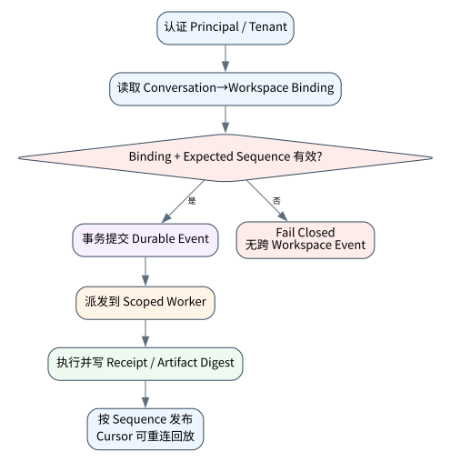

# OpenHands 与远程 Agent Server 架构

> **本章命题**：远程 Agent Server 不是把本地 loop 套一层 HTTP。它必须把 conversation、workspace、event stream、command、artifact、租户权限和生命周期建模为彼此绑定、可重放且可审计的资源。

上一章讨论单机 Coding Harness；本章分析 OpenHands 所代表的远程 workspace/Agent Server 路径，并实现最小 durable event boundary。下一章进入 Browser/Computer Use 环境。


## 问题背景与学习目标

本地 Agent 进程退出时，用户通常还能检查目录；远程 Agent Server 一旦丢失 conversation 与 workspace 的绑定，命令可能落到错误租户或已回收环境。网络重试还会把“调用一次”变成“请求发送多次”，事件乱序则会让 UI 展示与真实执行状态分离。

本章要求读者能够定义 remote run 的资源边界；区分 API command、durable event 与 ephemeral stream frame；设计 sequence、request ID、workspace lease 和 reconnect cursor；解释为何容器存在不代表会话可恢复；运行真实 SQLite 重开实验并审计跨 workspace 写入被拒绝。

## 核心概念与系统直觉

**Conversation** 保存用户目标、消息与审批语境；**workspace** 提供文件、进程和资源隔离；**event stream** 是服务器对已接受事实的有序记录；**command** 是可能被拒绝、去重或异步完成的请求；**artifact** 是大文件/日志/补丁的内容寻址结果。它们有不同的 identity 与 retention policy。

一个 WebSocket frame 不是 durable event。客户端收到 `tool.finished` 之前断线，不代表工具没完成；服务端广播成功但事件未提交，也不代表恢复后还能证明完成。正确顺序是先把状态转移提交到 durable store，再以 sequence/cursor 投影给订阅者。

Workspace lease 则回答“谁现在有权使用这个环境、租约到何时、回收后 token 是否仍有效”。conversation ID 不能兼任租户授权，URL 中带 workspace ID 也不是权限证明。

## 原理与理论基础

把服务器接受一个事件的条件写成：

$$
\begin{aligned}
accept(e)\iff{}& tenant(e)=tenant(c)\\
&\land workspace(e)=workspace(c)\\
&\land seq(e)=seq(c)+1\\
&\land unseen(request\_id(e)).
\end{aligned}
$$

只有四个条件同时成立，事件才能进入日志；广播和 UI 更新是提交后的派生结果。对于 command，request ID 支持 transport retry 去重，但业务 effect 仍需单独的 idempotency key 或 reconciliation。

> **Invariant**: every ordered durable event is bound to exactly one authorized conversation and workspace.

这条不变量同时约束隔离和恢复。如果事件只有 conversation ID，没有 workspace identity，恢复时无法证明工具结果来自哪一个文件系统；如果只有 workspace ID，没有 conversation/tenant，跨任务读取就难以审计。

## 关键机制与执行流程



1. API gateway 验证 principal、tenant、quota 与请求大小；
2. control plane 创建 conversation，并分配/附着带 lease 的 workspace；
3. command 带 conversation/workspace/request ID 和 expected sequence；
4. server 在事务内验证绑定、去重、追加 event，再确认接受；
5. worker 领取已授权动作，在隔离环境执行并写 outcome/artifact digest；
6. stream gateway 按 sequence 推送，客户端以 cursor 重连补发；
7. 取消任务时记录 cancellation requested/acknowledged/terminated 三种状态；
8. workspace 回收前固化必要 artifact，撤销凭据并记录 final state。

服务 crash 若发生在 effect 与 event commit 之间，结果是 UNKNOWN，不应直接重试。恢复器先检查 workspace/process/artifact 或外部系统 observation，再决定 resume、compensate 或人工介入。

## 从原理到实现

Core Lab 用真实 SQLite 文件承载 conversation 与 ordered events。`append` 先验证 workspace binding 和 expected sequence，然后才提交：

```python
def append(self, conversation_id, workspace_id, request_id,
           event_type, payload, *, expected_sequence):
    row = self.connection.execute(
        "select workspace_id from conversations where conversation_id=?",
        (conversation_id,),
    ).fetchone()
    if row is None:
        raise BoundaryViolation("conversation_missing")
    if row["workspace_id"] != workspace_id:
        raise BoundaryViolation("workspace_binding_mismatch")
    next_sequence = self.connection.execute(
        "select coalesce(max(sequence),0)+1 from events where conversation_id=?",
        (conversation_id,),
    ).fetchone()[0]
    if next_sequence != expected_sequence:
        raise BoundaryViolation("event_sequence_conflict")
    self.connection.execute(
        "insert into events values(?,?,?,?,?,?)",
        (conversation_id, next_sequence, workspace_id,
         request_id, event_type, canonical_json(payload)),
    )
    self.connection.commit()
```

正常路径关闭 server-side store 后重新打开，再读取同样的顺序；故障路径尝试把 `workspace-2` 的事件写入绑定 `workspace-1` 的 conversation：

```python
store.create_conversation("conversation-1", "workspace-1")
store.append("conversation-1", "workspace-1", "request-1",
             "tool.started", {"tool": "shell"}, expected_sequence=1)
store.close()

events = AgentEventStore(db_path).events("conversation-1")
assert [e["sequence"] for e in events] == [1]
```

代码位于 `src/agentlab/specialized_system.py`。这里执行了 durable event store，但没有启动 OpenHands 服务，也没有实现 WebSocket、容器调度或多租户身份系统。

## 主流系统实现对照与源码阅读入口

| 系统 | 适合阅读的边界 | 核验问题 |
|---|---|---|
| [OpenHands Software Agent SDK](https://github.com/OpenHands/software-agent-sdk) | Agent、Runtime、workspace、event/conversation、Agent Server/SDK | 事件何时 durable；runtime 与 server 谁拥有生命周期 |
| OpenHands Cloud/remote runtime 类部署 | workspace provisioning、image、network、secret、artifact | 租户与 workspace 如何绑定；断线后如何恢复 |
| Kubernetes Job/Pod | 调度与 OS 隔离层 | Pod phase 是否被错误当成 Agent 完成语义 |
| 本书 AgentLab | SQLite conversation/workspace/event gate | 只覆盖顺序与绑定，不冒充完整远程平台 |

源码阅读先从公开 schema 和 API 路由找 resource identity，再追 event append、worker dispatch、runtime adapter 与 reconnect。不要仅从前端动画推断后端已经采用 exactly-once 或强一致队列。

## 设计方案与方法对比

| 架构 | 优势 | 风险 | 适用范围 |
|---|---|---|---|
| 单进程 + 本地目录 | 调试简单 | 无租户隔离，进程退出即丢状态 | 教学/个人任务 |
| API + SQLite + 本地 worker | durable 边界清晰 | 单机容量和故障域 | 小团队、机制基线 |
| control plane + queue + container workers | 可横向扩展 | command/event/effect 一致性复杂 | 多租户服务 |
| VM/microVM workspace | 隔离更强 | 启动与镜像成本高 | 不可信代码、高风险任务 |

远程化并不会自动提高 Agent 质量；它提高的是资源管理、隔离与可观测性上限，同时引入网络分区、租约过期和重复投递的新故障面。

## 可复现实验

### Lab 22A — 正常路径

```bash
PYTHONPATH=src python examples/chapters/ch22_openhands.py
```

实际输出为 `event_types=[tool.started,tool.finished]`、`sequences=[1,2]`、`reopened_from_sqlite=true`，证据等级 `L1_MECHANISM`。验收要求关闭并重开数据库后事件顺序不变。详见 [Lab 22A](../../../labs/core/lab-22A-openhands.md)。

### Lab 22B — 故障注入

```bash
PYTHONPATH=src python examples/chapters/ch22_openhands.py --fault
```

实际输出为 `error=workspace_binding_mismatch`、`cross_workspace_event_count=0`、`L3_CONTAINED`。关键断点是 workspace 比较必须先于 insert/commit。详见 [Lab 22B](../../../labs/core/lab-22B-openhands-fault.md)。

**实验语义边界。** 实验真实验证 SQLite durability 与跨 workspace fail-closed；未运行 OpenHands、容器、WebSocket 或远程网络故障，不能称为 OpenHands interoperability 证据。

## 工程场景与系统设计

一个生产 Coding Service 可把 API/control plane 与不可信 execution plane 分离：前者持有身份、policy 和 metadata DB，后者只拿短期 scoped credential。Artifact 上传以 digest 校验，日志经过 secret redaction；worker 不能自行扩大 workspace capability。断线重连只依据 server cursor，不接受客户端声称的最后状态。

模型接入使用[附录 A](../appendix-a-environment.md)的 provider adapter。服务端把模型输出视为 proposal event；真正 command 由 policy layer 重新构造，因此 prompt 中出现的 workspace ID、shell 命令或“已获批准”文本均没有授权效力。

## 故障模型、失败模式与排错

- **跨租户 workspace 混淆**：检查 principal—tenant—conversation—workspace 完整绑定；
- **重复 command**：用 request ID 去重 transport，用 effect key 约束副作用；
- **事件空洞/乱序**：sequence 唯一约束，消费者发现 gap 即停止投影；
- **stream 已推送、store 未提交**：规定 commit-before-publish；
- **租约过期但进程仍运行**：撤销 token、隔离网络并进入 reconciliation；
- **取消只关 UI**：必须等待 worker acknowledgement/termination 并记录最终状态。

排错首先查 durable event log 和 workspace lease，其次查 queue/worker，再查 stream；UI 显示不是权威状态。

## 性能、可靠性与工程化

核心 SLI 包括 command acceptance latency、queue wait、workspace provisioning、event commit/publish lag、reconnect replay time、lease leak、duplicate suppression 和 unknown outcome。吞吐优化应优先批量非关键 telemetry，不能延迟 approval/effect journal 的 durable commit。

远程 workspace 容量要按 CPU、memory、PID、磁盘 inode/bytes、网络 egress 和冷启动分别设预算；只限制容器 memory 会遗漏 fork bomb、日志爆盘和 egress 滥用。

## 技术边界与设计取舍

SQLite 适合说明事务边界，不代表多区域数据库。生产系统要决定 leader、consistency、event retention、schema migration 与灾备；若使用 at-least-once queue，就必须显式处理 duplicate delivery。把这些问题隐藏在“云原生”一词下会让恢复语义不可审计。

OpenHands 是重要公开参考，但本章只依据公开界面作系统对照，不宣称其所有内部部署都采用本书架构。版本升级要重新锁定源码和行为测试。

## 前沿研究与演进方向

值得继续研究的方向包括远程 Agent 的 capability token、可验证执行环境、workspace snapshot/迁移、跨 region resume、事件因果追踪、隐私保护 trajectory，以及将 sandbox attestation 与 artifact provenance 联结起来。

### 深度审计与研究证据链

截至 2026-09-11，本章可核验事实来自公开项目源码/文档和本地 event-store 实验。没有归档的 OpenHands server/container 行为一律不记为 L5；网络压力、逃逸防护和跨 host 恢复也不由 Core Lab 证明。

## 本章总结与进阶实践

远程 Agent Server 的本质是资源身份、durable event 与不可信执行面的组合。只要 conversation/workspace/event 任一绑定模糊，远程化就会放大而不是解决风险。

进阶问题（答案见[附录 J](../appendix-j-part4-solutions.html#ch22)）：

1. 为什么 WebSocket 消息不能直接充当事件日志？
2. request ID 与 effect idempotency key 有什么不同？
3. 容器状态为何不能代表 Agent 任务完成？
4. workspace lease 过期时应如何处置仍在运行的进程？
5. 如何把本章实验升级为真实 OpenHands Agent Server 互操作测试？
