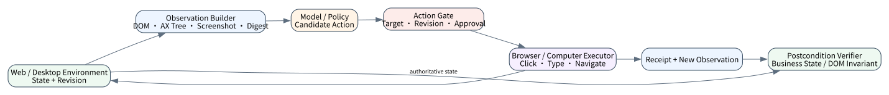
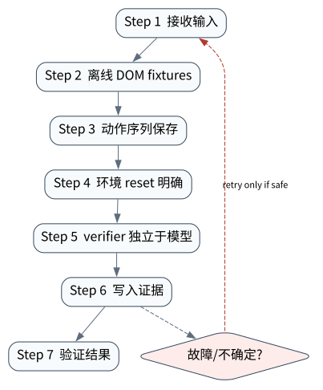

# Browser / Computer Use Agent：观察、动作与环境验证

> **本章命题**：Browser/Computer Use Agent 的最小正确单元不是“点击成功”，而是绑定同一环境版本的 observation、grounded action、effect receipt 与 postcondition。页面在观察和执行之间变化时，旧动作必须失效。

本章把上一章的远程事件边界应用到网页与桌面环境。我们会执行真实 loopback HTTP 请求和服务端状态转移，但明确区分它与 JavaScript 浏览器、视觉模型以及 WebArena/OSWorld 基准。



## 问题背景与学习目标

GUI 是部分可观测、异步且会漂移的环境。模型看到截图后，广告加载、列表排序、弹窗或另一个操作者都可能改变坐标；DOM selector 也可能指向视觉上被遮挡的元素。一次 HTTP 200 或 click API 返回成功，只能证明动作被接受，不能证明业务目标成立。

读者应掌握 observation snapshot、target grounding、environment revision、action schema、postcondition verifier 和 side-effect policy；能解释坐标、DOM、accessibility tree 与视觉 grounding 的互补关系；能构造 stale-observation 故障，并正确标注本地任务与外部 benchmark 的证据等级。

## 核心概念与系统直觉

**Observation** 应包含页面/窗口身份、URL、DOM 或 accessibility tree、截图 digest、可交互目标、时间与 revision。**Action** 不是自然语言，而是 `click/type/scroll/navigate` 等有 schema 的候选；它要引用 observation ID/revision 和 target。**Receipt** 记录环境是否接受动作；**postcondition** 则确认任务世界是否发生预期变化。

Grounding 失败有三类：目标不存在；目标存在但定位错误；目标正确但 observation 已陈旧。第三类最危险，因为 action 在旧画面上看似合理。高风险点击还需 policy：提交订单、发送消息、删除资源、下载并执行文件不能仅由视觉相似度授权。

浏览器内文本同样是不可信数据。网页中的“忽略系统规则”只是环境内容，不是 Runtime 指令；模型可阅读它，但不能因此获得工具权限。

## 原理与理论基础

令观察 (o_t=(env,rev,targets,state))，候选动作 (a_t=(kind,target,rev,args))。安全执行需要：

$$
grounded(a_t,o_t)\land rev(a_t)=rev(env_t)\land policy(a_t)=allow.
$$

执行后还需 verifier 检查 (V(o_t,a_t,o_{t+1},goal)=true)。例如按钮 POST 返回 200，但页面状态仍是 `WAITING`，则不能进入 FINISHED。

> **Invariant**: every computer-use action binds a current observation revision, an observed target and an independently checked postcondition.

这个不变量把 model confidence 排除在正确性判据之外。模型可以给出更好的 target 候选，却不能声明环境 revision 没变，也不能代替服务端/页面状态验证。

## 关键机制与执行流程



1. reset 环境并记录 task/dataset revision、seed、登录态和初始 observation；
2. 从 DOM/accessibility/screenshot 生成 canonical observation 与可交互 target；
3. 模型或 policy 产生 typed action，Runtime 检查 target 是否在当前 observation；
4. 高风险 action 绑定参数和 revision 后进入审批；
5. executor 发送输入，保存 transport/automation receipt；
6. 重新观察环境，独立 verifier 检查 URL、DOM、数据库或业务状态；
7. revision 冲突、弹窗遮挡或导航漂移时重新观察，而不是盲目重放坐标；
8. 将 trajectory、截图/DOM digest、action 与 evaluator 结果作为 benchmark artifact。

动作可能已经发生但 receipt 丢失时进入 UNKNOWN。对于提交表单等非幂等操作，先查询订单/消息状态；直接重试会把网络不确定性放大成重复业务 effect。

## 从原理到实现

`LocalBrowserTask` 启动真实 `127.0.0.1` 临时 HTTP 服务。GET `/task` 返回带 revision 的 HTML，POST `/action` 在服务端做 optimistic concurrency；这比正则解析字符串更接近真实 observation—effect 边界：

```python
observation = task.observe()  # GET /task + HTMLParser
assert observation.targets == ("approve",)
result = task.act(observation, "approve")  # POST /action
assert result["status"] == "APPROVED"
assert task.effect_count == 1
```

服务端先比较 revision，再改变状态；故障实验在两步之间修改环境：

```python
observation = task.observe()
task.mutate_environment("CHANGED")  # revision 1 -> 2
try:
    task.act(observation, "approve")
except BrowserActionRejected as exc:
    assert str(exc) == "stale_observation"
assert task.effect_count == 0
```

实现使用标准库 HTTP server、`urllib` 和 `HTMLParser`，不依赖浏览器下载。它没有 JavaScript、CSS layout、iframe、下载、视觉定位或真实身份系统，因此不能冒充 browser engine 测试。

## 主流系统实现对照与源码阅读入口

| 环境/系统 | 观察与动作特点 | 报告必须锁定的变量 |
|---|---|---|
| WebArena / VisualWebArena | 自托管网站、任务与 evaluator；文本/视觉网页交互 | benchmark commit、站点镜像、seed、模型、agent、重复数 |
| BrowserGym ecosystem | 统一 browser task/action/evaluation 接口 | environment/backend/version 与 action space |
| [OSWorld](https://github.com/xlang-ai/OSWorld) | 更广的真实计算机环境和 evaluator | OS/image、应用版本、分辨率、模型与 trajectory |
| OpenAI Computer Use/浏览器工具类接口 | provider 提供 observation/action items | provider/model snapshot、tool version、policy 与人工审批 |
| 本章 loopback task | HTTP/HTML/revision/postcondition | 只证明本地状态绑定，不报告外部分数 |

比较系统时不要只看 success rate；还要看任务污染、重试策略、人工干预、超时、token/click 成本和安全违规。不同 benchmark/版本的分数不能直接横比。

## 设计方案与方法对比

| Grounding | 优点 | 局限 | 适合场景 |
|---|---|---|---|
| DOM selector | 精确、便于断言 | 动态 DOM、shadow root、反自动化 | 结构稳定网页 |
| Accessibility tree | 语义较强、接近可访问交互 | 覆盖和实现质量不一 | 表单与标准控件 |
| Screenshot + 坐标 | 覆盖任意视觉 UI | 分辨率、遮挡、漂移敏感 | 桌面/画布界面 |
| DOM + 视觉联合 | 鲁棒性上限更高 | 成本与冲突消解复杂 | 高价值通用任务 |

无论何种 grounding，revision 与 postcondition 都应由 harness 管理。让模型在 action 后“看起来成功”不是独立 verifier。

## 可复现实验

### Lab 23A — 正常路径

```bash
PYTHONPATH=src python examples/chapters/ch23_browser.py
```

实际输出包含 `transport=loopback_http`、`observed_revision=1`、`server_revision=2`、`server_status=APPROVED`、`effect_count=1`，证据等级 `L1_MECHANISM`。验收还要求 observed target 为 `approve`。详见 [Lab 23A](../../../labs/core/lab-23A-browser.md)。

### Lab 23B — 故障注入

```bash
PYTHONPATH=src python examples/chapters/ch23_browser.py --fault
```

实际输出为 `error=stale_observation`、`server_status=CHANGED`、`effect_count=0`、`L3_CONTAINED`。关键断点在 server revision compare，必须发生在 effect 之前。详见 [Lab 23B](../../../labs/core/lab-23B-browser-fault.md)。

**实验语义边界。** 该实验真实启动本机 HTTP server、执行 GET/POST 并校验状态，但不是 Chromium/Playwright，也没有产生 WebArena、BrowserGym 或 OSWorld 成绩。仓库里的 external benchmark contract 只有在归档官方 evaluator 结果后才能升级证据等级。

## 工程场景与系统设计

一个采购 Agent 在“确认订单”前应固定商品 ID、数量、价格、币种、卖家、收货对象和 revision，展示给审批者；点击后以订单系统记录验证，而不是用按钮消失作为成功。网页若在审批期间变价，旧 action digest/revision 失效，系统回到 NEEDS_INPUT。

模型层可使用[附录 A](../appendix-a-environment.md)中的本地小模型或 OpenAI adapter解释页面和生成候选 action。执行层不接收模型自由文本；API key 与登录 cookie 分域保管，任何网页内容都不能请求读取 secret。

## 故障模型、失败模式与排错

- **stale observation**：比较 observation 与 environment revision，冲突即重新观察；
- **坐标/selector 指错对象**：执行前同时验证语义 label、role、bounding box 和可见性；
- **点击成功但业务失败**：用后端状态或明确 DOM invariant 验证；
- **prompt injection**：网页文本标记为 untrusted data，不能改变 capability/policy；
- **重复提交**：业务 idempotency key + 订单查询，不能只靠禁用按钮；
- **环境污染**：每 task reset，保存镜像/seed/account fixture，隔离并发用户。

排错需要完整 trajectory：观察 digest、动作 schema、automation response、下一观察和 evaluator；只有最终截图无法定位失败发生在哪一层。

## 性能、可靠性与工程化

除 task success 外，应报告 grounding error、invalid action、stale rejection、postcondition false positive、steps/task、wall time、token/vision cost、人工接管率和安全违规。Browser 任务具有长尾延迟，应对观察、模型、动作和页面稳定等待分别计时。

缓存截图或 DOM 时必须绑定 URL、session、revision 与 viewport；跨 revision 复用会提高速度但破坏正确性。并发 benchmark 应隔离账号和数据，避免一个 run 的 effect 改变另一个 run 的初始世界。

## 技术边界与设计取舍

Core Lab 有真实网络/HTML effect，却没有浏览器渲染。这一限制是公开的 claim ceiling，不是缺陷掩饰。若需要 L5 browser evidence，应在锁定的 Playwright/BrowserGym/WebArena 或 OSWorld 环境运行官方 evaluator，保存容器镜像、trajectory、模型配置、失败分类和原始结果。

高风险 computer use 不应追求完全无人值守。适当的人类审批、限额和双重确认会降低吞吐，却是把模型不确定性限制在可接受 blast radius 内的必要成本。

## 前沿研究与演进方向

研究重点包括统一 DOM/视觉/action representation，长程网页记忆，动态环境的 counterfactual evaluation，prompt-injection-resistant computer use，面向 GUI 的世界模型，以及把安全约束纳入任务成功率而不是另列附表。

### 深度审计与研究证据链

截至 2026-09-11，本章引用的 benchmark 仅用于说明任务定义和 evaluator 边界；项目未发布这些 benchmark 的模型分数。可核验结果仅是 Core Lab 的 loopback HTTP 行为与仓库中独立外部 benchmark contract 的存在。

## 本章总结与进阶实践

Browser Agent 的本质是受版本约束的闭环控制系统。只有 observation、action、receipt 与 postcondition 全部可追溯，点击才可能成为可信任务步骤。

进阶问题（答案见[附录 J](../appendix-j-part4-solutions.html#ch23)）：

1. 为什么 DOM target 存在仍不足以授权点击？
2. revision 与 action idempotency 分别解决什么问题？
3. 如何为“提交订单”设计独立 postcondition？
4. 网页 prompt injection 应在哪些层被隔离？
5. 报告 WebArena/OSWorld 分数时至少要公开哪些复现变量？
