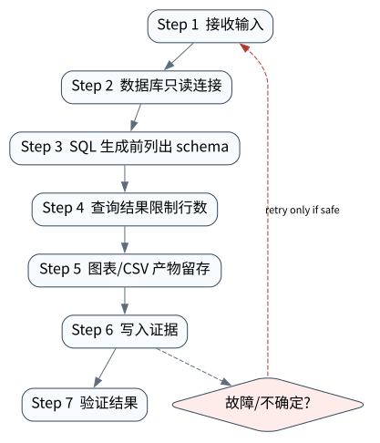

# Data Agent：SQL、Python 与可审计分析

> **本章核心判断**：Data Agent 需要把自然语言问题变成可审计查询、可解释计算和可复现图表，避免把数据库写权限交给模型。

上一章：Browser / Computer Use Agent：观察、动作与环境验证。本章把前一章已经建立的能力进一步推进到 `Schema introspection`；下一章将进入：Research Agent：证据链、引用与报告生成。


## 问题背景与学习目标

Data Agent 需要把自然语言问题变成可审计查询、可解释计算和可复现图表，避免把数据库写权限交给模型。

在本章的 `Schema introspection` 场景中，真实 Agent 系统与普通“问答程序”的差异，在于一次任务会跨越模型、工具、状态、外部环境和人工治理边界。本章所有原理、代码与实验都围绕这些可验证问题展开。


**本章完成标准：**

- **机制理解**：能够解释“Data Agent 需要把自然语言问题变成可审计查询、可解释计算和可复现图表，避免把数据库写权限交给模型。”，并指出它对应的确定性软件边界；
- **正确性判断**：能够针对 `analysis agents should separate read-only query privileges from write privileges` 构造一个反例，说明证据不足时系统为什么不能继续乐观执行；
- **实验与迁移**：运行 `Lab 24A` / `Lab 24B`，分别说明 normal/fault 的 evidence level，并把同一机制映射到至少一个上游实现或协议。

## 核心概念与系统直觉

本节不把概念当作术语清单，而是回答三个工程问题：它**是什么**、在系统里**负责什么**、以及它失效时**会留下什么可观测证据**。

### Schema introspection

**定义。** 读取表、列、键、类型、指标定义和 semantic layer，使 Agent 知道数据结构与业务语义的过程。

**系统责任。** 它为 query planning 提供结构事实，并应结合权限只暴露允许的数据对象；业务指标定义要优先于列名猜测。

**失败边界。** 缺少 introspection 时模型容易编造表/列或错误 join；过度暴露 metadata 又可能泄露敏感结构。

### Read‑only SQL

**定义。** 默认禁止写操作的查询执行面，仍需要 statement timeout、row/byte limit、cost guard 和敏感字段策略。

**系统责任。** Read‑only 是降低爆炸半径的第一层，而不是完整安全保证；runtime 还应记录 query、参数、结果摘要与数据版本。

**失败边界。** SELECT 仍可能造成全表扫描、锁竞争、侧信道或敏感数据外泄；只靠 SQL 关键字黑名单并不安全。

### Python analysis

**定义。** 在受控 sandbox 中用 dataframe、统计/ML 库和可复现脚本处理查询结果或文件。

**系统责任。** 它负责复杂变换、统计检验和可视化，并应固定输入 hash、代码、随机种子、依赖与输出 artifact。

**失败边界。** 允许任意 Python 访问网络/文件系统会扩大数据泄露面；只展示图表而不保存代码与输入版本也无法审计。

### Artifact

**定义。** Data Agent 交付的表格、图、notebook、SQL、报告或 dashboard，是可复核结果而不是聊天文本附件。

**系统责任。** Artifact 应包含 lineage：问题 → 数据源 → 查询/代码 → 变换 → 输出，并标明时间范围、指标定义和假设。

**失败边界。** 没有 lineage 的精美图表无法判断口径是否正确；把相关性、缺失数据或选择偏差隐藏在最终叙述里会制造高置信错误。

## 原理与理论基础

### 系统不变量

> **Invariant**：analysis agents should separate read-only query privileges from write privileges

不变量与普通“最佳实践”不同：最佳实践可以因为场景变化而替换，不变量一旦被破坏，系统就失去本章希望保证的正确性。例如 `SELECT * 泄漏敏感数据` 并不是一个 UI 问题，而是说明某个状态已经无法从证据中唯一判断。


### 故障模型

本章优先把 “模型编造不存在字段”、“分析代码不可复现”、“[ReAct: Synergizing Reasoning and Acting in Language Models](https://arxiv.org/abs/2210.03629)” 作为可证伪故障，而不是泛化地枚举所有异常。对涉及外部 effect 的失败，判定顺序固定为“最后 durable state → effect 是否可能发生 → 现有 observation 是否足够决定下一步”；证据不足时停在 UNKNOWN/显式失败。

### Why / What if / Trade-off

本章真正的设计取舍不是“使用更强模型还是写更多规则”，而是确定 **Schema introspection** 与 **Read-only SQL** 分别应该由概率性决策还是确定性软件拥有。模型可以帮助识别候选路径，但它不会自动消除“SELECT * 泄漏敏感数据”这类系统失败；该失败必须由 runtime 的 schema、状态机、权限或 verifier 显式约束。

如果把 Schema introspection 完全交给模型，系统会把不可验证的语言判断混入执行事实；如果把 Read-only SQL 全部硬编码为固定 workflow，又会失去开放任务所需的适应性。更稳健的边界是：让模型负责提出候选决策，让软件负责 `数据库只读连接`、`图表/CSV 产物留存` 以及对不变量 **analysis agents should separate read-only query privileges from write privileges** 的检查。

**What if。** 一旦“模型编造不存在字段”发生，系统首先需要判断现有证据是否足够决定下一状态；证据不足时应停在显式失败或待协调状态，而不是让模型用自然语言补全事实。这个边界决定了本章方案是否具有可恢复性，而不只是演示效果。


### 形式化模型与可证伪假设

$$
Artifact=F(Query,DataVersion,Code,SemanticDefs),\quad Lineage: Sources\rightarrow Transform\rightarrow Artifact
$$

Data Agent 的结果必须绑定查询、数据版本、代码和业务语义；“SQL 成功”不等于“业务结论正确”。

**可证伪假设。** 显式 semantic layer + lineage + query safety 能降低 wrong-join、metric drift 和不可审计分析。

**建议测量。** query correctness、semantic-definition coverage、lineage completeness、reproducible artifact rate。

## 关键机制与执行流程



**Step 1 — 数据库只读连接。** `数据库只读连接` 是“Data Agent：SQL、Python 与可审计分析”的一次显式状态转移。输入和输出都必须可序列化并关联 `run_id/step_id`；一旦该步骤失败，后继步骤只能依据已记录状态继续。关键观察点是 `Schema introspection` 是否仍满足 **analysis agents should separate read-only query privileges from write privileges**。

**Step 2 — SQL 生成前列出 schema。** `SQL 生成前列出 schema` 负责形成后续决策的输入。需要同时保存来源、版本/时间与必要的关联标识，避免把“当前看到的数据”误当成永远有效的事实。进入下一阶段前，对结构、权限和来源做最小验证，使 `Read-only SQL` 的状态能够在 trace 中被复现。

**Step 3 — 查询结果限制行数。** `查询结果限制行数` 是“Data Agent：SQL、Python 与可审计分析”的一次显式状态转移。输入和输出都必须可序列化并关联 `run_id/step_id`；一旦该步骤失败，后继步骤只能依据已记录状态继续。关键观察点是 `Python analysis` 是否仍满足 **analysis agents should separate read-only query privileges from write privileges**。

**Step 4 — 图表/CSV 产物留存。** `图表/CSV 产物留存` 是“Data Agent：SQL、Python 与可审计分析”的一次显式状态转移。输入和输出都必须可序列化并关联 `run_id/step_id`；一旦该步骤失败，后继步骤只能依据已记录状态继续。关键观察点是 `Artifact` 是否仍满足 **analysis agents should separate read-only query privileges from write privileges**。

在本章的 `Schema introspection` 场景中，**最后一步 — 验证。** verifier 针对 `Artifact` 检查本章不变量 **analysis agents should separate read-only query privileges from write privileges**。如果“SELECT * 泄漏敏感数据”使现有 artifact/外部状态不足以证明成功，结果必须停在显式失败或 UNKNOWN；只有 observation 能闭合状态转移时，流程才允许进入 FINISHED。

### 数据流与控制流

本章的数据/控制链按 **数据库只读连接 → SQL 生成前列出 schema → 查询结果限制行数 → 图表/CSV 产物留存** 推进。调试时不要只看最终 answer，应确认每一阶段的输入来源、状态版本和 observation；对“模型编造不存在字段”尤其要检查动作前后的证据是否足以闭合不变量 **analysis agents should separate read-only query privileges from write privileges**。


### 持久化点与崩溃窗口

本章需要持久化的内容取决于动作可逆性。与 `Schema introspection` 有关的纯计算状态通常可以重算；一旦 `SQL 生成前列出 schema` 可能产生昂贵、外部或不可逆效果，就必须在动作前后建立可区分的证据边界。对于本章不变量 **analysis agents should separate read-only query privileges from write privileges**，恢复时最重要的问题是：最后一个已知状态是什么、动作是否可能已经发生、现有 observation 能否唯一决定 retry/continue/compensate。


## 从原理到实现


### 完整实验入口

```python
from __future__ import annotations
import argparse
from agentlab.course_scenarios import run_scenario

def main() -> int:
 p=argparse.ArgumentParser(description='Data Agent：SQL、Python 与可审计分析')
 p.add_argument("--fault", action="store_true", help="inject the chapter-specific failure path")
 args=p.parse_args()
 result=run_scenario('data-agent', fault=args.fault)
 print(result.as_json())
 return 0 if result.passed else 2

if __name__ == "__main__":
 raise SystemExit(main())
```

### 核心机制实现

```python
def data_agent(fault=False):
 c=sqlite3.connect(':memory:'); c.executescript('create table invoices(id int, amount int); insert into invoices values(1,42),(2,58);')
 sql='select sum(amount) from invoices' if not fault else 'delete from invoices'
 read_only=sql.lstrip().lower().startswith(('select','with','pragma'))
 value=c.execute(sql).fetchone()[0] if read_only else None
 return _ok('data-agent',fault,{'sql':sql,'read_only':read_only,'value':value},'analysis agents should separate read-only query privileges from write privileges', (read_only and value==100) if not fault else not read_only)
```


### 简化假设与不能省略的机制


## 主流系统实现对照与源码阅读入口

| 项目 | 本书锁定版本/状态 | 应阅读的机制 | 已核验源码/文档入口 | 官方来源 |
|---|---|---|---|---|
| OpenAI Agents SDK | `v0.22.0 @ 4df9ecf` | 从 Agent/Runner 入口追踪 tool loop、RunState、session、guardrail 与 tracing；特别对照 v0.22.0 对 replay state 与 failed/incomplete response 的 hardening。 | 以官方 docs/release/source tree 为准 | [官方来源](https://github.com/openai/openai-agents-python) |
| Google Agent Development Kit | `v2.1.0 @ 6d15e19` | 比较 LlmAgent 与 Sequential/Parallel/Loop/graph workflow，把 session、sandbox、telemetry/evaluation 放在同一 runtime 视角下。 | 以官方 docs/release/source tree 为准 | [官方来源](https://github.com/google/adk-python) |
| Microsoft Agent Framework | `Python 1.13.0` | 从 Workflow executor/superstep/checkpoint 语义入手，对照 pending messages、requests/responses 与 shared state 的持久化边界。 | 以官方 docs/release/source tree 为准 | [官方来源](https://github.com/microsoft/agent-framework) |

### 源码阅读方法

源码阅读以 **OpenAI Agents SDK** 为第一参照，并只追与“Data Agent：SQL、Python 与可审计分析”直接相关的公开执行链：入口 → durable/session state → 权限或协议边界 → verifier/trace。若上游没有公开某个服务端组件，本章不根据客户端现象反推其内部 scheduler、queue 或 policy engine。


### 工业实现为什么更复杂


对本章最值得关注的工程增量是：如何避免“SELECT * 泄漏敏感数据”、如何在“模型编造不存在字段”后恢复，以及如何让 `图表/CSV 产物留存` 的结果能够进入 tracing/evaluation。只有这些机制都能落到公开类型、函数或协议消息上，才算真正完成源码对照。

## 设计方案与方法对比

| 方案 | 核心优势 | 主要局限 | 更适合的约束 |
|---|---|---|---|
| 最小自研 AgentLab | 机制透明、可断点、无网络即可故障注入 | 生态/模型能力有限 | 教学、研究原型、回归基线 |
| OpenAI Agents SDK | 官方/主流实现提供成熟抽象与生态 | 抽象会隐藏部分底层机制，需要源码/trace 反推 | 生产集成与方案对照 |
| Google Agent Development Kit | 状态/工作流抽象成熟，适合长任务与治理 | 框架状态不能自动解决外部副作用不确定性 | 企业 workflow、HITL、durable orchestration |
| Microsoft Agent Framework | 状态/工作流抽象成熟，适合长任务与治理 | 框架状态不能自动解决外部副作用不确定性 | 企业 workflow、HITL、durable orchestration |


## 可复现实验

本章两个 Core Lab 都直接执行仓库内的确定性代码；它们证明的是“Data Agent：SQL、Python 与可审计分析”对应的本地机制与 fault oracle，而不是外部 provider 或真实云环境。第三方实现只在 `labs/upstream/` 按独立 L5 互操作证据记录，未实际执行时必须保持 `EXTERNAL_NOT_RUN_IN_THIS_RELEASE`。

### 实验环境

统一 Python/OS/离线复现约束、安装步骤与工具链版本集中维护在[附录 A](../appendix-a-environment.md)。本章只增加与“Data Agent：SQL、Python 与可审计分析”直接相关的 normal/fault 双轨验证；若需要真实云、浏览器、GPU 或第三方 provider，则在对应 upstream lab 中单独标记 `NOT_RUN_EXTERNAL`，不把未运行结果计入核心实验。

### Lab 24A — 正常路径

```bash
PYTHONPATH=src python examples/chapters/ch24_data_agent.py
```

**关键断点：**
- `src/agentlab/course_scenarios.py::data_agent`
- `examples/chapters/ch24_data_agent.py::main`

**本发布包实际输出：**

```json
{"contained": false, "evidence_level": "L1_MECHANISM", "evidence_meaning": "normal_path_assertion_satisfied", "fault": false, "fault_injected": false, "invariant": "analysis agents should separate read-only query privileges from write privileges", "invariant_holds": true, "observation": {"read_only": true, "sql": "select sum(amount) from invoices", "value": 100}, "oracle_detected": false, "passed": true, "recovered": false, "scenario": "data-agent", "system_detected": false}
```

PASS：退出码 0，`passed=true`、`fault=false`、`invariant_holds=true`；这只证明确定性 fixture 的正常机制断言。完整手册：[Lab 24A](../../../labs/core/lab-24A-data-agent.md)。

### Lab 24B — 故障注入

```bash
PYTHONPATH=src python examples/chapters/ch24_data_agent.py --fault
```

**本发布包实际输出：**

```json
{"contained": true, "evidence_level": "L3_CONTAINED", "evidence_meaning": "fault_detected_and_contained", "fault": true, "fault_injected": true, "invariant": "analysis agents should separate read-only query privileges from write privileges", "invariant_holds": true, "observation": {"read_only": false, "sql": "delete from invoices", "value": null}, "oracle_detected": true, "passed": true, "recovered": false, "scenario": "data-agent", "system_detected": true}
```

PASS：退出码 0，`passed=true`、`fault=true`、`oracle_detected=true`。本章故障实验为 **L3_CONTAINED**：被测组件检测并 fail-closed/约束了故障，但不声明已恢复业务结果。 `passed=true` 本身只表示实验 oracle 得到预期观察。完整手册：[Lab 24B](../../../labs/core/lab-24B-data-agent-fault.md)。

### 观察与证据


## 工程场景与系统设计

本章沿用第 20 章工程 Agent 负载，重点将数据库查询/代码执行放入隔离 workspace，并要求结果 lineage 和写操作 policy 可审计。


### 上线前必须补齐

- 围绕 **Data Agent** 建立可审计状态字段与最小权限；
- 为本章相关动作记录 run_id、step_id、输入摘要与 observation；
- 对 `数据 Agent 必须把 SQL/Python 执行、结果、图表和权限审计分离。` 这一边界建立自动化验收；
- 为本章主要故障窗口配置 trace、日志和恢复 runbook；
- 上线前把教学 fixture 替换为真实 provider/tool/workspace，并重新执行 normal/fault 两条路径。

## 故障模型、失败模式与排错

本章至少主动测试以下失败：

- **SELECT * 泄漏敏感数据**：先确认最后 durable state，再检查是否已经产生外部效果；不要先重试。
- **模型编造不存在字段**：先确认最后 durable state，再检查是否已经产生外部效果；不要先重试。
- **分析代码不可复现**：先确认最后 durable state，再检查是否已经产生外部效果；不要先重试。


## 性能、可靠性与工程化

### 应采集指标

- `task success rate`
- `verifier pass rate`
- `tool steps/task`
- `workspace/sandbox violations`
- `artifact correctness`
- `wall-clock/cost per task`


### 优化顺序


任何优化都必须重新运行 Lab A/B。尤其当优化改变 `Read-only SQL` 的生命周期时，要重新验证 **analysis agents should separate read-only query privileges from write privileges**；否则平均延迟下降可能以更大的 stale state、重复副作用或取消失效为代价。

### 可靠性工程

本章可靠性 gate 直接针对 “模型编造不存在字段”、“分析代码不可复现”、“[ReAct: Synergizing Reasoning and Acting in Language Models](https://arxiv.org/abs/2210.03629)”：只有正常路径与对应 fault path 都保持 **analysis agents should separate read-only query privileges from write privileges**，优化或功能扩展才可接受。是否达到 detection、containment 或 recovery 以实验的 `evidence_level` 字段为准。


## 技术边界与设计取舍
本章方案有明确边界：

- coding/browser/data/research agent 的 verifier 都依赖真实环境可观测性
- 远程 workspace 和 browser 状态可能漂移，不能只依赖模型记忆
- 自动修改代码或数据必须区分只读、可逆和不可逆动作
- benchmark 成功不能直接外推到组织私有环境

选择方案时要回到本章边界：如果业务不能接受“SELECT * 泄漏敏感数据”，就必须为 `Schema introspection` 增加更强的确定性约束；如果主要任务是开放式探索，则可以把更多 `Read-only SQL` 决策交给模型，但要用 `图表/CSV 产物留存` 保持结果可验证。**OpenAI Agents SDK** 与 **Google Agent Development Kit** 的差异也应放在这些约束下理解，而不是抽象成通用框架排名。

Data Agent 的最大风险不是 SQL 语法，而是把推理结果误当数据事实。查询权限、schema 版本、结果 lineage、代码执行环境和统计假设必须可追踪；写数据库动作应与分析路径分离治理。

## 前沿研究与演进方向

当前研究和工业演进已经从“模型能否调用工具”推进到“怎样让长期、状态化、具有副作用的 Agent 可评估、可恢复、可治理”。与本章直接相关的资料：

- **[ReAct: Synergizing Reasoning and Acting in Language Models](https://arxiv.org/abs/2210.03629)**：提出 reasoning/action 交错轨迹，连接语言推理与外部环境动作。
- **[Toolformer: Language Models Can Teach Themselves to Use Tools](https://arxiv.org/abs/2302.04761)**：探索模型学习何时调用外部工具以及如何把工具结果纳入后续预测。
- **[OpenAI Agents SDK](https://github.com/openai/openai-agents-python)**（v0.22.0 @ 4df9ecf）：Agent/Runner/Tools/Handoffs/Guardrails/Sessions/HITL/Tracing；0.22.0 包含 runtime hardening。
- **[Google Agent Development Kit](https://github.com/google/adk-python)**（v2.1.0 @ 6d15e19）：Agent、workflow、sandbox、telemetry、evaluation/deployment 参考实现。


### 截至 2026-09-11 的研究更新

本节只记录会改变本章系统结论的研究或官方规范更新；实验仍使用仓库锁定版本，避免把“最新观察版本”与“可复现实验版本”混为一谈。
- OpenAI: Now everyone can put data to work（2026‑09‑10）：enterprise data agent, semantic layers, dashboards, approved data sources。
- OpenAI: Inside OpenAI’s in‑house data agent（2026‑01‑29）：enterprise data agent architecture, contextual data, permissions and self‑learning memory。

**本章吸收的变化。** Data Agent 的核心是可审计分析链。能执行 SQL/Python 不等于理解业务指标；semantic layer、read‑only policy 与 lineage 决定结果能否被复核。这些研究/规范的价值不在于替换本章原理，而在于把上述假设放进更真实、更长时或更高风险的环境中检验。

### Research Gap

围绕 `Schema introspection`，当前缺口不是“再增加一个 Agent API”，而是怎样把 **analysis agents should separate read-only query privileges from write privileges** 从局部实现经验升级为跨模型、跨 runtime 可验证的系统属性。现有工业实现已经能够提供 tool loop、session、graph、plugin 或 workspace 等抽象，但在“SELECT * 泄漏敏感数据”和“模型编造不存在字段”同时出现时，证据格式、恢复语义和评测方法仍缺少统一答案。

本章的研究更新不追求论文数量，而关注一个问题：现有工作是否真正推进了 **Data Agent** 的可验证性。OGX 和企业 Agent 平台说明模型无关 API 层正在出现，但数据权限和审计仍要由系统控制。 因此，本章会把论文结论放回不变量、失败窗口和实验断言中，而不是把研究当作参考文献列表。

### Open Problems

1. 如何把 `Schema introspection` 的正确性拆成可组合的局部不变量，并在不同 Agent runtime 中复用 verifier？
2. 当“SELECT * 泄漏敏感数据”与“模型编造不存在字段”同时发生时，**OpenAI Agents SDK** 与 **Google Agent Development Kit** 的公开抽象分别能保存哪些证据，哪些状态仍需要外部 reconciliation？
3. 如果模型能力显著提高，围绕 `Read-only SQL` 的哪些 harness 机制仍属于系统必要条件，哪些只是当前模型能力下的临时补丁？
4. 如何构造一个既保护真实业务数据、又能复现“分析代码不可复现”的公开 benchmark，使研究结果可以被第三方验证？


### 深度审计与研究证据链：Data Agent

本章重新审计后的核心结论是：**数据 Agent 必须把 SQL/Python 执行、结果、图表和权限审计分离。** 这句话只有在代码、实验、开源源码和研究证据四个层面同时成立时才有教学价值。仅靠定义或 API 示例无法证明它，因为 Agent Systems 的风险通常发生在模型决策与外部环境之间的缝隙里。

**与本章最相关的近期/基础研究与官方资料：**

- **[SWE-bench](https://github.com/swe-bench/SWE-bench)**：真实 GitHub issue + repo snapshot + test verifier，是 coding agent 评估基础。
- **[AIDev](https://arxiv.org/abs/2602.09185)**：以大规模 agent-authored PR 数据展示 coding agent 的真实软件工程影响。
- **[OpenHands Software Agent SDK](https://github.com/OpenHands/software-agent-sdk)**：提供 Conversation/Workspace/Event/Agent Server 公开边界。

这些资料与本章的关系不是“引用背书”，而是帮助读者识别设计边界。SQL sandbox、Notebook/Python runner、OpenAI Code Interpreter/Sandbox Agent 的公开边界可对照。 读者阅读源码时应主动寻找四个对象：输入如何进入系统、状态在哪里持久化、动作由谁执行、失败后谁负责恢复。

**实验语义边界。** 本章实验验证 Data Agent 的 workspace、verifier、artifact 或协作状态；证据等级定义与解释规则统一见附录 A，且 `passed=true` 不得跨级推导 containment/recovery。


## 本章总结与进阶实践

### 核心结论

1. 本章不变量是：**analysis agents should separate read-only query privileges from write privileges**；
2. `Schema introspection` 必须是可观察软件边界，而不是 prompt 约定；
3. `数据库只读连接` 与 `图表/CSV 产物留存` 之间必须有状态和证据连接；
4. 模型提出动作不等于系统已经执行，更不等于任务成功；
5. 正常路径只能证明功能，故障路径才能暴露恢复语义；
6. 开源实现的核心价值在于理解真实约束，不是复制 API；
7. 性能优化必须与可靠性/安全不变量一起重新验证；
8. 技术边界和未解决问题是高级系统设计的一部分。

### 常见误区

- SELECT * 泄漏敏感数据
- 模型编造不存在字段
- 分析代码不可复现

### 思考题与实践

- **Why：** 为什么 `Schema introspection` 不能只靠模型“记住”？
- **What if：** 如果在 `数据库只读连接` 与 `图表/CSV 产物留存` 之间 crash，当前证据足够恢复吗？
- **Programming：** 修改 `examples/chapters/ch24_data_agent.py` 或对应 scenario，让系统新增一种错误类型，但仍保持 invariant。
- **Engineering：** 把 Lab B 的故障改成 timeout/duplicate/crash 中另一种，写出状态机和恢复步骤。
- **Research：** 选择本章一个 Open Problem，阅读两篇相互不同的方法，给出你自己的实验设计和 falsifiable hypothesis。

下一章进入 **Research Agent：证据链、引用与报告生成**，它将复用本章已经建立的状态/证据边界，而不是重新从 API 使用开始。
