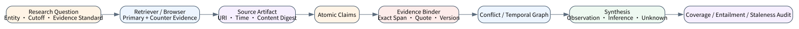
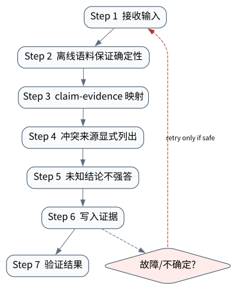

# Research Agent：证据链、引用与报告生成

> **本章命题**：Research Agent 的产品不是“像研究报告的文字”，而是一组可分解 claim 与其来源版本、精确证据片段、检索时间、冲突关系和推断过程。引用存在不等于引用支持结论。

Data Agent 把数值绑定到查询 artifact；本章把外部可核验陈述绑定到 source artifact。我们用真实文件、SHA-256 和精确字符区间验证引用漂移；下一章把研究流程编排进 durable graph。



## 问题背景与学习目标

研究型任务面临来源质量差异、网页更新、时间截止、同名实体、冲突证据和“引用装饰”。模型可能给出真实 URL，却让来源只支持相邻事实；也可能把发布日期当事件日期，或将二手报道覆盖官方规范。

读者应能构建 source artifact、claim-evidence graph、citation entailment、temporal validity 与 conflict set；区分 retrieval recall、source quality、claim support 和 synthesis quality；运行逐字节/逐字符引用实验，并知道何时必须输出 UNKNOWN 而不是补全事实。

## 核心概念与系统直觉

**Source artifact** 至少包含 URI、publisher、retrieved-at、content digest、正文/页码和许可信息；**claim** 是可单独判真假的陈述；**evidence edge** 指向精确 span/table/figure；**inference edge** 说明从证据到结论还做了哪些计算或假设。

引用验证有三个层级：地址有效；片段确实来自该版本；片段语义支持 claim。前两层可机械检查，第三层通常需要规则、模型或人工复核。若只保存 URL，网页改变后无法证明当时看到的内容；若只保存 quote，又可能失去上下文。

Primary source 并不总是自动正确，但对协议、版本、法律和产品行为通常应优先于二手摘要。多个来源冲突时，系统应保留 conflict set 和适用时间，而不是选一句最顺耳的话。

## 原理与理论基础

令报告主张集合为 (C)，来源集合为 (S)，证据边为 (E\subseteq C\times S\times Span)。最低覆盖率：

$$
coverage=\frac{|\{c\in C:\exists(s,span),(c,s,span)\in E\land verified\}|}{|C|}.
$$

覆盖率为 1 仍不代表研究正确，因为 span 可能不蕴含 claim、来源可能过时、推断可能无效。因而 verifier 还需检查 source digest、quote match、publisher/日期、冲突与 claim scope。

> **Invariant**: every externally checkable claim binds an exact source span and immutable source digest, or is explicitly marked unsupported/uncertain.

这一不变量允许没有答案，却不允许无证据的确定语气。内部建议、价值判断可有不同证据要求，但事实性数字、协议字段、版本行为和 benchmark 结论必须可追溯。

## 关键机制与执行流程



1. 把问题分解为带时间、实体与证据标准的 subquestions；
2. 先查官方/原始来源，再用高质量二手来源发现冲突或上下文；
3. 抓取后立即保存 retrieval time、content digest 和 locator；
4. 抽取 atomic claims，禁止一条引用挂在含多个事实的长句末尾；
5. 绑定精确 span/page/table，并执行 quote/digest 校验；
6. 对数字、版本、日期和否定陈述使用独立交叉验证；
7. 综合时保留 observation、inference、uncertainty 和 disagreement；
8. 发布前运行 citation coverage/entailment/staleness/URL 审计。

动态网页、登录墙和 PDF 解析会制造内容差异。无法合法保存全文时，至少保存允许范围内的 locator、短摘录、hash/metadata 与获取方式；同时尊重版权和访问条款。

## 从原理到实现

`EvidenceBinder` 读取真实 UTF-8 文件，保存 `file:` URI 与 SHA-256。绑定 claim 时检查 source 是否存在、span 是否越界以及 quote 是否逐字符相同：

```python
binder = EvidenceBinder()
source = binder.ingest_file("runtime-note", source_path)
claim = binder.bind(
    "完成状态需要独立验证器",
    "runtime-note",
    30, 50,
    "independent verifier",
)
assert claim.source_sha256 == source.sha256
```

如果内容或 offset 变化，旧 citation 不会静默接受：

```python
try:
    binder.bind("完成状态需要独立验证器", "runtime-note",
                30, 50, "outdated quotation")
except EvidenceViolation as exc:
    assert str(exc) == "quote_mismatch"
```

实现位于 `src/agentlab/specialized_system.py`。精确 quote 是必要条件，不是 entailment 充分条件；生产系统还要存 byte/page locator、HTML/PDF canonicalization、许可和访问时间。

## 主流系统实现对照与源码阅读入口

| 系统能力 | 应保留的证据 | 常见误区 |
|---|---|---|
| Web search / browsing tool | query、结果、打开页面、retrieved-at、引用 | 把 search snippet 当正文 |
| RAG/research pipeline | chunk/source/version、ranking、claim edge | 只评 retrieval，不评生成 claim |
| OpenAI Responses 内置搜索/文件工具 | response item、citation/annotation 与 provider trace | provider citation 不替代应用级 claim audit |
| 学术/规范研究 | DOI/版本/tag/发布日期、页码/章节 | 预印本、发布版、修订版混用 |
| 本章 EvidenceBinder | local artifact hash + exact span | 不证明来源权威性或语义蕴含 |

阅读任何 Research Agent 实现时，先确认 retrieval result 如何变成 durable source，再找 claim 与 citation 的结构；若中间只有 prompt 文本，就很难做系统性审计。

## 设计方案与方法对比

| 方案 | 成本 | 可审计性 | 适用任务 |
|---|---:|---:|---|
| 单次搜索后生成 | 低 | 低 | 低风险探索 |
| 检索—写作—统一引用 | 中 | 中 | 普通综述，但易 citation drift |
| claim-first evidence graph | 高 | 高 | 技术规范、尽调、研究报告 |
| 双代理/人工独立审计 | 更高 | 更高 | 高影响决策与发布 |

Claim-first 会增加结构化开销，却能精确定位“不支持”“过时”“冲突”和“推断过强”。模型规模不能消除来源治理问题。

## 可复现实验

### Lab 25A — 正常路径

```bash
PYTHONPATH=src python examples/chapters/ch25_research_agent.py
```

实际输出包含 `source_uri_scheme=file`、source digest、`span=[30,50]`、`quote=independent verifier` 和 `claim_bound=true`；证据等级 `L1_MECHANISM`。详见 [Lab 25A](../../../labs/core/lab-25A-research-agent.md)。

### Lab 25B — 故障注入

```bash
PYTHONPATH=src python examples/chapters/ch25_research_agent.py --fault
```

实际输出为 `error=quote_mismatch`、`claim_bound=false`、`L3_CONTAINED`。关键断点在实际 source slice 与 expected quote 比较，失败 claim 不进入报告。详见 [Lab 25B](../../../labs/core/lab-25B-research-agent-fault.md)。

验收要求是两条命令均退出 0；正常路径的 quote/span/digest 三者一致，故障路径不产生 `VerifiedClaim` 且 `effect` 不存在。`passed=true` 只说明该 claim-binding oracle 命中。

**实验语义边界。** 实验真实读文件并计算 hash，但没有联网检索，也没有证明 entailment 或来源质量。外部研究任务必须保存搜索/页面/PDF 证据，并遵守访问和版权限制。

## 工程场景与系统设计

要回答“某协议截至 2026-09-11 的稳定能力”，Agent 应先固定 cutoff，查官方规范/release/source，区分 stable、draft 和 proposal；每个能力 claim 指向确切章节/commit。若官方来源互相矛盾，则报告版本/时间差异，不能拼成一个不存在的统一状态。

可用[附录 A](../appendix-a-environment.md)的本地模型做 claim segmentation 和摘要，用 OpenAI 模型做候选检索/综合；但 source acquisition、hash、span、cutoff 与最终 citation verifier 均在模型之外。API key 不得进入 source artifact 或共享报告。

## 故障模型、失败模式与排错

- **URL 有效但不支持 claim**：做 claim-span entailment 复核；
- **来源更新导致 quote 漂移**：比较 content digest，保留旧版本或标记不可重现；
- **事件日期与发布日期混淆**：分别记录 occurred/published/updated/retrieved；
- **同名实体串线**：用 canonical entity ID、组织/版本上下文消歧；
- **二手来源覆盖官方规范**：按来源类型和问题类型设优先级；
- **只搜索支持观点的证据**：显式执行反例/冲突搜索并保存负面结果。

排错以 claim 为单位，而不是重读整篇报告：定位 evidence edge，检查 source version、span、语义和推断步骤。

## 性能、可靠性与工程化

指标包括 source retrieval success、primary-source ratio、claim coverage、citation precision、entailment error、staleness、conflict resolution、unsupported-claim rate、cost/claim 和 audit time。长报告的平均覆盖率会掩盖关键 claim，应按风险加权。

搜索缓存键应包含 query、locale、time cutoff 和 provider；页面缓存包含 URI、retrieved-at、ETag/last-modified（若有）及 content digest。缓存过期策略取决于来源变动速度，不能统一设置。

## 技术边界与设计取舍

保存 source snapshot 会提高复现性，但受版权、隐私和访问许可约束；项目应保存最小必要证据并记录许可。对高风险领域，Research Agent 只能辅助证据整理，不能取代领域专家、法律/医学审查。

引用数量不是质量指标。少量直接支持核心 claim 的权威证据，通常优于大量相互转述的二手链接；同时也要防止“官方单一来源”掩盖现实争议。

## 前沿研究与演进方向

前沿方向包括 claim-level retrieval、长文档结构化定位、多模态表格/图证据、时间感知知识、citation entailment evaluator、自动冲突图、research trajectory benchmark，以及可验证但保护来源版权的 provenance。

### 深度审计与研究证据链

截至 2026-09-11，本章只把可访问的公开来源作为研究输入，并用本地文件实验验证 digest/span 机制。任何“全面”“最新”或“优于”主张都需要公开检索范围、遗漏风险和 evaluator；不能由流畅文风代替。

## 本章总结与进阶实践

Research Agent 的质量上限由 claim—evidence 对齐、时间版本和冲突治理决定。允许输出 UNKNOWN，是保持证据完整性的能力而不是失败。

进阶问题（答案见[附录 J](../appendix-j-part4-solutions.html#ch25)）：

1. URL、quote 和 entailment 为什么是三个不同验证层级？
2. claim coverage 为 100% 为什么仍可能错误？
3. 如何处理网页更新导致的 citation drift？
4. 研究截止日期应进入哪些数据结构？
5. 怎样评测 Research Agent 而不只评价报告文风？
