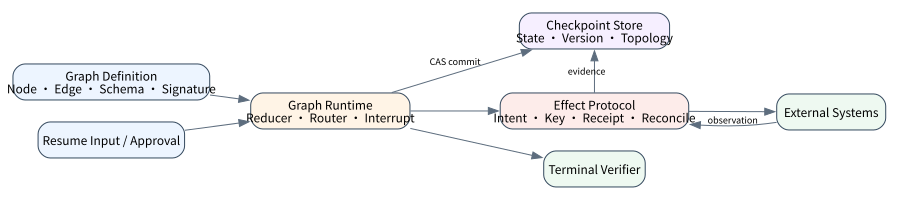
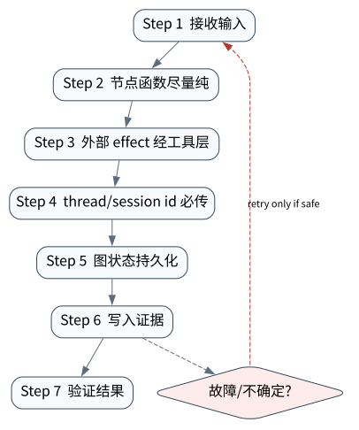

# Graph Runtime：LangGraph / ADK / MAF 的共同抽象

> **本章核心判断**：Graph Runtime 把复杂 Agent 拆成状态图、节点、边、checkpoint 和 interrupt；它适合混合确定性流程与模型决策。

上一章：Research Agent：证据链、引用与报告生成。本章把前一章已经建立的能力进一步推进到 `State graph`；下一章将进入：A2A 与 Multi-Agent 互操作。



## 问题背景与学习目标

Graph Runtime 把复杂 Agent 拆成状态图、节点、边、checkpoint 和 interrupt；它适合混合确定性流程与模型决策。

在本章的 `State graph` 场景中，真实 Agent 系统与普通“问答程序”的差异，在于一次任务会跨越模型、工具、状态、外部环境和人工治理边界。本章所有原理、代码与实验都围绕这些可验证问题展开。


**本章完成标准：**

- **机制理解**：能够解释“Graph Runtime 把复杂 Agent 拆成状态图、节点、边、checkpoint 和 interrupt；它适合混合确定性流程与模型决策。”，并指出它对应的确定性软件边界；
- **正确性判断**：能够针对 `durable workflow recovery depends on persisted graph state, not prompt memory` 构造一个反例，说明证据不足时系统为什么不能继续乐观执行；
- **实验与迁移**：运行 `Lab 26A` / `Lab 26B`，分别说明 normal/fault 的 evidence level，并把同一机制映射到至少一个上游实现或协议。

## 核心概念与系统直觉

本节不把概念当作术语清单，而是回答三个工程问题：它**是什么**、在系统里**负责什么**、以及它失效时**会留下什么可观测证据**。

### State graph

**定义。** 把长期任务表示为显式 state 与 transition 的图，使控制流、数据依赖和恢复点可检查。

**系统责任。** State graph 负责把开放决策嵌入确定性骨架：节点做计算/Agent 调用，边定义条件，state 保存可恢复事实。

**失败边界。** 把整条任务藏在递归 prompt 中会失去边界；反过来把每个微小决策都建成图节点又会造成状态爆炸。

### Node/Edge

**定义。** Node 是可执行单元，Edge 是根据 state、结果或 policy 选择的转移关系；两者共同定义控制语义。

**系统责任。** Node 应有明确输入/输出与失败契约，Edge 应可解释为何跳转；动态 edge 也应留下 decision evidence。

**失败边界。** 没有类型/契约的 node 会通过共享字典隐式耦合；条件 edge 若依赖模型自由文本， 恢复和测试都会脆弱。

### Checkpointer

**定义。** 在图运行中持久化 state/version，使 run 可从已知一致点恢复，而不是从头重放所有外部动作。

**系统责任。** Checkpointer 应与线程/tenant/run identity 绑定，并为并发写定义版本或 CAS 语义。

**失败边界。** 保存了 state 但没保存已发生 effect 的证据，恢复时仍可能重复调用外部系统； checkpoint 也不是事务万能替代。

### Interrupt

**定义。** 在特定节点暂停图执行，把当前 state 与待决动作持久化后交给人或外部系统，再从同一逻辑点恢复。

**系统责任。** Interrupt 适合审批、缺参、长等待和异步 callback；resume 必须验证 state version 与输入来源。

**失败边界。** 只在内存里 pause 会在进程重启后丢失；恢复到旧版本 state 则可能对已经改变的外部世界重复动作。

## 原理与理论基础

### 系统不变量

> **Invariant**：durable workflow recovery depends on persisted graph state, not prompt memory

不变量与普通“最佳实践”不同：最佳实践可以因为场景变化而替换，不变量一旦被破坏，系统就失去本章希望保证的正确性。例如 `图状态和外部状态不一致` 并不是一个 UI 问题，而是说明某个状态已经无法从证据中唯一判断。


### 故障模型

本章优先把 “图状态和外部状态不一致”、“checkpoint 当成 durable execution 全部”、“人工修改状态无审计” 作为可证伪故障，而不是泛化地枚举所有异常。对涉及外部 effect 的失败，判定顺序固定为“最后 durable state → effect 是否可能发生 → 现有 observation 是否足够决定下一步”；证据不足时停在 UNKNOWN/显式失败。

### Why / What if / Trade-off

本章真正的设计取舍不是“使用更强模型还是写更多规则”，而是确定 **State graph** 与 **Node/Edge** 分别应该由概率性决策还是确定性软件拥有。模型可以帮助识别候选路径，但它不会自动消除“图状态和外部状态不一致”这类系统失败；该失败必须由 runtime 的 schema、状态机、权限或 verifier 显式约束。

如果把 State graph 完全交给模型，系统会把不可验证的语言判断混入执行事实；如果把 Node/Edge 全部硬编码为固定 workflow，又会失去开放任务所需的适应性。更稳健的边界是：让模型负责提出候选决策，让软件负责 `节点函数尽量纯`、`图状态持久化` 以及对不变量 **durable workflow recovery depends on persisted graph state, not prompt memory** 的检查。

**What if。** 一旦“checkpoint 当成 durable execution 全部”发生，系统首先需要判断现有证据是否足够决定下一状态；证据不足时应停在显式失败或待协调状态，而不是让模型用自然语言补全事实。这个边界决定了本章方案是否具有可恢复性，而不只是演示效果。


### 形式化模型与可证伪假设

$$
S_{t+1}=Node_i(S_t),\qquad i=Edge(S_t,result,policy)
$$

Graph Runtime 把状态、节点和边显式化，适合需要恢复、分支和治理的 Agent workflow。

**可证伪假设。** 显式 graph + checkpointer 比隐式 loop 在故障恢复和分支回归中更少出现状态漂移。

**建议测量。** checkpoint resume、branch coverage、state divergence、node retry rate。

## 关键机制与执行流程



**Step 1 — 节点函数尽量纯。** `节点函数尽量纯` 是“Graph Runtime：LangGraph / ADK / MAF 的共同抽象”的一次显式状态转移。输入和输出都必须可序列化并关联 `run_id/step_id`；一旦该步骤失败，后继步骤只能依据已记录状态继续。关键观察点是 `State graph` 是否仍满足 **durable workflow recovery depends on persisted graph state, not prompt memory**。

**Step 2 — 外部 effect 经工具层。** `外部 effect 经工具层` 是“Graph Runtime：LangGraph / ADK / MAF 的共同抽象”的一次显式状态转移。输入和输出都必须可序列化并关联 `run_id/step_id`；一旦该步骤失败，后继步骤只能依据已记录状态继续。关键观察点是 `Node/Edge` 是否仍满足 **durable workflow recovery depends on persisted graph state, not prompt memory**。

**Step 3 — thread/session id 必传。** `thread/session id 必传` 是“Graph Runtime：LangGraph / ADK / MAF 的共同抽象”的一次显式状态转移。输入和输出都必须可序列化并关联 `run_id/step_id`；一旦该步骤失败，后继步骤只能依据已记录状态继续。关键观察点是 `Checkpointer` 是否仍满足 **durable workflow recovery depends on persisted graph state, not prompt memory**。

**Step 4 — 图状态持久化。** `图状态持久化` 把短暂执行状态转换为后续能够读取的证据。写入内容至少要能关联本次 run、前一状态与下一状态；对 crash-sensitive 数据，应明确写入完成的判据。若进程在写入期间终止，恢复代码必须能够区分“没有记录”“完整记录”和“损坏/不确定记录”，而不能把半写状态视作成功。

在本章的 `State graph` 场景中，**最后一步 — 验证。** verifier 针对 `Interrupt` 检查本章不变量 **durable workflow recovery depends on persisted graph state, not prompt memory**。如果“图状态和外部状态不一致”使现有 artifact/外部状态不足以证明成功，结果必须停在显式失败或 UNKNOWN；只有 observation 能闭合状态转移时，流程才允许进入 FINISHED。

### 数据流与控制流

本章的数据/控制链按 **节点函数尽量纯 → 外部 effect 经工具层 → thread/session id 必传 → 图状态持久化** 推进。调试时不要只看最终 answer，应确认每一阶段的输入来源、状态版本和 observation；对“图状态和外部状态不一致”尤其要检查动作前后的证据是否足以闭合不变量 **durable workflow recovery depends on persisted graph state, not prompt memory**。


### 持久化点与崩溃窗口

本章需要持久化的内容取决于动作可逆性。与 `State graph` 有关的纯计算状态通常可以重算；一旦 `外部 effect 经工具层` 可能产生昂贵、外部或不可逆效果，就必须在动作前后建立可区分的证据边界。对于本章不变量 **durable workflow recovery depends on persisted graph state, not prompt memory**，恢复时最重要的问题是：最后一个已知状态是什么、动作是否可能已经发生、现有 observation 能否唯一决定 retry/continue/compensate。


## 从原理到实现


### 完整实验入口

```python
from __future__ import annotations
import argparse
from agentlab.course_scenarios import run_scenario

def main() -> int:
 p=argparse.ArgumentParser(description='Graph Runtime：LangGraph / ADK / MAF 的共同抽象')
 p.add_argument("--fault", action="store_true", help="inject the chapter-specific failure path")
 args=p.parse_args()
 result=run_scenario('workflow-graph', fault=args.fault)
 print(result.as_json())
 return 0 if result.passed else 2

if __name__ == "__main__":
 raise SystemExit(main())
```

### 核心机制实现

```python
def workflow_graph(fault=False):
 graph={'collect':['analyze'],'analyze':['approve'],'approve':['apply'],'apply':['verify'],'verify':[]}
 checkpointed={'collect','analyze'}
 if fault: checkpointed=set()
 resumable='analyze' in checkpointed
 return _ok('workflow-graph',fault,{'graph':graph,'checkpointed':sorted(checkpointed),'resumable':resumable},'durable workflow recovery depends on persisted graph state, not prompt memory',resumable if not fault else not resumable)
```


### 简化假设与不能省略的机制

“有数据库”不等于“有 durable execution”，“能读取 session”也不等于“能从原指令指针继续”。本仓库因此对三个框架运行互不替代的 pinned 实验：

| 框架与 pin | 实际跨进程边界 | 已证明 | 明确未证明 |
|---|---|---|---|
| LangGraph `1.2.11` + SQLite checkpointer `3.1.1` | 首进程停在 `interrupt`；新进程以相同 `thread_id` 和 `Command(resume=...)` 继续 approve/reject | graph checkpoint、两条恢复分支、节点前缀 replay 与 effect counter | 分布式 DB failover、任意 graph migration、外部 exactly-once |
| Google ADK `2.1.0` + `DatabaseSessionService` | 新进程从同一 SQLite 读取 session state/Event trajectory 并写 approve/deny 结果 | session 与 event 的数据库持久性 | 可恢复 instruction pointer、模型调用、任意工具 exactly-once |
| Microsoft Agent Framework Core `1.13.0` + `FileCheckpointStorage` | 第一进程在 durable superstep 后硬退出；第二进程先拒绝改变后的 graph signature，再用原图恢复 | checkpoint lineage、拓扑身份约束、单机文件恢复、effect once | meta-package integrations、分布式存储/故障转移、graph migration、外部 API exactly-once |

机器证据分别位于 [`langgraph-durable-restart`](../../../evidence/l5/langgraph-durable-restart/2026-09-12-macos-arm64-py313-v1.0.0/evidence.json)、[`google-adk-session-restart`](../../../evidence/l5/google-adk-session-restart/2026-09-12-macos-arm64-py313-v1.0.0/evidence.json) 与 [`maf-checkpoint-restart`](../../../evidence/l5/maf-checkpoint-restart/2026-09-12-macos-arm64-py313-v1.0.0/evidence.json)。特别注意 LangGraph 的 replay：`interrupt` 之前的节点代码可能重新执行，所以副作用必须幂等或放在可区分的 transaction/effect protocol 中。MAF 的文件存储适合单机实验，不应被解释为多 host durable store。


## 主流系统实现对照与源码阅读入口

| 项目 | 本书锁定版本/状态 | 应阅读的机制 | 已核验源码/文档入口 | 官方来源 |
|---|---|---|---|---|
| LangGraph | `langgraph==1.2.11 @ 644815f` | 从 StateGraph/CompiledGraph 与 checkpointer 语义入手，观察 node/edge/state/pending writes 如何支持 interrupt、resume 与 fault tolerance。 | 以官方 docs/release/source tree 为准 | [官方来源](https://github.com/langchain-ai/langgraph) |
| Google Agent Development Kit | `v2.1.0 @ 6d15e19` | 比较 LlmAgent 与 Sequential/Parallel/Loop/graph workflow，把 session、sandbox、telemetry/evaluation 放在同一 runtime 视角下。 | 以官方 docs/release/source tree 为准 | [官方来源](https://github.com/google/adk-python) |
| Microsoft Agent Framework | `Python 1.13.0` | 从 Workflow executor/superstep/checkpoint 语义入手，对照 pending messages、requests/responses 与 shared state 的持久化边界。 | 以官方 docs/release/source tree 为准 | [官方来源](https://github.com/microsoft/agent-framework) |

### 源码阅读方法

源码阅读以 **LangGraph** 为第一参照，并只追与“Graph Runtime：LangGraph / ADK / MAF 的共同抽象”直接相关的公开执行链：入口 → durable/session state → 权限或协议边界 → verifier/trace。若上游没有公开某个服务端组件，本章不根据客户端现象反推其内部 scheduler、queue 或 policy engine。


### 工业实现为什么更复杂


对本章最值得关注的工程增量是：如何避免“图状态和外部状态不一致”、如何在“checkpoint 当成 durable execution 全部”后恢复，以及如何让 `图状态持久化` 的结果能够进入 tracing/evaluation。只有这些机制都能落到公开类型、函数或协议消息上，才算真正完成源码对照。

## 设计方案与方法对比

| 方案 | 核心优势 | 主要局限 | 更适合的约束 |
|---|---|---|---|
| 最小自研 AgentLab | 机制透明、可断点、无网络即可故障注入 | 生态/模型能力有限 | 教学、研究原型、回归基线 |
| LangGraph | 状态/工作流抽象成熟，适合长任务与治理 | 框架状态不能自动解决外部副作用不确定性 | 企业 workflow、HITL、durable orchestration |
| Google Agent Development Kit | 状态/工作流抽象成熟，适合长任务与治理 | 框架状态不能自动解决外部副作用不确定性 | 企业 workflow、HITL、durable orchestration |
| Microsoft Agent Framework | 状态/工作流抽象成熟，适合长任务与治理 | 框架状态不能自动解决外部副作用不确定性 | 企业 workflow、HITL、durable orchestration |


## 可复现实验

本章两个 Core Lab 用最小图隔离“prompt memory 不是 checkpoint”这一不变量；上述三个官方框架实验则实际跨 OS 进程验证各自不同的 durability surface。它们是范围受限的外部实现证据，不等价于真实 provider、分布式存储或生产 exactly-once。

### 实验环境

统一 Python/OS/离线复现约束、安装步骤与工具链版本集中维护在[附录 A](../appendix-a-environment.md)。本章只增加与“Graph Runtime：LangGraph / ADK / MAF 的共同抽象”直接相关的 normal/fault 双轨验证；若需要真实云、浏览器、GPU 或第三方 provider，则在对应 upstream lab 中单独标记 `NOT_RUN_EXTERNAL`，不把未运行结果计入核心实验。

### Lab 26A — 正常路径

```bash
PYTHONPATH=src python examples/chapters/ch26_workflow_graph.py
```

**关键断点：**
- `src/agentlab/course_scenarios.py::workflow_graph`
- `examples/chapters/ch26_workflow_graph.py::main`

**本发布包实际输出：**

```json
{"contained": false, "evidence_level": "L1_MECHANISM", "evidence_meaning": "normal_path_assertion_satisfied", "fault": false, "fault_injected": false, "invariant": "durable workflow recovery depends on persisted graph state, not prompt memory", "invariant_holds": true, "observation": {"checkpointed": ["analyze", "collect"], "graph": {"analyze": ["approve"], "apply": ["verify"], "approve": ["apply"], "collect": ["analyze"], "verify": []}, "resumable": true}, "oracle_detected": false, "passed": true, "recovered": false, "scenario": "workflow-graph", "system_detected": false}
```

PASS：退出码 0，`passed=true`、`fault=false`、`invariant_holds=true`；这只证明确定性 fixture 的正常机制断言。完整手册：[Lab 26A](../../../labs/core/lab-26A-workflow-graph.md)。

### Lab 26B — 故障注入

```bash
PYTHONPATH=src python examples/chapters/ch26_workflow_graph.py --fault
```

**本发布包实际输出：**

```json
{"contained": false, "evidence_level": "L2_ORACLE_ONLY", "evidence_meaning": "external_oracle_observed_bad_outcome_only", "fault": true, "fault_injected": true, "invariant": "durable workflow recovery depends on persisted graph state, not prompt memory", "invariant_holds": false, "observation": {"checkpointed": [], "graph": {"analyze": ["approve"], "apply": ["verify"], "approve": ["apply"], "collect": ["analyze"], "verify": []}, "resumable": false}, "oracle_detected": true, "passed": true, "recovered": false, "scenario": "workflow-graph", "system_detected": false}
```

PASS：退出码 0，`passed=true`、`fault=true`、`oracle_detected=true`。本章故障实验为 **L2_ORACLE_ONLY**：独立 oracle 观察到故障，但被测系统没有证明检测/约束/恢复。 `passed=true` 本身只表示实验 oracle 得到预期观察。完整手册：[Lab 26B](../../../labs/core/lab-26B-workflow-graph-fault.md)。

### 观察与证据


## 工程场景与系统设计

本章沿用第 20 章工程 Agent 负载，重点分析 graph 节点在并行 workspace 中的持久化和恢复语义；2 CPU/4 GiB 仍只是容量设计输入。


### 上线前必须补齐

- 围绕 **Graph Runtime** 建立可审计状态字段与最小权限；
- 为本章相关动作记录 run_id、step_id、输入摘要与 observation；
- 对 `Graph Runtime 把状态、边、节点、检查点和中断显式化。` 这一边界建立自动化验收；
- 为本章主要故障窗口配置 trace、日志和恢复 runbook；
- 上线前把教学 fixture 替换为真实 provider/tool/workspace，并重新执行 normal/fault 两条路径。

## 故障模型、失败模式与排错

本章至少主动测试以下失败：

- **图状态和外部状态不一致**：先确认最后 durable state，再检查是否已经产生外部效果；不要先重试。
- **checkpoint 当成 durable execution 全部**：先确认最后 durable state，再检查是否已经产生外部效果；不要先重试。
- **人工修改状态无审计**：先确认最后 durable state，再检查是否已经产生外部效果；不要先重试。


## 性能、可靠性与工程化

### 应采集指标

- `task success rate`
- `verifier pass rate`
- `tool steps/task`
- `workspace/sandbox violations`
- `artifact correctness`
- `wall-clock/cost per task`


### 优化顺序


任何优化都必须重新运行 Lab A/B。尤其当优化改变 `Node/Edge` 的生命周期时，要重新验证 **durable workflow recovery depends on persisted graph state, not prompt memory**；否则平均延迟下降可能以更大的 stale state、重复副作用或取消失效为代价。

### 可靠性工程

本章可靠性 gate 直接针对 “图状态和外部状态不一致”、“checkpoint 当成 durable execution 全部”、“人工修改状态无审计”：只有正常路径与对应 fault path 都保持 **durable workflow recovery depends on persisted graph state, not prompt memory**，优化或功能扩展才可接受。是否达到 detection、containment 或 recovery 以实验的 `evidence_level` 字段为准。


## 技术边界与设计取舍
本章方案有明确边界：

- coding/browser/data/research agent 的 verifier 都依赖真实环境可观测性
- 远程 workspace 和 browser 状态可能漂移，不能只依赖模型记忆
- 自动修改代码或数据必须区分只读、可逆和不可逆动作
- benchmark 成功不能直接外推到组织私有环境

选择方案时要回到本章边界：如果业务不能接受“图状态和外部状态不一致”，就必须为 `State graph` 增加更强的确定性约束；如果主要任务是开放式探索，则可以把更多 `Node/Edge` 决策交给模型，但要用 `图状态持久化` 保持结果可验证。**LangGraph** 与 **Google Agent Development Kit** 的差异也应放在这些约束下理解，而不是抽象成通用框架排名。

Graph Runtime 能显式表达分支与恢复点，但图结构本身不提供外部事务一致性。节点重放前仍需判断 effect outcome，持久化 store 也需要并发控制和版本语义。

## 前沿研究与演进方向

当前研究和工业演进已经从“模型能否调用工具”推进到“怎样让长期、状态化、具有副作用的 Agent 可评估、可恢复、可治理”。与本章直接相关的资料：

- **[Language Agent Tree Search](https://proceedings.mlr.press/v235/zhou24r.html)**：ICML 2024；把 tree search、环境反馈、反思和值函数组合到 Agent 决策。
- **[LangGraph](https://github.com/langchain-ai/langgraph)**（langgraph==1.2.11 @ 644815f）：状态图、durable execution、checkpointer、HITL、pending writes/fault tolerance。
- **[Google Agent Development Kit](https://github.com/google/adk-python)**（v2.1.0 @ 6d15e19）：Agent、workflow、sandbox、telemetry、evaluation/deployment 参考实现。


### 截至 2026-09-11 的研究更新

本节只记录会改变本章系统结论的研究或官方规范更新；实验仍使用仓库锁定版本，避免把“最新观察版本”与“可复现实验版本”混为一谈。
- LangGraph（langgraph==1.2.11 @ 644815f）：以 state/graph/checkpointer/interrupt 为核心，把 Agent 决策嵌入显式可恢复控制流。
- Google Agent Development Kit（课程 pin v2.1.0；latest observed 2.9.0 @ `1679384`，2026‑09‑10）：展示 agent/workflow/session/tool 的工程抽象；课程 pin 与生态最新观察分离。
- Microsoft Agent Framework 1.18.0（`3ad2b07`; released 2026‑09‑10）：latest observed Microsoft Agent Framework Python release。

**本章吸收的变化。** Graph Runtime 把开放 Agent 决策嵌入确定性状态机。节点契约、边条件、 checkpoint 和 interrupt 共同定义 durable control flow。这些研究/规范的价值不在于替换本章原理，而在于把上述假设放进更真实、更长时或更高风险的环境中检验。

### Research Gap

围绕 `State graph`，当前缺口不是“再增加一个 Agent API”，而是怎样把 **durable workflow recovery depends on persisted graph state, not prompt memory** 从局部实现经验升级为跨模型、跨 runtime 可验证的系统属性。现有工业实现已经能够提供 tool loop、session、graph、plugin 或 workspace 等抽象，但在“图状态和外部状态不一致”和“checkpoint 当成 durable execution 全部”同时出现时，证据格式、恢复语义和评测方法仍缺少统一答案。

本章的研究更新不追求论文数量，而关注一个问题：现有工作是否真正推进了 **Graph Runtime** 的可验证性。LangGraph、ADK 和 MAF 都把 workflow/graph 作为长任务治理核心，但图状态不自动解决外部副作用。 因此，本章会把论文结论放回不变量、失败窗口和实验断言中，而不是把研究当作参考文献列表。

### Open Problems

1. 如何把 `State graph` 的正确性拆成可组合的局部不变量，并在不同 Agent runtime 中复用 verifier？
2. 当“图状态和外部状态不一致”与“checkpoint 当成 durable execution 全部”同时发生时，**LangGraph** 与 **Google Agent Development Kit** 的公开抽象分别能保存哪些证据，哪些状态仍需要外部 reconciliation？
3. 如果模型能力显著提高，围绕 `Node/Edge` 的哪些 harness 机制仍属于系统必要条件，哪些只是当前模型能力下的临时补丁？
4. 如何构造一个既保护真实业务数据、又能复现“人工修改状态无审计”的公开 benchmark，使研究结果可以被第三方验证？


### 深度审计与研究证据链：Graph Runtime

本章重新审计后的核心结论是：**Graph Runtime 把状态、边、节点、检查点和中断显式化。** 这句话只有在代码、实验、开源源码和研究证据四个层面同时成立时才有教学价值。仅靠定义或 API 示例无法证明它，因为 Agent Systems 的风险通常发生在模型决策与外部环境之间的缝隙里。

**与本章最相关的近期/基础研究与官方资料：**

- **[SWE-bench](https://github.com/swe-bench/SWE-bench)**：真实 GitHub issue + repo snapshot + test verifier，是 coding agent 评估基础。
- **[AIDev](https://arxiv.org/abs/2602.09185)**：以大规模 agent-authored PR 数据展示 coding agent 的真实软件工程影响。
- **[OpenHands Software Agent SDK](https://github.com/OpenHands/software-agent-sdk)**：提供 Conversation/Workspace/Event/Agent Server 公开边界。

这些资料与本章的关系不是“引用背书”，而是帮助读者识别设计边界。LangGraph StateGraph、ADK Sequential/Parallel/Loop、MAF workflow executor 是主对照。 读者阅读源码时应主动寻找四个对象：输入如何进入系统、状态在哪里持久化、动作由谁执行、失败后谁负责恢复。

**实验语义边界。** 本章实验验证 Graph Runtime 的 workspace、verifier、artifact 或协作状态；证据等级定义与解释规则统一见附录 A，且 `passed=true` 不得跨级推导 containment/recovery。


## 本章总结与进阶实践

### 核心结论

1. 本章不变量是：**durable workflow recovery depends on persisted graph state, not prompt memory**；
2. `State graph` 必须是可观察软件边界，而不是 prompt 约定；
3. `节点函数尽量纯` 与 `图状态持久化` 之间必须有状态和证据连接；
4. 模型提出动作不等于系统已经执行，更不等于任务成功；
5. 正常路径只能证明功能，故障路径才能暴露恢复语义；
6. 开源实现的核心价值在于理解真实约束，不是复制 API；
7. 性能优化必须与可靠性/安全不变量一起重新验证；
8. 技术边界和未解决问题是高级系统设计的一部分。

### 常见误区

- 图状态和外部状态不一致
- checkpoint 当成 durable execution 全部
- 人工修改状态无审计

### 思考题与实践

- **Why：** 为什么 `State graph` 不能只靠模型“记住”？
- **What if：** 如果在 `节点函数尽量纯` 与 `图状态持久化` 之间 crash，当前证据足够恢复吗？
- **Programming：** 修改 `examples/chapters/ch26_workflow_graph.py` 或对应 scenario，让系统新增一种错误类型，但仍保持 invariant。
- **Engineering：** 把 Lab B 的故障改成 timeout/duplicate/crash 中另一种，写出状态机和恢复步骤。
- **Research：** 选择本章一个 Open Problem，阅读两篇相互不同的方法，给出你自己的实验设计和 falsifiable hypothesis。

下一章进入 **A2A 与 Multi-Agent 互操作**，它将复用本章已经建立的状态/证据边界，而不是重新从 API 使用开始。
