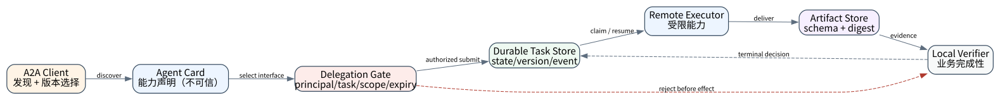
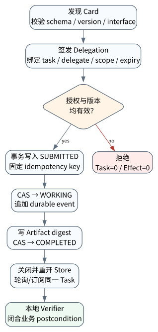

# A2A 与 Multi-Agent 互操作

> **本章核心判断**：A2A 解决的是异构 Agent 之间的发现、消息、任务、事件与 artifact 互操作；它不自动建立身份信任、委派授权、业务幂等或端到端完成性。真正可上线的边界必须同时证明 **wire contract 正确、调用者有权、任务可恢复、交付物可验证**。

上一章把执行过程建模为可恢复 graph；本章让该执行体跨进程、跨团队或跨厂商协作。下一章进一步讨论多个 Agent 在同一目标下的所有权、调度、隔离与成本守恒。



## 问题背景与学习目标

把另一个 Agent 包装成普通聊天接口，只能传递字符串，无法回答生产系统最关键的问题：远端声明的能力是否兼容？一次长任务如何查询、取消和恢复？重试是否创建了第二个任务？artifact 属于哪个 task/context？调用方是否真的有权要求该 Agent 写仓库或发布结果？

本章完成后，读者应能：

- 区分 Agent Card、Message、Task、Event、Artifact 与 delegation grant 的责任边界；
- 解释 MCP 的“模型—工具”互操作与 A2A 的“Agent—Agent”互操作为何互补而不互相替代；
- 用 task/context identity、状态机、版本号、idempotency key 与 artifact digest 构造可恢复任务；
- 证明“协议可达”不蕴含“调用有权”，并在落库或产生 effect 前拒绝越权委派；
- 正确解释 Core Lab 的 L1/L3 证据与官方 SDK 跨进程实验的 L5 证据，不把局部通过外推为全面兼容。

## 核心概念与系统直觉

> **Invariant**：任何远端任务状态变化与 artifact 发布，都必须能追溯到已认证主体、受 task 与 scope 约束且未过期的委派授权；协议消息格式正确不能替代授权成立。

**Agent Card 是能力发现文档，不是身份凭证。** Card 描述名称、接口、协议版本、输入输出 mode、skill、capability 与安全方案。客户端可据此选择 transport 和候选技能，但仍须验证 TLS/server identity、凭证、授权范围、版本和业务策略。公开 Card 即使带签名，也只证明声明的来源与完整性，不证明每个调用都获准。

**Message 是交互输入，Task 是可恢复工作单元。** Message 可以直接得到 Message，也可以创建或推进 Task。Task 需要稳定的 `id`、`contextId`、`status.state`、history/artifact 关联和并发控制。进程、HTTP 请求与 Task 不是同一对象：请求断开后 Task 可能继续，进程退出也不一定说明业务完成。

**Artifact 是交付证据，不是聊天措辞。** Artifact 应携带可解析 part、媒体类型、版本与 provenance。下游依据 digest、schema 和独立 verifier 判断能否消费；“Agent 说已完成”不能替代 artifact 或外部 observation。

**Context ID 与 Task ID 解决不同关联。** Context 表示多轮协作范围，Task 表示其中一个可管理工作单元。将两者混为单个 conversation ID，会使并行任务、重试、取消和历史截断产生歧义。

**Delegation 是协议之外的授权关系。** 本章把它写成

$$D=(principal,delegate,task,scope,issued,expiry,nonce,signature)$$

它回答“谁授权谁、为哪个任务、允许什么、到何时为止”。端点可连接、Card 宣称某 skill、甚至消息 schema 合法，都不能替代这个判断。

## 原理与理论基础

跨 Agent 任务可建模为受保护的状态机：

$$
S_0\xrightarrow{authorize+submit}S_{submitted}
\xrightarrow{claim}S_{working}
\xrightarrow{artifact+verify}S_{completed}
$$

安全转移不是只看目标状态，而是验证五元组：

$$
Allowed(s,a,d,v,e)=ProtocolValid\land Authorized(D,a)
\land VersionMatch(v)\land EffectSafe(e)
$$

其中 `a` 是 action，`d` 是 delegation，`v` 是任务版本，`e` 是可能的副作用。任一条件未知，运行时都不应让模型“猜测成功”。

本章使用四个不变量：

1. **身份绑定**：grant 的 delegate 与实际执行者一致；
2. **对象绑定**：grant 只对指定 task 与 scope 有效，并受有效期约束；
3. **状态单调**：Task 只能沿显式允许的边迁移，CAS 版本冲突必须失败；
4. **交付闭合**：COMPLETED 必须关联可验证 artifact digest，而不是只有终态标签。

Idempotency 还需区分三个层次：transport request ID 去重一次请求，task ID 标识一项工作，effect key 去重一个业务副作用。它们可以是一对多或多对一关系，不能共用一个字符串后宣称 exactly-once。

## 关键机制与执行流程



1. 客户端取得 Agent Card，校验结构、协议版本、interface 与所需 capability；Card 全部按不可信输入处理。
2. 调度方选择 task/context identity 和 idempotency key，并签发绑定 principal、delegate、task、scope、expiry、nonce 的 grant。
3. 服务端先验证签名、对象、scope 与时间，再在一个 durable transaction 中写入 `SUBMITTED`；授权失败不得留下半个任务。
4. Worker 以 expected version 将任务迁移为 `WORKING`。重复、乱序或旧版本事件被拒绝。
5. Artifact 先规范化并计算 digest，再与 `COMPLETED` 事件一同提交；订阅/轮询看到的是 durable log 的投影。
6. 重启后从 task store 恢复，而不是依赖旧 HTTP 连接或模型上下文。取消只请求停止后续工作；对已发生的外部 effect 仍需 reconciliation。

当网络超时发生在“远端 effect 已提交、客户端尚未收到 receipt”窗口时，任务状态必须进入可查询的 UNKNOWN/WORKING 语义，使用 task/effect identity 回查。盲目重发 `send message` 会把一次不确定结果变成两次真实 effect。

## 从原理到实现

Core Lab 的委派签发器使用 canonical JSON 与 HMAC-SHA256。HMAC 不是生产身份方案，而是用最少依赖执行“字段被篡改、scope 不足、task 不匹配、过期”四类验证：

```python
grant = authority.issue(
    principal="supervisor",
    delegate="researcher",
    task_id="task-27",
    scopes=("evidence.read", "artifact.publish"),
    issued_at=100,
    expires_at=200,
    nonce="nonce-27",
)

authority.verify(
    grant,
    delegate="researcher",
    task_id="task-27",
    required_scope="artifact.publish",
    now=150,
)
```

授权成功后，`A2ATaskLedger` 才允许落库。Task state 与 artifact digest 在 SQLite 中持久化，version 采用 compare-and-set 语义：

```python
submitted = ledger.submit(
    task_id="task-27",
    context_id="ctx-27",
    delegate="researcher",
    required_scope="artifact.publish",
    idempotency_key="send-27",
    grant=grant,
    now=150,
)
working = ledger.transition(
    "task-27",
    expected_version=submitted["version"],
    target="TASK_STATE_WORKING",
)
completed = ledger.complete(
    "task-27",
    expected_version=working["version"],
    artifact={"name": "evidence.json", "claims": 3, "verified": True},
)
```

实现位于 `src/agentlab/coordination_system.py`。它故意不自称 A2A SDK：wire schema 子集由 `protocols.py` 验证；真正的官方 SDK discovery、跨进程 JSON-RPC、`TaskUpdater` 与 artifact/effect 对账在独立 L5 evidence pack 中完成。这样“教学内核正确”和“官方实现互操作”不会被混成一个结论。

## 主流系统实现对照与源码阅读入口

截至知识截止日 2026-09-11，本书区分“课程复现 pin”与“最新观察到但未重新跑完全部实验的版本”：

| 对象 | 锁定/观察状态 | 本章读取的公开边界 | 证据结论 |
|---|---|---|---|
| [A2A Protocol](https://github.com/a2aproject/A2A) | spec `v1.0.1 @ 3303592` | operations、Task/Message/Artifact、Agent Card、security、JSON-RPC/gRPC/HTTP+JSON binding | 规范与 schema 对照 |
| [A2A Python SDK](https://github.com/a2aproject/a2a-python/releases/tag/v1.1.4) | source tag `v1.1.4 @ 2d4d304`；PyPI 实验 pin `a2a-sdk==1.1.2` | client discovery、request handler、task store、executor/updater | 已有一次跨进程 L5 scoped run |
| [Google ADK](https://github.com/google/adk-python) | 课程 pin `v2.1.0`；观察到 `v2.9.0` | remote agent、workflow/session/event 边界 | ADK durable evidence 不能替代 A2A 全 binding 兼容 |
| [OpenAI Agents SDK](https://github.com/openai/openai-agents-python) | 课程 pin `v0.22.0`；观察到 `v0.22.2` | handoff、agents-as-tools、session/tracing | 同进程 orchestration 不是 A2A transport |
| [Microsoft Agent Framework](https://github.com/microsoft/agent-framework) | 课程 pin Python `1.13.0`；观察到 `1.18.0` | workflow、checkpoint、hosting/replay | graph/runtime 证据不等于远端协议授权 |

源码阅读顺序应是：protocol definition → generated type → client discovery → server request handler → task store → executor/updater → cancel/subscribe → auth hook → test suite。只读 quickstart 会看见“怎样成功”，却看不见重复请求、旧版本、越权和崩溃窗口怎样失败。

## 设计方案与方法对比

| 方案 | 控制所有者 | 优点 | 不适用边界 |
|---|---|---|---|
| 同进程 agent-as-tool | manager runtime | 延迟低、trace 连续、部署简单 | 不是跨组织协议；权限仍需显式设计 |
| Handoff | 新 specialist | specialist 接管后提示更聚焦 | 会话所有权变化；history/filter 与授权必须审计 |
| A2A remote task | remote Agent | 可发现、异步、可轮询/订阅、支持 artifact | 不提供业务事务或天然信任 |
| 固定 workflow/RPC | 应用代码 | 最可预测，schema/重试易控制 | 开放式协商与动态 capability 较弱 |

选择标准不是“哪个更像智能体”，而是谁拥有最终答案、状态与副作用。可在同一系统中组合：manager 把 bounded subtask 当 tool，跨组织边界用 A2A，关键发布仍由确定性 workflow gate 执行。

## 可复现实验

### Lab 27A — 协议校验、委派与持久任务

```bash
PYTHONPATH=src python examples/chapters/ch27_a2a.py
```

本发布源码的实际输出关键字段如下：

```json
{"protocol_valid":true,"events":["task.submitted","task.status","task.artifact","task.status"],"task":{"state":"TASK_STATE_COMPLETED","version":3,"artifact_digest":"3a979031ea40ae788654bd7815172fe710853aa4dbb1c43861ff309b6602688a"},"reopened":true,"evidence_level":"L1_MECHANISM"}
```

该实验真实创建、关闭并重开 SQLite，验证授权后才落库、状态迁移顺序和 artifact digest 持久化。完整关键断点、环境与验收见 [Lab 27A](../../../labs/core/lab-27A-a2a.md)。

### Lab 27B — 越权 scope 故障注入

```bash
PYTHONPATH=src python examples/chapters/ch27_a2a.py --fault
```

实际关键输出：

```json
{"protocol_valid":true,"rejected":"delegation_scope_missing","persisted_tasks":0,"artifact_effects":0,"evidence_level":"L3_CONTAINED"}
```

故障特意保持 wire contract 合法，只把需求从 `artifact.publish` 改为未授予的 `repository.write`。系统在 insert 之前拒绝，所以不是“解析器碰巧报错”，而是授权边界真实 containment。完整步骤见 [Lab 27B](../../../labs/core/lab-27B-a2a-fault.md)。

### 外部 L5 证据与声明上限

仓库已有 pinned 官方 `a2a-sdk==1.1.2` 的 loopback 跨进程运行：客户端发现 `/.well-known/agent-card.json`，经 JSON-RPC 提交采购审查，服务端 `DefaultRequestHandler`、`InMemoryTaskStore`、`AgentExecutor` 和 `TaskUpdater` 产生 `SUBMITTED → WORKING → Artifact → COMPLETED`，并对账服务端 effect record。证据包位于 `evidence/l5/a2a-sdk-conformance/`。

这证明的是该 pin、该 binding、该 fixture 的 scoped interoperability；尚未证明跨语言矩阵、gRPC/HTTP+JSON 等价、远程 OAuth/mTLS、durable store、stream cancel、push notification 或生产负载。

## 工程场景与系统设计

设采购系统把“高风险供应商背景核查”委派给外部 Research Agent。正确链路不是发送一句“请核查”，而是：本地创建 task/context 和风险策略；Card 只用于发现；IAM 为 `vendor-017` 签发只读、15 分钟、不可转委派的 capability；远端返回带 source digest 的结构化 artifact；本地 verifier 检查覆盖率和来源；最终审批仍属于采购域服务。

模型可以负责理解问题、选 skill、生成检索计划或合成报告。本地小模型可通过附录 A 的 OpenAI-compatible endpoint 接入；需要更强语义能力时可选 OpenAI Responses/Agents SDK。无论 provider 是什么，API key 只从环境变量读取，且 task authorization、idempotency、artifact 校验和 effect gate 不交给模型决定。

## 故障模型、失败模式与排错

- **Card 缓存过期**：记录 card digest/ETag、取回时间和所选 interface；版本不兼容时重新发现；
- **Grant scope confused deputy**：验证 principal/delegate/task/audience/scope/expiry，全字段进入签名；
- **重复 submit**：用 idempotency key 查询既有 task；同 key 指向不同 task 必须冲突；
- **乱序事件**：事件带 task sequence/version，旧更新不覆盖新终态；
- **取消竞态**：区分 cancel requested、canceled 与 effect already committed，必要时协调补偿；
- **Artifact 投毒**：验证媒体类型、大小、hash、schema、provenance，并在隔离环境解析；
- **跨租户 context 泄漏**：task store 查询必须同时绑定 tenant/principal/context，而不是只按 task ID。

排错应从 durable task/event store 开始，再查 transport trace、授权 decision、artifact store 与 effect receipt；聊天 transcript 只能辅助说明意图。

## 性能、可靠性与工程化

至少测量 discovery cache hit、submit/first-event/completion 延迟、重试与 dedupe 率、stuck task age、cancel acknowledgement 与实际停止延迟、artifact bytes、授权拒绝原因、UNKNOWN duration 和 reconciliation success。

Streaming 降低首事件延迟，不降低任务总工作量；push notification 降低 polling，却增加 webhook 身份、重放与 SSRF 风险。Task history 不应无限增长：保留结构化事件与 artifact pointer，对大 payload 使用 content-addressed store；任何压缩都不能丢失终态、授权或 effect receipt。

## 技术边界与设计取舍

Core Lab 的 HMAC secret 是固定教学材料，不是凭证示范；没有 key rotation、revocation、OAuth、mTLS 或分布式数据库。SQLite 证明关闭/重开后的 durability，不证明多区域一致性。规范 helper 只覆盖课程用到的 A2A 1.0 wire 子集，不能替代生成的官方类型和 conformance suite。

反过来，官方 SDK 能成功交换消息也不能证明业务授权正确。协议互操作、身份/授权、任务持久化、外部 effect 和语义质量应分别测试、分别出证据，再在发布声明中求交集。

## 前沿研究与演进方向

前沿已从“Agent 能否互相聊天”转向可验证 delegation、跨组织 provenance、动态 capability negotiation、异步长任务的一致性、跨 binding 等价和 Agent 身份连续性。AIP 等研究尝试把 principal、delegate、scope 与证明带入 MCP/A2A；其价值在于指出协议消息与授权链之间的空隙，而不是意味着某个尚未部署的方案已成为事实标准。

另一个开放问题是语义兼容：两个 Agent 即使共享 JSON schema，也可能对“完成”“证据充分”或“取消”理解不同。未来 conformance 不应只做序列化 round-trip，还要提供状态轨迹、失败注入、artifact verifier 和安全策略的行为测试。

### 深度审计与研究证据链

本章事实截止到 2026-09-11。协议字段来自锁定的 A2A 规范/源码；官方 SDK 的 L5 结论来自仓库内可审计 evidence pack；Core Lab 的输出由本地代码重新执行。未运行的跨语言、远程认证、其他 binding 与压力测试明确记为未证明，不以“理论支持”替代实验结果。

## 本章总结与进阶实践

A2A 的本质不是“把 prompt 发给另一台机器”，而是让跨边界工作具有可发现接口、稳定 identity、明确生命周期和机器可验证交付。安全闭环还必须叠加任务绑定的授权、版本并发控制、幂等与外部 effect 协调。

进阶问题（答案见[附录 K](../appendix-k-part5-solutions.html#ch27)）：

1. 为什么签名 Agent Card 仍不能授权一次具体任务？
2. request ID、task ID、context ID 和 effect key 应怎样组合？
3. 取消成功为什么不必然等于业务副作用已撤销？
4. 如何把本章 scoped L5 扩展为跨语言、跨 binding 互操作矩阵？
5. 当远端返回 `COMPLETED` 而 artifact verifier 失败时，哪个状态才是本地事实？
