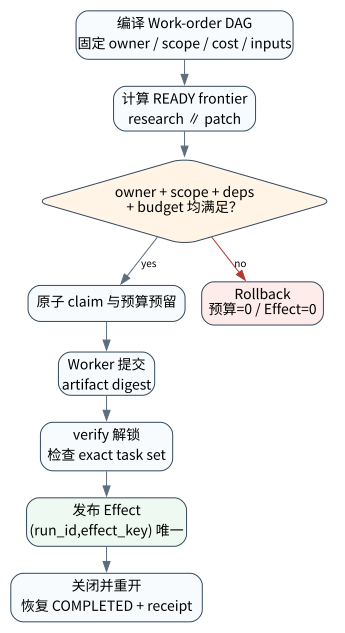

# Multi-Agent 协作：分工、隔离、调度与成本

> **本章核心判断**：多 Agent 的价值来自专业化、并行和隔离；风险来自竞态、上下文污染、重复工作和成本爆炸。

上一章：A2A 与 Multi-Agent 互操作。本章把前一章已经建立的能力进一步推进到 `Supervisor`；下一章将进入：Agent Evaluation：从最终答案到轨迹验证。


## 问题背景与学习目标

多 Agent 的价值来自专业化、并行和隔离；风险来自竞态、上下文污染、重复工作和成本爆炸。

在本章的 `Supervisor` 场景中，真实 Agent 系统与普通“问答程序”的差异，在于一次任务会跨越模型、工具、状态、外部环境和人工治理边界。本章所有原理、代码与实验都围绕这些可验证问题展开。


**本章完成标准：**

- **机制理解**：能够解释“多 Agent 的价值来自专业化、并行和隔离；风险来自竞态、上下文污染、重复工作和成本爆炸。”，并指出它对应的确定性软件边界；
- **正确性判断**：能够针对 `multi-agent specialization requires explicit ownership and context isolation` 构造一个反例，说明证据不足时系统为什么不能继续乐观执行；
- **实验与迁移**：运行 `Lab 28A` / `Lab 28B`，分别说明 normal/fault 的 evidence level，并把同一机制映射到至少一个上游实现或协议。

## 核心概念与系统直觉

本节不把概念当作术语清单，而是回答三个工程问题：它**是什么**、在系统里**负责什么**、以及它失效时**会留下什么可观测证据**。

### Supervisor

**定义。** 负责拆解、分配、预算、冲突处理和最终集成的协调角色，而不是天然更聪明的“总 Agent”。

**系统责任。** Supervisor 应根据 worker 能力/成本/权限路由任务，并使用 verifier 合并结果，避免只比较自然语言自信度。

**失败边界。** supervisor 自己成为上下文/决策瓶颈时，多 Agent 只增加 token 和延迟；单点错误还会同时放大到所有 worker。

### Worker

**定义。** 在受限上下文、权限和任务契约下执行子任务的 Agent 实例。

**系统责任。** Worker 的价值来自专业化、并行或隔离；其输出应是结构化 artifact/claim/state delta，而非无限自由聊天。

**失败边界。** 任务边界不清会重复劳动或产生冲突 effect；给所有 worker 全量秘密和权限会扩大攻击面。

### Blackboard

**定义。** 多个 Agent 共享事实、任务状态和中间 artifact 的协调存储，而不是公共聊天窗口。

**系统责任。** Blackboard 需要 schema、ownership、version/provenance 与冲突策略，使并行 worker 可以读取稳定事实而不是互相覆盖。

**失败边界。** 无并发控制的共享 memory 会产生 lost update、过期事实和错误传播；任何 worker 都可写“最终结论”则容易污染全局。

### Fan‑in/Fan‑out

**定义。** 把可并行子任务分发给多个 worker，再通过验证和聚合收敛到下一状态的执行模式。

**系统责任。** Fan‑out 适合独立搜索/分析， fan‑in 必须定义 dedup、conflict resolution、quorum 或 verifier，而非简单拼接回答。

**失败边界。** 并行度超过任务独立性后会产生协调成本、重复工具调用和 rate limit；错误 fan‑in 还会把互相矛盾的结果同时保留。

## 原理与理论基础

### 系统不变量

> **Invariant**：multi-agent specialization requires explicit ownership and context isolation

不变量与普通“最佳实践”不同：最佳实践可以因为场景变化而替换，不变量一旦被破坏，系统就失去本章希望保证的正确性。例如 `多个 agent 互相说服而非验证` 并不是一个 UI 问题，而是说明某个状态已经无法从证据中唯一判断。


### 故障模型

本章优先把 “多个 agent 互相说服而非验证”、“所有上下文共享”、“失败 worker 阻塞全局” 作为可证伪故障，而不是泛化地枚举所有异常。对涉及外部 effect 的失败，判定顺序固定为“最后 durable state → effect 是否可能发生 → 现有 observation 是否足够决定下一步”；证据不足时停在 UNKNOWN/显式失败。

### Why / What if / Trade-off

本章真正的设计取舍不是“使用更强模型还是写更多规则”，而是确定 **Supervisor** 与 **Worker** 分别应该由概率性决策还是确定性软件拥有。模型可以帮助识别候选路径，但它不会自动消除“多个 agent 互相说服而非验证”这类系统失败；该失败必须由 runtime 的 schema、状态机、权限或 verifier 显式约束。

如果把 Supervisor 完全交给模型，系统会把不可验证的语言判断混入执行事实；如果把 Worker 全部硬编码为固定 workflow，又会失去开放任务所需的适应性。更稳健的边界是：让模型负责提出候选决策，让软件负责 `共享状态有 schema`、`合并结果有 verifier` 以及对不变量 **multi-agent specialization requires explicit ownership and context isolation** 的检查。

**What if。** 一旦“所有上下文共享”发生，系统首先需要判断现有证据是否足够决定下一状态；证据不足时应停在显式失败或待协调状态，而不是让模型用自然语言补全事实。这个边界决定了本章方案是否具有可恢复性，而不只是演示效果。


### 形式化模型与可证伪假设

$$
U=\sum Gains-CoordinationCost-ConflictCost-EffectRisk
$$

Multi-Agent 的价值必须扣除协调、冲突和副作用风险；更多 Agent 并不单调提升系统质量。

**可证伪假设。** 在紧耦合任务中，worker 数增加会出现收益递减甚至负收益；显式资源仲裁可改善结果。

**建议测量。** speedup、coordination overhead、conflict rate、deadlock rate、cost per success。

## 关键机制与执行流程



**Step 1 — 共享状态有 schema。** `共享状态有 schema` 是“Multi-Agent 协作：分工、隔离、调度与成本”的一次显式状态转移。输入和输出都必须可序列化并关联 `run_id/step_id`；一旦该步骤失败，后继步骤只能依据已记录状态继续。关键观察点是 `Supervisor` 是否仍满足 **multi-agent specialization requires explicit ownership and context isolation**。

**Step 2 — agent 角色边界明确。** `agent 角色边界明确` 是“Multi-Agent 协作：分工、隔离、调度与成本”的一次显式状态转移。输入和输出都必须可序列化并关联 `run_id/step_id`；一旦该步骤失败，后继步骤只能依据已记录状态继续。关键观察点是 `Worker` 是否仍满足 **multi-agent specialization requires explicit ownership and context isolation**。

**Step 3 — 并行受预算控制。** `并行受预算控制` 是“Multi-Agent 协作：分工、隔离、调度与成本”的一次显式状态转移。输入和输出都必须可序列化并关联 `run_id/step_id`；一旦该步骤失败，后继步骤只能依据已记录状态继续。关键观察点是 `Blackboard` 是否仍满足 **multi-agent specialization requires explicit ownership and context isolation**。

**Step 4 — 合并结果有 verifier。** `合并结果有 verifier` 会改变信息或控制流的形态，因此必须说明哪些信息允许丢弃、哪些顺序必须保持、哪些状态不能合并。调试时记录变换前后的摘要与原因，确保 `Fan-in/Fan-out` 的关键状态在优化后仍满足 **multi-agent specialization requires explicit ownership and context isolation**。

在本章的 `Supervisor` 场景中，**最后一步 — 验证。** verifier 针对 `Fan-in/Fan-out` 检查本章不变量 **multi-agent specialization requires explicit ownership and context isolation**。如果“多个 agent 互相说服而非验证”使现有 artifact/外部状态不足以证明成功，结果必须停在显式失败或 UNKNOWN；只有 observation 能闭合状态转移时，流程才允许进入 FINISHED。

### 数据流与控制流

本章的数据/控制链按 **共享状态有 schema → agent 角色边界明确 → 并行受预算控制 → 合并结果有 verifier** 推进。调试时不要只看最终 answer，应确认每一阶段的输入来源、状态版本和 observation；对“多个 agent 互相说服而非验证”尤其要检查动作前后的证据是否足以闭合不变量 **multi-agent specialization requires explicit ownership and context isolation**。


### 持久化点与崩溃窗口

本章需要持久化的内容取决于动作可逆性。与 `Supervisor` 有关的纯计算状态通常可以重算；一旦 `agent 角色边界明确` 可能产生昂贵、外部或不可逆效果，就必须在动作前后建立可区分的证据边界。对于本章不变量 **multi-agent specialization requires explicit ownership and context isolation**，恢复时最重要的问题是：最后一个已知状态是什么、动作是否可能已经发生、现有 observation 能否唯一决定 retry/continue/compensate。


## 从原理到实现


### 完整实验入口

```python
from __future__ import annotations
import argparse
from agentlab.course_scenarios import run_scenario

def main() -> int:
 p=argparse.ArgumentParser(description='Multi-Agent 协作：分工、隔离、调度与成本')
 p.add_argument("--fault", action="store_true", help="inject the chapter-specific failure path")
 args=p.parse_args()
 result=run_scenario('multi-agent', fault=args.fault)
 print(result.as_json())
 return 0 if result.passed else 2

if __name__ == "__main__":
 raise SystemExit(main())
```

### 核心机制实现

```python
def multi_agent(fault=False):
 contexts={'researcher':['source:a'],'coder':['repo:x']}
 if fault: contexts['coder'].extend(contexts['researcher'])
 isolated=set(contexts['researcher']).isdisjoint(contexts['coder'])
 tasks={'researcher':'collect evidence','coder':'implement patch'}
 return _ok('multi-agent',fault,{'contexts':contexts,'tasks':tasks,'isolated':isolated},'multi-agent specialization requires explicit ownership and context isolation',isolated if not fault else not isolated)
```


### 简化假设与不能省略的机制


## 主流系统实现对照与源码阅读入口

| 项目 | 本书锁定版本/状态 | 应阅读的机制 | 已核验源码/文档入口 | 官方来源 |
|---|---|---|---|---|
| Google Agent Development Kit | `v2.1.0 @ 6d15e19` | 比较 LlmAgent 与 Sequential/Parallel/Loop/graph workflow，把 session、sandbox、telemetry/evaluation 放在同一 runtime 视角下。 | 以官方 docs/release/source tree 为准 | [官方来源](https://github.com/google/adk-python) |
| LangGraph | `langgraph==1.2.11 @ 644815f` | 从 StateGraph/CompiledGraph 与 checkpointer 语义入手，观察 node/edge/state/pending writes 如何支持 interrupt、resume 与 fault tolerance。 | 以官方 docs/release/source tree 为准 | [官方来源](https://github.com/langchain-ai/langgraph) |
| Anthropic: Building Effective Agents | `official engineering article` | 从简单、可组合的 workflow/agent 模式开始。 | 以官方 docs/release/source tree 为准 | [官方来源](https://www.anthropic.com/engineering/building-effective-agents) |

### 源码阅读方法

源码阅读以 **Google Agent Development Kit** 为第一参照，并只追与“Multi-Agent 协作：分工、隔离、调度与成本”直接相关的公开执行链：入口 → durable/session state → 权限或协议边界 → verifier/trace。若上游没有公开某个服务端组件，本章不根据客户端现象反推其内部 scheduler、queue 或 policy engine。


### 工业实现为什么更复杂


对本章最值得关注的工程增量是：如何避免“多个 agent 互相说服而非验证”、如何在“所有上下文共享”后恢复，以及如何让 `合并结果有 verifier` 的结果能够进入 tracing/evaluation。只有这些机制都能落到公开类型、函数或协议消息上，才算真正完成源码对照。

## 设计方案与方法对比

| 方案 | 核心优势 | 主要局限 | 更适合的约束 |
|---|---|---|---|
| 最小自研 AgentLab | 机制透明、可断点、无网络即可故障注入 | 生态/模型能力有限 | 教学、研究原型、回归基线 |
| Google Agent Development Kit | 状态/工作流抽象成熟，适合长任务与治理 | 框架状态不能自动解决外部副作用不确定性 | 企业 workflow、HITL、durable orchestration |
| LangGraph | 状态/工作流抽象成熟，适合长任务与治理 | 框架状态不能自动解决外部副作用不确定性 | 企业 workflow、HITL、durable orchestration |
| Anthropic: Building Effective Agents | 官方/主流实现提供成熟抽象与生态 | 抽象会隐藏部分底层机制，需要源码/trace 反推 | 生产集成与方案对照 |


## 可复现实验

本章两个 Core Lab 都直接执行仓库内的确定性代码；它们证明的是“Multi-Agent 协作：分工、隔离、调度与成本”对应的本地机制与 fault oracle，而不是外部 provider 或真实云环境。第三方实现只在 `labs/upstream/` 按独立 L5 互操作证据记录，未实际执行时必须保持 `EXTERNAL_NOT_RUN_IN_THIS_RELEASE`。

### 实验环境

统一 Python/OS/离线复现约束、安装步骤与工具链版本集中维护在[附录 A](../appendix-a-environment.md)。本章只增加与“Multi-Agent 协作：分工、隔离、调度与成本”直接相关的 normal/fault 双轨验证；若需要真实云、浏览器、GPU 或第三方 provider，则在对应 upstream lab 中单独标记 `NOT_RUN_EXTERNAL`，不把未运行结果计入核心实验。

### Lab 28A — 正常路径

```bash
PYTHONPATH=src python examples/chapters/ch28_multi_agent.py
```

**关键断点：**
- `src/agentlab/course_scenarios.py::multi_agent`
- `examples/chapters/ch28_multi_agent.py::main`

**本发布包实际输出：**

```json
{"contained": false, "evidence_level": "L1_MECHANISM", "evidence_meaning": "normal_path_assertion_satisfied", "fault": false, "fault_injected": false, "invariant": "multi-agent specialization requires explicit ownership and context isolation", "invariant_holds": true, "observation": {"contexts": {"coder": ["repo:x"], "researcher": ["source:a"]}, "isolated": true, "tasks": {"coder": "implement patch", "researcher": "collect evidence"}}, "oracle_detected": false, "passed": true, "recovered": false, "scenario": "multi-agent", "system_detected": false}
```

PASS：退出码 0，`passed=true`、`fault=false`、`invariant_holds=true`；这只证明确定性 fixture 的正常机制断言。完整手册：[Lab 28A](../../../labs/core/lab-28A-multi-agent.md)。

### Lab 28B — 故障注入

```bash
PYTHONPATH=src python examples/chapters/ch28_multi_agent.py --fault
```

**本发布包实际输出：**

```json
{"contained": false, "evidence_level": "L2_ORACLE_ONLY", "evidence_meaning": "external_oracle_observed_bad_outcome_only", "fault": true, "fault_injected": true, "invariant": "multi-agent specialization requires explicit ownership and context isolation", "invariant_holds": false, "observation": {"contexts": {"coder": ["repo:x", "source:a"], "researcher": ["source:a"]}, "isolated": false, "tasks": {"coder": "implement patch", "researcher": "collect evidence"}}, "oracle_detected": true, "passed": true, "recovered": false, "scenario": "multi-agent", "system_detected": false}
```

PASS：退出码 0，`passed=true`、`fault=true`、`oracle_detected=true`。本章故障实验为 **L2_ORACLE_ONLY**：独立 oracle 观察到故障，但被测系统没有证明检测/约束/恢复。 `passed=true` 本身只表示实验 oracle 得到预期观察。完整手册：[Lab 28B](../../../labs/core/lab-28B-multi-agent-fault.md)。

### 观察与证据


## 工程场景与系统设计

**教学工程设计输入（不是公开云厂商性能数据）：** 研究与实现任务拆给多个专长 Agent，再由 supervisor 合并证据和产物。设计输入：fan-out 上限 6、全局 token 预算、任务 DAG 无环、共享 artifact 通过对象存储而不是 prompt 复制。


### 上线前必须补齐

- 围绕 **Multi-Agent 协作** 建立可审计状态字段与最小权限；
- 为本章相关动作记录 run_id、step_id、输入摘要与 observation；
- 对 `多 Agent 的难点不是数量，而是协调、隔离、成本和重复工作。` 这一边界建立自动化验收；
- 为本章主要故障窗口配置 trace、日志和恢复 runbook；
- 上线前把教学 fixture 替换为真实 provider/tool/workspace，并重新执行 normal/fault 两条路径。

## 故障模型、失败模式与排错

本章至少主动测试以下失败：

- **多个 agent 互相说服而非验证**：先确认最后 durable state，再检查是否已经产生外部效果；不要先重试。
- **所有上下文共享**：先确认最后 durable state，再检查是否已经产生外部效果；不要先重试。
- **失败 worker 阻塞全局**：先确认最后 durable state，再检查是否已经产生外部效果；不要先重试。


## 性能、可靠性与工程化

### 应采集指标

- `fan-out width`
- `duplicate-work ratio`
- `handoff latency`
- `context isolation violations`
- `critical-path latency`
- `cost amplification`


### 优化顺序


任何优化都必须重新运行 Lab A/B。尤其当优化改变 `Worker` 的生命周期时，要重新验证 **multi-agent specialization requires explicit ownership and context isolation**；否则平均延迟下降可能以更大的 stale state、重复副作用或取消失效为代价。

### 可靠性工程

本章可靠性 gate 直接针对 “多个 agent 互相说服而非验证”、“所有上下文共享”、“失败 worker 阻塞全局”：只有正常路径与对应 fault path 都保持 **multi-agent specialization requires explicit ownership and context isolation**，优化或功能扩展才可接受。是否达到 detection、containment 或 recovery 以实验的 `evidence_level` 字段为准。


## 技术边界与设计取舍
本章方案有明确边界：

- 增加 Agent 数量不会自动增加正确性，可能只增加通信与成本
- 共享记忆会引入污染和竞态，完全隔离又会损失协同
- 跨组织 A2A 不能默认信任 Agent Card、message 或 artifact
- 分布式协调仍受超时、重试、重复消息和部分失败影响

选择方案时要回到本章边界：如果业务不能接受“多个 agent 互相说服而非验证”，就必须为 `Supervisor` 增加更强的确定性约束；如果主要任务是开放式探索，则可以把更多 `Worker` 决策交给模型，但要用 `合并结果有 verifier` 保持结果可验证。**Google Agent Development Kit** 与 **LangGraph** 的差异也应放在这些约束下理解，而不是抽象成通用框架排名。

Multi-Agent 增加分工能力，也增加消息放大、权限转移和错误传播路径。若无法界定每个 Agent 的职责、资源预算和可验证交付物，多 Agent 往往只是把单 Agent 的不确定性扩散到网络。

## 前沿研究与演进方向

当前研究和工业演进已经从“模型能否调用工具”推进到“怎样让长期、状态化、具有副作用的 Agent 可评估、可恢复、可治理”。与本章直接相关的资料：

- **[AgentBench: Evaluating LLMs as Agents](https://arxiv.org/abs/2308.03688)**：多环境 Agent benchmark，推动从答案评估转向交互任务评估。
- **[Google Agent Development Kit](https://github.com/google/adk-python)**（v2.1.0 @ 6d15e19）：Agent、workflow、sandbox、telemetry、evaluation/deployment 参考实现。
- **[LangGraph](https://github.com/langchain-ai/langgraph)**（langgraph==1.2.11 @ 644815f）：状态图、durable execution、checkpointer、HITL、pending writes/fault tolerance。


### 截至 2026-09-11 的研究更新

本节只记录会改变本章系统结论的研究或官方规范更新；实验仍使用仓库锁定版本，避免把“最新观察版本”与“可复现实验版本”混为一谈。
- Anthropic: Patterns and problems in emerging multiagent systems（2026‑08‑13）： multi‑agent interaction risks, institutions, scale and oversight。
- MultiAgentBench（arXiv 2503.01935; observed 2026‑09‑10）：multi‑agent。

- DPBench（arXiv 2602.13255）：显示带共享资源与同步条件的多 Agent 任务会出现严重 coordination/deadlock 问题，说明自然语言协商不能替代外部协调器。
**本章吸收的变化。** 多 Agent 只有在专业化/并行收益超过协调、上下文复制与冲突成本时才有价值；“更多 agent”不是单调增益。这些研究/规范的价值不在于替换本章原理，而在于把上述假设放进更真实、更长时或更高风险的环境中检验。

### Research Gap

围绕 `Supervisor`，当前缺口不是“再增加一个 Agent API”，而是怎样把 **multi-agent specialization requires explicit ownership and context isolation** 从局部实现经验升级为跨模型、跨 runtime 可验证的系统属性。现有工业实现已经能够提供 tool loop、session、graph、plugin 或 workspace 等抽象，但在“多个 agent 互相说服而非验证”和“所有上下文共享”同时出现时，证据格式、恢复语义和评测方法仍缺少统一答案。

本章的研究更新不追求论文数量，而关注一个问题：现有工作是否真正推进了 **Multi-Agent 协作** 的可验证性。MultiAgentBench、DPBench、MAFBench 都显示架构选择会显著影响协调成功率和延迟。 因此，本章会把论文结论放回不变量、失败窗口和实验断言中，而不是把研究当作参考文献列表。

### Open Problems

1. 如何把 `Supervisor` 的正确性拆成可组合的局部不变量，并在不同 Agent runtime 中复用 verifier？
2. 当“多个 agent 互相说服而非验证”与“所有上下文共享”同时发生时，**Google Agent Development Kit** 与 **LangGraph** 的公开抽象分别能保存哪些证据，哪些状态仍需要外部 reconciliation？
3. 如果模型能力显著提高，围绕 `Worker` 的哪些 harness 机制仍属于系统必要条件，哪些只是当前模型能力下的临时补丁？
4. 如何构造一个既保护真实业务数据、又能复现“失败 worker 阻塞全局”的公开 benchmark，使研究结果可以被第三方验证？


### 深度审计与研究证据链：Multi-Agent 协作

本章重新审计后的核心结论是：**多 Agent 的难点不是数量，而是协调、隔离、成本和重复工作。** 这句话只有在代码、实验、开源源码和研究证据四个层面同时成立时才有教学价值。仅靠定义或 API 示例无法证明它，因为 Agent Systems 的风险通常发生在模型决策与外部环境之间的缝隙里。

**与本章最相关的近期/基础研究与官方资料：**

- **[MCP 2026-07-28 specification](https://modelcontextprotocol.io/specification/2026-07-28)**：引入 stateless/self-contained request 与更明确的 tools/resources/prompts 边界。
- **[A2A Protocol](https://github.com/a2aproject/A2A)**：把 Agent Card、task、artifact、streaming/push 作为互操作对象。
- **[AIP](https://arxiv.org/abs/2603.24775)**：指出 MCP/A2A 互操作之外仍缺少可验证委托身份链。

这些资料与本章的关系不是“引用背书”，而是帮助读者识别设计边界。ADK multi-agent、MAF workflows、LangGraph supervisors 可对照拓扑与状态共享。 读者阅读源码时应主动寻找四个对象：输入如何进入系统、状态在哪里持久化、动作由谁执行、失败后谁负责恢复。

**实验语义边界。** 本章实验验证 Multi-Agent 协作的 workspace、verifier、artifact 或协作状态；证据等级定义与解释规则统一见附录 A，且 `passed=true` 不得跨级推导 containment/recovery。


## 本章总结与进阶实践

### 核心结论

1. 本章不变量是：**multi-agent specialization requires explicit ownership and context isolation**；
2. `Supervisor` 必须是可观察软件边界，而不是 prompt 约定；
3. `共享状态有 schema` 与 `合并结果有 verifier` 之间必须有状态和证据连接；
4. 模型提出动作不等于系统已经执行，更不等于任务成功；
5. 正常路径只能证明功能，故障路径才能暴露恢复语义；
6. 开源实现的核心价值在于理解真实约束，不是复制 API；
7. 性能优化必须与可靠性/安全不变量一起重新验证；
8. 技术边界和未解决问题是高级系统设计的一部分。

### 常见误区

- 多个 agent 互相说服而非验证
- 所有上下文共享
- 失败 worker 阻塞全局

### 思考题与实践

- **Why：** 为什么 `Supervisor` 不能只靠模型“记住”？
- **What if：** 如果在 `共享状态有 schema` 与 `合并结果有 verifier` 之间 crash，当前证据足够恢复吗？
- **Programming：** 修改 `examples/chapters/ch28_multi_agent.py` 或对应 scenario，让系统新增一种错误类型，但仍保持 invariant。
- **Engineering：** 把 Lab B 的故障改成 timeout/duplicate/crash 中另一种，写出状态机和恢复步骤。
- **Research：** 选择本章一个 Open Problem，阅读两篇相互不同的方法，给出你自己的实验设计和 falsifiable hypothesis。

下一章进入 **Agent Evaluation：从最终答案到轨迹验证**，它将复用本章已经建立的状态/证据边界，而不是重新从 API 使用开始。
