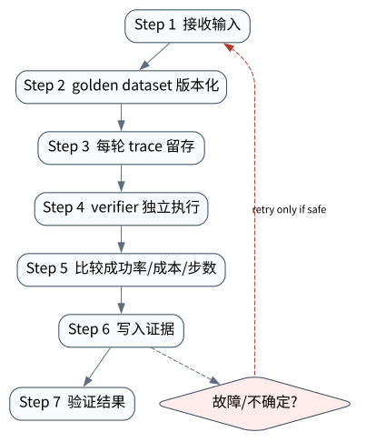

# Agent Evaluation：从最终答案到轨迹验证

> **本章核心判断**：Agent eval 要评估任务、环境、工具轨迹、artifact 和最终结果；只看最后回答无法说明系统是否可靠。

上一章：Multi-Agent 协作：分工、隔离、调度与成本。本章把前一章已经建立的能力进一步推进到 `Task spec`；下一章将进入：SWE-bench、OSWorld、PaperBench 与 MLE-bench。


## 问题背景与学习目标

Agent eval 要评估任务、环境、工具轨迹、artifact 和最终结果；只看最后回答无法说明系统是否可靠。

在本章的 `Task spec` 场景中，真实 Agent 系统与普通“问答程序”的差异，在于一次任务会跨越模型、工具、状态、外部环境和人工治理边界。本章所有原理、代码与实验都围绕这些可验证问题展开。


**本章完成标准：**

- **机制理解**：能够解释“Agent eval 要评估任务、环境、工具轨迹、artifact 和最终结果；只看最后回答无法说明系统是否可靠。”，并指出它对应的确定性软件边界；
- **正确性判断**：能够针对 `a verifier must evaluate observable task properties independently of the agent narrative` 构造一个反例，说明证据不足时系统为什么不能继续乐观执行；
- **实验与迁移**：运行 `Lab 29A` / `Lab 29B`，分别说明 normal/fault 的 evidence level，并把同一机制映射到至少一个上游实现或协议。

## 核心概念与系统直觉

本节不把概念当作术语清单，而是回答三个工程问题：它**是什么**、在系统里**负责什么**、以及它失效时**会留下什么可观测证据**。

### Task spec

**定义。** 描述输入、初始环境、允许能力、约束与成功条件的可执行任务定义。

**系统责任。** 好的 task spec 让模型/框架变化后仍能比较结果，并把业务目标转成 verifier 可以检查的 contract。

**失败边界。** spec 模糊会让 evaluator 在事后凭印象给分；隐藏关键约束则测试的是猜测而非能力。

### Trajectory

**定义。** 从 observation、decision、tool call、state transition 到 effect 的完整时间序列，是 Agent 行为的一级评测对象。

**系统责任。** Trajectory 允许定位失败发生在规划、工具选择、执行、恢复还是验证，并支持成本/风险/人工介入分析。

**失败边界。** 只评分最终答案会漏掉危险但“碰巧成功”的路径，也无法区分高成本试错与稳定策略。

### Verifier

**定义。** 把 task spec 映射成程序、环境检查、人类 rubric 或组合判据的独立评价组件。

**系统责任。** Verifier 应尽量依赖可观察外部事实，并记录自身版本、误差与 blind spot；高风险任务要使用多层 verifier。

**失败边界。** LLM‑as‑judge 若与被测模型共享偏差，或 judge 看不到真实环境 effect，可能给流畅但错误的轨迹高分。

### Regression

**定义。** 把历史失败、关键能力和安全事件固定为可重复 eval set，在模型、prompt、tool 或 runtime 变化后持续重跑。

**系统责任。** Regression 防止“平均 benchmark 提高却把关键业务场景改坏”，并把线上 incident 反馈回离线门禁。

**失败边界。** 只追新 benchmark 而不保留旧失败，会出现能力漂移；eval 数据污染又会让分数失去诊断意义。

## 原理与理论基础

### 系统不变量

> **Invariant**：a verifier must evaluate observable task properties independently of the agent narrative

不变量与普通“最佳实践”不同：最佳实践可以因为场景变化而替换，不变量一旦被破坏，系统就失去本章希望保证的正确性。例如 `用 LLM judge 替代全部 verifier` 并不是一个 UI 问题，而是说明某个状态已经无法从证据中唯一判断。


### 故障模型

本章优先把 “用 LLM judge 替代全部 verifier”、“没有环境 reset”、“只展示成功样本” 作为可证伪故障，而不是泛化地枚举所有异常。对涉及外部 effect 的失败，判定顺序固定为“最后 durable state → effect 是否可能发生 → 现有 observation 是否足够决定下一步”；证据不足时停在 UNKNOWN/显式失败。

### Why / What if / Trade-off

本章真正的设计取舍不是“使用更强模型还是写更多规则”，而是确定 **Task spec** 与 **Trajectory** 分别应该由概率性决策还是确定性软件拥有。模型可以帮助识别候选路径，但它不会自动消除“用 LLM judge 替代全部 verifier”这类系统失败；该失败必须由 runtime 的 schema、状态机、权限或 verifier 显式约束。

如果把 Task spec 完全交给模型，系统会把不可验证的语言判断混入执行事实；如果把 Trajectory 全部硬编码为固定 workflow，又会失去开放任务所需的适应性。更稳健的边界是：让模型负责提出候选决策，让软件负责 `golden dataset 版本化`、`比较成功率/成本/步数` 以及对不变量 **a verifier must evaluate observable task properties independently of the agent narrative** 的检查。

**What if。** 一旦“没有环境 reset”发生，系统首先需要判断现有证据是否足够决定下一状态；证据不足时应停在显式失败或待协调状态，而不是让模型用自然语言补全事实。这个边界决定了本章方案是否具有可恢复性，而不只是演示效果。


### 形式化模型与可证伪假设

$$
Score=V(Task,Trajectory,Environment,Artifact,Cost,Risk)
$$

Agent Evaluation 应验证任务、轨迹、环境、artifact、成本和风险，而不只比较最终文本。

**可证伪假设。** 只评 final answer 会高估包含 unsafe effect 或不可恢复步骤的轨迹。

**建议测量。** verified task success、trajectory validity、unsafe-success rate、cost-adjusted score。

## 关键机制与执行流程



**Step 1 — golden dataset 版本化。** `golden dataset 版本化` 是“Agent Evaluation：从最终答案到轨迹验证”的一次显式状态转移。输入和输出都必须可序列化并关联 `run_id/step_id`；一旦该步骤失败，后继步骤只能依据已记录状态继续。关键观察点是 `Task spec` 是否仍满足 **a verifier must evaluate observable task properties independently of the agent narrative**。

**Step 2 — 每轮 trace 留存。** `每轮 trace 留存` 把短暂执行状态转换为后续能够读取的证据。写入内容至少要能关联本次 run、前一状态与下一状态；对 crash-sensitive 数据，应明确写入完成的判据。若进程在写入期间终止，恢复代码必须能够区分“没有记录”“完整记录”和“损坏/不确定记录”，而不能把半写状态视作成功。

**Step 3 — verifier 独立执行。** 这一阶段可能改变系统或外部环境，因此 `verifier 独立执行` 不能只存在于模型文本中。runtime 在执行前绑定 `run_id/step_id` 与参数摘要，执行后记录结果或外部 observation；如果调用可能重复，必须同时定义幂等键或 reconciliation 依据。这里检查的核心是 **a verifier must evaluate observable task properties independently of the agent narrative**。

**Step 4 — 比较成功率/成本/步数。** `比较成功率/成本/步数` 不读取模型的自我评价，而读取 `Regression` 对应的 artifact、状态或环境事实。验证器应返回可机读结果，并在证据不足时保留失败/UNKNOWN，而不是为了让流程继续而猜测。这样才能把本章不变量 **a verifier must evaluate observable task properties independently of the agent narrative** 变成真正的验收条件。

在本章的 `Task spec` 场景中，**最后一步 — 验证。** verifier 针对 `Regression` 检查本章不变量 **a verifier must evaluate observable task properties independently of the agent narrative**。如果“用 LLM judge 替代全部 verifier”使现有 artifact/外部状态不足以证明成功，结果必须停在显式失败或 UNKNOWN；只有 observation 能闭合状态转移时，流程才允许进入 FINISHED。

### 数据流与控制流

本章的数据/控制链按 **golden dataset 版本化 → 每轮 trace 留存 → verifier 独立执行 → 比较成功率/成本/步数** 推进。调试时不要只看最终 answer，应确认每一阶段的输入来源、状态版本和 observation；对“用 LLM judge 替代全部 verifier”尤其要检查动作前后的证据是否足以闭合不变量 **a verifier must evaluate observable task properties independently of the agent narrative**。


### 持久化点与崩溃窗口

本章需要持久化的内容取决于动作可逆性。与 `Task spec` 有关的纯计算状态通常可以重算；一旦 `每轮 trace 留存` 可能产生昂贵、外部或不可逆效果，就必须在动作前后建立可区分的证据边界。对于本章不变量 **a verifier must evaluate observable task properties independently of the agent narrative**，恢复时最重要的问题是：最后一个已知状态是什么、动作是否可能已经发生、现有 observation 能否唯一决定 retry/continue/compensate。


## 从原理到实现


### 完整实验入口

```python
from __future__ import annotations
import argparse
from agentlab.course_scenarios import run_scenario

def main() -> int:
 p=argparse.ArgumentParser(description='Agent Evaluation：从最终答案到轨迹验证')
 p.add_argument("--fault", action="store_true", help="inject the chapter-specific failure path")
 args=p.parse_args()
 result=run_scenario('evaluation', fault=args.fault)
 print(result.as_json())
 return 0 if result.passed else 2

if __name__ == "__main__":
 raise SystemExit(main())
```

### 核心机制实现

```python
def evaluation(fault=False):
 expected={'status':'FINISHED','answer':'42'}; actual={'status':'FINISHED','answer':'42' if not fault else '41'}
 checks={'status':actual['status']==expected['status'],'answer':actual['answer']==expected['answer']}; passed=all(checks.values())
 return _ok('evaluation',fault,{'expected':expected,'actual':actual,'checks':checks},'a verifier must evaluate observable task properties independently of the agent narrative',passed if not fault else not passed)
```


### 简化假设与不能省略的机制


## 主流系统实现对照与源码阅读入口

| 项目 | 本书锁定版本/状态 | 应阅读的机制 | 已核验源码/文档入口 | 官方来源 |
|---|---|---|---|---|
| Anthropic: Demystifying evals for AI agents | `2026-01-09` | Agent eval 需要 task/environment/trajectory/grader 共同设计。 | 以官方 docs/release/source tree 为准 | [官方来源](https://www.anthropic.com/engineering/demystifying-evals-for-ai-agents) |
| Google Agent Development Kit | `v2.1.0 @ 6d15e19` | 比较 LlmAgent 与 Sequential/Parallel/Loop/graph workflow，把 session、sandbox、telemetry/evaluation 放在同一 runtime 视角下。 | 以官方 docs/release/source tree 为准 | [官方来源](https://github.com/google/adk-python) |
| SWE-bench | `benchmark source observed 2026-09-09` | 真实 GitHub issue + repository snapshot + Docker/test verifier。 | 以官方 docs/release/source tree 为准 | [官方来源](https://github.com/swe-bench/SWE-bench) |

### 源码阅读方法

源码阅读以 **Anthropic: Demystifying evals for AI agents** 为第一参照，并只追与“Agent Evaluation：从最终答案到轨迹验证”直接相关的公开执行链：入口 → durable/session state → 权限或协议边界 → verifier/trace。若上游没有公开某个服务端组件，本章不根据客户端现象反推其内部 scheduler、queue 或 policy engine。


### 工业实现为什么更复杂


对本章最值得关注的工程增量是：如何避免“用 LLM judge 替代全部 verifier”、如何在“没有环境 reset”后恢复，以及如何让 `比较成功率/成本/步数` 的结果能够进入 tracing/evaluation。只有这些机制都能落到公开类型、函数或协议消息上，才算真正完成源码对照。

## 设计方案与方法对比

| 方案 | 核心优势 | 主要局限 | 更适合的约束 |
|---|---|---|---|
| 最小自研 AgentLab | 机制透明、可断点、无网络即可故障注入 | 生态/模型能力有限 | 教学、研究原型、回归基线 |
| Anthropic: Demystifying evals for AI agents | 官方/主流实现提供成熟抽象与生态 | 抽象会隐藏部分底层机制，需要源码/trace 反推 | 生产集成与方案对照 |
| Google Agent Development Kit | 状态/工作流抽象成熟，适合长任务与治理 | 框架状态不能自动解决外部副作用不确定性 | 企业 workflow、HITL、durable orchestration |
| SWE-bench | 官方/主流实现提供成熟抽象与生态 | 抽象会隐藏部分底层机制，需要源码/trace 反推 | 生产集成与方案对照 |


## 可复现实验

本章两个 Core Lab 都直接执行仓库内的确定性代码；它们证明的是“Agent Evaluation：从最终答案到轨迹验证”对应的本地机制与 fault oracle，而不是外部 provider 或真实云环境。第三方实现只在 `labs/upstream/` 按独立 L5 互操作证据记录，未实际执行时必须保持 `EXTERNAL_NOT_RUN_IN_THIS_RELEASE`。

### 实验环境

统一 Python/OS/离线复现约束、安装步骤与工具链版本集中维护在[附录 A](../appendix-a-environment.md)。本章只增加与“Agent Evaluation：从最终答案到轨迹验证”直接相关的 normal/fault 双轨验证；若需要真实云、浏览器、GPU 或第三方 provider，则在对应 upstream lab 中单独标记 `NOT_RUN_EXTERNAL`，不把未运行结果计入核心实验。

### Lab 29A — 正常路径

```bash
PYTHONPATH=src python examples/chapters/ch29_evaluation.py
```

**关键断点：**
- `src/agentlab/course_scenarios.py::evaluation`
- `examples/chapters/ch29_evaluation.py::main`

**本发布包实际输出：**

```json
{"contained": false, "evidence_level": "L1_MECHANISM", "evidence_meaning": "normal_path_assertion_satisfied", "fault": false, "fault_injected": false, "invariant": "a verifier must evaluate observable task properties independently of the agent narrative", "invariant_holds": true, "observation": {"actual": {"answer": "42", "status": "FINISHED"}, "checks": {"answer": true, "status": true}, "expected": {"answer": "42", "status": "FINISHED"}}, "oracle_detected": false, "passed": true, "recovered": false, "scenario": "evaluation", "system_detected": false}
```

PASS：退出码 0，`passed=true`、`fault=false`、`invariant_holds=true`；这只证明确定性 fixture 的正常机制断言。完整手册：[Lab 29A](../../../labs/core/lab-29A-evaluation.md)。

### Lab 29B — 故障注入

```bash
PYTHONPATH=src python examples/chapters/ch29_evaluation.py --fault
```

**本发布包实际输出：**

```json
{"contained": false, "evidence_level": "L2_ORACLE_ONLY", "evidence_meaning": "external_oracle_observed_bad_outcome_only", "fault": true, "fault_injected": true, "invariant": "a verifier must evaluate observable task properties independently of the agent narrative", "invariant_holds": false, "observation": {"actual": {"answer": "41", "status": "FINISHED"}, "checks": {"answer": false, "status": true}, "expected": {"answer": "42", "status": "FINISHED"}}, "oracle_detected": true, "passed": true, "recovered": false, "scenario": "evaluation", "system_detected": false}
```

PASS：退出码 0，`passed=true`、`fault=true`、`oracle_detected=true`。本章故障实验为 **L2_ORACLE_ONLY**：独立 oracle 观察到故障，但被测系统没有证明检测/约束/恢复。 `passed=true` 本身只表示实验 oracle 得到预期观察。完整手册：[Lab 29B](../../../labs/core/lab-29B-evaluation-fault.md)。

### 观察与证据


## 工程场景与系统设计

**教学工程设计输入（不是公开云厂商性能数据）：** AgentOps 平台每天执行 5 万个任务，需要追踪成功率、成本、安全事件和恢复事件。设计输入：trace 保留 30 天、security incident fail-closed、回归 eval 作为发布 gate。


### 上线前必须补齐

- 围绕 **Agent Evaluation** 建立可审计状态字段与最小权限；
- 为本章相关动作记录 run_id、step_id、输入摘要与 observation；
- 对 `Agent 评测必须覆盖 final answer、trajectory、tool、state、effect、cost 和 safety。` 这一边界建立自动化验收；
- 为本章主要故障窗口配置 trace、日志和恢复 runbook；
- 上线前把教学 fixture 替换为真实 provider/tool/workspace，并重新执行 normal/fault 两条路径。

## 故障模型、失败模式与排错

本章至少主动测试以下失败：

- **用 LLM judge 替代全部 verifier**：先确认最后 durable state，再检查是否已经产生外部效果；不要先重试。
- **没有环境 reset**：先确认最后 durable state，再检查是否已经产生外部效果；不要先重试。
- **只展示成功样本**：先确认最后 durable state，再检查是否已经产生外部效果；不要先重试。


## 性能、可靠性与工程化

### 应采集指标

- `eval pass rate + confidence interval`
- `trace completeness`
- `security escape rate`
- `UNKNOWN rate`
- `retry amplification`
- `cost per successful task`


### 优化顺序


任何优化都必须重新运行 Lab A/B。尤其当优化改变 `Trajectory` 的生命周期时，要重新验证 **a verifier must evaluate observable task properties independently of the agent narrative**；否则平均延迟下降可能以更大的 stale state、重复副作用或取消失效为代价。

### 可靠性工程

本章可靠性 gate 直接针对 “用 LLM judge 替代全部 verifier”、“没有环境 reset”、“只展示成功样本”：只有正常路径与对应 fault path 都保持 **a verifier must evaluate observable task properties independently of the agent narrative**，优化或功能扩展才可接受。是否达到 detection、containment 或 recovery 以实验的 `evidence_level` 字段为准。


## 技术边界与设计取舍
本章方案有明确边界：

- LLM-as-judge 不是绝对真值，需要标定与人类/程序 verifier 交叉验证
- trace 只能观察已埋点路径，不能证明未记录副作用不存在
- prompt injection 无单一提示词能彻底解决，必须做权限/隔离防御
- 性能数字高度依赖模型/provider/工具与数据，不能跨环境直接比较

选择方案时要回到本章边界：如果业务不能接受“用 LLM judge 替代全部 verifier”，就必须为 `Task spec` 增加更强的确定性约束；如果主要任务是开放式探索，则可以把更多 `Trajectory` 决策交给模型，但要用 `比较成功率/成本/步数` 保持结果可验证。**Anthropic: Demystifying evals for AI agents** 与 **Google Agent Development Kit** 的差异也应放在这些约束下理解，而不是抽象成通用框架排名。

Evaluation 需要区分最终答案、轨迹质量、工具副作用与恢复行为。一个 benchmark 分数不能替代生产不变量；评测数据污染、provider 变化与基础设施噪声都应被记录为实验条件。

## 前沿研究与演进方向

当前研究和工业演进已经从“模型能否调用工具”推进到“怎样让长期、状态化、具有副作用的 Agent 可评估、可恢复、可治理”。与本章直接相关的资料：

- **[AgentBench: Evaluating LLMs as Agents](https://arxiv.org/abs/2308.03688)**：多环境 Agent benchmark，推动从答案评估转向交互任务评估。
- **[Anthropic: Demystifying evals for AI agents](https://www.anthropic.com/engineering/demystifying-evals-for-ai-agents)**（2026-01-09）：Agent eval 需要 task/environment/trajectory/grader 共同设计。
- **[Google Agent Development Kit](https://github.com/google/adk-python)**（v2.1.0 @ 6d15e19）：Agent、workflow、sandbox、telemetry、evaluation/deployment 参考实现。


### 截至 2026-09-11 的研究更新

本节只记录会改变本章系统结论的研究或官方规范更新；实验仍使用仓库锁定版本，避免把“最新观察版本”与“可复现实验版本”混为一谈。
- OpenAI GDPval（2025‑09‑25; observed 2026-09-11）：real‑world knowledge‑work evaluation across 44 occupations and 9 sectors。
- OSWorld2.0: Benchmarking Computer Use Agents on Long‑Horizon Real‑World Tasks（arXiv 2606.29537; 2026‑06‑28）：long‑horizon computer use, hidden state, cross‑source reasoning, safety。
- HealthAgentBench（arXiv 2606.31179; 2026‑06‑30）：54 realistic healthcare agent tasks across 7 categories。
- EduAgentBench（arXiv 2605.14322; 2026‑05‑14）：150 real‑world teaching workflow tasks and pedagogical evaluation。

**本章吸收的变化。** Agent evaluation 必须跨越 final answer：同时评价 trajectory、外部状态、 artifact、成本和风险。生产 eval 还要把线上 incident 转回 regression。这些研究/规范的价值不在于替换本章原理，而在于把上述假设放进更真实、更长时或更高风险的环境中检验。

### Research Gap

围绕 `Task spec`，当前缺口不是“再增加一个 Agent API”，而是怎样把 **a verifier must evaluate observable task properties independently of the agent narrative** 从局部实现经验升级为跨模型、跨 runtime 可验证的系统属性。现有工业实现已经能够提供 tool loop、session、graph、plugin 或 workspace 等抽象，但在“用 LLM judge 替代全部 verifier”和“没有环境 reset”同时出现时，证据格式、恢复语义和评测方法仍缺少统一答案。

本章的研究更新不追求论文数量，而关注一个问题：现有工作是否真正推进了 **Agent Evaluation** 的可验证性。Anthropic evals、PaperBench、AgentBench 都强调环境、轨迹和 grader 设计，而不是只看答案。 因此，本章会把论文结论放回不变量、失败窗口和实验断言中，而不是把研究当作参考文献列表。

### Open Problems

1. 如何把 `Task spec` 的正确性拆成可组合的局部不变量，并在不同 Agent runtime 中复用 verifier？
2. 当“用 LLM judge 替代全部 verifier”与“没有环境 reset”同时发生时，**Anthropic: Demystifying evals for AI agents** 与 **Google Agent Development Kit** 的公开抽象分别能保存哪些证据，哪些状态仍需要外部 reconciliation？
3. 如果模型能力显著提高，围绕 `Trajectory` 的哪些 harness 机制仍属于系统必要条件，哪些只是当前模型能力下的临时补丁？
4. 如何构造一个既保护真实业务数据、又能复现“只展示成功样本”的公开 benchmark，使研究结果可以被第三方验证？


### 深度审计与研究证据链：Agent Evaluation

本章重新审计后的核心结论是：**Agent 评测必须覆盖 final answer、trajectory、tool、state、effect、cost 和 safety。** 这句话只有在代码、实验、开源源码和研究证据四个层面同时成立时才有教学价值。仅靠定义或 API 示例无法证明它，因为 Agent Systems 的风险通常发生在模型决策与外部环境之间的缝隙里。

**与本章最相关的近期/基础研究与官方资料：**

- **[PaperBench](https://openai.com/index/paperbench/)**：把论文复现拆成细粒度可评分任务，强调 rubric/grader。
- **[AgentDojo](https://arxiv.org/abs/2406.13352)**：用不可信工具返回内容测试 prompt injection 攻防。
- **[Agent Security Bench](https://arxiv.org/abs/2410.02644)**：覆盖多工具、多场景、多攻击/防御的 Agent 安全评测。

这些资料与本章的关系不是“引用背书”，而是帮助读者识别设计边界。OpenAI Evals/PaperBench、LangSmith/LangGraph eval、ai-agent-book eval labs 可对照。 读者阅读源码时应主动寻找四个对象：输入如何进入系统、状态在哪里持久化、动作由谁执行、失败后谁负责恢复。

**实验语义边界。** 本章实验验证 Agent Evaluation 的观测、评测、安全或生产控制面不变量；证据等级定义与解释规则统一见附录 A，且 `passed=true` 不得跨级推导 containment/recovery。


## 本章总结与进阶实践

### 核心结论

1. 本章不变量是：**a verifier must evaluate observable task properties independently of the agent narrative**；
2. `Task spec` 必须是可观察软件边界，而不是 prompt 约定；
3. `golden dataset 版本化` 与 `比较成功率/成本/步数` 之间必须有状态和证据连接；
4. 模型提出动作不等于系统已经执行，更不等于任务成功；
5. 正常路径只能证明功能，故障路径才能暴露恢复语义；
6. 开源实现的核心价值在于理解真实约束，不是复制 API；
7. 性能优化必须与可靠性/安全不变量一起重新验证；
8. 技术边界和未解决问题是高级系统设计的一部分。

### 常见误区

- 用 LLM judge 替代全部 verifier
- 没有环境 reset
- 只展示成功样本

### 思考题与实践

- **Why：** 为什么 `Task spec` 不能只靠模型“记住”？
- **What if：** 如果在 `golden dataset 版本化` 与 `比较成功率/成本/步数` 之间 crash，当前证据足够恢复吗？
- **Programming：** 修改 `examples/chapters/ch29_evaluation.py` 或对应 scenario，让系统新增一种错误类型，但仍保持 invariant。
- **Engineering：** 把 Lab B 的故障改成 timeout/duplicate/crash 中另一种，写出状态机和恢复步骤。
- **Research：** 选择本章一个 Open Problem，阅读两篇相互不同的方法，给出你自己的实验设计和 falsifiable hypothesis。

下一章进入 **SWE-bench、OSWorld、PaperBench 与 MLE-bench**，它将复用本章已经建立的状态/证据边界，而不是重新从 API 使用开始。
