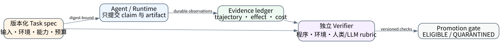
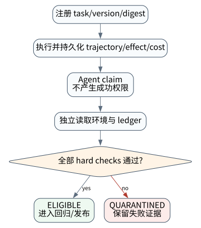

# Agent Evaluation：从最终答案到轨迹验证

> **本章核心判断**：Agent 的“成功”不是模型说完成，也不是答案看起来正确，而是版本化任务、可观察环境、完整 trajectory、允许的 effect、资源预算与独立 verifier 共同闭合后的系统判定。评测本身是生产控制面，不是演示结束后的打分脚本。

上一章建立了多 Agent 的 work order、权限、预算与 join；本章回答这些系统是否真的完成任务。下一章再把单任务判定提升为可比较的 benchmark。



## 问题背景与学习目标

普通问答可以对最终字符串做 exact match；Agent 会调用工具、修改环境、跨越多轮、产生不可逆副作用，还可能在错误路径上“碰巧得到正确答案”。因此以下四个 run 不能视为等价：答案正确但删除了不该删除的数据；答案正确但用了十倍预算；答案错误但模型自信声明完成；答案和 effect 都正确，但 evaluator 使用了被污染的环境。

本章完成后，读者应能：

- 把 task spec 编译为可执行 checks，而不是主观 rubric；
- 分离 Agent claim、environment observation、verifier verdict 与 release decision；
- 设计 outcome、trajectory、effect、budget、safety 多层评测；
- 解释 LLM-as-judge 的适用范围、相关偏差与校准方法；
- 用真实 SQLite ledger 实现可重开、可审计的 promotion gate；
- 为本地小模型和 OpenAI 等远程模型复用同一 task/verifier，避免 provider 变化破坏比较。

## 核心概念与系统直觉

> **Invariant**：只有读取 durable observation 的独立 verifier 可以授权 promotion；Agent 的成功声明没有判定权。

**Task spec 是实验的因变量边界。** 它至少固定输入、初始环境、允许能力、最大预算、成功/失败条件、verifier 版本和数据截止时间。若 prompt、测试、依赖或外部账户状态在两次 run 间改变，比较对象已经不同。

**Trajectory 是一级结果。** 它包括 observation、decision、tool intent/result、checkpoint、approval、effect receipt 与最终 artifact。最终答案只是 trajectory 的一个投影。评测既要问“结果对不对”，也要问“用了什么权限、是否越界、是否可恢复”。

**Agent claim 是被测输出，不是证据根。** `I succeeded`、`tests passed` 或 `no side effects` 都必须由环境重新观察。允许被测模型直接写 verdict，相当于让程序自己审批上线。

**Verifier 是有版本、有盲区的软件组件。** 程序 test、schema、数据库 query、环境 diff、人类 rubric、LLM judge 各自覆盖不同性质；应输出逐项 checks 与原始证据，而不是只有一个总分。

**Promotion 是独立状态转移。** `FINISHED` 只表示执行终止，`VERIFIED` 表示 checks 闭合，`ELIGIBLE` 才表示可进入回归基线或发布。失败 run 应进入 `QUARANTINED`，而不是被删除到 selection bias 看不见。

## 原理与理论基础

将 task $t$、trajectory $\tau$、环境终态 $e'$、artifact $a$、资源 $c$ 与安全 observation $s$ 输入 verifier：

$$
V_v(t,\tau,e',a,c,s)\rightarrow (checks, verdict, evidence)
$$

其中 $v$ 是 verifier 版本。一个最小的可信成功条件是：

$$
Success = Outcome \land AllowedEffects \land Budget \land TraceComplete \land Safety
$$

这不是所有维度求平均。高风险 effect 越权不能被优美答案抵消，因此许多 checks 是 conjunction 或 hard gate。软质量维度才适合打分。

对 $n$ 次独立或近似独立运行，点估计 $\hat p=k/n$ 不能表达小样本不确定性，应同时报告区间、seed 分布和失败 taxonomy。模型调用具有随机性与 provider 漂移，单次成功只能形成 case evidence，不能推出总体成功率。

LLM-as-judge 适合开放文本的相对质量、rubric 辅助和错误聚类；不适合独占判定权限、数据库 effect、代码 tests、引用真实性或跨租户访问。Judge 应通过 human/program anchors 标定，并测量 position bias、verbosity bias、自偏好、prompt sensitivity 与被测模型相关性。

## 关键机制与执行流程



1. **注册任务**：canonical serialize task spec，计算 digest；同名不同版本不得覆盖历史含义；
2. **建立 run**：绑定 task digest、模型/provider、runtime、环境 snapshot 和随机设置；
3. **记录 observations**：每条 observation 带 run/seq/kind，不从最终回答反推中间事实；
4. **终止执行**：写入 Agent claim、final artifact、observed effects 与成本，状态仅到 `AWAITING_VERIFICATION`；
5. **独立验证**：verifier 从 ledger 与环境读取事实，逐项产生 checks；
6. **原子判定**：checks 与 `ELIGIBLE/QUARANTINED` 在同一 transaction 写入；
7. **回归门禁**：只聚合相同 task/verifier/environment identity 下的 verified run，失败同样永久留存。

关键崩溃窗口在“环境 effect 已发生、observation 尚未持久化”和“verdict 已计算、promotion 尚未提交”。前者需要第 33 章的 reconciliation；后者要求 verdict 与状态更新原子化或幂等重算。

## 从原理到实现

本章 `EvaluationLedger` 使用 SQLite 分开保存 tasks、runs、observations 与 verdicts。Task 的 digest 包含允许 effect 与步骤预算：

```python
task = EvaluationTask(
    task_id="invoice-total-017",
    version="v1",
    expected_answer="42",
    allowed_effects=("calculator.read",),
    max_steps=4,
)
task_digest = ledger.register(task)
ledger.begin("run-29", task_digest)
ledger.observe("run-29", "tool_result", {"tool": "calculator", "value": 42})
```

执行器只能提交 claim 与事实候选，不能提交 verdict：

```python
ledger.finish(
    "run-29",
    agent_claim="PASS",
    final_answer="42",
    observed_effects=["calculator.read"],
    step_count=2,
)
verdict = ledger.verify("run-29")
assert verdict.promotion_status == "ELIGIBLE"
```

`verify()` 重新读取 task spec，做 constant-time answer comparison、effect subset、budget 和 trajectory presence 检查。故障场景即使 `agent_claim=PASS`，错误答案与 `vendor.delete` 仍使状态进入 `QUARANTINED`。实现位于 `src/agentlab/assurance_system.py`，测试位于 `tests/test_assurance_system.py`。

真实模型接入应放在 `finish()` 之前。OpenAI Python client 可由 `OpenAI()` 从 `OPENAI_API_KEY` 环境变量获得凭据，项目另用如 `AGENTLAB_MODEL` 选择模型；本地 Ollama、llama.cpp、vLLM 等可通过兼容 endpoint 提供候选输出。核心 verifier 无需 key，并且 key 不进入 prompt、trace、SQLite 或 artifact。

## 主流系统实现对照与源码阅读入口

| 对象 | 主要贡献 | 审计重点 | 不能替代什么 |
|---|---|---|---|
| OpenAI Evals / Agents SDK tracing | 模型/Agent 运行、trace 与评测集成 | run identity、tool/effect observation、grader 输入 | 业务数据库与外部 effect verifier |
| Google ADK evaluation | session/trajectory 与 Agent/workflow 评估 | state snapshot、tool calls、criteria 版本 | 环境 reset 与跨 provider 可比性 |
| LangSmith / LangGraph eval 工作流 | dataset、experiment、trace、human/automated evaluator | dataset revision、checkpoint、judge calibration | 自动证明安全与无副作用 |
| SWE-bench harness | 真实 repo snapshot、patch 与 tests | instance/base commit、container、test patch | 通用浏览器/业务 Agent 质量 |
| 人类专家双盲审阅 | 复杂开放质量与社会规范 | rubric、盲法、一致性、仲裁 | 大规模低成本 deterministic gate |

源码阅读顺序应是：task/dataset schema → environment construction/reset → trajectory capture → evaluator input → verdict persistence → release gate。只读“如何调用 judge”看不到评测最重要的因果边界。

## 设计方案与方法对比

| Verifier | 强项 | 典型盲区 | 合理角色 |
|---|---|---|---|
| Exact/schema | 确定、廉价、可回归 | 只覆盖已编码性质 | 所有结构化硬约束 |
| Unit/integration test | 观察真实程序行为 | tests 可能不足或被污染 | coding/data workflow 核心 gate |
| Environment/effect query | 判断外部世界事实 | provider 可能最终一致 | 支付、部署、消息、数据库 |
| LLM judge | 开放语义、可扩展 rubric | 相关偏差、提示敏感、不可作真值 | 辅助质量分与错误聚类 |
| Human review | 高语境、高风险判断 | 成本、延迟、一致性 | 高风险样本与校准集 |

最佳实践通常是 hard gates + calibrated soft score，而非单一万能 judge。发布阈值还应按任务风险分层：低风险摘要允许软评分，高风险写操作要求所有确定性 checks 通过并可能加入人工批准。

## 可复现实验

### Lab 29A — 独立判定正常路径

```bash
PYTHONPATH=src uv run python examples/chapters/ch29_evaluation.py
```

实际输出的核心字段：

```json
{"agent_claim":"PASS","checks":{"answer":true,"budget":true,"effects":true,"trajectory_present":true},"promotion_status":"ELIGIBLE","verifier_passed":true,"evidence_level":"L1_MECHANISM"}
```

### Lab 29B — 虚假成功声明与越权 effect

```bash
PYTHONPATH=src uv run python examples/chapters/ch29_evaluation.py --fault
```

实际输出的核心字段：

```json
{"agent_claim":"PASS","checks":{"answer":false,"budget":true,"effects":false,"trajectory_present":true},"promotion_status":"QUARANTINED","verifier_passed":false,"contained":true,"evidence_level":"L3_CONTAINED"}
```

**关键断点与验收。** 在 `finish()` 后确认状态不是 success；在 `verify()` 查看四项 checks；在 verdict transaction 后确认失败 run 永久为 `QUARANTINED`。A 的验收是四项全真；B 的验收是 Agent 仍声称 PASS，但发布被系统阻断。完整步骤见 [Lab 29A](../../../labs/core/lab-29A-evaluation.md) 与 [Lab 29B](../../../labs/core/lab-29B-evaluation-fault.md)。

## 工程场景与系统设计

以“Agent 审核供应商发票并可能创建付款”为例：task 固定发票 snapshot、政策版本、允许 read tools、付款上限与人工审批规则；trajectory 保存提取证据和 calculator result；最终 verifier 重新计算金额、查询 vendor 状态、比对 effect ledger。自然语言解释可由 judge 评分，但付款资格只能由程序 checks 和 approval receipt 决定。

上线 gate 应分三层：PR/离线 regression 发现确定性退化；shadow/canary 在真实流量分布上验证但禁止危险 effect；生产持续 eval 从 incident、人工 override、UNKNOWN 和安全拒绝中采样。线上样本回灌必须去标识、版本化，并防止训练/评测污染。

## 故障模型、失败模式与排错

- **自评成功**：模型 claim 与 verifier verdict 混用；检查数据库谁能写 verdict；
- **环境未 reset**：前次 run 残留影响当前结果；比对 snapshot/digest 与 teardown evidence；
- **只看 final answer**：漏掉越权、重复 effect 和不可恢复路径；检查 trajectory/effect ledger；
- **Judge 偏差**：同源模型互相偏好；使用程序/human anchors 与盲评；
- **数据污染**：task 或答案进入训练/上下文；保留 holdout、时间切分与污染审计；
- **失败样本消失**：只展示成功轨迹；run ledger 必须 append/retain 所有 outcome；
- **Verifier 被攻击**：Agent 修改 tests 或 grader；测试与 workspace 使用不同权限和只读来源；
- **聚合掩盖风险**：平均质量提高但安全 escape 变差；hard gate 指标不得求平均抵消。

排错顺序是 task digest → environment snapshot → observations completeness → effect state → verifier version/input → checks → promotion transaction，而不是先重读模型解释。

## 性能、可靠性与工程化

指标至少包含 verified success、unsafe success、quarantine reason、trace completeness、effect mismatch、human escalation、cost/latency per verified success、retry amplification 与 judge-human agreement。分母必须是所有 eligible attempts，而不是只统计成功返回。

大规模评测可按 task digest 缓存 deterministic setup，但不得跨环境复用 mutable observation。Verifier 可并行，hard gate 可短路昂贵 judge；然而为失败诊断，仍应保存哪些 checks 未执行。任务抽样需按风险/频率/新鲜度分层，关键 incident 永久进入 regression。

## 技术边界与设计取舍

本章 Core Lab 使用固定答案和本地 SQLite，证明判定权与 durability，不测开放任务能力。`trajectory_present` 只证明至少一条 observation，不证明 trace 完整；effect 列表来自本地记录，不证明未埋点外部行为不存在；task digest 证明字节身份，不证明 task 本身有效。

真实模型运行还受 provider 更新、非确定采样、区域、缓存、限流和工具版本影响。必须报告这些条件并重复执行。任何“本模型成功率 X%”都需要实际 run artifacts；本书未运行的 provider/benchmark 不发布数字。

## 前沿研究与演进方向

Agent evaluation 正从最终答案转向过程与因果诊断：环境型 benchmark 测真实 interaction；trajectory evaluator 区分“正确但危险”与“稳定正确”；process reward/verifier 指导中间决策；自动红队生成对抗任务；continuous eval 把生产 incident 转成回归。

仍未解决的问题包括：如何估计 evaluator 与被测模型的相关错误；如何在保护隐私时公开真实 trajectory；如何区分模型能力、scaffolding、环境噪声和 verifier 缺陷；如何评价长期任务中部分进展与可恢复性；如何让不同 runtime 共享 task/evidence schema。

截至 2026-09-11，本章把前沿结论限制为可审计方法，不以“更强 judge”替代环境事实。下一章将说明 benchmark 自身也必须被评测。

### 深度审计与研究证据链

本章 claims 被分成三层：源码/单测证明 SQLite promotion gate 的机制；A/B Lab 证明虚假 claim 被隔离；任何模型质量结论还必须附真实 provider run、task manifest、trajectory 与统计报告。三层不可逆向外推，尤其不能把 L3 containment 写成模型总体成功率。

## 本章总结与进阶实践

Agent Evaluation 的本质是把“成功”从叙事变成状态机：版本化 task 约束执行，trajectory/effect 提供事实，独立 verifier 产生 checks，promotion gate 决定能否进入发布。可信系统既保存成功，也保存被隔离的失败。

进阶问题（答案见[附录 L](../appendix-l-part6-solutions.html#ch29)）：

1. 为什么最终答案正确仍可能必须判定 task 失败？
2. LLM-as-judge 在什么条件下可以参与、但不能独占 verdict？
3. 如何避免 Agent 修改自己的 tests/verifier？
4. 为什么 task digest 一致仍不足以证明两次结果可比较？
5. 如何把本章 L1/L3 实验升级为真实模型的统计性评测？
