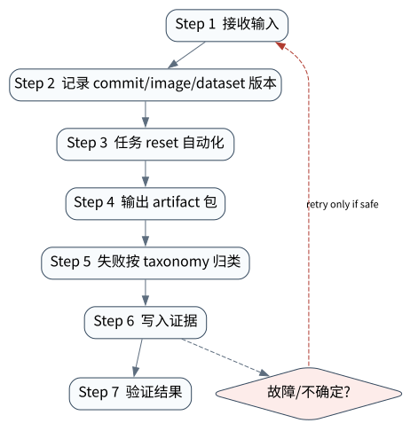

# SWE-bench、OSWorld、PaperBench 与 MLE-bench

> **本章核心判断**：Benchmark 的核心不是 leaderboard，而是把真实任务转成可执行、可评分、可复盘的实验环境。

上一章：Agent Evaluation：从最终答案到轨迹验证。本章把前一章已经建立的能力进一步推进到 `Fixture`；下一章将进入：Tracing、Metrics 与 AgentOps。


## 问题背景与学习目标

Benchmark 的核心不是 leaderboard，而是把真实任务转成可执行、可评分、可复盘的实验环境。

在本章的 `Fixture` 场景中，真实 Agent 系统与普通“问答程序”的差异，在于一次任务会跨越模型、工具、状态、外部环境和人工治理边界。本章所有原理、代码与实验都围绕这些可验证问题展开。


**本章完成标准：**

- **机制理解**：能够解释“Benchmark 的核心不是 leaderboard，而是把真实任务转成可执行、可评分、可复盘的实验环境。”，并指出它对应的确定性软件边界；
- **正确性判断**：能够针对 `benchmark claims require a fixed task, environment snapshot, and independent verifier` 构造一个反例，说明证据不足时系统为什么不能继续乐观执行；
- **实验与迁移**：运行 `Lab 30A` / `Lab 30B`，分别说明 normal/fault 的 evidence level，并把同一机制映射到至少一个上游实现或协议。

## 核心概念与系统直觉

本节不把概念当作术语清单，而是回答三个工程问题：它**是什么**、在系统里**负责什么**、以及它失效时**会留下什么可观测证据**。

### Fixture

**定义。** 为 benchmark 固定的输入、仓库、数据、页面或初始环境，是重复比较的起点。

**系统责任。** Fixture 应可版本化、可重建并排除隐藏状态；动态外部依赖需快照或记录不可复现部分。

**失败边界。** fixture 漂移会让不同时间的模型分数不可比；损坏 task 还会把 benchmark 噪声误解释为模型能力。

### Environment

**定义。** Agent 真正执行动作并产生 observation/effect 的可控世界，例如 repo、OS、browser、 scientific sandbox。

**系统责任。** Environment 决定 benchmark 是否测到真实交互能力，并需定义网络、时间、权限、reset 和 nondeterminism。

**失败边界。** 过度简化环境会造成 leaderboard 与生产脱节；环境不隔离则一次 submission 会污染后续任务。

### Submission

**定义。** 一次被评估的完整运行，包括模型、harness、配置、轨迹、artifact 与版本信息。

**系统责任。** Submission 应保存足够 metadata 支持复验，避免只公布一个 aggregate score。

**失败边界。** 若不同 submission 使用不同未披露 tool/harness 或 human intervention，模型分数比较就失去意义。

### Scoring

**定义。** 把环境结果、artifact、trajectory、成本和风险映射到指标的规则。

**系统责任。** Scoring 要区分 task success、partial credit、efficiency 与 safety，并报告置信区间/任务覆盖，而不是单一总分。

**失败边界。** 测试损坏、grader 漏洞或过度拟合都会让高分失真；aggregate 还可能掩盖某类任务完全失败。

## 原理与理论基础

### 系统不变量

> **Invariant**：benchmark claims require a fixed task, environment snapshot, and independent verifier

不变量与普通“最佳实践”不同：最佳实践可以因为场景变化而替换，不变量一旦被破坏，系统就失去本章希望保证的正确性。例如 `跑不通环境却比较分数` 并不是一个 UI 问题，而是说明某个状态已经无法从证据中唯一判断。


### 故障模型

本章优先把 “跑不通环境却比较分数”、“修改测试集污染结果”、“只报平均数不看失败类别” 作为可证伪故障，而不是泛化地枚举所有异常。对涉及外部 effect 的失败，判定顺序固定为“最后 durable state → effect 是否可能发生 → 现有 observation 是否足够决定下一步”；证据不足时停在 UNKNOWN/显式失败。

### Why / What if / Trade-off

本章真正的设计取舍不是“使用更强模型还是写更多规则”，而是确定 **Fixture** 与 **Environment** 分别应该由概率性决策还是确定性软件拥有。模型可以帮助识别候选路径，但它不会自动消除“跑不通环境却比较分数”这类系统失败；该失败必须由 runtime 的 schema、状态机、权限或 verifier 显式约束。

如果把 Fixture 完全交给模型，系统会把不可验证的语言判断混入执行事实；如果把 Environment 全部硬编码为固定 workflow，又会失去开放任务所需的适应性。更稳健的边界是：让模型负责提出候选决策，让软件负责 `记录 commit/image/dataset 版本`、`失败按 taxonomy 归类` 以及对不变量 **benchmark claims require a fixed task, environment snapshot, and independent verifier** 的检查。

**What if。** 一旦“修改测试集污染结果”发生，系统首先需要判断现有证据是否足够决定下一状态；证据不足时应停在显式失败或待协调状态，而不是让模型用自然语言补全事实。这个边界决定了本章方案是否具有可恢复性，而不只是演示效果。


### 形式化模型与可证伪假设

$$
ObservedScore=TrueCapability+TaskNoise+GraderNoise+EnvironmentDrift+Contamination
$$

Benchmark 分数混合了真实能力、任务缺陷、grader 噪声、环境漂移与污染；benchmark 本身也需要审计。

**可证伪假设。** 对 broken/ambiguous tasks 做清洗后，模型排序与绝对分数会发生可测变化。

**建议测量。** broken-task rate、grader disagreement、environment failure、ranking stability。

## 关键机制与执行流程



**Step 1 — 记录 commit/image/dataset 版本。** `记录 commit/image/dataset 版本` 把短暂执行状态转换为后续能够读取的证据。写入内容至少要能关联本次 run、前一状态与下一状态；对 crash-sensitive 数据，应明确写入完成的判据。若进程在写入期间终止，恢复代码必须能够区分“没有记录”“完整记录”和“损坏/不确定记录”，而不能把半写状态视作成功。

**Step 2 — 任务 reset 自动化。** `任务 reset 自动化` 是“SWE-bench、OSWorld、PaperBench 与 MLE-bench”的一次显式状态转移。输入和输出都必须可序列化并关联 `run_id/step_id`；一旦该步骤失败，后继步骤只能依据已记录状态继续。关键观察点是 `Environment` 是否仍满足 **benchmark claims require a fixed task, environment snapshot, and independent verifier**。

**Step 3 — 输出 artifact 包。** `输出 artifact 包` 是“SWE-bench、OSWorld、PaperBench 与 MLE-bench”的一次显式状态转移。输入和输出都必须可序列化并关联 `run_id/step_id`；一旦该步骤失败，后继步骤只能依据已记录状态继续。关键观察点是 `Submission` 是否仍满足 **benchmark claims require a fixed task, environment snapshot, and independent verifier**。

**Step 4 — 失败按 taxonomy 归类。** `失败按 taxonomy 归类` 是“SWE-bench、OSWorld、PaperBench 与 MLE-bench”的一次显式状态转移。输入和输出都必须可序列化并关联 `run_id/step_id`；一旦该步骤失败，后继步骤只能依据已记录状态继续。关键观察点是 `Scoring` 是否仍满足 **benchmark claims require a fixed task, environment snapshot, and independent verifier**。

在本章的 `Fixture` 场景中，**最后一步 — 验证。** verifier 针对 `Scoring` 检查本章不变量 **benchmark claims require a fixed task, environment snapshot, and independent verifier**。如果“跑不通环境却比较分数”使现有 artifact/外部状态不足以证明成功，结果必须停在显式失败或 UNKNOWN；只有 observation 能闭合状态转移时，流程才允许进入 FINISHED。

### 数据流与控制流

本章的数据/控制链按 **记录 commit/image/dataset 版本 → 任务 reset 自动化 → 输出 artifact 包 → 失败按 taxonomy 归类** 推进。调试时不要只看最终 answer，应确认每一阶段的输入来源、状态版本和 observation；对“跑不通环境却比较分数”尤其要检查动作前后的证据是否足以闭合不变量 **benchmark claims require a fixed task, environment snapshot, and independent verifier**。


### 持久化点与崩溃窗口

本章需要持久化的内容取决于动作可逆性。与 `Fixture` 有关的纯计算状态通常可以重算；一旦 `任务 reset 自动化` 可能产生昂贵、外部或不可逆效果，就必须在动作前后建立可区分的证据边界。对于本章不变量 **benchmark claims require a fixed task, environment snapshot, and independent verifier**，恢复时最重要的问题是：最后一个已知状态是什么、动作是否可能已经发生、现有 observation 能否唯一决定 retry/continue/compensate。


## 从原理到实现


### 完整实验入口

```python
from __future__ import annotations
import argparse
from agentlab.course_scenarios import run_scenario

def main() -> int:
 p=argparse.ArgumentParser(description='SWE-bench、OSWorld、PaperBench 与 MLE-bench')
 p.add_argument("--fault", action="store_true", help="inject the chapter-specific failure path")
 args=p.parse_args()
 result=run_scenario('benchmarks', fault=args.fault)
 print(result.as_json())
 return 0 if result.passed else 2

if __name__ == "__main__":
 raise SystemExit(main())
```

### 核心机制实现

```python
def benchmarks(fault=False):
 fixture={
  'task_id':'procurement-policy-regression-017',
  'input':{'amount_usd':7500,'risk_tier':'high','vendor_status':'approved'},
  'policy':{'approval_threshold_usd':5000,'high_risk_requires_human':True},
  'expected':{'decision':'WAITING_APPROVAL','external_effects':0},
 }
 canonical=lambda value: json.dumps(value,sort_keys=True,separators=(',',':')).encode()
 fixture_hash=hashlib.sha256(canonical(fixture)).hexdigest()
 replay=json.loads(json.dumps(fixture))
 if fault:
  replay['policy']['approval_threshold_usd']=10000  # 模拟未声明的 fixture 漂移
 replay_hash=hashlib.sha256(canonical(replay)).hexdigest()
 manifest={
  'task_id':fixture['task_id'],'seed':20260911,
  'fixture_schema':'agentlab.procurement.v1','fixture_sha256':fixture_hash,
  'verifier':'policy-decision-and-effect-count/v1',
 }
 run1={'fixture_sha256':fixture_hash,'passed_checks':2,'total_checks':2}
 run2={'fixture_sha256':replay_hash,'passed_checks':2,'total_checks':2}
 comparable=run1['fixture_sha256']==run2['fixture_sha256']
 return _ok('benchmarks',fault,{'manifest':manifest,'run1':run1,'run2':run2,
  'comparable':comparable},'benchmark claims require a fixed task, environment snapshot, and independent verifier',comparable if not fault else not comparable)
```


### 简化假设与不能省略的机制

这个离线 fixture 故意不调用模型：它隔离并验证 benchmark 的一个底层不变量——**即使两次运行都显示 2/2 检查通过，只要输入策略的 canonical hash 不同，两次分数就不可比较**。这比 `demo-1/abc/score=1` 更接近真实评测失效方式：评估结果往往不是“明显报错”，而是在 dataset、test patch、browser snapshot 或 policy config 漂移后仍产出一个看似正常的数字。

它仍不是 SWE-bench 或 WebArena 成绩。真实外部评测至少还要锁定：harness commit、dataset split/instance、容器或站点镜像、模型标识与采样参数、完整轨迹、原始 evaluator 输出、失败分类和全部 artifact hash。仓库用 [`experiments/benchmarks/catalog.json`](../../../experiments/benchmarks/catalog.json) 把这些要求变成机器可审计契约；`scripts/qa_external_benchmark_contracts.py` 只验证契约完整性，不伪装成任务执行。

### 真实 coding/browser benchmark 的证据闭环

本书为两条外部 smoke path 固定了官方 harness，但在原始证据齐全前不发布分数：

| 路径 | 固定对象 | 真正执行时的 verifier | 当前状态 |
|---|---|---|---|
| SWE-bench Lite | 官方 harness commit `02e7a74…`、真实实例 `sympy__sympy-20590` | 先以 gold patch 验证 Docker evaluator，再运行官方 `swebench infer`，最后让官方 evaluator 在真实 repo test 上验证生成 patch | `NOT_EXECUTED_IN_THIS_RELEASE` |
| WebArena | 官方 commit `dce0468…`、单个固定 task；另锁 BrowserGym runner commit | 自托管站点 reset + 登录态 + 完整 action/observation trajectory + 官方 evaluator | `NOT_EXECUTED_IN_THIS_RELEASE` |

这里有两个容易混淆的边界。第一，SWE-bench 的 grader 执行补丁和 repository tests；“模型生成了一段 diff”不等于 resolved。第二，WebArena 的页面内容、登录态和后台数据库本身就是 fixture；对公开 demo 随手浏览不能产生有效 WebArena 分数。官方执行入口在 [external-agent-benchmarks workflow](../../../.github/workflows/external-agent-benchmarks.yml)，且只允许隔离的 self-hosted runner 手工触发。

截至本书截止日，本机预检只证明 Docker daemon `27.4.0` 可达；可用磁盘 `87,892,013,056` bytes 小于本仓库为 SWE-bench full harness 设置的 `120 GiB` 安全门，当前进程没有 OpenAI key，WebArena 七个自托管 endpoint 也均未配置。固化记录见 [`preflight.json`](../../../evidence/benchmarks/2026-09-11-macos-arm64/preflight.json)，当前主机重跑结果仍写入 `validation_logs/external-benchmark-preflight.json`。**预检失败是诚实的环境结论，不是 0 分，更不是 benchmark 运行。**密钥只检查“变量是否存在”，从不读取或写入证据值。


## 主流系统实现对照与源码阅读入口

| 项目 | 本书锁定版本/状态 | 应阅读的机制 | 已核验源码/文档入口 | 官方来源 |
|---|---|---|---|---|
| SWE-bench | `benchmark source observed 2026-09-09` | 真实 GitHub issue + repository snapshot + Docker/test verifier。 | 以官方 docs/release/source tree 为准 | [官方来源](https://github.com/swe-bench/SWE-bench) |
| OSWorld | `benchmark source observed 2026-09-09` | 真实计算机环境的 observation/action/evaluator。 | 以官方 docs/release/source tree 为准 | [官方来源](https://github.com/xlang-ai/OSWorld) |
| OpenAI PaperBench | `2025 benchmark` | 论文复现任务与细粒度 rubric/grader。 | 以官方 docs/release/source tree 为准 | [官方来源](https://openai.com/index/paperbench/) |
| OpenAI MLE-bench | `2024 benchmark` | 75 个 Kaggle-style ML engineering competitions。 | 以官方 docs/release/source tree 为准 | [官方来源](https://openai.com/index/mle-bench/) |

### 源码阅读方法

源码阅读以 **SWE-bench** 为第一参照，并只追与“SWE-bench、OSWorld、PaperBench 与 MLE-bench”直接相关的公开执行链：入口 → durable/session state → 权限或协议边界 → verifier/trace。若上游没有公开某个服务端组件，本章不根据客户端现象反推其内部 scheduler、queue 或 policy engine。


### 工业实现为什么更复杂


对本章最值得关注的工程增量是：如何避免“跑不通环境却比较分数”、如何在“修改测试集污染结果”后恢复，以及如何让 `失败按 taxonomy 归类` 的结果能够进入 tracing/evaluation。只有这些机制都能落到公开类型、函数或协议消息上，才算真正完成源码对照。

## 设计方案与方法对比

| 方案 | 核心优势 | 主要局限 | 更适合的约束 |
|---|---|---|---|
| 最小自研 AgentLab | 机制透明、可断点、无网络即可故障注入 | 生态/模型能力有限 | 教学、研究原型、回归基线 |
| SWE-bench | 官方/主流实现提供成熟抽象与生态 | 抽象会隐藏部分底层机制，需要源码/trace 反推 | 生产集成与方案对照 |
| OSWorld | 官方/主流实现提供成熟抽象与生态 | 抽象会隐藏部分底层机制，需要源码/trace 反推 | 生产集成与方案对照 |
| OpenAI PaperBench | 官方/主流实现提供成熟抽象与生态 | 抽象会隐藏部分底层机制，需要源码/trace 反推 | 生产集成与方案对照 |


## 可复现实验

本章两个 Core Lab 都直接执行仓库内的确定性代码；它们证明的是“SWE-bench、OSWorld、PaperBench 与 MLE-bench”对应的本地机制与 fault oracle，而不是外部 provider 或真实云环境。第三方实现只在 `labs/upstream/` 按独立 L5 互操作证据记录，未实际执行时必须保持 `EXTERNAL_NOT_RUN_IN_THIS_RELEASE`。

### 实验环境

统一 Python/OS/离线复现约束、安装步骤与工具链版本集中维护在[附录 A](../appendix-a-environment.md)。本章只增加与“SWE-bench、OSWorld、PaperBench 与 MLE-bench”直接相关的 normal/fault 双轨验证；若需要真实云、浏览器、GPU 或第三方 provider，则在对应 upstream lab 中单独标记 `NOT_RUN_EXTERNAL`，不把未运行结果计入核心实验。

### Lab 30A — 正常路径

```bash
PYTHONPATH=src python examples/chapters/ch30_benchmarks.py
```

**关键断点：**
- `src/agentlab/course_scenarios.py::benchmarks`
- `examples/chapters/ch30_benchmarks.py::main`

**本发布包实际输出：**

```json
{"contained": false, "evidence_level": "L1_MECHANISM", "evidence_meaning": "normal_path_assertion_satisfied", "fault": false, "fault_injected": false, "invariant": "benchmark claims require a fixed task, environment snapshot, and independent verifier", "invariant_holds": true, "observation": {"comparable": true, "manifest": {"fixture_schema": "agentlab.procurement.v1", "fixture_sha256": "43378cebd6017db188c6019184c45e91e92208eae1a7df9318828d1f89716509", "seed": 20260911, "task_id": "procurement-policy-regression-017", "verifier": "policy-decision-and-effect-count/v1"}, "run1": {"fixture_sha256": "43378cebd6017db188c6019184c45e91e92208eae1a7df9318828d1f89716509", "passed_checks": 2, "total_checks": 2}, "run2": {"fixture_sha256": "43378cebd6017db188c6019184c45e91e92208eae1a7df9318828d1f89716509", "passed_checks": 2, "total_checks": 2}}, "oracle_detected": false, "passed": true, "recovered": false, "scenario": "benchmarks", "system_detected": false}
```

PASS：退出码 0，`passed=true`、`fault=false`、`invariant_holds=true`；这只证明确定性 fixture 的正常机制断言。完整手册：[Lab 30A](../../../labs/core/lab-30A-benchmarks.md)。

### Lab 30B — 故障注入

```bash
PYTHONPATH=src python examples/chapters/ch30_benchmarks.py --fault
```

**本发布包实际输出：**

```json
{"contained": false, "evidence_level": "L2_ORACLE_ONLY", "evidence_meaning": "external_oracle_observed_bad_outcome_only", "fault": true, "fault_injected": true, "invariant": "benchmark claims require a fixed task, environment snapshot, and independent verifier", "invariant_holds": false, "observation": {"comparable": false, "manifest": {"fixture_schema": "agentlab.procurement.v1", "fixture_sha256": "43378cebd6017db188c6019184c45e91e92208eae1a7df9318828d1f89716509", "seed": 20260911, "task_id": "procurement-policy-regression-017", "verifier": "policy-decision-and-effect-count/v1"}, "run1": {"fixture_sha256": "43378cebd6017db188c6019184c45e91e92208eae1a7df9318828d1f89716509", "passed_checks": 2, "total_checks": 2}, "run2": {"fixture_sha256": "cfbdc21ccd0eaf6d1231f51f0bddfc4888c3bc33a8caf1720de1d80460811446", "passed_checks": 2, "total_checks": 2}}, "oracle_detected": true, "passed": true, "recovered": false, "scenario": "benchmarks", "system_detected": false}
```

PASS：退出码 0，`passed=true`、`fault=true`、`oracle_detected=true`。本章故障实验为 **L2_ORACLE_ONLY**：独立 oracle 观察到故障，但被测系统没有证明检测/约束/恢复。 `passed=true` 本身只表示实验 oracle 得到预期观察。完整手册：[Lab 30B](../../../labs/core/lab-30B-benchmarks-fault.md)。

### 观察与证据


## 工程场景与系统设计

本章沿用第 29 章 AgentOps 负载，重点说明 benchmark 结果如何进入发布 gate；“每天 5 万任务”仍是设计规模，不应与公开榜单成绩混合解释。


### 上线前必须补齐

- 围绕 **Agent Benchmarks** 建立可审计状态字段与最小权限；
- 为本章相关动作记录 run_id、step_id、输入摘要与 observation；
- 对 `Benchmark 必须理解数据、环境、verifier 和基础设施噪声。` 这一边界建立自动化验收；
- 为本章主要故障窗口配置 trace、日志和恢复 runbook；
- 上线前把教学 fixture 替换为真实 provider/tool/workspace，并重新执行 normal/fault 两条路径。

## 故障模型、失败模式与排错

本章至少主动测试以下失败：

- **跑不通环境却比较分数**：先确认最后 durable state，再检查是否已经产生外部效果；不要先重试。
- **修改测试集污染结果**：先确认最后 durable state，再检查是否已经产生外部效果；不要先重试。
- **只报平均数不看失败类别**：先确认最后 durable state，再检查是否已经产生外部效果；不要先重试。


## 性能、可靠性与工程化

### 应采集指标

- `eval pass rate + confidence interval`
- `trace completeness`
- `security escape rate`
- `UNKNOWN rate`
- `retry amplification`
- `cost per successful task`


### 优化顺序


任何优化都必须重新运行 Lab A/B。尤其当优化改变 `Environment` 的生命周期时，要重新验证 **benchmark claims require a fixed task, environment snapshot, and independent verifier**；否则平均延迟下降可能以更大的 stale state、重复副作用或取消失效为代价。

### 可靠性工程

本章可靠性 gate 直接针对 “跑不通环境却比较分数”、“修改测试集污染结果”、“只报平均数不看失败类别”：只有正常路径与对应 fault path 都保持 **benchmark claims require a fixed task, environment snapshot, and independent verifier**，优化或功能扩展才可接受。是否达到 detection、containment 或 recovery 以实验的 `evidence_level` 字段为准。


## 技术边界与设计取舍
本章方案有明确边界：

- LLM-as-judge 不是绝对真值，需要标定与人类/程序 verifier 交叉验证
- trace 只能观察已埋点路径，不能证明未记录副作用不存在
- prompt injection 无单一提示词能彻底解决，必须做权限/隔离防御
- 性能数字高度依赖模型/provider/工具与数据，不能跨环境直接比较

选择方案时要回到本章边界：如果业务不能接受“跑不通环境却比较分数”，就必须为 `Fixture` 增加更强的确定性约束；如果主要任务是开放式探索，则可以把更多 `Environment` 决策交给模型，但要用 `失败按 taxonomy 归类` 保持结果可验证。**SWE-bench** 与 **OSWorld** 的差异也应放在这些约束下理解，而不是抽象成通用框架排名。

Benchmark 是受控比较工具，不是生产可靠性的代理变量。SWE-bench、OSWorld 等各自测量不同能力，版本、grader、环境与污染风险必须锁定；跨榜单直接比较需要谨慎。

## 前沿研究与演进方向

当前研究和工业演进已经从“模型能否调用工具”推进到“怎样让长期、状态化、具有副作用的 Agent 可评估、可恢复、可治理”。与本章直接相关的资料：

- **[AgentBench: Evaluating LLMs as Agents](https://arxiv.org/abs/2308.03688)**：多环境 Agent benchmark，推动从答案评估转向交互任务评估。
- **[SWE-bench](https://github.com/swe-bench/SWE-bench)**（benchmark source observed 2026-09-09）：真实 GitHub issue + repository snapshot + Docker/test verifier。
- **[OSWorld](https://github.com/xlang-ai/OSWorld)**（benchmark source observed 2026-09-09）：真实计算机环境的 observation/action/evaluator。


### 截至 2026-09-11 的研究更新

本节只记录会改变本章系统结论的研究或官方规范更新；实验仍使用仓库锁定版本，避免把“最新观察版本”与“可复现实验版本”混为一谈。
- OpenAI: Separating signal from noise in coding evaluations （2026‑07‑08）：benchmark validity, broken tasks and coding‑agent evaluation design。
- OSWorld2.0: Benchmarking Computer Use Agents on Long‑Horizon Real‑World Tasks（arXiv 2606.29537; 2026‑06‑28）：long‑horizon computer use, hidden state, cross‑source reasoning, safety。
- OpenAI PaperBench（2025 benchmark）：把论文复现拆成长时研究/工程任务，强调 artifact 与 grader，而不只评最终文本。
- OpenAI MLE‑bench（2024 benchmark）：以真实机器学习工程任务考察代码、实验和结果提交，适合作为环境型 Agent 评测参照。

**本章吸收的变化。** Benchmark 分数混合模型能力与任务/评分器/环境质量。2026 对 coding eval 的审计提醒：benchmark 本身也必须被验证。这些研究/规范的价值不在于替换本章原理，而在于把上述假设放进更真实、更长时或更高风险的环境中检验。

### Research Gap

围绕 `Fixture`，当前缺口不是“再增加一个 Agent API”，而是怎样把 **benchmark claims require a fixed task, environment snapshot, and independent verifier** 从局部实现经验升级为跨模型、跨 runtime 可验证的系统属性。现有工业实现已经能够提供 tool loop、session、graph、plugin 或 workspace 等抽象，但在“跑不通环境却比较分数”和“修改测试集污染结果”同时出现时，证据格式、恢复语义和评测方法仍缺少统一答案。

本章的研究更新不追求论文数量，而关注一个问题：现有工作是否真正推进了 **Agent Benchmarks** 的可验证性。Anthropic infrastructure noise 研究显示资源配置可显著影响 Terminal-Bench 分数；PaperBench/MLE-bench/SWE-bench 各自测量不同能力。 因此，本章会把论文结论放回不变量、失败窗口和实验断言中，而不是把研究当作参考文献列表。

### Open Problems

1. 如何把 `Fixture` 的正确性拆成可组合的局部不变量，并在不同 Agent runtime 中复用 verifier？
2. 当“跑不通环境却比较分数”与“修改测试集污染结果”同时发生时，**SWE-bench** 与 **OSWorld** 的公开抽象分别能保存哪些证据，哪些状态仍需要外部 reconciliation？
3. 如果模型能力显著提高，围绕 `Environment` 的哪些 harness 机制仍属于系统必要条件，哪些只是当前模型能力下的临时补丁？
4. 如何构造一个既保护真实业务数据、又能复现“只报平均数不看失败类别”的公开 benchmark，使研究结果可以被第三方验证？


### 深度审计与研究证据链：Agent Benchmarks

本章重新审计后的核心结论是：**Benchmark 必须理解数据、环境、verifier 和基础设施噪声。** 这句话只有在代码、实验、开源源码和研究证据四个层面同时成立时才有教学价值。仅靠定义或 API 示例无法证明它，因为 Agent Systems 的风险通常发生在模型决策与外部环境之间的缝隙里。

**与本章最相关的近期/基础研究与官方资料：**

- **[PaperBench](https://openai.com/index/paperbench/)**：把论文复现拆成细粒度可评分任务，强调 rubric/grader。
- **[AgentDojo](https://arxiv.org/abs/2406.13352)**：用不可信工具返回内容测试 prompt injection 攻防。
- **[Agent Security Bench](https://arxiv.org/abs/2410.02644)**：覆盖多工具、多场景、多攻击/防御的 Agent 安全评测。

这些资料与本章的关系不是“引用背书”，而是帮助读者识别设计边界。SWE-bench、OSWorld、PaperBench、MLE-bench、BrowseComp 是本章核心谱系。 读者阅读源码时应主动寻找四个对象：输入如何进入系统、状态在哪里持久化、动作由谁执行、失败后谁负责恢复。

**实验语义边界。** 本章实验验证 Agent Benchmarks 的观测、评测、安全或生产控制面不变量；证据等级定义与解释规则统一见附录 A，且 `passed=true` 不得跨级推导 containment/recovery。


## 本章总结与进阶实践

### 核心结论

1. 本章不变量是：**benchmark claims require a fixed task, environment snapshot, and independent verifier**；
2. `Fixture` 必须是可观察软件边界，而不是 prompt 约定；
3. `记录 commit/image/dataset 版本` 与 `失败按 taxonomy 归类` 之间必须有状态和证据连接；
4. 模型提出动作不等于系统已经执行，更不等于任务成功；
5. 正常路径只能证明功能，故障路径才能暴露恢复语义；
6. 开源实现的核心价值在于理解真实约束，不是复制 API；
7. 性能优化必须与可靠性/安全不变量一起重新验证；
8. 技术边界和未解决问题是高级系统设计的一部分。

### 常见误区

- 跑不通环境却比较分数
- 修改测试集污染结果
- 只报平均数不看失败类别

### 思考题与实践

- **Why：** 为什么 `Fixture` 不能只靠模型“记住”？
- **What if：** 如果在 `记录 commit/image/dataset 版本` 与 `失败按 taxonomy 归类` 之间 crash，当前证据足够恢复吗？
- **Programming：** 修改 `examples/chapters/ch30_benchmarks.py` 或对应 scenario，让系统新增一种错误类型，但仍保持 invariant。
- **Engineering：** 把 Lab B 的故障改成 timeout/duplicate/crash 中另一种，写出状态机和恢复步骤。
- **Research：** 选择本章一个 Open Problem，阅读两篇相互不同的方法，给出你自己的实验设计和 falsifiable hypothesis。

下一章进入 **Tracing、Metrics 与 AgentOps**，它将复用本章已经建立的状态/证据边界，而不是重新从 API 使用开始。
