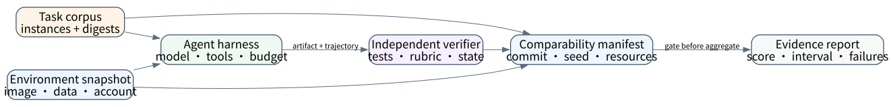
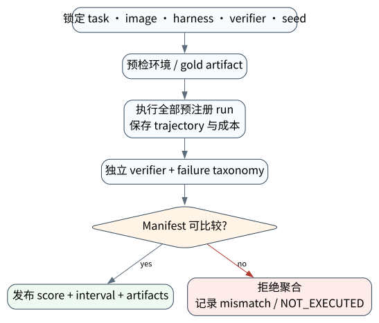

# SWE-bench、OSWorld、PaperBench 与 MLE-bench

> **本章核心判断**：Benchmark 不是一个分数，而是任务分布、环境 snapshot、harness、verifier、资源预算与统计协议的整体。只有这些身份一致，结果才可比较；只有官方/独立 verifier 真正运行，结果才可发布。

第 29 章定义了单个 task 如何被验证。本章研究 task 集合如何形成有效比较，并以 coding、computer use、research reproduction 与 ML engineering 四类真实环境为主线。下一章将建立产生这些证据的 observability 系统。



## 问题背景与学习目标

Agent benchmark 的分数混合了至少五种因素：基础模型、Agent scaffold、工具/上下文、环境基础设施和 grader。若其中任何一项悄悄改变，“分数提高”就不再具有明确因果解释。Coding Agent 可能利用错误 tests；Browser Agent 可能面对变化的网站；research benchmark 的 rubric 可能奖励形式而非可复现 artifact；ML Agent 可能因硬件/时间预算不同获得优势。

本章完成后，读者应能：

- 识别 benchmark 测量对象，而不是按排行榜名称推断通用能力；
- 构造包含 task/environment/verifier/harness/seed 的 manifest；
- 在评分前执行 comparability gate，并对 drift fail closed；
- 报告样本区间、失败 taxonomy、成本和资源，而非只报 point score；
- 区分 `NOT_EXECUTED`、`FAILED_PREFLIGHT`、`UNSUPPORTED` 与真实 0 分；
- 设计真实 SWE-bench/browser smoke run 的证据包，且不伪造外部成绩。

## 核心概念与系统直觉

> **Invariant**：一个 benchmark score 只有在 task set、environment、verifier、harness revision、seed/采样协议和资源预算被固定时才可发布或比较。

**Instance** 是可独立执行和验证的最小任务。SWE-bench instance 不是一段 issue 文本，而是 issue、repo/base commit、test patch 与环境；Browser instance 还包含站点数据、账户和 reset 状态。

**Harness** 把 Agent 连接到环境。它决定 observation、action schema、timeout、重试、上下文长度、文件/网络权限和 termination；因此 scaffold/harness 本身就是被测系统的一部分。

**Verifier** 将 artifact 和环境终态映射为 outcome。Coding benchmark 用 tests，并不表示 tests 永远正确；browser evaluator 可能同时使用 URL、DOM 与后台数据库；研究复现需要 rubric 与 artifact evidence。

**Manifest** 是比较身份。显示名称、Docker tag 或“同一 dataset”不足以做身份；应使用 content digest、commit、image digest、instance IDs 与 evaluator revision。

**Leaderboard score** 是条件统计量，不是模型本体属性。它必须附带条件和不确定性；不同 benchmark 的分数不能做无量纲横向排名。

## 原理与理论基础

设 observation outcome $Y$ 由模型 $M$、scaffold $S$、task $T$、环境 $E$、verifier $V$、预算 $B$ 与随机性 $R$ 共同决定：

$$
Y=f(M,S,T,E,V,B,R)
$$

若比较两个系统时同时改变 $E$ 或 $B$，就不能把 $\Delta Y$ 归因于 $M/S$。本章 manifest gate 要求受控变量相等，再允许 aggregate。

对二项任务成功率 $\hat p=k/n$，小样本要报告 Wilson interval。即使 5/5，95% 区间下界也只有约 0.5655；“100%”只是样本点估计。对同一 tasks 比较 A/B，优先用 paired outcome、bootstrap 或适当配对检验，而不是把两个独立均值直接相减。

Benchmark validity 包含：construct validity（任务是否代表目标能力）、internal validity（差异是否来自被比较系统）、external validity（能否外推到生产分布）、reliability（重复 run 是否稳定）以及 contamination resistance（模型是否见过答案/测试）。一个可重复的错误 benchmark 仍然无效。

## 关键机制与执行流程



1. **固定问题陈述**：说明目标 population、能力、风险和不外推范围；
2. **锁定实例**：保存 dataset revision、instance IDs、repo/site/artifact snapshot 与许可；
3. **构建环境**：使用 image digest、依赖 lock、架构、资源配额和 reset verifier；
4. **锁定 harness**：commit、action/observation schema、timeout、retry、tool 权限与 termination；
5. **执行 Agent**：保存模型/provider、sampling、prompt/scaffold、完整 trajectory、成本与失败；
6. **独立评分**：在受保护 grader 环境运行 tests/rubric/query，不让 Agent 修改；
7. **可比性门禁**：manifest 任一受控字段不同就拒绝 aggregate；
8. **统计与发布**：区间、失败 taxonomy、资源、未运行项和原始 evidence 同时发布。

预检只回答“环境是否具备运行条件”。容器能启动、key 存在或网站可达都不等于 benchmark 已执行；official evaluator 未产生 artifact 时不能发布 score。

## 从原理到实现

本章离线实验用 5 个采购规则 task 隔离验证 harness control plane。Manifest 的每个字段都进入 canonical digest：

```python
manifest = BenchmarkManifest(
    benchmark="agentlab-procurement-5",
    task_set_digest=content_digest(tasks),
    environment_digest="sha256:publisher-image-locked",
    verifier_digest=content_digest({"rule": rule, "effects": 0}),
    harness_revision="agentlab-assurance-v1",
    seed=20260911,
)
```

只有 comparability 通过才发布 aggregate；报告同时给 point estimate 与 Wilson interval：

```python
decision = compare_manifests(manifest, replay_manifest)
report = benchmark_report(manifest, verified_outcomes)
if not decision.aggregate_allowed:
    raise IncomparableRun(decision.mismatches)
```

实验故意让两侧局部结果都为 5/5，但 fault run 修改 environment digest。系统返回 `mismatches=["environment_digest"]` 并阻断 aggregate，证明“高分”不能绕过 provenance。

### 外部 coding/browser 合约

仓库的 `experiments/benchmarks/catalog.json` 固定 SWE-bench Lite 与 browser benchmark 的实例/harness/evidence 要求；`.github/workflows/external-agent-benchmarks.yml` 只允许隔离 runner 手工启动。当前发布状态明确为 `NOT_EXECUTED_IN_THIS_RELEASE`，契约 QA 只证明字段齐全，不产生模型成绩。

SWE-bench 真正运行需要 repo checkout、base commit、容器、模型 patch 与官方 evaluator tests；browser benchmark 需要自托管站点、reset、账户、trajectory 与官方 evaluator。任何缺项都只能报告 preflight/partial evidence。

## 主流系统实现对照与源码阅读入口

| Benchmark | 核心任务/环境 | 主要 verifier | 能说明什么 | 不能直接说明什么 |
|---|---|---|---|---|
| [SWE-bench](https://github.com/swe-bench/SWE-bench) | 真实 GitHub issue + repo snapshot | patch 应用与 tests | 仓库级 coding issue 解决能力 | 通用软件工程、安全部署 |
| [OSWorld](https://github.com/xlang-ai/OSWorld) | 真实桌面/应用状态 | 环境状态 evaluator | computer-use 长链交互 | 任意网站/企业流程可靠性 |
| [PaperBench](https://openai.com/index/paperbench/) | 论文复现与 artifact | 分层 rubric/grader | 长时研究工程复现 | 科学发现真实性的全部维度 |
| [MLE-bench](https://openai.com/index/mle-bench/) | Kaggle-style ML engineering | competition artifact/score | 数据/训练/实验执行能力 | 生产 ML 治理与泛化 |
| WebArena 类环境 | 自托管网站和账户 | URL/DOM/backend state | 浏览器任务执行 | 公开互联网实时网站表现 |

源码阅读不要从排行榜页面开始，而要从 instance schema、environment setup/reset、agent runner、evaluator、result aggregation 和 submission validation 顺序进入。尤其检查失败是否被排除、timeout 如何计分、环境错误如何分类。

## 设计方案与方法对比

| 设计 | 优势 | 风险 | 适用场景 |
|---|---|---|---|
| Deterministic microbenchmark | 快、可定位机制、CI 稳定 | 外部有效性弱 | runtime/verifier 单元回归 |
| Fixed real-world snapshot | 接近真实、可第三方复现 | 构建昂贵、会老化 | coding/browser 标准比较 |
| Live web/business task | 分布新鲜 | 不可复现、隐私与状态漂移 | 线上 shadow/持续评测 |
| Human expert challenge | 可覆盖开放高难质量 | 昂贵、主观、一致性问题 | research/高风险判断 |
| Synthetic/generated tasks | 可控规模与难度 | 生成器偏差、捷径 | 覆盖组合和对抗注入 |

一个成熟体系同时需要 microbenchmark 做机制定位、snapshot benchmark 做外部比较、生产 eval 做分布监控。三者证据不可互相冒充。

## 可复现实验

### Lab 30A — 相同 manifest 的统计报告

```bash
PYTHONPATH=src uv run python examples/chapters/ch30_benchmarks.py
```

实际输出核心字段：

```json
{"comparability":{"aggregate_allowed":true,"comparable":true,"mismatches":[]},"aggregate_published":true,"report":{"accuracy":1.0,"successes":5,"tasks":5,"wilson_95":[0.5655,1.0]},"evidence_level":"L1_MECHANISM"}
```

### Lab 30B — 环境漂移但局部分数不变

```bash
PYTHONPATH=src uv run python examples/chapters/ch30_benchmarks.py --fault
```

实际输出核心字段：

```json
{"comparability":{"aggregate_allowed":false,"comparable":false,"mismatches":["environment_digest"]},"aggregate_published":false,"report":{"accuracy":1.0,"successes":5,"tasks":5},"contained":true,"evidence_level":"L3_CONTAINED"}
```

**关键断点与验收。** 在 manifest digest、`compare_manifests()` 和 aggregate/export 前停下。A 必须显示无 mismatch 且带区间；B 即使 5/5 也必须禁止聚合。完整步骤见 [Lab 30A](../../../labs/core/lab-30A-benchmarks.md) 与 [Lab 30B](../../../labs/core/lab-30B-benchmarks-fault.md)。

## 工程场景与系统设计

一个 Coding Agent 发布 gate 可以分三层：每个 PR 跑 50 个确定性回归 task；每日在隔离 runner 跑固定 SWE-bench smoke instances；里程碑版本运行更大集合并人工审计失败。所有层共享 manifest/evidence schema，但资源预算和外推范围不同。

Browser Agent 还需控制站点 reset、账户库存、邮件/订单后台状态与时间。公开网页 smoke test 可用于功能检查，不能称为 WebArena/OSWorld 分数。生产 shadow 任务必须禁止真实购买/删除等危险 effect，或使用专用测试 tenant。

模型层可选择小型本地模型做便宜回归，强模型/OpenAI 做高难对照，但两者必须拥有相同 task/harness/verifier 和明确预算。若 context window、tool set 或重试次数不同，应报告为不同 system configuration，而不是“只比较模型”。

## 故障模型、失败模式与排错

- **Dataset drift**：实例或答案变化；核对 content digest 与 instance list；
- **Environment drift**：image tag 相同但 digest/依赖不同；记录 OCI digest 与 lock；
- **Broken task/test**：grader 错误或不可解；保存 raw tests 并独立复核，不随意剔除；
- **Contamination**：模型见过 issue/patch；使用时间切分、私有 holdout 与泄漏分析；
- **Infrastructure failure**：OOM、site unavailable、Docker failure；与 task failure 分开；
- **Cherry-picking**：只报最好 seed/成功实例；预注册运行数并保留全部结果；
- **Budget mismatch**：不同 token/tool/time/compute；比较前归一或明确分层；
- **Verifier gaming**：修改 tests、读 hidden state；grader 隔离、只读 tests、最小权限。

排错先看 manifest mismatch 与 environment health，再看 trajectory、artifact 和 verifier raw output；不要从总分反推故障原因。

## 性能、可靠性与工程化

除 success/resolved rate 外，还应报告 setup success、environment failure、timeout、invalid action、tool error、unsafe effect、cost/token/tool calls、wall/CPU/GPU time、retries 和 verified success per cost。对长时任务报告 survival/partial progress，但不能把 partial 直接混成 resolved。

执行基础设施要限额和隔离：每 instance 独立 workspace/container/账户；并发不共享 mutable state；超时后真正终止子进程；artifact 以 hash 上传；失败 runner 不自动重试到“看起来成功”。昂贵 benchmark 可分层抽样，但核心 sentinel tasks 每次发布必跑。

## 技术边界与设计取舍

Core Lab 的五个规则任务只证明 comparability gate 和统计格式，不测 reasoning/coding/browser。Wilson interval 处理二项抽样误差，不处理 task selection bias、run correlation、grader bias 或 distribution shift。SHA-256 identity 证明内容相同，不证明内容正确。

外部 benchmark 的官方 harness 也不是绝对真值；应保留 task audit、broken-instance policy 与版本。排行榜提高不等于生产更安全，生产 incident 降低也不必然提高公共 benchmark。两类指标服务不同决策。

## 前沿研究与演进方向

前沿正从静态短任务转向长时、隐藏状态、多应用、动态环境与可验证 artifact；同时更关注 benchmark contamination、基础设施噪声、scaffold attribution 和“benchmark 是否仍测到目标能力”。随着 Agent 变强，任务饱和会导致区分度下降，需要动态但可审计的新任务。

重要研究问题包括：如何创建不泄漏又可第三方复核的 holdout；如何用因果设计拆分模型与 scaffold 贡献；如何评估长任务的恢复性和安全成本；如何建立跨 coding/browser/research 的共同 evidence schema；如何识别 benchmark shortcut 而不暴露 hidden tests。

截至 2026-09-11，本书外部 benchmark 只报告已保存的预检与契约状态。无官方 evaluator artifact 就无分数，这是比“填满排行榜”更重要的开源可信度约束。

### 深度审计与研究证据链

本章将本地 comparability gate、外部执行合同和公开 benchmark 成绩严格分开。源码中的 5-task report 是 harness 机制证据；catalog/preflight 只是可执行性准备；只有 pinned harness 的官方 evaluator artifact 才能产生 SWE-bench 或 browser score。`NOT_EXECUTED` 永远不能由文案升级为 PASS。

## 本章总结与进阶实践

Benchmark 的本质是受控实验系统。分数必须带 manifest、环境、verifier、预算、区间和失败类型；不可比结果应在聚合前被拒绝；未运行状态必须诚实保留。

进阶问题（答案见[附录 L](../appendix-l-part6-solutions.html#ch30)）：

1. 为什么两个系统都在同名 Docker tag 下运行仍可能不可比？
2. `5/5` 为什么不能表述为真实成功率已知为 100%？
3. 如何区分模型失败、harness 失败和 broken task？
4. 为什么公开网页自动化不能直接称为 WebArena 成绩？
5. 怎样设计一次可审计的真实 SWE-bench smoke run？
