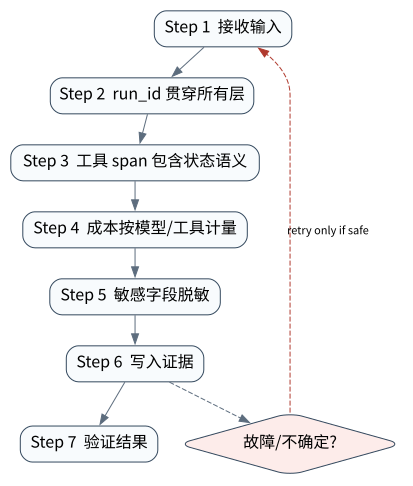

# Tracing、Metrics 与 AgentOps

> **本章核心判断**：AgentOps 需要把模型事件、工具事件、状态转换、成本、延迟、错误和用户审批串成一条可查询的证据链。

上一章：SWE-bench、OSWorld、PaperBench 与 MLE-bench。本章把前一章已经建立的能力进一步推进到 `Trace span`；下一章将进入：Prompt Injection、防护与最小权限。


## 问题背景与学习目标

AgentOps 需要把模型事件、工具事件、状态转换、成本、延迟、错误和用户审批串成一条可查询的证据链。

在本章的 `Trace span` 场景中，真实 Agent 系统与普通“问答程序”的差异，在于一次任务会跨越模型、工具、状态、外部环境和人工治理边界。本章所有原理、代码与实验都围绕这些可验证问题展开。


**本章完成标准：**

- **机制理解**：能够解释“AgentOps 需要把模型事件、工具事件、状态转换、成本、延迟、错误和用户审批串成一条可查询的证据链。”，并指出它对应的确定性软件边界；
- **正确性判断**：能够针对 `traces need stable run/tool identifiers so a trajectory can be reconstructed across components` 构造一个反例，说明证据不足时系统为什么不能继续乐观执行；
- **实验与迁移**：运行 `Lab 31A` / `Lab 31B`，分别说明 normal/fault 的 evidence level，并把同一机制映射到至少一个上游实现或协议。

## 核心概念与系统直觉

本节不把概念当作术语清单，而是回答三个工程问题：它**是什么**、在系统里**负责什么**、以及它失效时**会留下什么可观测证据**。

### Trace span

**定义。** 表示一次模型调用、tool、retrieval、approval 或 subagent 等有起止时间的执行单元。

**系统责任。** Span 通过 parent/child 与 attributes 重建跨组件 critical path，并应避免把敏感 prompt/result 无限制写入 telemetry。

**失败边界。** span 缺失 correlation 或采样掉关键错误时，长任务失败只能靠猜；过度记录又可能泄露秘密和显著增加成本。

### Metric

**定义。** 对 latency、token、tool errors、retries、approval、success、UNKNOWN 等系统行为的聚合数值。

**系统责任。** Metric 用于 SLO、容量和趋势判断；Agent 指标必须同时包含业务成功和系统风险， 而不只看调用量。

**失败边界。** 高 token throughput 不代表高价值；只统计 HTTP 200 会把业务失败与危险重试隐藏在“服务健康”后面。

### Log

**定义。** 记录离散事件、错误和关键上下文的可查询文本/结构化证据。

**系统责任。** Log 适合详细诊断，但应结构化 run/step/tool/outcome，执行 secret/PII redaction 与 retention policy。

**失败边界。** 自由文本日志无法可靠关联轨迹；把完整 prompt、凭据或用户数据永久记录会制造新的安全风险。

### Run correlation

**定义。** 用稳定 run_id/trace_id/step_id/effect_id 把 model、tool、queue、approval、artifact 和外部 observation 串成一条因果链。

**系统责任。** Correlation 是长任务排错、成本归因和恢复的基础；跨服务传播时要避免重用或丢失 identity。

**失败边界。** 没有 correlation 时，同一用户的并发 Agent 行为会混在一起；错误关联更可能把别的 run 的成功证据用于当前任务。

## 原理与理论基础

### 系统不变量

> **Invariant**：traces need stable run/tool identifiers so a trajectory can be reconstructed across components

不变量与普通“最佳实践”不同：最佳实践可以因为场景变化而替换，不变量一旦被破坏，系统就失去本章希望保证的正确性。例如 `日志只有自然语言` 并不是一个 UI 问题，而是说明某个状态已经无法从证据中唯一判断。


### 故障模型

本章优先把 “日志只有自然语言”、“trace 与业务 id 对不上”、“失败没有请求参数和结果摘要” 作为可证伪故障，而不是泛化地枚举所有异常。对涉及外部 effect 的失败，判定顺序固定为“最后 durable state → effect 是否可能发生 → 现有 observation 是否足够决定下一步”；证据不足时停在 UNKNOWN/显式失败。

### Why / What if / Trade-off

本章真正的设计取舍不是“使用更强模型还是写更多规则”，而是确定 **Trace span** 与 **Metric** 分别应该由概率性决策还是确定性软件拥有。模型可以帮助识别候选路径，但它不会自动消除“日志只有自然语言”这类系统失败；该失败必须由 runtime 的 schema、状态机、权限或 verifier 显式约束。

如果把 Trace span 完全交给模型，系统会把不可验证的语言判断混入执行事实；如果把 Metric 全部硬编码为固定 workflow，又会失去开放任务所需的适应性。更稳健的边界是：让模型负责提出候选决策，让软件负责 `run_id 贯穿所有层`、`敏感字段脱敏` 以及对不变量 **traces need stable run/tool identifiers so a trajectory can be reconstructed across components** 的检查。

**What if。** 一旦“trace 与业务 id 对不上”发生，系统首先需要判断现有证据是否足够决定下一状态；证据不足时应停在显式失败或待协调状态，而不是让模型用自然语言补全事实。这个边界决定了本章方案是否具有可恢复性，而不只是演示效果。


### 形式化模型与可证伪假设

$$
Trace=\{span(run,step,model,tool,effect,approval)\},\qquad Metric=Aggregate(Trace)
$$

AgentOps 的最小数据面是可关联的 run/step/model/tool/effect/approval trace，而不是零散日志。

**可证伪假设。** 统一 correlation IDs 和 GenAI semantic conventions 可缩短跨模型/工具的 RCA。

**建议测量。** trace completeness、orphan spans、RCA time、SLO attribution accuracy。

## 关键机制与执行流程



**Step 1 — run_id 贯穿所有层。** `run_id 贯穿所有层` 是“Tracing、Metrics 与 AgentOps”的一次显式状态转移。输入和输出都必须可序列化并关联 `run_id/step_id`；一旦该步骤失败，后继步骤只能依据已记录状态继续。关键观察点是 `Trace span` 是否仍满足 **traces need stable run/tool identifiers so a trajectory can be reconstructed across components**。

**Step 2 — 工具 span 包含状态语义。** `工具 span 包含状态语义` 是“Tracing、Metrics 与 AgentOps”的一次显式状态转移。输入和输出都必须可序列化并关联 `run_id/step_id`；一旦该步骤失败，后继步骤只能依据已记录状态继续。关键观察点是 `Metric` 是否仍满足 **traces need stable run/tool identifiers so a trajectory can be reconstructed across components**。

**Step 3 — 成本按模型/工具计量。** `成本按模型/工具计量` 是“Tracing、Metrics 与 AgentOps”的一次显式状态转移。输入和输出都必须可序列化并关联 `run_id/step_id`；一旦该步骤失败，后继步骤只能依据已记录状态继续。关键观察点是 `Log` 是否仍满足 **traces need stable run/tool identifiers so a trajectory can be reconstructed across components**。

**Step 4 — 敏感字段脱敏。** `敏感字段脱敏` 是“Tracing、Metrics 与 AgentOps”的一次显式状态转移。输入和输出都必须可序列化并关联 `run_id/step_id`；一旦该步骤失败，后继步骤只能依据已记录状态继续。关键观察点是 `Run correlation` 是否仍满足 **traces need stable run/tool identifiers so a trajectory can be reconstructed across components**。

在本章的 `Trace span` 场景中，**最后一步 — 验证。** verifier 针对 `Run correlation` 检查本章不变量 **traces need stable run/tool identifiers so a trajectory can be reconstructed across components**。如果“日志只有自然语言”使现有 artifact/外部状态不足以证明成功，结果必须停在显式失败或 UNKNOWN；只有 observation 能闭合状态转移时，流程才允许进入 FINISHED。

### 数据流与控制流

本章的数据/控制链按 **run_id 贯穿所有层 → 工具 span 包含状态语义 → 成本按模型/工具计量 → 敏感字段脱敏** 推进。调试时不要只看最终 answer，应确认每一阶段的输入来源、状态版本和 observation；对“日志只有自然语言”尤其要检查动作前后的证据是否足以闭合不变量 **traces need stable run/tool identifiers so a trajectory can be reconstructed across components**。


### 持久化点与崩溃窗口

本章需要持久化的内容取决于动作可逆性。与 `Trace span` 有关的纯计算状态通常可以重算；一旦 `工具 span 包含状态语义` 可能产生昂贵、外部或不可逆效果，就必须在动作前后建立可区分的证据边界。对于本章不变量 **traces need stable run/tool identifiers so a trajectory can be reconstructed across components**，恢复时最重要的问题是：最后一个已知状态是什么、动作是否可能已经发生、现有 observation 能否唯一决定 retry/continue/compensate。


## 从原理到实现


### 完整实验入口

```python
from __future__ import annotations
import argparse
from agentlab.course_scenarios import run_scenario

def main() -> int:
 p=argparse.ArgumentParser(description='Tracing、Metrics 与 AgentOps')
 p.add_argument("--fault", action="store_true", help="inject the chapter-specific failure path")
 args=p.parse_args()
 result=run_scenario('observability', fault=args.fault)
 print(result.as_json())
 return 0 if result.passed else 2

if __name__ == "__main__":
 raise SystemExit(main())
```

### 核心机制实现

```python
def observability(fault=False):
 t=TraceRecorder(); run='r42'
 with t.span('agent.run',run_id=run):
 with t.span('tool.execute',run_id=None if fault else run,tool='search'): pass
 ids=[s['attrs'].get('run_id') for s in t.spans]
 correlated=all(x==run for x in ids)
 return _ok('observability',fault,{'spans':t.spans,'correlated':correlated},'traces need stable run/tool identifiers so a trajectory can be reconstructed across components',correlated if not fault else not correlated)
```


### 简化假设与不能省略的机制


## 主流系统实现对照与源码阅读入口

| 项目 | 本书锁定版本/状态 | 应阅读的机制 | 已核验源码/文档入口 | 官方来源 |
|---|---|---|---|---|
| OpenAI Agents SDK | `v0.22.0 @ 4df9ecf` | 从 Agent/Runner 入口追踪 tool loop、RunState、session、guardrail 与 tracing；特别对照 v0.22.0 对 replay state 与 failed/incomplete response 的 hardening。 | 以官方 docs/release/source tree 为准 | [官方来源](https://github.com/openai/openai-agents-python) |
| OpenHands SDK architecture | `docs observed 2026-09-09` | Software Agent SDK / Agent Server / applications 分层。 | 以官方 docs/release/source tree 为准 | [官方来源](https://docs.openhands.dev/sdk/arch/overview) |
| Microsoft Agent Framework | `Python 1.13.0` | 从 Workflow executor/superstep/checkpoint 语义入手，对照 pending messages、requests/responses 与 shared state 的持久化边界。 | 以官方 docs/release/source tree 为准 | [官方来源](https://github.com/microsoft/agent-framework) |

### 源码阅读方法

源码阅读以 **OpenAI Agents SDK** 为第一参照，并只追与“Tracing、Metrics 与 AgentOps”直接相关的公开执行链：入口 → durable/session state → 权限或协议边界 → verifier/trace。若上游没有公开某个服务端组件，本章不根据客户端现象反推其内部 scheduler、queue 或 policy engine。


### 工业实现为什么更复杂


对本章最值得关注的工程增量是：如何避免“日志只有自然语言”、如何在“trace 与业务 id 对不上”后恢复，以及如何让 `敏感字段脱敏` 的结果能够进入 tracing/evaluation。只有这些机制都能落到公开类型、函数或协议消息上，才算真正完成源码对照。

## 设计方案与方法对比

| 方案 | 核心优势 | 主要局限 | 更适合的约束 |
|---|---|---|---|
| 最小自研 AgentLab | 机制透明、可断点、无网络即可故障注入 | 生态/模型能力有限 | 教学、研究原型、回归基线 |
| OpenAI Agents SDK | 官方/主流实现提供成熟抽象与生态 | 抽象会隐藏部分底层机制，需要源码/trace 反推 | 生产集成与方案对照 |
| OpenHands SDK architecture | 贴近 coding/长期执行 harness，工作区和工具边界更真实 | 依赖更重或迭代快，升级需锁版本做回归 | Coding Agent、Harness 源码学习 |
| Microsoft Agent Framework | 状态/工作流抽象成熟，适合长任务与治理 | 框架状态不能自动解决外部副作用不确定性 | 企业 workflow、HITL、durable orchestration |


## 可复现实验

本章两个 Core Lab 都直接执行仓库内的确定性代码；它们证明的是“Tracing、Metrics 与 AgentOps”对应的本地机制与 fault oracle，而不是外部 provider 或真实云环境。第三方实现只在 `labs/upstream/` 按独立 L5 互操作证据记录，未实际执行时必须保持 `EXTERNAL_NOT_RUN_IN_THIS_RELEASE`。

### 实验环境

统一 Python/OS/离线复现约束、安装步骤与工具链版本集中维护在[附录 A](../appendix-a-environment.md)。本章只增加与“Tracing、Metrics 与 AgentOps”直接相关的 normal/fault 双轨验证；若需要真实云、浏览器、GPU 或第三方 provider，则在对应 upstream lab 中单独标记 `NOT_RUN_EXTERNAL`，不把未运行结果计入核心实验。

### Lab 31A — 正常路径

```bash
PYTHONPATH=src python examples/chapters/ch31_observability.py
```

**关键断点：**
- `src/agentlab/course_scenarios.py::observability`
- `examples/chapters/ch31_observability.py::main`

**本发布包实际输出：**

```json
{"contained": false, "evidence_level": "L1_MECHANISM", "evidence_meaning": "normal_path_assertion_satisfied", "fault": false, "fault_injected": false, "invariant": "traces need stable run/tool identifiers so a trajectory can be reconstructed across components", "invariant_holds": true, "observation": {"correlated": true, "spans": [{"attrs": {"run_id": "r42", "tool": "search"}, "duration_ms": 0.001, "name": "tool.execute", "started": 1789114730.9590847}, {"attrs": {"run_id": "r42"}, "duration_ms": 0.012, "name": "agent.run", "started": 1789114730.959083}]}, "oracle_detected": false, "passed": true, "recovered": false, "scenario": "observability", "system_detected": false}
```

PASS：退出码 0，`passed=true`、`fault=false`、`invariant_holds=true`；这只证明确定性 fixture 的正常机制断言。完整手册：[Lab 31A](../../../labs/core/lab-31A-observability.md)。

### Lab 31B — 故障注入

```bash
PYTHONPATH=src python examples/chapters/ch31_observability.py --fault
```

**本发布包实际输出：**

```json
{"contained": false, "evidence_level": "L2_ORACLE_ONLY", "evidence_meaning": "external_oracle_observed_bad_outcome_only", "fault": true, "fault_injected": true, "invariant": "traces need stable run/tool identifiers so a trajectory can be reconstructed across components", "invariant_holds": false, "observation": {"correlated": false, "spans": [{"attrs": {"run_id": null, "tool": "search"}, "duration_ms": 0.001, "name": "tool.execute", "started": 1789114730.9591599}, {"attrs": {"run_id": "r42"}, "duration_ms": 0.004, "name": "agent.run", "started": 1789114730.9591582}]}, "oracle_detected": true, "passed": true, "recovered": false, "scenario": "observability", "system_detected": false}
```

PASS：退出码 0，`passed=true`、`fault=true`、`oracle_detected=true`。本章故障实验为 **L2_ORACLE_ONLY**：独立 oracle 观察到故障，但被测系统没有证明检测/约束/恢复。 `passed=true` 本身只表示实验 oracle 得到预期观察。完整手册：[Lab 31B](../../../labs/core/lab-31B-observability-fault.md)。

### 观察与证据


## 工程场景与系统设计

本章沿用第 29 章 AgentOps 负载，重点估算 30 天 trace 的基数与采样策略，并区分审计必存事件和 best-effort telemetry。


### 上线前必须补齐

- 围绕 **Observability 与 AgentOps** 建立可审计状态字段与最小权限；
- 为本章相关动作记录 run_id、step_id、输入摘要与 observation；
- 对 `AgentOps 需要 trace、metric、log、cost、state 和 effect evidence 关联。` 这一边界建立自动化验收；
- 为本章主要故障窗口配置 trace、日志和恢复 runbook；
- 上线前把教学 fixture 替换为真实 provider/tool/workspace，并重新执行 normal/fault 两条路径。

## 故障模型、失败模式与排错

本章至少主动测试以下失败：

- **日志只有自然语言**：先确认最后 durable state，再检查是否已经产生外部效果；不要先重试。
- **trace 与业务 id 对不上**：先确认最后 durable state，再检查是否已经产生外部效果；不要先重试。
- **失败没有请求参数和结果摘要**：先确认最后 durable state，再检查是否已经产生外部效果；不要先重试。


## 性能、可靠性与工程化

### 应采集指标

- `eval pass rate + confidence interval`
- `trace completeness`
- `security escape rate`
- `UNKNOWN rate`
- `retry amplification`
- `cost per successful task`


### 优化顺序


任何优化都必须重新运行 Lab A/B。尤其当优化改变 `Metric` 的生命周期时，要重新验证 **traces need stable run/tool identifiers so a trajectory can be reconstructed across components**；否则平均延迟下降可能以更大的 stale state、重复副作用或取消失效为代价。

### 可靠性工程

本章可靠性 gate 直接针对 “日志只有自然语言”、“trace 与业务 id 对不上”、“失败没有请求参数和结果摘要”：只有正常路径与对应 fault path 都保持 **traces need stable run/tool identifiers so a trajectory can be reconstructed across components**，优化或功能扩展才可接受。是否达到 detection、containment 或 recovery 以实验的 `evidence_level` 字段为准。


## 技术边界与设计取舍
本章方案有明确边界：

- LLM-as-judge 不是绝对真值，需要标定与人类/程序 verifier 交叉验证
- trace 只能观察已埋点路径，不能证明未记录副作用不存在
- prompt injection 无单一提示词能彻底解决，必须做权限/隔离防御
- 性能数字高度依赖模型/provider/工具与数据，不能跨环境直接比较

选择方案时要回到本章边界：如果业务不能接受“日志只有自然语言”，就必须为 `Trace span` 增加更强的确定性约束；如果主要任务是开放式探索，则可以把更多 `Metric` 决策交给模型，但要用 `敏感字段脱敏` 保持结果可验证。**OpenAI Agents SDK** 与 **OpenHands SDK architecture** 的差异也应放在这些约束下理解，而不是抽象成通用框架排名。

Trace 和 metrics 能显示系统经历了什么，但可观测性数据本身也可能缺失、采样或乱序。审计关键路径需要明确哪些事件必须 durable，哪些 telemetry 只是 best-effort，不能用一条 span 代替业务提交证据。

## 前沿研究与演进方向

当前研究和工业演进已经从“模型能否调用工具”推进到“怎样让长期、状态化、具有副作用的 Agent 可评估、可恢复、可治理”。与本章直接相关的资料：

- **[ReAct: Synergizing Reasoning and Acting in Language Models](https://arxiv.org/abs/2210.03629)**：提出 reasoning/action 交错轨迹，连接语言推理与外部环境动作。
- **[Toolformer: Language Models Can Teach Themselves to Use Tools](https://arxiv.org/abs/2302.04761)**：探索模型学习何时调用外部工具以及如何把工具结果纳入后续预测。
- **[OpenAI Agents SDK](https://github.com/openai/openai-agents-python)**（v0.22.0 @ 4df9ecf）：Agent/Runner/Tools/Handoffs/Guardrails/Sessions/HITL/Tracing；0.22.0 包含 runtime hardening。
- **[OpenHands SDK architecture](https://docs.openhands.dev/sdk/arch/overview)**（docs observed 2026-09-09）：Software Agent SDK / Agent Server / applications 分层。


### 截至 2026-09-11 的研究更新

本节只记录会改变本章系统结论的研究或官方规范更新；实验仍使用仓库锁定版本，避免把“最新观察版本”与“可复现实验版本”混为一谈。
- OpenTelemetry GenAI semantic conventions（repository observed 2026‑09‑10）： observability。
- OpenAI Agents SDK v0.22.2（v0.22.2 @ 83c737f; 2026‑09‑09）：latest observed Python Agents SDK release。

**本章吸收的变化。** AgentOps 的对象不是单次 API latency，而是跨模型、工具、subagent、审批和 effect 的因果轨迹。Telemetry 与 durable audit 需要分层。这些研究/规范的价值不在于替换本章原理，而在于把上述假设放进更真实、更长时或更高风险的环境中检验。

### Research Gap

围绕 `Trace span`，当前缺口不是“再增加一个 Agent API”，而是怎样把 **traces need stable run/tool identifiers so a trajectory can be reconstructed across components** 从局部实现经验升级为跨模型、跨 runtime 可验证的系统属性。现有工业实现已经能够提供 tool loop、session、graph、plugin 或 workspace 等抽象，但在“日志只有自然语言”和“trace 与业务 id 对不上”同时出现时，证据格式、恢复语义和评测方法仍缺少统一答案。

本章的研究更新不追求论文数量，而关注一个问题：现有工作是否真正推进了 **Observability 与 AgentOps** 的可验证性。OpenTelemetry GenAI 语义约定正在覆盖 GenAI spans/events/metrics，但 durable agent state/effect 仍有语义空白。 因此，本章会把论文结论放回不变量、失败窗口和实验断言中，而不是把研究当作参考文献列表。

### Open Problems

1. 如何把 `Trace span` 的正确性拆成可组合的局部不变量，并在不同 Agent runtime 中复用 verifier？
2. 当“日志只有自然语言”与“trace 与业务 id 对不上”同时发生时，**OpenAI Agents SDK** 与 **OpenHands SDK architecture** 的公开抽象分别能保存哪些证据，哪些状态仍需要外部 reconciliation？
3. 如果模型能力显著提高，围绕 `Metric` 的哪些 harness 机制仍属于系统必要条件，哪些只是当前模型能力下的临时补丁？
4. 如何构造一个既保护真实业务数据、又能复现“失败没有请求参数和结果摘要”的公开 benchmark，使研究结果可以被第三方验证？


### 深度审计与研究证据链：Observability 与 AgentOps

本章重新审计后的核心结论是：**AgentOps 需要 trace、metric、log、cost、state 和 effect evidence 关联。** 这句话只有在代码、实验、开源源码和研究证据四个层面同时成立时才有教学价值。仅靠定义或 API 示例无法证明它，因为 Agent Systems 的风险通常发生在模型决策与外部环境之间的缝隙里。

**与本章最相关的近期/基础研究与官方资料：**

- **[OpenTelemetry GenAI semantic conventions](https://github.com/open-telemetry/semantic-conventions/tree/main/docs/gen-ai)**：提供 GenAI spans/events/metrics/MCP 语义约定。
- **[OGX](https://arxiv.org/abs/2608.14580)**：把 agentic application server 与多 provider API surface 作为部署方向。
- **[Anthropic infrastructure-noise analysis](https://www.anthropic.com/engineering/infrastructure-noise)**：提醒 agentic coding benchmark 会受 CPU/内存等基础设施影响。

这些资料与本章的关系不是“引用背书”，而是帮助读者识别设计边界。OpenTelemetry、LangSmith、OpenAI tracing、MAF observability 可对照。 读者阅读源码时应主动寻找四个对象：输入如何进入系统、状态在哪里持久化、动作由谁执行、失败后谁负责恢复。

**实验语义边界。** 本章实验验证 Observability 与 AgentOps 的观测、评测、安全或生产控制面不变量；证据等级定义与解释规则统一见附录 A，且 `passed=true` 不得跨级推导 containment/recovery。


## 本章总结与进阶实践

### 核心结论

1. 本章不变量是：**traces need stable run/tool identifiers so a trajectory can be reconstructed across components**；
2. `Trace span` 必须是可观察软件边界，而不是 prompt 约定；
3. `run_id 贯穿所有层` 与 `敏感字段脱敏` 之间必须有状态和证据连接；
4. 模型提出动作不等于系统已经执行，更不等于任务成功；
5. 正常路径只能证明功能，故障路径才能暴露恢复语义；
6. 开源实现的核心价值在于理解真实约束，不是复制 API；
7. 性能优化必须与可靠性/安全不变量一起重新验证；
8. 技术边界和未解决问题是高级系统设计的一部分。

### 常见误区

- 日志只有自然语言
- trace 与业务 id 对不上
- 失败没有请求参数和结果摘要

### 思考题与实践

- **Why：** 为什么 `Trace span` 不能只靠模型“记住”？
- **What if：** 如果在 `run_id 贯穿所有层` 与 `敏感字段脱敏` 之间 crash，当前证据足够恢复吗？
- **Programming：** 修改 `examples/chapters/ch31_observability.py` 或对应 scenario，让系统新增一种错误类型，但仍保持 invariant。
- **Engineering：** 把 Lab B 的故障改成 timeout/duplicate/crash 中另一种，写出状态机和恢复步骤。
- **Research：** 选择本章一个 Open Problem，阅读两篇相互不同的方法，给出你自己的实验设计和 falsifiable hypothesis。

下一章进入 **Prompt Injection、防护与最小权限**，它将复用本章已经建立的状态/证据边界，而不是重新从 API 使用开始。
