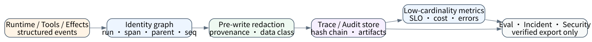
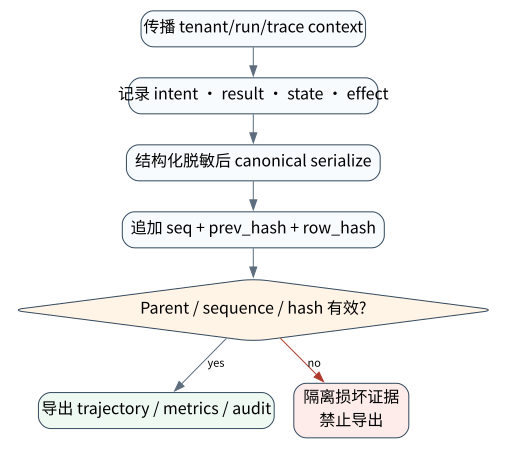

# Tracing、Metrics 与 AgentOps

> **本章核心判断**：Observability 不是“打印模型输入输出”，而是让一次 Agent 执行的身份、因果、状态、effect、成本与安全决策可以重建。Trace 只有在关联完整、敏感字段被治理、完整性可验证时，才是评测与事故分析的证据。

前两章定义了 verdict 与 benchmark；本章建立它们所依赖的证据平面。下一章用同一平面观察 prompt injection、授权拒绝和秘密泄漏。



## 问题背景与学习目标

Agent 一次 run 可能跨越模型 provider、多个工具、数据库、浏览器/容器、人工审批和异步恢复。仅保留最终回答，无法回答：哪个 observation 导致了危险动作？工具是否真的执行？重试是否重复 effect？取消后后台是否继续？token/成本消耗在哪里？某条 trace 是否被修改？

本章完成后，读者应能：

- 区分 log、event、span、metric、audit record 与 artifact；
- 设计 run/step/span/tool/effect/verdict 的稳定 identity；
- 从 parent/sequence 和状态事件重建 trajectory；
- 在落盘前做结构化脱敏，而不是事后删除字符串；
- 使用 hash chain 检测损坏/篡改并阻止证据导出；
- 设计低基数 metrics、采样、retention 与 OpenTelemetry 集成边界。

## 核心概念与系统直觉

> **Invariant**：Trace 只有在 identity graph 可重建、敏感字段已脱敏且完整性校验通过时才能被当作 evidence 导出。

**Event** 是某个事实在某时发生，例如 `tool_intent_persisted`、`effect_receipt_observed`。它应不可变，修改通过后续 correction event 表达。

**Span** 表示一个有开始/结束和 parent 的 operation，如 model call、tool execute、checkpoint。Span tree 描述结构，但长时异步系统还需要 link 与 durable state events，因为 parent stack 会跨进程中断。

**Metric** 聚合大量 run 的计数/分布，用于告警和 SLO；它不能还原单条 trajectory。把 `run_id` 当 metric label 会造成高基数灾难，run identity 应留在 trace/log。

**Audit record** 面向责任与合规：谁以什么身份请求什么能力、policy 版本、decision、effect receipt。普通 debug log 可采样，关键 audit 不应随意丢弃。

**Artifact** 是大体积可验证对象，如 patch、报告、截图、模型响应或环境 diff；trace 保存 URI、digest、media type 与访问策略，不应复制全部内容。

**AgentOps** 是把这些证据用于运行、评测、成本、安全和 incident feedback 的工程体系，不是一个 dashboard 产品名。

## 原理与理论基础

一次 run 可建模为带因果边的事件图 $G=(V,E_c)$。可重建至少要求：节点有稳定身份、每条 parent/link 指向已知节点、per-run sequence 无缺口、状态转移合法、effect 与 intent/receipt 可关联。

Metrics 满足可聚合性，trace 满足可归因性，两者通过 exemplars/run links 相连。典型 SLO 不是“API 200 比例”，而是：

$$
VerifiedSuccessRate = \frac{verified\ completed\ runs}{eligible\ accepted\ runs}
$$

其中 timeout、quarantine、UNKNOWN 和取消后 effect 都必须进入分母/分类。

Hash chain 令第 $i$ 条记录：

$$
h_i=H(h_{i-1}\parallel canonical(record_i))
$$

它能检测删改/重排，但如果攻击者可重写全部数据库和 chain head，仍可重算全链。因此生产中应周期性把 signed head 锚定到独立存储/WORM/透明日志；hash 不是访问控制或备份。

## 关键机制与执行流程



1. **建立 run context**：入口生成/验证 tenant、run、request、trace identity，禁止组件各自随意命名；
2. **记录 intent 与 observation**：模型建议、工具请求、授权 decision、实际 result 分开；
3. **结构化脱敏**：按字段 schema/classification 在序列化前处理 secret、credential、PII；
4. **持久化与关联**：span/event 保存 parent/link/seq、state version、artifact/effect digest；
5. **验证完整性**：消费前检查 sequence、parent graph、hash/签名和 schema；
6. **导出与聚合**：可信记录送 trace/audit，低基数维度生成 metrics；
7. **反馈闭环**：incident run 进入第 29 章 regression，第 34 章做 stage/cost 分析。

异常路径同样是正常数据：permission denied、validation failure、timeout、cancel、UNKNOWN、reconcile、human override 都应有机器可读 reason。没有 reason 的 error span 只能告诉你“坏了”，不能支持系统学习。

## 从原理到实现

`TamperEvidentTraceStore.record()` 要求 run/span/name，不允许孤儿 parent；operation 用 `perf_counter_ns()` 实测 duration，attributes 在落盘前递归脱敏：

```python
store.record(
    run_id="run-31",
    span_id="tool-1",
    parent_id="root",
    name="tool.execute",
    operation=lambda: {"documents": 3},
    attrs={"tool": "search", "api_key": "must-never-enter-evidence"},
)
```

导出不是无条件 `SELECT`，而是先重算每行 hash 和 parent/sequence：

```python
verified, reason = store.verify("run-31")
if not verified:
    raise ValueError(f"trace export blocked: {reason}")
trajectory = store.reconstruct("run-31")
assert trajectory[-1]["attrs"]["api_key"] == "[REDACTED]"
```

本实现用 SQLite 证明本地 evidence invariant；集成 OpenTelemetry 时，应把相同 identity/attributes 映射到 spans/events，把 effect/verdict 保留在业务 durable store，并用 trace link 连接，而非假设 telemetry backend 是事务数据库。

## 主流系统实现对照与源码阅读入口

| 系统/标准 | 提供什么 | 应审计什么 | 证据边界 |
|---|---|---|---|
| OpenTelemetry | trace/metric/log 数据模型与传播 | semantic attributes、sampling、context propagation、export failure | 不提供业务 effect consistency |
| OpenAI Agents SDK tracing | agent/model/tool/handoff/guardrail spans | sensitive-data policy、trace processors、workflow/group identity | hosted trace 不是独立 verifier |
| LangSmith / LangGraph | run tree、dataset/eval、graph execution observability | thread/checkpoint 与 trace 对齐、redaction、retention | 平台可见性不证明外部 effect |
| Google ADK telemetry | session/event/tool/model tracing integration | session identity、callback、OTel mapping | workflow state 与 telemetry durability 不同 |
| 自建 SIEM/audit | 安全关联、retention、WORM | schema、tenant ACL、clock/identity、export integrity | 成本高，需要明确最小数据 |

阅读任何 tracing 实现时，沿 context propagation → span creation → attribute capture → processor/redaction → exporter/retry → storage/ACL → deletion/retention 追踪。漂亮 UI 不能替代缺失的关联字段。

## 设计方案与方法对比

| 策略 | 优势 | 风险 | 推荐用法 |
|---|---|---|---|
| 全量 payload trace | 调试信息多 | secret/PII/成本/合规风险 | 仅隔离开发、短 retention |
| 结构化 metadata + artifact refs | 可治理、可验证、成本可控 | 需 artifact store/ACL | 生产默认 |
| Head sampling | 入口即可控成本 | 可能丢掉后续错误/长尾 | 低风险成功 run |
| Tail sampling | 可保留 error/slow/security | 处理器复杂、需缓冲 | 生产异常优先 |
| Hash chain | 检测删改/重排 | 无外部 anchor 可全链重写 | audit 完整性组件 |
| Metrics only | 低成本告警 | 无法定位单 run 因果 | SLO，不替代 trace |

安全/UNKNOWN/human override 轨迹通常不得按普通成功采样率丢弃。Retention 应按数据类别而不是“所有日志 30 天”统一处理。

## 可复现实验

### Lab 31A — 可重建与脱敏

```bash
PYTHONPATH=src uv run python examples/chapters/ch31_observability.py
```

实际输出核心字段：

```json
{"span_count":2,"verified":true,"verification_reason":"VERIFIED","export_allowed":true,"secret_redacted":true,"evidence_level":"L1_MECHANISM"}
```

### Lab 31B — 落盘后篡改

```bash
PYTHONPATH=src uv run python examples/chapters/ch31_observability.py --fault
```

实际输出核心字段：

```json
{"span_count":2,"verified":false,"verification_reason":"HASH_MISMATCH","export_allowed":false,"secret_redacted":true,"contained":true,"evidence_level":"L3_CONTAINED"}
```

**关键断点与验收。** 在 parent check、redaction、row hash 和 `reconstruct()` 前停下。A 必须能导出且秘密为 `[REDACTED]`；B 直接 SQL 篡改后必须 `HASH_MISMATCH` 并阻断导出。完整步骤见 [Lab 31A](../../../labs/core/lab-31A-observability.md) 与 [Lab 31B](../../../labs/core/lab-31B-observability-fault.md)。

## 工程场景与系统设计

一个生产 run 的最小 evidence graph 可包含：API accept → task registered → model decision → tool intent → authorization → tool result → checkpoint → approval → effect receipt → verifier verdict。每个节点带 tenant/run/step/schema version；大型 prompt/response/截图进入加密 artifact store，trace 只留 digest/reference。

Dashboard 应回答不同层问题：SLO 看 verified success/latency/cost；runtime 看 state/retry/UNKNOWN；安全看 denied capabilities/secret exposure；评测看 task/verifier/model config；单 run 页面再展开 trajectory。把所有问题塞进模型聊天记录，会把软件事实与自然语言混在一起。

## 故障模型、失败模式与排错

- **Correlation 断裂**：异步 worker 丢失 run/trace context；从 durable task envelope 传播，不依赖线程局部变量；
- **Span 成功但 effect 未知**：HTTP 200/函数返回不代表外部提交；链接 effect receipt；
- **秘密泄漏**：先采集后 regex 清理；改为 schema-aware pre-write redaction 与 denylist/allowlist；
- **高基数爆炸**：run/user/prompt 作为 metric label；移动到 trace attributes；
- **采样盲区**：安全失败被 head sampling 丢掉；使用 tail/security rules；
- **Clock 误导**：跨主机 wall clock 漂移；本地 duration 用 monotonic clock，因果用 parent/seq；
- **篡改或损坏**：hash/sequence/parent 不通过；隔离记录并保留原始 bytes，不“修好后覆盖”；
- **Telemetry 反压**：exporter 阻塞主业务；有界 queue、drop metrics，关键 audit 独立 durability。

## 性能、可靠性与工程化

Observability overhead 要测 CPU、allocation、payload bytes、queue depth、export latency、drop rate 和 tail-sampling buffer。Instrumentation 不应同步上传阻塞 tool critical path；但 effect intent/receipt、approval 和 verdict 是业务事务证据，不能为降开销全部异步丢弃。

Schema 演进需兼容：明确 event/span name、required attributes、enum reason、PII classification 和版本。Collector/exporter 的 retry 必须幂等；多次导出同 span 不应产生多条业务 effect，也不应篡改 sequence。

## 技术边界与设计取舍

本章 SQLite hash chain 检测单库记录被改，但没有外部签名 anchor、分布式 collector、tail sampler、时钟同步或多租户查询 ACL。它证明 export gate，不证明攻击者无法删除整个数据库。Duration 是真实测量，但微基准数字不可跨主机比较。

Observability 也不能证明不存在未埋点行为。能力执行必须由统一 gateway/runtime 包装，避免模型或插件绕过 tracing。数据最小化与调试深度存在张力；默认收集结构化 metadata 和 digest，在审批下临时提升采样，而不是永久保存所有 prompt。

## 前沿研究与演进方向

研究方向包括 Agent trajectory 的统一 semantic conventions、跨 runtime causal graph、自动故障归因、privacy-preserving telemetry、基于 trace 的在线评测，以及用事件溯源重建长期 Agent。另一个关键问题是“可解释性”与“可观测性”的边界：trace 证明系统做了什么，不必然解释模型内部为什么这样决定。

随着多 Agent、MCP/A2A 和 remote tool 增加，单棵 span tree 不足以表达委派、广播、重试和 join，需要 span links、task/effect identity 与跨信任域签名。标准化 evidence envelope 比标准化 UI 更重要。

截至 2026-09-11，本章不把任何 vendor dashboard 的存在外推为端到端可审计；必须逐段验证 propagation、redaction、durability 和 export completeness。

### 深度审计与研究证据链

Observability 证据以“生成—脱敏—持久化—校验—消费”逐段审计。本地 hash-chain Lab 证明篡改后 export 会被阻断；它没有证明远端 collector、签名 anchor 或未埋点路径可靠。任何跨 host 审计声明都需 producer identity、传输丢失统计和独立 anchor 的原始证据。

## 本章总结与进阶实践

可信 AgentOps 的对象不是聊天，而是有身份、因果、状态和完整性约束的 trajectory。Metrics 告诉你系统是否异常，trace 帮你定位，audit 证明谁做了什么，artifact 保存可复核对象；四者不能互相替代。

进阶问题（答案见[附录 L](../appendix-l-part6-solutions.html#ch31)）：

1. 为什么 span tree 完整仍不足以证明外部 effect 状态？
2. Hash chain 能防止哪些攻击，不能防止哪些攻击？
3. 为什么不能把 run_id 放进 Prometheus-style metric label？
4. 如何在不保存完整 prompt 的情况下支持事故复核？
5. 怎样把本地 L3 篡改检测升级为跨 host 的审计证据？
