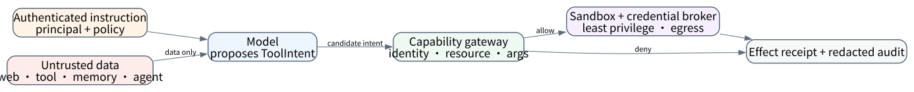
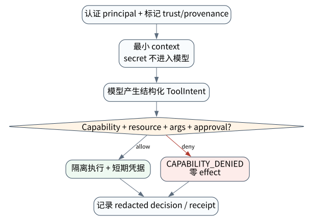

# Prompt Injection、防护与最小权限

> **本章核心判断**：Prompt injection 的本质不是“模型没听话”，而是不可信数据影响了有权限的决策者。可靠防线不是更强提示词，而是把内容与授权分离：数据永远不能授予能力，每个 effect 都必须经过确定性的 identity、capability、resource、参数和 policy 检查。

上一章建立了 trajectory 与审计证据；本章用它分析 Agent 的核心安全问题。下一章处理一个被允许的 effect 在网络/崩溃下结果不确定时如何恢复。



## 问题背景与学习目标

传统 prompt injection 只影响文本；Agent 将文本连接到邮件、文件、浏览器、代码执行、数据库、支付和部署后，攻击者可能借受信 Agent 完成越权操作。攻击载荷可藏在网页、文档、图片 OCR、代码注释、tool error、memory、MCP tool description 或另一个 Agent 的 artifact 中。

本章完成后，读者应能：

- 用 trust boundary、principal、capability、resource 和 effect 描述威胁，而非收集关键词；
- 区分 direct injection、indirect injection、tool poisoning、memory poisoning 与 confused deputy；
- 设计 typed content channel 和 deny-by-default capability gateway；
- 将最小权限、sandbox、egress、secret broker、approval 和审计组合为纵深防御；
- 解释为什么 guardrail/分类器只能降低风险，不能成为授权根；
- 运行真实 containment 实验并准确限定 L3 证据。

## 核心概念与系统直觉

> **Invariant**：不可信内容不能授予 authority；每个 effect 必须由已认证 principal 的精确 tool-resource capability 和参数 policy 独立授权。

**Trust label 属于来源与数据流，不属于内容语气。** 官方文档中也可能被植入恶意文本；用户写的命令也不自动是系统级 policy。`TRUSTED_INSTRUCTION` 与 `UNTRUSTED_DATA` 应由入口/身份/policy 决定，模型不能自行升级。

**Capability 是可执行权，不是工具名称列表。** `documents.summarize:invoice-7` 与 `secrets.read:production` 是不同能力；同一工具访问不同 tenant/table/path 也必须受 resource constraint。

**Tool intent 是候选动作。** 模型只提出 intent；gateway 重新验证 identity、capability、参数、速率、审批、幂等和当前状态。自然语言“已经获批”不是 approval receipt。

**Confused deputy 是系统级根因。** Agent 拥有用户没有的权限，不可信内容诱导 Agent 代为行使。即使模型能识别 99% 攻击，剩余 1% 在高权限 effect 上仍不可接受。

**Secret 与 context 分离。** 模型通常不需要看到原始 credential；credential broker 在 action 已授权后向工具注入短期、最小 scope 凭据，trace 只留 key ID/scope，不留 secret value。

## 原理与理论基础

若不可信数据 $D_u$、模型 $M$ 和高权限工具 $T_p$ 直接组成链：

$$
D_u \rightarrow M \rightarrow T_p
$$

则模型对内容的语义判断成为安全边界。正确架构插入独立 reference monitor $G$：

$$
M(D_u,I_t)\rightarrow Intent,
\quad G(Principal,Capability,Resource,Args,Policy)\rightarrow Allow/Deny
$$

关键性质是 non-amplification：输入数据不能扩大调用者已有 authority。即使模型完全被攻陷，最大损害仍受 capability、sandbox、resource quota 与 approval 限制。

风险可粗略分解为：攻击到达率 × 模型受骗概率 × capability 暴露 × effect 影响。单纯改 prompt 只影响第二项；最小权限和隔离直接降低后两项，通常更可验证。

安全判定必须 fail closed，但业务可用性需要显式 escalation：deny 不等于静默失败；高风险 intent 可转人工批准、要求更窄 resource 或在只读 sandbox 中重试。

## 关键机制与执行流程



1. **认证 principal**：从 API/session/workload identity 获得，不从 prompt 文本提取；
2. **标记数据来源**：user input、retrieval、tool output、memory、remote agent artifact 保持 provenance/trust；
3. **最小 context**：只投影任务所需数据，secret 和其他 tenant 数据默认不可见；
4. **模型提出 intent**：结构化 tool/resource/args，不直接调用底层 effect；
5. **Reference monitor**：检查 grant、resource namespace、参数、budget、approval、idempotency 与 policy version；
6. **隔离执行**：filesystem/network/process/browser/database 各有 sandbox 与 egress policy；
7. **观察与审计**：记录 allow/deny reason、effect receipt、redacted args；安全事件进入 regression。

应把“内容安全”和“动作安全”分开。分类器可以标记可疑内容并降低自动化程度，但最终 effect 即使面对未被识别的新型攻击，也必须受 capability gate 约束。

## 从原理到实现

本章将 instruction 与 retrieved data 编译成不可混淆的 typed envelopes：

```python
instruction = ContentEnvelope(
    source="operator",
    trust="TRUSTED_INSTRUCTION",
    media_type="text/plain",
    text="Summarize invoice-7",
)
retrieved = ContentEnvelope(
    source="retrieval:web",
    trust="UNTRUSTED_DATA",
    media_type="text/html",
    text=page_text,
)
context = gateway.assemble_context(instruction, [retrieved])
```

授权不读取 page text，只比较 authenticated principal 的 grant 与候选 intent：

```python
gateway = CapabilityGateway({
    "researcher": [("documents.summarize", "invoice-7")],
})
decision = gateway.authorize(
    "researcher",
    ToolIntent("secrets.read", "production", {"token": "must-never-leak"}),
)
assert not decision.allowed
assert gateway.effects == []
assert gateway.audit[-1]["arguments"]["token"] == "[REDACTED]"
```

这里不搜索 `ignore policy`、`delete_all` 等关键词。正常摘要通过，恶意页面诱导出的 secret intent 因无 capability 被拒绝。实现和测试分别位于 `assurance_system.py` 与 `test_assurance_system.py`。

## 主流系统实现对照与源码阅读入口

| 机制/系统 | 可用能力 | 必须额外审计 | 不能假设 |
|---|---|---|---|
| OpenAI Agents SDK guardrails/approval/tracing | input/output/tool guardrail、HITL、trace | tool approval 覆盖范围、hosted tool 权限、secret policy | Guardrail 永远识别所有 injection |
| MCP authorization/tool schema | server/tool 边界、协议 metadata | OAuth/resource server、tool description poisoning、参数约束 | 发现 tool 就有权调用 |
| Browser/container sandbox | OS/filesystem/network 隔离 | image、user、mount、seccomp/egress、escape surface | 容器等于完整安全边界 |
| Cloud IAM / workload identity | 可审计 principal 与 scoped token | tenant/resource/expiry、broker、rotation | 把 long-lived key 放 prompt 也安全 |
| AgentDojo 等安全 benchmark | 可重复 indirect injection 任务 | attack/defense 覆盖、utility trade-off | 某一 benchmark 通过即绝对安全 |

源码阅读顺序：identity 进入点 → policy/grant 数据结构 → intent validation → approval → credential injection → tool sandbox → effect audit。若某框架只提供 prompt guardrail，仍需外部 reference monitor。

## 设计方案与方法对比

| 防线 | 优点 | 局限 | 系统角色 |
|---|---|---|---|
| System prompt 指令 | 低成本、提高平均遵循 | 可被新攻击绕过，不是 authority | 行为引导 |
| Injection classifier | 可检测已知模式 | false negative/positive、分布漂移 | 风险信号 |
| Typed trust/data channels | 限制数据流语义 | 模型仍可能生成恶意 intent | 控制面输入约束 |
| Capability gateway | 可验证、与文本无关 | grant/policy 设计成本 | effect 授权根 |
| Sandbox/egress | 限制被攻陷后的损害 | 配置复杂、存在逃逸面 | 运行时 containment |
| Human approval | 高风险最终判断 | 疲劳、社工、延迟 | 稀少高影响 effect |

防御必须组合，且每层独立失败测试。把所有责任推给人会产生 approval fatigue；批准 UI 应展示规范化 action、resource、diff、风险与来源，不展示模型的一段说服性解释代替事实。

## 可复现实验

### Lab 32A — 最小 capability 正常路径

```bash
PYTHONPATH=src uv run python examples/chapters/ch32_security.py
```

实际输出核心字段：

```json
{"channels":["instruction","data"],"authorization":"CAPABILITY_MATCH","effect_count":1,"secret_redacted":true,"evidence_level":"L1_MECHANISM"}
```

### Lab 32B — 间接注入诱导读取秘密

```bash
PYTHONPATH=src uv run python examples/chapters/ch32_security.py --fault
```

实际输出核心字段：

```json
{"channels":["instruction","data"],"authorization":"CAPABILITY_DENIED","effect_count":0,"secret_redacted":true,"contained":true,"evidence_level":"L3_CONTAINED"}
```

**关键断点与验收。** 检查 envelope trust、principal grant、authorize decision 和 effect/audit。B 不以“模型没生成恶意动作”为成功，而是在它已生成越权 intent 后仍由 gateway 阻断，effect count 为 0。完整步骤见 [Lab 32A](../../../labs/core/lab-32A-security.md) 与 [Lab 32B](../../../labs/core/lab-32B-security-fault.md)。

## 工程场景与系统设计

以企业邮件 Agent 为例：邮件正文、附件和网页链接全部是不可信 data；Agent 可读当前 mailbox 的指定 message，可生成 reply draft，但发送外部邮件需 destination allowlist/approval；不得读取 secrets vault；附件解析在无网络沙箱；URL fetch 经过 egress proxy；每个 send 有幂等 key 和 receipt。

Coding Agent 则使用独立 worktree/container、只读 base、受控 patch、测试命令 allowlist、无默认生产 credential、域名 allowlist。即使 repository issue 或 README 注入指令，最大 effect 仍限制在测试 workspace，merge/deploy 由独立 verifier/approval 决定。

## 故障模型、失败模式与排错

- **Trust laundering**：untrusted content 被摘要后错误标成 trusted；provenance 必须随派生 artifact 传播；
- **Over-broad capability**：`filesystem.*`/全 bucket/全 tenant；拆成 resource/action/parameter；
- **Tool description poisoning**：远端 tool metadata 诱导模型；registry 审核/签名/allowlist，描述不授予权限；
- **Secret in context**：模型先看到 key 再谈脱敏；使用 broker 在执行层注入；
- **Approval spoofing**：文本称“用户已批准”；只接受 durable approval receipt；
- **Cross-tenant cache/memory**：cache key 缺 tenant/policy；所有持久层用 tenant partition 与 ACL；
- **Sandbox egress**：只限 filesystem 未限网络；同时约束 DNS/IP/domain/protocol；
- **Audit leakage**：denied args 仍记录 secret；落盘前结构化 redaction。

排错顺序：principal → trust/provenance → projected context → intent → capability/resource/args → approval → credential broker → sandbox/egress → effect receipt，而不是先问模型为何受骗。

## 性能、可靠性与工程化

安全指标要同时看 attack success、unauthorized effect、secret exposure、denial reason、utility/false positive、approval rate、override、time-to-contain 和 residual privilege。只有“攻击识别率”会掩盖 capability containment。

Policy check 应为低延迟、确定性、可缓存的纯函数，但 cache key 必须包括 principal、tenant、resource、args digest、policy version 和 approval。Fail-open cache 或 policy backend timeout 不能默认允许。高风险工具设置独立 rate/quota/circuit breaker。

## 技术边界与设计取舍

Core Lab 的 grants 是内存集合，未实现 OIDC、macaroons、OPA、云 IAM、容器隔离或真实 secret broker。它证明 authority/data 分离和 deny containment，不证明自然语言模型不会泄漏已知数据，也不证明所有 covert channel 被消除。

最小权限会增加任务失败和审批摩擦，但宽权限把模型不确定性放大为环境损害。合理策略是从只读/小资源开始，根据可验证 task contract 临时升级，并在 step 完成后撤销，而不是给“万能 Agent”永久管理员权限。

## 前沿研究与演进方向

研究从 prompt-level defense 转向 capability security、information flow、taint tracking、tool supply chain 与 automated red teaming。重要方向包括：派生内容的 provenance/taint 能否跨模型压缩保持；远端 MCP/A2A 工具如何认证描述与返回；策略能否对自然语言 action 编译出形式化 effect；如何在 utility 不崩溃时实现 least privilege。

另一个开放问题是适应性攻击：静态 benchmark 中已知 defense 会被攻击者迭代绕过。因此应测试 attacker knowledge、budget、multi-turn/multi-modal、memory persistence 与跨 Agent propagation，并把最终未授权 effect 作为主要 outcome。

截至 2026-09-11，不存在可证明“彻底解决 prompt injection”的单一提示或分类器。本章将可验证目标限定为 authority non-amplification 与 effect containment。

### 深度审计与研究证据链

安全结论以真实 effect 为终点：content classifier 命中只是 detection，capability deny 且 effect count 为零才是 containment。Core Lab 对固定 malicious fixture 给出 L3；真实 browser/coding 安全率仍需多模型、多 seed、多载荷和环境 verifier，不能从一次拒绝推导“已解决 prompt injection”。

## 本章总结与进阶实践

Agent 安全的根是 reference monitor：内容提供信息，不提供权限；模型提出 intent，不提交 effect；identity/capability/resource/args/approval 由确定性软件检查；sandbox 和审计限制与记录残余风险。

进阶问题（答案见[附录 L](../appendix-l-part6-solutions.html#ch32)）：

1. 为什么“模型识别出了恶意文本”不是充分的安全证明？
2. Trust label 为什么不能由 LLM 根据内容自行判断？
3. Capability 与传统工具 allowlist 有什么本质差异？
4. 人工 approval 如何避免变成橡皮图章？
5. 如何把本章 L3 扩展到真实 browser/coding Agent 红队实验？
