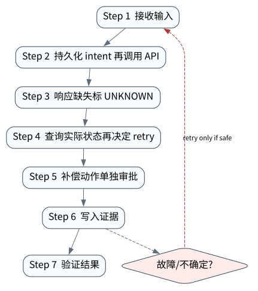

# 副作用恢复：COMMITTED、NOT_APPLIED 与 UNKNOWN

> **本章核心判断**：Agent 失败最难的是外部动作是否已经发生。显式副作用状态、幂等键、journal 和 reconciliation 是生产可靠性的核心。

上一章：Prompt Injection、防护与最小权限。本章把前一章已经建立的能力进一步推进到 `Effect intent`；下一章将进入：性能与成本：Token、延迟、并发和缓存。


## 问题背景与学习目标

Agent 失败最难的是外部动作是否已经发生。显式副作用状态、幂等键、journal 和 reconciliation 是生产可靠性的核心。

在本章的 `Effect intent` 场景中，真实 Agent 系统与普通“问答程序”的差异，在于一次任务会跨越模型、工具、状态、外部环境和人工治理边界。本章所有原理、代码与实验都围绕这些可验证问题展开。


**本章完成标准：**

- **机制理解**：能够解释“Agent 失败最难的是外部动作是否已经发生。显式副作用状态、幂等键、journal 和 reconciliation 是生产可靠性的核心。”，并指出它对应的确定性软件边界；
- **正确性判断**：能够针对 `UNKNOWN must be reconciled against actual state before retry or compensation` 构造一个反例，说明证据不足时系统为什么不能继续乐观执行；
- **实验与迁移**：运行 `Lab 33A` / `Lab 33B`，分别说明 normal/fault 的 evidence level，并把同一机制映射到至少一个上游实现或协议。

## 核心概念与系统直觉

本节不把概念当作术语清单，而是回答三个工程问题：它**是什么**、在系统里**负责什么**、以及它失效时**会留下什么可观测证据**。

### Effect intent

**定义。** 在调用外部系统前持久化的动作意图，包含目标、参数摘要、幂等标识和授权上下文。

**系统责任。** Intent 把“计划做什么”与“已经发生什么”分开，为 crash 后恢复提供起点，并支持审批/审计。

**失败边界。** 没有 durable intent，进程崩溃后只能从聊天文本猜是否曾发起动作；先执行后记录还会留下不可追踪 effect。

### Idempotency key

**定义。** 让重复提交能够映射到同一个业务 effect 的稳定标识，通常绑定 tenant、operation 与逻辑请求。

**系统责任。** Runtime 在 retry 前复用 key，并结合外部查询确认已有结果；key 的生命周期需覆盖可能的重试窗口。

**失败边界。** 随每次 retry 生成新 key 等于没有幂等；错误复用 key 又可能把两个真实不同请求合并。

### UNKNOWN

**定义。** 请求结果无法由本地证据确定：外部动作可能已提交，也可能未发生，是恢复系统必须显式表示的状态。

**系统责任。** UNKNOWN 时禁止盲目 retry；系统应查询外部事实、 等待回调、执行 reconciliation 或升级人工。

**失败边界。** 把 timeout 直接标成 FAILED 会重复付款/发信/写库；把它直接标成 SUCCESS 则可能悄悄丢失动作。

### Reconciliation

**定义。** 利用外部 observation、 账本、 对象状态或人工证据，把 UNKNOWN 收敛到 COMMITTED/NOT_APPLIED 要补偿。

**系统责任。** Reconciliation 规则应独立于生成模型，支持重入、审计和超时升级，并记录最终证据。

**失败边界。** 外部系统没有查询能力时，自动恢复的上限就很低；此时应降低权限或把不可逆动作前置人工确认。

## 原理与理论基础

### 系统不变量

> **Invariant**：UNKNOWN must be reconciled against actual state before retry or compensation

不变量与普通“最佳实践”不同：最佳实践可以因为场景变化而替换，不变量一旦被破坏，系统就失去本章希望保证的正确性。例如 `UNKNOWN 当失败重试` 并不是一个 UI 问题，而是说明某个状态已经无法从证据中唯一判断。


### 故障模型

本章优先把 “UNKNOWN 当失败重试”、“补偿动作无审计”、“外部系统没有幂等键仍自动写” 作为可证伪故障，而不是泛化地枚举所有异常。对涉及外部 effect 的失败，判定顺序固定为“最后 durable state → effect 是否可能发生 → 现有 observation 是否足够决定下一步”；证据不足时停在 UNKNOWN/显式失败。

### Why / What if / Trade-off

本章真正的设计取舍不是“使用更强模型还是写更多规则”，而是确定 **Effect intent** 与 **Idempotency key** 分别应该由概率性决策还是确定性软件拥有。模型可以帮助识别候选路径，但它不会自动消除“UNKNOWN 当失败重试”这类系统失败；该失败必须由 runtime 的 schema、状态机、权限或 verifier 显式约束。

如果把 Effect intent 完全交给模型，系统会把不可验证的语言判断混入执行事实；如果把 Idempotency key 全部硬编码为固定 workflow，又会失去开放任务所需的适应性。更稳健的边界是：让模型负责提出候选决策，让软件负责 `持久化 intent 再调用 API`、`补偿动作单独审批` 以及对不变量 **UNKNOWN must be reconciled against actual state before retry or compensation** 的检查。

**What if。** 一旦“补偿动作无审计”发生，系统首先需要判断现有证据是否足够决定下一状态；证据不足时应停在显式失败或待协调状态，而不是让模型用自然语言补全事实。这个边界决定了本章方案是否具有可恢复性，而不只是演示效果。


### 形式化模型与可证伪假设

$$
Outcome\in\{COMMITTED,NOT\_APPLIED,UNKNOWN\},\qquad UNKNOWN+Observation\rightarrow Resolved
$$

恢复的核心是 outcome epistemology：系统必须诚实表达“现在不知道副作用是否发生”。

**可证伪假设。** timeout 后直接 retry 会增加重复副作用；UNKNOWN + reconciliation 能降低该风险。

**建议测量。** unknown duration、reconciliation success、duplicate effects、manual intervention。

## 关键机制与执行流程



**Step 1 — 持久化 intent 再调用 API。** 这一阶段可能改变系统或外部环境，因此 `持久化 intent 再调用 API` 不能只存在于模型文本中。runtime 在执行前绑定 `run_id/step_id` 与参数摘要，执行后记录结果或外部 observation；如果调用可能重复，必须同时定义幂等键或 reconciliation 依据。这里检查的核心是 **UNKNOWN must be reconciled against actual state before retry or compensation**。

**Step 2 — 响应缺失标 UNKNOWN。** `响应缺失标 UNKNOWN` 是“副作用恢复：COMMITTED、NOT_APPLIED 与 UNKNOWN”的一次显式状态转移。输入和输出都必须可序列化并关联 `run_id/step_id`；一旦该步骤失败，后继步骤只能依据已记录状态继续。关键观察点是 `Idempotency key` 是否仍满足 **UNKNOWN must be reconciled against actual state before retry or compensation**。

**Step 3 — 查询实际状态再决定 retry。** `查询实际状态再决定 retry` 是“副作用恢复：COMMITTED、NOT_APPLIED 与 UNKNOWN”的一次显式状态转移。输入和输出都必须可序列化并关联 `run_id/step_id`；一旦该步骤失败，后继步骤只能依据已记录状态继续。关键观察点是 `UNKNOWN` 是否仍满足 **UNKNOWN must be reconciled against actual state before retry or compensation**。

**Step 4 — 补偿动作单独审批。** 这一阶段可能改变系统或外部环境，因此 `补偿动作单独审批` 不能只存在于模型文本中。runtime 在执行前绑定 `run_id/step_id` 与参数摘要，执行后记录结果或外部 observation；如果调用可能重复，必须同时定义幂等键或 reconciliation 依据。这里检查的核心是 **UNKNOWN must be reconciled against actual state before retry or compensation**。

在本章的 `Effect intent` 场景中，**最后一步 — 验证。** verifier 针对 `Reconciliation` 检查本章不变量 **UNKNOWN must be reconciled against actual state before retry or compensation**。如果“UNKNOWN 当失败重试”使现有 artifact/外部状态不足以证明成功，结果必须停在显式失败或 UNKNOWN；只有 observation 能闭合状态转移时，流程才允许进入 FINISHED。

### 数据流与控制流

本章的数据/控制链按 **持久化 intent 再调用 API → 响应缺失标 UNKNOWN → 查询实际状态再决定 retry → 补偿动作单独审批** 推进。调试时不要只看最终 answer，应确认每一阶段的输入来源、状态版本和 observation；对“UNKNOWN 当失败重试”尤其要检查动作前后的证据是否足以闭合不变量 **UNKNOWN must be reconciled against actual state before retry or compensation**。


### 持久化点与崩溃窗口

本章需要持久化的内容取决于动作可逆性。与 `Effect intent` 有关的纯计算状态通常可以重算；一旦 `响应缺失标 UNKNOWN` 可能产生昂贵、外部或不可逆效果，就必须在动作前后建立可区分的证据边界。对于本章不变量 **UNKNOWN must be reconciled against actual state before retry or compensation**，恢复时最重要的问题是：最后一个已知状态是什么、动作是否可能已经发生、现有 observation 能否唯一决定 retry/continue/compensate。


## 从原理到实现


### 完整实验入口

```python
from __future__ import annotations
import argparse
from agentlab.course_scenarios import run_scenario

def main() -> int:
 p=argparse.ArgumentParser(description='副作用恢复：COMMITTED、NOT_APPLIED 与 UNKNOWN')
 p.add_argument("--fault", action="store_true", help="inject the chapter-specific failure path")
 args=p.parse_args()
 result=run_scenario('effect-recovery', fault=args.fault)
 print(result.as_json())
 return 0 if result.passed else 2

if __name__ == "__main__":
 raise SystemExit(main())
```

### 核心机制实现

```python
def effect_recovery(fault=False):
 p=Path(tempfile.mkdtemp(prefix='agentlab-effect-'))/'journal.jsonl'; j=EffectJournal(p); key='k1'
 j.append(Event('intent','run',1,{'key':key,'op':'charge'})); status='UNKNOWN' if fault else 'COMMITTED'; j.append(Event('result','run',1,{'key':key,'status':status}))
 observed={'k1':'COMMITTED'}; reconciled=observed[key] if status=='UNKNOWN' else status
 return _ok('effect-recovery',fault,{'reported':status,'observed':observed[key],'reconciled':reconciled,'journal_valid':j.verify()},'UNKNOWN must be reconciled against actual state before retry or compensation',reconciled=='COMMITTED' and j.verify())
```


### 简化假设与不能省略的机制

OpenAI Agents SDK 的 scoped 实验使用 `openai-agents==0.22.0`：第一进程通过 SDK 的确定性 `ScriptedModel` 生成真实 tool approval interruption，把 `RunState.to_json()` 写盘；第二个全新进程以 `RunState.from_json()` 恢复，并分别执行 approve 与 reject。verifier 检查原始 tool-call identity 没有被新一轮模型调用替换，approve 只产生一次本地 effect，reject 不产生 effect。证据包见 [`openai-agents-runstate-restart`](../../../evidence/l5/openai-agents-runstate-restart/2026-09-12-macos-arm64-py313-v1.0.0/evidence.json)。

这一实验刻意不用真实 provider，因而无需也不会读取 `OPENAI_API_KEY`；它证明 SDK `RunState` 的序列化/HITL 恢复边界，不证明 hosted model path，更不证明远端支付、邮件或数据库写入的 exactly-once。生产实现仍要在 tool handler 之外保存 idempotency key、intent/result、provider receipt，并在 UNKNOWN 时查询外部事实后再决定 retry/compensate。


## 主流系统实现对照与源码阅读入口

| 项目 | 本书锁定版本/状态 | 应阅读的机制 | 已核验源码/文档入口 | 官方来源 |
|---|---|---|---|---|
| Microsoft Agent Framework checkpoints | `docs observed 2026-09-09` | checkpoint 捕获 executor states、pending messages/requests、shared state，用于 resume。 | 以官方 docs/release/source tree 为准 | [官方来源](https://learn.microsoft.com/en-us/agent-framework/workflows/checkpoints) |
| LangGraph | `langgraph==1.2.11 @ 644815f` | 从 StateGraph/CompiledGraph 与 checkpointer 语义入手，观察 node/edge/state/pending writes 如何支持 interrupt、resume 与 fault tolerance。 | 以官方 docs/release/source tree 为准 | [官方来源](https://github.com/langchain-ai/langgraph) |
| OpenAI Agents SDK | `v0.22.0 @ 4df9ecf` | 从 Agent/Runner 入口追踪 tool loop、RunState、session、guardrail 与 tracing；特别对照 v0.22.0 对 replay state 与 failed/incomplete response 的 hardening。 | 以官方 docs/release/source tree 为准 | [官方来源](https://github.com/openai/openai-agents-python) |

### 源码阅读方法

源码阅读以 **Microsoft Agent Framework checkpoints** 为第一参照，并只追与“副作用恢复：COMMITTED、NOT_APPLIED 与 UNKNOWN”直接相关的公开执行链：入口 → durable/session state → 权限或协议边界 → verifier/trace。若上游没有公开某个服务端组件，本章不根据客户端现象反推其内部 scheduler、queue 或 policy engine。


### 工业实现为什么更复杂


对本章最值得关注的工程增量是：如何避免“UNKNOWN 当失败重试”、如何在“补偿动作无审计”后恢复，以及如何让 `补偿动作单独审批` 的结果能够进入 tracing/evaluation。只有这些机制都能落到公开类型、函数或协议消息上，才算真正完成源码对照。

## 设计方案与方法对比

| 方案 | 核心优势 | 主要局限 | 更适合的约束 |
|---|---|---|---|
| 最小自研 AgentLab | 机制透明、可断点、无网络即可故障注入 | 生态/模型能力有限 | 教学、研究原型、回归基线 |
| Microsoft Agent Framework checkpoints | 官方/主流实现提供成熟抽象与生态 | 抽象会隐藏部分底层机制，需要源码/trace 反推 | 生产集成与方案对照 |
| LangGraph | 状态/工作流抽象成熟，适合长任务与治理 | 框架状态不能自动解决外部副作用不确定性 | 企业 workflow、HITL、durable orchestration |
| OpenAI Agents SDK | 官方/主流实现提供成熟抽象与生态 | 抽象会隐藏部分底层机制，需要源码/trace 反推 | 生产集成与方案对照 |


## 可复现实验

本章两个 Core Lab 证明 `COMMITTED / NOT_APPLIED / UNKNOWN` 与 reconciliation 的本地机制；OpenAI Agents SDK 实验实际验证跨进程 approval state 恢复。二者都没有把框架 checkpoint 误写成外部 exactly-once：外部 effect 仍由业务幂等键、receipt 和 reconciliation 闭环负责。

### 实验环境

统一 Python/OS/离线复现约束、安装步骤与工具链版本集中维护在[附录 A](../appendix-a-environment.md)。本章只增加与“副作用恢复：COMMITTED、NOT_APPLIED 与 UNKNOWN”直接相关的 normal/fault 双轨验证；若需要真实云、浏览器、GPU 或第三方 provider，则在对应 upstream lab 中单独标记 `NOT_RUN_EXTERNAL`，不把未运行结果计入核心实验。

### Lab 33A — 正常路径

```bash
PYTHONPATH=src python examples/chapters/ch33_effect_recovery.py
```

**关键断点：**
- `src/agentlab/course_scenarios.py::effect_recovery`
- `examples/chapters/ch33_effect_recovery.py::main`
- `src/agentlab/runtime.py::AgentRuntime.run`
- `src/agentlab/tools.py::ToolRegistry.execute`

**本发布包实际输出：**

```json
{"contained": false, "evidence_level": "L1_MECHANISM", "evidence_meaning": "normal_path_assertion_satisfied", "fault": false, "fault_injected": false, "invariant": "UNKNOWN must be reconciled against actual state before retry or compensation", "invariant_holds": true, "observation": {"journal_valid": true, "observed": "COMMITTED", "reconciled": "COMMITTED", "reported": "COMMITTED"}, "oracle_detected": false, "passed": true, "recovered": false, "scenario": "effect-recovery", "system_detected": false}
```

PASS：退出码 0，`passed=true`、`fault=false`、`invariant_holds=true`；这只证明确定性 fixture 的正常机制断言。完整手册：[Lab 33A](../../../labs/core/lab-33A-effect-recovery.md)。

### Lab 33B — 故障注入

```bash
PYTHONPATH=src python examples/chapters/ch33_effect_recovery.py --fault
```

**本发布包实际输出：**

```json
{"contained": true, "evidence_level": "L4_RECOVERED", "evidence_meaning": "fault_detected_contained_and_reconciled", "fault": true, "fault_injected": true, "invariant": "UNKNOWN must be reconciled against actual state before retry or compensation", "invariant_holds": true, "observation": {"journal_valid": true, "observed": "COMMITTED", "reconciled": "COMMITTED", "reported": "UNKNOWN"}, "oracle_detected": true, "passed": true, "recovered": true, "scenario": "effect-recovery", "system_detected": true}
```

PASS：退出码 0，`passed=true`、`fault=true`、`oracle_detected=true`。本章故障实验为 **L4_RECOVERED**：被测组件检测、约束并通过 observation/reconciliation 恢复到可验证状态。 `passed=true` 本身只表示实验 oracle 得到预期观察。完整手册：[Lab 33B](../../../labs/core/lab-33B-effect-recovery-fault.md)。

### 观察与证据


## 工程场景与系统设计

本章沿用第 29 章 AgentOps 负载，重点统计 UNKNOWN/reconciliation 事件而不是只统计成功率；恢复证据必须能进入审计与发布 gate。


### 上线前必须补齐

- 围绕 **副作用恢复** 建立可审计状态字段与最小权限；
- 为本章相关动作记录 run_id、step_id、输入摘要与 observation；
- 对 `COMMITTED/NOT_APPLIED/UNKNOWN 是恢复决策的核心状态，而不是错误码美化。` 这一边界建立自动化验收；
- 为本章主要故障窗口配置 trace、日志和恢复 runbook；
- 上线前把教学 fixture 替换为真实 provider/tool/workspace，并重新执行 normal/fault 两条路径。

## 故障模型、失败模式与排错

本章至少主动测试以下失败：

- **UNKNOWN 当失败重试**：先确认最后 durable state，再检查是否已经产生外部效果；不要先重试。
- **补偿动作无审计**：先确认最后 durable state，再检查是否已经产生外部效果；不要先重试。
- **外部系统没有幂等键仍自动写**：先确认最后 durable state，再检查是否已经产生外部效果；不要先重试。


## 性能、可靠性与工程化

### 应采集指标

- `eval pass rate + confidence interval`
- `trace completeness`
- `security escape rate`
- `UNKNOWN rate`
- `retry amplification`
- `cost per successful task`


### 优化顺序


任何优化都必须重新运行 Lab A/B。尤其当优化改变 `Idempotency key` 的生命周期时，要重新验证 **UNKNOWN must be reconciled against actual state before retry or compensation**；否则平均延迟下降可能以更大的 stale state、重复副作用或取消失效为代价。

### 可靠性工程

本章可靠性 gate 直接针对 “UNKNOWN 当失败重试”、“补偿动作无审计”、“外部系统没有幂等键仍自动写”：只有正常路径与对应 fault path 都保持 **UNKNOWN must be reconciled against actual state before retry or compensation**，优化或功能扩展才可接受。是否达到 detection、containment 或 recovery 以实验的 `evidence_level` 字段为准。


## 技术边界与设计取舍
本章方案有明确边界：

- LLM-as-judge 不是绝对真值，需要标定与人类/程序 verifier 交叉验证
- trace 只能观察已埋点路径，不能证明未记录副作用不存在
- prompt injection 无单一提示词能彻底解决，必须做权限/隔离防御
- 性能数字高度依赖模型/provider/工具与数据，不能跨环境直接比较

选择方案时要回到本章边界：如果业务不能接受“UNKNOWN 当失败重试”，就必须为 `Effect intent` 增加更强的确定性约束；如果主要任务是开放式探索，则可以把更多 `Idempotency key` 决策交给模型，但要用 `补偿动作单独审批` 保持结果可验证。**Microsoft Agent Framework checkpoints** 与 **LangGraph** 的差异也应放在这些约束下理解，而不是抽象成通用框架排名。

副作用恢复的核心边界是 UNKNOWN：如果本地没有证据证明 COMMITTED 或 NOT_APPLIED，就不能把超时等价为失败并自动重试。恢复需要 idempotency、外部 observation、reconciliation/compensation 中至少一种可验证机制。

## 前沿研究与演进方向

当前研究和工业演进已经从“模型能否调用工具”推进到“怎样让长期、状态化、具有副作用的 Agent 可评估、可恢复、可治理”。与本章直接相关的资料：

- **[ReAct: Synergizing Reasoning and Acting in Language Models](https://arxiv.org/abs/2210.03629)**：提出 reasoning/action 交错轨迹，连接语言推理与外部环境动作。
- **[Toolformer: Language Models Can Teach Themselves to Use Tools](https://arxiv.org/abs/2302.04761)**：探索模型学习何时调用外部工具以及如何把工具结果纳入后续预测。
- **[Microsoft Agent Framework checkpoints](https://learn.microsoft.com/en-us/agent-framework/workflows/checkpoints)**（docs observed 2026-09-09）：checkpoint 捕获 executor states、pending messages/requests、shared state，用于 resume。
- **[LangGraph](https://github.com/langchain-ai/langgraph)**（langgraph==1.2.11 @ 644815f）：状态图、durable execution、checkpointer、HITL、pending writes/fault tolerance。


### 截至 2026-09-11 的研究更新

本节只记录会改变本章系统结论的研究或官方规范更新；实验仍使用仓库锁定版本，避免把“最新观察版本”与“可复现实验版本”混为一谈。
- Semantic Transactions for Tool‑Using LLM Agents（arXiv 2606.17573; observed 2026‑09‑10）：tool‑runtime, checkpoint/journal, effect‑recovery。
- NIST AI 800‑5: Security Considerations for AI Agents（published 2026‑05‑18）：agent security threats, mitigations, assessment and adoption barriers。

**本章吸收的变化。** 不可逆 effect 的核心不是 retry API，而是 outcome epistemology：系统知道什么、不知道什么、通过何种外部证据把 UNKNOWN 收敛。这些研究/规范的价值不在于替换本章原理，而在于把上述假设放进更真实、更长时或更高风险的环境中检验。

### Research Gap

围绕 `Effect intent`，当前缺口不是“再增加一个 Agent API”，而是怎样把 **UNKNOWN must be reconciled against actual state before retry or compensation** 从局部实现经验升级为跨模型、跨 runtime 可验证的系统属性。现有工业实现已经能够提供 tool loop、session、graph、plugin 或 workspace 等抽象，但在“UNKNOWN 当失败重试”和“补偿动作无审计”同时出现时，证据格式、恢复语义和评测方法仍缺少统一答案。

本章的研究更新不追求论文数量，而关注一个问题：现有工作是否真正推进了 **副作用恢复** 的可验证性。Semantic Transactions 明确把 irreversible effect 作为 Agent 可靠性问题；AIP 从身份/委托角度补充可审计完成记录。 因此，本章会把论文结论放回不变量、失败窗口和实验断言中，而不是把研究当作参考文献列表。

### Open Problems

1. 如何把 `Effect intent` 的正确性拆成可组合的局部不变量，并在不同 Agent runtime 中复用 verifier？
2. 当“UNKNOWN 当失败重试”与“补偿动作无审计”同时发生时，**Microsoft Agent Framework checkpoints** 与 **LangGraph** 的公开抽象分别能保存哪些证据，哪些状态仍需要外部 reconciliation？
3. 如果模型能力显著提高，围绕 `Idempotency key` 的哪些 harness 机制仍属于系统必要条件，哪些只是当前模型能力下的临时补丁？
4. 如何构造一个既保护真实业务数据、又能复现“外部系统没有幂等键仍自动写”的公开 benchmark，使研究结果可以被第三方验证？


### 深度审计与研究证据链：副作用恢复

本章重新审计后的核心结论是：**COMMITTED/NOT_APPLIED/UNKNOWN 是恢复决策的核心状态，而不是错误码美化。** 这句话只有在代码、实验、开源源码和研究证据四个层面同时成立时才有教学价值。仅靠定义或 API 示例无法证明它，因为 Agent Systems 的风险通常发生在模型决策与外部环境之间的缝隙里。

**与本章最相关的近期/基础研究与官方资料：**

- **[Semantic Transactions for Tool-Using LLM Agents](https://arxiv.org/abs/2606.17573)**：把不可逆工具副作用抽象成语义事务，支撑 UNKNOWN、staging 与 validation 讨论。
- **[OpenAI Agents SDK](https://github.com/openai/openai-agents-python)**：提供 Agent/Runner/Tools/HITL/Tracing/Sessions 的公开实现边界。
- **[Microsoft Agent Framework Checkpoints](https://learn.microsoft.com/en-us/agent-framework/workflows/checkpoints)**：把 checkpoint 定义为 workflow resume 所需的 executor state、pending messages/requests 与 shared state。

这些资料与本章的关系不是“引用背书”，而是帮助读者识别设计边界。AgentLab EffectJournal、Temporal/Restate/Dapr-style durable execution、MAF checkpoint 可对照。 读者阅读源码时应主动寻找四个对象：输入如何进入系统、状态在哪里持久化、动作由谁执行、失败后谁负责恢复。

**实验语义边界。** 本章实验验证副作用恢复的观测、评测、安全或生产控制面不变量；证据等级定义与解释规则统一见附录 A，且 `passed=true` 不得跨级推导 containment/recovery。


## 本章总结与进阶实践

### 核心结论

1. 本章不变量是：**UNKNOWN must be reconciled against actual state before retry or compensation**；
2. `Effect intent` 必须是可观察软件边界，而不是 prompt 约定；
3. `持久化 intent 再调用 API` 与 `补偿动作单独审批` 之间必须有状态和证据连接；
4. 模型提出动作不等于系统已经执行，更不等于任务成功；
5. 正常路径只能证明功能，故障路径才能暴露恢复语义；
6. 开源实现的核心价值在于理解真实约束，不是复制 API；
7. 性能优化必须与可靠性/安全不变量一起重新验证；
8. 技术边界和未解决问题是高级系统设计的一部分。

### 常见误区

- UNKNOWN 当失败重试
- 补偿动作无审计
- 外部系统没有幂等键仍自动写

### 思考题与实践

- **Why：** 为什么 `Effect intent` 不能只靠模型“记住”？
- **What if：** 如果在 `持久化 intent 再调用 API` 与 `补偿动作单独审批` 之间 crash，当前证据足够恢复吗？
- **Programming：** 修改 `examples/chapters/ch33_effect_recovery.py` 或对应 scenario，让系统新增一种错误类型，但仍保持 invariant。
- **Engineering：** 把 Lab B 的故障改成 timeout/duplicate/crash 中另一种，写出状态机和恢复步骤。
- **Research：** 选择本章一个 Open Problem，阅读两篇相互不同的方法，给出你自己的实验设计和 falsifiable hypothesis。

下一章进入 **性能与成本：Token、延迟、并发和缓存**，它将复用本章已经建立的状态/证据边界，而不是重新从 API 使用开始。
