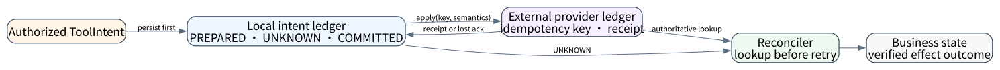
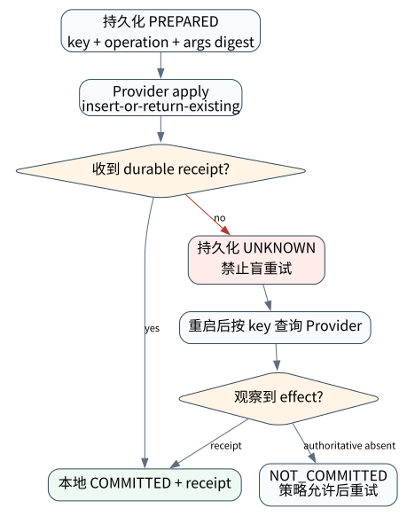

# 副作用恢复：COMMITTED、NOT_APPLIED 与 UNKNOWN

> **本章核心判断**：网络错误或进程崩溃不能推出外部动作“失败”。当 effect 可能已提交而本地未收到确认，唯一诚实状态是 `UNKNOWN`；系统必须用稳定幂等键查询真实外部状态并协调，禁止盲目重试或靠模型猜测。

上一章限制哪些 effect 可以发生；本章处理一个已授权 effect 在本地与外部系统之间出现不确定性。下一章衡量可靠机制带来的延迟与成本。



## 问题背景与学习目标

支付请求超时、邮件发送连接断开、部署 API 返回 502，都只说明调用方没有得到可靠确认。外部系统可能尚未收到、已收到未执行、已提交、已提交但 response 丢失。若 Agent 把 timeout 当失败重试，可能重复扣款/发送/部署；若当成功，可能漏掉业务结果。

本章完成后，读者应能：

- 区分 intent、attempt、effect、receipt 与本地 state；
- 使用 `PREPARED/UNKNOWN/COMMITTED/NOT_COMMITTED` 描述可观测事实；
- 设计语义绑定的 idempotency key 与 provider lookup；
- 理解 at-least-once delivery、effectively-once outcome 与 exactly-once 神话；
- 在真实双 SQLite durability domain 中复现 lost-ack crash window；
- 选择 retry、reconcile、compensate 或 human escalation，而不是一律重试。

## 核心概念与系统直觉

> **Invariant**：任何 `UNKNOWN` 外部 effect 在 retry 或 compensation 前，必须按稳定 idempotency key 查询外部 durable state；recovery 后相同 intent 最多对应一个业务 effect。

**Intent** 是本地持久化的业务意图，包含 key、operation、规范化参数、principal/policy 和状态。它必须在首次远端调用前 durable。

**Idempotency key** 不是随机 request ID 的同义词。它标识“同一个业务 effect”，并必须绑定 operation/amount/recipient 等语义；相同 key 改参数应冲突，而不是返回旧结果。

**Receipt** 是外部系统对 effect 的可验证引用。HTTP 200 但无稳定查询/receipt，恢复能力仍很弱；HTTP timeout 但 provider 可按 key 查询，则可以收敛。

**UNKNOWN 是知识状态，不是业务终态。** 它表示本地 evidence 不足。只有外部 observation 能转成 `COMMITTED` 或 `NOT_COMMITTED`。

**Compensation 不是 rollback。** 已发送邮件无法撤回，退款不等于原支付没发生，回滚部署可能产生第二个 effect。Compensation 也是独立、幂等、可失败的 workflow。

## 原理与理论基础

两系统之间无法用本地 transaction 原子提交。典型时序：

$$
persist(intent) \rightarrow send(effect) \rightarrow remote\ commit \rightarrow receive(receipt)
$$

在 `remote commit` 与 `receive receipt` 间崩溃，本地 observation 对“远端已提交”和“远端未提交”不可区分。这是 epistemic uncertainty，不是更长 timeout 可以彻底消除。

安全恢复依赖两个性质：provider 对 key 去重；provider 能查询 key 的 durable outcome。若二者成立，客户端可以 at-least-once 重试通信，同时获得 effectively-once business effect。严格 exactly-once 跨任意外部系统通常需要共同 transaction/consensus，不能靠 SDK retry 声明。

状态转移可写为：

$$
PREPARED \rightarrow
\begin{cases}
COMMITTED(receipt) & confirmed\\
UNKNOWN & acknowledgement\ lost\\
NOT\_COMMITTED & authoritative\ negative\ observation
\end{cases}
$$

`UNKNOWN -> retry` 是非法捷径；必须先 `reconcile`。若 lookup 也不可靠，维持 UNKNOWN 并升级人工，而不是反复扩大 effect。

## 关键机制与执行流程



1. **规范化 intent**：确定 operation/resource/args digest、tenant/principal、policy 和 effect key；
2. **本地 PREPARED**：在任何远端调用前持久化，重复 key 检查语义一致；
3. **远端 apply**：携带 key，provider 原子 `insert-or-return-existing`；
4. **记录 receipt**：本地 `COMMITTED` 与 receipt durable 写入；
5. **丢失确认**：写 `UNKNOWN`，暂停自动重试/补偿；
6. **Reconcile**：按 key 查询 provider；观察到 receipt 则修复 COMMITTED，权威无记录则 NOT_COMMITTED；
7. **恢复继续**：COMMITTED 返回原 receipt；NOT_COMMITTED 可在策略允许下重新 apply；持续 UNKNOWN 转人工。

生产实现还应使用 outbox/inbox 消除“业务状态写入与消息发送”之间的本地双写，并让 worker lease/visibility timeout 与 effect status 解耦。

## 从原理到实现

本章用两个 SQLite 文件真实建立本地/远端 durability domain。远端以 key 唯一约束并验证语义一致：

```python
class ExternalEffectLedger:
    def apply(self, key, operation, amount):
        self.db.execute(
            "INSERT OR IGNORE INTO effects(idempotency_key,operation,amount,receipt) "
            "VALUES(?,?,?,?)",
            (key, operation, amount, receipt),
        )
        row = lookup(key)
        if (row.operation, row.amount) != (operation, amount):
            raise ValueError("idempotency key reused with a different effect")
        return row.receipt
```

故障发生在 remote apply 已 commit、本地 receipt 未 commit：

```python
try:
    coordinator.execute("charge-33", "charge_cents", 4200, lose_ack=True)
except EffectOutcomeUnknown:
    assert coordinator.status("charge-33") == "UNKNOWN"
coordinator.close()

reopened = EffectCoordinator(local_db, remote)
assert reopened.reconcile("charge-33") == "COMMITTED"
receipt = reopened.execute("charge-33", "charge_cents", 4200)
assert remote.count("charge-33") == 1
```

关闭/重开证明 recovery 不依赖内存变量；最后一次 execute 证明 reconcile 后重放返回同一 receipt。代码位于 `assurance_system.py`。

## 主流系统实现对照与源码阅读入口

| 模式/系统 | 解决什么 | 必须验证 | 常见误解 |
|---|---|---|---|
| Provider idempotency key | 重复请求去重 | key scope、TTL、参数冲突、lookup | 有 key 就永远 exactly-once |
| Transactional outbox | 本地 DB 状态与待发消息原子 | relay 重放、consumer inbox 去重 | 消息发送本身 exactly-once |
| Workflow engine activity retry | durable schedule/retry | activity/effect idempotency、heartbeat、timeout | workflow durable 自动令外部 effect safe |
| Saga/compensation | 多步骤业务修复 | 补偿次序、幂等、补偿失败 | compensation 等于 transaction rollback |
| A2A/MCP task/tool result | 跨边界状态/结果 | task/effect identity、receipt、cancel 语义 | protocol completed 等于业务 effect 可逆 |

阅读上游实现时，寻找 effect key 在哪里生成、provider 是否保存、lookup API、参数冲突行为、TTL、重试策略和 receipt 如何回写。只看 retry decorator 会遗漏真正的 correctness boundary。

## 设计方案与方法对比

| 策略 | 优点 | 风险 | 使用条件 |
|---|---|---|---|
| Blind retry | 简单 | 重复不可逆 effect | 仅纯读或天然幂等操作 |
| Client-side dedupe | 避免本地重复 | 多客户端/远端已提交仍未知 | 单一 writer 的辅助层 |
| Provider idempotency + lookup | 可自动收敛 | provider 语义/TTL 限制 | 首选外部 effect 模式 |
| Transactional outbox/inbox | 本地消息可靠 | 增加 relay/存储复杂度 | 事件驱动系统 |
| Human reconciliation | 适合无查询/高风险 | 延迟与人工成本 | 持续 UNKNOWN/不可逆 effect |
| Compensation saga | 可修复部分业务 | 二次 effect 也可能失败 | 有明确补偿语义 |

选择依据不是“框架支持 retry”，而是 effect 可逆性、provider observation 能力、重复损害和业务时限。

## 可复现实验

### Lab 33A — 正常提交与幂等重放

```bash
PYTHONPATH=src uv run python examples/chapters/ch33_effect_recovery.py
```

实际输出核心字段：

```json
{"reported_before_reconcile":"COMMITTED","reconciled":"COMMITTED","receipt":"rcpt_046c902140291034","remote_effect_count":1,"evidence_level":"L1_MECHANISM"}
```

### Lab 33B — 远端提交后确认丢失

```bash
PYTHONPATH=src uv run python examples/chapters/ch33_effect_recovery.py --fault
```

实际输出核心字段：

```json
{"reported_before_reconcile":"UNKNOWN","reconciled":"COMMITTED","receipt":"rcpt_046c902140291034","remote_effect_count":1,"recovered":true,"evidence_level":"L4_RECOVERED"}
```

**关键断点与验收。** 在 PREPARED、remote commit、UNKNOWN、重开、lookup、receipt repair 和最终重放处检查两个数据库。B 必须从 UNKNOWN 收敛到 COMMITTED，且远端 effect count 始终为 1；只捕获 timeout 不算恢复。完整步骤见 [Lab 33A](../../../labs/core/lab-33A-effect-recovery.md) 与 [Lab 33B](../../../labs/core/lab-33B-effect-recovery-fault.md)。

## 工程场景与系统设计

支付：key 通常绑定 merchant/order/effect type，provider charge 查询是事实源；邮件：使用 provider message ID 或自建 outbox，重复发送危害高；部署：以 desired revision 与 cluster observation 协调；数据库写：优先在单库 transaction 内完成，不要不必要地变成分布式 effect。

Agent runtime 应把工具按 effect semantics 分类：PURE、IDEMPOTENT、AT_LEAST_ONCE_SAFE、EXTERNALLY_IDEMPOTENT、NON_IDEMPOTENT/UNKNOWN。模型无权声明某工具幂等；registry contract 与实现测试决定 retry policy。高风险 UNKNOWN 建立 queue、SLA、owner 和 runbook。

## 故障模型、失败模式与排错

- **Lost acknowledgement**：远端可能已提交；进入 UNKNOWN，按 key 查；
- **Key 语义漂移**：同 key 不同金额/收件人；强制参数 digest conflict；
- **Provider key TTL 到期**：旧重放可能再次 effect；本地永久 receipt 与业务状态限制；
- **Lookup eventual consistency**：短时查不到不等于未提交；按 provider consistency 定义等待/人工；
- **Local receipt 损坏**：从外部查询修复，但保留 audit correction；
- **Concurrent workers**：都处理同 intent；本地 lease + provider unique key 双层防护；
- **Cancel race**：取消与 effect 同时发生；查询最终 effect，而非相信 cancel response；
- **Compensation 失败**：建立新 intent/key/state machine，不覆盖原 effect。

排错先确定 effect identity 与 provider，再查本地 intent/attempt、远端 receipt、key TTL/参数、最后决定 retry/compensate；不要从 HTTP status 单独推断。

## 性能、可靠性与工程化

指标包括 UNKNOWN rate/age、reconciliation latency、duplicate prevented、key conflict、manual queue、compensation success、provider lookup error、effect-to-receipt latency。UNKNOWN backlog 是可靠性债务，应有 SLO 和告警。

性能优化不能删除 pre-write 或 fsync 边界；可批量 outbox、异步 relay、索引 status/key、分片 reconcile worker，但必须保持单 intent 序列化和 provider 限流。对昂贵 lookup 使用带版本的 backoff，不缓存“未找到”为永久事实。

## 技术边界与设计取舍

Core Lab 两个 SQLite 在同主机/进程，未模拟真实网络分区、provider eventual consistency、key TTL、认证或多 worker race；但故障点是真实 transaction 顺序，不是把字典状态手改为 UNKNOWN。L4 证明此 fixture 的 crash/reopen/reconcile 收敛，不外推所有 provider。

若外部系统不支持 idempotency/lookup，自动化上限很低。可以通过队列串行化、业务自然 key、只读 dry run、人工确认降低风险，但不能诚实承诺 exactly-once。

## 前沿研究与演进方向

研究方向包括跨 Agent/runtime 的统一 effect receipt、协议级 idempotency 与 cancellation、可验证 saga、基于事件溯源的自动 repair、以及将不确定性作为一等状态纳入 planning。模型可帮助归类/生成 runbook，但 effect truth 仍来自外部 observation。

长时 Agent 将面临更长的 UNKNOWN 链和跨服务 compensation。如何合成正确恢复策略、验证 compensation 不变量、对最终一致系统给出时序保证，仍是系统与形式方法的交叉问题。

截至 2026-09-11，本书不把任何框架的“durable execution”宣传外推为外部 effect exactly-once；必须逐个工具审计 idempotency 与 reconciliation。

### 深度审计与研究证据链

恢复证据必须跨进程边界并观察独立 durability domain。双 SQLite 实验保存 UNKNOWN、关闭本地连接、从远端 receipt 修复并证明 effect count 为一，因此在限定 fixture 内达到 L4；真实支付/邮件/部署仍要用各自 sandbox provider 的 key、lookup 和 receipt 重做。

## 本章总结与进阶实践

Effect recovery 的核心不是多重试，而是承认不知道：intent 先持久化，key 绑定语义，timeout 进入 UNKNOWN，外部查询闭合事实，receipt 修复本地状态，重复执行不增加业务 effect。

进阶问题（答案见[附录 L](../appendix-l-part6-solutions.html#ch33)）：

1. 为什么 timeout 既不能视为失败，也不能视为成功？
2. 幂等键为什么必须绑定规范化业务语义？
3. Transactional outbox 解决了什么，又没解决什么？
4. Compensation 为什么不能覆盖原 effect 状态？
5. 如何把本章双 SQLite L4 升级为真实 provider 的恢复证据？
