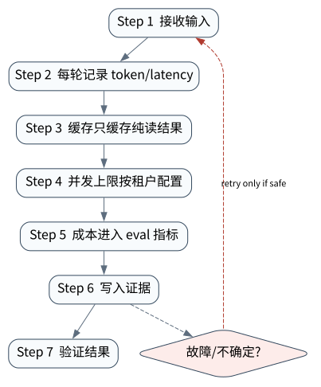

# 性能与成本：Token、延迟、并发和缓存

> **本章核心判断**：Agent 性能不是单次模型延迟，而是模型轮数、工具耗时、检索成本、并发策略、上下文压缩和失败重试的综合结果。

上一章：副作用恢复：COMMITTED、NOT_APPLIED 与 UNKNOWN。本章把前一章已经建立的能力进一步推进到 `Token budget`；下一章将进入：生产 Agent API：服务边界、租户、审批和审计。


## 问题背景与学习目标

Agent 性能不是单次模型延迟，而是模型轮数、工具耗时、检索成本、并发策略、上下文压缩和失败重试的综合结果。

在本章的 `Token budget` 场景中，真实 Agent 系统与普通“问答程序”的差异，在于一次任务会跨越模型、工具、状态、外部环境和人工治理边界。本章所有原理、代码与实验都围绕这些可验证问题展开。


**本章完成标准：**

- **机制理解**：能够解释“Agent 性能不是单次模型延迟，而是模型轮数、工具耗时、检索成本、并发策略、上下文压缩和失败重试的综合结果。”，并指出它对应的确定性软件边界；
- **正确性判断**：能够针对 `end-to-end latency is a critical path across model, tools, persistence, and retries` 构造一个反例，说明证据不足时系统为什么不能继续乐观执行；
- **实验与迁移**：运行 `Lab 34A` / `Lab 34B`，分别说明 normal/fault 的 evidence level，并把同一机制映射到至少一个上游实现或协议。

## 核心概念与系统直觉

本节不把概念当作术语清单，而是回答三个工程问题：它**是什么**、在系统里**负责什么**、以及它失效时**会留下什么可观测证据**。

### Token budget

**定义。** 一次 run 可用于 prompt、history、retrieval、reasoning 和 subagent 的 token 上限及分配策略。

**系统责任。** Budget 应按任务阶段动态分配并与价值/风险挂钩；上下文选择比无上限堆 token 更重要。

**失败边界。** 只限制总 token 不限制循环次数会被小调用耗尽预算；过度压缩又可能丢掉恢复和安全所需证据。

### Latency waterfall

**定义。** 把端到端延迟拆成 queue、model、retrieval、tool、network、approval、verification 等可归因阶段。

**系统责任。** Waterfall 帮助区分“模型慢”和“系统慢”，并识别可并行、可缓存或需换架构的关键路径。

**失败边界。** 只看平均响应时间会掩盖长尾 tool/approval；盲目并行所有步骤反而会增加 rate limit 和重复 work。

### Caching

**定义。** 复用模型、retrieval、tool 或 artifact 的已知结果，以降低重复成本和延迟。

**系统责任。** Cache key 必须包含影响语义的版本、权限和数据快照，并定义 TTL/invalidation； 高风险结果要谨慎复用。

**失败边界。** 错误 cache 会把旧权限、旧数据或旧 prompt 的结果带入新 run；共享 tenant cache 还可能形成数据泄露。

### Concurrency

**定义。** 同时推进多个 tool/subagent/task 的能力，目标是缩短独立工作的 wall‑clock，而不是单纯提高并发数。

**系统责任。** 需要配合 dependency graph、rate limit、resource pool、backpressure 和 deterministic fan‑in。

**失败边界。** 依赖任务被错误并行会产生竞态和脏状态；无限 fan‑out 会把 token/tool 成本和失败面同时放大。

## 原理与理论基础

### 系统不变量

> **Invariant**：end-to-end latency is a critical path across model, tools, persistence, and retries

不变量与普通“最佳实践”不同：最佳实践可以因为场景变化而替换，不变量一旦被破坏，系统就失去本章希望保证的正确性。例如 `只优化模型一次调用` 并不是一个 UI 问题，而是说明某个状态已经无法从证据中唯一判断。


### 故障模型

本章优先把 “只优化模型一次调用”、“缓存不考虑权限/时效”、“并发降低延迟但放大失败率” 作为可证伪故障，而不是泛化地枚举所有异常。对涉及外部 effect 的失败，判定顺序固定为“最后 durable state → effect 是否可能发生 → 现有 observation 是否足够决定下一步”；证据不足时停在 UNKNOWN/显式失败。

### Why / What if / Trade-off

本章真正的设计取舍不是“使用更强模型还是写更多规则”，而是确定 **Token budget** 与 **Latency waterfall** 分别应该由概率性决策还是确定性软件拥有。模型可以帮助识别候选路径，但它不会自动消除“只优化模型一次调用”这类系统失败；该失败必须由 runtime 的 schema、状态机、权限或 verifier 显式约束。

如果把 Token budget 完全交给模型，系统会把不可验证的语言判断混入执行事实；如果把 Latency waterfall 全部硬编码为固定 workflow，又会失去开放任务所需的适应性。更稳健的边界是：让模型负责提出候选决策，让软件负责 `每轮记录 token/latency`、`成本进入 eval 指标` 以及对不变量 **end-to-end latency is a critical path across model, tools, persistence, and retries** 的检查。

**What if。** 一旦“缓存不考虑权限/时效”发生，系统首先需要判断现有证据是否足够决定下一状态；证据不足时应停在显式失败或待协调状态，而不是让模型用自然语言补全事实。这个边界决定了本章方案是否具有可恢复性，而不只是演示效果。


### 形式化模型与可证伪假设

$$
Cost=\sum TokenCost+\sum ToolCost+Compute+HumanTime,\qquad L_{e2e}=CriticalPath+Queue
$$

Agent 成本不只是 token；工具、计算、人工审批和失败重试都应计入，延迟要看 critical path 与 queue。

**可证伪假设。** 关键路径并行化与 evidence-aware cache 比盲目增加并发更能降低 cost/latency。

**建议测量。** cost per verified task、critical-path latency、cache validity、human minutes per task。

## 关键机制与执行流程



**Step 1 — 每轮记录 token/latency。** `每轮记录 token/latency` 把短暂执行状态转换为后续能够读取的证据。写入内容至少要能关联本次 run、前一状态与下一状态；对 crash-sensitive 数据，应明确写入完成的判据。若进程在写入期间终止，恢复代码必须能够区分“没有记录”“完整记录”和“损坏/不确定记录”，而不能把半写状态视作成功。

**Step 2 — 缓存只缓存纯读结果。** `缓存只缓存纯读结果` 是“性能与成本：Token、延迟、并发和缓存”的一次显式状态转移。输入和输出都必须可序列化并关联 `run_id/step_id`；一旦该步骤失败，后继步骤只能依据已记录状态继续。关键观察点是 `Latency waterfall` 是否仍满足 **end-to-end latency is a critical path across model, tools, persistence, and retries**。

**Step 3 — 并发上限按租户配置。** `并发上限按租户配置` 是“性能与成本：Token、延迟、并发和缓存”的一次显式状态转移。输入和输出都必须可序列化并关联 `run_id/step_id`；一旦该步骤失败，后继步骤只能依据已记录状态继续。关键观察点是 `Caching` 是否仍满足 **end-to-end latency is a critical path across model, tools, persistence, and retries**。

**Step 4 — 成本进入 eval 指标。** `成本进入 eval 指标` 是“性能与成本：Token、延迟、并发和缓存”的一次显式状态转移。输入和输出都必须可序列化并关联 `run_id/step_id`；一旦该步骤失败，后继步骤只能依据已记录状态继续。关键观察点是 `Concurrency` 是否仍满足 **end-to-end latency is a critical path across model, tools, persistence, and retries**。

在本章的 `Token budget` 场景中，**最后一步 — 验证。** verifier 针对 `Concurrency` 检查本章不变量 **end-to-end latency is a critical path across model, tools, persistence, and retries**。如果“只优化模型一次调用”使现有 artifact/外部状态不足以证明成功，结果必须停在显式失败或 UNKNOWN；只有 observation 能闭合状态转移时，流程才允许进入 FINISHED。

### 数据流与控制流

本章的数据/控制链按 **每轮记录 token/latency → 缓存只缓存纯读结果 → 并发上限按租户配置 → 成本进入 eval 指标** 推进。调试时不要只看最终 answer，应确认每一阶段的输入来源、状态版本和 observation；对“只优化模型一次调用”尤其要检查动作前后的证据是否足以闭合不变量 **end-to-end latency is a critical path across model, tools, persistence, and retries**。


### 持久化点与崩溃窗口

本章需要持久化的内容取决于动作可逆性。与 `Token budget` 有关的纯计算状态通常可以重算；一旦 `缓存只缓存纯读结果` 可能产生昂贵、外部或不可逆效果，就必须在动作前后建立可区分的证据边界。对于本章不变量 **end-to-end latency is a critical path across model, tools, persistence, and retries**，恢复时最重要的问题是：最后一个已知状态是什么、动作是否可能已经发生、现有 observation 能否唯一决定 retry/continue/compensate。


## 从原理到实现


### 完整实验入口

```python
from __future__ import annotations
import argparse
from agentlab.course_scenarios import run_scenario

def main() -> int:
 p=argparse.ArgumentParser(description='性能与成本：Token、延迟、并发和缓存')
 p.add_argument("--fault", action="store_true", help="inject the chapter-specific failure path")
 args=p.parse_args()
 result=run_scenario('performance', fault=args.fault)
 print(result.as_json())
 return 0 if result.passed else 2

if __name__ == "__main__":
 raise SystemExit(main())
```

### 核心机制实现

```python
def performance(fault=False):
 stages={'model_ms':120,'tool_ms':80,'checkpoint_ms':5,'retry_ms':0 if not fault else 200}; total=sum(stages.values()); budget=250
 within=total<=budget
 return _ok('performance',fault,{'stages':stages,'total_ms':total,'slo_ms':budget,'within_slo':within},'end-to-end latency is a critical path across model, tools, persistence, and retries',within if not fault else not within)
```


### 简化假设与不能省略的机制


## 主流系统实现对照与源码阅读入口

| 项目 | 本书锁定版本/状态 | 应阅读的机制 | 已核验源码/文档入口 | 官方来源 |
|---|---|---|---|---|
| OpenAI Agents SDK | `v0.22.0 @ 4df9ecf` | 从 Agent/Runner 入口追踪 tool loop、RunState、session、guardrail 与 tracing；特别对照 v0.22.0 对 replay state 与 failed/incomplete response 的 hardening。 | 以官方 docs/release/source tree 为准 | [官方来源](https://github.com/openai/openai-agents-python) |
| LangGraph | `langgraph==1.2.11 @ 644815f` | 从 StateGraph/CompiledGraph 与 checkpointer 语义入手，观察 node/edge/state/pending writes 如何支持 interrupt、resume 与 fault tolerance。 | 以官方 docs/release/source tree 为准 | [官方来源](https://github.com/langchain-ai/langgraph) |
| Google Agent Development Kit | `v2.1.0 @ 6d15e19` | 比较 LlmAgent 与 Sequential/Parallel/Loop/graph workflow，把 session、sandbox、telemetry/evaluation 放在同一 runtime 视角下。 | 以官方 docs/release/source tree 为准 | [官方来源](https://github.com/google/adk-python) |

### 源码阅读方法

源码阅读以 **OpenAI Agents SDK** 为第一参照，并只追与“性能与成本：Token、延迟、并发和缓存”直接相关的公开执行链：入口 → durable/session state → 权限或协议边界 → verifier/trace。若上游没有公开某个服务端组件，本章不根据客户端现象反推其内部 scheduler、queue 或 policy engine。


### 工业实现为什么更复杂


对本章最值得关注的工程增量是：如何避免“只优化模型一次调用”、如何在“缓存不考虑权限/时效”后恢复，以及如何让 `成本进入 eval 指标` 的结果能够进入 tracing/evaluation。只有这些机制都能落到公开类型、函数或协议消息上，才算真正完成源码对照。

## 设计方案与方法对比

| 方案 | 核心优势 | 主要局限 | 更适合的约束 |
|---|---|---|---|
| 最小自研 AgentLab | 机制透明、可断点、无网络即可故障注入 | 生态/模型能力有限 | 教学、研究原型、回归基线 |
| OpenAI Agents SDK | 官方/主流实现提供成熟抽象与生态 | 抽象会隐藏部分底层机制，需要源码/trace 反推 | 生产集成与方案对照 |
| LangGraph | 状态/工作流抽象成熟，适合长任务与治理 | 框架状态不能自动解决外部副作用不确定性 | 企业 workflow、HITL、durable orchestration |
| Google Agent Development Kit | 状态/工作流抽象成熟，适合长任务与治理 | 框架状态不能自动解决外部副作用不确定性 | 企业 workflow、HITL、durable orchestration |


## 可复现实验

本章两个 Core Lab 都直接执行仓库内的确定性代码；它们证明的是“性能与成本：Token、延迟、并发和缓存”对应的本地机制与 fault oracle，而不是外部 provider 或真实云环境。第三方实现只在 `labs/upstream/` 按独立 L5 互操作证据记录，未实际执行时必须保持 `EXTERNAL_NOT_RUN_IN_THIS_RELEASE`。

### 实验环境

统一 Python/OS/离线复现约束、安装步骤与工具链版本集中维护在[附录 A](../appendix-a-environment.md)。本章只增加与“性能与成本：Token、延迟、并发和缓存”直接相关的 normal/fault 双轨验证；若需要真实云、浏览器、GPU 或第三方 provider，则在对应 upstream lab 中单独标记 `NOT_RUN_EXTERNAL`，不把未运行结果计入核心实验。

### Lab 34A — 正常路径

```bash
PYTHONPATH=src python examples/chapters/ch34_performance.py
```

**关键断点：**
- `src/agentlab/course_scenarios.py::performance`
- `examples/chapters/ch34_performance.py::main`

**本发布包实际输出：**

```json
{"contained": false, "evidence_level": "L1_MECHANISM", "evidence_meaning": "normal_path_assertion_satisfied", "fault": false, "fault_injected": false, "invariant": "end-to-end latency is a critical path across model, tools, persistence, and retries", "invariant_holds": true, "observation": {"slo_ms": 250, "stages": {"checkpoint_ms": 5, "model_ms": 120, "retry_ms": 0, "tool_ms": 80}, "total_ms": 205, "within_slo": true}, "oracle_detected": false, "passed": true, "recovered": false, "scenario": "performance", "system_detected": false}
```

PASS：退出码 0，`passed=true`、`fault=false`、`invariant_holds=true`；这只证明确定性 fixture 的正常机制断言。完整手册：[Lab 34A](../../../labs/core/lab-34A-performance.md)。

### Lab 34B — 故障注入

```bash
PYTHONPATH=src python examples/chapters/ch34_performance.py --fault
```

**本发布包实际输出：**

```json
{"contained": false, "evidence_level": "L2_ORACLE_ONLY", "evidence_meaning": "external_oracle_observed_bad_outcome_only", "fault": true, "fault_injected": true, "invariant": "end-to-end latency is a critical path across model, tools, persistence, and retries", "invariant_holds": false, "observation": {"slo_ms": 250, "stages": {"checkpoint_ms": 5, "model_ms": 120, "retry_ms": 200, "tool_ms": 80}, "total_ms": 405, "within_slo": false}, "oracle_detected": true, "passed": true, "recovered": false, "scenario": "performance", "system_detected": false}
```

PASS：退出码 0，`passed=true`、`fault=true`、`oracle_detected=true`。本章故障实验为 **L2_ORACLE_ONLY**：独立 oracle 观察到故障，但被测系统没有证明检测/约束/恢复。 `passed=true` 本身只表示实验 oracle 得到预期观察。完整手册：[Lab 34B](../../../labs/core/lab-34B-performance-fault.md)。

### 观察与证据


## 工程场景与系统设计

本章沿用第 29 章 AgentOps 负载，重点讨论在每天 5 万任务设计规模下的 token、延迟和并发预算，同时规定性能优化不得越过安全与恢复不变量。


### 上线前必须补齐

- 围绕 **性能与成本** 建立可审计状态字段与最小权限；
- 为本章相关动作记录 run_id、step_id、输入摘要与 observation；
- 对 `Agent 性能是模型延迟、上下文、工具、队列、重试和 fan-out 的组合。` 这一边界建立自动化验收；
- 为本章主要故障窗口配置 trace、日志和恢复 runbook；
- 上线前把教学 fixture 替换为真实 provider/tool/workspace，并重新执行 normal/fault 两条路径。

## 故障模型、失败模式与排错

本章至少主动测试以下失败：

- **只优化模型一次调用**：先确认最后 durable state，再检查是否已经产生外部效果；不要先重试。
- **缓存不考虑权限/时效**：先确认最后 durable state，再检查是否已经产生外部效果；不要先重试。
- **并发降低延迟但放大失败率**：先确认最后 durable state，再检查是否已经产生外部效果；不要先重试。


## 性能、可靠性与工程化

### 应采集指标

- `eval pass rate + confidence interval`
- `trace completeness`
- `security escape rate`
- `UNKNOWN rate`
- `retry amplification`
- `cost per successful task`


### 优化顺序


任何优化都必须重新运行 Lab A/B。尤其当优化改变 `Latency waterfall` 的生命周期时，要重新验证 **end-to-end latency is a critical path across model, tools, persistence, and retries**；否则平均延迟下降可能以更大的 stale state、重复副作用或取消失效为代价。

### 可靠性工程

本章可靠性 gate 直接针对 “只优化模型一次调用”、“缓存不考虑权限/时效”、“并发降低延迟但放大失败率”：只有正常路径与对应 fault path 都保持 **end-to-end latency is a critical path across model, tools, persistence, and retries**，优化或功能扩展才可接受。是否达到 detection、containment 或 recovery 以实验的 `evidence_level` 字段为准。


## 技术边界与设计取舍
本章方案有明确边界：

- LLM-as-judge 不是绝对真值，需要标定与人类/程序 verifier 交叉验证
- trace 只能观察已埋点路径，不能证明未记录副作用不存在
- prompt injection 无单一提示词能彻底解决，必须做权限/隔离防御
- 性能数字高度依赖模型/provider/工具与数据，不能跨环境直接比较

选择方案时要回到本章边界：如果业务不能接受“只优化模型一次调用”，就必须为 `Token budget` 增加更强的确定性约束；如果主要任务是开放式探索，则可以把更多 `Latency waterfall` 决策交给模型，但要用 `成本进入 eval 指标` 保持结果可验证。**OpenAI Agents SDK** 与 **LangGraph** 的差异也应放在这些约束下理解，而不是抽象成通用框架排名。

性能优化不能破坏正确性边界。缓存、并发、批处理和 speculative execution 若跨越副作用或权限判断，需要保留一致性条件；单纯降低 p95 不能成为绕过 verifier 或 durable state 的理由。

## 前沿研究与演进方向

当前研究和工业演进已经从“模型能否调用工具”推进到“怎样让长期、状态化、具有副作用的 Agent 可评估、可恢复、可治理”。与本章直接相关的资料：

- **[ReAct: Synergizing Reasoning and Acting in Language Models](https://arxiv.org/abs/2210.03629)**：提出 reasoning/action 交错轨迹，连接语言推理与外部环境动作。
- **[Toolformer: Language Models Can Teach Themselves to Use Tools](https://arxiv.org/abs/2302.04761)**：探索模型学习何时调用外部工具以及如何把工具结果纳入后续预测。
- **[OpenAI Agents SDK](https://github.com/openai/openai-agents-python)**（v0.22.0 @ 4df9ecf）：Agent/Runner/Tools/Handoffs/Guardrails/Sessions/HITL/Tracing；0.22.0 包含 runtime hardening。
- **[LangGraph](https://github.com/langchain-ai/langgraph)**（langgraph==1.2.11 @ 644815f）：状态图、durable execution、checkpointer、HITL、pending writes/fault tolerance。


### 截至 2026-09-11 的研究更新

本节只记录会改变本章系统结论的研究或官方规范更新；实验仍使用仓库锁定版本，避免把“最新观察版本”与“可复现实验版本”混为一谈。
- OpenAI: How agents are transforming work（2026‑06‑25）：long‑horizon delegated work, parallel agent labor and cross‑functional adoption。
- Anthropic: Patterns and problems in emerging multiagent systems（2026‑08‑13）： multi‑agent interaction risks, institutions, scale and oversight。

**本章吸收的变化。** Agent 优化必须同时考虑质量、延迟、成本和风险。大上下文、更多 subagent、 更多 verifier 都可能提高质量，也可能产生新的瓶颈。这些研究/规范的价值不在于替换本章原理，而在于把上述假设放进更真实、更长时或更高风险的环境中检验。

### Research Gap

围绕 `Token budget`，当前缺口不是“再增加一个 Agent API”，而是怎样把 **end-to-end latency is a critical path across model, tools, persistence, and retries** 从局部实现经验升级为跨模型、跨 runtime 可验证的系统属性。现有工业实现已经能够提供 tool loop、session、graph、plugin 或 workspace 等抽象，但在“只优化模型一次调用”和“缓存不考虑权限/时效”同时出现时，证据格式、恢复语义和评测方法仍缺少统一答案。

本章的研究更新不追求论文数量，而关注一个问题：现有工作是否真正推进了 **性能与成本** 的可验证性。Anthropic infrastructure noise 与 BrowseComp/Terminal-Bench 研究说明评测性能受资源和 harness 影响。 因此，本章会把论文结论放回不变量、失败窗口和实验断言中，而不是把研究当作参考文献列表。

### Open Problems

1. 如何把 `Token budget` 的正确性拆成可组合的局部不变量，并在不同 Agent runtime 中复用 verifier？
2. 当“只优化模型一次调用”与“缓存不考虑权限/时效”同时发生时，**OpenAI Agents SDK** 与 **LangGraph** 的公开抽象分别能保存哪些证据，哪些状态仍需要外部 reconciliation？
3. 如果模型能力显著提高，围绕 `Latency waterfall` 的哪些 harness 机制仍属于系统必要条件，哪些只是当前模型能力下的临时补丁？
4. 如何构造一个既保护真实业务数据、又能复现“并发降低延迟但放大失败率”的公开 benchmark，使研究结果可以被第三方验证？


### 深度审计与研究证据链：性能与成本

本章重新审计后的核心结论是：**Agent 性能是模型延迟、上下文、工具、队列、重试和 fan-out 的组合。** 这句话只有在代码、实验、开源源码和研究证据四个层面同时成立时才有教学价值。仅靠定义或 API 示例无法证明它，因为 Agent Systems 的风险通常发生在模型决策与外部环境之间的缝隙里。

**与本章最相关的近期/基础研究与官方资料：**

- **[OpenTelemetry GenAI semantic conventions](https://github.com/open-telemetry/semantic-conventions/tree/main/docs/gen-ai)**：提供 GenAI spans/events/metrics/MCP 语义约定。
- **[OGX](https://arxiv.org/abs/2608.14580)**：把 agentic application server 与多 provider API surface 作为部署方向。
- **[Anthropic infrastructure-noise analysis](https://www.anthropic.com/engineering/infrastructure-noise)**：提醒 agentic coding benchmark 会受 CPU/内存等基础设施影响。

这些资料与本章的关系不是“引用背书”，而是帮助读者识别设计边界。OpenAI Agents tracing、OTel GenAI、LangSmith metrics 可对照成本与延迟观测。 读者阅读源码时应主动寻找四个对象：输入如何进入系统、状态在哪里持久化、动作由谁执行、失败后谁负责恢复。

**实验语义边界。** 本章实验验证性能与成本的观测、评测、安全或生产控制面不变量；证据等级定义与解释规则统一见附录 A，且 `passed=true` 不得跨级推导 containment/recovery。


## 本章总结与进阶实践

### 核心结论

1. 本章不变量是：**end-to-end latency is a critical path across model, tools, persistence, and retries**；
2. `Token budget` 必须是可观察软件边界，而不是 prompt 约定；
3. `每轮记录 token/latency` 与 `成本进入 eval 指标` 之间必须有状态和证据连接；
4. 模型提出动作不等于系统已经执行，更不等于任务成功；
5. 正常路径只能证明功能，故障路径才能暴露恢复语义；
6. 开源实现的核心价值在于理解真实约束，不是复制 API；
7. 性能优化必须与可靠性/安全不变量一起重新验证；
8. 技术边界和未解决问题是高级系统设计的一部分。

### 常见误区

- 只优化模型一次调用
- 缓存不考虑权限/时效
- 并发降低延迟但放大失败率

### 思考题与实践

- **Why：** 为什么 `Token budget` 不能只靠模型“记住”？
- **What if：** 如果在 `每轮记录 token/latency` 与 `成本进入 eval 指标` 之间 crash，当前证据足够恢复吗？
- **Programming：** 修改 `examples/chapters/ch34_performance.py` 或对应 scenario，让系统新增一种错误类型，但仍保持 invariant。
- **Engineering：** 把 Lab B 的故障改成 timeout/duplicate/crash 中另一种，写出状态机和恢复步骤。
- **Research：** 选择本章一个 Open Problem，阅读两篇相互不同的方法，给出你自己的实验设计和 falsifiable hypothesis。

下一章进入 **生产 Agent API：服务边界、租户、审批和审计**，它将复用本章已经建立的状态/证据边界，而不是重新从 API 使用开始。
