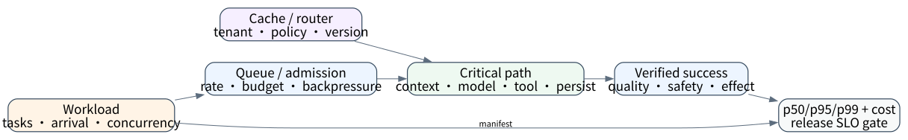
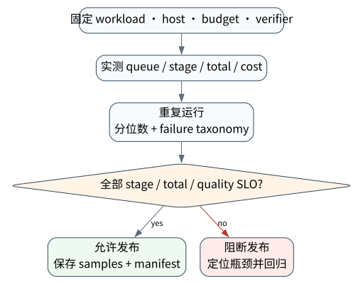

# 性能与成本：Token、延迟、并发和缓存

> **本章核心判断**：Agent 性能不是“模型响应时间”，而是 queue、context、model、tool、approval、persistence、retry 与 verification 组成的关键路径。优化必须以 verified success 为分母，并由实测 stage/SLO gate 约束；手填 timing 和只报平均值没有工程证据。

上一章确保 effect recovery 正确；本章研究这些机制与模型/工具组合的时间、资源和货币代价。下一章把预算与 SLO 放进生产 API 边界。



## 问题背景与学习目标

Agent 比单次 LLM call 更像分布式 workflow：一次 run 可能重复规划、并发工具、等待人、checkpoint、恢复并最终验证。减少模型 token 可能增加工具调用；提高并发可能触发 429 和重试风暴；缓存可能降低延迟但泄漏 tenant 或返回 stale policy；client timeout 可能没有取消后台成本。

本章完成后，读者应能：

- 构造 end-to-end critical path 与 queueing/cost 模型；
- 区分服务时间、排队时间、长尾、吞吐和并发；
- 用 stage budget + total budget 做 release gate；
- 设计有语义 key、tenant/policy/version 的安全缓存；
- 比较小型本地模型与 OpenAI 等远程模型时保持任务/verifier/预算一致；
- 分析 batching、parallelism、speculation、routing 与 reliability 的取舍。

## 核心概念与系统直觉

> **Invariant**：性能结论必须来自真实关键路径的分段测量；任何 stage 或 end-to-end budget 违反都要阻断对应 release，不能被平均值或其他快速阶段抵消。

**Latency 是分布，不是单值。** p50 代表常见体验，p95/p99 暴露 queue、provider、tool 和 retry 长尾；平均值对重尾分布误导。

**Service time 与 queue time 分离。** Provider call 很快但等待 concurrency semaphore 很久，用户仍慢；只在函数内部打点会漏掉排队。

**Critical path 不等于所有 stage 求和。** 串行 stage 相加，并行 fan-out 取最慢分支再加 join；重试和审批改变图结构。

**成本要按 verified success 归一。** 便宜但低成功率/高重试的模型可能每个成功任务更贵。Token、tool/API、compute、storage、人审和失败恢复都应计入。

**Cache 是带一致性与权限的状态。** Key 必须包含 tenant、task/input digest、model/provider、prompt/tool/policy/schema version；命中仍要验证授权和 freshness。

## 原理与理论基础

串行近似：

$$
T_{e2e}=T_q+T_{ctx}+\sum_i T_{model,i}+\sum_j T_{tool,j}+T_{persist}+T_{verify}+T_{retry}+T_{human}
$$

有并行 DAG 时，latency 是加权图的最长路径；总计算成本仍可能是所有分支之和。并行减少 wall time 不等于减少 cost。

Little's Law 在稳定系统下给出 $L=\lambda W$：到达率固定时，延迟增长意味着系统内在途任务增加。接近资源饱和后 queueing 会非线性上升，因此“多开并发”可能让 p99 和失败率同时恶化。

每个 verified success 的期望成本可表示：

$$
C_{verified}=\frac{C_{model}+C_{tool}+C_{compute}+C_{human}+C_{recovery}}{N_{verified}}
$$

若优化降低调用成本但使 verifier pass 下降，不能称为整体优化。应在质量/风险约束下寻找 latency-cost Pareto frontier。

## 关键机制与执行流程



1. **定义 workload**：task 分布、输入大小、模型/tool、warm/cold、到达率、并发和成功 verifier；
2. **分段 instrumentation**：queue/context/model/tool/persist/verify/retry/human，使用 monotonic clock；
3. **设预算**：stage budget 防止局部退化，total SLO 保护用户体验，cost/quality gate 保护经济性；
4. **重复运行**：报告分位数/区间、资源使用和失败类型，不 cherry-pick；
5. **瓶颈优化**：只优化 critical path 或主要 cost driver，并保持 task/verifier 相同；
6. **故障/压力验证**：429、slow tool、cache miss、provider timeout、cancel、worker saturation；
7. **Release gate**：任何 hard budget/quality/safety 退化阻止发布，保存可比较 manifest。

性能测试前应完成功能/可靠性验证；否则快速错误会看起来性能极佳。测试期间禁止调低 verifier 或跳过 persistence 来“优化”数字。

## 从原理到实现

`PerformanceProbe` 接收真实 callable，以 `perf_counter_ns()` 围绕执行测量，不接受调用者传入“预计毫秒”：

```python
probe = PerformanceProbe(
    {"assemble": 10, "tool": 15, "persist": 10},
    total_budget_ms=50,
)
report = probe.measure([
    ("assemble", assemble_context),
    ("tool", execute_tool),
    ("persist", persist_checkpoint),
])
assert report.release_allowed
```

Fault path 在 tool callable 中实际等待约 30ms：

```python
report = probe.measure([
    ("assemble", assemble_context),
    ("tool", lambda: measured_delay(0.03)),
    ("persist", persist_checkpoint),
])
assert not report.stages[1].within_budget
assert not report.release_allowed
```

特别注意：总时间仍可能低于 50ms，但 tool 超过 15ms，release 仍失败。局部预算保护的是下游 capacity/timeout contract，不允许被其他超快阶段抵消。

### 真实模型适配

基线可用小型本地模型或 scripted model，确保无 key 的 CI 回归；远程 OpenAI 运行应从环境注入 key、记录 model snapshot/name、request usage 与 provider request ID，且禁止输出 key/debug body。比较本地/远程时固定 task、tool、context、verifier、采样次数和预算，分别报告质量、p50/p95/p99 与 cost/verified success。

## 主流系统实现对照与源码阅读入口

| 层 | 常见机制 | 应测指标 | 主要风险 |
|---|---|---|---|
| Model provider | streaming、batch、prompt caching、usage | TTFT、tokens/s、p95、cost | 区域/版本/限流漂移 |
| Agent runtime | async、fan-out、checkpoint、retry | queue、critical path、retry amp | 无界并发、重复 effect |
| Tool/browser/code | pool、sandbox reuse、connection reuse | setup/tool/p99、resource | stale state、隔离减弱 |
| Storage/trace | batching、WAL、async export | fsync/export/drop | 为快而丢 durability |
| Router/cache | small/large model route、semantic cache | hit、quality delta、leakage | 错路由、跨租户/stale |

源码阅读应定位 semaphore/queue、timeout/cancel propagation、retry policy、cache key、usage accounting、checkpoint frequency 和 exporter backpressure。只读 API client 的 elapsed time 无法解释系统瓶颈。

## 设计方案与方法对比

| 优化 | 可能收益 | 正确性/风险代价 | 必须重测 |
|---|---|---|---|
| 压缩 context | token/latency 下降 | 丢失证据、错误决策 | verified success、引用完整性 |
| 并行 tools/agents | wall time 下降 | cost、冲突、rate limit | join、effect、p99、budget |
| Prompt/semantic cache | provider cost 下降 | stale/tenant/policy 泄漏 | key、freshness、权限 |
| 小模型 routing | 成本/延迟下降 | 复杂任务质量下降 | 风险分层与 fallback |
| Speculative execution | tail latency 下降 | 重复 compute/effect | cancel 与 side-effect isolation |
| 少 checkpoint | persistence 开销下降 | crash 重做/UNKNOWN 增加 | recovery time 与重复 effect |

先优化测得的瓶颈。若 model 占 80%，微调 JSON 序列化没有价值；若 queue 占 p99，换快 5% 的模型也无济于事。

## 可复现实验

### Lab 34A — 真实分段计时

```bash
PYTHONPATH=src uv run python examples/chapters/ch34_performance.py
```

一次实际输出示例（具体 elapsed 随主机变化）：

```json
{"release_allowed":true,"stages":[{"stage":"assemble","budget_ms":10,"elapsed_ms":0.046,"within_budget":true},{"stage":"tool","budget_ms":15,"elapsed_ms":0.001,"within_budget":true},{"stage":"persist","budget_ms":10,"elapsed_ms":0.007,"within_budget":true}],"total_ms":0.068,"evidence_level":"L1_MECHANISM"}
```

### Lab 34B — Tool 局部 SLO 违规

```bash
PYTHONPATH=src uv run python examples/chapters/ch34_performance.py --fault
```

一次实际输出示例：

```json
{"release_allowed":false,"stages":[{"stage":"assemble","within_budget":true},{"stage":"tool","budget_ms":15,"elapsed_ms":30.788,"within_budget":false},{"stage":"persist","within_budget":true}],"total_ms":30.924,"contained":true,"evidence_level":"L3_CONTAINED"}
```

**关键断点与验收。** 检查实际 callable 前后时钟、stage comparison 和 release decision。毫秒值不做跨主机等值断言；B 必须定位 tool stage，且即使 total 未超过 50ms 也阻断 release。完整步骤见 [Lab 34A](../../../labs/core/lab-34A-performance.md) 与 [Lab 34B](../../../labs/core/lab-34B-performance-fault.md)。

## 工程场景与系统设计

面向交互请求，可设 time-to-first-progress、end-to-end p95、tool stage deadline 与 cancel budget；长时任务则重视 checkpoint interval、queue fairness、cost cap 和 progress SLA。用户可见 streaming 只能改善感知延迟，不能掩盖后台 effect 未完成。

Router 可先用确定性规则（风险、任务类型、输入规模）选择小/大模型，再用固定 eval 校准。Fallback 不应无限：每次升级模型/重试都扣预算；达到上限进入 human/failed，而非继续烧钱。Cache 命中必须带 evidence，且高风险 task 通常只缓存纯读/确定性子结果。

## 故障模型、失败模式与排错

- **平均值掩盖长尾**：看 p95/p99、max 和 tail taxonomy；
- **Coordinated omission**：闭环压测在服务慢时减少请求；使用固定 arrival/open-loop；
- **Warm-only bias**：忽略模型/container/browser cold start；分别报告；
- **Retry storm**：429/timeout 触发同步重试；指数 backoff、jitter、budget/circuit breaker；
- **取消无效**：client 断开但 model/tool 继续；传播 cancel 并观察资源/effect；
- **Cache 泄漏**：key 缺 tenant/policy；强制隔离与负向测试；
- **并发竞态**：共享 workspace/browser/session；每 run 隔离或资源锁；
- **快而不正确**：跳过 verifier/persistence；以 verified success 和 recovery 一起 gate。

排错先画 critical path，再看 queue/resource saturation、stage spans、retry/cancel、cache hit 和 verifier；不要先凭总 token 猜原因。

## 性能、可靠性与工程化

可靠的 benchmark 需固定 host/container、CPU/GPU quota、provider/region、模型、task corpus、并发、arrival pattern、warmup、运行次数与 commit。性能 artifact 保存原始 samples 和 manifest，不只保存图表。跨 ARM/x86 可比较功能与规范化指标，但微秒/吞吐需分别报告架构。

容量规划从目标 arrival rate、SLO、平均/尾服务时间和 provider quota 推导并发；worker 采用有界 queue 和 backpressure。成本预算在 run 级原子预留，tool/model 每步扣减；超预算要产生明确终态和 partial artifact，不是 process kill 后丢证据。

## 技术边界与设计取舍

Core Lab 是单进程微基准，只证明计时来自真实执行和 gate 行为。`sleep` 注入模拟 slow stage，不代表实际 provider latency；一次本机数字无统计外推。CI 正常预算故意宽松，避免共享 runner 噪声造成误报；真实 SLO 需专用环境与多次采样。

更快并不总是更好：checkpoint、trace、approval、sandbox 和 verifier 都有成本，却保护恢复、安全与正确性。优化目标应是满足质量/风险/SLO 下的最低成本，而非删除防线追求最小 latency。

## 前沿研究与演进方向

前沿包括 learned routing、test-time compute allocation、adaptive stopping、KV/prompt cache、speculative multi-Agent、异构本地/云模型调度和 quality-aware autoscaling。核心挑战是把不确定质量纳入 scheduler，而不是只按 token price 或历史平均 latency 路由。

另一个方向是 Agent-specific load testing：任务长度随机、工具外部状态、恢复/审批会形成长相关性，传统无状态 API 压测不足。需要可重复 workload generator、effect-safe sandbox 和跨 stage causal profiles。

截至 2026-09-11，任何模型价格/延迟都是时间与区域敏感数据；教材不硬编码“当前最便宜/最快”结论，读者应在自己的锁定环境重新测量。

### 深度审计与研究证据链

本章只把计时器实际包围 callable 后产生的数字称为 measurement，并明确单次本机值不外推。可信性能声明至少需要锁定 workload/host/provider、原始 samples、分位数和 verified-success 分母；教材中的 30ms fault 是 release-gate 证据，不是任何模型/provider 延迟结论。

## 本章总结与进阶实践

Agent 性能工程的单位是 verified task，而不是单个 model call。先定义 workload 和 success，再实测 critical path，报告分布和完整成本，用 stage/total/quality/safety gates 控制优化。

进阶问题（答案见[附录 L](../appendix-l-part6-solutions.html#ch34)）：

1. 为什么 total latency 未超预算，单个 stage 超预算仍应失败？
2. 并行执行为什么可能降 latency 却增加 cost 与错误？
3. Cache key 至少应包含哪些安全和版本维度？
4. 如何公平比较本地小模型与远程强模型？
5. 怎样把本章微基准升级为可信的 p99/容量实验？
