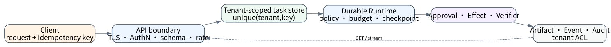
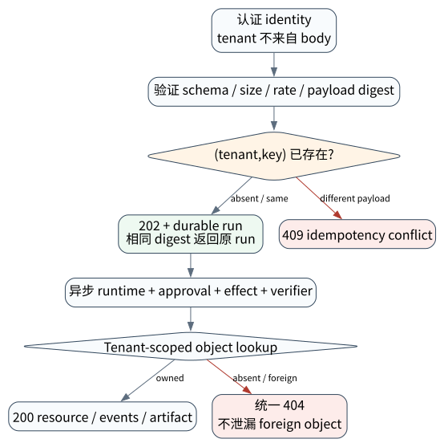

# 生产 Agent API：服务边界、租户、审批和审计

> **本章核心判断**：生产 Agent API 不是把聊天函数包成 HTTP。它必须将认证 identity、tenant ownership、幂等请求、异步 task state、审批、artifact/effect、审计与资源预算变成服务端不变量，并在存储层执行隔离。

第 29–34 章建立了判定、benchmark、证据、安全、恢复和性能门禁。本章把它们组合成对外服务边界；下一章进入部署与发布工程。



## 问题背景与学习目标

一个同步 `/chat` endpoint 无法可靠承载长时 Agent：客户端断开后任务是否继续？重试会不会创建两个 run？谁能读 artifact/trace？审批如何恢复？同一用户跨 tenant 如何授权？模型超时是否取消 tool？API 返回 200 是否代表 effect 已提交？

本章完成后，读者应能：

- 设计 request、run/task、artifact、approval、effect 的独立 identity；
- 使用 202 + durable task resource 表达异步执行；
- 在存储查询层绑定 tenant，而非响应层事后过滤；
- 实现 idempotency key + payload digest conflict；
- 处理认证、对象授权、不可枚举错误、rate/cost limit 和审计；
- 运行真实 loopback HTTP/SQLite normal 与 cross-tenant fault 实验。

## 核心概念与系统直觉

> **Invariant**：认证 tenant identity、idempotency 和 object ownership 必须在 HTTP 下方的持久层保持；外部标识不能绕过 tenant-scoped read/write，也不能因错误响应泄漏资源存在性。

**Request ID、idempotency key、run ID、effect key 不是同一个东西。** Request 标识一次传输；idempotency 标识同一创建意图；run 标识任务实例；effect key 标识某个外部业务副作用。混用会导致重试、审计与恢复语义错乱。

**202 Accepted 不是 success。** 它表示服务已持久接受 task，客户端通过 GET/events 查询 `ACCEPTED/RUNNING/WAITING_APPROVAL/COMPLETED/FAILED/...`。业务 success 还需 verifier/effect receipt。

**Authentication 不等于 authorization。** 有效 token 只证明 caller identity；每个 run/artifact/trace/approval 都需对象级 tenant/owner/policy 检查。

**Tenant isolation 必须下推。** SQL/object key/cache key/queue partition 都包含 tenant。先查全局对象再判断 tenant，会在 timing、log、cache 或 error body 泄漏。

**API schema 是兼容性合同。** Model/provider/tool 是内部实现；外部 task/event/artifact/error schema 应稳定版本化，避免把 provider 特有 JSON 暴露为公共协议。

## 原理与理论基础

一个资源访问判定可写为：

$$
Allow = AuthN(identity) \land Tenant(identity)=Tenant(resource) \land Policy(action,resource,context)
$$

其中 resource lookup 本身也应在 tenant predicate 内。对不存在与 foreign resource，公共响应使用同一 404，内部 audit 保留不同 reason。

创建幂等要求同一 $(tenant,key)$：相同 payload digest 返回原 run；不同 digest 返回 conflict。设创建函数 $C$：

$$
C(t,k,p)=
\begin{cases}
existing\ run & H(p)=stored\ digest\\
409 & H(p)\ne stored\ digest\\
new\ run & key\ absent
\end{cases}
$$

这避免网络重试重复 task，也避免客户端误用 key 时静默得到不相干结果。Task 执行的 effect 还需第 33 章的独立 effect key；创建幂等不自动使内部工具幂等。

## 关键机制与执行流程



1. **边界验证**：TLS、auth token、audience/issuer/expiry、body size/schema、content type；
2. **注入 identity**：服务端生成 tenant/principal context，忽略 body 自报 tenant；
3. **幂等接受**：在 transaction 内比较 `(tenant,key,payload_digest)` 并创建/返回 run；
4. **异步调度**：run state 写入 durable queue/store，worker 以 workload identity claim；
5. **执行治理**：能力、预算、checkpoint、trace、approval、effect/reconcile；
6. **对象读取**：GET/artifact/trace 都用 tenant-scoped lookup，不可枚举 foreign ID；
7. **终态验证**：COMPLETED 与 VERIFIED/effect receipt 分开，API 返回可机读 outcome；
8. **审计与 SLO**：accept、authz deny、idempotency conflict、state、effect、cost 全关联。

取消也应是资源操作而不是 kill signal：`POST /runs/{id}:cancel` 返回请求已接受，runtime 记录 cancel_requested；已提交 effect 仍需 observation，最终可能是 `CANCELED_WITH_EFFECT` 等更精确状态。

## 从原理到实现

本章使用真实 `ThreadingHTTPServer` 绑定 `127.0.0.1:0`，`urllib` 发送实际 HTTP。Teaching token 由 tenant + HMAC 构造并 constant-time 验证：

```python
auth = TenantAuthenticator(b"agentlab-teaching-key-2026")
token_a = auth.issue("tenant-a")
status, created = http_json(
    "POST",
    service.base_url + "/v1/runs",
    token=token_a,
    payload={"task": "audit invoice"},
    idempotency_key="request-35-a",
)
assert status == 202
```

Store 使用复合唯一约束和 tenant-scoped query：

```python
CREATE TABLE runs(
  tenant TEXT NOT NULL,
  run_id TEXT NOT NULL,
  idempotency_key TEXT NOT NULL,
  request_digest TEXT NOT NULL,
  state TEXT NOT NULL,
  PRIMARY KEY(tenant, run_id),
  UNIQUE(tenant, idempotency_key)
)

SELECT run_id,state FROM runs WHERE tenant=? AND run_id=?
```

相同 key/payload 两次 POST 返回同一 deterministic run；相同 key/不同 payload 返回 409。A token 读取真实 B run 时仍只得到统一 404。

## 主流系统实现对照与源码阅读入口

| API/模式 | 优势 | 重点审计 | 不应直接暴露 |
|---|---|---|---|
| REST task resource | 简单、缓存/权限语义清晰 | 202/state/idempotency/error/version | provider 内部 response 结构 |
| SSE/WebSocket stream | 增量进度与人机交互 | reconnect cursor、backpressure、auth refresh | secret/raw chain-of-thought |
| A2A task/artifact | 跨 Agent 标准任务语义 | discovery/auth/task state/artifact/cancel | 本地 tenant/IAM 自动正确 |
| MCP tool/resource | 标准化 tool/resource 交互 | auth/resource server/schema/approval | “发现即授权” |
| Framework hosted API | 快速集成 runtime/session | storage ownership、trace/retention、effect semantics | 供应商特有字段作为公共合同 |

读取生产服务源码应沿 middleware/auth → request validation → idempotency transaction → task store/queue → worker claim → policy/approval/effect → resource serializers → audit。只看 OpenAPI schema 无法验证存储隔离。

## 设计方案与方法对比

| 决策 | 方案 A | 方案 B | 选择依据 |
|---|---|---|---|
| 执行 | 同步长连接 | 202 + durable task | 超时、恢复、长任务 |
| 更新 | polling | SSE/WebSocket/webhook | 客户端能力、事件量、网络 |
| 隔离 | shared table + tenant predicate/RLS | 每 tenant DB/account | 风险、规模、运营成本 |
| 认证 | long-lived API key | OIDC/workload identity + short token | 用户/服务身份与轮换 |
| 审批 | 模型文本确认 | durable approval resource/receipt | 高风险 effect 必选后者 |
| 多版本 | provider passthrough | stable domain schema + adapter | 长期兼容/多 provider |

小型系统可以 shared DB，但要复合键/RLS、负向测试和 cache/queue tenant key；高监管/高价值 tenant 可提高物理隔离。隔离层级不是营销标签，应由 threat model 和审计验证。

## 可复现实验

### Lab 35A — HTTP 创建、读取与幂等重放

```bash
PYTHONPATH=src uv run python examples/chapters/ch35_production_api.py
```

实际输出核心字段：

```json
{"create_status":202,"idempotent_replay":true,"requested_run":"run_3d37a81fcb836704","get_status":200,"response":{"run_id":"run_3d37a81fcb836704","state":"ACCEPTED"},"evidence_level":"L1_MECHANISM"}
```

### Lab 35B — 有效 A token 读取 B 对象

```bash
PYTHONPATH=src uv run python examples/chapters/ch35_production_api.py --fault
```

实际输出核心字段：

```json
{"idempotent_replay":true,"requested_run":"run_ef0d87f7ac1120c9","get_status":404,"response":{"error":"not_found"},"foreign_identifier_leaked":false,"contained":true,"evidence_level":"L3_CONTAINED"}
```

**关键断点与验收。** 检查 token 得到的 tenant、create unique transaction、payload conflict 和 GET SQL。A 验收两次 POST 同 run；B 验收 foreign/absent 同 404 且 body 无 B 信息。完整步骤见 [Lab 35A](../../../labs/core/lab-35A-production-api.md) 与 [Lab 35B](../../../labs/core/lab-35B-production-api-fault.md)。

## 工程场景与系统设计

建议资源模型：`POST /v1/runs`、`GET /v1/runs/{id}`、`GET /v1/runs/{id}/events?cursor=`、`GET /artifacts/{id}`、`POST /approvals/{id}/decisions`、`POST /runs/{id}:cancel`。每个资源有 tenant/owner/ACL、ETag/version、retention 和 audit。

请求体引用 task/input/artifact，不携带服务端 secret；模型/provider config 由受控 policy/profile 选择。客户端可请求质量/成本 tier，但服务端根据 tenant quota/risk 限制。高风险 effect 进入 WAITING_APPROVAL，审批者看到 canonical intent/diff/resource，而非模型自由文本。

部署前至少测试：认证失败、token tamper/expiry、cross-tenant read/write、idempotency race/conflict、body bomb/schema、queue saturation、worker crash、cancel race、approval replay、effect UNKNOWN、artifact ACL、cache tenant key 与 trace redaction。

## 故障模型、失败模式与排错

- **BOLA/IDOR**：合法 token 猜 foreign ID；tenant-scoped lookup + 统一 404；
- **Body tenant spoofing**：客户端字段覆盖 identity；tenant 只来自认证 context；
- **幂等冲突**：同 key 不同 payload；409 并保留原 run；
- **并发重复创建**：先查后写竞态；数据库 unique + transaction；
- **Worker 重复 claim**：lease/version/CAS，内部 effect 仍用独立 key；
- **Cache 泄漏**：cache key 缺 tenant/auth policy；负向测试与 partition；
- **Stream reconnect 丢/重事件**：monotonic event seq/cursor，consumer 去重；
- **取消误解**：API ack 当成 effect 撤销；观察 task/effect 最终状态。

排错顺序：gateway/request ID → authenticated identity → idempotency row → task state/lease → policy/approval → effect receipt → tenant-scoped serializer/cache → audit/trace。

## 性能、可靠性与工程化

SLO 分层：accept latency、queue wait、time-to-first-progress、verified completion、approval wait、effect reconciliation、artifact availability。HTTP 2xx availability 不能代替 verified task success。Rate limit 同时按 tenant/principal/IP/model/tool/cost，避免一个 tenant 占满全局 provider quota。

容量与 backpressure：有界 queue；过载时 429/503 + retry-after，不无限接受；worker concurrency 与第 34 章预算关联；dead-letter 不是垃圾桶，要有 owner/replay contract。DB 索引以 tenant 为前缀，audit/artifact retention 分层。

## 技术边界与设计取舍

Core Lab 是本机明文 loopback HTTP，HMAC token 无 expiry/audience/key rotation，单 SQLite/单进程，无 TLS、OIDC、RLS、queue、SSE、多实例或真实模型。它真实验证 HTTP parser、socket、认证、幂等和存储隔离路径，但不是 production server 模板。

生产可使用 FastAPI/Starlette 等成熟框架、API gateway、OIDC library、PostgreSQL RLS 与 durable queue；但框架不会自动保证 tenant key、effect recovery 和 verifier gate。应保留本章负向不变量测试，不依赖代码 review 猜测。

## 前沿研究与演进方向

前沿包括跨组织 Agent identity/authorization、A2A task federation、MCP resource authorization、policy-carrying artifacts、verifiable delegation、长期 session privacy、以及标准化 approval/effect receipt。难点是让 authority 随委派衰减而非扩大，并能跨 host 保留审计链。

另一个方向是“Agent control plane”：模型和 runtime 可替换，而 task/evidence/policy/budget/identity API 稳定。它使多 provider、本地/云模型和 durable workflow 共享治理，但需要更严格 domain schema 和 migration。

截至 2026-09-11，本章不把协议兼容等同于多租户安全。互操作只解决消息形状；identity trust、tenant policy、storage isolation 与 effect semantics 仍由部署者证明。

### 深度审计与研究证据链

本章的 L3 来自真实 loopback HTTP、有效 foreign-tenant token、SQLite tenant predicate 与统一 404，而不是对列表做内存过滤。它仍是单实例 teaching boundary；TLS/OIDC/RLS/cache/queue 的生产隔离必须在部署拓扑中另存配置、负向测试与审计 evidence。

## 本章总结与进阶实践

生产 Agent API 是受治理的异步任务系统：入口认证，transaction 幂等接受，存储层 tenant 隔离，worker 持久执行，approval/effect/verdict 可审计，错误不泄漏对象存在性。模型只是其中一个执行组件。

进阶问题（答案见[附录 L](../appendix-l-part6-solutions.html#ch35)）：

1. 为什么 request ID、run ID 与 idempotency key 不能混用？
2. 202 Accepted 与 Agent 成功之间还缺哪些状态？
3. 为什么对象授权必须下推到 storage query？
4. 同一 idempotency key 改 payload 为什么应返回 conflict？
5. 如何把本章 loopback L3 升级为多实例、真实身份的隔离证据？
