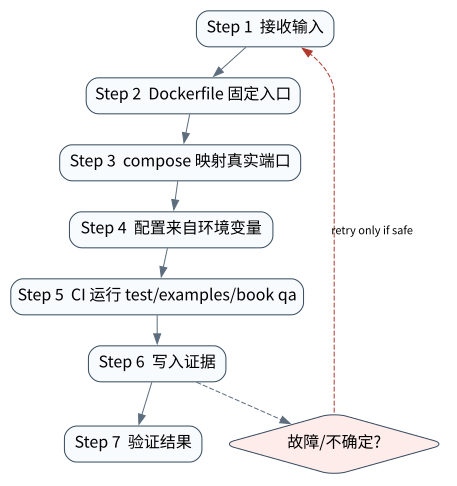

# 部署工程：Docker、本地开发与 CI 验证

> **本章核心判断**：部署不是把脚本塞进容器，而是确定依赖、端口、数据目录、健康检查、配置、权限和验证命令。

上一章：生产 Agent API：服务边界、租户、审批和审计。本章把前一章已经建立的能力进一步推进到 `Container`；下一章将进入：Post-training 与 Agent 能力塑形。


## 问题背景与学习目标

部署不是把脚本塞进容器，而是确定依赖、端口、数据目录、健康检查、配置、权限和验证命令。

在本章的 `Container` 场景中，真实 Agent 系统与普通“问答程序”的差异，在于一次任务会跨越模型、工具、状态、外部环境和人工治理边界。本章所有原理、代码与实验都围绕这些可验证问题展开。


**本章完成标准：**

- **机制理解**：能够解释“部署不是把脚本塞进容器，而是确定依赖、端口、数据目录、健康检查、配置、权限和验证命令。”，并指出它对应的确定性软件边界；
- **正确性判断**：能够针对 `deployment configuration is part of the executable system and must be tested for consistency` 构造一个反例，说明证据不足时系统为什么不能继续乐观执行；
- **实验与迁移**：运行 `Lab 36A` / `Lab 36B`，分别说明 normal/fault 的 evidence level，并把同一机制映射到至少一个上游实现或协议。

## 核心概念与系统直觉

本节不把概念当作术语清单，而是回答三个工程问题：它**是什么**、在系统里**负责什么**、以及它失效时**会留下什么可观测证据**。

### Container

**定义。** 把 runtime、依赖和系统工具封装成可部署单元，减少环境差异，但不等于自动可复现或安全。

**系统责任。** 镜像应固定 base digest/依赖、以非 root 运行、最小化工具面，并与 source revision 和 SBOM 关联。

**失败边界。** 使用 mutable latest、运行时 apt install 或挂载宿主 Docker socket 会破坏复现性并扩大权限。

### Config

**定义。** 模型、endpoint、feature flag、limit、policy 和非秘密参数的外部化配置；secret 应由专门 secret store 注入。

**系统责任。** Config 需要 schema、默认值、环境层级和变更审计，并避免同一参数在脚本/镜像/CI 重复硬编码。

**失败边界。** 配置漂移会造成“代码一样行为不同”；把 secret 写进 repo/image/log 则形成供应链泄露。

### Health check

**定义。** 判断进程是否存活、是否可接流量以及关键依赖是否满足最低条件的探针集合。

**系统责任。** liveness 与 readiness 应分开；Agent 服务还需暴露队列、workspace、model/tool dependency 和恢复能力指标。

**失败边界。** 只检查端口可连会把失去数据库/tool 权限的实例继续放流量；过强 liveness 又会在依赖抖动时制造重启风暴。

### CI

**定义。** 把 lint、unit、labs、eval、security、artifact build 和 reproducibility 固定为每次变更的自动门禁。

**系统责任。** CI 应固定 Action/工具版本、缓存边界和 artifact checksum，并让关键 regression 在模型/依赖升级时必跑。

**失败边界。** 只测 happy path 会让 runtime failure semantics 退化；CI 使用 mutable third‑party action 还会引入供应链不确定性。

## 原理与理论基础

### 系统不变量

> **Invariant**：deployment configuration is part of the executable system and must be tested for consistency

不变量与普通“最佳实践”不同：最佳实践可以因为场景变化而替换，不变量一旦被破坏，系统就失去本章希望保证的正确性。例如 `镜像能 build 但服务不可访问` 并不是一个 UI 问题，而是说明某个状态已经无法从证据中唯一判断。


### 故障模型

本章优先把 “镜像能 build 但服务不可访问”、“本地文件路径写死”、“验证只跑 happy path” 作为可证伪故障，而不是泛化地枚举所有异常。对涉及外部 effect 的失败，判定顺序固定为“最后 durable state → effect 是否可能发生 → 现有 observation 是否足够决定下一步”；证据不足时停在 UNKNOWN/显式失败。

### Why / What if / Trade-off

本章真正的设计取舍不是“使用更强模型还是写更多规则”，而是确定 **Container** 与 **Config** 分别应该由概率性决策还是确定性软件拥有。模型可以帮助识别候选路径，但它不会自动消除“镜像能 build 但服务不可访问”这类系统失败；该失败必须由 runtime 的 schema、状态机、权限或 verifier 显式约束。

如果把 Container 完全交给模型，系统会把不可验证的语言判断混入执行事实；如果把 Config 全部硬编码为固定 workflow，又会失去开放任务所需的适应性。更稳健的边界是：让模型负责提出候选决策，让软件负责 `Dockerfile 固定入口`、`CI 运行 test/examples/book qa` 以及对不变量 **deployment configuration is part of the executable system and must be tested for consistency** 的检查。

**What if。** 一旦“本地文件路径写死”发生，系统首先需要判断现有证据是否足够决定下一状态；证据不足时应停在显式失败或待协调状态，而不是让模型用自然语言补全事实。这个边界决定了本章方案是否具有可恢复性，而不只是演示效果。


### 形式化模型与可证伪假设

$$
Artifact=f(Source,Lock,Toolchain,BuildEnv),\qquad Health\ne ProcessAlive
$$

部署可复现性来自源码、依赖锁、工具链和构建环境；容器只是其中一种封装。健康检查也不能等同于进程存活。

**可证伪假设。** 锁定构建 + deterministic release 能显著降低“同 tag 不同 artifact”；语义 health check 能更早发现依赖失效。

**建议测量。** artifact hash stability、bootstrap success、semantic health、rollback time。

## 关键机制与执行流程



**Step 1 — Dockerfile 固定入口。** `Dockerfile 固定入口` 是“部署工程：Docker、本地开发与 CI 验证”的一次显式状态转移。输入和输出都必须可序列化并关联 `run_id/step_id`；一旦该步骤失败，后继步骤只能依据已记录状态继续。关键观察点是 `Container` 是否仍满足 **deployment configuration is part of the executable system and must be tested for consistency**。

**Step 2 — compose 映射真实端口。** `compose 映射真实端口` 是“部署工程：Docker、本地开发与 CI 验证”的一次显式状态转移。输入和输出都必须可序列化并关联 `run_id/step_id`；一旦该步骤失败，后继步骤只能依据已记录状态继续。关键观察点是 `Config` 是否仍满足 **deployment configuration is part of the executable system and must be tested for consistency**。

**Step 3 — 配置来自环境变量。** `配置来自环境变量` 是“部署工程：Docker、本地开发与 CI 验证”的一次显式状态转移。输入和输出都必须可序列化并关联 `run_id/step_id`；一旦该步骤失败，后继步骤只能依据已记录状态继续。关键观察点是 `Health check` 是否仍满足 **deployment configuration is part of the executable system and must be tested for consistency**。

**Step 4 — CI 运行 test/examples/book qa。** `CI 运行 test/examples/book qa` 是“部署工程：Docker、本地开发与 CI 验证”的一次显式状态转移。输入和输出都必须可序列化并关联 `run_id/step_id`；一旦该步骤失败，后继步骤只能依据已记录状态继续。关键观察点是 `CI` 是否仍满足 **deployment configuration is part of the executable system and must be tested for consistency**。

在本章的 `Container` 场景中，**最后一步 — 验证。** verifier 针对 `CI` 检查本章不变量 **deployment configuration is part of the executable system and must be tested for consistency**。如果“镜像能 build 但服务不可访问”使现有 artifact/外部状态不足以证明成功，结果必须停在显式失败或 UNKNOWN；只有 observation 能闭合状态转移时，流程才允许进入 FINISHED。

### 数据流与控制流

本章的数据/控制链按 **Dockerfile 固定入口 → compose 映射真实端口 → 配置来自环境变量 → CI 运行 test/examples/book qa** 推进。调试时不要只看最终 answer，应确认每一阶段的输入来源、状态版本和 observation；对“镜像能 build 但服务不可访问”尤其要检查动作前后的证据是否足以闭合不变量 **deployment configuration is part of the executable system and must be tested for consistency**。


### 持久化点与崩溃窗口

本章需要持久化的内容取决于动作可逆性。与 `Container` 有关的纯计算状态通常可以重算；一旦 `compose 映射真实端口` 可能产生昂贵、外部或不可逆效果，就必须在动作前后建立可区分的证据边界。对于本章不变量 **deployment configuration is part of the executable system and must be tested for consistency**，恢复时最重要的问题是：最后一个已知状态是什么、动作是否可能已经发生、现有 observation 能否唯一决定 retry/continue/compensate。


## 从原理到实现


### 完整实验入口

```python
from __future__ import annotations
import argparse
from agentlab.course_scenarios import run_scenario

def main() -> int:
 p=argparse.ArgumentParser(description='部署工程：Docker、本地开发与 CI 验证')
 p.add_argument("--fault", action="store_true", help="inject the chapter-specific failure path")
 args=p.parse_args()
 result=run_scenario('deployment', fault=args.fault)
 print(result.as_json())
 return 0 if result.passed else 2

if __name__ == "__main__":
 raise SystemExit(main())
```

### 核心机制实现

```python
def deployment(fault=False):
 docker={'expose':8010,'compose_host':8010,'health':'/healthz'}
 if fault: docker['compose_host']=8000
 consistent=docker['expose']==docker['compose_host'] and docker['health'].startswith('/')
 return _ok('deployment',fault,docker,'deployment configuration is part of the executable system and must be tested for consistency',consistent if not fault else not consistent)
```


### 简化假设与不能省略的机制


## 主流系统实现对照与源码阅读入口

| 项目 | 本书锁定版本/状态 | 应阅读的机制 | 已核验源码/文档入口 | 官方来源 |
|---|---|---|---|---|
| Google ADK documentation | `docs observed 2026-09-09` | Agent/Sequential/Parallel/Loop、多 Agent、session/memory/eval/deployment。 | 以官方 docs/release/source tree 为准 | [官方来源](https://google.github.io/adk-docs/) |
| OpenHands SDK architecture | `docs observed 2026-09-09` | Software Agent SDK / Agent Server / applications 分层。 | 以官方 docs/release/source tree 为准 | [官方来源](https://docs.openhands.dev/sdk/arch/overview) |
| Microsoft Agent Framework | `Python 1.13.0` | 从 Workflow executor/superstep/checkpoint 语义入手，对照 pending messages、requests/responses 与 shared state 的持久化边界。 | 以官方 docs/release/source tree 为准 | [官方来源](https://github.com/microsoft/agent-framework) |

### 源码阅读方法

源码阅读以 **Google ADK documentation** 为第一参照，并只追与“部署工程：Docker、本地开发与 CI 验证”直接相关的公开执行链：入口 → durable/session state → 权限或协议边界 → verifier/trace。若上游没有公开某个服务端组件，本章不根据客户端现象反推其内部 scheduler、queue 或 policy engine。


### 工业实现为什么更复杂


对本章最值得关注的工程增量是：如何避免“镜像能 build 但服务不可访问”、如何在“本地文件路径写死”后恢复，以及如何让 `CI 运行 test/examples/book qa` 的结果能够进入 tracing/evaluation。只有这些机制都能落到公开类型、函数或协议消息上，才算真正完成源码对照。

## 设计方案与方法对比

| 方案 | 核心优势 | 主要局限 | 更适合的约束 |
|---|---|---|---|
| 最小自研 AgentLab | 机制透明、可断点、无网络即可故障注入 | 生态/模型能力有限 | 教学、研究原型、回归基线 |
| Google ADK documentation | 官方/主流实现提供成熟抽象与生态 | 抽象会隐藏部分底层机制，需要源码/trace 反推 | 生产集成与方案对照 |
| OpenHands SDK architecture | 贴近 coding/长期执行 harness，工作区和工具边界更真实 | 依赖更重或迭代快，升级需锁版本做回归 | Coding Agent、Harness 源码学习 |
| Microsoft Agent Framework | 状态/工作流抽象成熟，适合长任务与治理 | 框架状态不能自动解决外部副作用不确定性 | 企业 workflow、HITL、durable orchestration |


## 可复现实验

本章两个 Core Lab 都直接执行仓库内的确定性代码；它们证明的是“部署工程：Docker、本地开发与 CI 验证”对应的本地机制与 fault oracle，而不是外部 provider 或真实云环境。第三方实现只在 `labs/upstream/` 按独立 L5 互操作证据记录，未实际执行时必须保持 `EXTERNAL_NOT_RUN_IN_THIS_RELEASE`。

### 实验环境

统一 Python/OS/离线复现约束、安装步骤与工具链版本集中维护在[附录 A](../appendix-a-environment.md)。本章只增加与“部署工程：Docker、本地开发与 CI 验证”直接相关的 normal/fault 双轨验证；若需要真实云、浏览器、GPU 或第三方 provider，则在对应 upstream lab 中单独标记 `NOT_RUN_EXTERNAL`，不把未运行结果计入核心实验。

### Lab 36A — 正常路径

```bash
PYTHONPATH=src python examples/chapters/ch36_deployment.py
```

**关键断点：**
- `src/agentlab/course_scenarios.py::deployment`
- `examples/chapters/ch36_deployment.py::main`

**本发布包实际输出：**

```json
{"contained": false, "evidence_level": "L1_MECHANISM", "evidence_meaning": "normal_path_assertion_satisfied", "fault": false, "fault_injected": false, "invariant": "deployment configuration is part of the executable system and must be tested for consistency", "invariant_holds": true, "observation": {"compose_host": 8010, "expose": 8010, "health": "/healthz"}, "oracle_detected": false, "passed": true, "recovered": false, "scenario": "deployment", "system_detected": false}
```

PASS：退出码 0，`passed=true`、`fault=false`、`invariant_holds=true`；这只证明确定性 fixture 的正常机制断言。完整手册：[Lab 36A](../../../labs/core/lab-36A-deployment.md)。

### Lab 36B — 故障注入

```bash
PYTHONPATH=src python examples/chapters/ch36_deployment.py --fault
```

**本发布包实际输出：**

```json
{"contained": false, "evidence_level": "L2_ORACLE_ONLY", "evidence_meaning": "external_oracle_observed_bad_outcome_only", "fault": true, "fault_injected": true, "invariant": "deployment configuration is part of the executable system and must be tested for consistency", "invariant_holds": false, "observation": {"compose_host": 8000, "expose": 8010, "health": "/healthz"}, "oracle_detected": true, "passed": true, "recovered": false, "scenario": "deployment", "system_detected": false}
```

PASS：退出码 0，`passed=true`、`fault=true`、`oracle_detected=true`。本章故障实验为 **L2_ORACLE_ONLY**：独立 oracle 观察到故障，但被测系统没有证明检测/约束/恢复。 `passed=true` 本身只表示实验 oracle 得到预期观察。完整手册：[Lab 36B](../../../labs/core/lab-36B-deployment-fault.md)。

### 观察与证据


## 工程场景与系统设计

本章沿用第 35 章多租户 API 设计目标，重点把 p95 与 source-to-artifact 构建、容器启动和发布 gate 分开衡量，避免把 CI 成功写成线上 SLO。


### 上线前必须补齐

- 围绕 **部署工程** 建立可审计状态字段与最小权限；
- 为本章相关动作记录 run_id、step_id、输入摘要与 observation；
- 对 `部署不是能启动，而是配置、secret、health、rollback 和验证闭环。` 这一边界建立自动化验收；
- 为本章主要故障窗口配置 trace、日志和恢复 runbook；
- 上线前把教学 fixture 替换为真实 provider/tool/workspace，并重新执行 normal/fault 两条路径。

## 故障模型、失败模式与排错

本章至少主动测试以下失败：

- **镜像能 build 但服务不可访问**：先确认最后 durable state，再检查是否已经产生外部效果；不要先重试。
- **本地文件路径写死**：先确认最后 durable state，再检查是否已经产生外部效果；不要先重试。
- **验证只跑 happy path**：先确认最后 durable state，再检查是否已经产生外部效果；不要先重试。


## 性能、可靠性与工程化

### 应采集指标

- `API p95/p99`
- `tenant isolation violations`
- `queue depth`
- `RPO/RTO rehearsal`
- `deployment rollback time`
- `cost per tenant/run`


### 优化顺序


任何优化都必须重新运行 Lab A/B。尤其当优化改变 `Config` 的生命周期时，要重新验证 **deployment configuration is part of the executable system and must be tested for consistency**；否则平均延迟下降可能以更大的 stale state、重复副作用或取消失效为代价。

### 可靠性工程

本章可靠性 gate 直接针对 “镜像能 build 但服务不可访问”、“本地文件路径写死”、“验证只跑 happy path”：只有正常路径与对应 fault path 都保持 **deployment configuration is part of the executable system and must be tested for consistency**，优化或功能扩展才可接受。是否达到 detection、containment 或 recovery 以实验的 `evidence_level` 字段为准。


## 技术边界与设计取舍
本章方案有明确边界：

- 教学服务不等于生产认证系统，HA、secret broker、审计保留等需额外实现
- 多租户必须在存储/缓存/日志/队列每层强制 tenant boundary
- 部署成功不代表恢复成功，需定期做故障演练
- post-training 会改变行为分布，必须用独立 eval gate 防回归

选择方案时要回到本章边界：如果业务不能接受“镜像能 build 但服务不可访问”，就必须为 `Container` 增加更强的确定性约束；如果主要任务是开放式探索，则可以把更多 `Config` 决策交给模型，但要用 `CI 运行 test/examples/book qa` 保持结果可验证。**Google ADK documentation** 与 **OpenHands SDK architecture** 的差异也应放在这些约束下理解，而不是抽象成通用框架排名。

容器和 CI 提供环境一致性，但不能自动保证 source-to-artifact reproducibility。需要同时锁定构建器、依赖、时间戳、外部资源与 release gate，并区分 packaging deterministic 与 clean rebuild 可复现。

## 前沿研究与演进方向

当前研究和工业演进已经从“模型能否调用工具”推进到“怎样让长期、状态化、具有副作用的 Agent 可评估、可恢复、可治理”。与本章直接相关的资料：

- **[ReAct: Synergizing Reasoning and Acting in Language Models](https://arxiv.org/abs/2210.03629)**：提出 reasoning/action 交错轨迹，连接语言推理与外部环境动作。
- **[Toolformer: Language Models Can Teach Themselves to Use Tools](https://arxiv.org/abs/2302.04761)**：探索模型学习何时调用外部工具以及如何把工具结果纳入后续预测。
- **[Google ADK documentation](https://google.github.io/adk-docs/)**（docs observed 2026-09-09）：Agent/Sequential/Parallel/Loop、多 Agent、session/memory/eval/deployment。
- **[OpenHands SDK architecture](https://docs.openhands.dev/sdk/arch/overview)**（docs observed 2026-09-09）：Software Agent SDK / Agent Server / applications 分层。


### 截至 2026-09-11 的研究更新

本节只记录会改变本章系统结论的研究或官方规范更新；实验仍使用仓库锁定版本，避免把“最新观察版本”与“可复现实验版本”混为一谈。
- OpenAI: The next evolution of the Agents SDK（2026‑04‑15）：model‑native harness, sandbox, long‑horizon tasks and subagents。
- NIST AI Agent Standards Initiative（announced 2026‑02‑17; observed 2026-09-11）： interoperability, secure agent ecosystem, standards landscape。

**本章吸收的变化。** 部署可靠性来自可复现 artifact、明确 config、健康语义和自动回归。容器只是封装手段，不是可复现性的充分条件。这些研究/规范的价值不在于替换本章原理，而在于把上述假设放进更真实、更长时或更高风险的环境中检验。

### Research Gap

围绕 `Container`，当前缺口不是“再增加一个 Agent API”，而是怎样把 **deployment configuration is part of the executable system and must be tested for consistency** 从局部实现经验升级为跨模型、跨 runtime 可验证的系统属性。现有工业实现已经能够提供 tool loop、session、graph、plugin 或 workspace 等抽象，但在“镜像能 build 但服务不可访问”和“本地文件路径写死”同时出现时，证据格式、恢复语义和评测方法仍缺少统一答案。

本章的研究更新不追求论文数量，而关注一个问题：现有工作是否真正推进了 **部署工程** 的可验证性。ADK deployment、MAF hosting、OpenHands server 和 Docker/CI 共同说明 Agent 服务需要软件工程发布体系。 因此，本章会把论文结论放回不变量、失败窗口和实验断言中，而不是把研究当作参考文献列表。

### Open Problems

1. 如何把 `Container` 的正确性拆成可组合的局部不变量，并在不同 Agent runtime 中复用 verifier？
2. 当“镜像能 build 但服务不可访问”与“本地文件路径写死”同时发生时，**Google ADK documentation** 与 **OpenHands SDK architecture** 的公开抽象分别能保存哪些证据，哪些状态仍需要外部 reconciliation？
3. 如果模型能力显著提高，围绕 `Config` 的哪些 harness 机制仍属于系统必要条件，哪些只是当前模型能力下的临时补丁？
4. 如何构造一个既保护真实业务数据、又能复现“验证只跑 happy path”的公开 benchmark，使研究结果可以被第三方验证？


### 深度审计与研究证据链：部署工程

本章重新审计后的核心结论是：**部署不是能启动，而是配置、secret、health、rollback 和验证闭环。** 这句话只有在代码、实验、开源源码和研究证据四个层面同时成立时才有教学价值。仅靠定义或 API 示例无法证明它，因为 Agent Systems 的风险通常发生在模型决策与外部环境之间的缝隙里。

**与本章最相关的近期/基础研究与官方资料：**

- **[OpenTelemetry GenAI semantic conventions](https://github.com/open-telemetry/semantic-conventions/tree/main/docs/gen-ai)**：提供 GenAI spans/events/metrics/MCP 语义约定。
- **[OGX](https://arxiv.org/abs/2608.14580)**：把 agentic application server 与多 provider API surface 作为部署方向。
- **[Anthropic infrastructure-noise analysis](https://www.anthropic.com/engineering/infrastructure-noise)**：提醒 agentic coding benchmark 会受 CPU/内存等基础设施影响。

这些资料与本章的关系不是“引用背书”，而是帮助读者识别设计边界。Docker Compose、GitHub Actions、Kubernetes/Operator、OGX operator 可对照。 读者阅读源码时应主动寻找四个对象：输入如何进入系统、状态在哪里持久化、动作由谁执行、失败后谁负责恢复。

**实验语义边界。** 本章实验验证部署工程的观测、评测、安全或生产控制面不变量；证据等级定义与解释规则统一见附录 A，且 `passed=true` 不得跨级推导 containment/recovery。


## 本章总结与进阶实践

### 核心结论

1. 本章不变量是：**deployment configuration is part of the executable system and must be tested for consistency**；
2. `Container` 必须是可观察软件边界，而不是 prompt 约定；
3. `Dockerfile 固定入口` 与 `CI 运行 test/examples/book qa` 之间必须有状态和证据连接；
4. 模型提出动作不等于系统已经执行，更不等于任务成功；
5. 正常路径只能证明功能，故障路径才能暴露恢复语义；
6. 开源实现的核心价值在于理解真实约束，不是复制 API；
7. 性能优化必须与可靠性/安全不变量一起重新验证；
8. 技术边界和未解决问题是高级系统设计的一部分。

### 常见误区

- 镜像能 build 但服务不可访问
- 本地文件路径写死
- 验证只跑 happy path

### 思考题与实践

- **Why：** 为什么 `Container` 不能只靠模型“记住”？
- **What if：** 如果在 `Dockerfile 固定入口` 与 `CI 运行 test/examples/book qa` 之间 crash，当前证据足够恢复吗？
- **Programming：** 修改 `examples/chapters/ch36_deployment.py` 或对应 scenario，让系统新增一种错误类型，但仍保持 invariant。
- **Engineering：** 把 Lab B 的故障改成 timeout/duplicate/crash 中另一种，写出状态机和恢复步骤。
- **Research：** 选择本章一个 Open Problem，阅读两篇相互不同的方法，给出你自己的实验设计和 falsifiable hypothesis。

下一章进入 **Post-training 与 Agent 能力塑形**，它将复用本章已经建立的状态/证据边界，而不是重新从 API 使用开始。
