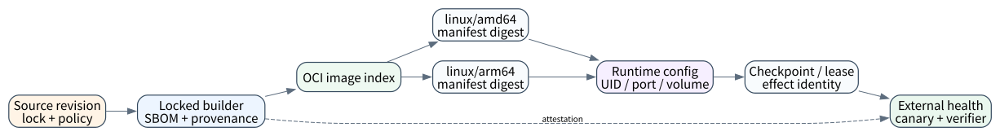
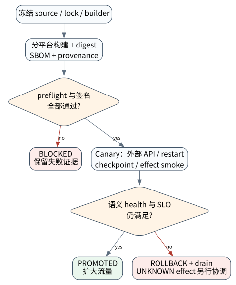

# 部署工程：Docker、本地开发与 CI 验证

> **本章核心判断**：Agent 部署的对象不是一段 Python，而是“源码—锁文件—构建器—OCI artifact—配置—身份—状态—健康语义—回滚”组成的可验证系统。镜像能 build、进程能启动、任务能完成是三个不同命题。

上一章把多租户 Agent API 做成真实 HTTP/SQLite 边界；本章进一步回答这套系统如何成为可追溯、可移植、可回滚的 release。下一章将讨论行为改变更大的另一类发布：post-training。



## 问题背景与学习目标

普通无状态 Web 服务已经需要 immutable artifact、健康探针、secret、扩缩容与回滚；Agent 还增加模型/provider、工具权限、workspace、checkpoint、approval、effect ledger 和长任务恢复。只把应用放进 Docker，会把开发机差异换成一个更难观察的镜像差异。

完成本章后，读者应能：

- 区分 tag、manifest digest、source revision、dependency lock 与 build provenance；
- 解释 amd64/arm64 image index 为什么不能由“本机能跑”推出；
- 分离 liveness、readiness、startup 与业务语义 health；
- 设计非 root、只读 rootfs、最小 capability、secret broker 和持久卷边界；
- 把 migration、checkpoint compatibility、drain、rollback 与外部 effect 恢复纳入 rollout；
- 运行真实仓库配置 preflight，并准确说明它尚未证明什么。

## 核心概念与系统直觉

> **Invariant**：只有 pinned image、端口、健康探针、非 root 身份、平台集合和 source identity 同时一致的 release 才能进入部署；运行期还须重新证明依赖可用和状态兼容。

**Artifact identity 不是 tag。** Tag 是可移动名称；digest 是 content address。source commit 也不等于 image digest，因为依赖解析、构建器、时间戳、基础镜像和网络输入都可能改变字节。

**Container 是封装，不是证明。** 它隔离文件系统/进程视图并携带 runtime config，却不能自动证明供应链、非 root、安全策略、secret 不泄露或 clean rebuild 相同。

**Health 是协议。** Liveness 回答“进程是否应重启”；readiness 回答“此刻能否接新任务”；startup 保护慢启动；业务 health 还应检查 checkpoint store、tool credentials、queue lease 与 verifier，而不是只返回 200。

**Rollout 是状态迁移。** 新旧版本可能同时处理长任务。必须定义哪些 run 留在旧版本、哪些 checkpoint 可迁移、旧 worker 何时停止 claim，以及 effect key 是否跨版本稳定。

**Multi-arch 是多个 artifact 的集合。** OCI image index 可指向不同平台 manifest。amd64 与 arm64 的 base layer/native wheel 可能不同；“同 tag”并不意味着“同 digest/行为”。应对每个平台保留 digest、SBOM、测试与 provenance。

## 原理与理论基础

将 release 表示为：

$$
R=(S,L,B,I,C,P,H,M,V)
$$

其中 $S$ 是 source revision，$L$ 是依赖锁，$B$ 是 builder/provenance，$I$ 是各平台 image digest，$C$ 是非秘密配置 schema/digest，$P$ 是 identity/policy，$H$ 是健康语义，$M$ 是 migration/checkpoint contract，$V$ 是验证证据。部署可接受条件不是某个单点：

$$
Eligible(R)=Pinned(I)\land Provenance(B,S,L,I)\land ConfigOK(C)\land LeastPrivilege(P)\land HealthOK(H)\land Compatible(M)\land Tests(V)
$$

可复现构建与 provenance 也不同。前者问“独立重建是否得到相同/等价 artifact”，后者问“artifact 声称由谁、用什么输入和过程构建”。[SLSA v1.2](https://slsa.dev/spec/v1.2/)把 build/source provenance 与 builder trust 分层；它不能替代应用测试，但能收紧 artifact 来源事实。[OCI image-spec](https://github.com/opencontainers/image-spec)定义 manifest、descriptor 与可包含多平台 manifests 的 image index。

Agent rollout 的额外困难是 effect 跨版本存在。若 v1 在远端提交、响应丢失，v2 接管时不能把 timeout 当失败重放。idempotency key、operation/args digest 和 reconciliation 必须跨 deployment 保持稳定。

## 关键机制与执行流程



1. **冻结输入**：记录 source revision、dirty state、lockfiles、base digest、builder digest 与 `SOURCE_DATE_EPOCH`；
2. **构建平台 artifact**：分别生成 amd64/arm64 manifests、SBOM、漏洞报告和 provenance，不用 tag 冒充平台证据；
3. **静态 preflight**：检查 `FROM@sha256`、端口闭合、非 root、healthcheck、secret/volume 与平台声明；
4. **签名与验证**：consumer 验证 digest、签名/attestation 和 policy，再允许部署；
5. **兼容性检查**：数据库 migration、checkpoint schema、protocol/version、effect key 和 rollback window；
6. **渐进 rollout**：先 shadow/canary，旧 worker drain，不让两个版本同时 claim 同一 lease；
7. **语义验证**：从外部 client 执行 API、tenant、approval、effect、restart 与 verifier smoke；
8. **提升或回滚**：promote 只切流量/active pointer；若 effect outcome UNKNOWN，先协调，不能把镜像回滚当业务补偿。

## 从原理到实现

本仓库的生产教学服务已使用 digest-pinned base、非 root UID 65532、`/healthz`、只读 rootfs、named volume、`cap_drop: ALL` 和 `no-new-privileges`。`DeploymentGate`读取真实文件，不接受手写摘要：

```python
root = Path(__file__).resolve().parents[2]
gate = DeploymentGate()
evidence = gate.inspect_repository(root)
decision = gate.verify(evidence)

assert evidence.exposed_port == 8010
assert evidence.command_port == 8010
assert evidence.compose_container_port == 8010
assert decision.release_allowed
```

端口 fault 不修改仓库，而是在内存中产生候选配置，模拟 PR/delivery stage：

```python
compose = compose_text.replace('"8010:8010"', '"8010:8000"')
evidence = gate.inspect(dockerfile_text, compose)
decision = gate.verify(evidence)

assert decision.checks["port_contract"] is False
assert decision.status == "BLOCKED"
```

解析器只承担课程 preflight，不是通用 Dockerfile/Compose parser；复杂构建应读取 BuildKit/registry 产生的结构化 metadata，而非继续扩展正则。更高证据还需实际 buildx、registry inspect、签名验证、容器启动与跨 host 运行记录。

## 主流系统实现对照与源码阅读入口

| 层 | 真实对象 | 应验证的证据 | 常见错误外推 |
|---|---|---|---|
| OCI registry | image index/manifest/descriptor | 每平台 digest、size、media type、signature | 同 tag 即同 artifact |
| BuildKit/buildx | builder、inputs、cache、outputs | build record、SBOM、provenance | build 成功即来源可信 |
| Compose/Kubernetes | port、volume、identity、probe、resources | rendered config、policy、runtime events | YAML 可解析即服务可用 |
| Agent runtime | queue、checkpoint、approval、effect | lease fencing、schema compatibility、recovery test | pod ready 即长任务正确 |
| CI/CD | workflow/action/runner/artifact | action SHA、权限、OIDC、attestation、promotion receipt | 绿色 job 即生产已验证 |

源码阅读顺序应从最终 artifact 反向追踪：registry descriptor → provenance subject digest → builder inputs → Dockerfile/lock → runtime spec → application health → rollout controller。不要只看 Dockerfile 的最后一行。

## 设计方案与方法对比

| 方案 | 优点 | 主要风险 | 合理使用 |
|---|---|---|---|
| 单机 virtualenv | 调试快、状态直观 | host 漂移、隔离弱 | 本地机制开发 |
| 单架构容器 | 封装完整、CI 简单 | 另一架构未证明 | 单一受控集群 |
| 多平台 image index | amd64/arm64 分发统一 | native 依赖/测试仍分平台 | 开源与异构主机 |
| VM/微虚拟机 | 隔离与内核边界更强 | 启动/成本/运维更高 | 不可信 coding/browser workload |
| serverless job | 弹性、短任务简洁 | 长任务、连接、checkpoint 约束 | 可重入无状态阶段 |
| Kubernetes/Operator | rollout、lease、资源与策略丰富 | 控制面复杂，不自动解决 effect UNKNOWN | 多租户长期运行 |

架构选择由 threat model、任务时长、数据位置与恢复目标决定。ARM 并非“次要兼容项”：若开源项目声明 arm64，必须实际产出/验证对应 manifest 或明确只提供源码兼容。

## 可复现实验

### Lab 36A — 真实部署文件 preflight

```bash
PYTHONPATH=src uv run python examples/chapters/ch36_deployment.py
```

实际输出核心字段：

```json
{"status":"STATIC_CONTRACT_READY","checks":{"base_digest_pinned":true,"port_contract":true,"semantic_healthcheck":true,"non_root":true,"multi_arch_declared":true,"image_lock_matches":true,"source_fingerprint_present":true},"ports":{"exposed":8010,"command":8010,"compose_container":8010},"evidence_level":"L1_MECHANISM"}
```

### Lab 36B — Compose 容器端口漂移

```bash
PYTHONPATH=src uv run python examples/chapters/ch36_deployment.py --fault
```

```json
{"status":"BLOCKED","checks":{"port_contract":false},"ports":{"exposed":8010,"command":8010,"compose_container":8000},"contained":true,"evidence_level":"L3_CONTAINED"}
```

**关键断点与验收。** 观察解析出的 base digest、四个端口、health path、UID、`IMAGE_LOCK.json` 中的平台声明与 source digest。A 要求七项全真；B 要求被测 gate 自己阻断下一发布阶段，而不是外部测试等服务失败。平台声明不是 registry image index 或异构主机执行证据。完整步骤见 [Lab 36A](../../../labs/core/lab-36A-deployment.md) 与 [Lab 36B](../../../labs/core/lab-36B-deployment-fault.md)。

## 工程场景与系统设计

一个实际发布单元至少包含 app image、migration job、worker image、policy/config、SBOM/provenance 和 rollback runbook。API 与 worker 可共享代码，但不应共享无限权限。worker identity 只拿任务所需 capability；migration 使用一次性身份；build job 无生产 secret；deploy job 不应能改源码。

长任务 rollout 要有版本 fencing：run 记录 `runtime_version` 与 checkpoint schema；旧 worker 停止领取新任务但完成或 checkpoint 已领取任务；新 worker 只接兼容状态。若强制迁移，必须在 staging 用真实 checkpoint corpus 演练 forward/rollback。

## 故障模型、失败模式与排错

- **mutable tag/base**：同名 artifact 漂移；从实际 pulled digest 向 provenance 追踪；
- **平台缺失**：amd64 成功而 arm64 无 manifest/native wheel；逐平台拉取并运行测试；
- **端口漂移**：EXPOSE、CMD、Service/Compose 不一致；比较 rendered config，不只看源 YAML；
- **假 readiness**：进程活着但 DB/queue/tool credential 不可用；分别检查依赖与降级策略；
- **root/宿主 socket**：Agent 能扩大到宿主控制权；删除 socket、capabilities 和不必要 mount；
- **secret 烘焙**：key 进入 layer/cache/log；轮换并重建历史，使用 runtime secret broker；
- **双 claim**：新旧 worker 同时拿同一任务；lease token/fencing/version 必须由 durable store 仲裁；
- **回滚错觉**：代码回滚但外部 effect 已发生；转入 reconciliation/compensation，而非重复执行。

排错顺序：requested digest → pulled digest/platform → effective identity/config → startup/readiness events → queue/checkpoint ownership → effect state → verifier。避免先重启掩盖第一现场。

## 性能、可靠性与工程化

应测 build/cache hit、image pull/startup、readiness、drain time、checkpoint migration、rollback RTO、任务恢复率与 cost/verified run。冷启动变快不能以漏迁移、弱探针或丢审计为代价。

容量规划同时覆盖 token/provider rate limit、浏览器/沙箱并发、数据库写锁、trace exporter backpressure 和 artifact storage。资源 limit 应让 overload 可见并触发 queue/backpressure，而不是 OOM 后让 in-flight effect 处于未知状态。

## 技术边界与设计取舍

本章 preflight 真实读取仓库配置，但不启动 Docker，也不证明 registry 中已有两个平台 manifest；`supported_platforms` 是发布契约，外部流水线仍须验证事实。base digest 固定也不代表镜像无漏洞；non-root 也不等于 sandbox 安全；health 200 也不证明所有工具正确。

跨 host “canonical bytes”并非所有项目的必要发布 gate：某些 PDF、native wheel 或工具链包含环境差异。应分别定义 source identity、semantic equivalence、reproducible subset 与不可复现字段，避免用不可能满足的全字节等价阻塞日常 CI。

## 前沿研究与演进方向

截至 2026-09-11，相关前沿不是“再发明容器”，而是把 agentic workload 的 artifact、身份和长任务状态纳入供应链与运行期共同证明：SLSA v1.2 强化 source/build provenance 分层；OCI image index 为多平台 artifact 提供标准描述；NIST Agent Standards Initiative 推动跨 Agent 身份、互操作与安全生态；机密计算、workload identity、短期凭据和 policy-as-code 正在减少静态 secret。

研究缺口包括：跨框架 checkpoint/effect migration；可验证 sandbox measurement；多平台上模型/runtime 的语义等价；在保护真实 tenant 数据时公开 rollout failure evidence；将 deployment attestation 与每个 Agent run 的 provenance 连接。

### 深度审计与研究证据链

本章证据分四级：静态 source preflight；干净容器 build/smoke；registry/attestation/multi-platform 验证；跨 host/cluster 的真实 restart、effect recovery 与负载结果。本书 Core Lab 只达到源码静态机制部分；`STATIC_CONTRACT_READY` 不是“生产已发布”。

## 本章总结与进阶实践

部署的本质是把 release identity 与运行语义闭合。容器只承载 artifact；可信发布还需要来源、平台、身份、健康、状态兼容、渐进 rollout、外部验证和可恢复 effect。

进阶问题（答案见[附录 M](../appendix-m-part7-solutions.html#ch36)）：

1. 为什么 digest-pinned base 仍不足以证明最终 image 可复现？
2. arm64 与 amd64 同 tag 时，哪些证据必须分平台保存？
3. liveness 与 readiness 混用为什么会制造重启风暴或错误放流？
4. 为什么代码 rollback 不能等价为业务 effect rollback？
5. 如何把本章 L1/L3 preflight 升级为可审计的真实发布证据？
