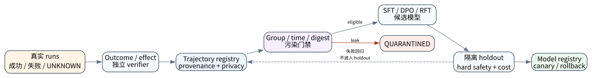
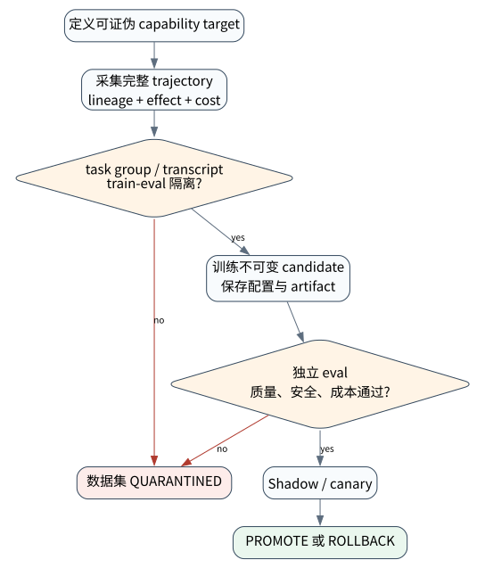

# Post-training 与 Agent 能力塑形

> **本章核心判断**：Post-training 不是“把成功轨迹喂给模型”，而是对数据生成、归因、奖励、优化、独立评测和发布进行因果控制。Agent 的 trajectory 同时含答案、工具、权限、成本和外部效果，任何一层污染都可能把错误策略放大。

上一章讨论软件 artifact 发布；本章讨论模型/策略 artifact 的改变。下一章进入实时多模态，展示训练后的策略仍必须受运行时事件与安全控制约束。



## 问题背景与学习目标

SFT 可以教格式和示范策略，preference optimization 可以改变相对偏好，reinforcement fine-tuning 可以利用可验证 reward；但 Agent 数据不是普通对话。轨迹可能包含测试泄漏、被工具结果污染的事实、未经授权却“成功”的 effect、judge 偏差、失败截断和策略自生成偏差。

本章完成后，读者应能：

- 区分 SFT、DPO/偏好优化、RFT/RL 与 runtime learning 的目标和证据；
- 把 trajectory 建模为版本化、可追溯、多维标签的数据记录；
- 按 task family/entity/time 切分，识别 exact 与 semantic contamination；
- 解释 reward hacking、off-policy shift、selection bias 和 judge-policy 共错；
- 为小型开源模型或 OpenAI fine-tuning 设计不泄密的真实流水线；
- 在没有真实训练 artifact 时，拒绝发布虚构 loss、reward 或能力提升。

## 核心概念与系统直觉

> **Invariant**：训练或评测使用的每条轨迹必须有 provenance；train/eval 在任务族与内容层隔离；模型变更只有在独立 hard gates 和版本化回归通过后才可发布。

**Trajectory 不是天然监督。** 工具返回可能错误，Agent 最终声称成功也可能虚假。监督数据应来自 verifier 过的 outcome/effect，而不是仅取“看起来好”的回答。

**Reward 是测量模型，不是真实目标。** 把 helpfulness、安全、effect、成本压成单标量会制造抵消；高风险违规通常必须作为 hard constraint。Reward 版本和 grader 也必须随数据留存。

**切分单位应匹配因果依赖。** 同一 repo、模板、用户、事故或派生 transcript 分到 train/eval，会让评测测记忆而非泛化。按行随机切分只在记录独立时合理。

**Policy lineage 决定数据分布。** 由当前策略采集的数据偏向其可到达状态；只训练成功轨迹会丢失 recovery 边界。应保存失败、拒绝、UNKNOWN 与人工 override。

**模型只是系统的一层。** Post-training 不能替代 capability、sandbox、approval、effect ledger 或 verifier。模型更聪明后，确定性边界仍成立。

## 原理与理论基础

SFT 对 demonstration token 最大化条件似然：

$$
\mathcal L_{SFT}(\theta)=-\sum_{(x,y)\in D}\log\pi_\theta(y\mid x)
$$

它能学习轨迹形式，但若 $y$ 含越权或错误 tool action，也会忠实复制。偏好数据由 $(x,y_w,y_l)$ 构成；[DPO](https://arxiv.org/abs/2305.18290)用 policy/reference 的 log-ratio 构造分类式目标，减少显式 reward model + RL 的复杂度，但不消除偏好数据偏差、分布外行为或 reward misspecification。

Agent RFT 可把程序 verifier 产生的 reward 用于采样/优化。真正的目标常是约束优化：

$$
\max_\pi\;\mathbb E[Outcome-\lambda_c Cost]
\quad\text{s.t.}\quad P(UnsafeEffect)\le\epsilon,\;CapabilityViolation=0
$$

安全约束不能靠平均 reward 抵消。评测还应固定 task/environment/verifier manifest，并报告统计不确定性、failure taxonomy 和各风险 slice。

污染检测至少分 exact digest、归一化文本、task/entity group、时间窗口和语义近重复。没有任何单一方法能证明“模型从未见过等价内容”，因此结论要写成所使用 detector 下的可审计边界。

## 关键机制与执行流程



1. **定义 capability target**：明确要改善的是选择、参数、恢复、停止还是解释，不以“更智能”替代可测目标；
2. **采集完整轨迹**：记录 task/environment/policy/tool/verifier/usage/effect digests，成功与失败均保留；
3. **清洗与隐私处理**：去 secret/PII、标注许可与 retention，保留可验证 lineage；
4. **按因果组切分**：先按 repo/user/template/incident/time 分组，再分 train/dev/eval；
5. **生成监督/偏好/reward**：程序 verifier 优先，人工与 LLM judge 需校准并记录来源；
6. **训练候选**：固定 base model、code、hyperparameters、seed、hardware 与数据 manifest；
7. **独立评测**：candidate 无权改 grader/holdout，比较 outcome/effect/safety/cost 各维度；
8. **渐进发布**：shadow/canary，出现高风险回归立即回滚，并将 incident 进入独立 regression。

## 从原理到实现

`TrajectorySample`把 transcript 与标签和**声明的** lineage 一起建模，digest 是证据索引，不替代原始 artifact 的受控存储或来源签名；本地 Lab 并未持久化数据集：

```python
sample = TrajectorySample(
    sample_id="train-017",
    task_family="invoice-train",
    split="train",
    transcript="read invoice -> calculator -> answer",
    source_run="run-8f2",
    policy_id="policy-v1",
    outcome_score=1.0,
    safety_violations=0,
    cost_units=3.0,
)
print(sample.transcript_digest, sample.record_digest)
```

门禁同时检查任务族字符串和 transcript 的 exact digest，不让“原文复制后只改 sample id”绕过：

```python
audit = PostTrainingDatasetGate().audit(samples)
if not audit.promotion_allowed:
    raise RuntimeError({
        "status": audit.status,
        "families": audit.leaked_task_families,
        "transcripts": audit.duplicate_transcripts,
    })
```

这只是静态 preflight：`source_run`/`policy_id` 是未向权威 ledger 核验的字符串，攻击者重命名 `task_family`、改写近重复 transcript 或伪造来源仍可能绕过。真实训练前必须用不可变 run manifest、内容签名/哈希、语义近重复与实体/时间分组做独立核对。实验刻意不训练模型，因为四条 fixture 无法支持能力结论。真实流水线可把通过审计的 JSONL 交给小型开源模型工具链或 [OpenAI supervised fine-tuning](https://developers.openai.com/api/docs/guides/supervised-fine-tuning) / [DPO](https://developers.openai.com/api/docs/guides/direct-preference-optimization)。凭据使用 `OPENAI_API_KEY` 等环境注入；数据中不得包含 key，训练 job/model snapshot/usage/eval artifact 必须真实保存。

## 主流系统实现对照与源码阅读入口

| 方法 | 主要信号 | 适合改善 | 不能自动解决 |
|---|---|---|---|
| SFT | demonstration token | 格式、工具 schema、基础策略 | 错误示范、分布外恢复 |
| Preference/DPO | pairwise preference | 风格、选择、相对质量 | 偏好 misspecification、安全硬约束 |
| RFT/RL | environment/verifier reward | 可验证推理、长期策略 | reward hacking、环境真实性 |
| Distillation | teacher outputs/trajectory | 压缩能力、成本 | teacher 错误与数据许可 |
| Runtime memory/skill | 外部可编辑 artifact | 快速更新、可回滚 | base policy 的根本能力限制 |

源码阅读应沿 dataset schema → formatter → loss/reward → sampler → checkpoint → evaluator → model registry。只看训练 API 调用会漏掉真正决定可信度的数据与发布控制面。

## 设计方案与方法对比

| 决策 | 方案 A | 方案 B | 核心取舍 |
|---|---|---|---|
| 数据来源 | 人工/真实 run | 合成/self-play | 真实性与覆盖/规模 |
| 标签 | 程序 verifier | human/LLM judge | 硬事实与开放质量 |
| 切分 | 随机行 | group/time/entity | 样本量与泄漏风险 |
| 训练 | 本地小模型 | 托管 provider | 控制/隐私与能力/运维 |
| 更新层 | prompt/skill | weights | 可解释回滚与深层行为改变 |
| 发布 | 全量切换 | shadow/canary | 速度与回归控制 |

小模型适合结构化路由、工具选择或领域窄任务；开放长任务可使用更强远程模型。但 provider 选择不改变 manifest、eval 和安全 gate。若无法在本地复现 weights，也至少要锁定 provider model snapshot/name、输入、usage、request id 和实际输出。

## 可复现实验

### Lab 37A — 数据谱系与隔离切分

```bash
PYTHONPATH=src uv run python examples/chapters/ch37_post_training.py
```

```json
{"status":"DATASET_ELIGIBLE","train_records":2,"eval_records":2,"leaked_task_families":[],"duplicate_transcripts":[],"promotion_allowed":true,"evidence_level":"L1_MECHANISM"}
```

### Lab 37B — 复制轨迹污染

```bash
PYTHONPATH=src uv run python examples/chapters/ch37_post_training.py --fault
```

```json
{"status":"QUARANTINED","leaked_task_families":["billing-train"],"promotion_allowed":false,"contained":true,"evidence_level":"L3_CONTAINED"}
```

**关键断点与验收。** 检查 task-family 与 transcript digest 两个交集、lineage 完整性和 quarantine 状态。A 六项 checks 全真；B 必须由系统自己阻断数据集。完整步骤见 [Lab 37A](../../../labs/core/lab-37A-post-training.md) 与 [Lab 37B](../../../labs/core/lab-37B-post-training-fault.md)。

## 工程场景与系统设计

以发票 Agent 为例：真实 run 先由独立 verifier 标记金额、引用、effect 和权限；数据平台去标识并按 vendor/template/time 分组；SFT 学结构，preference 数据比较解释质量，RFT 只使用可验证 outcome。付款/删除越权永远是 hard negative/hard gate，不因回答更流畅得到正 reward。

数据 contract 应包含许可、tenant、retention、PII class、生成 policy、工具与环境版本、verifier、labeler、transformation lineage。模型 registry 保存 base/candidate digest、训练 manifest、代码/配置、评测和审批。训练集不可被在线服务随意查询，holdout 更应隔离。

## 故障模型、失败模式与排错

- **train/eval 泄漏**：同任务或近重复跨 split；从 entity/group/time 与 digest 两侧审计；
- **success selection bias**：只保留成功轨迹；比较原始 run ledger 与数据 manifest；
- **自评标签**：模型 claim 直接当 reward；回到环境/verifier observation；
- **judge 共错**：policy 与 judge 同源；使用程序/human anchor、异构 judge 与盲评；
- **reward hacking**：分数提高而 effect 越权；拆 hard constraints 和 failure taxonomy；
- **off-policy shift**：新策略进入旧数据未覆盖状态；canary/online eval 并保留 baseline；
- **灾难性遗忘**：窄域改善损害通用能力；多域回归和保留集；
- **隐私/许可污染**：敏感轨迹进入 weights；数据删除仅删文件不足，需治理模型生命周期。

## 性能、可靠性与工程化

训练指标包括 token/step throughput、GPU memory、loss/reward；发布指标必须是 verified success、unsafe effect、cost/verified success、latency、refusal 和各 slice 差异。训练 loss 下降不是业务成功。

可靠流水线要求 dataset/model/eval manifests、不可变 artifacts、失败 checkpoint、预算上限和 preemption 恢复。大规模采样应保存所有 attempts 的分母；不能只挑最好 seed 或成功 trajectory 发布。

## 技术边界与设计取舍

Core Lab 只证明数据 gate，不证明训练能提升任何模型。Exact digest 检不出释义改写，task-family 依赖正确建模，provenance 字段也可能被伪造；高证据需要访问控制、签名/append-only lineage 和独立重算。

远程模型方便获得能力，但可能有版本、区域、配额和数据治理变化；本地小模型便于锁权重、离线和成本控制，但硬件/量化/kernel 仍影响行为。教材不发布未实际运行的 provider 分数，也不把某次模型输出写成算法普遍结论。

## 前沿研究与演进方向

截至 2026-09-11，post-training 正从单轮偏好扩展到可验证环境 reward、过程监督、agentic trajectory、工具使用和长期信用分配。DPO 简化了偏好优化形式，却没有取消数据/评测问题；官方平台同时提供 SFT、DPO、RFT 等不同优化路径，更说明应先选择信号和 verifier，而不是先选择 API。

开放问题包括：如何对长轨迹做可信 credit assignment；如何检测语义污染与 benchmark memorization；如何防止 optimizer 攻击 grader；如何在隐私约束下共享失败轨迹；如何区分 model weights、scaffold 与 tool/environment 的贡献；如何让在线 incident 安全进入学习闭环而不污染 holdout。

### 深度审计与研究证据链

本章严格分开三种 claim：数据 gate 的本地执行证据；真实训练 artifact 与 loss/usage；独立 benchmark/canary 的行为证据。只有第二、三层真实存在时，才可写“模型经过训练并提升”。本发布没有执行训练，因此只报告第一层。

## 本章总结与进阶实践

Post-training 的本质是受治理的策略变更。高质量 trajectory、可追溯标签、隔离切分、独立 verifier 与可回滚发布比某个优化算法名称更基础。

进阶问题（答案见[附录 M](../appendix-m-part7-solutions.html#ch37)）：

1. 为什么 verified success trajectory 仍不能直接作为全部训练数据？
2. DPO 简化了什么，又没有解决什么？
3. 为什么按行随机切分特别容易高估 Agent 泛化？
4. 如何把安全约束从 reward average 中分离出来？
5. 怎样设计一次不泄露 API key、且结果可审计的真实模型训练实验？
