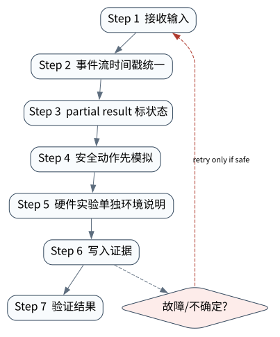

# 多模态、语音、机器人与实时 Agent

> **本章核心判断**：多模态 Agent 的核心是时序 observation、动作延迟、安全边界和环境反馈；实时性让取消、打断和 partial state 更重要。

上一章：Post-training 与 Agent 能力塑形。本章把前一章已经建立的能力进一步推进到 `Observation stream`；下一章将进入：Self-Improving Agent：优化、验证与回滚。


## 问题背景与学习目标

多模态 Agent 的核心是时序 observation、动作延迟、安全边界和环境反馈；实时性让取消、打断和 partial state 更重要。

在本章的 `Observation stream` 场景中，真实 Agent 系统与普通“问答程序”的差异，在于一次任务会跨越模型、工具、状态、外部环境和人工治理边界。本章所有原理、代码与实验都围绕这些可验证问题展开。


**本章完成标准：**

- **机制理解**：能够解释“多模态 Agent 的核心是时序 observation、动作延迟、安全边界和环境反馈；实时性让取消、打断和 partial state 更重要。”，并指出它对应的确定性软件边界；
- **正确性判断**：能够针对 `realtime agents must propagate cancellation across modality and action boundaries` 构造一个反例，说明证据不足时系统为什么不能继续乐观执行；
- **实验与迁移**：运行 `Lab 38A` / `Lab 38B`，分别说明 normal/fault 的 evidence level，并把同一机制映射到至少一个上游实现或协议。

## 核心概念与系统直觉

本节不把概念当作术语清单，而是回答三个工程问题：它**是什么**、在系统里**负责什么**、以及它失效时**会留下什么可观测证据**。

### Observation stream

**定义。** 按时间到达的文本、图像、音频、传感器或环境状态序列，是实时 Agent 的输入事实流。

**系统责任。** Runtime 需要时间戳、source id、sampling 与 buffer policy，把不同模态对齐到可决策的当前状态。

**失败边界。** 延迟/乱序 observation 会让 Agent 对旧世界做动作；把缺失传感器数据当成“没有事件”也会产生危险判断。

### Voice turn

**定义。** 用户语音输入、ASR、模型响应、TTS 与打断共同构成的实时交互单元，而非普通文本 message 的包装。

**系统责任。** Voice runtime 需要 endpointing、barge‑in、partial transcript、latency budget 和安全确认策略。

**失败边界。** 等待完整长回复会破坏自然交互；错误 ASR 对高风险动作若不回读确认，会把听错直接变成 effect。

### Vision grounding

**定义。** 把视觉描述绑定到图像区域、对象或空间关系，使后续动作有明确目标。

**系统责任。** Grounding 应结合像素、检测/分割、DOM/scene graph 与时间一致性，并输出可校验 target。

**失败边界。** 语言模型说“左侧红按钮”不等于可靠坐标； 摄像头移动、 遮挡或镜像会让旧 grounding 失效。

### Action latency

**定义。** 从关键 observation 到动作实际生效的总延迟，是实时/机器人 Agent 的安全与可用性约束。

**系统责任。** 应拆分感知、模型、网络、policy、controller，并让硬实时闭环留在 deterministic controller 中。

**失败边界。** 语言模型延迟和长尾不可作为毫秒级安全控制保证；过期动作即使语义正确也可能物理上危险。

## 原理与理论基础

### 系统不变量

> **Invariant**：realtime agents must propagate cancellation across modality and action boundaries

不变量与普通“最佳实践”不同：最佳实践可以因为场景变化而替换，不变量一旦被破坏，系统就失去本章希望保证的正确性。例如 `语音打断后工具仍执行` 并不是一个 UI 问题，而是说明某个状态已经无法从证据中唯一判断。


### 故障模型

本章优先把 “语音打断后工具仍执行”、“视觉识别无校验”、“机器人动作没有 emergency stop” 作为可证伪故障，而不是泛化地枚举所有异常。对涉及外部 effect 的失败，判定顺序固定为“最后 durable state → effect 是否可能发生 → 现有 observation 是否足够决定下一步”；证据不足时停在 UNKNOWN/显式失败。

### Why / What if / Trade-off

本章真正的设计取舍不是“使用更强模型还是写更多规则”，而是确定 **Observation stream** 与 **Voice turn** 分别应该由概率性决策还是确定性软件拥有。模型可以帮助识别候选路径，但它不会自动消除“语音打断后工具仍执行”这类系统失败；该失败必须由 runtime 的 schema、状态机、权限或 verifier 显式约束。

如果把 Observation stream 完全交给模型，系统会把不可验证的语言判断混入执行事实；如果把 Voice turn 全部硬编码为固定 workflow，又会失去开放任务所需的适应性。更稳健的边界是：让模型负责提出候选决策，让软件负责 `事件流时间戳统一`、`硬件实验单独环境说明` 以及对不变量 **realtime agents must propagate cancellation across modality and action boundaries** 的检查。

**What if。** 一旦“视觉识别无校验”发生，系统首先需要判断现有证据是否足够决定下一状态；证据不足时应停在显式失败或待协调状态，而不是让模型用自然语言补全事实。这个边界决定了本章方案是否具有可恢复性，而不只是演示效果。


### 形式化模型与可证伪假设

$$
Action_t=\pi(O^{text}_{\le t},O^{vision}_{\le t},O^{audio}_{\le t},State_t),\qquad L_{action}<Deadline
$$

多模态与物理 Agent 将语言决策接入实时环境；高层规划和低层控制必须分离，并由独立 safety controller 约束。

**可证伪假设。** 把安全/实时控制留给确定性 controller，可降低模型延迟或误判造成的危险动作。

**建议测量。** deadline miss、safety intervention、grounding accuracy、physical task success。

## 关键机制与执行流程



**Step 1 — 事件流时间戳统一。** `事件流时间戳统一` 是“多模态、语音、机器人与实时 Agent”的一次显式状态转移。输入和输出都必须可序列化并关联 `run_id/step_id`；一旦该步骤失败，后继步骤只能依据已记录状态继续。关键观察点是 `Observation stream` 是否仍满足 **realtime agents must propagate cancellation across modality and action boundaries**。

**Step 2 — partial result 标状态。** `partial result 标状态` 是“多模态、语音、机器人与实时 Agent”的一次显式状态转移。输入和输出都必须可序列化并关联 `run_id/step_id`；一旦该步骤失败，后继步骤只能依据已记录状态继续。关键观察点是 `Voice turn` 是否仍满足 **realtime agents must propagate cancellation across modality and action boundaries**。

**Step 3 — 安全动作先模拟。** 这一阶段可能改变系统或外部环境，因此 `安全动作先模拟` 不能只存在于模型文本中。runtime 在执行前绑定 `run_id/step_id` 与参数摘要，执行后记录结果或外部 observation；如果调用可能重复，必须同时定义幂等键或 reconciliation 依据。这里检查的核心是 **realtime agents must propagate cancellation across modality and action boundaries**。

**Step 4 — 硬件实验单独环境说明。** `硬件实验单独环境说明` 是“多模态、语音、机器人与实时 Agent”的一次显式状态转移。输入和输出都必须可序列化并关联 `run_id/step_id`；一旦该步骤失败，后继步骤只能依据已记录状态继续。关键观察点是 `Action latency` 是否仍满足 **realtime agents must propagate cancellation across modality and action boundaries**。

在本章的 `Observation stream` 场景中，**最后一步 — 验证。** verifier 针对 `Action latency` 检查本章不变量 **realtime agents must propagate cancellation across modality and action boundaries**。如果“语音打断后工具仍执行”使现有 artifact/外部状态不足以证明成功，结果必须停在显式失败或 UNKNOWN；只有 observation 能闭合状态转移时，流程才允许进入 FINISHED。

### 数据流与控制流

本章的数据/控制链按 **事件流时间戳统一 → partial result 标状态 → 安全动作先模拟 → 硬件实验单独环境说明** 推进。调试时不要只看最终 answer，应确认每一阶段的输入来源、状态版本和 observation；对“语音打断后工具仍执行”尤其要检查动作前后的证据是否足以闭合不变量 **realtime agents must propagate cancellation across modality and action boundaries**。


### 持久化点与崩溃窗口

本章需要持久化的内容取决于动作可逆性。与 `Observation stream` 有关的纯计算状态通常可以重算；一旦 `partial result 标状态` 可能产生昂贵、外部或不可逆效果，就必须在动作前后建立可区分的证据边界。对于本章不变量 **realtime agents must propagate cancellation across modality and action boundaries**，恢复时最重要的问题是：最后一个已知状态是什么、动作是否可能已经发生、现有 observation 能否唯一决定 retry/continue/compensate。


## 从原理到实现


### 完整实验入口

```python
from __future__ import annotations
import argparse
from agentlab.course_scenarios import run_scenario

def main() -> int:
 p=argparse.ArgumentParser(description='多模态、语音、机器人与实时 Agent')
 p.add_argument("--fault", action="store_true", help="inject the chapter-specific failure path")
 args=p.parse_args()
 result=run_scenario('multimodal', fault=args.fault)
 print(result.as_json())
 return 0 if result.passed else 2

if __name__ == "__main__":
 raise SystemExit(main())
```

### 核心机制实现

```python
def multimodal(fault=False):
 events=[(1.0,'audio.partial'),(1.1,'vision.frame'),(1.2,'user.interrupt'),(1.3,'tool.cancelled' if not fault else 'tool.completed')]
 ordered=events==sorted(events); safe=events[-1][1]=='tool.cancelled'
 return _ok('multimodal',fault,{'events':events,'ordered':ordered,'safe_after_interrupt':safe},'realtime agents must propagate cancellation across modality and action boundaries',ordered and (safe if not fault else not safe))
```


### 简化假设与不能省略的机制


## 主流系统实现对照与源码阅读入口

| 项目 | 本书锁定版本/状态 | 应阅读的机制 | 已核验源码/文档入口 | 官方来源 |
|---|---|---|---|---|
| Google Agent Development Kit | `v2.1.0 @ 6d15e19` | 比较 LlmAgent 与 Sequential/Parallel/Loop/graph workflow，把 session、sandbox、telemetry/evaluation 放在同一 runtime 视角下。 | 以官方 docs/release/source tree 为准 | [官方来源](https://github.com/google/adk-python) |
| OSWorld | `benchmark source observed 2026-09-09` | 真实计算机环境的 observation/action/evaluator。 | 以官方 docs/release/source tree 为准 | [官方来源](https://github.com/xlang-ai/OSWorld) |
| Anthropic: Building Effective Agents | `official engineering article` | 从简单、可组合的 workflow/agent 模式开始。 | 以官方 docs/release/source tree 为准 | [官方来源](https://www.anthropic.com/engineering/building-effective-agents) |

### 源码阅读方法

源码阅读以 **Google Agent Development Kit** 为第一参照，并只追与“多模态、语音、机器人与实时 Agent”直接相关的公开执行链：入口 → durable/session state → 权限或协议边界 → verifier/trace。若上游没有公开某个服务端组件，本章不根据客户端现象反推其内部 scheduler、queue 或 policy engine。


### 工业实现为什么更复杂


对本章最值得关注的工程增量是：如何避免“语音打断后工具仍执行”、如何在“视觉识别无校验”后恢复，以及如何让 `硬件实验单独环境说明` 的结果能够进入 tracing/evaluation。只有这些机制都能落到公开类型、函数或协议消息上，才算真正完成源码对照。

## 设计方案与方法对比

| 方案 | 核心优势 | 主要局限 | 更适合的约束 |
|---|---|---|---|
| 最小自研 AgentLab | 机制透明、可断点、无网络即可故障注入 | 生态/模型能力有限 | 教学、研究原型、回归基线 |
| Google Agent Development Kit | 状态/工作流抽象成熟，适合长任务与治理 | 框架状态不能自动解决外部副作用不确定性 | 企业 workflow、HITL、durable orchestration |
| OSWorld | 官方/主流实现提供成熟抽象与生态 | 抽象会隐藏部分底层机制，需要源码/trace 反推 | 生产集成与方案对照 |
| Anthropic: Building Effective Agents | 官方/主流实现提供成熟抽象与生态 | 抽象会隐藏部分底层机制，需要源码/trace 反推 | 生产集成与方案对照 |


## 可复现实验

本章两个 Core Lab 都直接执行仓库内的确定性代码；它们证明的是“多模态、语音、机器人与实时 Agent”对应的本地机制与 fault oracle，而不是外部 provider 或真实云环境。第三方实现只在 `labs/upstream/` 按独立 L5 互操作证据记录，未实际执行时必须保持 `EXTERNAL_NOT_RUN_IN_THIS_RELEASE`。

### 实验环境

统一 Python/OS/离线复现约束、安装步骤与工具链版本集中维护在[附录 A](../appendix-a-environment.md)。本章只增加与“多模态、语音、机器人与实时 Agent”直接相关的 normal/fault 双轨验证；若需要真实云、浏览器、GPU 或第三方 provider，则在对应 upstream lab 中单独标记 `NOT_RUN_EXTERNAL`，不把未运行结果计入核心实验。

### Lab 38A — 正常路径

```bash
PYTHONPATH=src python examples/chapters/ch38_multimodal.py
```

**关键断点：**
- `src/agentlab/course_scenarios.py::multimodal`
- `examples/chapters/ch38_multimodal.py::main`

**本发布包实际输出：**

```json
{"contained": false, "evidence_level": "L1_MECHANISM", "evidence_meaning": "normal_path_assertion_satisfied", "fault": false, "fault_injected": false, "invariant": "realtime agents must propagate cancellation across modality and action boundaries", "invariant_holds": true, "observation": {"events": [[1.0, "audio.partial"], [1.1, "vision.frame"], [1.2, "user.interrupt"], [1.3, "tool.cancelled"]], "ordered": true, "safe_after_interrupt": true}, "oracle_detected": false, "passed": true, "recovered": false, "scenario": "multimodal", "system_detected": false}
```

PASS：退出码 0，`passed=true`、`fault=false`、`invariant_holds=true`；这只证明确定性 fixture 的正常机制断言。完整手册：[Lab 38A](../../../labs/core/lab-38A-multimodal.md)。

### Lab 38B — 故障注入

```bash
PYTHONPATH=src python examples/chapters/ch38_multimodal.py --fault
```

**本发布包实际输出：**

```json
{"contained": false, "evidence_level": "L2_ORACLE_ONLY", "evidence_meaning": "external_oracle_observed_bad_outcome_only", "fault": true, "fault_injected": true, "invariant": "realtime agents must propagate cancellation across modality and action boundaries", "invariant_holds": false, "observation": {"events": [[1.0, "audio.partial"], [1.1, "vision.frame"], [1.2, "user.interrupt"], [1.3, "tool.completed"]], "ordered": true, "safe_after_interrupt": false}, "oracle_detected": true, "passed": true, "recovered": false, "scenario": "multimodal", "system_detected": false}
```

PASS：退出码 0，`passed=true`、`fault=true`、`oracle_detected=true`。本章故障实验为 **L2_ORACLE_ONLY**：独立 oracle 观察到故障，但被测系统没有证明检测/约束/恢复。 `passed=true` 本身只表示实验 oracle 得到预期观察。完整手册：[Lab 38B](../../../labs/core/lab-38B-multimodal-fault.md)。

### 观察与证据


## 工程场景与系统设计

本章沿用第 35 章多租户 API 场景，重点把多模态实时路径与长任务完成时间分开，并要求现实世界动作具有额外安全边界。


### 上线前必须补齐

- 围绕 **多模态与实时 Agent** 建立可审计状态字段与最小权限；
- 为本章相关动作记录 run_id、step_id、输入摘要与 observation；
- 对 `多模态 Agent 需要同步 observation、action timing、environment state 和 safety boundary。` 这一边界建立自动化验收；
- 为本章主要故障窗口配置 trace、日志和恢复 runbook；
- 上线前把教学 fixture 替换为真实 provider/tool/workspace，并重新执行 normal/fault 两条路径。

## 故障模型、失败模式与排错

本章至少主动测试以下失败：

- **语音打断后工具仍执行**：先确认最后 durable state，再检查是否已经产生外部效果；不要先重试。
- **视觉识别无校验**：先确认最后 durable state，再检查是否已经产生外部效果；不要先重试。
- **机器人动作没有 emergency stop**：先确认最后 durable state，再检查是否已经产生外部效果；不要先重试。


## 性能、可靠性与工程化

### 应采集指标

- `API p95/p99`
- `tenant isolation violations`
- `queue depth`
- `RPO/RTO rehearsal`
- `deployment rollback time`
- `cost per tenant/run`


### 优化顺序


任何优化都必须重新运行 Lab A/B。尤其当优化改变 `Voice turn` 的生命周期时，要重新验证 **realtime agents must propagate cancellation across modality and action boundaries**；否则平均延迟下降可能以更大的 stale state、重复副作用或取消失效为代价。

### 可靠性工程

本章可靠性 gate 直接针对 “语音打断后工具仍执行”、“视觉识别无校验”、“机器人动作没有 emergency stop”：只有正常路径与对应 fault path 都保持 **realtime agents must propagate cancellation across modality and action boundaries**，优化或功能扩展才可接受。是否达到 detection、containment 或 recovery 以实验的 `evidence_level` 字段为准。


## 技术边界与设计取舍
本章方案有明确边界：

- 教学服务不等于生产认证系统，HA、secret broker、审计保留等需额外实现
- 多租户必须在存储/缓存/日志/队列每层强制 tenant boundary
- 部署成功不代表恢复成功，需定期做故障演练
- post-training 会改变行为分布，必须用独立 eval gate 防回归

选择方案时要回到本章边界：如果业务不能接受“语音打断后工具仍执行”，就必须为 `Observation stream` 增加更强的确定性约束；如果主要任务是开放式探索，则可以把更多 `Voice turn` 决策交给模型，但要用 `硬件实验单独环境说明` 保持结果可验证。**Google Agent Development Kit** 与 **OSWorld** 的差异也应放在这些约束下理解，而不是抽象成通用框架排名。

多模态与机器人把模型输出更直接地连接到物理环境，观测误差和动作不可逆性也更高。涉及现实世界执行时，需要安全约束、速率/空间边界、急停与独立传感器验证，不能把视觉置信度当作控制保证。

## 前沿研究与演进方向

当前研究和工业演进已经从“模型能否调用工具”推进到“怎样让长期、状态化、具有副作用的 Agent 可评估、可恢复、可治理”。与本章直接相关的资料：

- **[Voyager: An Open-Ended Embodied Agent with Large Language Models](https://arxiv.org/abs/2305.16291)**：自动课程、技能库和迭代 prompting 的 embodied agent。
- **[Google Agent Development Kit](https://github.com/google/adk-python)**（v2.1.0 @ 6d15e19）：Agent、workflow、sandbox、telemetry、evaluation/deployment 参考实现。
- **[OSWorld](https://github.com/xlang-ai/OSWorld)**（benchmark source observed 2026-09-09）：真实计算机环境的 observation/action/evaluator。


### 截至 2026-09-11 的研究更新

本节只记录会改变本章系统结论的研究或官方规范更新；实验仍使用仓库锁定版本，避免把“最新观察版本”与“可复现实验版本”混为一谈。
- NVIDIA: Open‑source agent tools and skills for Physical AI（2026‑05‑31）：robotics, autonomous vehicles, vision AI, industrial digital twins and agent skills。
- NVIDIA Halos for Robotics（2026‑06‑22）：physical AI safety architecture and production robotics。
- Skild S1 via NVIDIA Physical AI（2026‑09‑10）：robot foundation models, in‑context long‑horizon task learning from video。

**本章吸收的变化。** 多模态/Physical Agent 要解决跨模态时间对齐与 real‑time deadline。高层语言规划可慢，低层安全控制必须保持确定性。这些研究/规范的价值不在于替换本章原理，而在于把上述假设放进更真实、更长时或更高风险的环境中检验。

### Research Gap

围绕 `Observation stream`，当前缺口不是“再增加一个 Agent API”，而是怎样把 **realtime agents must propagate cancellation across modality and action boundaries** 从局部实现经验升级为跨模型、跨 runtime 可验证的系统属性。现有工业实现已经能够提供 tool loop、session、graph、plugin 或 workspace 等抽象，但在“语音打断后工具仍执行”和“视觉识别无校验”同时出现时，证据格式、恢复语义和评测方法仍缺少统一答案。

本章的研究更新不追求论文数量，而关注一个问题：现有工作是否真正推进了 **多模态与实时 Agent** 的可验证性。Voyager、OSWorld、robot/VLA 研究提醒：embodied 任务的成功依赖环境反馈和可执行动作，不只是更强视觉模型。 因此，本章会把论文结论放回不变量、失败窗口和实验断言中，而不是把研究当作参考文献列表。

### Open Problems

1. 如何把 `Observation stream` 的正确性拆成可组合的局部不变量，并在不同 Agent runtime 中复用 verifier？
2. 当“语音打断后工具仍执行”与“视觉识别无校验”同时发生时，**Google Agent Development Kit** 与 **OSWorld** 的公开抽象分别能保存哪些证据，哪些状态仍需要外部 reconciliation？
3. 如果模型能力显著提高，围绕 `Voice turn` 的哪些 harness 机制仍属于系统必要条件，哪些只是当前模型能力下的临时补丁？
4. 如何构造一个既保护真实业务数据、又能复现“机器人动作没有 emergency stop”的公开 benchmark，使研究结果可以被第三方验证？


### 深度审计与研究证据链：多模态与实时 Agent

本章重新审计后的核心结论是：**多模态 Agent 需要同步 observation、action timing、environment state 和 safety boundary。** 这句话只有在代码、实验、开源源码和研究证据四个层面同时成立时才有教学价值。仅靠定义或 API 示例无法证明它，因为 Agent Systems 的风险通常发生在模型决策与外部环境之间的缝隙里。

**与本章最相关的近期/基础研究与官方资料：**

- **[PaperBench](https://openai.com/index/paperbench/)**：把论文复现拆成细粒度可评分任务，强调 rubric/grader。
- **[AgentDojo](https://arxiv.org/abs/2406.13352)**：用不可信工具返回内容测试 prompt injection 攻防。
- **[Agent Security Bench](https://arxiv.org/abs/2410.02644)**：覆盖多工具、多场景、多攻击/防御的 Agent 安全评测。

这些资料与本章的关系不是“引用背书”，而是帮助读者识别设计边界。LeRobot/OSWorld/browser agents/Realtime API 公开边界可对照。 读者阅读源码时应主动寻找四个对象：输入如何进入系统、状态在哪里持久化、动作由谁执行、失败后谁负责恢复。

**实验语义边界。** 本章实验验证多模态与实时 Agent 的观测、评测、安全或生产控制面不变量；证据等级定义与解释规则统一见附录 A，且 `passed=true` 不得跨级推导 containment/recovery。


## 本章总结与进阶实践

### 核心结论

1. 本章不变量是：**realtime agents must propagate cancellation across modality and action boundaries**；
2. `Observation stream` 必须是可观察软件边界，而不是 prompt 约定；
3. `事件流时间戳统一` 与 `硬件实验单独环境说明` 之间必须有状态和证据连接；
4. 模型提出动作不等于系统已经执行，更不等于任务成功；
5. 正常路径只能证明功能，故障路径才能暴露恢复语义；
6. 开源实现的核心价值在于理解真实约束，不是复制 API；
7. 性能优化必须与可靠性/安全不变量一起重新验证；
8. 技术边界和未解决问题是高级系统设计的一部分。

### 常见误区

- 语音打断后工具仍执行
- 视觉识别无校验
- 机器人动作没有 emergency stop

### 思考题与实践

- **Why：** 为什么 `Observation stream` 不能只靠模型“记住”？
- **What if：** 如果在 `事件流时间戳统一` 与 `硬件实验单独环境说明` 之间 crash，当前证据足够恢复吗？
- **Programming：** 修改 `examples/chapters/ch38_multimodal.py` 或对应 scenario，让系统新增一种错误类型，但仍保持 invariant。
- **Engineering：** 把 Lab B 的故障改成 timeout/duplicate/crash 中另一种，写出状态机和恢复步骤。
- **Research：** 选择本章一个 Open Problem，阅读两篇相互不同的方法，给出你自己的实验设计和 falsifiable hypothesis。

下一章进入 **Self-Improving Agent：优化、验证与回滚**，它将复用本章已经建立的状态/证据边界，而不是重新从 API 使用开始。
