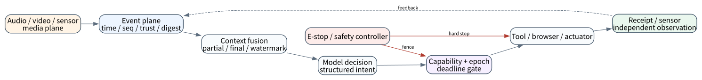
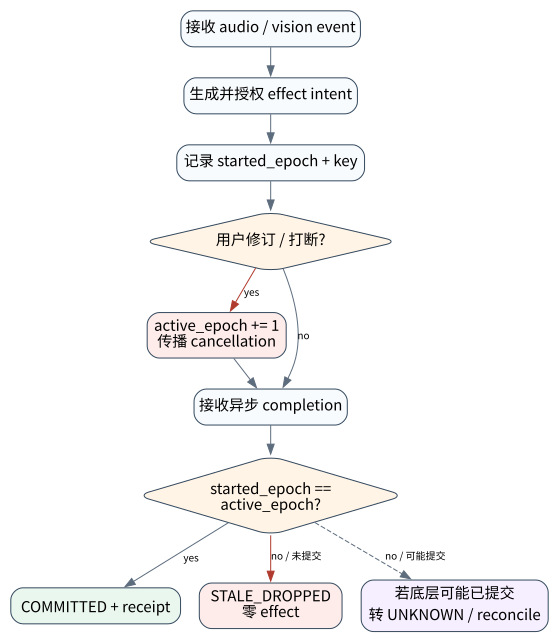

# 多模态、语音、机器人与实时 Agent

> **本章核心判断**：多模态 Agent 的难点不只是把图像、音频和文本送入同一模型，而是让不同采样率、时钟、延迟和可靠性的 observation 与可取消 action 在同一因果状态机中收敛。用户说“停”以后，旧 completion 不得重新获得行动权。

上一章说明如何改变策略；本章说明无论模型多强，实时环境仍需要 event-time、cancellation、actuator safety 与独立 observation。下一章将把这些生产反馈用于受控改进。



## 问题背景与学习目标

语音 partial 每几十毫秒变化，视频帧可能乱序或丢失，工具调用通过网络异步完成，机器人动作还会改变物理世界。文本回合制假设“输入完整—推理—输出完整”在这里失效。低延迟和正确性也冲突：等待更多证据会更准，却可能错过用户打断或安全 deadline。

完成本章后，读者应能：

- 区分 media/event/decision/action/control 五个平面；
- 使用 source time、ingest time、sequence、watermark 和 clock uncertainty；
- 解释 barge-in、cancellation propagation、epoch fencing 与 stale result；
- 将 ASR/VAD/VLM/TTS/tool/actuator failure 分层诊断；
- 为机器人加入独立 safety controller、E-stop、速度/空间/力限制和 observation；
- 正确接入远程 Realtime API 或本地 streaming 模型而不泄露 key、不过度声称性能。

## 核心概念与系统直觉

> **Invariant**：任何会改变外部世界的 completion，必须属于当前有效 cancellation epoch，并满足当前 capability/policy；来自旧 epoch 的结果只能丢弃、隔离或协调，不能提交。

**Media plane 传输连续信号。** 音频 packet、video frame、screen delta 关注 codec、jitter、bandwidth；不应把大块 raw media 复制到 prompt、trace 和数据库。

**Event plane 建立离散事实。** VAD、ASR partial/final、object track、user interrupt、tool completion 都需要 run/seq/source clock/epoch/digest。ASR partial 是可撤回假设，不等价于用户指令。

**Decision plane 提出 intent。** 模型可以融合文本、视觉和状态，但必须输出结构化 action intent；confidence 低或 observation 冲突时应询问/等待，而不是执行不可逆动作。

**Action plane 执行副作用。** 浏览器点击、电话转接和机器人移动都需要 capability、deadline、idempotency 和 receipt。物理动作通常不能靠“撤销文本”恢复。

**Control plane 决定谁还有效。** Session epoch、turn ownership、cancellation token、budget、E-stop 和 supervisor policy 必须由确定性 runtime 管理，不能依靠模型记住用户已经打断。

## 原理与理论基础

事件 $e_i$ 至少携带：

$$
e_i=(source, t_{event}, t_{ingest}, seq, epoch, kind, digest)
$$

不同 source 的时钟未必同步，因果关系通常只形成偏序。若事件延迟分布上界可估计，可用 watermark $W=t_{max}-\Delta$ 判断哪些 event-time 窗口可封闭；超过窗口的 late event 要重算、补偿或隔离，而不是静默插入过去。

取消不是删除消息，而是提升 generation/epoch：

$$
Commit(effect)=Authorized(effect)\land epoch_{started}=epoch_{active}\land deadline\_ok
$$

这与 optimistic concurrency/fencing token 同构。旧 worker/旧工具即使晚到，也因 token 过期失去 commit 权。若底层 effect 在取消前已经真实提交，则不能简单 `STALE_DROPPED`，必须进入 UNKNOWN/reconciliation。

实时质量是多目标：任务正确性、timeliness、interruption handling、context continuity、unsafe action 与资源消耗。只测 WER、帧分类或平均 latency 无法代表 Agent interaction。

## 关键机制与执行流程



1. **接入媒体**：记录 codec/sample/frame metadata 与受控 artifact ref，不把 raw secret 泄入 trace；
2. **生成事件**：VAD/ASR/VLM 输出带 source/event time、confidence、revision 和 digest；
3. **融合上下文**：按 watermark 与任务 deadline 选择 observation，区分 partial/final/trusted；
4. **编译 intent**：模型提出 tool/actuator 参数，reference monitor 重新检查 capability、区域、速度和预算；
5. **注册 epoch**：effect 在开始前保存 active epoch、key、deadline 与 intent digest；
6. **处理打断**：用户 revision/retraction 增加 epoch，停止输出并传播 cancel；
7. **接收 completion**：旧 epoch 结果不得提交；可能已发生的远端/物理 effect 进入 observation/reconciliation；
8. **验证终态**：传感器、API receipt 或环境 query 证明动作结果，模型自然语言不是物理事实。

## 从原理到实现

`RealtimeSession`把多个 modality 映射到单调事件序列；payload 只留 digest：

```python
session = RealtimeSession()
session.ingest(100, "audio", "audio.partial", {"text": "move"})
session.ingest(105, "vision", "vision.frame", {"object": "arm", "distance_cm": 5})

started_epoch = session.begin_effect("move-1", 110, {"distance_cm": 5})
status = session.complete_effect("move-1", started_epoch, 120, {"moved": True})
assert status == "COMMITTED"
```

打断先提升 epoch，再处理旧 completion：

```python
started_epoch = session.begin_effect("move-1", 110, {"distance_cm": 5})
session.interrupt(115, "stop")          # active epoch: 0 -> 1
status = session.complete_effect("move-1", started_epoch, 120, {"moved": True})

assert status == "STALE_DROPPED"
assert session.effects == []
```

这里 `begin_effect` 只登记**尚未发送到外部执行器**的候选工作；`session.effects` 是本地已接受的 completion 列表，`effect_count=0` 不能推出机器人没有运动。若工具请求已跨过远端/物理提交边界，打断只能阻止后续本地接受，远端结果必须标为 `UNKNOWN` 并通过 receipt/传感器协调；机械臂还需要独立 E-stop。因而本实验的 L3 限于本地 stale-result commit fence，不是物理安全认证。

真实 [OpenAI Realtime API](https://developers.openai.com/api/docs/guides/realtime) 或其他 streaming provider 应作为 media/model adapter：client/server credential 通过环境或短期 token 注入，记录 provider event/request identity；本章 epoch/capability/effect gate 仍在应用控制面执行。未实际调用 provider 时不得发布语音质量或 latency 数值。

## 主流系统实现对照与源码阅读入口

| 对象 | 强项 | 必查事件 | 不能替代 |
|---|---|---|---|
| WebRTC | 低延迟媒体、NAT、拥塞控制 | track/connection/reconnect/clock | 业务 action authorization |
| WebSocket | 双向事件、服务端控制直观 | ordering、resume、backpressure | 音视频 jitter/codec 全栈 |
| Realtime model API | speech/vision/reasoning/tool event | partial/final、VAD、tool call、cancel | 本地 effect/robot safety |
| ROS 2/机器人中间件 | sensor/actuator/topic/action | timestamp、QoS、action cancel/feedback | 模型语义与业务权限 |
| 浏览器/电话系统 | 可操作真实环境 | navigation/call state/DTMF/receipt | 跨系统 exactly-once |

源码阅读从 transport event schema 开始，再追 session state、buffer、turn detector、tool dispatcher、cancel propagation、actuator adapter 和 trace。UI 动画不是控制流证据。

## 设计方案与方法对比

| 设计 | 延迟 | 一致性/安全 | 适用场景 |
|---|---:|---|---|
| 等 final transcript 再行动 | 较高 | 语义较稳定 | 高风险写操作 |
| partial speculation | 低 | 需撤销与 epoch | 低风险建议/预取 |
| server-side VAD | 网络简洁 | 受环境噪声影响 | 常规语音会话 |
| push-to-talk/client signal | 用户控制强 | 交互摩擦 | 工业/高噪声环境 |
| 单模型端到端 | 路径短 | 可观测/替换困难 | 低风险体验 |
| 分层感知+policy+actuator | 组件较多 | 可验证、可降级 | 生产/机器人 |

实时系统常使用 speculation，但只允许可丢弃的计算提前；不可逆 effect 必须等稳定 intent、权限与 deadline gate。

## 可复现实验

### Lab 38A — 当前 epoch 正常提交

```bash
PYTHONPATH=src uv run python examples/chapters/ch38_multimodal.py
```

**实际输出。** 当前 epoch 的 effect 完成后被提交，事件链保留感知、启动与提交顺序：

```json
{"outcome":"COMMITTED","active_epoch":0,"effect_count":1,"events":[{"kind":"audio.partial","epoch":0},{"kind":"vision.frame","epoch":0},{"kind":"effect.started","epoch":0},{"kind":"effect.committed","epoch":0}],"evidence_level":"L1_MECHANISM"}
```

### Lab 38B — 打断后的旧 completion

```bash
PYTHONPATH=src uv run python examples/chapters/ch38_multimodal.py --fault
```

**实际输出。** interrupt 推进 epoch，迟到 completion 被控制面丢弃且没有产生 effect：

```json
{"outcome":"STALE_DROPPED","active_epoch":1,"effect_count":0,"last_event":{"kind":"effect.stale_dropped","epoch":1},"contained":true,"evidence_level":"L3_CONTAINED"}
```

**关键断点与验收。** 检查 effect 保存的 started epoch、interrupt 的单进程增量、completion gate 和本地 commit count。A 只能本地提交一次；B 必须零本地 commit 且由系统主动记录 stale drop。完整步骤见 [Lab 38A](../../../labs/core/lab-38A-multimodal.md) 与 [Lab 38B](../../../labs/core/lab-38B-multimodal-fault.md)。

## 工程场景与系统设计

以仓库机械臂为例：相机与深度传感器生成带时钟的 object observations；模型只提出 `move(container, pose)` intent；motion planner 和 safety PLC 检查空间/速度/力；effect 以 action id/epoch 发送；用户 E-stop 直接作用于独立控制器，而非先请求模型理解。

语音客服风险较低但仍有 effect：转账、发送邮件、挂断/转接电话都要 approval 和 receipt。ASR partial 可驱动检索预取，不能直接确认交易。Session resume 必须恢复 event/epoch/tool state，而不是只恢复聊天文本。

## 故障模型、失败模式与排错

- **ASR partial revision**：早期词被更正；只让稳定 segment 进入高风险 intent；
- **frame late/out-of-order**：旧视觉覆盖新状态；使用 source time/watermark/track version；
- **barge-in 失效**：输出停了但 tool 仍运行；追踪 cancel token 到 effect adapter；
- **stale completion**：旧 epoch 结果提交；检查 fencing token 是否在最终 commit 验证；
- **媒体断线重连**：重复/缺失 event；使用 session/seq/resume cursor；
- **clock drift**：音画和 action 错位；估计 offset/uncertainty，不假装全局精确时钟；
- **physical effect UNKNOWN**：网络丢包不代表机械臂没动；查询 actuator/传感器并人工处置；
- **隐私泄露**：raw audio/video 进入 trace；预写脱敏、最小保留、访问审计。

## 性能、可靠性与工程化

分阶段测 capture→ingest、VAD、ASR first/final、fusion、model TTFT、tool dispatch、actuator receipt、TTS first audio；报告 p50/p95/p99、jitter、late-event、interrupt-to-silence、cancel success、stale completion、unsafe effect 与 cost/verified turn。

背压必须有策略：优先保留 control/safety event，video 可采样或丢旧帧，audio 不可任意重排，trace exporter 不得阻塞 E-stop。高可用 session 要持久化 control state 与 effect identity，而非把所有 raw media 存进数据库。

## 技术边界与设计取舍

Core Lab 没有真实媒体、模型或硬件，因此只证明 epoch gate。`STALE_DROPPED` 只适用于尚未提交的应用 effect；若物理/远端动作已发生，必须用第 33/40 章的 UNKNOWN/reconciliation。单调整数 timestamp fixture 也没有覆盖真实 clock skew。

机器人安全不能由 LLM/VLM 单独保证。速度、空间、力、急停与认证应由独立确定性控制层拥有，且满足具体行业标准。语言模型可辅助规划和解释，不可替代 safety-rated controller。

## 前沿研究与演进方向

截至 2026-09-11，实时研究正在从离线视频问答走向在线、不可预知未来帧、可打断的交互。[OmniInteract](https://arxiv.org/abs/2605.26485)关注质量—时机、打断和上下文连续性；[InterruptBench](https://arxiv.org/abs/2604.00892)把长任务中的新增、修订和撤回纳入 grounded evaluation。这类工作说明“答对”与“及时停止”必须共同评价。

开放问题包括：跨 modality 因果对齐；不泄露原始媒体的可复现 benchmark；partial observation 下的风险校准；模型与独立 safety controller 的可验证接口；长时 session 的 compact/replay；对已发生物理 effect 的标准 reconciliation。

### 深度审计与研究证据链

本章从不以录屏或一次顺畅演示证明实时正确性。L1/L3 来自可执行 event/epoch gate；真实 provider 需要 raw event log、配置、网络条件和多次运行；真实机器人还需 actuator/sensor receipt 与安全评估。三者不可互相冒充。

## 本章总结与进阶实践

多模态 Agent 的系统本质是带时间与取消语义的闭环控制。感知可以概率化，effect authorization、epoch fencing 和物理安全边界必须确定化。

进阶问题（答案见[附录 M](../appendix-m-part7-solutions.html#ch38)）：

1. 为什么 ASR partial 不能直接视为用户最终指令？
2. event time、ingest time 与 sequence 各解决什么问题？
3. epoch fencing 比一个 `cancelled` 布尔值强在哪里？
4. 何时 `STALE_DROPPED` 不足，必须进入 UNKNOWN？
5. 如何把本章实验升级成真实 Realtime/机器人证据而不夸大结论？
