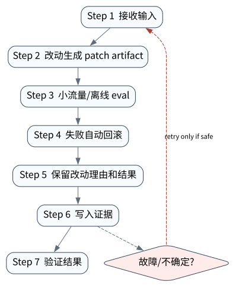

# Self-Improving Agent：优化、验证与回滚

> **本章核心判断**：自我改进必须建立在 verifier 和 rollback 上。Agent 可以改 prompt、skill 或代码，但不能跳过评估和审批。

上一章：多模态、语音、机器人与实时 Agent。本章把前一章已经建立的能力进一步推进到 `Proposal`；下一章将进入：综合案例：AgentOps 平台的端到端闭环。


## 问题背景与学习目标

自我改进必须建立在 verifier 和 rollback 上。Agent 可以改 prompt、skill 或代码，但不能跳过评估和审批。

在本章的 `Proposal` 场景中，真实 Agent 系统与普通“问答程序”的差异，在于一次任务会跨越模型、工具、状态、外部环境和人工治理边界。本章所有原理、代码与实验都围绕这些可验证问题展开。


**本章完成标准：**

- **机制理解**：能够解释“自我改进必须建立在 verifier 和 rollback 上。Agent 可以改 prompt、skill 或代码，但不能跳过评估和审批。”，并指出它对应的确定性软件边界；
- **正确性判断**：能够针对 `self-modification requires an external evaluation gate and a reversible rollout` 构造一个反例，说明证据不足时系统为什么不能继续乐观执行；
- **实验与迁移**：运行 `Lab 39A` / `Lab 39B`，分别说明 normal/fault 的 evidence level，并把同一机制映射到至少一个上游实现或协议。

## 核心概念与系统直觉

本节不把概念当作术语清单，而是回答三个工程问题：它**是什么**、在系统里**负责什么**、以及它失效时**会留下什么可观测证据**。

### Proposal

**定义。** Agent 对 prompt、skill、retriever、runtime 参数、代码甚至训练配置提出的候选改动，本身没有上线权。

**系统责任。** Proposal 应包含目标、diff、假设、风险和预期指标，使后续实验可以证伪，而不是 “感觉更好”。

**失败边界。** 让生产 Agent 直接修改自身并立即生效会形成不可审计反馈环；失败时也无法知道哪次改动造成退化。

### Experiment

**定义。** 在隔离环境和固定 eval set 上比较候选与 baseline 的受控运行。

**系统责任。** Experiment 应固定数据/环境、重复次数和统计方法，并覆盖正常、历史失败和 adversarial set。

**失败边界。** 只跑候选自己选择的案例会产生选择偏差；在线用户流量也不应成为第一轮安全实验场。

### Verifier

**定义。** 独立决定候选是否满足质量、安全、成本和稳定性门槛的评价面。

**系统责任。** Verifier 与 proposal generator 分离，必要时使用多指标 Pareto/硬门禁，保留人工对高风险变化的 veto。

**失败边界。** self‑judge 容易 reward hacking；只提升平均成功率却恶化高风险 tail 也不能算改进。

### Rollback

**定义。** 在候选上线后快速恢复到已知良好模型/prompt/config/runtime 的能力及其状态兼容方案。

**系统责任。** Rollback 需要版本化 artifact、feature flag、数据 migration 策略和线上监控触发条件。

**失败边界。** 如果改动同时改变不可逆数据/记忆 schema，简单切回旧代码并不能恢复；因此上线前要设计 forward/backward compatibility。

## 原理与理论基础

### 系统不变量

> **Invariant**：self-modification requires an external evaluation gate and a reversible rollout

不变量与普通“最佳实践”不同：最佳实践可以因为场景变化而替换，不变量一旦被破坏，系统就失去本章希望保证的正确性。例如 `让 Agent 直接修改生产 prompt` 并不是一个 UI 问题，而是说明某个状态已经无法从证据中唯一判断。


### 故障模型

本章优先把 “让 Agent 直接修改生产 prompt”、“没有对照组就发布”、“成功样本过拟合” 作为可证伪故障，而不是泛化地枚举所有异常。对涉及外部 effect 的失败，判定顺序固定为“最后 durable state → effect 是否可能发生 → 现有 observation 是否足够决定下一步”；证据不足时停在 UNKNOWN/显式失败。

### Why / What if / Trade-off

本章真正的设计取舍不是“使用更强模型还是写更多规则”，而是确定 **Proposal** 与 **Experiment** 分别应该由概率性决策还是确定性软件拥有。模型可以帮助识别候选路径，但它不会自动消除“让 Agent 直接修改生产 prompt”这类系统失败；该失败必须由 runtime 的 schema、状态机、权限或 verifier 显式约束。

如果把 Proposal 完全交给模型，系统会把不可验证的语言判断混入执行事实；如果把 Experiment 全部硬编码为固定 workflow，又会失去开放任务所需的适应性。更稳健的边界是：让模型负责提出候选决策，让软件负责 `改动生成 patch artifact`、`保留改动理由和结果` 以及对不变量 **self-modification requires an external evaluation gate and a reversible rollout** 的检查。

**What if。** 一旦“没有对照组就发布”发生，系统首先需要判断现有证据是否足够决定下一状态；证据不足时应停在显式失败或待协调状态，而不是让模型用自然语言补全事实。这个边界决定了本章方案是否具有可恢复性，而不只是演示效果。


### 形式化模型与可证伪假设

$$
Accept(c)\iff \Delta Quality>\tau_q\land \Delta Risk\le\tau_r\land \Delta Cost\le\tau_c
$$

Self-Improving Agent 必须把候选改进生成器与冻结的接受 verifier 分开，避免自评自改形成正反馈失控。

**可证伪假设。** 冻结 verifier + canary/rollback 能显著降低自我优化中的 reward hacking 和 silent regression。

**建议测量。** accepted improvement rate、regression escape、rollback rate、verifier disagreement。

## 关键机制与执行流程



**Step 1 — 改动生成 patch artifact。** `改动生成 patch artifact` 负责形成后续决策的输入。需要同时保存来源、版本/时间与必要的关联标识，避免把“当前看到的数据”误当成永远有效的事实。进入下一阶段前，对结构、权限和来源做最小验证，使 `Proposal` 的状态能够在 trace 中被复现。

**Step 2 — 小流量/离线 eval。** `小流量/离线 eval` 是“Self-Improving Agent：优化、验证与回滚”的一次显式状态转移。输入和输出都必须可序列化并关联 `run_id/step_id`；一旦该步骤失败，后继步骤只能依据已记录状态继续。关键观察点是 `Experiment` 是否仍满足 **self-modification requires an external evaluation gate and a reversible rollout**。

**Step 3 — 失败自动回滚。** `失败自动回滚` 是“Self-Improving Agent：优化、验证与回滚”的一次显式状态转移。输入和输出都必须可序列化并关联 `run_id/step_id`；一旦该步骤失败，后继步骤只能依据已记录状态继续。关键观察点是 `Verifier` 是否仍满足 **self-modification requires an external evaluation gate and a reversible rollout**。

**Step 4 — 保留改动理由和结果。** `保留改动理由和结果` 是“Self-Improving Agent：优化、验证与回滚”的一次显式状态转移。输入和输出都必须可序列化并关联 `run_id/step_id`；一旦该步骤失败，后继步骤只能依据已记录状态继续。关键观察点是 `Rollback` 是否仍满足 **self-modification requires an external evaluation gate and a reversible rollout**。

在本章的 `Proposal` 场景中，**最后一步 — 验证。** verifier 针对 `Rollback` 检查本章不变量 **self-modification requires an external evaluation gate and a reversible rollout**。如果“让 Agent 直接修改生产 prompt”使现有 artifact/外部状态不足以证明成功，结果必须停在显式失败或 UNKNOWN；只有 observation 能闭合状态转移时，流程才允许进入 FINISHED。

### 数据流与控制流

本章的数据/控制链按 **改动生成 patch artifact → 小流量/离线 eval → 失败自动回滚 → 保留改动理由和结果** 推进。调试时不要只看最终 answer，应确认每一阶段的输入来源、状态版本和 observation；对“让 Agent 直接修改生产 prompt”尤其要检查动作前后的证据是否足以闭合不变量 **self-modification requires an external evaluation gate and a reversible rollout**。


### 持久化点与崩溃窗口

本章需要持久化的内容取决于动作可逆性。与 `Proposal` 有关的纯计算状态通常可以重算；一旦 `小流量/离线 eval` 可能产生昂贵、外部或不可逆效果，就必须在动作前后建立可区分的证据边界。对于本章不变量 **self-modification requires an external evaluation gate and a reversible rollout**，恢复时最重要的问题是：最后一个已知状态是什么、动作是否可能已经发生、现有 observation 能否唯一决定 retry/continue/compensate。


## 从原理到实现


### 完整实验入口

```python
from __future__ import annotations
import argparse
from agentlab.course_scenarios import run_scenario

def main() -> int:
 p=argparse.ArgumentParser(description='Self-Improving Agent：优化、验证与回滚')
 p.add_argument("--fault", action="store_true", help="inject the chapter-specific failure path")
 args=p.parse_args()
 result=run_scenario('self-improve', fault=args.fault)
 print(result.as_json())
 return 0 if result.passed else 2

if __name__ == "__main__":
 raise SystemExit(main())
```

### 核心机制实现

```python
def self_improve(fault=False):
 baseline={'success':8,'cost':10}; candidate={'success':9 if not fault else 7,'cost':11}
 accepted=candidate['success']>baseline['success'] and candidate['cost']<=baseline['cost']*1.2
 action='promote' if accepted else 'rollback'
 return _ok('self-improve',fault,{'baseline':baseline,'candidate':candidate,'action':action},'self-modification requires an external evaluation gate and a reversible rollout',action=='promote' if not fault else action=='rollback')
```


### 简化假设与不能省略的机制


## 主流系统实现对照与源码阅读入口

| 项目 | 本书锁定版本/状态 | 应阅读的机制 | 已核验源码/文档入口 | 官方来源 |
|---|---|---|---|---|
| DeepSeek Harness | `@deepseek-ai/dsh 0.1.2-rc.1 reproducibility pin` | 先读 docs/architecture.md，再看 service/dependency/lifecycle；关注 Cordis context、service 注入与 plugin 可逆 effect，而不是只看 UI。 | `docs/architecture.md`<br>`docs/user/develop/framework/service.md` | [官方来源](https://github.com/deepseek-ai/deepseek-harness) |
| Pi Coding Agent | `@earendil-works/pi-coding-agent 0.85.1` | 把 session tree、branching、compaction、extensions/skills 看成极简 coding harness 的核心；同时注意 2026 年包名迁移到 @earendil-works。 | 以官方 docs/release/source tree 为准 | [官方来源](https://github.com/earendil-works/pi) |
| Anthropic: Demystifying evals for AI agents | `2026-01-09` | Agent eval 需要 task/environment/trajectory/grader 共同设计。 | 以官方 docs/release/source tree 为准 | [官方来源](https://www.anthropic.com/engineering/demystifying-evals-for-ai-agents) |

### 源码阅读方法

源码阅读以 **DeepSeek Harness** 为第一参照，并只追与“Self-Improving Agent：优化、验证与回滚”直接相关的公开执行链：入口 → durable/session state → 权限或协议边界 → verifier/trace。若上游没有公开某个服务端组件，本章不根据客户端现象反推其内部 scheduler、queue 或 policy engine。


### 工业实现为什么更复杂


对本章最值得关注的工程增量是：如何避免“让 Agent 直接修改生产 prompt”、如何在“没有对照组就发布”后恢复，以及如何让 `保留改动理由和结果` 的结果能够进入 tracing/evaluation。只有这些机制都能落到公开类型、函数或协议消息上，才算真正完成源码对照。

## 设计方案与方法对比

| 方案 | 核心优势 | 主要局限 | 更适合的约束 |
|---|---|---|---|
| 最小自研 AgentLab | 机制透明、可断点、无网络即可故障注入 | 生态/模型能力有限 | 教学、研究原型、回归基线 |
| DeepSeek Harness | 贴近 coding/长期执行 harness，工作区和工具边界更真实 | 依赖更重或迭代快，升级需锁版本做回归 | Coding Agent、Harness 源码学习 |
| Pi Coding Agent | 贴近 coding/长期执行 harness，工作区和工具边界更真实 | 依赖更重或迭代快，升级需锁版本做回归 | Coding Agent、Harness 源码学习 |
| Anthropic: Demystifying evals for AI agents | 官方/主流实现提供成熟抽象与生态 | 抽象会隐藏部分底层机制，需要源码/trace 反推 | 生产集成与方案对照 |


## 可复现实验

本章两个 Core Lab 都直接执行仓库内的确定性代码；它们证明的是“Self-Improving Agent：优化、验证与回滚”对应的本地机制与 fault oracle，而不是外部 provider 或真实云环境。第三方实现只在 `labs/upstream/` 按独立 L5 互操作证据记录，未实际执行时必须保持 `EXTERNAL_NOT_RUN_IN_THIS_RELEASE`。

### 实验环境

统一 Python/OS/离线复现约束、安装步骤与工具链版本集中维护在[附录 A](../appendix-a-environment.md)。本章只增加与“Self-Improving Agent：优化、验证与回滚”直接相关的 normal/fault 双轨验证；若需要真实云、浏览器、GPU 或第三方 provider，则在对应 upstream lab 中单独标记 `NOT_RUN_EXTERNAL`，不把未运行结果计入核心实验。

### Lab 39A — 正常路径

```bash
PYTHONPATH=src python examples/chapters/ch39_self_improve.py
```

**关键断点：**
- `src/agentlab/course_scenarios.py::self_improve`
- `examples/chapters/ch39_self_improve.py::main`

**本发布包实际输出：**

```json
{"contained": false, "evidence_level": "L1_MECHANISM", "evidence_meaning": "normal_path_assertion_satisfied", "fault": false, "fault_injected": false, "invariant": "self-modification requires an external evaluation gate and a reversible rollout", "invariant_holds": true, "observation": {"action": "promote", "baseline": {"cost": 10, "success": 8}, "candidate": {"cost": 11, "success": 9}}, "oracle_detected": false, "passed": true, "recovered": false, "scenario": "self-improve", "system_detected": false}
```

PASS：退出码 0，`passed=true`、`fault=false`、`invariant_holds=true`；这只证明确定性 fixture 的正常机制断言。完整手册：[Lab 39A](../../../labs/core/lab-39A-self-improve.md)。

### Lab 39B — 故障注入

```bash
PYTHONPATH=src python examples/chapters/ch39_self_improve.py --fault
```

**本发布包实际输出：**

```json
{"contained": true, "evidence_level": "L3_CONTAINED", "evidence_meaning": "fault_detected_and_contained", "fault": true, "fault_injected": true, "invariant": "self-modification requires an external evaluation gate and a reversible rollout", "invariant_holds": true, "observation": {"action": "rollback", "baseline": {"cost": 10, "success": 8}, "candidate": {"cost": 11, "success": 7}}, "oracle_detected": true, "passed": true, "recovered": false, "scenario": "self-improve", "system_detected": true}
```

PASS：退出码 0，`passed=true`、`fault=true`、`oracle_detected=true`。本章故障实验为 **L3_CONTAINED**：被测组件检测并 fail-closed/约束了故障，但不声明已恢复业务结果。 `passed=true` 本身只表示实验 oracle 得到预期观察。完整手册：[Lab 39B](../../../labs/core/lab-39B-self-improve-fault.md)。

### 观察与证据


## 工程场景与系统设计

本章沿用第 35 章多租户 API 场景，重点规定 self-improvement 只能生成候选版本，不能直接绕过发布 gate、租户 policy 或每月故障演练。


### 上线前必须补齐

- 围绕 **Self-Improving Agent** 建立可审计状态字段与最小权限；
- 为本章相关动作记录 run_id、step_id、输入摘要与 observation；
- 对 `自我改进必须有独立 verifier、回滚和变更隔离。` 这一边界建立自动化验收；
- 为本章主要故障窗口配置 trace、日志和恢复 runbook；
- 上线前把教学 fixture 替换为真实 provider/tool/workspace，并重新执行 normal/fault 两条路径。

## 故障模型、失败模式与排错

本章至少主动测试以下失败：

- **让 Agent 直接修改生产 prompt**：先确认最后 durable state，再检查是否已经产生外部效果；不要先重试。
- **没有对照组就发布**：先确认最后 durable state，再检查是否已经产生外部效果；不要先重试。
- **成功样本过拟合**：先确认最后 durable state，再检查是否已经产生外部效果；不要先重试。


## 性能、可靠性与工程化

### 应采集指标

- `API p95/p99`
- `tenant isolation violations`
- `queue depth`
- `RPO/RTO rehearsal`
- `deployment rollback time`
- `cost per tenant/run`


### 优化顺序


任何优化都必须重新运行 Lab A/B。尤其当优化改变 `Experiment` 的生命周期时，要重新验证 **self-modification requires an external evaluation gate and a reversible rollout**；否则平均延迟下降可能以更大的 stale state、重复副作用或取消失效为代价。

### 可靠性工程

本章可靠性 gate 直接针对 “让 Agent 直接修改生产 prompt”、“没有对照组就发布”、“成功样本过拟合”：只有正常路径与对应 fault path 都保持 **self-modification requires an external evaluation gate and a reversible rollout**，优化或功能扩展才可接受。是否达到 detection、containment 或 recovery 以实验的 `evidence_level` 字段为准。


## 技术边界与设计取舍
本章方案有明确边界：

- 教学服务不等于生产认证系统，HA、secret broker、审计保留等需额外实现
- 多租户必须在存储/缓存/日志/队列每层强制 tenant boundary
- 部署成功不代表恢复成功，需定期做故障演练
- post-training 会改变行为分布，必须用独立 eval gate 防回归

选择方案时要回到本章边界：如果业务不能接受“让 Agent 直接修改生产 prompt”，就必须为 `Proposal` 增加更强的确定性约束；如果主要任务是开放式探索，则可以把更多 `Experiment` 决策交给模型，但要用 `保留改动理由和结果` 保持结果可验证。**DeepSeek Harness** 与 **Pi Coding Agent** 的差异也应放在这些约束下理解，而不是抽象成通用框架排名。

Self-improvement 只能在受控优化环内成立：候选变更必须可版本化、可评测、可回滚。让 Agent 直接修改自己的 policy/tool 权限而没有独立 gate，会把局部 reward 改进转化成治理风险。

## 前沿研究与演进方向

当前研究和工业演进已经从“模型能否调用工具”推进到“怎样让长期、状态化、具有副作用的 Agent 可评估、可恢复、可治理”。与本章直接相关的资料：

- **[Reflexion: Language Agents with Verbal Reinforcement Learning](https://arxiv.org/abs/2303.11366)**：通过外部反馈与语言化反思把失败经验写入后续尝试。
- **[Language Agent Tree Search](https://proceedings.mlr.press/v235/zhou24r.html)**：ICML 2024；把 tree search、环境反馈、反思和值函数组合到 Agent 决策。
- **[DeepSeek Harness](https://github.com/deepseek-ai/deepseek-harness)**（@deepseek-ai/dsh 0.1.2-rc.1 reproducibility pin）：Developer preview；Everything is a Plugin，基于 Cordis context/service/lifecycle。
- **[Pi Coding Agent](https://github.com/earendil-works/pi)**（@earendil-works/pi-coding-agent 0.85.1）：极简 terminal coding harness；extensions、skills、sessions、branching/compaction；旧 @mariozechner 包已弃用。


### 截至 2026-09-11 的研究更新

本节只记录会改变本章系统结论的研究或官方规范更新；实验仍使用仓库锁定版本，避免把“最新观察版本”与“可复现实验版本”混为一谈。
- Anthropic: Automated researchers can reliably mitigate alignment failures（2026‑08‑28）：automated alignment research, scalable oversight and self‑improvement boundaries。
- OpenAI: Research acceleration —the view inside OpenAI（2026‑09‑06）：parallel coding agents, research task horizons, human intervention and research velocity。

**本章吸收的变化。** Self‑improving Agent 需要把 candidate generator 与 acceptance verifier 分离。能提出自修改不等于有权证明自己变好。这些研究/规范的价值不在于替换本章原理，而在于把上述假设放进更真实、更长时或更高风险的环境中检验。

### Research Gap

围绕 `Proposal`，当前缺口不是“再增加一个 Agent API”，而是怎样把 **self-modification requires an external evaluation gate and a reversible rollout** 从局部实现经验升级为跨模型、跨 runtime 可验证的系统属性。现有工业实现已经能够提供 tool loop、session、graph、plugin 或 workspace 等抽象，但在“让 Agent 直接修改生产 prompt”和“没有对照组就发布”同时出现时，证据格式、恢复语义和评测方法仍缺少统一答案。

本章的研究更新不追求论文数量，而关注一个问题：现有工作是否真正推进了 **Self-Improving Agent** 的可验证性。Reflexion、Voyager 与 self-evolving agent 研究证明反馈有价值，但生产系统必须防止自修改破坏 harness。 因此，本章会把论文结论放回不变量、失败窗口和实验断言中，而不是把研究当作参考文献列表。

### Open Problems

1. 如何把 `Proposal` 的正确性拆成可组合的局部不变量，并在不同 Agent runtime 中复用 verifier？
2. 当“让 Agent 直接修改生产 prompt”与“没有对照组就发布”同时发生时，**DeepSeek Harness** 与 **Pi Coding Agent** 的公开抽象分别能保存哪些证据，哪些状态仍需要外部 reconciliation？
3. 如果模型能力显著提高，围绕 `Experiment` 的哪些 harness 机制仍属于系统必要条件，哪些只是当前模型能力下的临时补丁？
4. 如何构造一个既保护真实业务数据、又能复现“成功样本过拟合”的公开 benchmark，使研究结果可以被第三方验证？


### 深度审计与研究证据链：Self-Improving Agent

本章重新审计后的核心结论是：**自我改进必须有独立 verifier、回滚和变更隔离。** 这句话只有在代码、实验、开源源码和研究证据四个层面同时成立时才有教学价值。仅靠定义或 API 示例无法证明它，因为 Agent Systems 的风险通常发生在模型决策与外部环境之间的缝隙里。

**与本章最相关的近期/基础研究与官方资料：**

- **[PaperBench](https://openai.com/index/paperbench/)**：把论文复现拆成细粒度可评分任务，强调 rubric/grader。
- **[AgentDojo](https://arxiv.org/abs/2406.13352)**：用不可信工具返回内容测试 prompt injection 攻防。
- **[Agent Security Bench](https://arxiv.org/abs/2410.02644)**：覆盖多工具、多场景、多攻击/防御的 Agent 安全评测。

这些资料与本章的关系不是“引用背书”，而是帮助读者识别设计边界。Pi skills/extensions、DeepSeek Harness plugins、LangGraph eval gate 可对照。 读者阅读源码时应主动寻找四个对象：输入如何进入系统、状态在哪里持久化、动作由谁执行、失败后谁负责恢复。

**实验语义边界。** 本章实验验证 Self-Improving Agent 的观测、评测、安全或生产控制面不变量；证据等级定义与解释规则统一见附录 A，且 `passed=true` 不得跨级推导 containment/recovery。


## 本章总结与进阶实践

### 核心结论

1. 本章不变量是：**self-modification requires an external evaluation gate and a reversible rollout**；
2. `Proposal` 必须是可观察软件边界，而不是 prompt 约定；
3. `改动生成 patch artifact` 与 `保留改动理由和结果` 之间必须有状态和证据连接；
4. 模型提出动作不等于系统已经执行，更不等于任务成功；
5. 正常路径只能证明功能，故障路径才能暴露恢复语义；
6. 开源实现的核心价值在于理解真实约束，不是复制 API；
7. 性能优化必须与可靠性/安全不变量一起重新验证；
8. 技术边界和未解决问题是高级系统设计的一部分。

### 常见误区

- 让 Agent 直接修改生产 prompt
- 没有对照组就发布
- 成功样本过拟合

### 思考题与实践

- **Why：** 为什么 `Proposal` 不能只靠模型“记住”？
- **What if：** 如果在 `改动生成 patch artifact` 与 `保留改动理由和结果` 之间 crash，当前证据足够恢复吗？
- **Programming：** 修改 `examples/chapters/ch39_self_improve.py` 或对应 scenario，让系统新增一种错误类型，但仍保持 invariant。
- **Engineering：** 把 Lab B 的故障改成 timeout/duplicate/crash 中另一种，写出状态机和恢复步骤。
- **Research：** 选择本章一个 Open Problem，阅读两篇相互不同的方法，给出你自己的实验设计和 falsifiable hypothesis。

下一章进入 **综合案例：AgentOps 平台的端到端闭环**，它将复用本章已经建立的状态/证据边界，而不是重新从 API 使用开始。
