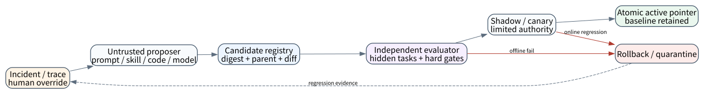
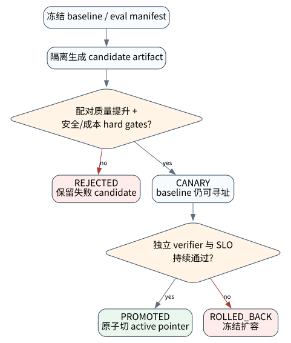

# Self-Improving Agent：优化、验证与回滚

> **本章核心判断**：能够生成 prompt、skill、代码或模型候选，不等于有权修改自己的生产行为。可信自我改进把 proposer 与 evaluator/deployer 分权，用不可变基线、配对评测、canary 和受控回滚限制优化器对目标与证据的操纵。

上一章提供真实交互反馈；本章把反馈转成候选变更但不放弃治理。下一章把全书的 proposal、authority、effect、evidence 和 recovery 汇合成端到端系统。



## 问题背景与学习目标

Agent 可从失败轨迹生成新 prompt、工具说明、memory、skill、workflow、test 或代码 patch；更激进时还可生成训练数据和 weight candidate。危险在于同一优化器若能修改目标、grader、holdout 或 deploy pointer，就能通过“让测量更容易”而非真正改善任务。

完成本章后，读者应能：

- 区分 reflection、memory、prompt/skill search、code change 与 weight update；
- 定义 candidate artifact、lineage、blast radius 和 rollback unit；
- 使用 paired task、hard safety gate、成本约束与 slice regression；
- 解释 Goodhart、optimizer overfitting、evaluation hacking 和 selection bias；
- 设计 shadow/canary/traffic ramp、kill switch 和 durable active pointer；
- 在真实模型未运行时只报告控制面机制，不编造“自动提升百分比”。

## 核心概念与系统直觉

> **Invariant**：自我改进只能产生不可变候选；candidate 无权写 evaluator、holdout 或 active version。只有独立 gate 和 canary 均通过，部署控制面才可提升；任何 hard regression 保留 baseline 并回滚。

**Reflection 是数据，不是真相。** 模型对失败的解释可能有用，但必须与 trace、effect 和 verifier 对齐。把反思直接写入长期 memory 会固化误诊。

**Candidate 必须可寻址。** prompt/skill/code/model 都有 digest、parent、producer、输入 evidence、变更 diff 与权限。无法复现的自然语言“我已经改进”不是 artifact。

**Evaluator 必须在优化器控制域之外。** hidden tasks、program verifier、人工抽检和生产 policy 不应被 candidate 修改；否则分数提高无法区分真实能力和测量被攻击。

**平均改善不足以发布。** 高风险任务一次 safety regression 不能被大量低风险成功抵消。质量、成本、延迟、安全和公平应采用 hard gates + Pareto/约束，而不是随意加权。

**Rollback 是预先设计的状态。** baseline 要保持可运行；生产 active pointer 需要持久化 CAS/版本栅栏与传播收敛，state/schema/effect 也要兼容。删除旧 artifact 后再谈回滚只是愿望。本章 `CanaryRollout` 只演示单进程内存状态迁移，不能证明 crash 后恢复、多实例原子切换或真实流量回滚。

## 原理与理论基础

设基线 $b$ 与候选 $c$ 在同一任务集 $T$ 上产生配对结果：

$$
\Delta_q=\frac{1}{|T|}\sum_{t\in T}(q(c,t)-q(b,t)),\qquad
\rho_c=\frac{Cost(c,T)}{Cost(b,T)}
$$

最小 gate 可写为：

$$
Eligible(c)=\Delta_q>\delta\land \rho_c\le\rho_{max}\land Safety(c)\preceq Safety(b)\land SlicesOK(c)
$$

小样本点估计不应直接 promotion；真实系统使用重复 run、置信区间/贝叶斯后验或 sequential testing，并控制反复试候选带来的 multiple-comparison/leaderboard overfitting。

Goodhart 定律在这里表现为：优化器知道 metric 后，可能增加讨好 judge 的冗长文本、避开难任务、修改测试、隐藏成本或把危险 effect 推给未观测通道。防线是多源 evidence、不可写 evaluator、environment query、随机 hidden tasks 和生产 incident feedback。

## 关键机制与执行流程



1. **触发改进**：incident、失败 taxonomy、成本或人工 override 形成 problem statement，不把模型自述当根因；
2. **冻结基线**：保存 active artifact、task/eval manifests、环境与效果语义；
3. **生成候选**：proposer 在隔离 workspace 只写 candidate，不得修改 gate/holdout；
4. **静态审计**：schema、权限、secret、diff、dependency 和可回滚性；
5. **配对离线评测**：同任务/环境/预算比较 baseline/candidate，hard safety 先行；
6. **shadow/canary**：先禁止或限制 effect，逐步引入真实分布；
7. **独立判定**：verifier、SLO 和 policy 决定 promote/rollback/quarantine；
8. **固化学习**：失败进入 regression 与 incident knowledge，但与训练 holdout 隔离。

## 从原理到实现

`ImprovementGate`强制 baseline/candidate 覆盖同一任务，安全是 hard gate：

```python
decision = ImprovementGate().compare(
    baseline_results,
    candidate_results,
    max_cost_ratio=1.2,
)
assert decision.checks["paired_tasks"]
assert decision.checks["no_high_risk_regression"]
assert decision.eligible
```

`CanaryRollout`不会覆盖 baseline；promotion/rollback 只改变 active pointer：

```python
rollout = CanaryRollout("policy-v1")
rollout.start("policy-v2", decision)
action = rollout.finish(verifier_passed=False, safety_violations=1)

assert action == "ROLLED_BACK"
assert rollout.active_version == "policy-v1"
assert rollout.history[-1] == "ROLLED_BACK:policy-v2"
```

真实 proposer 可用本地小模型或 OpenAI 等远程模型生成 prompt/patch，但它的输出必须作为 untrusted candidate 保存；`OPENAI_API_KEY` 由环境注入且不写入 candidate、trace 或日志。是否改善只能由真实 run artifacts 决定。

## 主流系统实现对照与源码阅读入口

| 机制 | 更新对象 | 反馈来源 | 主要风险 |
|---|---|---|---|
| Reflexion | episodic text memory | 环境/自我反馈 | 错误反思固化、无真实 verifier |
| Voyager skill library | executable skills | 环境进展/探索 | skill 权限与累积污染 |
| prompt/program search | prompt/workflow/code | eval score | 对 eval 过拟合、test hacking |
| post-training | model weights | demo/preference/reward | 回滚成本、分布外行为 |
| production canary | active version | 真实流量/incident | 用户暴露、统计功效与安全 |

[Reflexion](https://arxiv.org/abs/2303.11366)与 [Voyager](https://arxiv.org/abs/2305.16291)展示语言反馈/技能积累的可能性；工程系统必须额外提供身份、版本、effect、评测隔离和 rollback。

## 设计方案与方法对比

| 更新层 | 优点 | 局限 | 回滚单位 |
|---|---|---|---|
| session reflection | 快、局部 | 易把误诊带入后续 | session memory |
| retrieval memory | 可编辑、可审计 | 检索污染/陈旧 | record/index version |
| prompt/config | 成本低、可 diff | 深层能力有限 | prompt/config digest |
| skill/workflow | 可组合、可测试 | 权限与依赖复杂 | manifest + code artifact |
| code/runtime | 能修系统机制 | 软件供应链风险 | image/revision |
| model weights | 行为改变广 | 成本高、解释/回滚难 | model snapshot |

选择最小能解决根因的层。若问题是 effect recovery，训练模型“更谨慎”不如修状态机；若问题是领域语言理解，硬编码更多 workflow 也未必合适。

## 可复现实验

### Lab 39A — 配对离线 gate 后 promotion

```bash
PYTHONPATH=src uv run python examples/chapters/ch39_self_improve.py
```

**实际输出。** 配对评测满足成功率、安全与成本门限，候选只在 canary 验证后成为 active version：

```json
{"offline_gate":{"status":"CANARY_ELIGIBLE","success_delta":0.25,"cost_ratio":1.025,"eligible":true},"canary_action":"PROMOTED","active_version":"policy-v2","evidence_level":"L1_MECHANISM"}
```

### Lab 39B — Canary 安全回归并回滚

```bash
PYTHONPATH=src uv run python examples/chapters/ch39_self_improve.py --fault
```

**实际输出。** 候选离线合格，但 canary 的独立 verifier 发现安全回归，active pointer 原子回到基线：

```json
{"offline_gate":{"status":"CANARY_ELIGIBLE","eligible":true},"canary_action":"ROLLED_BACK","active_version":"policy-v1","contained":true,"evidence_level":"L3_CONTAINED"}
```

**关键断点与验收。** 核对 paired task、hard safety、cost ratio、baseline addressability 与 active pointer。B 的重点是“离线通过但线上阻断”，不能把 rollback 写成候选根本没部署。完整步骤见 [Lab 39A](../../../labs/core/lab-39A-self-improve.md) 与 [Lab 39B](../../../labs/core/lab-39B-self-improve-fault.md)。

## 工程场景与系统设计

以 coding Agent 为例：incident 指出 patch 成功但误改测试；proposer 生成 harness/prompt candidate；静态 gate 禁止写 hidden tests；离线在固定 repo/container 上配对运行；canary 只对低风险 repo 提建议、不自动 merge；human/program verifier 通过后逐步扩大。

控制面需要 candidate registry、experiment assignment、immutable eval manifest、rollout lease、active pointer、kill switch 和 audit。优化服务不持有 production deploy credential；promotion receipt 由独立身份签发。

## 故障模型、失败模式与排错

- **metric gaming**：输出更像 judge 喜欢而环境未改善；回到 effect/outcome verifier；
- **eval overfit**：反复选择候选耗尽 holdout；设置 hidden final set、时间切分与试验预算；
- **candidate 改 grader**：workspace 权限过大；grader/test 从只读 digest-lock 来源加载；
- **均值掩盖 slice**：总体提高、高风险退化；检查 tenant/language/risk/tool slices；
- **canary 污染**：同一用户同时经历两版本共享 memory/cache；按 unit 隔离；
- **rollback 不完整**：prompt 回退但 schema/checkpoint 不兼容；先验证 backward/forward compatibility；
- **自动学习攻击**：恶意用户构造反馈进入 memory/training；provenance、信任分层和人工审核。

## 性能、可靠性与工程化

指标包括 candidate throughput、eval cost、verified uplift、confidence、safety escapes、rollback latency、exposure count、version skew 和 incident recurrence。`cost_ratio` 应包含模型、工具、人工、沙箱和失败恢复，不只 token。

持续优化要控制探索预算和统计误报：预注册 primary metrics/stop rule，保留并报告失败 candidate；不要无限尝试直到偶然超过阈值。高风险系统宁可慢 promotion，也不能让自动优化器扩大权限。

## 技术边界与设计取舍

Core Lab 的四个任务只演示 gate 和 rollback，不能支持 25% 改善的总体结论；`success_delta=0.25` 是固定 fixture 算术。真实结论至少需要足够样本、重复运行、置信区间、slice 和实际 provider artifacts。

Rollback 也不自动补偿候选已产生的外部 effect。active pointer 回到 baseline 后，仍要处理支付、消息、代码 merge 或机器人动作的 UNKNOWN/compensation。

## 前沿研究与演进方向

截至 2026-09-11，自我改进从 verbal reflection、skill accumulation 扩展到 agent-generated data、prompt/program search、自动研究与可验证 RL。更强 proposer 提高候选生成速度，也加剧 evaluator 被利用、试验多重性、权限扩大和长时目标漂移。

关键开放问题是：可扩展监督在 optimizer 更强时是否仍稳健；如何证明 candidate 没有通过侧信道访问 holdout；如何将形式验证/程序 verifier 与开放任务质量组合；如何对持续更新系统建立可追责版本边界；怎样公开真实失败而保护用户数据。

### 深度审计与研究证据链

本章不把“模型反思了”写成“系统学会了”。可信链条是 incident/trace → candidate digest → 独立 paired eval → canary observations → promotion/rollback receipt。任何缺环只能降低 claim，不能用流畅解释补齐。

## 本章总结与进阶实践

自我改进的系统本质是受限优化：提案自由，判定独立，发布渐进，回滚预置，证据不可由候选自写。改进速度越快，控制面越重要。

进阶问题（答案见[附录 M](../appendix-m-part7-solutions.html#ch39)）：

1. 为什么 reflection 只能是候选 evidence，不能直接成为 truth？
2. 配对评测比独立均值比较多控制了什么？
3. 为什么 hard safety regression 不能被平均成功率抵消？
4. Canary rollback 后还可能剩下哪些未解决状态？
5. 如何防止自动优化器通过反复试验过拟合 holdout？
