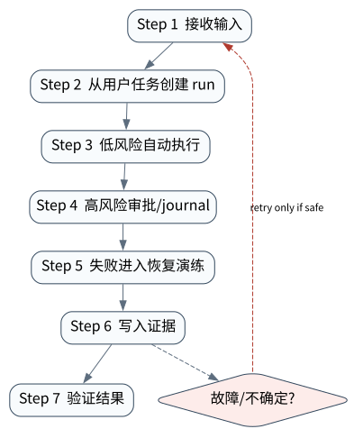

# 综合案例：AgentOps 平台的端到端闭环

> **本章核心判断**：最后把运行时、工具、记忆、协议、审批、评测、恢复和部署合成一个端到端 AgentOps 案例，以工程证据证明系统边界。

上一章：Self-Improving Agent：优化、验证与回滚。本章把前一章已经建立的能力进一步推进到 `Runtime integration`；本章作为全书收束，并把后续实践延伸到综合实验与开放研究问题。


## 问题背景与学习目标

最后把运行时、工具、记忆、协议、审批、评测、恢复和部署合成一个端到端 AgentOps 案例，以工程证据证明系统边界。

在本章的 `Runtime integration` 场景中，真实 Agent 系统与普通“问答程序”的差异，在于一次任务会跨越模型、工具、状态、外部环境和人工治理边界。本章所有原理、代码与实验都围绕这些可验证问题展开。


**本章完成标准：**

- **机制理解**：能够解释“最后把运行时、工具、记忆、协议、审批、评测、恢复和部署合成一个端到端 AgentOps 案例，以工程证据证明系统边界。”，并指出它对应的确定性软件边界；
- **正确性判断**：能够针对 `a production agent run is complete only after effect, evidence, and verifier state converge` 构造一个反例，说明证据不足时系统为什么不能继续乐观执行；
- **实验与迁移**：运行 `Lab 40A` / `Lab 40B`，分别说明 normal/fault 的 evidence level，并把同一机制映射到至少一个上游实现或协议。

## 核心概念与系统直觉

本节不把概念当作术语清单，而是回答三个工程问题：它**是什么**、在系统里**负责什么**、以及它失效时**会留下什么可观测证据**。

### Runtime integration

**定义。** 把 model、context、memory、tool、graph、policy、approval、effect、trace 和 eval 组合成一个有明确 ownership 的执行系统。

**系统责任。** 集成的目标不是“组件都能调用”，而是定义每个状态由谁持有、故障如何传播、证据在哪个边界落盘。

**失败边界。** 多个框架各自维护 session/retry/policy 会产生重复状态机和语义冲突；集成层必须选定事实源。

### Production API

**定义。** 面向真实调用方提供 create/run/stream/resume/cancel/approve/artifact/status 等稳定契约。

**系统责任。** API 与长时 runtime 解耦，支持租户、幂等、异步和 backpressure，并明确哪些返回值只是 accepted 而非 completed。

**失败边界。** 同步接口把网络连接当任务生命周期会在断线时产生 orphan run；无状态查询也无法安全恢复客户端。

### Evaluation gate

**定义。** 在模型、prompt、tool、policy 或代码变更进入生产前执行 capability、regression、 safety、cost 与 recovery 验证的门禁。

**系统责任。** Gate 把“更强模型”转换成可验证系统升级；关键业务不变量应是 hard fail，而非被平均分数抵消。

**失败边界。** 没有 gate 的频繁模型升级会让线上行为漂移；只测 final answer 会漏掉权限、成本和副作用恢复退化。

### Recovery drill

**定义。** 主动注入 crash、timeout、duplicate、bad tool、stale state 与 UNKNOWN effect， 验证系统能否恢复而不是只验证 happy path。

**系统责任。** Drill 应检查 RTO/RPO、幂等、checkpoint、reconciliation、approval 和 audit evidence，并形成长期回归案例。

**失败边界。** 只在事故后才第一次运行恢复路径，通常会发现 runbook、权限或证据并不存在； “有 checkpoint”也不等于恢复正确。

## 原理与理论基础

### 系统不变量

> **Invariant**：a production agent run is complete only after effect, evidence, and verifier state converge

不变量与普通“最佳实践”不同：最佳实践可以因为场景变化而替换，不变量一旦被破坏，系统就失去本章希望保证的正确性。例如 `只做演示 UI 无后台状态` 并不是一个 UI 问题，而是说明某个状态已经无法从证据中唯一判断。


### 故障模型

本章优先把 “只做演示 UI 无后台状态”、“没有验收脚本”、“架构图与代码对象对不上” 作为可证伪故障，而不是泛化地枚举所有异常。对涉及外部 effect 的失败，判定顺序固定为“最后 durable state → effect 是否可能发生 → 现有 observation 是否足够决定下一步”；证据不足时停在 UNKNOWN/显式失败。

### Why / What if / Trade-off

本章真正的设计取舍不是“使用更强模型还是写更多规则”，而是确定 **Runtime integration** 与 **Production API** 分别应该由概率性决策还是确定性软件拥有。模型可以帮助识别候选路径，但它不会自动消除“只做演示 UI 无后台状态”这类系统失败；该失败必须由 runtime 的 schema、状态机、权限或 verifier 显式约束。

如果把 Runtime integration 完全交给模型，系统会把不可验证的语言判断混入执行事实；如果把 Production API 全部硬编码为固定 workflow，又会失去开放任务所需的适应性。更稳健的边界是：让模型负责提出候选决策，让软件负责 `从用户任务创建 run`、`失败进入恢复演练` 以及对不变量 **a production agent run is complete only after effect, evidence, and verifier state converge** 的检查。

**What if。** 一旦“没有验收脚本”发生，系统首先需要判断现有证据是否足够决定下一状态；证据不足时应停在显式失败或待协调状态，而不是让模型用自然语言补全事实。这个边界决定了本章方案是否具有可恢复性，而不只是演示效果。


### 形式化模型与可证伪假设

$$
Reliability=P(VerifiedSuccess)\,(1-P(UnsafeEffect))\,Recoverability
$$

平台质量是多项能力的乘积：即使模型成功率高，只要 unsafe effect 或不可恢复性高，整体可靠性仍然低。

**可证伪假设。** 稳定 Runtime/Eval/Recovery contract 能吸收模型迭代，而不必每次重写平台。

**建议测量。** verified success、unsafe-effect rate、recoverability、MTTR、cost per verified task。

## 关键机制与执行流程



**Step 1 — 从用户任务创建 run。** `从用户任务创建 run` 是“综合案例：AgentOps 平台的端到端闭环”的一次显式状态转移。输入和输出都必须可序列化并关联 `run_id/step_id`；一旦该步骤失败，后继步骤只能依据已记录状态继续。关键观察点是 `Runtime integration` 是否仍满足 **a production agent run is complete only after effect, evidence, and verifier state converge**。

**Step 2 — 低风险自动执行。** 这一阶段可能改变系统或外部环境，因此 `低风险自动执行` 不能只存在于模型文本中。runtime 在执行前绑定 `run_id/step_id` 与参数摘要，执行后记录结果或外部 observation；如果调用可能重复，必须同时定义幂等键或 reconciliation 依据。这里检查的核心是 **a production agent run is complete only after effect, evidence, and verifier state converge**。

**Step 3 — 高风险审批/journal。** 这一阶段可能改变系统或外部环境，因此 `高风险审批/journal` 不能只存在于模型文本中。runtime 在执行前绑定 `run_id/step_id` 与参数摘要，执行后记录结果或外部 observation；如果调用可能重复，必须同时定义幂等键或 reconciliation 依据。这里检查的核心是 **a production agent run is complete only after effect, evidence, and verifier state converge**。

**Step 4 — 失败进入恢复演练。** `失败进入恢复演练` 是“综合案例：AgentOps 平台的端到端闭环”的一次显式状态转移。输入和输出都必须可序列化并关联 `run_id/step_id`；一旦该步骤失败，后继步骤只能依据已记录状态继续。关键观察点是 `Recovery drill` 是否仍满足 **a production agent run is complete only after effect, evidence, and verifier state converge**。

在本章的 `Runtime integration` 场景中，**最后一步 — 验证。** verifier 针对 `Recovery drill` 检查本章不变量 **a production agent run is complete only after effect, evidence, and verifier state converge**。如果“只做演示 UI 无后台状态”使现有 artifact/外部状态不足以证明成功，结果必须停在显式失败或 UNKNOWN；只有 observation 能闭合状态转移时，流程才允许进入 FINISHED。

### 数据流与控制流

本章的数据/控制链按 **从用户任务创建 run → 低风险自动执行 → 高风险审批/journal → 失败进入恢复演练** 推进。调试时不要只看最终 answer，应确认每一阶段的输入来源、状态版本和 observation；对“只做演示 UI 无后台状态”尤其要检查动作前后的证据是否足以闭合不变量 **a production agent run is complete only after effect, evidence, and verifier state converge**。


### 持久化点与崩溃窗口

本章需要持久化的内容取决于动作可逆性。与 `Runtime integration` 有关的纯计算状态通常可以重算；一旦 `低风险自动执行` 可能产生昂贵、外部或不可逆效果，就必须在动作前后建立可区分的证据边界。对于本章不变量 **a production agent run is complete only after effect, evidence, and verifier state converge**，恢复时最重要的问题是：最后一个已知状态是什么、动作是否可能已经发生、现有 observation 能否唯一决定 retry/continue/compensate。


## 从原理到实现


### 完整实验入口

```python
from __future__ import annotations
import argparse
from agentlab.course_scenarios import run_scenario

def main() -> int:
 p=argparse.ArgumentParser(description='综合案例：AgentOps 平台的端到端闭环')
 p.add_argument("--fault", action="store_true", help="inject the chapter-specific failure path")
 args=p.parse_args()
 result=run_scenario('capstone', fault=args.fault)
 print(result.as_json())
 return 0 if result.passed else 2

if __name__ == "__main__":
 raise SystemExit(main())
```

### 核心机制实现

```python
def capstone(fault=False):
 state='RECEIVED'; path=[state]
 for nxt in ['TRIAGED','EVIDENCE_COLLECTED','WAITING_APPROVAL','APPLIED','VERIFIED']:
 if fault and nxt=='APPLIED': nxt='NEEDS_RECONCILIATION'; path.append(nxt); break
 path.append(nxt)
 terminal=path[-1]
 condition=terminal=='VERIFIED' if not fault else terminal=='NEEDS_RECONCILIATION'
 return _ok('capstone',fault,{'path':path,'terminal':terminal},'a production agent run is complete only after effect, evidence, and verifier state converge',condition)
```


### 简化假设与不能省略的机制


## 主流系统实现对照与源码阅读入口

| 项目 | 本书锁定版本/状态 | 应阅读的机制 | 已核验源码/文档入口 | 官方来源 |
|---|---|---|---|---|
| OpenAI Agents SDK | `v0.22.0 @ 4df9ecf` | 从 Agent/Runner 入口追踪 tool loop、RunState、session、guardrail 与 tracing；特别对照 v0.22.0 对 replay state 与 failed/incomplete response 的 hardening。 | 以官方 docs/release/source tree 为准 | [官方来源](https://github.com/openai/openai-agents-python) |
| LangGraph | `langgraph==1.2.11 @ 644815f` | 从 StateGraph/CompiledGraph 与 checkpointer 语义入手，观察 node/edge/state/pending writes 如何支持 interrupt、resume 与 fault tolerance。 | 以官方 docs/release/source tree 为准 | [官方来源](https://github.com/langchain-ai/langgraph) |
| OpenHands Software Agent SDK | `v1.24.0 @ fdc2bdf` | 围绕 Conversation、Agent、Tool、Workspace、Event 与 Agent Server 阅读，理解远程 workspace、interrupt、metrics/resume 的服务边界。 | 以官方 docs/release/source tree 为准 | [官方来源](https://github.com/OpenHands/software-agent-sdk) |
| Microsoft Agent Framework | `Python 1.13.0` | 从 Workflow executor/superstep/checkpoint 语义入手，对照 pending messages、requests/responses 与 shared state 的持久化边界。 | 以官方 docs/release/source tree 为准 | [官方来源](https://github.com/microsoft/agent-framework) |
| DeepSeek Harness | `@deepseek-ai/dsh 0.1.2-rc.1 reproducibility pin` | 先读 docs/architecture.md，再看 service/dependency/lifecycle；关注 Cordis context、service 注入与 plugin 可逆 effect，而不是只看 UI。 | `docs/architecture.md`<br>`docs/user/develop/framework/service.md` | [官方来源](https://github.com/deepseek-ai/deepseek-harness) |

### 源码阅读方法

源码阅读以 **OpenAI Agents SDK** 为第一参照，并只追与“综合案例：AgentOps 平台的端到端闭环”直接相关的公开执行链：入口 → durable/session state → 权限或协议边界 → verifier/trace。若上游没有公开某个服务端组件，本章不根据客户端现象反推其内部 scheduler、queue 或 policy engine。


### 工业实现为什么更复杂


对本章最值得关注的工程增量是：如何避免“只做演示 UI 无后台状态”、如何在“没有验收脚本”后恢复，以及如何让 `失败进入恢复演练` 的结果能够进入 tracing/evaluation。只有这些机制都能落到公开类型、函数或协议消息上，才算真正完成源码对照。

## 设计方案与方法对比

| 方案 | 核心优势 | 主要局限 | 更适合的约束 |
|---|---|---|---|
| 最小自研 AgentLab | 机制透明、可断点、无网络即可故障注入 | 生态/模型能力有限 | 教学、研究原型、回归基线 |
| OpenAI Agents SDK | 官方/主流实现提供成熟抽象与生态 | 抽象会隐藏部分底层机制，需要源码/trace 反推 | 生产集成与方案对照 |
| LangGraph | 状态/工作流抽象成熟，适合长任务与治理 | 框架状态不能自动解决外部副作用不确定性 | 企业 workflow、HITL、durable orchestration |
| OpenHands Software Agent SDK | 贴近 coding/长期执行 harness，工作区和工具边界更真实 | 依赖更重或迭代快，升级需锁版本做回归 | Coding Agent、Harness 源码学习 |


## 可复现实验

本章两个 Core Lab 都直接执行仓库内的确定性代码；它们证明的是“综合案例：AgentOps 平台的端到端闭环”对应的本地机制与 fault oracle，而不是外部 provider 或真实云环境。第三方实现只在 `labs/upstream/` 按独立 L5 互操作证据记录，未实际执行时必须保持 `EXTERNAL_NOT_RUN_IN_THIS_RELEASE`。

### 实验环境

统一 Python/OS/离线复现约束、安装步骤与工具链版本集中维护在[附录 A](../appendix-a-environment.md)。本章只增加与“综合案例：AgentOps 平台的端到端闭环”直接相关的 normal/fault 双轨验证；若需要真实云、浏览器、GPU 或第三方 provider，则在对应 upstream lab 中单独标记 `NOT_RUN_EXTERNAL`，不把未运行结果计入核心实验。

### Lab 40A — 正常路径

```bash
PYTHONPATH=src python examples/chapters/ch40_capstone.py
```

**关键断点：**
- `src/agentlab/course_scenarios.py::capstone`
- `examples/chapters/ch40_capstone.py::main`

**本发布包实际输出：**

```json
{"contained": false, "evidence_level": "L1_MECHANISM", "evidence_meaning": "normal_path_assertion_satisfied", "fault": false, "fault_injected": false, "invariant": "a production agent run is complete only after effect, evidence, and verifier state converge", "invariant_holds": true, "observation": {"path": ["RECEIVED", "TRIAGED", "EVIDENCE_COLLECTED", "WAITING_APPROVAL", "APPLIED", "VERIFIED"], "terminal": "VERIFIED"}, "oracle_detected": false, "passed": true, "recovered": false, "scenario": "capstone", "system_detected": false}
```

PASS：退出码 0，`passed=true`、`fault=false`、`invariant_holds=true`；这只证明确定性 fixture 的正常机制断言。完整手册：[Lab 40A](../../../labs/core/lab-40A-capstone.md)。

### Lab 40B — 故障注入

```bash
PYTHONPATH=src python examples/chapters/ch40_capstone.py --fault
```

**本发布包实际输出：**

```json
{"contained": true, "evidence_level": "L3_CONTAINED", "evidence_meaning": "fault_detected_and_contained", "fault": true, "fault_injected": true, "invariant": "a production agent run is complete only after effect, evidence, and verifier state converge", "invariant_holds": true, "observation": {"path": ["RECEIVED", "TRIAGED", "EVIDENCE_COLLECTED", "WAITING_APPROVAL", "NEEDS_RECONCILIATION"], "terminal": "NEEDS_RECONCILIATION"}, "oracle_detected": true, "passed": true, "recovered": false, "scenario": "capstone", "system_detected": true}
```

PASS：退出码 0，`passed=true`、`fault=true`、`oracle_detected=true`。本章故障实验为 **L3_CONTAINED**：被测组件检测并 fail-closed/约束了故障，但不声明已恢复业务结果。 `passed=true` 本身只表示实验 oracle 得到预期观察。完整手册：[Lab 40B](../../../labs/core/lab-40B-capstone-fault.md)。

### 观察与证据


## 工程场景与系统设计

本章沿用第 35 章多租户 API 场景完成端到端闭环：30 个租户、RPO 0 等仍是架构目标，只有在真实部署演练采集证据后才能升级为生产 SLO。


### 上线前必须补齐

- 围绕 **AgentOps 端到端闭环** 建立可审计状态字段与最小权限；
- 为本章相关动作记录 run_id、step_id、输入摘要与 observation；
- 对 `生产 Agent 完成条件是 effect、evidence、verifier 和 audit converged。` 这一边界建立自动化验收；
- 为本章主要故障窗口配置 trace、日志和恢复 runbook；
- 上线前把教学 fixture 替换为真实 provider/tool/workspace，并重新执行 normal/fault 两条路径。

## 故障模型、失败模式与排错

本章至少主动测试以下失败：

- **只做演示 UI 无后台状态**：先确认最后 durable state，再检查是否已经产生外部效果；不要先重试。
- **没有验收脚本**：先确认最后 durable state，再检查是否已经产生外部效果；不要先重试。
- **架构图与代码对象对不上**：先确认最后 durable state，再检查是否已经产生外部效果；不要先重试。


## 性能、可靠性与工程化

### 应采集指标

- `API p95/p99`
- `tenant isolation violations`
- `queue depth`
- `RPO/RTO rehearsal`
- `deployment rollback time`
- `cost per tenant/run`


### 优化顺序


任何优化都必须重新运行 Lab A/B。尤其当优化改变 `Production API` 的生命周期时，要重新验证 **a production agent run is complete only after effect, evidence, and verifier state converge**；否则平均延迟下降可能以更大的 stale state、重复副作用或取消失效为代价。

### 可靠性工程

本章可靠性 gate 直接针对 “只做演示 UI 无后台状态”、“没有验收脚本”、“架构图与代码对象对不上”：只有正常路径与对应 fault path 都保持 **a production agent run is complete only after effect, evidence, and verifier state converge**，优化或功能扩展才可接受。是否达到 detection、containment 或 recovery 以实验的 `evidence_level` 字段为准。


## 技术边界与设计取舍
本章方案有明确边界：

- 教学服务不等于生产认证系统，HA、secret broker、审计保留等需额外实现
- 多租户必须在存储/缓存/日志/队列每层强制 tenant boundary
- 部署成功不代表恢复成功，需定期做故障演练
- post-training 会改变行为分布，必须用独立 eval gate 防回归

选择方案时要回到本章边界：如果业务不能接受“只做演示 UI 无后台状态”，就必须为 `Runtime integration` 增加更强的确定性约束；如果主要任务是开放式探索，则可以把更多 `Production API` 决策交给模型，但要用 `失败进入恢复演练` 保持结果可验证。**OpenAI Agents SDK** 与 **LangGraph** 的差异也应放在这些约束下理解，而不是抽象成通用框架排名。

综合系统的目标不是把所有组件接起来，而是让身份、状态、动作、证据和恢复形成闭环。任何无法被 verifier 观察、无法追踪责任主体或无法在 UNKNOWN 后安全处置的高风险能力，都不应进入自动执行路径。

## 前沿研究与演进方向

当前研究和工业演进已经从“模型能否调用工具”推进到“怎样让长期、状态化、具有副作用的 Agent 可评估、可恢复、可治理”。与本章直接相关的资料：

- **[ReAct: Synergizing Reasoning and Acting in Language Models](https://arxiv.org/abs/2210.03629)**：提出 reasoning/action 交错轨迹，连接语言推理与外部环境动作。
- **[Toolformer: Language Models Can Teach Themselves to Use Tools](https://arxiv.org/abs/2302.04761)**：探索模型学习何时调用外部工具以及如何把工具结果纳入后续预测。
- **[OpenAI Agents SDK](https://github.com/openai/openai-agents-python)**（v0.22.0 @ 4df9ecf）：Agent/Runner/Tools/Handoffs/Guardrails/Sessions/HITL/Tracing；0.22.0 包含 runtime hardening。
- **[LangGraph](https://github.com/langchain-ai/langgraph)**（langgraph==1.2.11 @ 644815f）：状态图、durable execution、checkpointer、HITL、pending writes/fault tolerance。


### 截至 2026-09-11 的研究更新

本节只记录会改变本章系统结论的研究或官方规范更新；实验仍使用仓库锁定版本，避免把“最新观察版本”与“可复现实验版本”混为一谈。
- OpenAI: The next evolution of the Agents SDK（2026‑04‑15）：model‑native harness, sandbox, long‑horizon tasks and subagents。
- NIST AI Agent Standards Initiative（announced 2026‑02‑17; observed 2026-09-11）： interoperability, secure agent ecosystem, standards landscape。
- **[OWASP Top 10 for Agentic Applications 2026](https://genai.owasp.org/resource/owasp-top-10-for-agentic-applications-for-2026/)**：用于 Capstone 的 threat-model crosswalk，检查是否遗漏 agentic-specific 风险；它是覆盖清单，不是“通过即安全”的认证。
- **[OWASP Agent Control Standard (ACS)](https://genai.owasp.org/resource/agent-control-standard-acs/)**（2026-09-01）：用于检查控制面是否具备 framework-independent 的 inspectability、traceability、runtime policy hooks；Capstone 仍需用自身 verifier 证明 effect、恢复和租户隔离不变量。
- OpenAI: How agents are transforming work（2026‑06‑25）：long‑horizon delegated work, parallel agent labor and cross‑functional adoption。

**本章吸收的变化。** 端到端 Agent 平台的质量不是单一模型能力，而是 verified success、安全 effect 与恢复能力的乘积式约束；任一接近零，系统都不可生产化。这些研究/规范的价值不在于替换本章原理，而在于把上述假设放进更真实、更长时或更高风险的环境中检验。

### Research Gap

围绕 `Runtime integration`，当前缺口不是“再增加一个 Agent API”，而是怎样把 **a production agent run is complete only after effect, evidence, and verifier state converge** 从局部实现经验升级为跨模型、跨 runtime 可验证的系统属性。现有工业实现已经能够提供 tool loop、session、graph、plugin 或 workspace 等抽象，但在“只做演示 UI 无后台状态”和“没有验收脚本”同时出现时，证据格式、恢复语义和评测方法仍缺少统一答案。

本章的研究更新不追求论文数量，而关注一个问题：现有工作是否真正推进了 **AgentOps 端到端闭环** 的可验证性。OGX、OpenAI Agents SDK、MAF、Semantic Transactions 与 AIP 共同指向同一个结论：Agent 平台需要协议、状态、身份、恢复和评估共同闭环。 因此，本章会把论文结论放回不变量、失败窗口和实验断言中，而不是把研究当作参考文献列表。

### Open Problems

1. 如何把 `Runtime integration` 的正确性拆成可组合的局部不变量，并在不同 Agent runtime 中复用 verifier？
2. 当“只做演示 UI 无后台状态”与“没有验收脚本”同时发生时，**OpenAI Agents SDK** 与 **LangGraph** 的公开抽象分别能保存哪些证据，哪些状态仍需要外部 reconciliation？
3. 如果模型能力显著提高，围绕 `Production API` 的哪些 harness 机制仍属于系统必要条件，哪些只是当前模型能力下的临时补丁？
4. 如何构造一个既保护真实业务数据、又能复现“架构图与代码对象对不上”的公开 benchmark，使研究结果可以被第三方验证？


### 深度审计与研究证据链：AgentOps 端到端闭环

本章重新审计后的核心结论是：**生产 Agent 完成条件是 effect、evidence、verifier 和 audit converged。** 这句话只有在代码、实验、开源源码和研究证据四个层面同时成立时才有教学价值。仅靠定义或 API 示例无法证明它，因为 Agent Systems 的风险通常发生在模型决策与外部环境之间的缝隙里。

**与本章最相关的近期/基础研究与官方资料：**

- **[OpenTelemetry GenAI semantic conventions](https://github.com/open-telemetry/semantic-conventions/tree/main/docs/gen-ai)**：提供 GenAI spans/events/metrics/MCP 语义约定。
- **[OGX](https://arxiv.org/abs/2608.14580)**：把 agentic application server 与多 provider API surface 作为部署方向。
- **[Anthropic infrastructure-noise analysis](https://www.anthropic.com/engineering/infrastructure-noise)**：提醒 agentic coding benchmark 会受 CPU/内存等基础设施影响。

这些资料与本章的关系不是“引用背书”，而是帮助读者识别设计边界。AgentLab Production API、OpenAI/MAF/LangGraph/OpenHands 是综合对照。 读者阅读源码时应主动寻找四个对象：输入如何进入系统、状态在哪里持久化、动作由谁执行、失败后谁负责恢复。

**实验语义边界。** 本章实验验证 AgentOps 端到端闭环的观测、评测、安全或生产控制面不变量；证据等级定义与解释规则统一见附录 A，且 `passed=true` 不得跨级推导 containment/recovery。


## 本章总结与进阶实践

### 核心结论

1. 本章不变量是：**a production agent run is complete only after effect, evidence, and verifier state converge**；
2. `Runtime integration` 必须是可观察软件边界，而不是 prompt 约定；
3. `从用户任务创建 run` 与 `失败进入恢复演练` 之间必须有状态和证据连接；
4. 模型提出动作不等于系统已经执行，更不等于任务成功；
5. 正常路径只能证明功能，故障路径才能暴露恢复语义；
6. 开源实现的核心价值在于理解真实约束，不是复制 API；
7. 性能优化必须与可靠性/安全不变量一起重新验证；
8. 技术边界和未解决问题是高级系统设计的一部分。

### 常见误区

- 只做演示 UI 无后台状态
- 没有验收脚本
- 架构图与代码对象对不上

### 思考题与实践

- **Why：** 为什么 `Runtime integration` 不能只靠模型“记住”？
- **What if：** 如果在 `从用户任务创建 run` 与 `失败进入恢复演练` 之间 crash，当前证据足够恢复吗？
- **Programming：** 修改 `examples/chapters/ch40_capstone.py` 或对应 scenario，让系统新增一种错误类型，但仍保持 invariant。
- **Engineering：** 把 Lab B 的故障改成 timeout/duplicate/crash 中另一种，写出状态机和恢复步骤。
- **Research：** 选择本章一个 Open Problem，阅读两篇相互不同的方法，给出你自己的实验设计和 falsifiable hypothesis。

下一章进入 **综合实践与开放研究问题**，它将复用本章已经建立的状态/证据边界，而不是重新从 API 使用开始。
