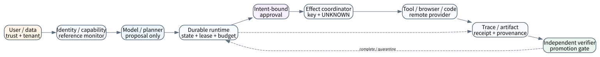
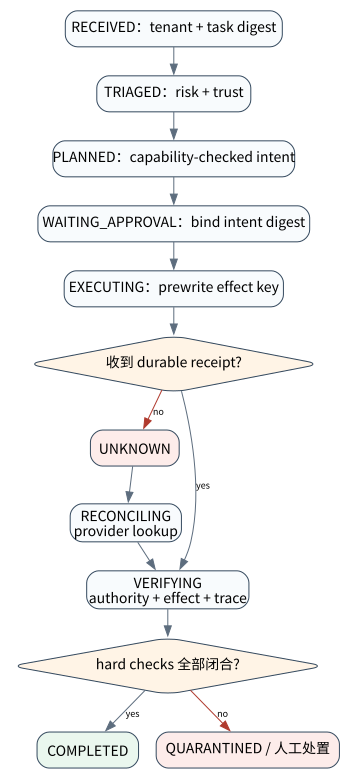

# 综合案例：AgentOps 平台的端到端闭环

> **本章核心判断**：生产 Agent 的完成条件不是“模型返回答案”或“状态写成 FINISHED”，而是目标、身份、权限、计划、审批、外部 effect、持久状态、trace 与独立 verifier 收敛。任一边界不确定时，系统必须保留 UNKNOWN/QUARANTINED，而不是生成一个乐观结论。

本章不是再引入一个框架，而是把前 39 章压缩成可执行 reference architecture。它同时展示哪些机制能在本地证明，哪些必须依靠官方 SDK、真实 provider、browser/coding benchmark 和跨 host/container 外部证据升级。



## 问题背景与学习目标

单独看，prompt、RAG、tool call、workflow、MCP/A2A、trace 或 Docker 都很容易演示；系统风险出现在它们的接缝：模型把不可信数据解释为指令，审批未绑定最终参数，重启后重复 effect，跨 tenant cache 泄露，评测读取被污染环境，发布改变 checkpoint 语义。

完成本章后，读者应能：

- 从业务目标定义 task/effect/safety/SLO invariants；
- 设计 identity/capability、runtime state、effect ledger、evidence 与 evaluation 控制面；
- 把 happy path、拒绝、timeout、crash、duplicate、tamper 与 recovery 纳入同一状态机；
- 区分 L1 机制、L3 containment、L4 recovery 与 L5 external evidence；
- 为 OpenAI 或本地模型保留相同 provider-neutral system contracts；
- 制定从教学 reference 到生产 pilot 的分阶段验收，而不把未运行组件写成事实。

## 核心概念与系统直觉

> **Invariant**：`COMPLETED` 只有在 authority 有效、approval 绑定 intent、外部 effect 唯一且已协调、durable trace 完整、独立 verifier 通过时才可写入。

**数据平面**携带用户输入、retrieval、memory、artifact 与 provenance；所有内容有 trust label，数据不能自我升级为指令。

**决策平面**由模型/规划器产生 proposal；它是概率性组件，可替换 provider，但没有直接副作用权限。

**控制平面**拥有 run state、budget、lease、approval、capability、cancellation 与 deployment version；它将开放决策约束为有限状态转移。

**执行平面**包含 tool/browser/code/database/remote agent；每个 effect 有 canonical intent、idempotency key、timeout/receipt 和 sandbox。

**证据平面**保存 event/span、artifact digest、effect receipt、environment observation、verdict 和 build provenance；它服务恢复和评测，而非只做监控截图。

**治理平面**决定数据/权限/保留/人审/发布/incident；模型能力提高不能绕过组织责任。

## 原理与理论基础

将 run 表示为受约束的部分状态：

$$
X=(Task, Principal, Context, Plan, Capability, State, Effect, Evidence, Verdict, Version)
$$

每个 transition $T_i$ 需要 precondition、input digest、authority、durable write、effect semantics 与 postcondition。全局完成条件是合取：

$$
Complete=GoalVerified\land AuthorityValid\land EffectsReconciled\land TraceIntact\land PolicySatisfied
$$

不存在一个通用 ACID transaction 覆盖模型 provider、浏览器、GitHub、支付和数据库。系统因此需要至少一次 transport + semantic idempotency + UNKNOWN + reconciliation/compensation。Exactly-once 常是业务语义，不是网络事实。

安全与可恢复性来自 non-amplification：不可信输入不能增加 authority；子 Agent 不得获得父 Agent 没有的 capability；重试不能改变 intent；新版本不能绕过旧 effect key；verdict 不能由被测 Agent 自签。

## 关键机制与执行流程



1. **RECEIVED**：绑定 tenant/principal、task/version/input digest 与预算；
2. **TRIAGED**：风险分级、数据 trust、是否需要人工/隔离/只读；
3. **PLANNED**：模型生成结构化 intent，runtime 验证 schema、capability 与资源；
4. **WAITING_APPROVAL**：高风险动作以 intent digest 绑定审批人、期限和单次使用；
5. **EXECUTING**：预写 effect intent/key，再调用外部系统；
6. **UNKNOWN/RECONCILING**：响应不确定时禁止盲重试，按 key 查询权威 provider；
7. **VERIFYING**：独立读取 receipt、环境终态、trace chain、budget 和 policy；
8. **COMPLETED/QUARANTINED**：只有 checks 闭合才能完成；否则保存 evidence 并进入人工/补偿。

## 从原理到实现

Capstone 用纯 capability preflight 与**由调用方显式传入**的审批记录把 proposal 变成受权 intent，再用两个 SQLite 数据库模拟独立 coordinator/provider。下面 `demonstration_approval` 只生成可复现实验夹具，**不是**真实人审、身份认证或防重放证明；生产接入须由独立审批服务签发、验证审批人、期限、run/intent 绑定和单次使用：

```python
orchestrator = CapstoneOrchestrator(workdir)
approval = orchestrator.demonstration_approval("run-40")
result = orchestrator.run("run-40", approval=approval)

assert result["capability_allowed"]
assert result["approval_bound"]
assert result["effect_count"] == 1
assert result["trace_verified"] and result["verified"]
assert result["path"][-1] == "COMPLETED"
```

丢失远端 ACK 时，真实状态链比“重试一次”多出两个不可省略阶段：

```python
approval = orchestrator.demonstration_approval("run-40-fault")
result = orchestrator.run("run-40-fault", approval=approval, lose_ack=True)

assert result["path"][5:7] == ["UNKNOWN", "RECONCILING"]
assert result["recovery_used"]
assert result["effect_count"] == 1
assert result["path"][-1] == "COMPLETED"
```

`CapstoneLedger`只接受允许的 transition，并把 `previous_hash + canonical event` 链接；校验还检查序号连续与状态转移合法。这个本地 hash chain 只能发现未同步重算哈希的篡改，不是 WORM 或第三方锚定。`EffectCoordinator`在远端 commit/本地 receipt 之间注入故障；reconcile 查询 provider 后修复本地状态。capability preflight 不再提前记成 effect；模型 provider 不参与这些事实判定。

## 主流系统实现对照与源码阅读入口

| 能力层 | 可选实现 | 集成时必须保留的契约 |
|---|---|---|
| Model/agent loop | OpenAI Agents/Responses、ADK、LangGraph、MAF、本地模型 | structured intent、usage、provider IDs、cancel |
| Interop | MCP official SDK、A2A official SDK | negotiation、capability、task ownership、auth |
| Durable runtime | graph/workflow/checkpoint engine | version、lease、replay、external effect boundary |
| Browser/coding | WebArena/SWE-bench/OpenHands 等 harness | environment reset、artifact、tests、trajectory |
| Deployment | OCI/Compose/Kubernetes/VM sandbox | identity、secret、resource、health、rollout |
| Evidence/eval | OpenTelemetry、SQLite/object store、eval service | provenance、redaction、tamper evidence、verdict |

本仓库 `evidence/l5/` 和独立 upstream labs 保存官方 SDK/真实 runtime 证据；没有运行的外部 benchmark 明确标为 `EXTERNAL_NOT_RUN`。框架名不等于 evidence，必须追到具体 package/version、input、raw output、assertion 与 digest。

## 设计方案与方法对比

| 边界 | 轻量教学实现 | 生产实现 | 迁移风险 |
|---|---|---|---|
| State | SQLite 单机 | HA SQL/event log/workflow engine | transaction/lease 语义改变 |
| Effect | 模拟 provider SQLite | SaaS/API/browser/robot | 查询能力与幂等差异 |
| Identity | 固定 principal/capability | OIDC/workload identity/ABAC | tenant/代理链丢失 |
| Approval | 本地 digest record | 企业审批/双人/过期/撤销 | callback 重放/stale action |
| Trace | 本地 hash chain | OTel collector + WORM/signature | redaction、采样、collector compromise |
| Model | scripted/小模型 | 多 provider/router | 漂移、区域、成本与数据政策 |

迁移原则是保持 contract，而不是照搬类名。任何替换都用 normal/fault/restart/security/eval 套件验证。

## 可复现实验

### Lab 40A — authority/effect/evidence 正常闭环

```bash
PYTHONPATH=src uv run python examples/chapters/ch40_capstone.py
```

**实际输出。** capability、参数绑定审批、单次 effect、hash-chain 与终态 verifier 共同闭环：

```json
{"path":["RECEIVED","TRIAGED","PLANNED","WAITING_APPROVAL","EXECUTING","VERIFYING","COMPLETED"],"capability_allowed":true,"approval_bound":true,"effect_count":1,"trace_verified":true,"verified":true,"evidence_level":"L1_MECHANISM"}
```

### Lab 40B — 远端已提交但 ACK 丢失

```bash
PYTHONPATH=src uv run python examples/chapters/ch40_capstone.py --fault
```

**实际输出。** provider 已提交而 ACK 丢失时先持久化 `UNKNOWN`，重开协调器后查询远端并恢复，不盲目重放 effect：

```json
{"path":["RECEIVED","TRIAGED","PLANNED","WAITING_APPROVAL","EXECUTING","UNKNOWN","RECONCILING","VERIFYING","COMPLETED"],"effect_count":1,"recovery_used":true,"trace_verified":true,"verified":true,"recovered":true,"evidence_level":"L4_RECOVERED"}
```

**关键断点与验收。** 检查 capability、approval intent digest、provider commit、UNKNOWN durable state、lookup/reconcile、event hash chain 和 completion verifier。B 必须重启语义可恢复且 effect count 为 1。完整步骤见 [Lab 40A](../../../labs/core/lab-40A-capstone.md) 与 [Lab 40B](../../../labs/core/lab-40B-capstone-fault.md)。

## 工程场景与系统设计

以“调查告警并在审批后封禁恶意账号”为例：Research Agent 只读日志；Coding/Data Agent 在隔离 workspace 生成证据；Planner 提出 `account.suspend` intent；reference monitor 检查 tenant/account/case capability；人类审批绑定 account、期限与理由；adapter 用 effect key 调身份系统；verifier 查询账号状态与审计事件。

系统的最小生产拆分：API/auth、run/queue/checkpoint store、model gateway、tool/capability gateway、sandbox workers、approval service、effect/reconciliation worker、trace/artifact store、evaluation/promotion service。共享数据库不是必须，明确 ownership 与协议才是。

## 故障模型、失败模式与排错

- **身份丢失**：模型/远端 Agent 代替 principal；沿 delegation chain 与 workload identity 排查；
- **stale approval**：参数在审批后变化；重算 intent digest 并拒绝；
- **重复 effect**：timeout 后盲重试；检查 key/operation/args、provider lookup 与 receipt；
- **checkpoint 漂移**：新版本无法解释旧状态；按 runtime/schema version 路由；
- **trace 不可信**：缺 span、篡改、secret；验证 chain/signature/redaction/export；
- **tenant 泄露**：cache/queue/artifact/log 忘带 tenant；在 storage query 层 fail closed；
- **错误完成**：只看 final answer/status；重新跑独立 outcome/effect verifier；
- **发布回归**：模型或工具升级改变行为；manifest-paired eval + canary + rollback。

应从 durable truth 开始排错：run/effect/approval/version/trace，再看模型解释。不要用重跑覆盖 UNKNOWN，也不要删除失败 evidence 让仪表盘变绿。

## 性能、可靠性与工程化

端到端 SLO 要拆 stage：queue、model TTFT/total、tool、approval、effect、reconciliation、verifier；报告 p50/p95/p99、throughput、retry amplification、UNKNOWN age、duplicate prevention、cost/verified success 和 human workload。

可靠性目标应按风险定义 RPO/RTO。可重算文本允许丢临时 cache；approval/effect/ownership 不能丢。定期演练 worker crash、DB failover、provider timeout、secret rotation、model rollback、collector outage 和跨版本 resume。

## 技术边界与设计取舍

本地 Capstone 的两个 SQLite 数据库真实执行 transaction/reopen/reconcile，但仍没有真实网络、第三方 provider、OIDC、HA、消息队列或人为审批延迟。L4 结论仅适用于该受控故障模型。

模型层可以换 OpenAI 或免费/开源小模型：API key 只从环境读取，模型输出只作为 proposal，记录实际 model/request/usage；本地模型记录权重/量化/runtime digest。两者都不能绕过权限、effect 和 verifier。未运行的模型不得附成绩。

## 前沿研究与演进方向

截至 2026-09-11，Agent systems 正从单框架 loop 走向官方 MCP/A2A 互操作、durable execution、workload identity、agentic benchmark、tamper-evident evidence 和标准化治理。NIST Agent Standards Initiative、OpenTelemetry GenAI conventions、语义 transaction、真实 browser/coding environments 都在逼近同一问题：怎样让跨边界行为可归因、可验证、可恢复。

尚未解决的核心问题：跨组织 delegation 的 end-to-end authority；异构 runtime 的 checkpoint/effect 迁移；真实长期任务的安全 benchmark；隐私保护下的 trajectory 共享；模型/脚手架/环境贡献分解；自动改进系统的 evaluator integrity；物理世界 Agent 的统一 failure semantics。

### 深度审计与研究证据链

本书的证据梯度是：L1 机制断言；L2 独立观察；L3 系统检测并阻断；L4 重启/协调后恢复；L5 官方 SDK、真实 provider/environment、版本与 raw artifact 可由第三方复核。页数、测试数量或框架清单都不能替代等级提升。

下一轮高价值工作应集中于：官方 MCP/A2A SDK 双向互操作；OpenAI Agents/LangGraph/ADK/MAF 真实进程重启；WebArena/SWE-bench 等真实 harness；amd64/arm64 或不同 host/container 上清晰定义的 canonical/semantic reproducibility。失败必须发布，不得只留最佳 run。

## 本章总结与进阶实践

完整 Agent 系统是一组相互制衡的控制面：模型提出，权限约束，runtime 持久化，effect 可协调，evidence 可验证，evaluation 决定发布，deployment 保证身份，governance 承担责任。任何单一“智能”都不能替代这些边界。

进阶问题（答案见[附录 M](../appendix-m-part7-solutions.html#ch40)）：

1. 为什么 `COMPLETED` 必须是多个事实的合取而非一个状态字段？
2. 两个 SQLite 已经分离时，本实验仍与真实远端 provider 有哪些差距？
3. 为什么 approval 必须绑定 canonical intent digest？
4. L4 recovery 与 L5 external evidence 的差别是什么？
5. 如何把本 Capstone 分阶段升级为可公开复核的生产 pilot？
